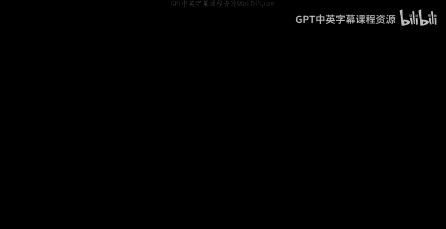
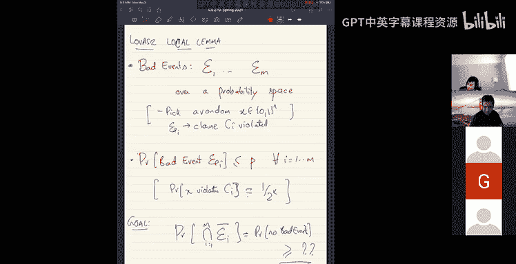

# 26：Lovász局部引理及其构造性算法



在本节课中，我们将学习Lovász局部引理，并重点探讨一个用于K-SAT问题的构造性算法。我们将从一个具体的例子入手，逐步理解算法的核心思想及其巧妙的分析过程。

## 概述

Lovász局部引理是一个概率论中的重要工具，它用于证明在多个“坏事件”并非完全独立，但每个事件仅依赖于少数其他事件的情况下，所有坏事件都不发生的概率大于零。本节课我们将通过K-SAT问题，学习该引理的一个构造性证明版本，即不仅证明解的存在性，还能通过一个高效的算法找到这个解。

## K-SAT问题定义

首先，我们回顾K-SAT问题。给定n个布尔变量 `X1, X2, ..., Xn` 和m个子句 `C1, C2, ..., Cm`。每个子句是k个文字的析取（逻辑或）。例如，一个子句可能形如 `Xi1 ∨ ¬Xi2 ∨ Xi3 ∨ ... ∨ Xik`。目标是找到一个变量的赋值，使得所有子句都被满足（即为真）。

对于一个随机赋值，任意一个特定的K-SAT子句被满足的概率是 `1 - 1/(2^k)`，因为只有唯一的一种赋值（所有文字为假）会使其不满足。

## 核心定理

我们旨在证明以下定理：
> 对于任意一个K-SAT公式，如果每个变量参与的子句数量小于 `2^k / k`（减去一个常数，如20），那么该公式必然是可满足的，并且可以在多项式时间内找到一个满足的赋值。

这里的“变量度”指的是任意一个变量出现在不同子句中的最大次数。

## 算法描述

上一节我们介绍了定理的目标，本节中我们来看看证明该定理的算法。这是一个非常简洁的算法。

**算法伪代码如下：**
```
输入：一个K-SAT公式 φ
1. 随机生成一个初始赋值 X。
2. While (存在被违反的子句 C)：
      调用 Fix(C) 函数。
```

**Fix(C) 函数定义如下：**
```
Fix(子句 C):
   1. 对子句C中的所有变量，重新随机赋值。
   2. While (存在与C共享变量的、被违反的子句 D)：
          调用 Fix(D)。
```

算法从随机赋值开始，然后递归地“修复”那些不满足的子句。修复一个子句意味着将其包含的所有变量重新随机化。这个过程可能会破坏其邻近子句的满足性，因此算法会递归地修复那些新产生的违反子句。

## 算法正确性分析：第一部分

算法的分析分为两部分。首先，我们证明算法的外层循环（第2步）执行次数有限。

**关键观察：** 在每次调用 `Fix(C)` 并返回后，整个公式中被满足的子句数量至少增加一个。

**原因如下：**
考虑任意一个在 `Fix(C)` 调用前就被满足的子句D。在 `Fix(C)` 的执行过程中，D的状态可能从满足变为不满足。但是，算法规定，一旦一个子句因邻居子句的修改而变为不满足，算法会立即递归调用 `Fix(D)` 来修复它。因此，在 `Fix(C)` 最终返回时，D必然是满足的。同时，最初触发修复的子句C在修复后也必然被满足（尽管中间可能又被破坏，但最终会被修复）。因此，每次成功执行完一次外层循环（即调用并返回一次`Fix`），至少有一个子句从永久不满足变为永久满足。

由此可得，外层循环最多执行m次（m为子句总数）。因此，只要内层的递归过程 `Fix` 能够终止，整个算法就会在多项式步数内结束。

## 算法正确性分析：第二部分

接下来，我们需要证明递归函数 `Fix` 本身不会无限运行下去。我们将采用反证法，并借助一个精巧的“通信游戏”思想。

**证明思路：**
假设算法运行了非常多的步骤S仍未终止。我们将模拟算法与一个“调试器”之间的单向通信。
1.  **算法发送给调试器的信息包括：**
    *   每次调用 `Fix(C)` 时，发送子句C的标识。
    *   每次 `Fix(C)` 返回时，发送一个“返回”信号。
    *   在算法运行了S步后（或假设的终止点），发送当前的完整赋值Y。
2.  **调试器的能力：** 在收到以上信息后，调试器可以**逆向推导**出算法的全部随机比特，包括初始赋值X和每次重随机化子句时所用的随机数。

**逆向推导如何工作？**
调试器从最终赋值Y开始，按照调用 `Fix` 的逆序进行处理。关键点在于：算法只在子句被违反时才重随机化它。对于一个K-SAT子句，有且仅有一种赋值会违反它。因此，当调试器知道一个子句C被重随机化，并且知道重随机化后的状态，它就能唯一确定重随机化**之前**该子句的变量赋值（即那个唯一的违反赋值）。通过这种方式，调试器可以一步步倒退回初始状态X，并恢复出所有中间步骤使用的随机比特。

**通信比特数计算：**
现在我们来计算算法发送了多少比特，以及调试器恢复出了多少比特。
*   **算法发送的比特数：**
    *   最终赋值Y：`n` 比特。
    *   S次调用/返回的信号：`O(S)` 比特。
    *   子句标识：
        *   对于外层循环调用的子句（最多m个），每个需要 `log m` 比特来标识。
        *   对于递归调用的子句，由于它一定是当前正在处理的子句的邻居，所以只需用 `log d` 比特来指明是哪个邻居即可，其中 `d` 是一个子句的最大邻居数（与变量度相关）。
    *   总发送比特数约为：`n + O(S) + m*log m + S*log d`
*   **调试器恢复的比特数：**
    *   初始赋值X：`n` 比特。
    *   S次子句重随机化：每次需要 `k` 比特随机数来给k个变量赋值。
    *   总恢复比特数为：`n + S*k`

**导出矛盾：**
如果算法运行了非常多的步骤S，使得 `S*k`（恢复的比特数主要增长项）显著大于 `S*log d`（发送比特数的主要增长项），我们就得到了一个矛盾：调试器用较少的通信量恢复出了更多的信息。这违反了信息论的基本原理。

具体来说，当 `k > log d + O(1)` 时，对于足够大的S，就会产生矛盾。在我们的设定中，变量度小于 `2^k / k`，因此子句的邻居数 `d` 也小于约 `2^k`，从而 `log d < k`。条件满足，故假设不成立，算法必然在多项式步数内终止。

## 与Lovász局部引理的联系

上一节我们分析了一个具体的构造性算法，本节中我们来看看它背后的普遍原理——Lovász局部引理（LLL）。

**LLL的非构造性表述：**
考虑一个概率空间和一组“坏事件” `E1, E2, ..., Em`。假设每个坏事件发生的概率至多为 `p`，且每个坏事件最多与`d`个其他坏事件相关（即独立于其他事件）。如果满足：
`p * e * (d + 1) < 1` （其中 `e` 是自然常数）
那么，所有坏事件都不发生的概率大于零。

在K-SAT的例子中，坏事件是“子句i被违反”，其概率 `p = 1/(2^k)`，依赖数 `d` 与变量度相关。LLL的非构造性证明直接保证了满足条件的公式必有解，但没有给出找解的方法。

**构造性与非构造性证明：**
我们之前学习的算法，为K-SAT这一特殊情况提供了LLL的一个**构造性证明**。这意味着它不仅证明了解的存在，还给出了一个高效的算法来实际找到这个解。这是算法研究中的一个美妙成果，因为很多存在性定理（如纳什均衡的存在性）并不容易转化为构造性算法。

## 总结



本节课我们一起学习了Lovász局部引理及其在K-SAT问题上的一个精彩应用。我们首先描述了一个简单的递归随机算法，然后通过一个基于信息论思想的巧妙分析，证明了该算法能够在多项式时间内找到低度K-SAT公式的解。最后，我们将此结果与更一般的、非构造性的Lovász局部引理联系起来，理解了构造性证明的价值所在。这个算法展示了概率方法与算法设计结合所能产生的强大力量。