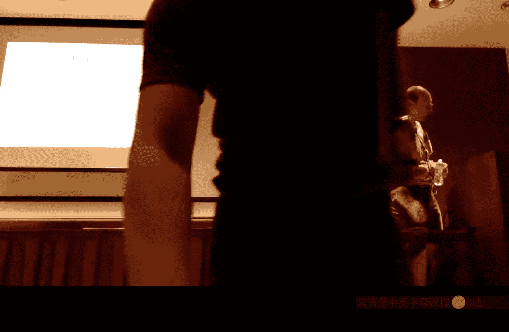

# 加州大学伯克利分校【中英⚡虚拟机与托管运行时｜CS294-113 Fall 2015, VMs and Managed runtime】 p12 P13 -BV1qBqPBYEy1_p12-

To during that afternoon by talking a little bit about。那是需俾。Which originate from。嗯。

Mostly from two causes， and the more important one is to try and avoid using CC++ and there are all kinds of problems。

You've probably encountered in your own BM development from using CRC++。

So I there's kind of this longer less he up， so no particular order。You go through these。

 so one is you know CNC+pho are not type or memory safe languages。

That's good when you're doing something like writing a GC because you need to bend the rules and do strange bit manipulation memory manipulations。

 but that tends to be maybe only five or 10% of the ya code when you're writing the compiler。

You don't need something that's breaking those kinds of rules and doing funny cast。

And so the lack of safety there just makes development much much harder because it means that when you make a mistake。

don't find out about it until runtime。思います。啊。So that's been an issue in terms of productivity Another issue has been。

To build a VM using CSC++ you usually have to break the rules in a way that relies on some kind of unspecified property。

 something that a particular compiler does， a layer that it adopts。

 which if that happens to change in the implementation then you're host so I showed you for example。

 the way the tables were used as map pointers in the selfimment of years ago and maps a completely's completely nonstand。

which language span does not guarantee that behavior in any way。

 and so if you took that exact sense or based and compile it with a different plus political compiler。

 you find it wouldn't work as I。Years ago。So those are。

That's a couple of problems the same perhaps's the more serious one。

Is that if you develop a CNC++ you're using the black box compiler。

 which is compiling everything ahead of time and which you can't really get into the internals of in any strip in any straightforward manner。

 so for example， if you want to find out where all of the pointers are on the stack。

 well it's not going to tell you that， it doesn't keep that information typically and even if it did。

 there's no API for getting out at the end，People have tried， for example。

 using elf debugging and other debugging information to get that kind of stuff。

 but in general it's not reliable enough。Accuracy there for a debugger is rarely good enough to build a garbage collector。

So you've got this sort of closed world， which you can't introspect on in an easy way。

And also you typically can't generate code at runtime through the CFC++ compiler。

 either there's no API or if you can devise one， the compiler is typically so slow that it's not really practical。

So you have to build your own compiler anyway。Because of those problems。嗯。

When you do build your own compiler or you have our interpreter。

 then you have to deal with adapting between the calling conventions of your compiler and the calling conventions if the C compiler click click。

listten to a whole bunch of problems there things like floats being in their own places。

 stuff like that， there's certain things that the C compiler just doesn't do for you like it doesn't do stack flow checks so if you're building a language that's stack safe in the stack。

How do you deal with calling into the seat runage？哦。If that happens to cause the floods。

 it's very difficult to deal with that。So there are all sorts of issues there。

 the memory model of the language is often the mismatch from the memory model of the language you're implementing。

Ohello。While it's low level for most purposes， for some purposes， it's not low level enough。

 so many of the examples I showed you illustrating things like inland caches。

 I had to express an assembly code because there is no C mechanism where you can express those and get the machine code。

So it's kind of too low level for most of the VM， but it's not low level enough for some parts where you really want to fine tune the individual instructions。

Get exactly a particular sequence。And the result is。

 building a VM in CC+ plus a high performance one。requiresres extraordinary skill in a massive amount。

hopefully by now you'll comprehend it， you know， it takes a lot of work to do this and make something that works really well and that's reliable enough。

The pool hasn't that up for production years。So a number of people have instead tried to go down another route by writing VMs in other languages。

Typically a higher level language。Whi has better data structuring and safety properties so that when you write things like compilers。

 you can take advantage of those properties and get more productivity from them。

Arrors a core sooner or that you can build nicer abstractions than you can。

Straightforwardly certainly you'd see it's very difficult to build good abstractions。

 C++ makes it a little easier but still by no means ideal。嗯。

Sometimes the attempt has been altered to provide features which give you the low level control when needed to avoid assembly code。

And it'd be nice if you could have both at the same time to be able to be higher level。

 but dip down for low level control when you really need it。

And what you'd also like to have is very uniform handling of all of the things that nitty grty that the secretpir is not going to take care of you locating pointers。

 placing safe points in generated code， bridging calling conventions。

 things like that and ideally if that's what could be done for you automatically so you write you write an implementation that deals with those in one place。

 somewhere in a language implementation and then in natural code of the VN。

 you I to worry about those things。The language that you're expressing the VM in automatically。

Ca that would be ideal。So those are the kinds of things you would want to get。

 the alternate direction， which kind of isn't related。Strongly， but it's worth mentioning briefly is。

The desire of building stacked。Implementations in a higher level language that run on an underlying VM。

So this is another way of building a language implementation。

 which is just reuse somebody else's VM and map onto it。

In theory that sounds like a good idea in practice it's somewhat varied。

 there have been a whole bunch of these attempted， so there's Wikipedia pages that list all the JBM languages that run on top of the JBM all of the。

CLI languages。The don't have CI。There have been a bunch tried much earlier than that。

 a couple that I worked on long ago， small talk in South and Java in。So it's not a new idea。

It addresses the safety and abstraction issues if you get to reuse one of these higher level languages。

 but it doesn't really deal with any of the other issues。And the difficulty is， of course。

 when there are semantic mismatches between the thing you're implementing and the VA that's underneath。

 often that either compromises performance or induces some horrible complexity or often。

So the path that's been tried most commonly to get a high performance PM expressed in a more suitable language is to build what's called a metacircular interpreter。

啊。Now。The approach I'll describe has a particular compiler architecture to it。

 you can also build metacicular interpreters by writing an interpret it for a language in itself and running it on its own VM and that has been done so for example。

 if you get the small talk definition from the early 80s in the back there is a small talk reference implementation written in small talk。

 there was a Java implementation and done at somelase by a colleague written in Java that runs on a Java VM there's certainly possible。

 but there's a massive performance penalty to be paid by having the extra level of interpretation。

The sick people there a lot of people。更しし。ok。Does that the same kind of slow down？Yeah。

So 100 to 1000， I looked up there's a technical report on the Java and Java implementation that was done in the late 90s at summer labs and I think they measured a 7004 slow gap。

running but they could run stacked and they even rather stacked on top of the stack。

Another 700 will multiply our on top。嗯。So that's not the way。We want to go。

 And now another way you could go is sort of avoid， avoid the issue of。

doing your own thing by doing everything in C， compile the C do don't don't just handwrite the C。

 generate C from some kind of higher level language that's another tack that's been taken。

And this has been tried in a number of different PMs， the inspirational。

Example here is the squeak VM that was developed in the late 90s of small talk。

Eulate it a number of times in different。啊。Scennas and the attractions here are。

 firstly that you leverage the fact that C is universal right。

 pretty much if you have a processes is the first thing that's going to appear on that after an asem is going to be a C compiler and so you can leverage the fact that there's a C compiler。

Avoid the low level machine details by using C as portable。

It doesn't address some of the low level issues， you know the conventions and fine tuning of production sequences。

 but you can build into the translator， things like the oop tracking。

Code that is needed by the GC so you can put the expression。

 the tracking of the variables on the stack into the thing that generates see from your high level language and so then the high level language you don't have to worry about that stuff。

嗯。As I mentioned earlier， C compilers are typically too slow to be used at runtime。

As a dynamic compiler， you know， you end up with a beta。 that's enormous。

So they can lever around that。Appellation accepted very。Exceptional child circumstances。

 people are trying this now with LLVM fairly seriously there' have been a bunch of attempts using LLVM as a dynamic。

Compilr for a variety of languages， it all depends on what you're compiling and how long your program is run and what the overhead is。

 you know some systems they've decided it's just too slower they seem to be using it fail。

So it's kind of an mixed。the times on。Or a situation。

Now look let's look at the squeak in a little bit more detail。

 the sququeak was a small talk system developed in the late 90s by several of the original Xer Park。

 small talk pioneers and some other folks all while they were at Disney。即系。

It's implemented similar to the Pipee approach， it's implemented in a subset of small talks of pipe piee takes。

 python and takes a subset of it。Which is。Able to express the constructs that are needed and yet still be efficiently implemented squ takes a similar approach they have a subject called slang。

Which is a fairly restricted subset of small talk。they use that to express the。

The basic definition of the virtual machine， you know， it's based on the blue box definition。

 so it requires。That requires actually very little。Sophistication of small talk。

Veryly straight ahead。哦。Loops and tasks and methods。

And one of the advantages of that is that because it's written in small talk。

 when you run it on small talk PM， you can do the development of your VM in small talk you know。

 a performance penalty because it's being run interpreted on。A underlying thing。

 but it is still a very malleable implementation。But then what they do is。Yeah啊。

They're able to translate it fairly efficiently to see and then compile the C to make a new VM so the development cycle is that you work within the VM developing sort of an emmbulation of the VM to poor a performance。

 but when you're ready push the button，A bunch of C gets emit the see compile the cranks up and your binary is emit and then you can test the you。

So it's a slightly extended development side。Notice that because of the problems with using C as a dynamic compiler。

 even those quick since this original implementation。

 the original implementation was an interpretist， that since then various compilers have been developed for it。

 but none of them go via city。D generation。啊。This particular。

System also inspired a similar Java virtual machine developed at Suns called S。嗯。

That was used in some' c of platform。Its developed and deployed。want 2000s。

And have the same sort of advantages， could generate something and fairly small and something。So。

 but what we really want to talk about is how to get a metacicular implementation that has a good performance。

 which means you know， sophisticated compillation。呃。As well as being expressed in。

Which hopefully is more productive。For writing L。So the approach。

 which has been used in a variety of systems now。Is to use an architecture in which a single compiler for the language in which you're expressing the VM can be used both to build the VM statically and can also be used dynamically to compile the applications that's running on that same VM。

就诶。Let me run you through a little bunva。Didn't demonstrate how this is done。 So let's start。

 I'll do with an example。Of courses of Java stuff。Yes。Just to make it concrete。

 but let's say we have a pre existing job of man we have our。

Bcode compiler that takes source and generates bycodes。

Wwhichch of course has been compiled through itself previously so that's the green thing here and the first thing we do is we write a compiler for our language in this case Java which is going to generate machine code。

 not bycode so this compile is probably going to take Java bycode and it's generate machine code it's a binary compile。

That's the source that's in the top and when we run that through。How about Bcode compiler L pops？

The bike code， of course， for that compiler that we read。 So now we can take the。Bcode。

 run that on top of our VM and feed it the source of our compiler and the source of our VM。Together。

And that will then pop out。A binary array。Because it's a。

 it's a compiler that generates machine code。 So it's going to take the。嗯。

It's going to take the source of our VM and generate the binary。

 and then on our binary we can take our application by code。

Run that on top of the VM and of course inside that VM is the very self Sam compiler thats the compile itself。

 and that can generate the machine code at long time。That's going to execute our application。So。

 that's the。That's the approach that's being。Aopted， it has some advantages。

 we're using the same compiler for the VM as the application。

 which means there's a carbon uniform calling convention through we're not dealing with something。反吃。

Because it's the same compiler if we keep enough information around。

 we can inline VM code into our application， whether when the application calls into VM primitives。

 we don't need to have a hard boundary there that can be a soft boundary now。

 which is open to the compiler。And we have a common framework now for handling things like save points and new tracking and such like。

 which means we build that stuff into our compiler once and the source code of our VM for the most part。

 doesn't have to worry about that at same。Care for us。Now， there are。Some complications。

 so we still must be able to write the runtime including a garbage collector。

 so you can't do that in Java as it stands you can take the standard language。

 there's just no mechanism。For building something like that。

 and so we need some unsafe language feature， some extensions for which we need to manipulate memory。

And even with that， life is not necessarily going to be so straightforward because we're writing the garbage collector inner garbage collected language。

And so we have to use a subset of that that avoids allocation or that if it does allocate。

 allocates in a very constrained way， which isn't going to step on its own， you know。

 coatattails and cause problems。 So there' there's kind of， you know， I could probably spend。

A month from this one bullet point alone， but doing the GC in a GC language is tricky。

There are all sorts of complications that induces which weren't there before when we were at in CNC。

2， so that's a downside of view。Look at some examples。

The most well known one for sure is the Jkes Research VM。

 which was initially known in the papers as jalapeno。

Developed by IVM in the late 90s as a research vehicle， it's been open sourced。

 has been used very widely in academia。Java， VM research and the language implementation research。

 those's literally hundreds of papers。啊。Outp there with where they've used this system has the basis for the research。

 and， and it's written in Java。 It's a complete Java VM written in Java using that。

Framework that I just described that approach， but they've enhanced the。

Java with some magic to do the GC work。Non safe operation。

So it includes a very flexible and rich GC system， system called MMTK。

 which was I think originally written in CC++ and then was ported and contributed by academics into the system and that gives them。

A whole bunch of very。Well defined flexible interfacess for building garbage collectors and there have been a bunch of different garbage collectors implemented to these interfaces so you can sort of mix and match a wide variety of different GC algorithms。

In Jacks， they a whole bunch of different。It uses at least two compilers。

 if you look at the original paper， they have three compilers for no obvious reason that I can discern。

But two at least are required， there's a baseline Jit compiler that's used force simple execution of bycodes。

And then an optimizing compiler that's used run time adaptively to。To run optimize code。

 there's no interpreter in this system。It has a sort of similar framework to the ones I've described in previous lectures for detecting hotspots and doing dynamic optimization。

Deoptimization and on stack replacement all of that is basically more or less the same as the systems that I've described the big difference in methodology is that you write your system in Java and。

And then a VM build that takes all of the Koji row， compiles it up。

And part of that code is run to generate an initial heap and all of the code and the objects are dumped into a heap image。

And then when you actually run your VM， all it does is basically initialize the he with the content of this file with a tiny little sh that's written probably in C loads that into memory and off it goes and it's kind of the self-contained world during the process of writing that image out a process called tree shaking is used。

 which finds methods that you might have written that are no longer required in the target image so for example。

 if you're building something production use and you don't need all the debugging support。

Striip all of that stuff out。There might be other code that's there that's just infrastructure that's not required in the final image。

 so all of that can be shaken out if there are fields in objects that are no longer referenced。

 those can be eliminated， things like that， all but just static optimizations that can be done to make the final binary version of the VM smaller and faster。

As for the extensions。Well， so the first thing to notice is you're implementing the language that you can add anything you like because you're the implementer。

 you don't have to worry about what the committee says as long as as long as the end users can't see the extensions。

 you can put anything you want in and that's sort of the power of this approach sprinkling whatever new features you need。

The way it's done typically is。There's sort of three components to it。

 one is you add data types to access the kinds of machine level entities that you need to manipulate in your program。

 so you might build a primitive data type that's recognized by the compiler for a machine word or a pointer which enables you to do a address a。

Then you need to add methods into those types of classes that allow you to do operations on those things and typically these methods。

 there's a signature available。In the class library。

 but the compiler just knows what those things are supposed to do and intrinsicsifies them emits the machine code directly to do what the underlying operation is。

And finally， all of that stuff gets wrapped in layers of typing and annotations to make typically to make the intent very clear as to way you're using them and when you're being unsafe。

 that you know you're being unsafe， so typically you have to write some kind of declaration that says I really know what I'm doing here please don't get in the way。

I manipulating bits of memory and so typically part of the build process will check those annotations to make sure that when you're using the unsafe stuff you've said you were using it。

Unsafe stuff and it's not leaking to places where it shouldn't be。

And the compiler is typically modeed so that that stuff isn't available to end user applications。

 so when the compiler is embedded in the final VM and it's running some end user application。

 it can call into all this stuff and subvert time system。

So there are other annotations that are often。Interpreted by the compiler again。

 you're implementing the language so you can recognize anything you like。

 early versions might have me used structured comments to do this。

 More recent implementations typically use Java annotations。

And the annotations can be used to do things like driving in linening。

 give hints because of course the compiler is running statically and so it can't use adaptive optimization to optimize the PMM。

 it has to do a good ahead of time optimization and so giving it hints。

For how to do that as important， you might have other annotations for bootstrapping purposes that say this code is to be evaluated while you're writing the image and but once you're in the image and just values to something out as a constant upon the result of the earlier evaluation these are sort of extralingual features that you need to describe these two phase separately and similarly when you're writing the garbage collector。

 you need to exclude things like save points from being generated or interrupts or whatever and so they'll be annotations that you can write there that direct the compiler to not to do some things that it would do for user again。

Another VM。的意思 this。Overall kind of approach， that was very different in style as the Kleline VM。

 which was done by Dave Bungger。Some other folks at the Sunlase。

 which is a self VAm written in south。And the idea here was quite different。

 that the goals were different， the idea was to be able to write full self code and have that generate a VM image by basically taking the world of objects that have been created in and having them written out exported。

Using a different interpretation of the standard exporting representation。

 which is just used to exchange so。So the exposure would generate bits。

 which will be embedded in the final decline boot image。

 use the same approach of building an image that loading it。T see sha。

But there are a couple of new things here that are worth calling out in particular there was a lot of attention paid to the debugging story。

 so one of the things that's really difficult when debugging so as you've already experienced when you're writing a CPM。

Some of your code is an assemr and some of it's jitted。

 the debugger doesn't often give you a very good story as to what's going on in the middle of your execution。

 this only gets worse when you're generating code from a compiler that you row because now you have no debugger for that。

 typically because debuggs for Java used to connect VMs。

 they're not used to generate debug statically generated Java。

So you either end up having to build your own tool chain to do all of that stuff， or in this case。

 the way they did it。Was they used one South world to debug one that was being。

boooot strapped up in a different image and so the idea here was to provide refive proxies which were already present in the South world。

Or reimlo them so that they could proxy to similar objects that were running in the other image。

RRPC style model。Of proxy here。 And it gave them a very rich debunkgging environment in which they could。

Inspect the stair of a running VM using an existing VM。

Look at what was going on there in terms that were much more easier to understand than a little out of memory model。

Dumps in social life。And even modify， fix and continue stuff and run。That was sort of an inspiration。

got picked up as your city in another project that was done at Sunla。Called the vaccine VM。

 The vaccine was sort of inspired by K。 This was a jar another job of a VM written in Java。

 I'll show you a picture of the architecture in a second。

 But the the novelties I want to call it in this system were the the way that。

The J compile law was built the way that some of the optimization stuff was implemented and again the debugging store。

It is an architectural picture take I'm from。The main vaccine paper， most of this stuff。

 if you look at it， you should recognize why all of these terms should be more or less familiar。

You know， you got a stop and copy garbage collection and a heAP baseline code。

 this is the baseline compiler， optimizeim code and optimizing compiler， deoptimization， stack。

 stack walking threads， locking natives， all of this stuff is fairly standing。

The interesting parks I want to talk about all the。The way the baseline compiler was implemented。

 some of the tricks used in the optimizing system and also this debugger out of process debugger。

That was used。 So let's start with the。The template gym。

 so the first level execution in this system is not via an interpreter。

 it's via a template gym similar to the one you've implemented。嗯。

The interesting thing here is that the templates themselves are written in Java。

And they're not handwritten in assembly code。At the higher level and then fed into the optimizing compiler。

But to run ahead of time to generate the machine code for the templates。And in fact。

 the compiler is modified to know about this template stuff and to take extra annotations。

which are used in connecting them these things together。

 basically generating the metadata that's used to stitch the template together when you generate the final version of the code。

I'll show you。This example。Again， taken from one of the papers， This is。

The Java code for the integer array load。Bikecode here so this is you know it's not piece of assembly code it's this fairly high level stuff and it's conventional Java code there are these extra annotations that describe stack slot information that are processed by the template processor is an annotation that declares that it's a template for the template jet which bycode is implementing there are annotations that guide the optimizing comp pilot would do in lighting because all of this stuff gets evaluated most of it gets evaluated ahead of time。

And then you can see the code for the actual bycode itself looks fairly high level。

 is calling these operations which are low level primitive operations like getting aid from an object。

 so here is an object being manipulated as a reference so this reference type is especially understood by the magazine compiler。

And this get in operation says， I'm going to get the I thing out from this array and the layout of objects is parameterized in things like schemes that there are sort of basic building blocks of the system and are easily reimplemented so if you want to change the layout of a particular fundamental type。

In vaccine， you go in and you find one of these layouts。

 there are multiple ones in the system and you implement a new one or you select one of the pre-existing ones so you can have all sorts of different customized pieces and get each of these pieces has an interface which isolates it from the rest of the system so switching one out doesn't mean that you have to go through in your entire program looking for all the asterisk dereferencing your pointer and change them to use something else So this gives you a nice structured way of building the system and fairly high levell code that's used to express stuff in a portable way there's no sort of hint of machine architecture at this level that's all isolated in the optimizing compr the processes this generates the template。

So， they。When you actually run the template compiler on this， you've got this code， which， you know。

 is' not super efficient， but it's not bad。For a template yet。And you。

 it's done all of the usual stuff and moved the stack。

Variables in and off the stack and generated the text and the branches and the exceptions and all of that stuff so so it's a pretty reasonable template。

 but that's generated， it's not hand。嗯。Another interesting feature in that was introduced with Maxine is to address the issue of menu writes an optimizing compiler。

 so when you have a VM with an interpreter or a simple jet and an optimizing compiler。

 typically you end up with two or even three different implementations。Of the same thing。

 you have a direct implementation of some operation that's in the interpreter ready to be called when they interpreted。

Or directly from from the Gest part of the runtime， this might be something some support routine。

 and then often you will have the meta version of that expressed as code that generates that code in the optimizing compiler and the way it typically will do that is it will have to hand construct the intermediate representation for the thing that you're compiling。

And stitching into the graph， if you look， for example， in the hotspot server compiler。

There are some just scary as hell。Pieces of C++ code that do this， you know。

 for common sequences where it's basically， if you imagine you're at the edge of a graph that's being built。

And you're stitching together a new piece of graph connecting up all of the inputs and dangling outs and outputs ready for the next phase。

The next bikecode to be compiled and that stuff is just horrible。

It's incredibly tedious and error prone to get that stuff right。

 and it's incredibly non malleable for if you want to change the implementation。

 So that was the the traditional way optimizing。Compilr implementations that these implementations were done。

 you find code similar code to that in Js as well as through the IR stitching。And。But in that scene。

 there was a new approach tried， which has been given the name Snippet， it's not a great name。啊。But。

Quite a nice technique， So the idea here is well if we're generating the IR。

 we already have a tool that does that， it's called the compiler。

But we have to get it to be able to generate IR that isn't from standard Java code。

 it has to express some kind of semantics which are part of the compiler and part of the source language。

And so basically， this is another language extension with annotations that allows。

L-leve routines to be expressed using a relatively high levelve language and then what happens is a three stage process in which initially the code that expresses the snippet is run during image building and it generates a very generic piece of IR which is included in in the image and then as the compiler runs later that's specialized for various different contexts。

 typically these operations are used in several different places and the context varies often leading to constant folding based on the context so there's some amount of simplification that can take place when that happens and then finally those specialized pieces of IR can be stitched in by the compiler to an actual compile when that particular operations being in line into a method that's being compiled。

This approach was very successful， it's still being used in the gral compiler。

 which we'll talk about next week and there's a nice little example in the paper。

That chills it and use， so this is a fragment of Java code。you can see this at the back。

 but it's basically doing a little bit of less processing and here's the bike code。

And you can see required by the Java type system is a check cap。

Whi is one of these operations that you have to implement and you have to be able to call it directly。

 you have to be able to generate it， you want to make it fairly efficient。In most cases。

The way that's expressed。A vaccine is。This thing that mean it looks like Java。

 but it has all of these annotations which you won't recognize。

 there's an annotation that says we have a snippet， we have a method。

We have other annotations that are used to communicate。Characteristics with the compiler。

 so for example， this parameter here， this particular code is going to generate an instance of。Test。

 but it's profiled。 So we assume it's already being run through the template jet。

 And we've seen a number of occurrences of this already。

The profiling has generated histogram of types that have been seen already。

 and it's also generated whether we've ever seen a null。Oppper around here。

 which and is expresses this parameters， so we get this information from the other code that' scattering the。

The profile， we do a guard that's probabilistic here， so if we think based on what we've seen。That。

The object is likely to be known。If we haven't seen a null yet。

 then we're going to say we're not even going to bother compiling that I here we explicitly enter the deoptimr so one of the interesting things here is the compiler can explicitly invoke deoptimization in the snippets so it looks like Java code but it's this weird meta level description that says。

 okay through here I might be compiling but I'm not going to compile from this point here I'll be interpreting from this point。

There are other texts here。ToTo check whether we've it matches any of the。

The classes we've seen they're called Hubs in Maxine and there's an annotation here that says okay。

 there's a loop following me， I want you to fully unroll this loop when you generate the code for it so that we're just doing a series of task increment。

Operations。And again， if we get to the bottom， there's an explicit in。the optimization。

Once all of that's been processed by。The compiler and included in a real method， you see。

 you to fairly explicit that this is for， obviously for a specific。嗯。Coal sites are not generic。

spececific to a particular example before， but it's very tight curve you really couldn't do anything。

And。The result is we've written this fairly high level description of an operation。呃。

which given the hints that we've got from the runtime system and being able to communicate decisions based on those hints back to the compiler can generate very efficient code for this specific example。

AF thing I'm going to mention。Is the inspector， I said that Klein have a sophisticated debugging tool。

 this was taken to a much higher level in vaccine in the form of this inspector。

So the inspector is a special purposepo debugger， used just to debug this vanM。And the idea is。

 as you're building the image， you know， you're doing the image' writing and you're analyzing the source code and compiling the source code。

 you emit enough metadata。That's sort of the equivalent of debug information。

 but it's much richer than a conventional debugging system that allows the inspector now to connect to a running world and figure out what's going on inside it。

 so it allows it to attach and observe and debug and control the vaccine incident and the real trick here as that it has to be able to do that even if the thing and underlying it is broken So if you put a GC bug and some memory corruption it must't break in itself when looking at this thing so it has to be structured as very disciplined way that checks for a particular property before it relies on that property in higher levels of the visualization code and it can do it can look at memory and show you it as robots or it can show you as an object it can give you。

Descriptions of what's in the registers and stack frames and threads and such at very high levels of description that are understandable you know as Java objects。

 so it's doing that sort of reverse mapping from raw bit's in memory back out to something that looks familiar to a virtual machine developer。

This is actually best seen and demonstration， so this evening I'll send out a link to some YouTube videos that were made demonstrating the system is kind of cool The videos are。

Not of what you might call professional production quality， but I think you'll get the general idea。

This was also partly inspired by。A system developed for hotspot called the serviceability agent。

 which did something similar to this， except it or provided only a read only view。

 You couldn't change and。Dbug and continue in the VM execution and that required。

 because of how passport being written in C++ it required a lot of additional C++ code in the VM to gather this metadata and emit it and informed stability。

So it was much more momentum。That the vaccine in。And the only other one I was going to mention was pie pie。

 but you've heard plenty about that。I need to say anyone。Come。I 5 o'clock， any。Questions。Choose。

jet all gone ok。No question。When you're considering。

Having Java with annotations as your special implementationation language。

How would you compare that to just writing your own totally new language？

The main advantage is you get the very rich tool chain that comes with a mature。you know。

 widely adopted language and one of the things they were very。

 very careful with Max and you know when we look at and truffle next week。

Was not to do anything That isn't。Pure Java。You know，No syntactic extensions。

 all the extensions come through the extension mechanism that are already available like annotation because then all of the IDs work。

And you can， if you're very careful about how you specify your annotations and how you preproces them。

 you can even get to a situation where you can build and run something on a stock VM for debugging。

 at least some part of it might be buildable and runable the story for that is much stronger for troughle。

 which will come next week。The correct key result， but the main thing。

 main reason of going down that path was you know， to avoid having to build an IDE as well。

And all of the other tools that do cross referencing and documentation。

SoOS code repository is all of that stuff。That's the price you pay。つ。O。是。自在车。你。

So。