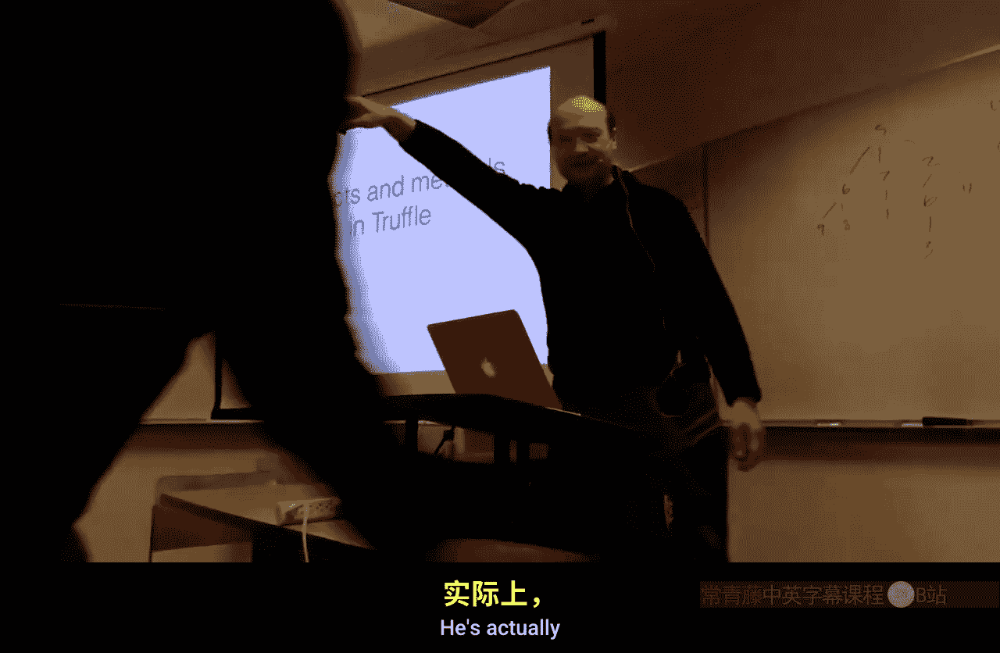

# 虚拟机与托管运行时：第15-16讲：Truffle实现、并发与项目概览

在本节课中，我们将学习如何在Truffle框架中实现对象和方法，探讨虚拟机中的并发问题，并了解Oracle实验室中基于Truffle和Graal的相关项目概览。

---

## 对象与方法的Truffle实现

上一节我们介绍了Truffle的基本概念。本节中，我们来看看如何在Truffle中实现动态对象和方法。

Truffle最近新增了对动态对象的支持，这在脚本语言（如Ruby、JavaScript）中很常见，允许在运行时动态添加或删除属性。

核心概念是`DynamicObject`类。它能追踪运行时对象的“形状”，即属性的数量、名称和类型。当形状发生变化时（通常不频繁），系统可以记录这些形状并在它们之间转换，通过缓存实现快速的读写操作，就像在基于类的语言中实现一样。

底层每个对象都有一个`StorageObject`。可以将其视为一个常规对象，但在对象头中有一个共享引用（类似于映射），指向描述数据布局方式的元数据。由于是在Java中实现，需要静态区分基本类型和对象引用，因此存储区被划分为存放基本类型的区域和存放对象引用的区域（以便垃圾回收器识别）。形状信息告诉你如何查找。

如果对象变得非常大（例如动态添加了许多属性），由于`StorageObject`是固定大小的Java对象，可以使用对象存储区来引用扩展数组，以容纳更多的基本类型和对象引用。与为特定语言定制的VM直接实现相比，这会在空间和性能上带来一些开销，但在通用的Java实现中，这是能做到的最佳方案。

### 形状与形状转换

当你向对象添加或删除属性时，会生成（或查找已存在的）新形状，对象随之从一个形状转换到另一个形状。

**形状转换示例：**
1.  创建一个空对象：其底层实现是一个对象头和一个指向空形状的引用，存储区为空。
2.  向字段`x`（假设为`int`类型）写入：生成一个新形状，描述对象在基本类型存储区的第0个位置有一个`int`类型的`x`字段。对象更新为此形状。
3.  添加另一个字段`y`：生成包含额外描述的新形状，对象再次更新。
4.  将`x`字段从`int`改为`String`：生成一个新形状，描述`x`作为`String`存储在引用区。对象更新，其形状引用指向新的属性位置。

形状本身是不可变的。只有底层对象会改变，并且形状会被规范化（即相同结构的形状是唯一的）。这意味着形状的身份（identity）可以用于相等性比较。

转换映射用于连接形状，以便在需要添加属性、更改类型或删除属性时，能快速找到下一个形状（如果该转换已存在）。首次需要一些计算来创建形状，之后则不需要。

### 形状的完整结构

每个形状有一个前驱（说明如何到达此形状），形成一个链条。形状还包含指向其后继（链条中的后代）的转换引用。对于每个字段（在此模型中称为属性），有一个`Property`对象，它提供查找用的键（名称）、在存储区中的位置以及一些相关属性（例如，某些属性可以是隐藏的或仅限内部使用）。还有一个单独的`Allocator`对象，用于跟踪底层存储的空间使用情况，并在需要时调整大小（例如生成扩展数组）。

所有这些都可以通过子类化来重新实现。此外，属性可以标记为“共享”，此时该属性直接存储在形状中，而不是每个对象的底层存储中，这对于所有实例间共享的不可变数据很有效。

### 形状树与缓存

形状形成一棵树，根节点始终是空形状。当你插入或删除字段时，就沿着这棵树向下遍历。附加在每个形状上的表用于查找下一个形状（如果已经见过）。

**示例形状树：**
执行一段JavaScript代码后，可能会得到包含不同属性组合（如`x`和`y`均为字符串，或`x`为字符串、`y`为整数）的形状树。当创建一个对象时，它获得一个形状；当赋值一个新属性时，如果该转换已存在，则只需遍历树找到新形状并更新对象引用。

为了使其快速，你需要进行内联缓存。Truffle提供了一种自动为你构建内联缓存的方法，以加速分发。如果你的代码变得多态（处理过多不同类型），它会自动将内联缓存泛化为多态内联缓存。

在解释器中，你进行类型测试和特化。对于对象属性访问，你可以编写带有特化的简单类，系统在分发操作时会自动添加适当的分发逻辑以形成内联缓存。

**内联缓存示例（属性访问）：**
初始时使用未初始化的缓存。随着遇到更多类型，会添加关联的直接属性获取代码。如果变得多态（例如超过3种不同类型），则会回退到通用情况。

你可以使用`@Cached`注解和守卫（guard）来编写特化，限制缓存持有的变体数量，并指定回退的通用版本。

---

## 简单语言示例与底层代码生成

为了更具体地理解，我们可以查看Truffle的“简单语言”示例。这是一个用于演示Truffle特性的极简语言。

**运行简单语言程序：**
你可以克隆代码库，下载Graal二进制文件，然后运行示例程序。例如，一个循环程序在最初几次迭代较慢（解释执行），然后Truffle会进行优化并触发编译，后续迭代速度会大幅提升。

通过添加`-Dgraal.PrintAssembly`等标志，可以查看由Graal为优化方法生成的汇编代码。这让你能看到实际生成的机器指令。

**分析生成的汇编（以x86为例）：**
生成的代码包含一些特定于托管环境的指令：
*   **栈溢出检查**：通过测试栈指针下方的内存页来实现。如果访问未映射的页会触发信号，处理器在信号处理程序中抛出栈溢出异常。
*   **安全点指令**：例如`test`指令，用于在需要停止线程进行垃圾回收时设置陷阱。通过保护特定内存地址实现，当线程尝试执行该指令时会陷入陷阱，从而安全地停止线程。
这些指令确保了在托管运行时环境中的正确性和可控性。

**编译流水线与图可视化：**
你可以使用Ideal Graph Visualizer工具查看Graal编译器的中间表示（IR）图。编译过程包括多个阶段：
1.  **内联与部分求值**：生成包含大量固定守卫节点的图。
2.  **逃逸分析**：分析并消除不必要的对象分配（如帧对象），将对象访问虚拟化为寄存器操作，大幅减少节点数量。
3.  **各种优化**：如公共子表达式消除、锁消除、循环优化等。
通过这些阶段，高级的Truffle节点图被逐步转换为更低级、更详细的IR图，最终经由寄存器分配器等阶段生成机器码。

---

## 编译器指令与性能剖析

Truffle和Graal提供了编译器指令，允许你在代码中区分是在解释器还是编译代码中运行，从而进行不同的操作。

**性能剖析与推测优化：**
一个关键的优化技巧是基于运行时信息进行推测。例如，在除法运算中，如果发现除数通常是某个常数（如1），你可以进行推测优化。

**基本推测模式：**
1.  使用`@CompilationFinal`注解标记一个推测值字段。
2.  在方法中，检查运行时值是否与推测值匹配。
3.  如果匹配，执行优化后的快速路径（例如，除以1就是原值，或除以2的幂次可用移位优化）。
4.  如果不匹配，则转移到解释器，并更新推测值。

**处理多态情况：**
简单的推测在值频繁变化时会导致性能下降（总是回退到解释器）。更健壮的实现需要处理多种状态：
*   **未初始化状态**：首次执行时捕获值。
*   **单态推测状态**：值稳定时使用快速路径。
*   **泛型状态**：当值变化时，回退到未优化的通用路径，并可能在一段时间后重新尝试推测。
Truffle提供了`PrimitiveValueProfile`等库来帮助你更优雅地实现这种值剖析和缓存行为，自动处理多态情况。

**与Java对比：**
对于同样的算法，用Java实现并手动进行类似的推测优化会非常笨拙，因为Java是静态类型语言。而在Truffle上实现的动态语言，通过运行时剖析和即时编译，可以在推测成功时获得巨大加速（10倍或更多），在推测失败时也至少不会比通用实现慢。

---

## 虚拟机中的并发

到目前为止，我们主要讨论的是单线程语言实现技术。然而，并发是一个重要领域。

**并发与否的考量：**
*   **单线程与联邦化**：许多项目通过运行多个独立的VM进程（联邦化）来利用多核，例如在网络服务中，让多个独立VM进程处理请求，而不是一个庞大的多线程VM。这在硬件规模巨大、需要跨节点扩展或容错时是常见选择。
*   **多线程共享内存**：当需要高效通信和极致性能时，在共享内存池上进行多线程编程是无法替代的。

**语言并发模型：**
实现并发时，需要考虑语言本身的并发语义（如Actor模型、监视器锁）以及底层硬件的内存模型。

**调度：**
*   **协作式调度**：在单核时代，VM通过协作式调度在多个用户级线程间复用单个线程。这在没有真正并行硬件时提供了并发抽象。
*   **并行硬件上的调度**：在真正的并行硬件上，需要处理抢占式调度。在硬件和操作系统层面更好地支持协作式调度是一个研究课题。

**解释器与并发：**
解释器本身较慢，并行化解释器不是主要目标。关键是要确保并发环境下解释器不会变得特别慢。一些技术（如字节码重写）在并发环境下存在安全问题（重写操作非原子性）。在Truffle中，AST是每个线程独立的，这避免了问题。

**线程与性能反馈：**
一个开放的研究问题是多线程如何与性能反馈（profile feedback）交互。不同线程可能生成不同的性能数据，如何合并这些数据以生成优化代码，或者是否为不同线程生成独立代码，是一个值得探索的领域。

---

## 对象同步与锁优化

对象同步（尤其是监视器锁）在Java等语言中至关重要。为了使其高效，进行了大量优化研究。

**锁优化目标：**
大多数程序中的锁是**无竞争**的（仅被一个线程获取）。同一个线程经常**重入**锁（嵌套的同步方法）。竞争情况相对较少。因此，优化重点是使无竞争锁和重入锁非常快。

**HotSpot中的锁实现（基于2006年论文）：**
对象头字中的标记位编码锁状态：
1.  **无锁**：对象未被锁定。
2.  **轻量级锁**：优化无竞争获取和重入。
3.  **重量级锁**：使用互斥量等操作系统原语处理竞争。

**轻量级锁（Thin Lock）流程：**
*   第一次对无锁对象执行`monitorenter`时，线程将对象头字复制到栈帧的保留槽中，然后通过CAS操作将指向该栈槽的指针（并设置标记位）写入对象头。如果成功，则获取锁。
*   同一线程后续的重入操作，只需检查对象头中的指针是否指向当前线程的栈范围即可，无需额外操作。
*   退出时，根据栈帧中的锁记录释放锁，并将原始头字复制回对象。

**偏斜锁（Biased Locking）进一步优化：**
*   锁可以“偏斜”于单个线程。对象头中存储线程ID。当偏斜的线程获取锁时，几乎无开销。
*   如果其他线程尝试获取这个已偏斜的锁，则需要**撤销偏斜**。这会触发安全点，停止所有线程，遍历持有锁的线程的栈，填充锁记录，并将锁状态降级为轻量级锁。这个过程开销较大。
*   如果对特定类型的对象频繁发生撤销，则会进行**批量撤销**，禁用该类型的偏斜锁。

**其他技巧：**
*   HotSpot会尝试证明`monitorenter`和`monitorexit`是配对的。如果证明成功，则生成编译代码；如果无法证明，则保持解释执行，确保正确性。

**与事务内存的对比：**
硬件事务内存（HTM）可以用于实现锁，并可能简化实现（避免偏斜锁的撤销开销）。已有一些研究，但在主流JVM中的采用情况需要查证。

---

## 并发环境下的代码管理

代码修补（patching）在并发环境下非常棘手，因为硬件和操作系统设计时并未充分考虑动态代码修改。

**挑战：**
*   **流水线**：即使在单处理器上，修改代码后需要清空处理器流水线，防止已预取的旧指令被执行。
*   **多处理器与指令缓存**：需要确保其他处理器的指令缓存（I-cache）中的旧代码被清除。如果缓存是非一致的，则需要显式的缓存维护指令，这可能很复杂且缺乏及时性保证。
*   **内存模型重排序**：代码写入可能被重排序，需要特定的代码修补序列（例如，按特定顺序写入指令）来保证无论如何重排序，总能看到一个有效的指令序列。

**并行编译：**
高性能VM通常有一个编译队列。应用程序线程触发编译请求放入队列，由专用的编译器线程（或多个）在后台进行编译。编译完成后，再原子性地安装新代码。编译器在运行时需要重新检查其假设，因为程序状态可能已发生变化。

**本地（Foreign）代码处理：**
当调用本地（如C语言）库时，这些代码没有安全点，使用不同的调用约定。在并发VM中，通常需要在进入和退出本地代码时设置屏障。如果VM需要暂停线程（如进行垃圾回收），会在屏障处暂停它。如果本地代码尝试访问托管堆，也会在屏障处被阻塞，直到GC完成。

---

## Oracle实验室项目概览：Truffle与Graal

最后，我们来了解一下Oracle实验室中围绕Truffle和Graal进行的研究项目全景。

**技术栈层次：**
1.  **高级语言运行时**：基于Truffle实现JavaScript、Ruby、R等语言的快速解释器/编译器。
2.  **语言实现技术**：如动态对象模型、部分求值研究。
3.  **高级编译器构造**：在Graal层进行的优化，如逃逸分析、锁消除、SSA形式、向量化等。
4.  **底层编译器构造**：寄存器分配器、指令调度等，旨在为特定硬件（如SPARC）生成最优代码。

**主要语言实现：**
*   **JavaScript**：一个高度兼容且性能优异的实现。
*   **Ruby**：基于Truffle的Ruby实现，致力于兼容性和性能，并尝试用Ruby重写核心库以提高兼容性。
*   **R**：最具挑战性的实现之一。R语言语义复杂（所有数据都是向量、参数惰性求值、运算符可重定义、值不可变等），对优化系统压力巨大，但也存在巨大的优化潜力（可达百倍加速）。
*   **C/LLVM位码**：通过Truffle解释和编译C代码，旨在实现安全执行（如防止缓冲区溢出）以及更好地与动态语言集成（消除调用边界）。

**Graal编译器：**
Graal是一个用Java编写的高性能即时编译器，采用Apache 2.0许可证开源。
*   **核心目标**：支持激进优化，适合包含大量守卫（guard）的动态语言图；拥有目前最好的逃逸分析（包括部分逃逸分析）；采用模块化设计，易于添加自定义优化阶段。

**相关资源与未来：**
*   **简单语言**：Truffle的示例语言，是学习和实验的良好起点。
*   **职业机会**：Oracle实验室在多个地点招聘实习生和研究人员，涉及整个技术栈的各个层次。
*   **愿景**：通过Truffle和Graal技术栈，降低语言实现门槛，提升动态语言性能，并促进多语言互操作。

---

## 总结

本节课中我们一起学习了多个主题：
1.  **Truffle中的对象模型**：了解了如何使用`DynamicObject`和形状（Shape）在Truffle中实现高效的动态对象，以及如何通过内联缓存优化属性访问。
2.  **底层代码生成**：通过简单语言示例和汇编输出，观察了Truffle/Graal如何将高级节点编译优化为机器码，并认识了安全点等托管环境特有的指令。
3.  **性能剖析与推测优化**：学习了如何使用编译器指令和值剖析在运行时进行推测优化，以显著提升热点路径的性能。
4.  **虚拟机并发**：探讨了在VM中实现并发时面临的挑战、权衡和优化技术，包括调度、锁优化（轻量级锁、偏斜锁）以及并发环境下的代码管理难题。
5.  **项目概览**：了解了Oracle实验室中基于Truffle和Graal的丰富项目生态，涵盖了从JavaScript、Ruby到C语言的多语言实现与优化研究。

这些内容展示了现代托管运行时和语言实现技术的深度与广度，以及如何通过即时编译和运行时优化来弥合动态语言的灵活性与高性能之间的鸿沟。