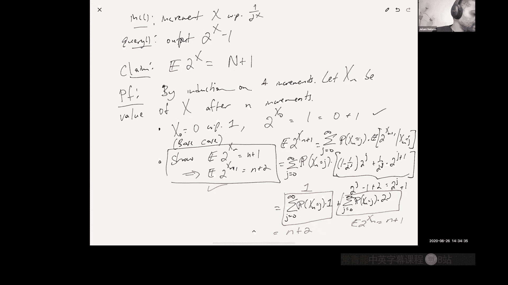
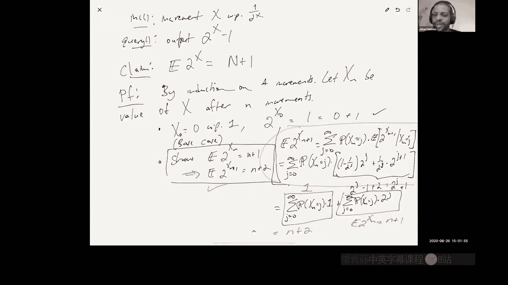
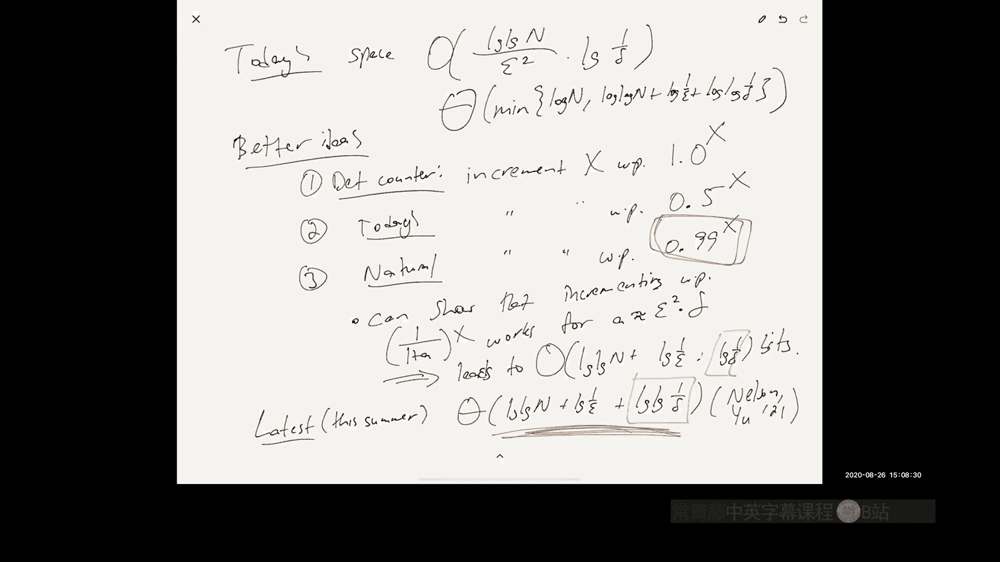

# 001：课程介绍与近似计数

## 概述

在本节课中，我们将学习数据流算法的基本概念，并从一个非常简单的例子——近似计数问题——开始。我们将探讨为什么需要近似算法，如何设计它们，以及如何分析其内存使用和准确性。

---

## 课程安排与物流

本课程的所有信息，包括教学大纲、评分标准和联系方式，均已在线发布。如果你在课程注册或获取资料方面遇到任何问题，请通过课程网站或电子邮件联系我。

---

## 数据流算法简介

数据流算法处理的是以连续“流”形式到达的数据。我们无法存储整个数据集，因此需要设计能够在有限内存下实时处理查询的算法。

让我们从一个具体的例子开始：计算当天的总销售额。

**问题**：有一个销售交易数据库，包含数百万条交易记录。我们只想知道一个查询的结果：今天的总销售额（以美元计）。

**简单解法**：维护一个计数器，初始为0。每发生一笔销售，就将金额加到计数器上。这是一个简单的数据流算法。

类似地，如果我们只想知道交易笔数（而非总金额），也可以维护一个计数器。如果有 `n` 笔交易，一个精确的计数器需要 `log n` 比特的内存。

---

## 近似计数问题

上一节我们介绍了精确计数器的概念。本节中，我们来看看如何通过“近似”来做得更好。

我们将问题形式化为一个数据结构问题，需要支持三种操作：
1.  **初始化**：将计数器设为0。
2.  **递增**：将计数器加1。
3.  **查询**：返回计数器值的一个**近似值**。

### 精确算法的局限性

如果我们要求算法是**确定性的**且输出**精确值**，那么可以证明，当计数器值 `n` 在 `0` 到 `T` 之间时，算法至少需要 `log T` 比特的内存。

**证明思路**：如果使用少于 `log T` 比特的内存，根据鸽巢原理，必然存在两个不同的递增次数 `A` 和 `B`，使得算法最终的内存状态完全相同。因此，对于查询操作，算法会对 `A` 和 `B` 返回相同的答案，而其中至少有一个答案是错误的。

### 引入近似与随机化

由于精确解需要对数级内存，我们考虑放松要求：
1.  **允许近似**：我们接受答案在真实值 `n` 的 `(1 ± ε)` 范围内（例如，1%误差）。
2.  **允许随机化**：算法可以有一定的失败概率 `δ`，即答案不满足误差要求的概率。

我们的目标是设计一个**随机化的近似算法**，在保证 `(1 ± ε)` 近似精度的前提下，使用尽可能少的内存。

### 理想的内存下界

即使允许近似，我们也需要一定的内存来区分不同的可能值。

假设真实值 `n` 在 `0` 到 `T` 之间。为了达到 `(1 ± ε)` 的近似，我们实际上只需要知道 `n` 最接近 `(1+ε)` 的哪个幂次。例如，当 `ε=0.01` 时，我们需要区分的可能值是：`1, 1.01, 1.01^2, 1.01^3, ..., T`。

这些可能值的数量大约是 `log_(1+ε) T`。存储其中某一个的索引所需的内存是：
`log( log_(1+ε) T ) ≈ log(log T) + log(1/ε)` 比特。

这给出了一个理想的内存下界：任何 `(1±ε)` 近似算法至少需要 `Ω( log(log n) + log(1/ε) )` 比特的内存。我们后续的算法将努力接近这个下界。

---

## Morris 计数器算法

上一节我们讨论了问题的下界。现在，我们来看一个具体的算法——Morris 计数器。

### 基础想法

我们不直接存储计数器 `n`，而是存储另一个变量 `x`。
*   **初始化**：`x = 0`
*   **递增**：以概率 `1/(2^x)` 将 `x` 加1，否则 `x` 保持不变。
*   **查询**：返回估计值 `ñ = 2^x - 1`。

**为什么这可能有效？**
*   **内存**：`x` 的增长非常缓慢。可以证明，`x` 超过 `O(log log n)` 的概率极低，因此存储 `x` 所需的内存约为 `log log n` 比特。
*   **无偏性**：可以证明，估计值 `ñ` 的期望恰好是 `n`，即 `E[2^x] = n + 1`。

### 算法分析（期望）

以下是 `E[2^x] = n + 1` 的归纳证明：
*   **基础情况**：`n=0` 时，`x=0`，`2^0 = 1 = 0+1`。
*   **归纳步骤**：假设 `E[2^(X_n)] = n+1` 成立。考虑第 `n+1` 次递增后：
    `E[2^(X_(n+1))] = Σ_j Pr[X_n = j] * E[2^(X_(n+1)) | X_n = j]`
    当 `X_n = j` 时，有概率 `1/(2^j)` 将 `x` 增至 `j+1`，概率 `1 - 1/(2^j)` 保持 `x=j`。
    因此，`E[2^(X_(n+1)) | X_n = j] = (1/(2^j)) * 2^(j+1) + (1 - 1/(2^j)) * 2^j = 2^j + 1`。
    代入求和式可得：`E[2^(X_(n+1))] = 1 + E[2^(X_n)] = 1 + (n+1) = n+2`。
    由归纳法，结论成立。

因此，`E[ñ] = E[2^x - 1] = (n+1) - 1 = n`。我们的估计量是无偏的。

### 算法的不足

基础的 Morris 计数器方差较大。通过分析（此处省略详细计算，可参考课程笔记），其方差 `Var[ñ] ≈ n^2 / 2`。根据切比雪夫不等式，其误差超过 `εn` 的概率上界为 `1/(2ε^2)`。当 `ε=0.75` 时，失败概率高达约 `8/9`，成功率仅约 `11%`。这并不理想。

---

## 改进：Morris+ 与 Morris++ 算法

上一节的 Morris 计数器方差太大。本节我们介绍两种通用的改进技术，它们可以应用于许多随机化近似算法。

### Morris+：取平均值降低方差

一个降低方差的标准方法是运行多个独立副本并取结果的平均值。

**算法**：
1.  并行运行 `r` 个独立的 Morris 计数器副本，得到估计值 `ñ_1, ñ_2, ..., ñ_r`。
2.  输出最终估计值 `n̂ = (ñ_1 + ... + ñ_r) / r`。

**分析**：
*   **期望**：`E[n̂] = n`（仍是无偏估计）。
*   **方差**：由于副本独立，`Var[n̂] = Var[ñ] / r ≈ n^2 / (2r)`。
*   **误差概率**：根据切比雪夫不等式，`Pr[|n̂ - n| > εn] ≤ Var[n̂] / (ε^2 n^2) ≈ 1/(2rε^2)`。
    为了使失败概率小于 `η`，我们只需设置 `r ≥ 1/(2ε^2η)`。

**代价**：内存使用增加了 `r` 倍，总内存约为 `O( (log log n) / (ε^2 η) )`。对 `ε` 和 `η` 的依赖不够好（我们目标是 `log(1/ε)` 和 `log(1/η)`）。

### Morris++：取中位数降低失败概率

Morris+ 对失败概率 `η` 的依赖是 `1/η` 倍的。我们可以通过“取中位数”的技术将其改进为对 `log(1/η)` 的依赖。

**算法**：
1.  并行运行 `s` 组 Morris+ 算法，每组设定其失败概率 `η’` 为一个常数（例如 `1/3`）。每组输出一个估计值 `n̂_i`。
2.  输出最终估计值 `ñ = median( n̂_1, n̂_2, ..., n̂_s )`，即所有 `n̂_i` 的中位数。

**分析**：
*   每组 Morris+ 的失败概率为常数 `η’ = 1/3`。
*   最终输出 `ñ` 出错，仅当超过一半的 `n̂_i` 出错。
*   令 `X_i` 为指示变量，当 `n̂_i` 出错时为1。则 `X_i` 独立，且 `E[Σ X_i] ≤ s/3`。
*   我们需要 `Σ X_i > s/2` 才会失败，这要求其和偏离期望至少 `s/6`。
*   根据 **切尔诺夫界**：对于独立的 `{0,1}` 随机变量，其和偏离期望 `εμ` 倍的概率上界为 `2 * exp(-ε^2 μ / 3)`，其中 `μ` 是期望和。
*   在此设置中，`μ ≤ s/3`, `εμ ≥ s/6`，可得失败概率上界为 `2 * exp(-Ω(s))`。
*   因此，只需选择 `s = O( log(1/δ) )`，即可将最终失败概率降至 `δ`。

**总内存**：`O( (log log n) * (1/ε^2) * log(1/δ) )`。相比 Morris+，我们将对 `δ` 的依赖从 `1/δ` 改进为了 `log(1/δ)`，但对 `ε` 的依赖仍是 `1/ε^2`。

---

## 最优的 Morris 计数器变体

上一节介绍的“取中位数”方法是通用技术，但并非对本问题最优。Morris 在其原始论文中提出了更优的变体。

### 核心思想：调整递增概率

回顾基础 Morris 计数器：以概率 `1/(2^x)` 递增 `x`。
*   概率 `1/(2^x)` 较小，导致 `x` 增长慢，内存省，但方差大。
*   如果我们以概率 `1/(1.01^x)` 递增呢？`x` 增长更快，内存消耗稍多，但方差会显著减小。
*   极端情况：以概率 `1` 递增，则 `x` 始终等于 `n`，方差为0，但内存变为 `log n`。

可见，在**内存**和**方差**之间存在权衡。

### 最优算法描述

更一般地，我们可以设计算法，以概率 `1/( (1+α)^x )` 递增 `x`，其中 `α` 是一个与目标精度 `ε` 和失败概率 `δ` 相关的参数。

经过恰当的参数设置（例如，`α = Θ(ε^2 δ)`）和细致分析（可作为课后练习），该算法可以达到以下内存上界：
`O( log log n + log(1/ε) + log(1/δ) )` 比特。

这已经比 Morris++ 的结果更优，因为对 `ε` 的依赖从 `1/ε^2` 改进为了 `log(1/ε)`。

### 当前最优界

最新的研究（2020年夏季）表明，近似计数问题的最优内存界限实际上是：
`min( log n,  O( log log n + log(1/ε) + log log(1/δ) ) )` 比特。

**解释**：
1.  `log n` 是确定性精确计数器的成本。
2.  括号内的项是随机化近似计数器的成本。关键改进在于对失败概率 `δ` 的依赖从 `log(1/δ)` 进一步优化为了 `log log(1/δ)`。
3.  `min` 操作意味着：当要求的精度 `ε` 极高或失败概率 `δ` 极低时，直接使用确定性精确计数器可能更省内存；否则，使用优化后的 Morris 类算法更优。

这个上界是紧的，存在匹配的下界证明。

---

## 总结

本节课我们一起学习了数据流算法的入门知识，并深入探讨了近似计数这个经典问题。

1.  **问题定义**：我们希望在有限内存下，维护一个计数器，支持递增和近似查询操作。
2.  **下界**：任何 `(1±ε)` 近似的算法至少需要 `Ω(log log n + log(1/ε))` 比特内存。
3.  **Morris 计数器**：通过存储对数级的变量 `x` 并以递减的概率更新它，实现了 `O(log log n)` 的内存使用，并给出了无偏估计。
4.  **通用改进技术**：
    *   **Morris+（取平均）**：通过并行多个副本取平均来降低方差，代价是内存乘以 `O(1/ε^2)`。
    *   **Morris++（取中位数）**：通过对多个“常数失败概率”的估计器取中位数，将对失败概率的依赖从 `O(1/δ)` 指数级改进到 `O(log(1/δ))`。
5.  **最优变体**：通过调整 Morris 计数器中递增概率的底数，可以直接得到更优的内存界限 `O(log log n + log(1/ε) + log(1/δ))`。
6.  **最新进展**：该问题的最优内存界限为 `min( log n,  O(log log n + log(1/ε) + log log(1/δ)) )`，并且上下界已匹配。

近似计数是数据流算法中最古老、最基础的问题之一，其中蕴含的“概率更新”、“方差-内存权衡”、“中位数技巧”等思想，是设计更复杂数据流算法的基石。