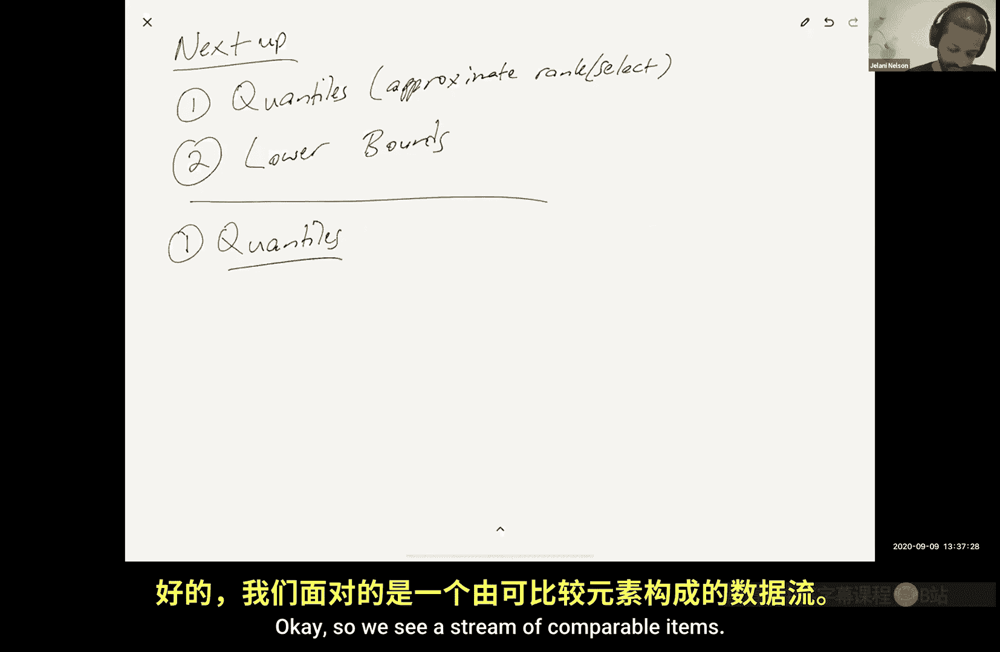
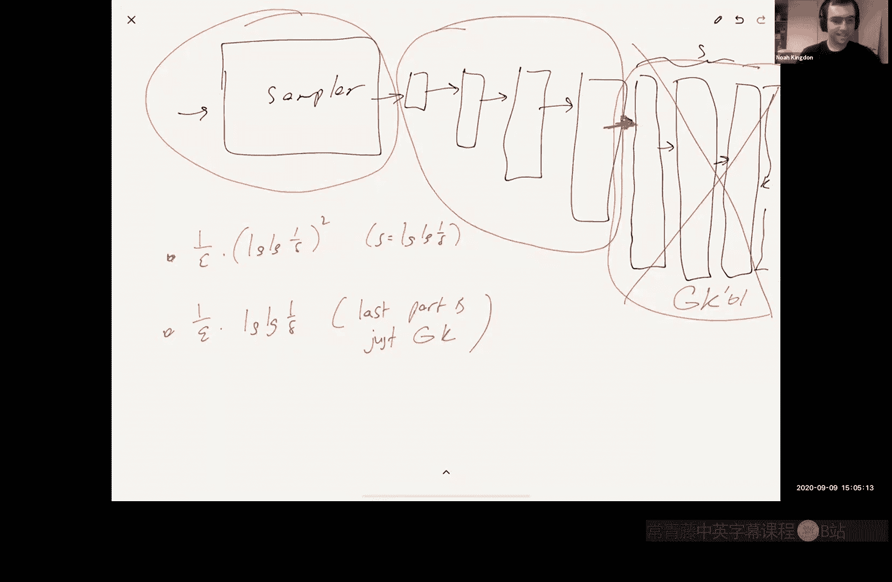

# 004：分位数





在本节课中，我们将要学习数据流中的分位数问题。我们将介绍问题的定义、几种确定性算法（包括Q-digest和MRL算法）以及随机化算法（如KLL草图）的核心思想。我们还将探讨相关的空间下界。内容将尽可能简单直白，以便初学者理解。

## 问题定义

我们有一个由可比较项组成的数据流。例如，这些项可以是来自某个范围 `[1, U]` 的整数，或者是字符串。流的长度为 `n`。

我们希望能够回答以下两种查询：
1.  **Rank(x)**：查询项 `x` 在所有已见流项排序后的顺序中的排名。
2.  **Select(r)**：查询在排序后列表中排名为 `r` 的项。

由于内存限制，我们无法存储整个排序列表。因此，我们接受近似解：
*   **Rank(x)**：返回的排名误差在 `± εn` 以内，其中 `ε` 是预先给定的参数。
*   **Select(r)**：返回的项，其真实排名在 `r ± εn` 以内。

## 确定性算法：Q-digest

上一节我们定义了分位数问题，本节中我们来看看第一个确定性算法：Q-digest。该算法假设流中的项是 `1` 到 `U` 之间的整数。

### 算法原理

Q-digest 的核心思想是构建一棵覆盖整个值域 `[1, U]` 的完美二叉树。树的高度为 `log₂ U`。每个树节点 `v` 关联一个计数器 `c(v)`，用于记录“归属于”该节点值域范围内的流元素数量。关键在于，每个流元素只被一个节点计数。

初始时，元素在其对应的叶子节点计数。为了节省空间（即减少非零计数器的数量），我们有一个合并规则：当某个节点 `x`、其父节点 `p(x)` 及其兄弟节点 `s(x)` 的计数器之和不超过阈值 `εn / log₂ U` 时，我们将子节点的计数合并到父节点。

以下是合并操作的伪代码描述：
```python
if c(x) + c(p(x)) + c(s(x)) <= εn / log U:
    c(p(x)) += c(x) + c(s(x))
    c(x) = 0
    c(s(x)) = 0
```

### 空间与误差分析

我们可以证明，在任何时刻，非零计数器的节点数 `K` 最多为 `3 log U / ε`。因此，我们只需要存储这些节点的ID和计数器值。

对于排名查询 `Rank(x)`，误差来源于从根到 `x` 对应叶子的路径上所有节点的计数器。因为这些节点中的元素可能来自 `x` 的左侧或右侧，我们无法区分。路径上的节点数最多为 `log U`，每个节点的计数值最多为 `εn / log U`，因此总误差最多为 `εn`。

## 确定性算法：MRL（比较排序法）

上一节我们介绍了基于值域树的Q-digest算法，本节中我们来看看一种基于比较和压缩的算法：MRL算法。该算法是**比较排序**的，适用于任何可比较项。

### 算法原理

算法维护 `L = log₂(n/k)` 个“压缩器”，每个压缩器可以存储最多 `k` 个项。我们将它们编号为 `0` 到 `L-1`。

流程如下：
1.  新流元素总是插入到第 `0` 级压缩器。
2.  当第 `j` 级压缩器存满 `k` 个项时，我们将其中的项排序，然后**提升所有奇数索引项**到第 `j+1` 级压缩器，接着清空第 `j` 级压缩器。

### 查询与误差

要回答 `Rank(x)` 查询，我们计算所有压缩器中小于等于 `x` 的项，但每项根据其所在压缩器级别 `j` 具有权重 `2^j`（因为它代表了 `2^j` 个原始项）。

误差产生于压缩过程。每次在第 `j` 级发生的压缩，最多可能引入 `2^(j-1)` 的排名误差。通过分析，所有压缩引入的总误差上限为 `(n/k) * log(n/k)`。为了使这个误差小于 `εn`，我们需要设置 `k = O( (1/ε) * log(εn) )`。

因此，总空间复杂度为 `k * L = O( (1/ε) * log²(εn) )` 个单词。

## 随机化算法：引入随机性

MRL算法是确定性的。我们可以通过引入随机性来改进空间复杂度。核心改进在于压缩步骤：当压缩器满时，排序后我们**随机地**选择提升所有奇数索引项**或**所有偶数索引项。

### 误差分析

此时，每次压缩引入的误差不再是固定的 `2^(j-1)`，而是随机的 `±2^(j-1)`（有时误差为0）。总误差 `E` 是一个随机变量，形式为许多带随机符号 `σ` 的项之和：
`E = Σ_j Σ_r η_{j,r} * σ_{j,r} * 2^(j-1)`

我们可以利用 **Khinchin不等式** 来约束这个随机和。该不等式指出，对于独立的随机 `±1` 变量 `σ_i` 和实数 `x_i`，有：
`Pr[ |Σ σ_i x_i| > λ ] ≤ 2 * exp( -λ² / (2 * Σ x_i²) )`

在我们的设定中，`Σ x_i²` 可以证明至多为 `O(n² / k²)`。为了使误差超过 `εn` 的概率小于 `δ`，我们需要设置 `k = O( (1/ε) * √log(1/δ) )`。

结合级别数 `L = log(n/k)`，总空间为 `O( (1/ε) * √log(1/δ) * log(εn) )`。

## 进阶优化：KLL草图

为了达到更优的空间复杂度 `O( (1/ε) * log log(1/δ) )`，KLL草图采用了多重优化：

1.  **几何增长的压缩器容量**：不再让所有压缩器容量相同，而是从底层开始容量按几何级数增长（例如，比例为 `2/3`）。这改变了空间构成，从乘以 `log n` 因子变为加上 `log n` 因子。
2.  **采样替代小型压缩器**：最底层的多个小型压缩器（容量为2）的功能等价于一个采样器，可以从连续块中均匀采样。我们可以用常数空间的采样器来实现这一部分。
3.  **混合确定性算法**：将最高层的几个压缩器替换为一个最优的确定性分位数算法（如Greenwald-Khanna算法）。
4.  **误差和分离分析**：将总误差随机和分为两部分：对低层级部分使用Khinchin不等式进行紧致界分析；对高层级部分使用简单的确定性界（即忽略随机抵消）。通过精细设置参数，最终得到 `O(1/ε * log log(1/δ))` 的空间上界。

## 下界与总结

对于确定性的、基于比较的算法，存在一个空间下界为 `Ω( (1/ε) * log(εn) )` 个单词。Greenwald-Khanna算法匹配了这个下界，但其分析和实现较为复杂。



本节课中我们一起学习了数据流分位数问题的近似解法。我们从简单的确定性算法Q-digest和MRL开始，理解了压缩和合并的基本思想。接着，我们看到了如何通过引入随机性（随机提升策略）并利用概率工具（Khinchin不等式）来分析误差，从而改进算法。最后，我们概述了目前最先进的KLL草图算法所采用的一系列优化技术，使其能达到近乎最优的空间复杂度。这些算法在性能监控等实际场景中有着广泛的应用。