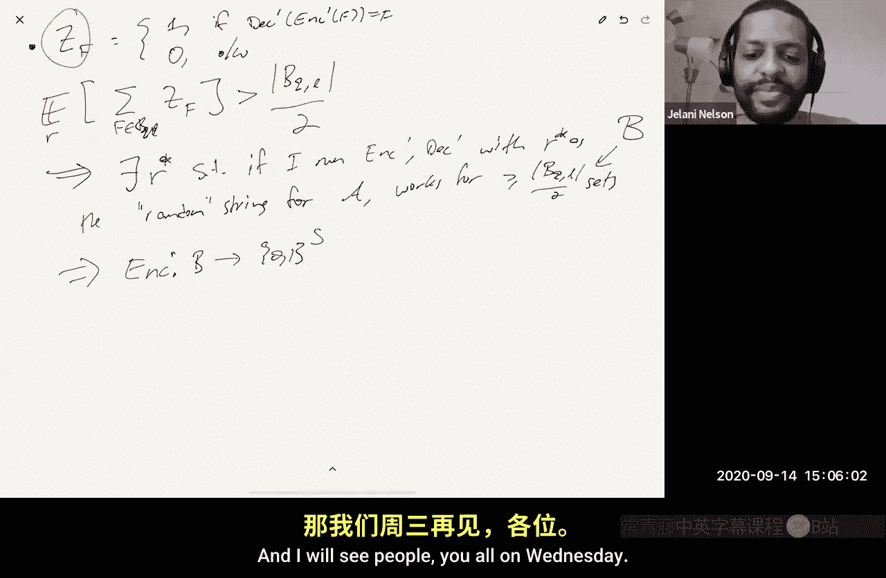

# 005：基于压缩论证的下界证明

在本节课中，我们将学习一种证明数据流算法空间下界的核心技巧——基于压缩的论证。我们将通过两个经典问题——元素唯一性问题和分位数问题——来具体展示这种技巧的应用。课程内容将循序渐进，从简单的确定性精确算法下界开始，逐步深入到更复杂的确定性和随机性近似算法的下界证明。

## 概述：压缩论证的核心思想

基于压缩的论证是一种证明下界的通用技术。其核心思路如下：

假设存在一个针对某个问题（如元素唯一性）的素描算法 A，它使用 S 比特的内存。那么，我们可以构造一个**单射** F，将某个大集合 Q 映射到一个有界集合（例如所有长度为 S 的比特串集合 `{0,1}^S`）。

由于单射意味着集合 Q 的大小不能超过目标集合的大小，即 `|Q| ≤ 2^S`，因此我们可以推导出 `S ≥ log₂(|Q|)`。

证明的艺术在于如何巧妙地构造这个单射，以及如何定义集合 Q。我们将看到，对于不同的问题和算法类型，构造方法会有所不同。

## 热身：确定性精确算法的下界

上一节我们介绍了压缩论证的基本框架。本节中，我们首先来看一个简单的热身例子：针对元素唯一性问题的确定性精确算法的下界。

**定理**：假设存在一个确定性且精确的元素唯一性算法 A，在长度为 Ω(n) 的流上使用 S 比特内存，那么 `S ≥ n`。

**证明**：我们将证明，如果存在这样的算法 A，那么我们可以构造一个从大小为 `2^n` 的集合到大小为 `2^S` 的集合的单射。由于 `2^n ≤ 2^S` 必须成立，因此 `S ≥ n`。

以下是构造单射（编码函数 `ENC`）和解码函数 `DEC` 的方法：

**编码过程 (`ENC`)**：
给定一个比特向量 `x ∈ {0,1}^n`，我们将其解释为一个集合 `X = {i | x_i = 1}`。
1.  创建一个包含 `X` 中所有元素的流。
2.  在流上运行算法 A。
3.  编码输出就是算法 A 完成后的内存内容（一个 S 比特的字符串）。

**解码过程 (`DEC`)**：
给定一个 S 比特的内存状态 `M`，我们需要恢复原始的比特向量 `x`。
1.  将算法 A 的内存初始化为 `M`。
2.  查询算法 A，得到当前流中不同元素的数量 `s`。
3.  初始化返回值 `x` 为全零向量。
4.  对于 `i` 从 1 到 `n`：
    *   向算法 A 更新元素 `i`。
    *   再次查询算法 A，得到新的结果 `r`。
    *   如果 `r == s`，则意味着 `i` 在原始流中已经出现过（否则不同元素数应增加），因此设置 `x_i = 1`。
    *   否则，设置 `x_i = 0`，并更新 `s = r`。
5.  返回 `x`。

由于算法 A 是确定且精确的，上述解码过程能完美地恢复出原始的 `x`。这意味着编码函数 `ENC` 是一个单射。因为 `ENC` 将 `2^n` 个可能的 `x` 映射到 `2^S` 个可能的内存状态，所以必须有 `2^n ≤ 2^S`，即 `S ≥ n`。

这个简单的论证表明，对于元素唯一性问题，任何确定性精确算法都无法实现亚线性空间。

## 关键工具：纠错码简介

在证明更复杂的下界（如确定性近似算法的下界）之前，我们需要引入一个关键工具：纠错码。

**定义**：一个参数为 `(Q, L, D)` 的码 `C` 是集合 `{1, ..., Q}^L` 的一个子集。其中 `Q` 是字母表大小，`L` 是块长度（码字长度），`D` 是码的最小汉明距离（任意两个不同码字之间不同位置的最小数量）。

**性质**：如果一个码的最小距离为 `D`，那么任意一个码字在经历少于 `D/2` 个位置的错误（任意修改）后，得到的字符串仍然可以**唯一地**解码回原始的码字。这是因为以每个码字为中心、半径为 `D/2` 的汉明球是互不相交的。

**存在性**：通过概率方法可以证明，对于给定的 `Q` 和 `n`，存在一个码 `C`，其块长度 `L = O(Q log n)`，包含 `n` 个码字，且具有相对距离至少为 `1 - O(1/Q)`。

基于这样的码，我们可以推导出一个关于集合的推论，它将用于后续的下界证明：

**推论**：给定 `Q` 和 `L`，存在一个集合族 `B_{Q,L}`，其中每个集合是 `{1, ..., n}` 的子集（`n = Q*L`），满足以下条件：
1.  每个集合的大小恰好为 `L`。
2.  任意两个不同集合的交集大小至多为 `6L/Q`。
3.  集合族的大小至少为 `exp(Ω(L/Q))`。

这个推论可以通过将码 `C` 中的每个符号（1 到 Q）扩展为一个长度为 Q 的独热编码（one-hot encoding）比特向量来构造。

## 确定性近似算法的下界

上一节我们引入了纠错码这个强大工具。现在，我们利用它来证明针对元素唯一性问题的确定性近似算法的下界。

**定理**：假设算法 A 是一个确定性算法，对于元素唯一性问题，它总是输出估计值 `T̃`，满足 `T ≤ T̃ ≤ 1.1 * T`，并使用 S 比特内存，那么 `S = Ω(n)`。

**证明思路**：我们将证明，这样的算法 A 蕴含了一个从推论中构造的大集合族 `B_{Q,L}`（取 `Q=100`, `L=n/100`）到小集合 `{0,1}^S` 的单射。由于 `|B_{Q,L}| = exp(Ω(n))`，这将迫使 `S = Ω(n)`。

**编码 (`ENC`)**：与热身例子类似。对于一个集合 `F ∈ B_{Q,L}`，创建包含 `F` 所有元素的流，运行算法 A，取其最终内存状态作为编码。

**解码 (`DEC`)**：解码器接收内存状态 `M`，目标是恢复 `F`。它采用如下“猜测-验证”策略：
1.  对于 `B_{Q,L}` 中的每一个候选集合 `Q`：
    *   将算法 A 的内存重置为 `M`（此时 A“认为”它刚处理完流 `F`）。
    *   将候选集合 `Q` 中的所有元素依次输入算法 A 进行更新。
    *   查询算法 A，得到新的估计值 `T̃`。
    *   判断：如果 `T̃ ≤ 1.1 * L`，则输出 `Q` 作为解码结果。

**解码正确性分析**：
*   如果 `Q == F`，那么算法 A 第二次看到的流仍然是 `F`（因为 `F ∪ Q = F`）。不同元素数仍为 `L`，因此其输出 `T̃` 满足 `L ≤ T̃ ≤ 1.1L`。解码器会接受这个 `Q`。
*   如果 `Q ≠ F`，那么算法 A 第二次看到的流是 `F ∪ Q`。根据推论，`|F ∩ Q| ≤ 6L/Q = 0.06L`。因此，`|F ∪ Q| = |F| + |Q| - |F ∩ Q| ≥ L + L - 0.06L = 1.94L`。算法 A 的输出 `T̃` 至少为 `1.94L`，这大于 `1.1L`。解码器会拒绝这个 `Q`。

由于 `B_{Q,L}` 中任意两个集合的交集都很小，保证了错误候选集 `Q` 会导致显著更大的并集。因此，解码器能够唯一且正确地识别出原始的集合 `F`。这证明了 `ENC` 是一个单射，从而完成了下界证明。

## 随机性精确算法的下界

最后，我们探讨随机性算法是否能够避免线性的空间下界。答案是否定的，即使允许随机性和小概率错误，精确计算元素唯一性仍然需要 Ω(n) 空间。

**定理**：假设算法 A 是一个随机化算法，以至少 2/3 的概率精确输出不同元素的数量，并使用 S 比特内存，那么 `S = Ω(n)`。

**证明思路**：核心思想是通过多次独立运行并取中位数，先将算法 A 强化为一个错误率极低（如 `10^{-6}`）的算法 A‘。然后，我们为算法 A’ 的每个固定随机种子 `R` 定义其对应的确定性编码/解码函数。虽然对于单个集合，解码可能失败，但我们可以证明存在一个“好”的随机种子 `R*`，使得基于 `R*` 的确定性编解码函数能够正确处理一个相当大的集合族（大小为 `|B_{Q,L}|/2`）。这就构造出了从一个大小为 `exp(Ω(n))` 的集合到 `{0,1}^S` 的单射，从而证得下界。

**关键步骤**：
1.  **错误率放大**：通过并行运行 O(1) 份 A 的副本并输出中位数，得到新算法 A‘，其失败概率 ≤ `10^{-6}`，空间使用为 O(S)。
2.  **定义随机编解码**：对于算法 A‘，定义依赖于随机串 `R` 的编码函数 `ENC_R` 和解码函数 `DEC_R`（解码过程类似确定性下界中的“逐元素探测”）。
3.  **分析期望性能**：对于固定的集合 `F ∈ B_{Q,L}`，由于 A‘ 的错误率极低，`DEC_R(ENC_R(F))` 输出错误结果的概率 < 1/2（通过马尔可夫不等式，并利用纠错码属性处理少量错误）。
4.  **寻找确定性子函数**：定义指示变量 `Z_F(R)`，当 `DEC_R(ENC_R(F))` 正确时为 1。我们有 `E_R[Σ_F Z_F(R)] > |B_{Q,L}|/2`。因此，存在一个固定的“好”随机种子 `R*`，使得 `Σ_F Z_F(R*) > |B_{Q,L}|/2`。令 `B` 为被 `R*` 正确处理的那些 `F` 的集合，则 `|B| ≥ |B_{Q,L}|/2`。
5.  **完成单射构造**：固定 `R*`，函数 `ENC_{R*}` 就是从大集合 `B` 到 `{0,1}^{O(S)}` 的一个单射。因此，`O(S) ≥ log|B| = Ω(n)`，即 `S = Ω(n)`。

这个论证巧妙地通过概率方法，从一个随机化算法中“提取”出了一个对大量输入都有效的确定性单射，从而将随机化算法归约到确定性情况来证明下界。

## 总结与展望

本节课中我们一起学习了基于压缩论证来证明数据流算法空间下界的强大技巧。

*   我们首先看到了一个简单的例子，证明了元素唯一性问题的任何确定性精确算法都需要 Ω(n) 空间。
*   接着，我们引入了纠错码作为构造具有“大距离”的集合族的工具。
*   利用纠错码，我们证明了即使对于常数因子近似（如 1.1 倍）的确定性算法，求解元素唯一性问题仍然需要 Ω(n) 空间。
*   最后，我们通过更复杂的概率方法论证，证明了即使是允许随机性和小概率错误的精确算法，也逃不过 Ω(n) 的空间下界。

这些结果深刻地说明了，为了在亚线性空间内解决元素唯一性问题，**随机化和近似两者都是必不可少的**。这正好对应了我们在课程中学到的 FM 算法、HyperLogLog 等算法的特性。

基于压缩的论证技巧并不仅限于元素唯一性问题。在课程笔记中，它还被应用于证明分位数问题等其他问题的下界。这种通过算法构造编码，进而利用信息论界限来证明空间下界的思路，是数据流算法理论中的一个核心工具。