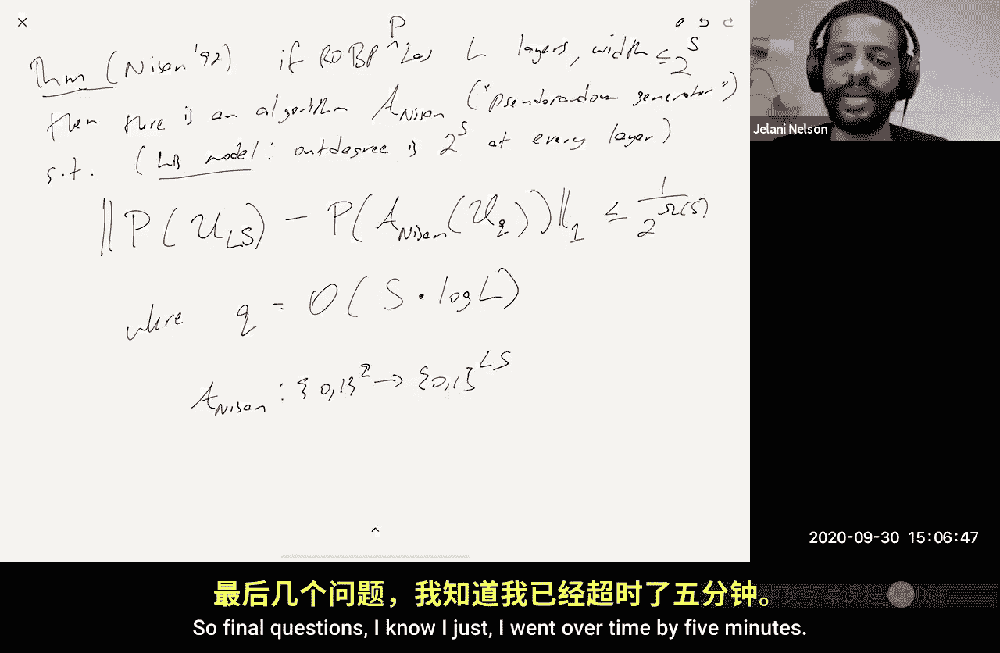

# 009：解耦、Hanson-Wright证明、ℓp范数估计、Nisan的PRG


在本节课中，我们将要学习几个核心内容。首先，我们将证明Hanson-Wright不等式，这是我们周一用来证明分布式Johnson-Lindenstrauss引理的关键工具。完成之后，我们将探讨其他范数（ℓp范数，其中p≠2）的估计问题，特别是0 < p < 2的情况。最后，我们将讨论用于空间有界计算的伪随机生成器，这是一种比k-wise独立性更通用的去随机化工具。

## Hanson-Wright不等式的证明

上一节我们概述了本节课的目标。本节中，我们来看看如何证明Hanson-Wright不等式。该不等式给出了当随机变量为±1时，二次型偏离其期望值的尾概率界。

Hanson-Wright不等式陈述如下：设σ₁, ..., σₙ为独立均匀的±1随机变量，A是一个n×n矩阵。那么对于所有λ > 0，有：
```
Pr[ |σᵀAσ - E[σᵀAσ] | > λ ] ≤ C * exp( -c * min( λ²/||A||_F², λ/||A|| ) )
```
其中，||A||_F是A的Frobenius范数，||A||是A的算子范数。这个界是高斯尾（e^{-λ²}）和指数尾（e^{-λ}）的混合。

尾界和矩界是等价的。证明一个形如上式的尾界，等价于证明该随机变量的所有p阶矩都有界。我们将通过界定所有p范数来证明Hanson-Wright不等式。

### 矩与尾的等价性

首先，我们简要说明尾界和矩界的等价关系。对于一个实值随机变量Z，其p范数定义为：
```
||Z||_p = ( E[ |Z|^p ] )^{1/p}
```
如果已知尾概率界 `Pr[|Z| > λ] ≤ exp(-cλ²/α²)`，那么可以通过积分推导出矩界 `||Z||_p ≤ O(α√p)`。反之，如果已知矩界 `||Z||_p ≤ O(α√p)`，那么通过选择适当的p并应用马尔可夫不等式，可以得到尾概率界 `Pr[|Z| > λ] ≤ exp(-c‘λ²/α²)`。因此，证明Hanson-Wright不等式等价于证明二次型 `σᵀAσ - E[σᵀAσ]` 的p范数满足 `O(√p ||A||_F + p ||A||)` 的界。

### Khintchine不等式

在证明二次型之前，我们先回顾一个关于线性型的结果——Khintchine不等式。设σ₁, ..., σₙ为独立均匀的±1随机变量，x是一个固定向量。那么对于p ≥ 1，有：
```
|| ∑ σ_i x_i ||_p ≤ O(√p) * ||x||_2
```
这个不等式表明，Rademacher线性型的矩增长不会快于高斯线性型。其证明思路是将Rademacher随机变量的矩与高斯随机变量的矩进行比较，利用高斯矩的已知结果。

### 解耦技术

现在，我们转向二次型。证明的关键技术是“解耦”。解耦定理指出，对于非对角矩阵A（即对角线元素为0），有：
```
|| ∑_{i≠j} A_{ij} σ_i σ_j ||_p ≤ 4 * || ∑_{i≠j} A_{ij} σ_i σ_j‘ ||_p
```
其中，σ和σ‘是两组独立的±1随机变量。这个定理允许我们将一个二次型中的一个σ因子替换为一个独立的副本，代价只是一个常数因子。

以下是证明的概要：
1.  引入独立的伯努利随机变量η_i ~ Bernoulli(1/2)。
2.  将原表达式重写为 `4 * E_η[ || ∑_{i≠j} A_{ij} η_i (1-η_j) σ_i σ_j ||_p ]`。
3.  利用詹森不等式将期望移到范数外。
4.  由于期望是平均值，存在一个固定的η‘使得该表达式值至少达到平均值。
5.  这个固定的η‘定义了一个集合S = {i: η‘_i = 1}，从而将和式限制在i∈S, j∉S上。
6.  将j∉S的σ_j替换为独立的σ‘_j，分布不变。
7.  再次应用詹森不等式，将期望（现在是对σ‘_S的期望）移到范数外，最终得到形如 `|| ∑_{i,j} A_{ij} σ_i σ‘_j ||_p` 的表达式，即完成了证明。

### Hanson-Wright的证明

现在，我们利用解耦和Khintchine不等式来证明Hanson-Wright的矩界。令 `Z = σᵀAσ - E[σᵀAσ] = ∑_{i≠j} A_{ij} σ_i σ_j`。

1.  **应用解耦**：`||Z||_p ≤ 4 * ||σᵀAσ‘||_p`，其中σ‘独立于σ。
2.  **条件于σ，应用Khintchine**：将σ视为固定，对σ‘应用Khintchine不等式：
    `||σᵀAσ‘||_p ≤ √p * || Aσ‘ ||_2` 的p范数。
    更准确地说，是 `(E_σ‘[ |σᵀAσ‘|^p ])^{1/p} ≤ √p * (E_σ‘[ ||Aσ‘||_2^p ])^{1/p}`。
3.  **处理 `||Aσ‘||_2`**：定义 `E = (E_σ‘[ ||Aσ‘||_2^p ])^{1/p}`。我们的目标是界定E。
    注意到 `||Aσ‘||_2^2 = σ‘ᵀ (AᵀA) σ‘`。
4.  **中心化并再次解耦**：将 `||Aσ‘||_2^2` 写成其期望（即 `||A||_F^2`）加上一个中心化的二次型。对这个中心化的二次型再次应用解耦技术。
5.  **再次应用Khintchine**：对解耦后的表达式再次应用Khintchine不等式，最终得到一个关于E的不等式：
    `√p * E² ≤ O( √p * ||A||_F + p^{3/4} * ||A||^{1/2} * E )`
6.  **求解二次不等式**：上述不等式可以视为关于E的二次不等式 `E² - αE - β ≤ 0`。这意味着E必须小于该二次方程的正根，从而得到：
    `E ≤ O( ||A||_F + √p * ||A|| )`
7.  **代回完成证明**：将E的界代回最初的表达式，最终得到：
    `||Z||_p ≤ O( √p * ||A||_F + p * ||A|| )`
    根据矩与尾的等价性，这就证明了Hanson-Wright不等式。

这个证明展示了如何通过解耦技术将二次型问题约化为线性型问题，并利用已知的矩不等式进行推导。

## ℓp范数估计（p ≠ 2）

上一节我们证明了Hanson-Wright不等式。本节中，我们来看看如何估计数据流中向量的ℓp范数，其中p不等于2。

### p稳定分布

核心思想是使用“p稳定分布”。一个分布D被称为p稳定的（0 < p ≤ 2），如果满足以下性质：设Z₁, ..., Zₙ i.i.d. ~ D，对于任意固定向量x ∈ ℝⁿ，有：
```
∑_{i=1}^n x_i Z_i ~ ||x||_p * Z
```
其中，Z ~ D，`||x||_p = (∑ |x_i|^p)^{1/p}`。这意味着，用p稳定随机变量对向量x进行加权和，结果的分布等同于x的ℓp范数乘以一个p稳定随机变量。

*   当p=2时，高斯分布是2稳定的。
*   当p=1时，柯西分布是1稳定的。
*   对于其他0<p<2，也存在p稳定分布，但其概率密度函数可能没有闭式解，其特征函数（傅里叶变换）具有形式 `exp(-|t|^p)`。

### Indyk的算法

Indyk在2000年提出了以下算法来估计ℓp范数：
1.  设Π是一个m×n的矩阵，其每个元素独立采样自一个p稳定分布D_p，并且我们对该分布进行缩放，使得 `Pr[|Z| ≤ 1] = 1/2`（即中位数为1）。
2.  在数据流中，维护草图 `y = Π x`。这是一个m维向量。
3.  查询时，输出 `median(|y₁|, |y₂|, ..., |y_m|)` 作为 `||x||_p` 的估计值。

### 算法分析

为什么这个算法有效？考虑y的第r个分量 `y_r = ∑_{i=1}^n Π_{ri} x_i`。根据p稳定性，`y_r` 的分布与 `||x||_p * Z` 相同，其中Z ~ D_p。

由于我们缩放D_p使得 `Pr[|Z| ≤ 1] = 1/2`，因此对于每个r，有 `Pr[|y_r| ≤ ||x||_p] = 1/2`。

现在，考虑稍微放宽的区间：
*   `Pr[|y_r| ≤ (1+ε)||x||_p] = 1/2 + Θ(ε)` （概率质量增加了约ε）
*   `Pr[|y_r| ≤ (1-ε)||x||_p] = 1/2 - Θ(ε)` （概率质量减少了约ε）

令 `S_+ = (1/m) * #{ r : |y_r| ≤ (1+ε)||x||_p }`，`S_- = (1/m) * #{ r : |y_r| ≤ (1-ε)||x||_p }`。
*   `E[S_+] = 1/2 + Θ(ε)`
*   `E[S_-] = 1/2 - Θ(ε)`

由于y的各分量独立，`S_+`和`S_-`的方差均为 `O(1/m)`。根据切比雪夫不等式，只要 `m = Ω(1/ε²)`，`S_+`和`S_-`就会以高概率分别大于1/2和小于1/2。这意味着超过一半的 `|y_r|` 小于 `(1+ε)||x||_p`，同时少于一半的 `|y_r|` 小于 `(1-ε)||x||_p`，因此中位数必然落在 `[(1-ε)||x||_p, (1+ε)||x||_p]` 区间内。

### 去随机化

Indyk的原始算法需要完全独立的p稳定随机变量，这需要大量随机位。去随机化的思路是使用伪随机生成器。

1.  **两两独立性**：算法分析中，仅在对`S_+`和`S_-`进行方差分析时使用了独立性。方差可加性只需要两两独立性。因此，我们可以让矩阵Π的不同行由两两独立的种子生成。
2.  **k-wise独立性**：要保证p稳定性在k-wise独立下近似成立，是一个更深入的结果。Kane、Nelson和Woodruff在2010年证明：如果使用 `k = Ω(1/ε^p)`-wise独立的p稳定随机变量，那么其累积分布函数与完全独立的情形仅相差ε。
3.  **Nisan的PRG**：在Indyk的原始论文（2000年）中，他使用了Nisan的伪随机生成器，这是一种适用于空间有界计算的通用去随机化工具。

## Nisan的伪随机生成器

上一节我们讨论了ℓp估计及其去随机化需求。本节中，我们来看看Nisan的伪随机生成器，它是一种用于空间有界计算的通用去随机化工具。

### 分支程序模型

我们使用**只读一次分支程序**来建模空间有界的流算法。
*   程序有L层，对应处理L个输入块（每个块包含S比特，代表内存状态的所有可能）。
*   每层有 `2^S` 个节点，代表所有可能的内存配置（因为内存大小为S比特）。
*   从一层到下一层，根据当前读入的S比特输入，决定转移到下一个内存状态。
*   程序从初始状态开始，经过L步后到达最终状态。

### Nisan定理

Nisan在1992年证明了以下定理：
对于一个宽度为 `2^S`、层数为L的只读一次分支程序P，存在一个伪随机生成器G。G使用 `Q = O(S * log L)` 个真正的随机比特，并输出 `L * S` 个“看起来随机”的比特。对于该分支程序P，有：
```
|| Distribution(P(Uniform(L*S bits))) - Distribution(P(G(Uniform(Q bits)))) ||₁ ≤ ε
```
其中ε可以很小（例如 `2^{-S}`）。也就是说，用G生成的伪随机串喂给程序P，其最终状态分布与使用完全随机串时几乎不可区分。

### 应用意义

这意味着，如果一个流算法使用S比特内存，处理长度为L的输入，并且其正确性分析依赖于输入的随机性，那么我们可以用Nisan的PRG来生成这些随机比特。我们只需要存储 `O(S log L)` 个真正的随机比特（以及PRG的小状态），而不是 `L * S` 个比特。当S很小而L很大时，这带来了巨大的空间节省。

在Indyk的ℓp估计算法中，可以将矩阵Π的生成过程视为一个分支程序。使用Nisan的PRG可以显著减少生成整个随机矩阵所需存储的随机种子大小，从而实现算法的去随机化。

## 总结

本节课中我们一起学习了以下几个核心内容：
1.  **Hanson-Wright不等式的证明**：我们通过解耦技术将二次型的矩界问题转化为线性型问题，并利用Khintchine不等式完成了证明。该不等式是分析Rademacher二次型尾分布的重要工具。
2.  **ℓp范数估计（p≠2）**：我们了解了利用p稳定分布的特性来估计数据流向量的ℓp范数。Indyk的算法通过维护一个由p稳定随机变量构成的线性草图，并输出其中位数作为范数估计。
3.  **去随机化技术**：我们讨论了如何减少上述算法对完全独立随机性的依赖，包括使用两两独立性、k-wise独立性，以及通用的Nisan伪随机生成器。Nisan的PRG为空间有界的计算提供了一种强大的去随机化方法，只需消耗少量真实随机性即可模拟大量随机比特的效果。



这些工具和技术在数据流算法设计和分析中非常重要，它们帮助我们在资源受限的环境下进行高效的随机化计算和去随机化。