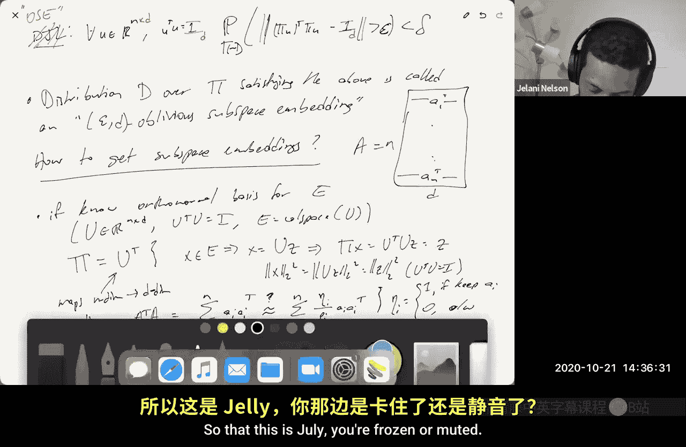
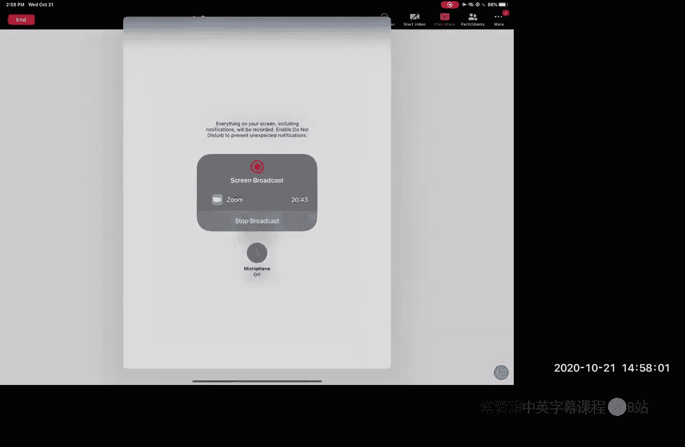
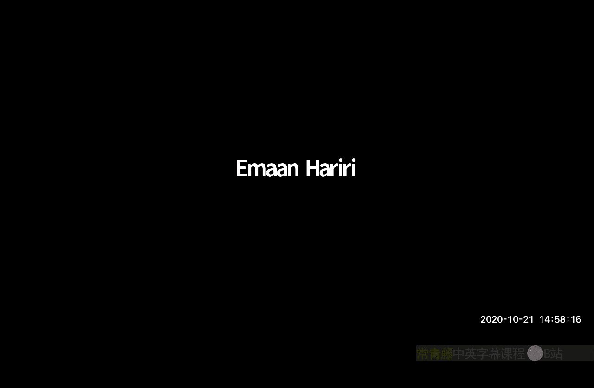
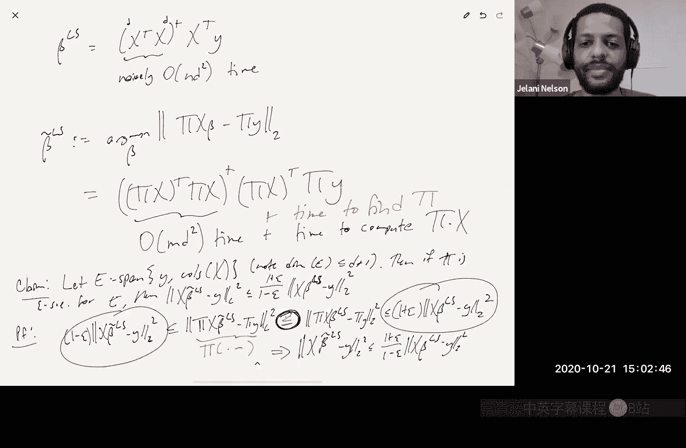

# 015：JL矩性质、子空间嵌入与草图求解

在本节课中，我们将继续讨论随机化线性代数中的草图算法。我们将学习JL矩性质的定义，并了解如何利用它来分析近似矩阵乘法。接着，我们将引入一个更强大的概念——子空间嵌入，并探讨其在“草图求解”范式中的应用，特别是用于加速最小二乘回归问题。

## JL矩性质与近似矩阵乘法

上一节我们介绍了基于采样的近似矩阵乘法方法，其误差以Frobenius范数衡量。该方法通过采样行并适当缩放来构造无偏估计量。然而，该方法依赖于矩阵A和B的行范数，在数据流等动态更新场景中可能不适用。

本节中，我们将探讨另一种基于Johnson-Lindenstrauss引理的方法。该方法通过一个随机投影矩阵Π来近似A和B，然后计算(ΠA)^T(ΠB)来近似A^TB。只要Π的分布良好且行数足够，就能以高概率保证Frobenius范数误差很小。

为了分析这种方法，我们首先引入一个核心概念。

**定义：JL矩性质**
一个分布D满足(ε, δ, p) JL矩性质，如果对于所有单位范数向量z，都有：
`E_Π~D [ | ||Πz||_2^2 - 1 |^p ] ≤ ε^p * δ`
其中p ≥ 1。

这个性质意味着，通过马尔可夫不等式，我们可以从矩的界推导出分布D能提供分布式的JL保证。我们之前讨论过的多种草图矩阵，如Count Sketch、稀疏JL、快速JL等，都满足特定参数下的JL矩性质。

接下来，我们看看这个性质如何帮助我们分析点积的近似。

**引理：点积的矩界**
假设分布D满足(ε, δ, p) JL矩性质。那么，对于所有单位范数向量x和y，有：
`|| (Πx)^T(Πy) - x^Ty ||_p ≤ ε * δ^(1/p)`

**证明思路：**
利用恒等式 `x^Ty = 1/4 (||x+y||^2 - ||x-y||^2)`，将点积差表示为范数平方差的组合，然后应用三角不等式和JL矩性质即可得证。

这个引理表明，仅从保持向量范数的矩界，就能自动得到保持点积的相同质量的矩界，无需付出额外代价。

现在，我们可以回到近似矩阵乘法的分析。

**定理：基于JL的近似矩阵乘法**
假设分布D满足(ε, δ, p) JL矩性质，且p ≥ 2。那么，以至少1-δ的概率，有：
`|| (ΠA)^T(ΠB) - A^TB ||_F ≤ ε * ||A||_F * ||B||_F`

**证明概要：**
1.  定义误差矩阵 M = (ΠA)^T(ΠB) - A^TB。其(i, j)元素为 `(Πa_i)^T(Πb_j) - a_i^T b_j`，其中a_i, b_j是A和B的列。
2.  计算M的Frobenius范数的p次矩。通过归一化列向量并应用之前的点积引理，可以将问题转化为对一系列独立随机变量矩的求和。
3.  利用三角不等式、柯西-施瓦茨不等式，最终将p次矩的界控制在 `(ε * ||A||_F * ||B||_F * δ^(1/p))^p` 以内。
4.  应用马尔可夫不等式，即可得到关于Frobenius范数的概率界。

这个定理表明，任何满足JL矩性质的分布（对应我们已知的各种JL构造），都能自动提供近似矩阵乘法保证，且无需像朴素联合界论证那样为处理大量点积而将δ设置得非常小。

## 从算子范数到子空间嵌入

上一节我们讨论了Frobenius范数下的近似矩阵乘法。现在，我们考虑一个更强的误差度量——算子范数（谱范数）。特别地，我们关注B = A的情况，即近似计算A^TA。

我们希望：`|| (ΠA)^T(ΠA) - A^TA ||_op ≤ ε * ||A||_op^2`。
根据定义，这等价于要求对于所有单位范数向量z，有：
`| ||ΠAz||_2^2 - ||Az||_2^2 | ≤ ε * ||Az||_2^2`。

这引出了一个更强大且广泛应用的概念：子空间嵌入。

**定义：子空间嵌入**
对于一个线性子空间E ⊆ R^n，矩阵Π被称为E的ε-子空间嵌入，如果对于所有x ∈ E，都有：
`(1 - ε) ||x||_2^2 ≤ ||Πx||_2^2 ≤ (1 + ε) ||x||_2^2`。

设U是一个n×d矩阵，其列构成E的一组标准正交基（即U^T U = I）。那么，Π是E的ε-子空间嵌入，当且仅当：
`|| (ΠU)^T(ΠU) - I ||_op ≤ ε`。

这可以看作是分布JL引理在矩阵上的自然推广：从保持单个向量的范数，推广到保持一个子空间内所有向量的范数。

**定义： oblivious子空间嵌入**
一个分布D被称为(d, ε, δ) oblivious子空间嵌入，如果对于任意n×d矩阵U（满足U^T U = I），以至少1-δ的概率从D中抽取的矩阵Π满足：
`|| (ΠU)^T(ΠU) - I ||_op ≤ ε`。

## 如何构造子空间嵌入

以下是几种构造子空间嵌入的方法：

**1. 已知正交基**
如果已知子空间E的标准正交基矩阵U，那么最简单的嵌入就是取Π = U^T。这将E中的向量x = Uz映射为z，完美保持范数（ε=0），并将维度降至d（这是可能的最小维度）。缺点是计算U（例如通过Gram-Schmidt或SVD）可能代价高昂。

**2. 行采样**
对于以矩阵A列空间形式给出的子空间，可以考虑对A的行进行采样。即构造采样矩阵Π，使得(ΠA)^T(ΠA)是A^TA的无偏或近似估计。关键问题在于如何设置采样概率。与Frobenius范数近似乘法不同，此时的最佳采样概率与A的“杠杆得分”有关，我们将在后续课程中详细讨论。

**3. Oblivious子空间嵌入**
这是我们本节重点介绍的方法。使用满足JL矩性质的随机矩阵Π（如Count Sketch、稀疏JL等）。通过更复杂的分析（通常涉及矩阵的矩不等式，如矩阵Bernstein不等式），可以证明当投影维度m约等于d/ε²时（可能带有对数因子），Π能以高概率成为任意d维子空间的嵌入。这种方法 oblivious，因为Π的选择不依赖于具体的子空间。

## 应用：草图求解范式

在介绍了子空间嵌入的概念后，我们来看一个重要的应用：“草图求解”范式。该范式由Sarlos在2006年提出，用于加速最小二乘回归等计算问题。

考虑最小二乘回归问题：`β_ls = argmin_β ||Xβ - y||_2`，其中X是n×d矩阵（n >> d）。其解析解为 `β_ls = (X^T X)^† X^T y`，其中†表示伪逆。直接计算需要O(nd²)时间。

草图求解法的思路是，通过一个子空间嵌入矩阵Π将问题“草图化”到低维空间，然后在草图空间中求解：

1.  **草图化**：计算 `X̃ = ΠX` 和 `ỹ = Πy`，其中Π是一个m×n的随机矩阵，m远小于n。
2.  **求解**：在草图空间中求解回归问题：`β̃ = argmin_β ||X̃β - ỹ||_2`。其解为 `β̃ = (X̃^T X̃)^† X̃^T ỹ`。
3.  **时间复杂度**：求解步骤耗时O(md²)。如果Π是稀疏的（如Count Sketch）或具有快速变换结构（如基于FFT的快速JL），则草图化步骤`ΠX`也可以快速完成，总时间远小于O(nd²)。

**关键问题**：为什么`β̃`是一个好的解？

**定理：草图求解的近似保证**
令E为X的列空间与向量y张成的子空间，其维度至多为d+1。如果Π是子空间E的一个ε-子空间嵌入，那么用`β̃`得到的回归残差满足：
`||Xβ̃ - y||_2^2 ≤ (1+ε)/(1-ε) * ||Xβ_ls - y||_2^2`

**证明概要：**
1.  由于`β̃`是草图空间中最小化`||ΠXβ - Πy||_2`的解，因此有 `||ΠXβ̃ - Πy||_2^2 ≤ ||ΠXβ_ls - Πy||_2^2`。
2.  因为对于任意β，向量`Xβ - y`都在子空间E中，而Π是E的嵌入，所以有：
    `(1-ε) ||Xβ - y||_2^2 ≤ ||Π(Xβ - y)||_2^2 ≤ (1+ε) ||Xβ - y||_2^2`。
3.  将上述嵌入性质应用于不等式两边，经过简单代数推导即可得到定理中的界。

这个定理表明，尽管我们求解的是一个压缩后的问题，但其解在原问题上的表现几乎与最优解一样好。通过结合子空间嵌入和近似矩阵乘法等技术，可以进一步优化所需的草图维度m，甚至可以将其降至O(d)（与ε无关），或用于为迭代法（如梯度下降）构造高效的预处理器。我们将在后续课程中深入探讨这些高级主题。

## 总结

本节课我们一起学习了：
1.  **JL矩性质**：一种通过矩来刻画分布JL保证的方式，它允许我们推导出点积和矩阵乘法的近似界，而无需使用浪费的联合界。
2.  **子空间嵌入**：一个比JL更强的概念，要求随机投影能同时保持一个子空间内所有向量的范数。它是分析更复杂草图算法的核心工具。
3.  **草图求解范式**：利用子空间嵌入将大规模优化问题（如最小二乘回归）压缩到一个小规模问题上求解，从而显著降低计算成本，同时提供理论上的近似保证。

下节课我们将继续探讨如何通过杠杆得分采样来构造子空间嵌入，并研究子空间嵌入在低秩近似、聚类等其他问题中的应用。