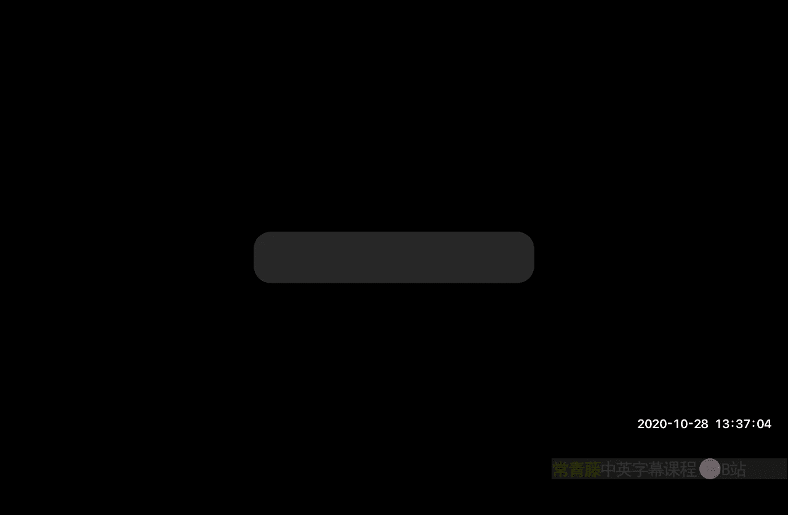
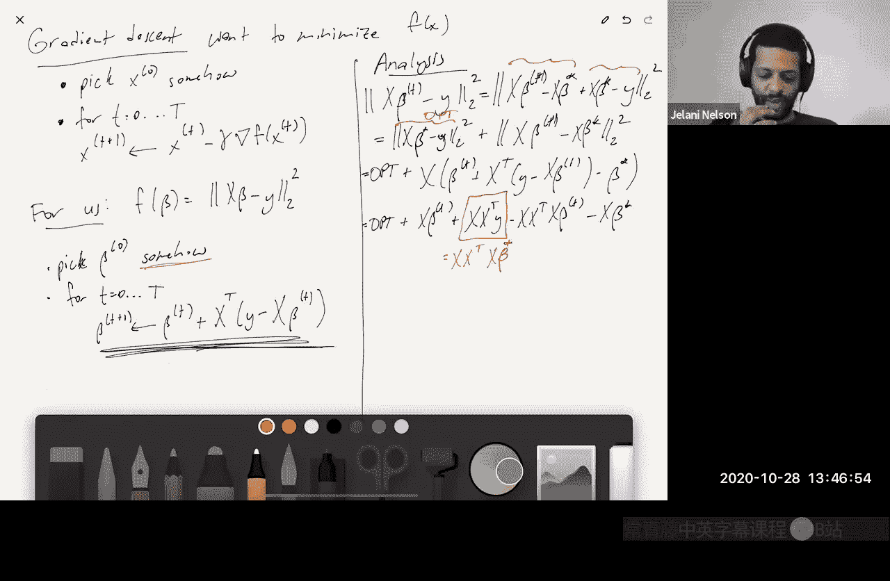
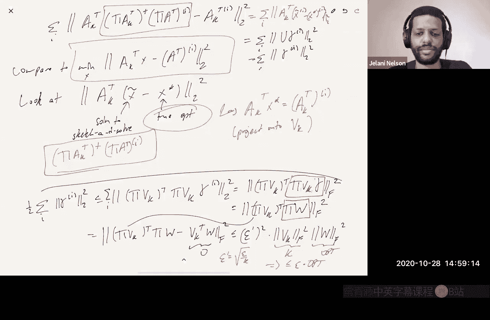

# 017：更快的迭代回归与低秩近似

在本节课中，我们将学习两种利用草图技术加速线性代数计算的方法：**基于预处理的迭代回归求解**和**低秩矩阵近似**。我们将看到，这两种方法的核心分析技巧与我们之前讨论的回归问题分析紧密相关。

## 概述：两种加速方法

上一节我们介绍了分析草图最小二乘的两种方法。本节中，我们将探讨第三种方法：**使用草图技术寻找一个好的预处理器**，然后将其用于梯度下降等迭代求解器。接着，我们将讨论如何将草图技术应用于**低秩近似**问题。我们会发现，其分析过程几乎完全复用了回归问题中已讨论过的技巧。

## 第一部分：基于预处理的迭代回归

### 梯度下降与最小二乘

首先，回顾梯度下降法。对于最小化函数 `F(x)` 的问题，我们从初始猜测 `x0` 开始，迭代更新：
`x_{t+1} = x_t - γ * ∇F(x_t)`
其中 `γ` 是一个小的步长参数。

对于最小二乘问题，我们的目标是：
`min_β ||Xβ - y||_2^2`
其梯度为 `∇F(β) = X^T(Xβ - y)`。若设置步长 `γ=1`，则更新规则为：
`β_{t+1} = β_t - X^T(Xβ_t - y)`

### 收敛性分析的关键

对上述迭代过程进行分析后，我们发现收敛速度与矩阵 `X` 的**条件数**密切相关。如果 `X` 的所有奇异值都接近1（即条件数很小），则算法会快速收敛。

然而，一般的输入矩阵 `X` 可能不具备这个性质。我们的解决方案是：**使用草图技术对 `X` 进行预处理，使其条件数变好**。

### 使用草图作为预处理器

以下是具体步骤：

1.  **计算草图**：选择一个常数质量的子空间嵌入矩阵 `Π`（例如，`1/3`-子空间嵌入）。计算 `ΠX`。
2.  **计算预处理矩阵**：对 `ΠX` 进行SVD分解：`ΠX = U' Σ' V'^T`。定义预处理矩阵 `R = V' (Σ')^{-1}`。
3.  **转换问题**：考虑等价问题 `min_β ||(XR)β - y||_2^2`。关键性质是，矩阵 `XR` 的所有奇异值都接近1。
4.  **迭代求解**：在新的矩阵 `XR` 上运行梯度下降。由于 `XR` 条件良好，算法会快速收敛。
5.  **初始化**：为了获得初始解 `β0`，我们可以对原问题 `min_β ||Xβ - y||_2^2` 运行一次**草图求解**，只需常数精度（如 `ε=0.1`）即可。这提供了满足 `||Xβ0 - y||^2 ≤ 1.1 * OPT` 的起点。

### 算法优势

*   **运行时间**：主要开销是每次迭代中与稀疏矩阵 `X` 的乘法（`O(nnz(X))`），加上应用小矩阵 `R` 的代价（`O(d^2)`）。总运行时间为 `O((nnz(X) + d^2) * log(1/ε))`，实现了对高精度 `ε` 的高效求解。
*   **与草图求解对比**：传统的草图求解方法运行时间依赖于 `poly(1/ε)`，而本方法仅依赖于 `log(1/ε)`，在需要高精度解时优势显著。

上一部分我们利用草图改善了矩阵的条件数，从而加速了迭代求解。接下来，我们将目光转向另一个重要问题——低秩近似。

## 第二部分：基于草图的低秩近似

### 问题定义与经典解

给定矩阵 `A ∈ R^{n×d}` 和参数 `k`，我们希望找到秩不超过 `k` 的矩阵 `B`，以最小化 `A` 与 `B` 之间的差异（通常使用Frobenius范数或算子范数）。

根据Eckart–Young定理，最优解 `A_k` 可通过截断 `A` 的SVD分解得到：`A_k = U_k Σ_k V_k^T`，其中只保留前 `k` 个最大的奇异值及对应的奇异向量。精确计算SVD的代价约为 `O(n * d^2)`。

### 草图加速方案

我们不直接计算全SVD然后截断，而是采用以下近似方案：

1.  计算草图矩阵 `ΠA^T`，其中 `Π ∈ R^{m×n}`，`m` 远小于 `n`。
2.  令 `P` 为到 `ΠA^T` 列空间的正交投影矩阵。
3.  计算 `PA` 的最佳秩 `k` 近似，作为我们的近似解 `Ã_k`。

即：
`Ã_k = argmin_{rank(B) ≤ k} ||PB - A||_F^2`
这等价于在 `ΠA^T` 的列空间内寻找 `A` 的最佳秩 `k` 近似。

### 算法效率

直接按照定义计算 `Ã_k` 的步骤如下：

1.  计算 `ΠA^T` 的SVD：`ΠA^T = U' Σ' V'^T`。`U'` 的列构成了 `ΠA^T` 列空间的一组标准正交基。
2.  计算矩阵 `C = U'^T A`。这是一个 `m × d` 的矩阵。
3.  计算 `C` 的最佳秩 `k` 近似 `C_k`（例如，通过计算 `C` 的SVD并截断）。
4.  输出 `Ã_k = U' C_k`。

运行时间主要消耗在计算 `U'^T A`（`O(m * n * d)`）和计算 `C` 的SVD（`O(d * m^2)`）。通过精心选择草图，我们可以使 `m` 约为 `O(k/ε)` 或 `O(k^2)`，从而相比全SVD的 `O(n * d^2)` 有显著加速。

更进一步的优化是，将步骤2和3中的精确最小化，替换为使用**草图求解技术**来近似求解一个相关的回归问题，从而将运行时间中的 `d` 也替换为 `k`。

### 近似质量保证

`Ã_k` 的质量取决于草图矩阵 `Π` 需满足的两个性质：

1.  **子空间嵌入**：`Π` 需是某个特定 `k` 维子空间的常数质量（如 `1/2`）子空间嵌入。
2.  **近似矩阵乘法**：对于Frobenius范数，`Π` 需提供误差约为 `O(√(ε/k))` 的近似矩阵乘法保证。

满足这些条件的草图（如Count Sketch、高斯矩阵等）可以确保：
`||A - Ã_k||_F^2 ≤ (1 + ε) * ||A - A_k||_F^2`

### 证明思路概要

证明的关键是将误差 `||A - Ã_k||_F^2` 分解为两部分：
`||A - Ã_k||_F^2 = ||(I - P)A_k||_F^2 + ||(I - P)(A - A_k)||_F^2`
其中，`P` 是到 `ΠA^T` 列空间的投影。

*   第二部分 `||(I - P)(A - A_k)||_F^2` 很容易被 `||A - A_k||_F^2`（即最优误差OPT）所界定。
*   核心在于控制第一部分 `||(I - P)A_k||_F^2`。通过展开和变形，可以发现这一项可以写成一系列向量差异的平方和。每个向量差异项，都**恰好对应一个以 `A_k^T` 为设计矩阵、以 `A^T` 的某一列为响应向量的最小二乘回归问题的草图求解误差**。

因此，我们可以直接套用之前（Charikar风格）分析草图求解回归误差的技术：**依赖于某个特定子空间（此处是 `V_k` 的列空间）的子空间嵌入性质，以及近似矩阵乘法性质**。最终可以证明，在 `Π` 满足前述两个条件时，第一部分误差可以被控制在 `ε * OPT` 以内。

## 总结

本节课中我们一起学习了：

1.  **迭代回归的加速**：通过使用草图技术构建预处理器 `R`，将原矩阵 `X` 转换为条件数良好的 `XR`，从而使得梯度下降法等迭代算法能够快速收敛到高精度解。该方法运行时间仅对数依赖于目标精度 `ε`。
2.  **低秩近似的加速**：通过将矩阵 `A` 投影到草图矩阵 `ΠA^T` 的列空间，并在该子空间内寻找最佳秩 `k` 近似，我们可以高效地得到一个质量有保证的近似解 `Ã_k`。其分析巧妙地归结到了我们已经熟悉的回归问题草图求解分析框架中。

这两种方法展示了草图技术在优化和矩阵计算中的强大与灵活，其核心思想都是通过随机投影降低问题维度或改善问题性质，从而在保证近似精度的前提下大幅提升计算效率。