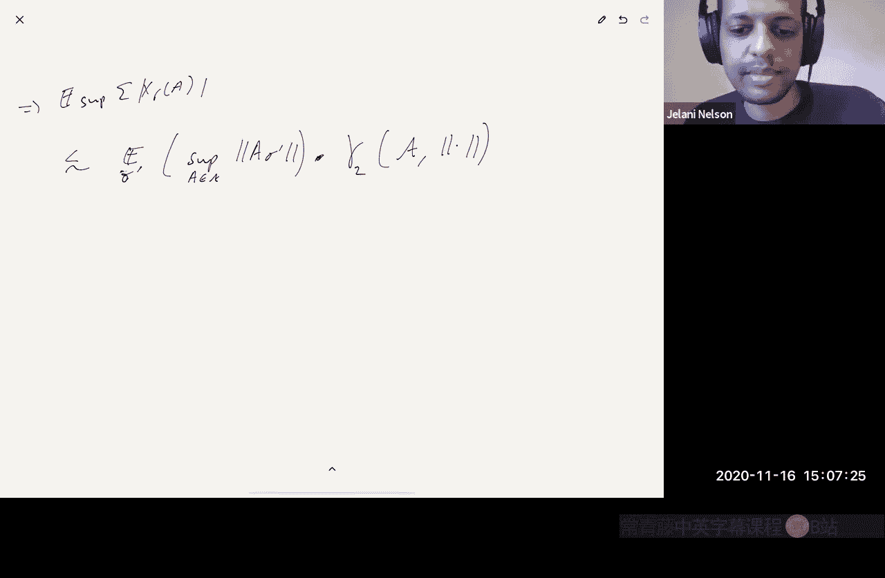

# 021：高斯过程的上确界、Dudley不等式、通用链与Gordon定理


## 概述

在本节课中，我们将学习Gordon的“穿越网格”定理及其在降维（如Johnson-Lindenstrauss引理）中的应用。我们将探讨如何通过高斯过程的均值宽度来统一理解多种降维场景，并介绍Dudley不等式和通用链等关键工具。

## 高斯过程均值宽度与Gordon定理

上一节我们回顾了课程中已涉及的几种欧几里得降维方法。本节中，我们来看看一个能统一这些方法的通用定理。

Gordon定理（1988年）指出：设 **Π** 是一个 **M × N** 的随机矩阵，其元素独立同分布于 **N(0, 1/M)**。那么，对于单位球面 **S^(N-1)** 的任意子集 **T**，以下不等式在期望意义上成立：

```
sup_{x ∈ T} | ||Πx||² - 1 | ≤ ε
```

只要矩阵 **Π** 的行数 **M** 满足：

```
M ≥ C * (w(T)² / ε²)
```

其中，**C** 是一个常数，**w(T)** 是集合 **T** 的**高斯均值宽度**。

高斯均值宽度 **w(T)** 的定义如下：设 **G** 是一个 **N** 维标准高斯随机向量（各分量独立，服从 **N(0,1)**），则：

```
w(T) = E_G [ sup_{x ∈ T} G·x ]
```

这个定理比之前提到的所有降维结果都更强。它可以直接推出Johnson-Lindenstrauss引理、子空间嵌入所需的最优行数，以及限制等距性质矩阵的构造。

## 如何估计高斯均值宽度

为了应用Gordon定理，我们需要理解如何估计给定集合 **T** 的高斯均值宽度 **w(T)**。以下是几种主要方法。

### 方法一：简单联合界

最直接的方法是使用联合界。由于对于每个固定的 **x ∈ T**，**G·x** 是一个方差为 **||x||² = 1** 的高斯随机变量。因此，**sup_{x ∈ T} G·x** 的期望最多是 **√(log |T|)**。具体推导如下：

```
w(T) = E[ sup_{x ∈ T} G·x ] ≤ λ + |T| * e^{-Θ(λ²)}
```

通过选择 **λ ≈ √(log |T|)**，我们得到 **w(T) = O(√(log |T|))**。

将这个界代入Gordon定理，我们得到 **M ≥ C * (log |T| / ε²)**，这正是Johnson-Lindenstrauss引理的形式。因此，仅用联合界就足以从Gordon定理推出JL引理。

### 方法二：利用ε-网

当集合 **T** 中的点彼此非常接近时，联合界是浪费的。我们可以利用ε-网来获得更紧的界。

设 **T'** 是 **T** 在 **L2** 范数下的一个 **ε**-网。那么，我们可以将 **w(T)** 分解：

```
w(T) ≤ w(T') + ε * E[ ||G|| ]
```

由于 **E[ ||G|| ] = O(√N)**，且 **w(T') = O(√(log |T'|))**，我们得到：

```
w(T) ≤ O( √(log N(T, L2, ε)) + ε√N )
```

其中 **N(T, L2, ε)** 是 **T** 的 **ε**-覆盖数。我们可以选择 **ε** 来优化这个上界。

### 方法三：Dudley不等式

我们可以将ε-网的思想进一步推广为一系列不同精度的网，从而得到Dudley积分不等式：

```
w(T) ≤ C * ∫_0^∞ √(log N(T, L2, u)) du
```

Dudley不等式通常已经能给出相当好的结果。例如，对于一个 **d** 维子空间 **E** 与单位球的交集 **T**，其覆盖数约为 **(C/u)^d**。代入Dudley积分可得 **w(T) = O(√d)**，从而从Gordon定理推出子空间嵌入所需行数为 **O(d/ε²)**。

然而，Dudley不等式有时不是最优的。例如，对于 **L1** 单位球，Dudley不等式给出的界是 **O(√(n) log n)**，而实际的高斯均值宽度是 **Θ(√(log n))**，存在一个 **log n** 因子的差距。

### 方法四：通用链与Majorizing Measures定理

为了获得最优的、适用于任何集合 **T** 的界，我们需要更复杂的工具——通用链和Majorizing Measures定理。

首先定义**容许序列**：一个序列 **{T_r}_{r≥0}** 称为容许的，如果满足：
1.  **T_0 ⊂ T_1 ⊂ ... ⊂ T**
2.  **|T_0| = 1**
3.  **|T_r| ≤ 2^{2^r}**

定义 **γ₂** 泛函：

```
γ₂(T, L2) = inf_{ {T_r} 容许 } sup_{x ∈ T} ∑_{r≥1} 2^{r/2} * dist_{L2}(x, T_r)
```

Talagrand的Majorizing Measures定理指出，对于任何 **T**，其高斯均值宽度满足：

```
c * γ₂(T, L2) ≤ w(T) ≤ C * γ₂(T, L2)
```

即，高斯均值宽度与 **γ₂** 泛函在常数倍内等价。这个定理总是给出最优的界。

## Gordon定理的证明思路：KMR引理

Gordon定理的完整证明涉及较多内容。这里我们概述一个由Krahmer、Mendelson和Rauhut在2014年提出的证明思路，该证明适用于次高斯分布（包括伯努利±1分布）。

KMR引理陈述如下：设矩阵 **A** 的条目为独立同分布的 **±1** 随机变量。那么有：

```
E_σ [ sup_{A ∈ 𝒜} | ||Aσ||² - E[||Aσ||²] | ] ≤ C * ( γ₂(𝒜, op)² + γ₂(𝒜, op) * rad_F(𝒜) + rad_F(𝒜) * rad_op(𝒜) )
```

其中：
*   **γ₂(𝒜, op)** 是关于算子范数的 **γ₂** 泛函。
*   **rad_F(𝒜)** 是集合 **𝒜** 的Frobenius范数半径。
*   **rad_op(𝒜)** 是集合 **𝒜** 的算子范数半径。

**如何用KMR引理证明Gordon定理（对于±1条目）？**

关键观察是，对于向量 **x**，我们可以构造一个特定的矩阵 **A_x**，使得随机投影的范数平方可以表示为：

```
||Πx||² = ||A_x σ||²
```

其中 **σ** 是将 **Π** 的所有条目连接起来的长向量。令 **𝒜 = {A_x : x ∈ T}**，那么Gordon定理中要控制的量就等同于KMR引理左边的形式。

通过计算可以发现：
*   **γ₂(𝒜, op)** 与 **γ₂(T, L2)** 成正比。
*   **rad_F(𝒜)** 和 **rad_op(𝒜)** 都是 **O(1)**。

将这些关系代入KMR引理的界，并利用Majorizing Measures定理（**γ₂(T, L2) ≈ w(T)**），我们最终得到：

```
M ≥ C * (w(T)² / ε²)
```

这正是Gordon定理的结论。

KMR引理本身的证明使用了**鞅差序列**、**解耦技巧**、**Kinchin不等式**以及对**容许序列**的复杂处理。核心思想是将目标表达式通过一个 telescoping sum（伸缩和）进行分解，然后逐项控制其期望。

## 总结



本节课我们一起学习了Gordon定理及其在降维中的强大应用。我们了解到，高斯均值宽度 **w(T)** 是衡量集合复杂度的关键几何量。为了估计它，我们介绍了从简单的联合界，到ε-网和Dudley积分不等式，再到最优的通用链与Majorizing Measures定理的一系列工具。最后，我们概述了通过KMR引理证明Gordon定理的思路，该证明揭示了随机投影保距性背后深刻的概率与几何原理。