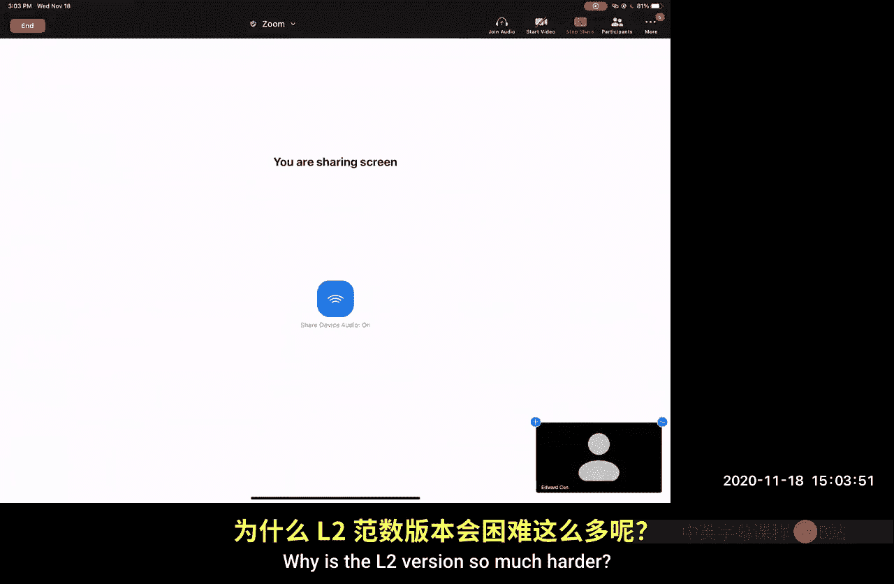
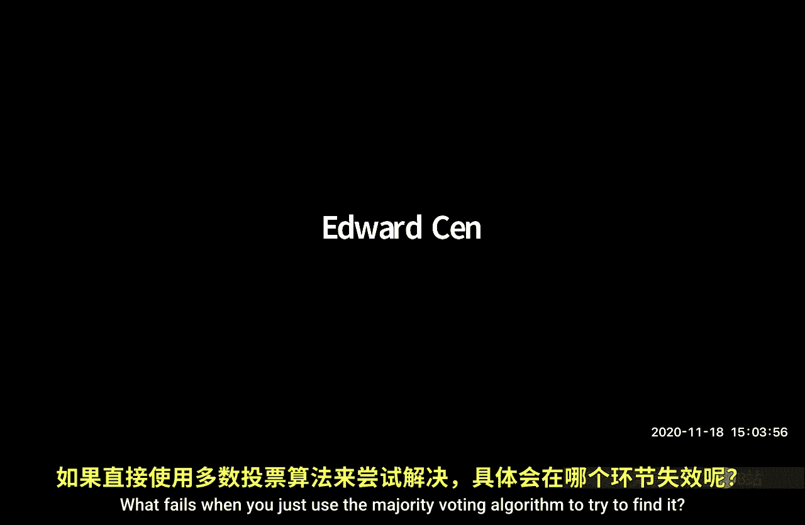

# 022：KMR定理证明收尾与BPTree算法

在本节课中，我们将完成KMR定理的证明，并学习如何利用Dudley不等式等工具，为L2重击者问题设计一个内存效率更高的算法——BPTree。

## KMR定理证明收尾

上一节我们介绍了KMR定理的证明框架，并定义了相关符号。本节中，我们来看看如何完成证明的最后部分。

我们定义了随机变量集合的期望上确界E，并已将其分解为几项之和。我们之前已经处理了第一项，现在需要处理中间项和右侧项。

以下是证明的核心步骤：

1.  我们定义了一个随机变量Z，它是所有a和所有r的|X_ra|之和的上确界。
2.  利用非负随机变量期望是其尾部概率的积分这一性质，我们通过变量替换引入了γ₂。
3.  通过应用Khinchine不等式并对所有r和所有T_r中的元素进行联合界，我们得到了一个收敛的和式。
4.  通过柯西-施瓦茨不等式和三角不等式，我们将E的界与E的平方根联系起来，最终得到一个关于√E的二次不等式。
5.  解这个二次不等式，取其较大的根，平方后即可得到E的最终上界：`E = O(γ₂² + γ₂ * d_F + d_F * d_op)`。

这个证明技巧被称为“平方根技巧”，在概率论中应用广泛。

## 随机过程上确界的其他应用

证明了KMR定理后，我们来看看随机过程上确界分析的其他应用。

以下是两个重要的应用方向：

1.  **证明SH满足RIP**：其中S是采样矩阵，H是哈达玛矩阵。这可以用于分析快速JL变换。
2.  **为插入流中的L2重击者问题设计更低内存的算法**：例如BPTree算法，它使用`O(k log k)`字的内存，而Count Sketch需要`O(k log n)`字。目前尚不清楚`O(k)`是否可能。

接下来，我们将重点介绍BPTree算法。

## BPTree算法：归约到超重问题

BPTree算法的核心思想是将L2重击者问题归约到一个更简单的问题——超重问题。

**超重问题定义**：一个项i被称为超重的，如果其频率的平方`x_i²`大于其他所有项频率平方和的1000倍（或某个大常数倍）。

归约过程如下：

1.  我们创建`q = O(k)`个独立的超重问题求解器副本`D_1, ..., D_q`。
2.  使用一个哈希函数`h`将全域`[n]`映射到`{1,...,q}`。
3.  当在流中看到项i时，将其发送到对应的求解器`D_h(i)`进行处理。
4.  对于任意一个重击者i，在它被哈希到的桶中，由于其他重击者碰撞进来的期望数量很少（`k/q`），且来自非重击者的噪声平方和期望也很小，因此i在其桶中极有可能是一个超重项。
5.  为了以高概率找出所有k个重击者，我们将上述结构重复`r = Θ(log k)`次。最终，如果一个项在超过`r/2`个副本中被报告，则将其输出。

这个归约过程保证了输出列表大小为`O(k)`，且不会漏掉任何真正的重击者。总内存开销为`O(k log k * S)`，其中S是解决单个超重问题所需的内存。

## BPTree算法：以常数内存解决超重问题

现在，我们来看如何用常数内存S解决超重问题。这是算法的核心创新。

假设存在一个超重项h。我们的目标是逐位学习其二进制表示`h_0, h_1, ..., h_{log n}`。

**核心引理**：设`y_0, y_1, ..., y_T`是一个仅插入流的频率向量演化过程。设`σ_1,..., σ_n`是四向独立的±1随机变量。那么，期望`E[sup_t |σ · y_t|] = O(||y_T||_2)`。这个引理是Levy极大不等式在四向独立和任意插入流上的推广。

**利用引理逐位学习**：
1.  为了学习第0位，我们初始化两个计数器`B_0`和`B_1`，并生成四向独立的随机符号`σ`。
2.  当流中出现项i时，检查其最低位。若为0，则向`B_0`加`σ_i`；若为1，则向`B_1`加`σ_i`。
3.  设Δ是超重项h的最终频率`x_h`。我们等待，直到某个计数器的绝对值超过`Δ/10`。
4.  根据引理，代表错误项的计数器（如`B_0`）的噪声始终很小（`O(||y_T||_2)`），而`||y_T||_2`远小于Δ。
5.  同时，当h出现足够多次（约`Δ/10`次）后，代表正确项的计数器（如`B_1`）的值将接近`σ_h * (Δ/10)`，其幅度会超过阈值。
6.  因此，首先超过阈值的计数器所对应的位，极有可能就是h的第0位。

**学习所有位**：
1.  学习第0位会消耗h的一小部分出现次数（如10%）。
2.  在学习下一位时，我们只处理那些前缀与已学位匹配的项。由于使用了随机排列，剩余噪声项的数量会以因子2的指数级减少。
3.  因此，h相对于剩余噪声的“超重”程度指数级增加，学习后续位所需消耗的h出现次数指数级减少。
4.  总消耗次数是一个收敛的几何级数，可以在流结束前学完h的所有位。

**处理未知的Δ**：
1.  我们并行运行多个算法副本，每个副本假设不同的Δ猜测值（2的幂次）。
2.  同时，运行一个AMS草图来持续估计当前流的L2范数。
3.  当AMS草图指示当前L2范数远超某个猜测值时，就丢弃对应的副本，并启动一个具有更高猜测值的新副本。
4.  利用引理的类似版本，可以证明AMS草图在所有时间步上的最大误差有界，因此无需为联合界付出额外内存开销。

**引理的证明思路**：
1.  将问题转化为求一个Rademacher过程的上确界期望。
2.  应用Dudley熵积分，其上界依赖于集合在L2范数下的覆盖数。
3.  对于插入流产生的向量序列，可以证明其ε-覆盖数至多为`O(1/ε²)`。
4.  将此覆盖数界代入Dudley积分，得到一个收敛的级数，从而证明期望上确界为`O(||y_T||_2)`。
5.  关键点在于，四向独立性足以保证Rademacher过程的尾部概率衰减足够快，使得Dudley积分收敛。

本节课中，我们一起学习了如何完成KMR定理的证明，并深入探讨了BPTree算法。该算法通过将L2重击者问题归约到超重问题，并利用关于随机过程上确界的新颖引理，实现了`O(k log k)`字的内存消耗，是数据流算法设计中的一个优美范例。