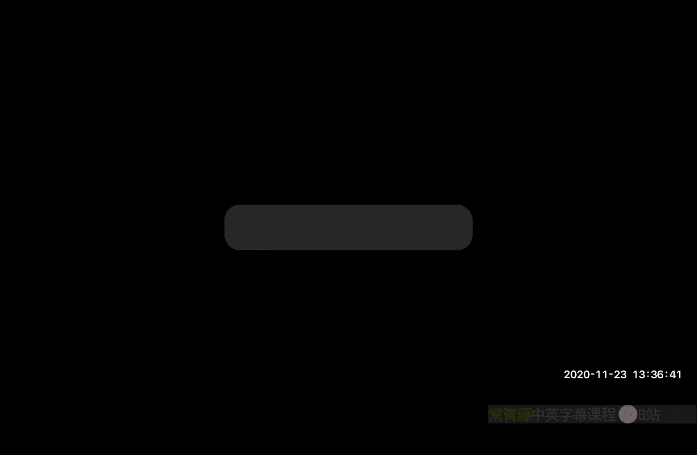
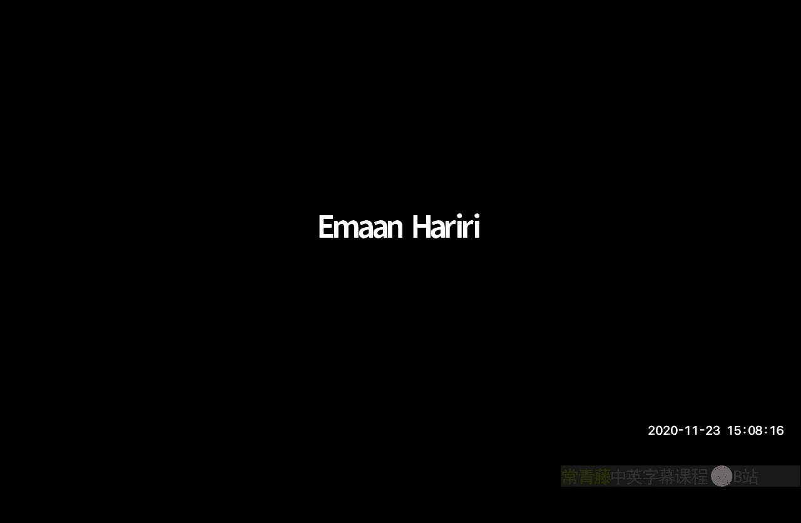

# 023：通过采样DFT实现RIP，稀疏傅里叶变换

在本节课中，我们将学习稀疏傅里叶变换。核心思想是，当我们知道一个信号的傅里叶变换是稀疏或近似稀疏时，能否设计出比标准快速傅里叶变换更快的算法来近似计算它。

## 概述

我们被给予对一个n维信号 **x** 的查询访问权限。我们希望计算其离散傅里叶变换 **x̂**。标准FFT算法可以在 **O(n log n)** 时间内完成此计算。然而，在许多应用中，例如图像和音频压缩，信号的傅里叶变换是近似稀疏的。如果 **x̂** 是近似k稀疏的，我们能否在接近 **k** 的时间（例如 **k polylog(n)**）内近似计算它？本节课将探讨这个可能性。

首先，我们将展示，即使只查看信号 **x** 的极少部分条目，理论上也包含足够的信息来恢复稀疏的傅里叶变换。我们将通过证明对逆傅里叶变换矩阵进行随机行采样能满足限制等距性质来实现这一点。这为从次线性数量的时域样本中进行压缩感知恢复提供了概念证明。

然而，基于RIP的恢复算法（如基追踪）在计算上并不高效。因此，我们将转向一种专门针对稀疏傅里叶变换设计的、真正次线性时间的算法。我们将重点讨论 **k=1** 的情况，展示如何通过巧妙的采样和比较，以 **O(log n log log n)** 的查询复杂度和运行时间，鲁棒地恢复出主导的傅里叶系数及其位置。

## 从概念到可行性：采样与RIP

上一节我们提出了能否通过次线性查询近似稀疏傅里叶变换的问题。本节中，我们首先来证明这在信息论上是可行的：通过随机采样时域信号，我们获得的测量值包含足够的信息。

我们考虑逆离散傅里叶变换矩阵 **F⁻¹**。定义采样矩阵 **S** 为一个 n×n 的对角矩阵，其对角线元素 **δ_j** 是独立的伯努利随机变量，取1的概率为 **m/n**，取0的概率为 **1 - m/n**。这相当于从时域信号 **x** 中随机选取 **m** 个样本。

**核心主张**：缩放后的矩阵 **(1/√m) S F⁻¹** 以高概率满足 **k** 阶限制等距性质，只要 **m = O(k polylog(n))**。

这意味着，给定测量值 **y = (1/√m) S x**（即随机时域样本），我们可以通过解决一个优化问题（如基追踪）来近似恢复 **k** 稀疏的 **x̂**，并保证如下形式的误差界：
**‖x̂ - x̃‖₂ ≤ C * ‖x̂_{tail(k)}‖₂**
其中 **x̂_{tail(k)}** 是 **x̂** 中除最大k个分量外的部分。

**证明思路简述**：
证明的关键在于界定以下期望值：
**E_δ [ sup_{|T|=k} ‖ I_T - (1/m) Σ_{j} δ_j x_j_T x_j_T^* ‖ ]**
其中 **x_j** 是 **F⁻¹** 的第j行。通过对称化、引入Rademacher随机变量 **σ**，并利用算子范数的定义，我们可以将问题转化为界定一个Rademacher过程的期望上确界。

应用 Dudley 积分不等式，该上确界可由覆盖数的积分来界定。这里的距离度量是一种依赖于采样集 **Ω**（即 **δ_j=1** 的索引j的集合）的“星范数”。通过结合体积论证（对小半径）和 Maurey 经验方法（对大半径）来界定覆盖数，并利用一个关键的平方根技巧来处理自引用项，最终可以证明，当 **m = O(k polylog(n))** 时，RIP 常数可以足够小。

这个结果非常重要，因为它从理论上证实了从 **O(k polylog(n))** 个时域样本中恢复稀疏频谱是可能的。然而，正如之前指出的，基于RIP的恢复算法通常需要至少 **O(n)** 的计算时间，这并不比FFT快。因此，我们需要寻找真正次线性的算法。

## 精确单稀疏情况下的次线性算法

在深入噪声鲁棒性算法之前，我们先看一个最简单的情况：**x̂** 是严格单稀疏的，即只有一个非零傅里叶系数。这展示了次线性时间算法的基本可能性。

假设 **x̂_u ≠ 0**，且对于所有 **v ≠ u**，有 **x̂_v = 0**。根据逆DFT公式，时域信号为：
**x_j = (1/n) Σ_{a=0}^{n-1} x̂_a ω^{-a j} = (1/n) x̂_u ω^{-u j}**
其中 **ω = e^{-2πi / n}**。

**算法**：
1.  查询 **x_0**。根据公式，**x_0 = (1/n) x̂_u**。
2.  查询 **x_1**。根据公式，**x_1 = (1/n) x̂_u ω^{-u}**。
3.  计算 **x̂_u = n * x_0**。
4.  计算 **ω^{-u} = x_1 / x_0**。由于 **ω** 是本原单位根，我们可以从中解出频率索引 **u**。

因此，仅通过查看**两个**时域条目，我们就可以精确计算出单稀疏的傅里叶变换。然而，这个方案对噪声非常敏感。如果 **x̂** 只是近似稀疏（即存在小能量的尾部），该算法将失效。

## 鲁棒的次线性时间算法（k=1）

上一节我们看到了无噪声下的简单方案。本节中，我们来看看如何设计一个能够容忍近似稀疏性（即存在噪声尾部）的算法。我们将专注于 **k=1** 的情况，目标是找到一个估计 **x̃**，使得：
**‖x̃ - x̂‖₂ ≤ O( ‖x̂_{tail(1)}‖₂ )**
其中 **x̂_{tail(1)}** 是去除最大分量后的向量。

算法的核心思想是逐比特确定主导频率 **u** 的二进制表示。假设 **u** 是一个 **log₂ n** 比特的数字。

**基本无噪声情况下的比特提取**：
首先，我们如何获取 **u** 的最低有效位（奇偶性）？
1.  计算 **A = x_0 + x_{n/2}** 和 **B = x_0 - x_{n/2}**。
2.  根据DFT性质，可以推导出：
    *   如果 **u** 是偶数，则 **x_{n/2} = (1/n) x̂_u**，因此 **A ≈ 2*(1/n)x̂_u**，**B ≈ 0**。
    *   如果 **u** 是奇数，则 **x_{n/2} = -(1/n) x̂_u**，因此 **A ≈ 0**，**B ≈ 2*(1/n)x̂_u**。
3.  比较 **|A|** 和 **|B|**。较大的那个指示了 **u** 的奇偶性。

在得知最低有效位后，我们可以通过一个简单的技巧（在时域乘以一个相位因子 **ω^j**，相当于在频域进行循环移位），“归零”已确定的低位，使得 **u** 在新的等效问题中变成2的倍数。然后，我们可以通过比较 **x_0 + x_{n/4}** 和 **x_0 - x_{n/4}** 来提取下一位比特。以此类推，重复 **log₂ n** 次即可确定所有比特。

**引入噪声与随机化**：
当存在噪声时，问题在于噪声可能会集中在某次比较所使用的特定时域点（如 **x_0** 或 **x_{n/2}**）上，从而导致比特判断错误。

解决方案是**随机化**采样位置，以平均掉噪声的影响。
为了判断第 **i** 个比特：
1.  不再固定使用 **x_0** 和 **x_{n/2^i}**，而是随机均匀选取一个偏移量 **r**。
2.  计算 **A_r = x_r + x_{r + n/2^i}** 和 **B_r = x_r - x_{r + n/2^i}**（索引模 **n**）。
3.  比较 **|A_r|** 和 **|B_r|**。
4.  独立重复此过程 **O(log log n)** 次，取多数结果作为该比特的估计。

**原理**：由于逆傅里叶变换是正交的，频域噪声在时域是均匀扩散的（具有相同的总能量）。随机选择 **r** 使得在 **x_r** 和 **x_{r+n/2^i}** 处遇到大噪声的概率很小。通过多次重复和多数表决，可以以高概率正确判断每个比特。

**算法复杂度**：
*   **查询复杂度**：需要判断 **log₂ n** 个比特，每个比特重复 **O(log log n)** 次，每次查询2个点。总查询次数为 **O(log n log log n)**。
*   **时间复杂度和**：与查询复杂度同阶，为 **O(log n log log n)**。
*   **恢复值**：在确定频率索引 **u** 后，可以通过对少数几个 **x_j** 采样并解一个小线性方程组来估计 **x̂_u** 的值。

这种方法实现了真正的次线性时间，并且对近似稀疏性具有鲁棒性。

## 总结

本节课中我们一起学习了稀疏傅里叶变换的基本概念和算法思路。

我们首先探讨了从次线性时域样本中恢复稀疏频谱的理论可能性，通过证明随机采样逆DFT矩阵满足RIP性质，确立了信息论上的可行性。这为压缩感知在此场景的应用奠定了基础。

接着，我们针对最简单的单稀疏精确情况，展示了一个仅需两次查询的极简算法，揭示了次线性时间算法的潜力。

最后，也是最重要的，我们详细介绍了一种鲁棒的、次线性时间的算法，用于处理近似单稀疏的情况。该算法通过随机化采样位置和逐比特频率恢复的策略，以 **O(log n log log n)** 的查询和计算时间，能够高概率地恢复出主导频率及其系数，并满足 **L₂** 误差界。这为在诸如压缩等实际应用中快速计算近似稀疏的傅里叶变换提供了有希望的途径。

对于更大的 **k**，算法思想可以推广，但需要更复杂的技术来识别和分离多个频率分量，这超出了本节课的范围。

谢谢，教授。

