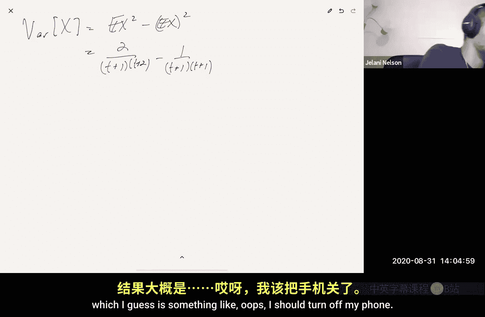
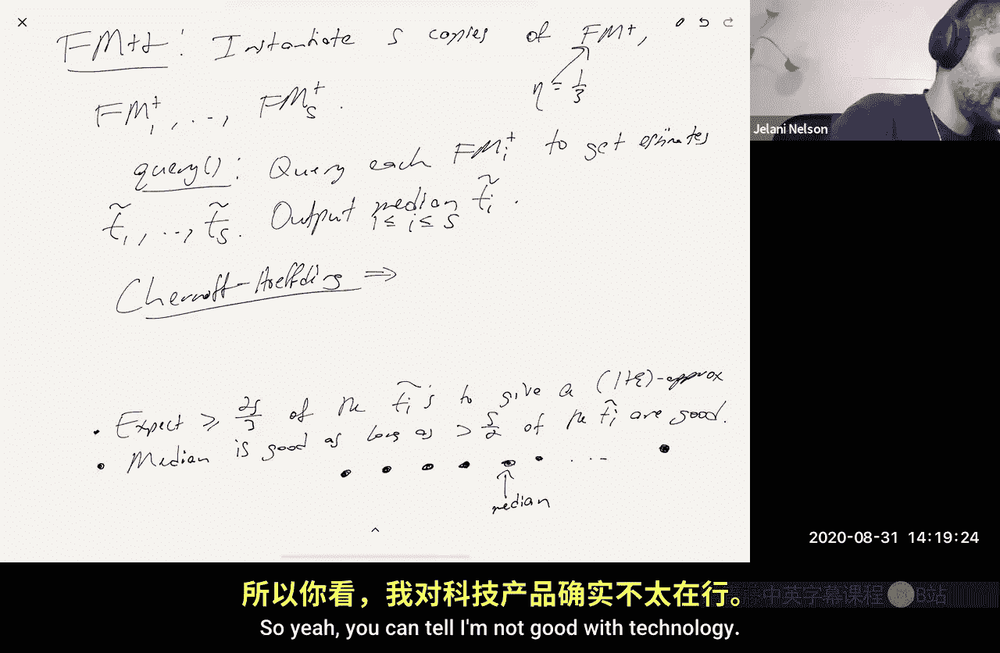
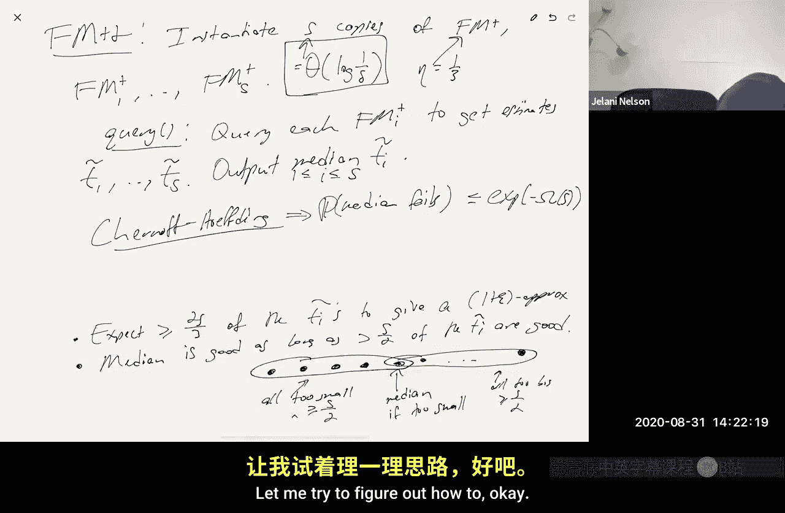

# 加州大学伯克利分校【中英⚡数据流算法｜CS294 Fall 2020, Sketching Algorithms】 p02 P2 Distinct elements, k-wise independence -BV11zi7BjEHu_p2-

I think you're on mute honey。Yes， thank you， can you hear me now？Yep， okay， great。Yeah。

 so hello everybody just one logistical thing I want to get out of the way before we start for today。

 I know that there are several of you who are interested in registering for the course。

 but couldn't yet because of the enrollment cap。I'm just talking to the department you know now about getting permission to have a GSI for the course。

 there are 86 people in total who seem to be interested in taking the course。

With an enrollment cap of 25， I'm more than happy to。

To teach as many as possible it's just if the number gets really big I would definitely need a you know GSI support for grading so once I get that confirmed i'm going to you know increase the cap hopefully it gets confirmed if it does and i'll be able to increase the cap so。

I'll make that announcement on Piazza when I get more information in the meantime just feel free to keep coming to lecture at the very least you're allowed to audit if it turns out that I won't be able to take more registered students。

But I hope to get that information in the very near future as to whether we're able to get a GSI or not。

Okay。so let's continue where we left off。And I hope everybody noticed that the first lecture is online it's on YouTube。

 it's linked from the lectures portion of the course website and you do need to be logged into your Berkeley。

edduu email address on YouTube to be able to watch the video there are a few of you who are listening to the course from the Simons Institute who might not have a Berkeley。

edduu account。If you're in that situation， just send me an email and I can。

Give you permission to be able to watch the video。Okay， so let's start。So last time。

We did approximate counting via the Morris counter。

And this time we're going to continue with counting， but we're going to look at count distinct。嗯。

So the input stream。Is this a sequence of integers I1？I too up let's say I am。嗯。

Or each one of these is some integer between one to n。And then query。How many distinct？嗯。

Integers were in the stream。It just to be clear， let's say I have a stream that looks like 11。5，1，3。

7，4，4。Then what what are distinct elements here， well， there's one， we've already seen one。

 there's five。There's three，7， four， so the answer here would be five。是。是。嗯。

Now there are two trivial solutions。Remember， our goal is to minimize memory consumption so the first trivial solution is to maintain a bit vector。

Of length N。Right， so whenever we see if we see integer I in the stream。

 we just set the I bit of our bit vector to one， otherwise。

 you know initially all the entire bit vector is set to zero。

So that's end bits of memory and then when it's query time we can scan over the input and scan over the bit vector and just see how many ones we have okay。

So this is end bits of memory。And the second trivial solution is just to remember the entire stream。

So each input in the stream is a log n bit number， there are M numbers， so M log n bits。

And that's remembering the whole stream。Okay。So our our question here is whether we can you know beat the beat these naive bounds and we're going to beat them exponentially。

 okay， we're going to instead of using the min of say NM memory。

 we're going to use something that's more proportional to the logarith。对。Today。

 I think we're not going to actually see。Well， I'll mention some we're not going to see the optimal algorithm today。

 but we're going to see algorithms that are pretty good。没人。嗯。So。First， I want to say that。嗯。

Aone Marius insti。Showed that。嗯。There is no。Yeah。Low memory algorithm。And when I say low memory。

 I mean like little low of say the min of N and M。Bits。Unless you're both randomized。😡。

And approximate。So what I mean by that， let's say that the true。numberumber of distinct elements。

Is let's say t， then what we're going to output is a T tilde。So we want to output。

T Tilde such that the probability that T Tilde deviates from the truth by more than a multiplicative one epsilon error。

Is that most delta just like what we saw with the Morris counter。

 this kind of approximate random approximate and random randomized an approximate algorithm？

I will show in this course how you prove this， how you prove that there is no low memory algorithm unless you're both approximately randomized but that's for later so now I just want to show you how to actually do it。

And。The first。Kind of nontrivial algorithm。That's idealized and else it's idealized in the sense that it's not there are reasons why you can't actually implement this algorithm as you know as as described in。

In low memory， but if you make。Certain unrealistic assumptions than you can and we'll show later that you know this work was done in the 80s and basically said if you have random functions that you know are free to store。

 which in reality， why would a random function be for you to store but if you you know a hash function。

If you had a perfectly random hash function。Then we can get a low memory algorithm of course the question then is how do you store this perfectly random hash function that's another matter which we'll get to how to remove that assumption。

 but if you make the assumption that you have a perfectly random hash function which which I call idealized then it turns out you can have a low memory algorithm。

And this algorithm was due to。Flaagile。And Martin。Also the 80s， I think maybe it's 1985。Or 82。

 I don't know， sometime in the first half of the 80s。嗯。对。And I'll call the algorithm。

 the FM algorithm for flagagla Martin。And that's the first thing that I want to describe to you today。

嗯。And also before one other logistical thing I meant to mention， which I forgot。嗯。😊。

You know this this whole Berkeley time of starting 10 minutes into class time traditionally is there to allow people to have time to go from classroom to classroom。

 but now since everything is online I think it's maybe it's just kind of cutting into time that we could be learning cool stuff so let's let's have you know a five minute Berkeley time so from now on i'm going to start lecturing。

Not at 140 but at 135 and let's see how that goes maybe eventually by the end of the semester i'll just get rid of it entirely。

 but now i'm taking baby steps so。Birth of time is halved from Wednesday onward。Okay。

 so what's this FL algorithm？So。When knowWhen you initialize at the beginning of the stream。

 I'm going to allocate one counter x， and I'm going to set that counter to zero。No， not to zero。

 I'll set it to one。听。And then when there's an update， I see an integer in the stream。Oh and also。

 I'll pick a random hash function。H。Which maps the integers from one to n。Into。

The continuous interval from zero to1。对。So I mean， what is N， for example， let's say that you know。

 I'm， I'm a router， I'm monitoring network traffic on some link。😡。

And I want to know how many distinct IP addresses。You know sent traffic on this link okay。

 so then n is something like you know， let's say it's IPv4 n is2 to the 32 there are you know two to the 32 possible IP addresses。

And every time I see a packet sent， I look at the source IP and that you know that source IP is an integer I'm seeing in the stream it's an integer between zero and two to the 32 minus one right and then answering this count distinct question is then telling me the answer to how many distinct IP addresses are sending traffic on this link。

Just so you have something。Some one example to keep in mind。

 but this thing gets used all over the place。Update I okay。

 so what is the algorithm to do for update I。It's going to set x to be the min of what it was before。

😡，And H ofI。And then to answer a query for the number of distinct integers I've seen。

 I'm going to return。1 over x minus1。系。So that's the algorithm， it's pretty simple。Okay。

Why is it idealized I mentioned it it's because we're assuming access to this hash function right in reality I mean there are two issues here what is H you know what is H so your're taught you know。

What is this age here？I mean， to specify H， I have to tell you that h of one or h of let's say one is something。

H of two is something H of three is something all the way down to you know H of N is something。

These are all random numbers， so I need to you know I need to。

I need to store them there's no simple way to describe age it's totally random so I need to store n random numbers that's you know n units of memory even more than you know these random numbers are not just bits they're real numbers so let's say end units of memory。

😡，There's already a trivial solution that uses end bits of memory which is the bit vector of lengthed so why am I storing n real numbers that seems to be even worse than storing end bits okay so that seems like a problem and of course the other problem is that as I already said they're real numbers they're not bits my computer can store bits okay。

My computer could store real numbers。Now you can store them round into some finite precision。

You could you could analyze this algorithm where you do that。

 you actually round the range to some finite precision。And， you know。

 you'll you'll get something meaningful， but you know， that's again。

 that's still more complicated or more memory consumption than a bit vector of length in。Okay。

 so we're just going to ignore these issues for now and we're going to assume that we can just store H for free in the sky。

 okay， but we will later talk about a non idealized algorithm that doesn't need to make this assumption。

And we're going to touch on， I know someone asked about this last week。

 we're going to touch on pseudo randomness， you know， introduce a little bit of。

The concept of pseudo randomness and how it can be applied to this situation to actually get a good result。

 removing the idealized assumption。But for now， let's just pretend that we have this H。

So you know why why this what we're doing make any sense like where is this coming from Okay why yeah so the main idea here and let me actually switch back color the main idea。

Is order statistics？Right。this counter x that I'm st in memory， x。Is the minimum。T。

 remember T is the actual number of distinct elements。T independent。Uniform random variables。

So uniform between zero and one。Okay， and what are we storing？Yeah， so restoring the minimum Okay。

 right because let's say the actual distinct numbers in the stream are you know I1 I2 up to I。

 So what is what are rest storing in our memory it's the min of。Of H of I1 up to H of I T， sorry。

And so what does that look like？Here's zero。Here's one。What do we expect， you know， okay。

 so let's just。Easy one， let's say we only had one distinct number in this stream， Okay。

 so x is just storing， you know H of1 where， you know one is the only thing that ever appeared in the stream。

So if we have a uniform， you know， if we know't H of1 is uniform between the interval in the interval from zero to1。

 so what do we expect H of1 to be just anyone just unmute yourself and say it。

 make sure I'm not talking to myself here。One half one half right so a uniform random very expected to be a half okay。

Now we don't have one random variable， but we have T and we're taking the minimum of these T random variables and they're independent。

 what do we expect this is the picture to look like？😡，So we're going to we'll prove it。

 but kind of what the truth is is that you expect them to be evenly spaced。

So there's something like this。So this one here is going to be roughly one over t plus1。

 one or two over t plus1， three over t plus1 and four over t plus1。So here are T is four。So a fifth。

 two fifth， three fifth and four fifths， you know， if you had five just distinct elements in the stream。

 so you expect the minimum， you expect the minimum to be one over t plus one， right？

So and what we're returning， we're returning1 over x minus1， so1 over x is t plus one。😡。

And then you subtract one， t plus1 minus1 is t。Okay。

 so that's why we're returning what we're returning during a query。嗯。Now what could go wrong here。

 of course， the thing that goes wrong is that this is a random process， you know。

 x and expectation is one over t plus1， but it's not guaranteed to be1 over t plus1。

There's going to be some variance。So the answer our response to the query is not necessarily going to be。

Exactly correct right we have to show then that it's going to be approximately correct with decent probability。

And even that's not going to be true， so we're going to modify the algorithm in a similar way to what we did with Morris where we kind of beefed up the algorithm to improve its approximation factor and also to reduce its failure probability。

So。The first claim。Is that the expectation of x is y over t plus1。

 and what's the proof of that claim？Whenever you have a non negative random variable， right？

Its expectation is the integral from zero to infinity of the probability of a taildown。是。

This follows by， for example， integration by parts， I'm not going to show it here。

Now we know that our random variable can never be bigger than one because all of the the hash function can never give you an output that's bigger than one。

 so this is the same thing as just integrating from zero to1。For us。对。

This is supposed to be a small x。Okay。So。Remember now capital x is the minimum hash value。Okay。

But let's say， you know， let's say for us now we're going to say that。你诶 let's say that。

The the seahouse values。R let's call the capital x1 up to capital Xt。

So if the minimum is bigger than x what that's the same thing as saying that all of them are bigger than x right so this is equivalent to saying。

😡，That we have the event that for all。Let's say I capital X is bigger than Xdx。对。Now。

 remember that these are independent random variables。

The problem that x1 is bigger than x and x2 is bigger than x and x2 is bigger than x is the same as the product。

Of the probabilities since they're independent， so it is the same as the product I goes from1 to T of the probability that X is bigger than X dx。

And now what's this picture here？We have。0，1。 We have this interval。

And then capital X is a random number in this range， and here we have an x somewhere。

So here's little X。So we're asking， what's the probability that？Capital X。Is in this interval。

So what is that？What's that probability？1 minus x that's1 minus x right so this is equal to the integral from zero to1 of one minus x to the t of power to dx。

Okay， and， you know， you all know calculus， if you do a， you know。

 if you do a substitution and integrate this， you will get exactly what I said you'll get one over equals one。

嗯。So that's that。嗯。And remember what you know， so we got one part of the。You know。

 picture understood， which is showing that we have some we have some like， you know， exact。

Expression for the expectation， and now we need to understand how well concentrated it is。

 which means we need to understand the variance。确。And again。

 remember that whenever you ever random a variable。The expectation， right？What is the variance？

What it mean variance of a random variable is the same thing as right， the expectation of。

That random variable minus its expectation squared。

Which is the same thing as the expectation of x squared minus the expectation of x squared。

Okay so we know what this is right we said that this is now one over t plus one。Squared。

 so the question is what this thing is。And again， that's some computation。And the claim。

Is that the expectation of x squared？Is equal to。嗯。Two over t plus one。T two。嗯。And。

AndThe proof is very similar to the last， you know， the last whiteboard in that you integrate。

You say the expectation of x squared is equal to the integral。Zro to1。

 the probability that x squared is bigger than little x dx。Which is the same thing。

 this is integral01， the probability that capital x is bigger than little root in a root X dx。Right。

 which is now， I guess， one minus。1 minus rootx。To the TDX。Okay。

 you're missing a square square sign on the first line of the proof。So it should be， yeah。

 it should be probably if x squared is larger than x squared。NoSo enough， first， so enough。 No， no。

 no， like the right hand sider， writer， the other。The other term， what do you mean the other term？

X squared is larger than x squared， right， no， no， it's not， it's not。's This is correct。

Okay just in general， right guess in general。The expectation of Z。

 any non negative re z is the integral of probability that Z is bigger than。Little X Dx。

So you knowm sorry heard about that so yeah no problem， so here my Z is just you know x squared。O。

And here you can do a U substitution， so you know I'll just tell you you set u to be1 minus root lamb1 minus root x。

You do a U substitution， you work this out， you'll get exactly what I told you。

 I have this computation in the notes so you can check it for yourself。

I don't want to spend time on kind of the level details。So that's it。

So we know now that kind of the variance。Of x， right。

 we says is the expectation of x squared minus the expectation of x。Squared。So this is equal to。嗯。

Two over t plus1 t plus2。Minus1 over t plus1， T plus1。hi I guess something like。

I should turn off my phone。

I need to figure out how to。Prevent my iPad from taking calls too anyway。嗯。Good， so what is this。

 this is equal to， I guess， two t plus one。Minus t plus 2。Over t plus1 squared t plus2。Right。

And the numerator is 2 t plus2 minus t minus2， so this is this numerator here。

I can just is equal to actually just T， I think。Right。😊，So this is equal to。1 over t plus1 squared。

Times t over t plus2， which I'll just note this thing here is less than one。

So this is less than one over t plus1 squared， which is which is also just。

Which is just the expectation of x squared root。So have we have that the variance。In our case。

 is at most the square of the expectation。看。Now。Right you want to use chubby she's inequ。

 but you're not going to get something good here because the concentration is I mean there's no epsilon here。

 there's no delta here， so what do you do to ensure that you get Webles epsilon approximate error with failure probably at most delta。

So we're going to do similarly to what we did last time。We're going to plus the algorithm。

 what did that mean so we're going to instantiate。Are independent copies？Of the FM algorithm。

Let's call them。FM1 up to FMR。And then。To answer a query。We're going to say， you know， let。

X I be the output。嗯。FMI。嗯。We're going to output。X tilde to be equal to。

One over the average of the X's。us1。嗯。So the point is。Right normally， you know。

 what we wanted to be true is that we wanted is so this thing has the right expectation right each XI has the right expectation。

 each X is one over t plus one。So we said if we inverted and subtract one we you know we hope we get the right answer。

 but there's some variance there， So now what we're doing is we're saying don't just you know in the new in the denominator put something that you know is not just expected to be1 over t plus one but is you know has good concentration。

And is very likely to be very close to one T plus one。And we're accomplishing that by averaging。

And then now that we have that this thing is concentrated。

 then we can subtract one and get the answer。So， you know， the claim。Is that this works？So the claim。

We have to set R。😡，So's we're going to set R in a moment， not yet。去。The claim is that。You know。

 the probability that。Xtilda or。I shouldn't call this x tilde because I mean。

 it should be called T tilde because it's an estimate of T， not an estimate of x。

 let me actually rename it。And probably that t tilde minus t。

I bigger than Epsilon T is going to be at most Eda once we need appropriately choose R。So。

What do we have here？嗯。So let's prove this。So what's the probability？

What's the probability that this thing here， whatever R sum of X？

Is very far off from what we expected to be。对。This is at most。The variance。

Which we know is1 over t plus1 squared。Over。This thing on the right hand side square。

 which is epsilon squared。Okay， so and the variance decreases by factor of R， so times1 over R。Right。

When average you average our independent copies of some random variable。😡。

The variance of that average is one over R as an art fraction of the previous variance of what the variance would be for one copy。

 That's exactly what we saw before for the Morris。The morris plus。

No when we were talking about more last week， Wednesday。

So he gave this factor of whatever R in the numerator， this is the variance in the numerator。

 and in the denominator we have the right hand side squared that's epsilon squared over t plus1 squared。

And then stuff cancels right t plus1 squared cancels here cancels here。

 and this is one epsilon squared R。Which I can guarantee， you know。

 I can say this is less than8da if I pick R to be， let's say one over。呃。Epsilon squared times8。Yeah。

Yes。The ceiling of that。That has RSB an integer。So now back to the claim。

 we want to understand what T Tilva looks like。So， now。If this event happens。

 namely that that average is really close to1 over t plus1。

Then we know that T Tilda looks something like。One over one plus or minus epsilon。

Times whatever t plus1。Minus1。And this is equal to。嗯。one plus or minus o of epsilon。

Times t plus1 minus-1。Right， so just。All I'm using here is that basically。

One over one plus epsilon is you know， basically one minus of epsilon。

And also one over one minus epsilon is just one plus o of epsilon。嗯。

So one plus minus epsilon is denominator， but that's similar to being in the numerator。嗯。

And then I know that this thing here is the same thing as。1 plus or minus o of epsilon times t。

Plus or minus o of epsilon。Because there's this one here。That cancel is the one here。

Except that the one also gets multiplied by an epsilon as well。

 so that brings me this extra o of epsilon。But， you know， there are basically two cases。

 first of all， T has to be a non negative integer， right？You know。

 T is the number of distinct elements， so it's either zero or one or two or three。If t is zero。

Then I claim this is this is really， you know everything works if t is zero。

 that means you saw nothing in this stream。😡，Which means x is the same as its initial value。

 which is one，1 over one minus。1 is zero。 So you know， if you you don't see anything in the stream。

Then you're going to output put the right answer you're going to say it zero Okay。

 otherwise T is at least one and if T is at least one then。😊，O Epsilon is also O Epsilon T。

So then this is， you know， one plus or minus o of epsilon times t。

 maybe epsilon being adjusted by a factor two or something。So yes。

 is there apprentices in the middle p plus one term， is there somerentices around that？Yes。

Thank you no problem so you know， so this this this analysis did increase epsilon by a constant factor。

嗯。Which depends on kind of these inequalities here。And also the fact that I did this thing over here。

 you know you can dig through and kind of be more precise about what the constant factors are。

 but I promise you all it means right is that you just have to change epsilon。

 just run this argument with epsilon smaller by a constant factor so that you know call it epsilon prime。

So if Epsilon Prime is at most three epsilon just set， you know。

 run this algorithm with epsilon prime being epsilon over three。

 and then all that will do is change R by a constant factor。So R is going to be， you know。

Still big O of whatever epsilon squared Eta。So that's Fm+。Okay， and now there's the usual， you know。

 FM plus plus， just like with Morris。Right with Morris this method of meeting of means was not optimal right I told theres a better way。

 but I met I。I told you about that method because it's such a generic way of。

Of getting better familiar probability and getting better approximation ratios like you know here it is also appearing in the next problem and it's going to appear kind of all throughout the semester so I think you know from now on after you've seen the second example of distinct elements kind of once we have a basic estimator that has that's you know an gives an unbiased estimate of something interesting and has bounded variance。

Then i'm just going to insert therefore we can we can do the usual meeting of means trick and get you know blah blah result so here I am actually going through the steps again going through the motions。

 but you know I don't want to。From now on I'm not going to go through the motions in such detail because it's basically all the same trick over and over again。

So what is FM++？We're going to instantiate。嗯。S copies。嗯。FM plus call them。Fm plus1 up two Fm plus。

 you know S。And then。When we see something in the stream。

 we feed that update to all the copies and then to answer a query。嗯嗯。Well query。Each。Fm plus I。

To get estimates。嗯。T1 tilde up to Ts tilde。Right。And then we're going to output the median of them。

Oh， and I should say， when we standiate， they ask copies of FM plus。

We're going to do it with a failure probability of Eda again being a third。嗯。And then again。

 know the churn off Hing bound。Implies that。Okay， so first of all， where do we know？Right。

 we know that in expectation。At most a third of the copies and most S over three copies fail to give a good answer。

Which means that in expectation， at least two3 of the copies give a good answer。诶。So。We know that。

 you know， we expect。At least two s over three。Of the TI Tildas。To give a good answer。

 which means to give a one plus epsilon approximation。And。The median。Is。Is good。As long as。You know。

 more than S over two。Of the C tells are good。可以。RightI mean I said that last time。

 but just to make sure that we're all on the same page here I mean why is that the case basically imagine that the estimates you're getting are sorted right so you know you got this estimate you got this estimate of the number of 15000 you got this estimate these are in sorted order。

There are estimates that you got。The median， of course。

 is the estimate that's right in the middle in the sort order。对。Now。

 what does it mean that the median is bad？Well， if it's bad， I mean。

 I mean let's say it's not giving you a one plus or minus epsilon on approximation。😡，Then。

No I guess you all are seeing all my texts and whatnot as well aren。

I need to figure out how to disable there should be， I'll figure this out。

There's a do not disturb that will turn off all your text。Oh， really， okay， see yeah。

 you can tell them I'm not good with technology。

So you swept down from the top， if you see， so the La moon icon。

 if you press the moon icon now I don't think I don't think we'll see your text。

Okay， so how's that？Well we' see， we'll see whether this works。嗯。Yeah， so so good， so right？

The meaning is good if the estimate it's giving us is you know between one minus epsilon times the answer and one plus epsilon times the answer that's what it means to be good so what does it mean that it's not good it means that it's either too small or it's too big。

😡，Right now if it's too small， if the meeting is too small。

 then that means that everything less than it also has to be too small right so if it's too small。😡。

Then all of these are too small。Which is at least， you know， S over two。Similarly， if it's too big。

 then all of these would be too big。Which means that you have at least us over two that are too big。

对。So I mean that's that's really， you know， just to be precise。

 that's why I'm saying as long as the median is good， I mean， as long as you know。

 for the median to be a bad estimate， it means that more than half of the TIs have to be bad。Right。

So， but you know， we only expect a third of them to be bad。Okay， so， you know。

 we expect a third to be bad， but actually much more are bad， a half are bad S over three are bad。

So kind of the number that we' bad is S over six more than what we expected。

 it's an add of S over six more than what we expected。😡。

Okay or it's a constant factor more than we expected， you know it's like。Yes。

 we expected S over three， we got S over two。So it's kind of two thirds more than 60。

 something percent more than what we expected。And the turn off Hfting bound implies that the probability of that happening。

Is that most something that's exponentially small？In S。So as long as we choose S。

To be some constant times log of one over Dlta。This is oh， I guess this doesn't。

Okay I don't sorry just kind of embarrassing let me try to figure out how to。嗯。

那对。I think there's also a way to just not get text in my oh or to go maybe actually just go into what's it called in settings you can printifications out together I think right that's too and I think it also through an airplane mode and keep the wfi on right。

Unless you' unlessless you're coming in through eye messagesage， in which case I think。Okay。

 so then I should go into settings and where is that？

Notifications notifications。And on message messages it turn off there's that one in as well and then there's my messages too I'll figure that out later but I think notifications are off that's good enough right？

Yeah， it should be okay。Okay， good。So anyway， so overall。Our memory。

Then becomes you know r times s you know。Real numbers， remember， what are restoring。

 restoring the minimum hash value， which is a real number。Yeah， so。

And this r times s is equal to o of whatever epsilon squared times the logarithm of whatever delta。对。

I have a question about something here so with the median like with like that half the value is the median and then we have one third that we expect to be bad do we expect the one third that are bad to be distributed on like both sides like one third less and one third like one third lower than the like like。

One third epsil on the left side and the right are like bigger and less than the number。

 And so maybe we could have an even like。Take less copies than one third。Yeah。

 I see what you're saying， you're saying that， you know。You know， yes， in the worst case， you know。

 the ones that are bad and the worst case could all be on one side。

 but maybe they're kind of given that they're bad， maybe they're equally likely to be on the left or the right。

So。That is true， I don't know， maybe such an analysis。

Could be pushed to get a better constant factor in your space bound One thing I will say is that。

I think there's bit of an echo so you might want to oh sorry someone might need to mute yeah。

 so one thing that I will say is that you know， when we actually talk about a non idealized algorithm where we measure thing in bits。

1re on squared times log going over Dlta is actually a lower bound for this problem。

 it's impossible to do better a bit so you're not going to you know any kind of clever such reasoning is at most going to improve the constant factor。

So that is something that I'm sure of。Okay， make sense， thank you Ne。

So that's it for the idealized algorithm， now I want to start making this algorithm not idealized。😊。

So let's say， removing。The idealized。stion。Okay， so there are two algorithms that I'm going to discuss。

嗯。Both of them are going to be in the notes fully analyzed in class I think I'm just going to sketch。

I'll sketch the first one， I'll try to do a little more than sketch the second one and actually do some real computations。

 but again， if you want to see every line of computation you can look at the notes which are going to be put online pretty soon。

Okay。And I should say the notes for Morris already online， so there's one PDFf on the。

On the lecture website and it's just kind of being written in a chapter every few days， okay。

So chapter one or。OrChapter subsection 2。1， which is kind of approximate count and Morris is already there。

So we want to remove the idealized assumption。So the first algorithm I'll show you is an algorithm called the。

The KMV algorithm。And KMV stands for。K。Minimum value。And this is due to。Bri Joseph。JM。

Kumar Shiva kumar。That was是。We had very bad handwriting。And Trevisan。Back in 2002。

And you know what is the algorithm to do， it's as the name suggests， okay。😡，We're going to。Trade off。

We're going to trade off。嗯。Space invariance。In a different way。So。

We're going to see that if you increase the space。You can reduce the variance。

 I mean we already saw that with FM plus we're going to use a different approach for this problem。

Which works as follows we're going to store。Not just。The minimum hash value。

But the K smallest hash values。So let's and let's say that， you know。

 I'm going to use x to denote the K smallest has value。And then query。I say， you know if。

I've seen less than K distinct values。You know， answer。Exactly。

If I've seen less than k distinct values， then again in the idealized setting。

 what's the probability of a hash collision？What's the problem that h of five equals h of three。

 it's zero because these are real numbers between zero and1。

 there's zero probability that I get two uniform real numbers that are exactly the same。😡。

So if I've seen I've seen。And I've seen。Less than k distinct values I mean basically I can be sure that've i've never seen a repeated you know hash value。

 so it's not the case that I've seen four hash values but actually there are five elements i've seen just two of them happen to have the same hash value that's not going to happen。

Again， so I haven't removed the idealized assumption yet I will so if I've seen less K distinct values then I you know I'm sting I'm storing the K smallest task values I've seen so that means i'm storing them all so I know exactly how many distinct values i've seen I just answer that。

😡，Otherwise。You know， I return。嗯。K over。X。And I could。I could put the minus one。

 but it't really it doesn't really matter because the point is once x once x gets big enough that this matters。

 that means x is at least k。Um，Then you can prove that having the minus one or not is not really going to affect the answer by more than a one plus epsilon factor。

Okay。嗯。Good。So。Let's let's now remove the so first of all。

 I want to you know give the intuition for why this works and then I want to talk about how you can implement this without without the idealized assumption。

So I guess， as I said before。You know， your hash values that you're seeing are in this interval from zero to one。

And you kind of expect them to be evenly spaced whenever T plus1。2 over t plus one。T over T plus one。

So what do you expect the K smallest to be， you expect the K smallest to be k over t plus1。

 so if you invert it， you hope that x is close to this， so if you invert it。And then multiply by K。

So k times1 over x。you hope that this is basically approximately T plus one。对。And again。

 we know that。You know， we're going to output put the answer exactly。If。If T is less than k。So。

If t is bigger than k， then the difference between T and T plus1。Is it multiplicatively， you know。

 at most of one one plus one over k， so notice， you know。Notice。If T is at least k。

Then you t plus one is at most。嗯。Well， it's equal to。Yeah， but I guess is that most1 plus1 over k？

Times t， so you know， as long as as long as whatever k is like much less than epsilon。

 then this is not really affecting our kind of multiplicative guarantee anyway。

And that's going to be the case， so we're going to end up picking K to be like one rhpson squared or something。

Okay， so that's why we're answering the queries that they were answering them。Now。

 why are we doing this at all？😡，We're doing this because kind of。You know。We know that the median。

 intuitively， we know like the median is the most。Kind of robust。Order statistic。Right。

In order for the minimum hash value， you have T independent random variables。😡。

In order for the minimum to not be what you expect。😡。

All you need is kind of one of these T random variables to deviate wildly and just one of them deviating wildly can affect your minimum because that thing can be the minimum。

😡，For the median to deviate wildly， you basically need like half of your random variables to all deviate wildly。

 which is very unlikely right it's going to you know the problem that happens。😡。

Kind of decays exponentially with the number of random variables you have。So， you know。

 the problem is， you know， in order to。In order to keep you know we would ideally just base our estimate off the median。

 the problem is in order for us to know what the median is。

 we need to store the bottom half of the hash values， which is a lot of memory。

 you know the median is the T the T over two if order statistic。

 so we need to keep track of the bottom T over two random variables to know what the median is。😡。

So the reason we're not using the median is because we can't afford it。

UmSo let's just pick something kind of in between F， you know。

 the basic FM was the absolute smallest order statistic， the the minimum。

 the median is the halfway mark， it's the T over two if。So you know。

 theres there's a trade off here is what I'm hinting at there's a trade off between what order statistic you use。

😡，And the kind of the variance that you that you're going to get and the median has the smallest variance。

 but it's。😡，It's very expensive， memory wise。The minimum has terrible variance。

 but it's very cheap memory wise you just store one value。

 so we're going to trade off and we're going to store k things and hope that our variance goes down。

😡，And you can it turns out you can analyze this， the analysis is going to be in the notes。

 but how do you now how do you now implement this without you know running into the same idealized hash function assumptions and we're going to。

Implement。This。知啊。Kind of a pseudoran hash function。And what is pseudoranomness？

You know this is a field of study there's a book you know you can find a book for example。

 by Sililvadon called pseudo randomomist an entire book on pseudo randomomists So what is this whole field about。

It's about。Kind of generating。Many。You know。Many random bits。From a few。For many fewer， let's say。

Many fewer。Uautiformly。Uniform and independent。Random bits。Such that。You know， some algorithm。

Or class of algorithms。You know， still behaves in a desired way。ok。

So you know we could feed the FM algorithm or this this KMV algorithm a truly random hash function okay that would be a lot of you know that would be a lot of uniform random bits I mean but that's expensive memor wise to store such a hash function so instead this hash function is going to be implicitly defined right these random bits here I say generating many random bits。

For many fewer。😡，Of course， these random bits， these many random bits cannot possibly be independent and uniform because there's just not enough entropy in the system right if you're generating and random bits from。

😡，R random bits and R is much less than N well first of all。

 your N random bits at most have are bits of entropy。😡。

So you know they're not going to be uniform independent uniform random bits otherwise they would have n bits of enpy they don't they only have R right so they're not perfectly uniformly ID。

 but you know the hope is that they're good enough that they still function for your purposes。😡。

And I guess one of the。One of the classic places you see this happen pseudo randomdomness is in hash functions for the dictionary problem right hashing with chaining for the dictionary problem so you know if you've taken 170 you've seen this some of you I know who maybe came from other institutions didn't take 170。

 whenever you saw you know whenever you took your your algorithms course。

 you probably saw the dictionary problem right was the dictionary problem it's hash tables。

So the idea is I have n items。In a universe。That comes from what up to you。

And then I store them in a hash table。Of size N， which is size M， sorry， which is only O of n。

And I do it using a hash function which maps the universe into a range versus the size of the hash table。

 so basically I have this hash table。It has size M。

And each entry of the hash table is actually a pointer to a linked list。And this is， you know。

 the set of all keys。In my dictionary。Such that。All keys。

 let's say I in my dictionary such that H of I is equal to one because this is the first entry in the hash table and similarly here this would be all you know。

The set of all keys such that H of I is equal to  two。Right。

 and if you use the perfectly random hash function， it's you know， you could analyze it and say。

 you know， an expectation。H of I， know， if you look at the linked list containing H of I for any fixed eye。

 it size is a constant right if you pick M to be linear in N。

but it turns out you don't actually need a perfectly random hash function to say that it's enough that your hash function is pseudoran and the notion of pseudo randomness that you use there in which we're going to use today is KY independence。

切。So。Hrus is a set。Of functions。Mapping。The domain one to n into the range。

 let's say one to M and the definition。We say H is。AKY independent family。If。For all x1。

 not equal to x2， not equal to xk， and for all these are between1 and n and for all y1 up to y k。

 which could be equal in1 to M。The probability that H1 x1 equals y1 and。H not H1， H。

And hx2 equals y2 and et cetera。H of xk equals Yk。Is equal to1 over m to the K power and what's the probability over this is choosing little H uniformly at random from script H。

So this is called Kwise In， so it's saying that as long as you look at。Only。K inputs at a time。

 then their behavior is as if。😡，H were truly uniformly random function。So。An example。Is， you know。

 H is the set。Of all functions。Mapping the domain one to N into the range one to end。

This is basically KY independent for any choice of K。

Just I just want to check with you all kind of when I'm over my iPad writing is the mic kind of sensitive enough that the voice quality is still decent？

Yeah， okay， okay。嗯。😊，And so good， so this is one example of a K wise independent family。Now。

Remember this is all about memory for us right so what is the memory storage what does the memory cost to store a function from this set so you know basically it's a store。

😡，To store a little h in this family in memory。We can use。Log based two of the set size bits。

Right because you know there there it's just a set right so there's the first element in the set there's the second element in the set all the way up to the HF element in the set。

😡，We can give them each a name from one to one to the size of it capital H and then for me to tell you which one you have just takes log of the set size bits。

😡，ok。Now， sorry， I just realized so this is log。Log of the set size so yeah not absolutely so log of the set size bits now what is the set size。

 how many functions are there mapping one to n into one to M。Basically。

 I think it's something like M to the end， right？对。So and this I guess could be the ceiling。So。

This implies， something like N logM。Bits。I mean， something that's definitely easy to see in this case would be something like。

 you know n times the ceiling of login。Right， just because。You have N you have H of one。

 I write that down that's seal of log n bits， I have H of two I write that down that's seal of log n bits et cetera。

 so end time seal of login。So that's not great that's a lot remember in our case the target is real numbers which okay we're going to fix that soon basically just by rounding to finite precision。

 but if you even if you round to finite precision and make log m small and is there and is huge right so that's a problem。

So example two。Is polynomial hashing。And this is due to Carter and Wegman in from the '70s。

And the idea there is， look， let's say that if M equals n equals Q， which is a prime power。

Then I'm going to let。The family of hash functions HB。

 basically the set of all polynomials of degree less than k over the finite field FQ。

So this is basically。有。H of x。Equals。A0 plus a1 x plus a2 x squared plus dot dot dot plus a k minus1 x to the k minus1。

嗯。Where。A0 to a K -1 are in the finite field Fq。Okay。

And you know can prove you can prove that this thing is KYs independent via polynomial interpolation。

 I'm not going to do that today。But the nice thing about this is that as a small size， the size of H。

Is what， well each of these coefficients has Q choices， there are k of them， so it's  Q to the K。

So that implies that log of H。Is K log Q， but Q is the same thing as n。

 so this is an O of k log n bits。😡，And for example， in the dictionary problem you know you said。

 you know this is like universal hashing basically right so if k is two。

 then what is a degree at less than two polynomial it's a linear function it's you know it's AX plus B mod P right that's maybe something you might be used to seeing。

mFrom kind of undergrad algorithms。So if think of K as a constant， then k log n is just o of log n。

 so instead of sting using end memory to store this hash function， you're only using O of log n bits。

😡，To store this hatch function。ok。So now the claim is， you know， back to the KMv algorithm。

What we're going to do is we're going to。You know， pick。A hash function G。

Which maps one to n into a range， let's say， capital M。And think of capital N as large。

 capital N will be like something like n cubed。😡，From a two wise independent family。ok。

And then we're just going to define。H of I to be G of I。Over capital N。So it's basically。Round。

 you know it's。It's。It's going to be in the interval from zero to1。But it's going to be a multiple。

Of whatever M。So this is exactly what I said we're going to do， you know。

 we're getting a we're getting a random number between zero and1。

 but it's some finite precision specifically it's going to be a multiple of 100 capital M。嗯。And。

There are things you need to basically now analyze to make this work。

 I'm not going to do that right now， but I'll tell you a sketch of what you do to prove that this works and the full details are going to be are in the notes which are going to be online soon。

So the first thing you need to do is you need to make sure to check。嗯。We want， you know。That。

For all distinct。You I not equal to J in the stream。H of I is not equal to H of J。Remember。

 because if you look back at the algorithm for KMV。Which is right here。We have this part here。

 which is。If you've seen less than k distinct values， we know the answer exactly。😡，ok。

So now that we're not hashing to reels， we're hashing to these bounded precision things。

 I mean there's there is some chance now that two distinct elements in the stream actually have the same hash value。

So。Maybe we saw 0。05 in the stream twice as a hash value。But。Those those 2。

05s weren't coming from the same index， they' were actually coming from two different indices that happen to have the same hash value and that might confuse us into thinking we've only seen one item when we've actually seen two。

So we want to argue that with good probability， all the hash values we see are distinct from distinct items。

 so that's the first thing you do。And I'm not going to do that analysis here。

 but that's something that follows pretty simply from。

The two the two universal the fact that you're too wise independent hash function you know it's related to the birthday paradox right so the birthday paradox says。

If you see Ru and random， you know， let's say that you have a range of size。M。

 their M birthdays in a year。Then once you see Ruam people。😡。

Then there's probably two of that have the same birthday in other words there's a there's a hash collision where people are getting you know。

 you can imagine each person has a random birthday， a random day for their birthday。

 so these are hash values each person is getting mapped to something in the range which is a birthday。

So what's our range， our range is n cubed。😡，Capital M is N cubed， which says by the birthday paradox。

 once you have end to the 1。5 distinct elements， then you'll probably get a collision。😡。

Are we going to see end of the 1。5 distinct elements？😡，No。

 because they're only the universe size is only N。So the max and nervousing elements could possibly be as n we're not going to see end to the 1。

5 so just like the birthday paradox says that it's very likely that you see。😡。

A common birthday amongst RuM people， kind of a similar computation also shows that once you have much fewer than Rum。

hen you're probably not going to have a birthday collision so that that's kind of what's going on here that's why we chose Capital11 to be much bigger than n squared we chose it to be like n cubed because the square root of that is much bigger than N。

N cube is not really necessary， we could have chosen 100 times n squared that would have still had the same effect that we want。

And we also need to also just analyze， oops。Yeah， also。Want to。To you know， just show correctness。

 even even aside。Correctness with good probability。Even aside from this collision hash functions。

And one way of doing that， you know， if you remember。

 let's go back to the analysis of the the original algorithm， the original FM algorithm。

Where was if you try to repeat this analysis， there's one place that there's a problem。😡。

Right and kind of where is that place that there's a problem， which line is it？Any takers。

 any guesses？So I'll tell you the line you're going to tell me why this is a problem。

 this line right here， this equality is a problem。😡。

Why is that they're not they're not tY is independent right Yeah yeah exactly they're not tY independent T could be huge T could be as big as n right this slide is saying that what's the problem that all of the Xs are bringing in little X well since they're independent it's the product of the probabilities that's not true anymore。

😡，because they're not fully independent they're only two wise independent so you know what's the way what's going to be our way around that we're just going to analyze it in a slightly different way。

😡，We're going to say， look。We're going to say that。The new argument。🤧I's going to be that。Yeah。

We're going to have a problem， we' going to have a problem。If k over x is either。

Kind of too big or too small right we want this to be bigger than one minus epsilon T and less than one plus epsilon T。

😡，So the only way that's not going to happen is it's trivially， it's either too big or too small。

Now this is the same thing as saying that。You know。We have a problem of either x's。

Too small or too big。喂。If x is too small， then k of x is going to be too big， if x is too big。

 then k of x is going to be too small。Okay， now。What does it mean that x is too small？😡，嗯。Remember。

 x is the kth's smallest hash value。So if x is too small， that means we had K。

That means that we had K hash values that were too small。That were。

 let's say we had cave that hash values that were I too small， I mean like less than some threshold。

What does it mean that x is too big？😡，It means we had less than k。Hash values。That were。

Smaller than some other thresholds。meaning that the cath was bigger than that threshold。

 which was a problem that meant that， the cath was bigger than threshold prime。

And threshold prime is too big。Okay。And now， so you know do we how do you then analyze something like this。

 so let's let' let's look at this case first。So if we said if X is too small。

 that means we had K hash values that were too small。Lessten through some threshold。

 let's call this threshold alpha， let's call the threshold prime and let's call this beta。So。Define。

An indicator random variable， Yi。😡，Which is one if let's say， first of all that。

The actual distinct elements。In the stream。Or let's call them I1 up to IT。And actually。

 let's call this Yj。So defined Yj to be one， if H of Ij was， what did I say。

 we have a problem if there are too many guys that are smaller than this threshold alpha。😡，出。One。

 if this should be I subJ。If this thing is less than alpha。And zero otherwise。Right。

So we have a problem if too many yjs are one， in if at least k of them are one。

 we have a problem because that means that x is going to be too small。

 it's going to be at most alpha。😡，And if x is at most alpha。

 then that means that k over x is going to be too big， it's going to be bigger than onespson times t。

😡，And how do you go about this kind of analysis， you say， look。

I can define y to be the sum over j from1 to t of yj。

 then the expectation of y is equal to the sum j goes from1 to t of the expectation of yj。Okay。

 does this computation need independence？No。Lineieary of expectation always holds whether or not you have independence。

😡，And also the variance。Of why。Is equal to the expectation of。

Y squared minus the expectation of y squared。We already know that this doesn't need independence。😡。

And this。Is the expectation is the sum basically overall J1 and J2 of the expectation of Y J1， Y J2。

This is only looking at two variables at a time， right？😡，So this is determined。

By two wise independents。Right so in other words。The variance。Is determined。By to wise independence。

Does that make sense？So。😊，What you're going to do is you're going to say something like the following again。

 I'm not doing it live because it's in the notes it's a calculation。😡，You're going to say look。

In order for my estimate to be too big。That can only happen if the K at smallest has value is too small。

But for that to happen， it means I have K random numbers out of these T that are all too small。😡。

Okay。And that's unlikely， why is it unlikely， it's unlikely because I'm going to calculate the expectation here。

Of how many of them are too small and that's going to be something， you know。

 if if this thing were something like。If this number were much less than k。😡，Right。In expectation。

 I expect way fewer than k to be too small， and I have some decent bound on the variance。😡。

Then by chubby chef's inequality。The probability that have at least k that are too small is is not large。

 It's unlikely。Right。So it's unlikely that x is too small。

 meaning it's unlikely that our estimator is too big。

And I can do the same kind of game on in the other direction。

 I can set up some indicator random variables。😡，For H of Ij being bigger than beta。😡。

We beta some other threshold。 and I can say， look， in expectation。

 the number of the number of hash values that are bigger than beta is is。Is large。

It's much bigger than K。😡，So the probability that I have too few people who are bigger than beta。

You know， fewer than k that are bigger than beta， the probability of that happening is very small。

 again by chubby S。Because I expect there to be much bigger than k。

 much many more than k that are bigger than beta。Okay。

 so that I mean that's basically the argument without me actually telling you how to set alpha and beta and actually writing down the calculation。

 but that's the idea behind everything。😡，So I mean， they we' out of time。

 there's one more non idealized algorithm that I'm going to talk to you about on Wednesday before we move into the next topic。

😡，But are there questions about， I guess， the， I mean， again。

 I didn't show you the full details of this proof， but I showed you a strategy。

 are there questions about about the strategy of this proof or anything else？

Feel free to unmute yourself。For KYs independence。I didn't really understand what the definition was。

Oh， the definition of was in attendance。Yeah， so。Right， so okay。Okay。

 so this is let me give let me let do a little example then。

Maybe I can stop the recording for now and just take questions。

