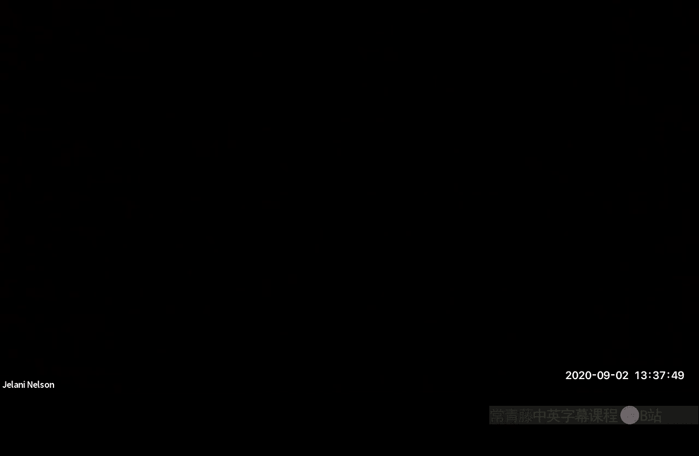
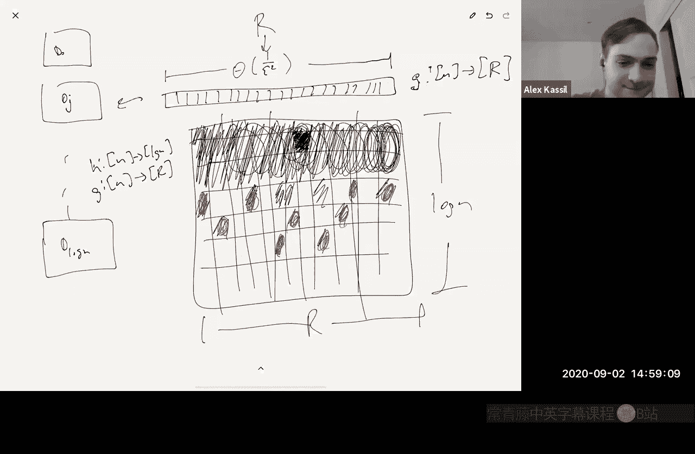

# 加州大学伯克利分校【中英⚡数据流算法｜CS294 Fall 2020, Sketching Algorithms】 p03 P3 Geometric sampling -BV11zi7BjEHu_p3-

Hi， can everybody hear me？Yep， very great I apologize I'm not sure what's going on with my video I've been rebooting to try and get it to work。

 but for some reason I'm guessing you cannot see me right my camera is not working with zoom right now it's a blank screen I box。

Okay， that's fine， but I'm here and I guess the main thing is that you'll be able to see the whiteboard and I'll try and fix this for next time。

Let's now share screen on the iPad。

Okay。嗯。I did， hopefully you guys saw the announcement from Piazza。

 I was able to expand the size of the course。So I think everyone who wanted to be in the course to enroll can。

And I've sent enrollment codes to everyone who I think wanted to be in the course， if I missed you。

 please let me know。U。I know some of you have tried to use the enrollment code and got put on the wait list instead of getting put in the course that will be fixed I don't know what's causing that but i'm talking to people in the department to make sure that you're actually enrolled。

And we do have a new。A new GSI that's Fred Jong。And his his information is on the website under staff so you can check them out there and he'll see all the staff emails as well。

Okay， so let's get started。Today。I want to introduce a technique and I'll apply it to distinct elements called geometric sampling。

And a case study， again， distinct elements。But this is a technique that gets used for a lot of problems。

We also want to talk about lower bounds。How do you prove that？

There is no streaming algorithm or there is no sketching algorithm that uses less than some amount of memory。

So。Let's start with geometric sampling。Right， so。We have a， we have a stream。Of updates。Coming。

 let's say from some universe one to N。And the main idea in geometric sampling is to pick some hash function。

Mapping that universe。Into。Say a range of size log n。Where kind of the probability that。

H of I equals J is roughly1 over two to the J。Okay， so for example， one way to do this。Is， you know。

 action pick another hash function H Tilde。That maps the universe into itself and pretend that n is a power of two。

And then what you say is that H of I is just the index of the least significant bit of H TL do I。

Right， so for example， if H Tilde of some input is in binary。This。Then you know。

 this is bit number zero， bit number one， bit number two and three。

 so the least significant bit is this one， so we would say H of I is three。对。

And the probability of that happening and this is one over two to the four because you need to have those three zeros and then that has to be a one what's the probability that happens it's one over two to the four。

So it's roughly1 over two to the J up to some factor of two。Okay。

And why am I doing this so the idea is。We have some data structure that maybe solves some simpler version of the problem。

 because I'm going to show you an example for that with distinct elements。And you know。

 maybe the simpler version in the case of distinct elements is。

We have a data structure that can solve the problem when the number of distinct elements is small。

And I guess that's obvious right， if I tell you that the number of distinct elements is at most five。

Well， you can get away with that most five words of memory where a word is login bits just remember。

knowRemember all distinct elements you've seen in the stream。If there are only five of them。

 you're only going to need to remember these five names。😡。

So the idea is like you have a data structure that can solve some special case of the problem， like。

 for example， this， where you have a bound on the nerve distinct elements。And， you know。

 what you're going to do is you're going to partition， you're going to basically create。

Let's say partition to stream。Its to log kind of substreams。And let's call these S1 up to S log n。

Actually， let me start it with as0。That's the up to S log n where kind of SJ is the stream。

Restricted to the updates。Where H of I is equal to J。可。

And you're going then you're going to feed each SJ into a separate data structure DJ so you know each level of this sampling has an associated data structure which processes just that substream。

And then at query time， you're somehow going to figure out， you know what to do， okay， you know。

 maybe your answer is going to come from just one choice of J， one choice of SJ。

 you're going to query the corresponding DJ。and somehow modify your answer to get an answer for the entire stream and you know there's some art there in how do you choose which DJ to use and you know how do you adjust the answer for DJ to get an answer for the entire stream that's you know that can be problem specific。

But you know， there are a lot of there are a lot of problems where you use this kind of general architecture so let's do let's be a little more specific now for。

 you know， how would you use such a thing for distinct elements。So more specifically。

For distinct elements。Here I have a special case of the problem。Where we're promised。

Or promised that。The number of distinct elements T。This is the number of distinct elements。嗯。And。

 you know， I've been calling it to， but let me call it。For historical reasons。

 it's also often called。F0 of the stream and I'll when we talk later about normal estimation in data streams。

 I'll explain where this term came from， why it's called F0。

But we're promised that the number of distinct elements is at most k。AndNow given that promise。

We want to compute。The number of distinct elements exactly。And kind of。Trivially， you can do this in。

K times login and bits of memory。Right， which is exactly what I said you just remember。

All the distinct elements that you see。If you see something that's not already stored in memory。

 you add it to what you're storing。And I should also mention that， you know。You know。

 if the promise is violated。嗯。You know， we can detect it in this case。Right。

IfIf you promise me that the number of distinct elements is at most k。

 but then when I process this stream， you actually give me a stream that has more than K distinct elements。

 I'll notice that right because at some point I'll see the K first element and I'll say wait。

 this doesn't match anything that I'm currently storing。

And I'll I can throw an error right so there is a data structure that solves the special case of the problem and the the memory just trivial。

Li is that most K log in bits， so we're going to use this data structure as our data structure to solve this special case。

And we're going to use it and in this case and is the size of the universe。

 So you're imagining that all stream updates you see are integers that come from one to N。

 So for example， right you're seeing a。A traffic stream network traffic you're seeing packets and I want to know how many distinct IP addresses sent traffic on this link today。

 so then N is like how many possible like how many IP addresses exist in the world and the answer is you know two to the 32。

Or maybe two to the 64 if it's IPV6。It's just the size of the universe that the items are coming from。

 that's what n means。Wait， whyhy do you need K in？You just remember the you just remember all the elements that you're say okay so yeah。

 you just remember all the elements that you're seeing in the stream right when you only login for that。

 but there are k of them。Right， so writing down the name of one element takes login bits。Oh。

 I see oh yeah， okay， but if if there are at most caing elements。

 you might need to spend k log ins to remember， okay， yeah， yeah。好。Okay， great。😊，So the algorithm。

Is going to be something as follows as there's going to be the rough idea。

We're going to have to make some adjustments it's going to have to get a little bit more complicated but。

Not too much more。So。We're going to pick。K to be。三。Constant to be determined over epsilon squared。

 remember， we want to know the answer up to a one plus epsilon factor。

So we're going to set K to me this。We're going to initialize。嗯。

D prime to be the trivial data structure。Like this one。ok。And then we're also going to initialize。

D0 up to D log n。To also be。Other copies of the trivial data structure。

And we're also going to pick a hash function。Mapping the universe into the range log in。

Let's call it。We be a little more specific。诶。Such that， you know。

 probability that H of I equals j is， you know this roughly1 over two。

 let's just say it's over two to the J。From Parawise Inent family。Right。So to be more specific。

 remember I said that， you know， H Tilde maps from end to end I mean the way I define paraise independence。

 I said。You know， that you want that the probability that。

Things mapped to somewhere is like rough is uniform right and if you look at two things at a time the problem those two things mapped to some two things in the range act as if it were a uniformly random function。

But here it's not uniformly random， it's this geometrically decreasing probability right the probability that h of y equals j is1 over two to the j。

But what I really mean here is， as I said， kind of H is just the least significant bit。

Of H Tilde and H Tilde is a uniform random mass function。

So H Tilde should be drawn from a twoI independent family right where H Tilda is this thing that I said here。

对。So H told a。It look you know looks like it's uniform if you look at two things at a time it's drawn from a two wise independent family。

 so if you look at two indices。You know， I and I prime， well。

 the problem that H of I is equal to J and H of I prime is equal to J prime is going to be as if。

They were independent， so it's going to be like one over two to the J times one over two to the J prime。

OK。And now， instead of writing pseudocode， let me just draw the picture。

You see update I in the stream。唔。What do you do with that？You have this D prime here。

So D prime is going to get that update。And then you also。Have the other， you know， D0。

 D1 up to D log n。And what you also do is。You also send this into H。

H of I H of I is going to give you kind of a random one of these data structures it's going to be biased toward D0 right half the time。

😡，I get sent to Z half half the indices get sent to D0 a quarter of the indices get sent to D1 an eighth gets sent to D2 et cetera。

 most of the time it goes to a lower D so you know it's going to send you to a random one。

 but with this geometric bias。And and that's how you process an update。

 hopefully that picture makes sense， so you send all updates to D prime。

And you also send an update to a random data structure based on the hashing。Okay。

So each update gets into two different Ds。O。So that's how you do an update， how do you do a query？

Okay， so the first thing you do is。You check D prime。Right？

If the total number of distinct elements is less than k this k is what I told you。

 we set k to be a parameter， right k is this number。

 c over epsilon squared or C we're going to determine C later。

So if the number of distinct elements is less than is at most k。Then D primeme will tell you that。

And it'll give you the right answer exactly。Otherwise， D prime will tell you you know。

 the number of distinct elements is not。Less than a equal decay。

 it's more than that right in principle it can be as big as N。

And then what you're going to do is you're going to。You're going to pick， so how do you do this。

 we don't know yet， but we're going to we're going to we'll figure this out。 We're going to pick。

An R。Such that。嗯。The number of distinct elements over 2 to the R。

Is equal to theta of one of Epsilon squared。Call this， call this our star。

And then what we're going to do is we're going to return。Two to the R star。Times。Drstar dot query。

So of course， this is bogus right now because。How do you you don't know F0 F0 is the number of distinct elements。

 right that's the thing we're trying to estimate。😡。

So if I say pick an R is such that F0 over2 to the r is something。

 I mean I don't know F0 right so how can I do that？😡。

We'll see that that can be there's a way to do that， okay？But okay， so now what's the point？

The point is， let's say that， you know。Let's try to understand what's happening here。

So what do we know we're picking we're picking。Such a thing， repeat such an R。

 such that F0 over 2 to the R star。Is less than or equal to say C2 over epsilon squared。

 and it's at least C1 over epsilon squared where C2 is going to be something that's kind of much less than C remember。

 remember what C is。C is the constant in the definition of K。Okay。😊，🤧So。Chuby S's inequality right。

 is going to tell us that。Kind of the number of people who hash there。

The number of distinct elements， so first of all， in expectation how many distinct elements map to level zero。

 half of the distinct elements map there， how many of them map to level R。

 a1 over two to the R fraction map there。系。So in expectation。

 we're getting F0 over two to the R distinct elements that participate in the Earth substream。Okay。

Now， the number that actually participate there is not going to be exactly of zero to2 to the R。

 that's only the expectation。There's going to be some deviation from the expectation because this is a random process。

What chuby chef's inequality tells you is that right what do you expect your deviation to be you expect it to be the expectation kind of plus or minus a constant factor times the standard deviation I mean by the way right I guess that's probably why I don't know the etymology of it but that's probably why the standard deviation is called the standard deviation right the standard deviation is defined to be。

The square root of the variance of a random variable and kind of it makes sense that it's called that because chub chubbyho's inequality tells you。

That kind of the probability that a random variable deviates。😡。

By more than a constant factor times its standard deviation is small right what's the probability that you deviate by more than five times your standard deviation it's at most one over five squared right that's that's what chubby sheve's inequality tells you。

😡，So the number that we expect to see there。Is going to be。

F0 over to the R star and of plus or minus the standard deviation。

 which is going to turn out to be kind of a square root of the expectation。

So that's going to be something like plus or minus o of1 over epsilon。

Which is the same thing as kind of1 plus or minus o of epsilon。Times。F0 over2 to the R star。Okay。

And so exactly， this is why we chose K the way we chose it。We wanted to make sure that。

The square root of the expectation。Was only an epsilon fraction of the expectation。

So that's why we chose it so that the expectation was what our reppslon squared。

So that the square root was one of Epsilon， which is an epsilon fraction of that。So good。

 so that means that if we can estimate。If we can find out the number of distinct elements at that level。

With good probability， we're getting a value that's within roughly one plus epsilon of。

Of F0 over2 to the R star。And then if we scale it back by2 to the R star right here。

 we're getting a one plus epsilon approximation of f zero。😡。

So this is all just kind of high level discussion or kind of game plan for why we're doing what we're doing。

But you know， maybe I'll do that chubby Cheev's inequality a little more carefully and write out the math so you can see exactly why I'm saying this that you're getting this from chubbyev's inequality and then the only other thing we have to do is to say how do we pick this R because we don't know of zero。

Right， so so that's the game plan is to to address those two things before I start on that any questions。

About the strategy。What's the deep prime doing？Yes， so I didn't write。 I should have written it down。

 but。The first thing we do during query is actually。The first thing we do。

 I'll put it right here is we first check。D prime。Okay， so。

The first thing we do is we check de prime， we ask it， is the number of distinct elements at most k？

It knows that because remember this special case， this trivial solution can answer that for us。

So we ask you， is there our distinct elements at most K， if so。

 D prime will tell us the answer exactly。😡，Otherwise， if it's bigger than K。

 then we do this other stuff。😡，So that's what D prime is for and you you know。

 so why is that necessary？😡，The reason it's necessary is， you。

 if the number of distinct elements is small， then there is no such R。😡，Right。

Like D0 is half the distinct elements D1 is a quarter of the distinct elements， et cetera。 Well。

 the number of distinct elements is at most 10 to begin with。😡。

Then there is no level that receives one of Rpson squared distinct elements because there aren't one of Rpson square distinct elements。

 there are only 10 in the entire stream。Does that make sense？

So is D prime guaranteeing that we have like the good probability bounds where it's like the exact solution on like the small number of kids。

 like when we see small number of elements？Yeah， so let me so the okay， so the real the problem is。

Like。We want。To estimate。F 0 based on some DR， where。F0 over 2 to the R。

 you know some DR star right where F0 over2 to the R star is up to a constant1 eeppson squared。

That's what we'd like to do。The problem is there might not be such an R。Right，Because if the number。

 but like if the number of distinct elements。Is T then。Yeah。At level。A level zero。Tier over two。

 land there， kind of an expectation。And you know at level one。T over four land there， et cetera。

 And at level 2。Ter or8， et cetera。But you if t is less than one of uppsilon squared to begin with。

None of these numbers is going to be theta1 ofrepson squared。And that's where Z prime comes in。

Depri is there to help us is there to answer our queries when there is no such R。Right。

 so for example。Let's say that， let's say， you know， for the sake of setting constants， you know。

 let's say that I want specifically what I want。Is F0 over 2 to the R to be at most？You know。

10 arerepson squared and at least， you know， one ofrepson squared。

 I want an R system that this holds。But if the initial。Yeah， so let's say if the initial。

 let's say F0。Was。You know。1000 over up san squared。How can I choose R。

 I just need to choose R such that two to the R is roughly 100， so you know I can choose R。

To be like seven。Right， then。1000 of reppson squared divided by 2 of the R is in this range。But。

 you know， if the initial。F0 is。嗯。1 over Epsilon。Then there is no such R。Right。

Because the original E zero is already too small， so't。

 I can't hash it to make it even to make it bigger， hashing and willing make it smaller。😡。

In this case， we'll use de prime。Okay， so does this answer the question？Yes to me。

 someone else asked a similar question， so I don't know if it answers it for them。

But it answers your question Yeah and then also one thing just like kind help build intuition can you explain kind of like what happens on a query like what's the actual like number that we get like and where does that come from after we've had more than K elements。

Yeah， so for example， let's say in this case。I said we choose r is seven， right？

So right so there is some data structure D7。Whi received all the streaming updates such that the index of the least significant bit was the seventh bit。

and that D7 data structure is the trivial data structure。

 which just remembers the first K elements it saw or K is this C over epsilon squared。😡，ok。

So what is our query return， it asks D7， how many distinct elements did you see？It gets a number。

And then it scales that number up by two to the seven。And that's what we return， gotcha， perfect。

Okay。Okay， so。So the question。How can we。How to identify。And R such that。

Of0 over2 VR is theta of 1 of Epsilon squared。And。Kin the key insight here is to notice that to be able to do this。

 you don't need to know F0 exactly， you just need to know it up to a constant factor。😡。

Right and then whatever， you know， that number you have， which is a constant factor approximation。

You just use that as your substitute for F0， and then you calculateal an R based on that。Right。

 so basically， you know， you want， you would like to set R to be something like。The logarithm。

Of Epsilon squared of zero， right， that's what you'd like to do。

That has to be an integer so let's say this， but you know you don't actually know f0。

 let's say you only know it up to a constant factor， so that estimate is f0 tilde。

 which is your constant factor estimate， so you'll set R to be this。So the question is now。

 of course。How do you get？How do you get this， how do you get a constant factor approximation to of zero？

嗯。So kind what you've seen so far is if we had a constant factor approximation to F0。

Then there's a way to refine it。Into a one plus epsilon approximation via everything you've seen so far。

 you know， you have this D prime， you have these other log end Ds。

 you have this hash function with geometric sampling。

And then you you know you just basically plug into that and get you get what you want。

 so how do you get the sub zero tilde？So。Let's say， getting。A constant factor approximation。

To you have 0。How do you do that？So we're going to basically， we're going to do the same thing。

But we don't need the D prime anymore without D prime。And with。K just being one。

So we're going to have， you know we're going to have D0， we're going to have D1。

 we're going to have D log n。And each one of these。This is， you know， some DR。

 this is each one of these just remember。The first。And are elements ever seen？So I mean。

 this is a really stupid data structure right this is if the number of distinct elements is at most one。

Then I can tell you how many distinct elements there have been。Otherwise。

 as soon as the number of distinct elements is more than one， so it's at least two。

 you know then this D doesn't know anymore， it's the same trivial data structure。

 but instead of instantiating it with K being1 or rhpsson squared or c over rhpsson squared。

 we're now instantiating it with K being one。😡，Okay。And so。Kind of so let's say that， you know。

 let's say that the number of distinct elements is actually rooted now let me give it let's give an example。

Kind of tell me what do you expect this picture to look like。

 how many distinct elements do you think D log N has seen？😡，What's a typical number that， you know。

 in a typical run of the algorithm， how many distinct elements has D log n seen if the number of actual distinct elements is root N？

Would be zero， Yeah， zero， right， because an expectation。You you see。

 you know the expected number that land there right just remember you can sit you can define these indicator random variables right like why。

😡，Y Ij is equal to one。If。Let's say H of I is equal to J and0 otherwise， so the expected number。Of。

Distinct elements。Kind of at level at level J。Is the expectation of the sum I goes from1 to n of Y Ij。

Which is the sum of the expectation。Of Y IJ。Right and's what's the expectation of YJ。

 It's just the probability that Y equals1。And of course， this is1 over two to the J。Right。

And actually， this is not equals one to n， this is basically equals。嗯。

 I should really say this is more like eigs1 to F zero。Or let's actually say it like this。

Let's call this T。No no， I'm using T ready for something else， let's call this Q。

So this is like I subq。I sububq and I sub Q。 So this is like the Qth distinct element right not all n elements are actually in not all n universe elements appear in the stream。

 only only f zero of them do。Right。So this is equal to f0 over2 to the J， right？

So the expected number of distinct elements that appear at level J is f0 over2 to the j。

 so the expected number that appear in D log n is root n F0 is root n， divided by two to log n。

 which is n so it's root n over n， which is one over root n。So the number that appear。

The number that appear。Is， you know。F02 over n in expectation。

So what's the problem that you see at least one implies the probability that you see。😡。

At least one element there。Is。At most。And over F0 by Markovs inequality。

The probability that a random variable is， you know。

Lambda times his expectation is at most one over lambmbda。So here， you know。

 his expectation is root n overed， one over root n。 So the probability that you see one element。

 well， one。Is root end times the expectation， so the problem that you see one element is at most one of a root end so it's very unlikely it's very unlikely you'll see anything there。

And the same is true as you kind of go up， as you go up， you know。

 as long as the expectation is much， much less than one。

 it's very unlikely that you'll see anything until。😡，Until what， until you get to an R such that。😡。

The expectation is not very small， the expectation is like at least a constant， let's say， you know。

 if the expectation is at least a quarter， so you're just， you know， yeah。

 so f zero over two to the r is one fourth。😡，You know then the probability that you see in element there is。

 you know all you can say is that it's at most of fourth。

 which is not which is you know a decent number you know it'ss it's not it's not too small like there's a decent chance you see something there so Geni is that the case because if F0 increases the probability of seeing more than one element？

嗯。Decreases。Yeah， so okay， so actually， so here， yeah， okay so。

I'm just looking at the problem that you see at least one element you might see too。

Does that answer your question right right， but I mean as written is it still not the case if F zeros gets larger。

 the probability you see greater than one element becomes smaller？But if F0 is larger。

 then the problem that you see greater equal to one element also becomes。Oh， I see what you mean no。

 no， yeah， so right， but so yeah， so actually I inverted it。

I think that's what you're saying this should have actually been F0 over n。Okay， right， right。

 so let's be a little more careful so。What's the expectation the expectation is。F0 over N， right。

 the expectation is F0 over N。So the number， the number one。Is n over f0 times the expectation？

So it's like lambda times the expectation where lambda does n over of zero。

And Markov says the probability of this happening is that most what over Lambda。Got。

 no that makes sense so。Yeah， so this is， I should have said F0 over n。O。in general。

 it's going to be like F0 over2 to the R。At level R。

So when as soon as you get to an r is such that F 0 and 2 to the R are comparable up to a constant factor。

😡，Then there's a decent chance you see it。Weve see an element so okay。

 so what this says is kind of so let's say that there's some actual like optimal r star so let's go back to let's let me draw more。

So let's say that this is。D sublog。Of F0， log base two of F0。Then let's say the ceiling or something。

And then you know there's some others here， theres some others here， there's some others around it。

Okay， let's do one more。So right， the probability。The the probability that。This level， this level。

 like， you know。Has any elements？嗯。Is that most one eighth， right？And the probability that， you know。

 because because it's three levels below the logarithm。

 so F0 over2 to the R here is basically an eighth。And then the probability that this thing。

 this one right here has any elements is that most of 16th。Et cetera。

 and you get this kind of geometric decay。So the probability， let's define this now red region。😡。

The probability that the red region。Has any elements at all。

Is at most an eighth plus a 16th plus a 302nd， et cetera？Which is at most a quarter？And of course。

 I could have slid this down just by one， you know。

 I I could have just looked I could have defined the red region to be just kind of one level lower。

 and then I would have gotten an eighth。Right。Okay。

 so it's very unlikely by a union bound that I see anything at all in this red region。

At the same time， if I go just a couple levels higher， so let's go like four levels higher， so one。

 two， three， four levels higher。And I expect。嗯。You know。

 there's a very small issue here because of rounding right the log。

 the log base two of F0 might not be an integer， which is why I put the ceiling there。😡。

If there had been no， there had been no ceiling and you this had been an integer。

 if I go four levels higher， I would expect to see 16 elements there。😡，Because of the rounding。

 you know， maybe all I can say is I know I expect to see。I expect to see。You know。

 at least eight elements there， maybe。They are strictly more than eight。So。

Kind of what's the probability that I see zero？😡，So that means it's unlikely。That。

I see zero elements。Right because again， the standard deviation is like the square root of eight。

 so I typically I typically see。Kind of eight plus or minus the standard deviation， which is like。

 you know， root8。So the probability that I see。Less than eight minus C root eight elements。

Thiss kind of。At most， what over C squared by chubby Cheev？Right。

 so it's unlikely that I'll see zero。系。Because I have to deviate a lot from my expectation to see zero。

So， you know， to get， so in summary。So you get a constant factor approximation。F0 tilde to F0。

Just return。To to the R。Where。R is the largest。Integer。Such that kind of DR dot query。

Is not equal to 0。Does that make sense？And what this analysis says is。

What this analysis says is it's very unlikely。That。The output is in the red region。And it's also。

 it's also very unlikely that the output is above this level。 So it's very it's。It's very unlikely。

 maybe it's a different color。It's very unlikely that the output is in this region as well。

Which means that I kind of expect the output。You know， the outputs with good probability。

 the output is going to be some are in this kind of teal region。😡。

And any out in that teal region is within a constant factor of the truth。

 this is basically the long rhythm plus or minus three or four positions。😡，Okay。

 does that make sense？And so with this being in the teal a。

 thats does that get us our like epsilon approximation， No。

 that will give us a constant factor approximation， okay。let's say that the loggar。

 let's say that F0 were actually a power of two。So we dont have to deal with this Cing on the logarithm。

😡，Then if you know the great the best case， the best case scenario is that the deepest level that has any elements at all is this level right here。

None of the levels， none of the levels below it have anything， and this level has something。

If that's the case， we're going to return2 to the R for this R and two of the log base 2 have0 is exactly the right answer。

😡，Right。Remember， we're returning to to the R， but， you know。

 we might get unlucky just kind of randomly because this is a randomized process。

 right and it might happen， it might happen that the deepest element， the deepest level that has。😡。

Any elements， it might be one loft， it might be this one。😡，Right， and if it's that one， then。

We're going to output an answer that's too big by a factor of two。RightBecause this R is one bigger。

So two to the， you know， if the true R is R star， then2 to the R star plus1 is twice as big。

Similarly， if we happen to output this one right here。

That's two levels deeper then we're going to output something that's four times bigger than what we're supposed to and sort if we go higher if we're unlucky and the log of zeroth level has nothing。

😡，Maybe only this level has something。😡，Then we're going to kind of underestimate R by one and we're going to output something that's only half as big as we should。

So we're going to be we're going to under underestimate by a factor of two， Okay， but the point is。

What we argued here is with like kind of decent constant probability。

knowIf you do the the number this actually is already in the notes that I put on on the course website。

 so if you want to see the calculations there precisely。

 you know after lecture just take a look at the calculations but。The point is。

 with really good probability， I think what I wrote in the notes。

 the analysis I gave in the notes is with really good probability。

 you're find the first time you're going to see an element at a level is going to be a level which was within a plus or minus four levels of the true level。

😡，Which means that you're only all going to be off by a factor of like 16 or something。

 two to the four。Okay。Awesome， nice， and， and that's enough to basically then do what we said here。

 right， is to pick。Is to pick this。It's basically to be able to pick an R such that this is true。

Right that's why we wanted to do this and we're going to be able to do it and that's it。对。

So you know， I don' I do want to talk about some other stuff before the end of lecture。

 so I don't want to go through kind of all the calculations detail。

 but there is one calculation that maybe is not super obvious if you haven't， you know。

 you're seeing this for the first time。😡，Which is， you know。

 this assertion I made that you're typically going to see。Kind of8 plus or minus root8。

 now why am I saying that？So。Let me just kind of write that down so you can see where this is coming from。

嗯。So I said that kind of Y IJ or let's say Y IQJ。Is equal to one。If the cu is。Distinct element。

Maps to level J。Basically， in other words， kind of H of IQ is equal to J。And zero otherwise。

 so we know that the expectation of Y IQ J is equal to1 over two to the j。

And we know if we define y it be the sum， Q goes from one of0。Of Y IQ J。

 we know that the expectation of y is equal to F0 over2 to the J。Now， what about the variance？ok。

The variance of y。Is the variance of the sum。Y， IQ， J。i。Go from1 F 0。

And this is equal to the sum of the variances。And this only holds this equality holds because we drew the has function from a pairwise independent family。

Right。Literity of expectation always holds， it doesn't require independence of the underlying random variables。

😡，Like the expectation of the sum is always the sum of the expectations。

 that is not true for variants。The variance of the sum is not always equal to the sum of the variances。

 but it is true when you have two wise's independent random variables。And you know。

 why is that just recall kind of the variance。Of y is equal to。The expectation。

Of y squared minus the expectation of y。Squared。By linearity of expectation， this。

Does not require independence。To calculate。What about this？You can expand it。

 this is the expectation。Of。The sum of Y IQ comma J。Squared。

Which is equal to the expectation of the sum over all Q and Q prime。Of Y IQ comma J。

 Y IQ prime comma J。linear of expectation。Says I can pull this inside so I can get the expectation here。

切。😊，And。Let me break this up into kind of this there's the two cases。

 there's a case where  Q equals  Q prime and where  Q is not equal to Q prime。

 So this is a sum over  Q。Of the expectation of Y I Q J squared， but you know y is a 0。

1 random variable，1 squared is 10 squared to 0。 so squaring this random variable doesn't do anything。

 so I don't have to square it plus。The sum of Q not equals to Q prime。Of the expectation。

Of Y IQ comma J， Y IQ prime comma J。Now if if。The hash function were totally random。

Right what I basically what does this random variable mean， what does the product mean。

 it means that the Qth elements and the Q primeth elements both got hash to level J。

 both of them got hash to level J。😡，Okay。So what normally what would the probability of that be if this hash function were totally random。

 it would be1 over two to the J times one over two to the j。

 it'd be the square of one over two to the J right normally this would be the expectation of the product would be the product of the expectations。

😡，This would be the expectation。Of Y IQ comma J times the expectation。Of Y IQ prime comm J。

Profeor is the in the sum beforehand， are those values squared。

Do you mean when you say the sum beforehand， do you mean？The sun sun or the the sun below that。

 but not the one where you're comparing Q& Q prime you mean do I have a square do you have a squared here right yeah right？

Yeah， so that was what I say， I mean， yeah， so you can put a square there if you want to。

 but it doesn't matter because， oh， that's their indicators yeah， there's zero1 random variables。

So it's the same， it's this， yeah no problem， it's the same even if you don't put the squares。

So the point is like I would like to do what I did right here。

 I would like to say that the expectation of the product is the product of the expectations。

That's only true if these two random variables are independent of each other。

RightBut that's exactly what pairwise independence says， two wise independence。

 it says if you look at two random variables at a time。Those two look like they're independent。Okay。

 so that allows me to change the expectation of the product into the product of the expectations。

 which is why what I said above is true， namely this thing right here。

The variance of the sum is the sum of the variances whenever you have pairwise independent random variables。

唔。对。So anyway， that's why we were able to get away with a two wise independent hash function。嗯。

Now that you have a two wise independent hash function， of course， what is this？What is the variance？

Of Y IQ J。 Well， this， again， this is a 0，1 random variable。 It's a Bnoulli random variable， right。

 Me there's some probability。 It's one。 There's some probability P， it's one。

There's some probability1 minus p that it's zero。😡，What's the problem in general。

 whenever you have a Bnoli random variable？😡，The variance is p times1 minus P right。

 It's the expectation of the square minus right，'s it's exactly this。 It's the expectation。

Of that random variable squared minus the expectation of that random variable squared。So this is。

 again， a 01 random variable squaring it doesn't do anything， so you can ignore this square。

So this is p minus p squared， which is equal to p times 1 minus p， which is always at most p。Right。

Which means that this thing is at most p times of0 and what's p p is1 over2 to the j。

 so this is of0 over 2 to the J。So just as I said， the。The variance。Is at most， in fact。

 less than the expectation。切。ai， what's J when we're considering the the full why。

J is the level that you're hashing to。If you want if you want， I can call this thing Yj。

Yj is just how many distinct， you know why here is how many distinct elements hash to level J。Okay。

And in expectation it's f0 over2 to the J， the variance is also at most of0 over two to the J。

And then now we can do chubby Cheve。What's the probability？That。

Let's say the number of distinct elements。At level J。Minus f0 over 2 to the J。

What's the problem that I deviate by more than c times the square root？😡，Of F0 over2 to a j。

By chubbihev。This is at most the variance。Of the number at level J。嗯。Divided by。C squared times F0。

Over2 to the J。Basically the square of the right hand side。 But we just said that the variance。

Is at most of zero over two to the J。So this is at most1 over c squared。

So that's what I'm saying kind of typically， typically what you see。Typically。Andd of level J。

We'll have。F0 over2 to the J plus or minus is kind of o of square root of f0 over 2 to the J elements。

So that's why I said if you expect eight elements。You typically expect a deviation of on the order of square root of eight。

So you know， if you， that means that if you have zero， if you expect eight and you see zero elements。

😡，You deviated by。Square root8 times square root8。From your expectation。

And the probability of that happening is at most one over square root8 squared。

 So C is basically square root8。 So it's most the probability of that happening is at most in eighth。

So it's unlikely。That you see zero elements when you expected eight。

It's even more unlikely that you see zero elements when you expected 16。

That would happen with probably at most one over 16 by the same argument。So does that all make sense？

Any questions？Can I ask something back about like in the original algorithm with like using our。

The original， yeah， so so， so first of all， kind of just so we're all on the same page。

 we're basically running two algorithms in parallel。

One of the algorithms is there to get you a constant factor approximation， Okay。

 and that algorithm is basically。😡，This picture。That algorithm is。You maintain。

You maintain these log n different data structures each with K being one。😡，And in parallel。

In parallel， you also maintain kind of this data structure。Which looks awfully the same。

 iss just that it has a higher K。Right instead of k being1， k is c over Epsilon squared。

 and you also have this D prime on the side， which is just kind of to handle the special case。

 the corner case， where the number of distinct elements is small to begin with。Okay。

So now the overall algorithm， what is the overall algorithm doing？😡。

Whenever you see eye in the stream。😡，You send it。To the other data structure that gets you the constant factor approximation。

 you feed it there。You also feed it here in this red box。😡，Which itself feeds it to two places。

 it feeds it to D prime， and it feeds it to D of H。And then when you want to answer a query。

 what do you do， the first thing you do to answer a query is you check D prime。😡。

That's going to give you the right answer if the number of distinct elements is small。 Otherwise。

 if the number of distinct elements is not small。Okay。

 then you've got a constant factor approximation from the other data structure that you're running in parallel。

That's going to tell you kind of the the right R use up to an additive3 or4。

Then it's call that R star， then you're going to look back at this box。

 you're going to query DR star in this box。And then you're going to return that answer at times two to the R star。

So that's the overall algorithm。Does that answer your question， Noah。Yeah。

 I think I also see how it works， but I was curious why like why don't we just pick the lowest R where the DR reports u like less than K elements。

😊，And then use like two to the R times the query for that DR because it seems like it would be more reliable for the lower DRs when they have more elements Yes。

 you're saying why do we go to the one that where we expect one of reppsilon squared elements Why don't we go to the one where we where we see like five elements or you know just some nonzero number of elements right is that is that a question Yeah like there's a bunch of elements you know D0 has like has the half the distinct elements if that's way more than K then it'll expect to take a while to get to one that。

Has less than k， but then around we just take the first one。

 it feels like that should be the most reliable。So yeah， the answer basically goes back to this。Okay。

 so remember now kind of。At level R。We will typically see。Kind of F0 over 2 to the R。

 let's say plus or minus。You know， some constant。Times square root of f0 over to the R distinct elements。

which I will call， what do I want to call this？I'll call this if I want to write this multiplicatively as multiplicative error instead of additive error。

😡，This is like1 plus or minus o of square root 2 to the R over f0。This is an R。

Times F 0 over2 to the R。So then when we scale this back up。Let we scale this back up by 2 to the R。

What we're going to get is our final answer is going to be kind of one plus or minus o。

Of square root to the R over f0。Times of zero。 So right this right here is like our multiplative error in in particular。

 this。😡，You know this， we're getting basically our， you know， our this is alpha and we're getting。

Kind of a one plus or minus alpha approximation， right？

wouldnn't it be better to use the lower Rcause then alpha would be lower。

 They just to use the lowest R possible。 Oh， the lowest R， not the bit not， you mean。

 not the biggest R。Is that what you're saying？Yeah， the lowest though。Well， well， I mean， okay。

 so yeah， so， I mean， the the lowest I aware DR doesn't point having， you know。

 too many more than decay K elements that gave up。 Oh， I see what you mean。 Yeah， yeah。

 so that that makes sense， yes。You have to be a little bit careful in your analysis though， because。

嗯。You know， like you're choosing。有 you know。How should I put it， This is a randomized algorithm。

 What's the source of the randomness， the source of the randomness is H， right？Does it make sense？

So if you choose the level。You know， if so if you say like， let me okay， the level I'm going to use。

😡，Is。The highest level。Basically， the smallest R， so the highest level that doesn't say that I have more than K elements。

😡，So the fact that I'm picking that level。Is basically now using it's like using up some of the randomness of H right the level I choose is correlated with the randomness of H。

😡，So now conditioned on that level， if I want to understand something about the error I'm getting。😡。

I can't just apply chubby chefev's inequality because H is not totally random anymore because I've conditioned on some event happening and that event depends on H。

😡，Right。Interesting， yeah， okay， does that make sense？Yeah。

 I so you have to be a little harder to analyze so yeah so I'm I'm being a little bit more careful about how I design my algorithm just so that the analysis is not doing any funky。

😊，Stuff， right， I can't。And that's why， for example， I'm using two different data structures。😡。

One that gets the constant factor approximation and one that gets refines its one subpsilon。

 you could say why don't I just use the same data structure for both， you know。

 look at look at that first data structure that has a large K。😡。

Look at the largest R that reports a non zero number distinct elements。

 use that as my constant factor approximation and then choose the level to estimate based on that。

 but the problem again is。😡，OnceOnce I tell you which level has which is the deepest level that has a non zero number of elements。

 that reveals something about H。And H， once I do that， H is conditioned on that event。

 H is not like random anymore， or it's not like uniformly random anymore。😡，Yeah， okay。

 that kind of makes sense。对二。But yeah， but so yeah， so okay， so hopefully that answers your question。

 but going back to the question I thought you were asking I guess this is why I chose。

R such that F0 over two to the R is roughly when a rhpsilon squared because I want。

 I want this quantity， right， I want。😡，Square root of 2 to the r over f0， this is an r on an n sorry。

 my R is keeping like Ns。嗯。I want this to be roughly epsilon。

 which implies I should choose R such that F0 with R is roughly one Epsilon squared。对。

So in the remaining time， so that's it for the algorithm。

 maybe I want to say maybe just a couple remarks and then in the last bit I want to say some you know something about lower bounds。

So the space here。You know， H is from a two wise family。

 so it only takes login bits to store that's kind of small compared to everything else。

There are log n levels。Times kind of K log n。Bits per level。For each DJ。So this implies， you know。

Oh of kind of one over Epsilon squared log squared and bits of space。

There are improvements that you can make on this basic idea。And this is， you know。

 the ideas for this improvement are Bar Joseph。Jaram。裤ummar是个裤mar。And Trevisson and O2。

 the same people who。Introduce the Kv algorithm also showed that you can get something good out of this algorithm。

 So the first idea is。This trivial data structure that remembers the first K elements it Cs。😡。

You know， it's using K log n bits。You can actually get away with K log K bits。

 so trivial data structure。You can do K log Kbits。Instead of。Klog n bits。And why is that。

 the point is if you're only keeping track of K elements。You can perfectly hash them。Into a range。

Of size kind of O of， let's say K squared right again， this is this perfect hashing idea。

If I have K elements。And I has into a range of size，100 k squared。

 It's very unlikely that there are any hash collisions。Okay， which means that。You know。

 I don't nowhere in this algorithm do I actually care which elements I saw？Yeah。

 I only care to count how many distinct elements I saw。So as long， you know。

 I don't need to really remember their names。 I can。

 It's enough to remember random names as long as those random names they're different。

And if I give them random names in the range1 to K squared， then by perfect hashing。

 it's unlikely that there will be any hash collisions。So I can save， I can basically， you know。

 with decent probabilities， save on my memory for the trivial data structure。

Is it perfect or like a very， very low probability。I know， they shoot for perfect fashioning。So。

 but it's it's not gonna6， you know， it's not gonna be a perfect has always。

 It's gonna to be a perfect cache with high probability。 I mean。

 our data structure overall is allowed to fail with some small probability anyway， right， So。

 you know， if any of my perfect cachings fail， I'll just give up and I'll say， you know what。

 you know， I， I failed。嗯。But you know， and and actually I should say I should be a little more careful what they actually do is。

 you know， if you want to， if you can look at their paper for more details， but。嗯。

Because there are log n levels of this， therere kind of k log n elements in total that you know you want to say maybe all of them are perfectly hashed。

 so you' map you'll map into a range of size K squared log squared n。

 which means that your memory will end up being something like K times log K plus log log n。😡。

So you'll have to do a range of K squared log squared n。OkayAnd the second thing that they do。Is。

Rather than keep track of all these D's， you know， this is D0 d1。Et cetera。

 they're log in of them rather than keep track of all of them。They kind of change their。

They kind of change their definition of H so that this gets day zero get all elements。With。

The least significant bit。Of H of I being at least zero as opposed to equals zero。

 and this will get all elements。With the least significant bit。Of H of I。

Being at least one instead of equal to1， et cetera。

 which means the set of elements that go into D1 is a subset of D0。

 the subset of elements that go into D2 is a subset of D1。And then what they do is they say。

 now we don't need to keep track of all these levels at the same time， let's only keep track of D0。😡。

And then once D0 gets too full。We'll kick out all the elements that have a least significant bit of zero。

😡，And then we'll just rename the data structure D1。😡，And once D1 gets too full。

 we'll kick out all the elements there that have a least significant bit of one。

And then we'll just call what's left over D2。Which means we only need to keep track of one of these boxes at a time。

 not all log n of them。O。And for the parallel data structure that gives a constant factor approximation。

All we need to do is keep track because since K is1。All we need to keep track of kind is like。

What's the。What's the largest least significant bit？😡，Of any house evaluation we've ever seen。

That will tell us what the deepest level is that got hit right so we don't even need to remember the name of any elements at all。

😡，We just need to keep track of that index of what's the deepestly significant bit？And in fact。

 kind of that's how that's what's kind as Professor Holistene mentioned to me in kind of a recent meeting。

 that's what's usually described as the flagly Martin algorithm， by the way。

 just keeping track of the largest succinc element you've ever seen to get a constant factor approximation。

So kind of overall。What we said is you can basically kind of get rid of this login for the number of levels。

And you can also replace this log n by log K plus log log n。

You also need login bits to store the hash function。😡，So the total。

 the final space after you make these optimizations is going to be something like。

1 over Epsilon squared times log1 over Epsilon plus log log n。

Plus another additive login just to store the hash function。😡，And this is actually almost optimal。😡。

This part is some optimal。😡，And as I mentioned， you know。

 there's been work like I had a paper with Daniel Kane and David Woodruff in 2010 that showed that there's another data structure that。

Doesn't have this extra log winner up samples log log n factor。😡，系对。So that's it。

Questions about any of this， This is just for a constant failure probability right， Yes。

 and then if you wanted fill probability Delta， you can do the usual trick of running log whatever delta of these in parallel。

And outputting the median result。That would give you the whole thing here times log n times sorry。

 times log whenever delta。But the true optimal bound。嗯。

Is O of1 over epsilon squared log1 over delta plus log n。And this bound is due to Yaswab washock。

Not too long ago， 2018。And it was in soda 2018。So here you know it's interesting the log winnerner Dlta doesn't have to multiply the log n。

 so he's doing something a little bit more clever than simply you know getting constant failure probability and then repeating it logwin Dta times because if he did that。

 then the log winner Delta would multiply the log n as well， which it doesn't have to。😡。

Any other questions？Go ahead， go ahead。OrI was wondering about like kind like oh sorry。

 maybe I' nurse else three of us I'， I'll talk to you once go first。😊，Okay。

 I was just going to ask where the big C came from earlier。

Oh where's the big where does the big C come from in K so if you want to see the details of how to choose big C appropriately that's in the you know that in all the detail it's it's written in the lecture notes right now you can already find it on the website。

 but basically the idea is。😡，You know like。We only can know based on that parallel data structure。

 we'll only know F0 up to a factor of like 16， right？So we might overshoot and， you know。

 we might choose a level such that the expected number that maps there is 16 over epsilon squared。😡。

Right， and then because of chubby chefev's inequality。There's some kind of。

 it's kind of standard to have a deviation of roughly4 over epsilon。

 which is square root of 16 over epsilon squared， right， In fact。

 it's kind of standard to have a deviation of。Let's say four times the standard deviation。

It's kind of common to have a deviation of 16 over Epsla。Right。

 which means that and at the end of the day， what you'd like to do is set K to be something like maybe。

You know， let's say 32 over ups s squared。Because it's， you know， it's。

 it's very unlikely that even at the level that you that you。😡，Basedase your estimate on it's very。

 it's very unlikely that。The actual number of distinct elements there is bigger than 32 of uppsson squared。

😡，Does that make sense？Yeah。O。Any other questions？Well。

 I was wondering about like kind of implementation about like this like similar algorithms like I was like looking through the lecture notes and I noticed like you said like commonly like use hyper log log and practice something like。

😊，Like we like anything interesting like yeah， I try to implement these Yeah， so you know。

 the stuff that first of all， the things that do best in practice， you know here we like we're very。

Kind of rigorous about our hash functions even we said。

 look we't want to assume we have a perfectly random hash function and that that made our lives a little bit more complicated。

 but you know like things like hyperlo log they just。

 you know they just say you know what we're just gonna assume that our hash function is totally random even though it's not true。

And we're going to analyze it with that assumption and that's what people use and the basic idea does it does use a geometric sampling kind of idea。

The basic idea of it is。嗯。You know， so there again， you can think of it as there are these。

A lot of the even my data structure with Daniel Kane and David Woodrff also uses a geometric sampling idea。

 you have this D0 D1 up to D log n。Now for my data structure with Daniel Kane and David Woodruff。

 as well as for hyperperlo log。Each one of these D's is simply a bit vector。😡，Of length。

 theta went rhpson squared。Let's call this number R。You're going to have a separate hash function。

So let's say this is DJ， you're going to be hash function GJ， or actually， it doesn't need be GJ。

 it can just be G。嗯。Gi。Which maps the universe。Into a range of size R。

And when you see an item so now kind of what's the picture so you just have this like these many different bit vectors so if I just draw as a matrix。

😡，Actually there are a lot of columns， right？The number of columns here is R。

 which is theta1 of rhson squared， the number of rows log n。You have a has function H。

Which maps n into log n， that's the geometric sampling， and you have another hash function G。

 which maps n into R。So when you see an item in the stream you first hash that item to a random row and it's biased toward the higher rows。

 that's how geo geometric sampling works so it's likely to be maybe the first or second row and then you send it to a uniformly random column and then you send that and then you set that bit to one。

 so let's say it maps here。😡，So I'll just mark it as like I'll mark that box。

 but basically that that bit in the bit vector got set to one。So， and then， you know。

 when it's time to query kind of what do you expect the picture to look like？😡。

You expect the picture to look like kind of some prefix of the rows are probably all black。

Because if the number of distinct elements is large。Then let's say it's like， much。

 much bigger than when ups on squared。Then you probably have many more than our items in the top few rows。

 but then it's going to start to thin out then maybe at some point only a constant fraction。

 maybe only like two thirds of the row。😡，Got hit。And then from then on。

 it starts like thinning out geometrically。Until eventually you have nothing。唔该。

And kind of all these algorithms， so kind of my algorithm with with with by the way。

 notice that this would take one Robs on squared login bits to store。😡。

Then you do some more optimizations to really get it down to something much less。嗯。

Theyre they're kind of simple optimization so one of them is you know you can keep track so like actually if you want to get the optimal space。

Here are the optimizations you do。You don't don't actually chop off rows one of them like as soon as they fill up。

So we don't chop off rows what we do is the following for each column we only we don't keep track of the whole column。

 we only keep track of the index of the deepest row that got hit in that column so like for example。

😡，We would only remember this got hit， this got hit， this got hit， this got hit， this got hit。

This got hit， this got hit this， this just the deepest row in each column。

That's a number between one and log n。That's only log log n bits instead of log inbits。Okay。So。😊。

Now you get a space of like what if on square times log log n if you ignore the hash functions。

 and that's exactly the space that hyperlog log gets。

And then they have some funky estimator based on the harmonic mean that is what that's what people use in practice。

That's it and then for simple， yeah， it's pretty simple and that our data structure says kind of most of these column。

 you know， most of these things that you're storing。

Are pretty close to kind of like some median number。So you can just store， let's say store the mode。

 but we don't it's not exactly the mode， but let's say the mode。

 store the mode of these red numbers as one number。😡，And then for each of these red numbers。

 what you don't store is the actual number， but you just store the offset from the mode。😡。

And the point is， and you store it in like a variable length encoding。😡。

So the point is most of these offsets are zero or close to zero。

 so they only need a constant number of bits to store， some of them might be bigger offsets。

 but you know that's rare。And then you can get that lets you get down to I wonder if some square post log yet。

Nice， thanks for explain。 Great no problem。Um Iis， I think we're not going to have time for the lower bound I'll do that next week Wednesday。

 Monday is Labor Day， so we're not going to have class on Monday。

But once they we werere going to do lower bounds and then we're going to start talking about。

 you know other interesting things， distinct elements， of course。

 is not this is not a class on distinct elements， I so。

So any final questions before your long weekend and having fun？

TheLcure notes for this are already a professor。The lecture notes， yes。

 the lecture notes for geometric sampling are already written with all the calculations there。Okay。

 and it also describe redesscribes the algorithm as well yep， yep， it's there。thank you。Okay。

 and I see that there's， let me just look through here。I'll take a look at the chat。Okay。

 so that was already asked， Stephen asked， oh Steven suggested。やちた。😔，Okay。

 so it looks like all the questions Scott。Taking care of if not if not， you know。

 just ask me on piazza I'm happy to answer okay， see you all next week。Thank you bye。

Thanks you。