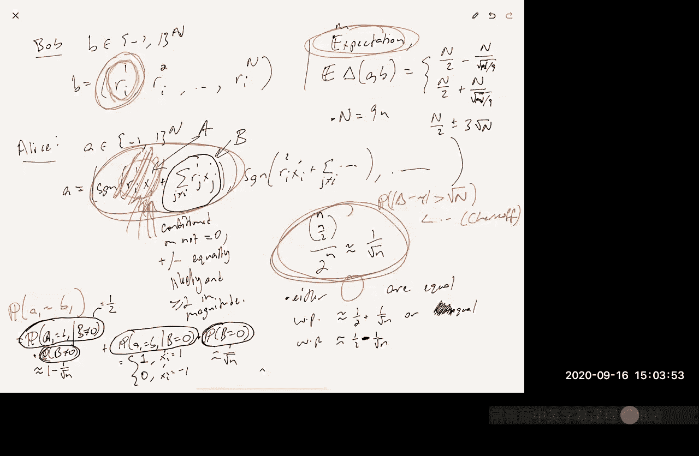

# 数据流算法：P6：通过通信复杂度证明下界

在本节课中，我们将结束关于下界的讨论，并开始介绍流式处理和素描算法中的“翻转式”模型。我们将重点讨论该模型下的素描技术。

## 概述

上一节我们介绍了通过压缩论证来证明下界的方法。本节中，我们将探讨另一种方法：**通信复杂度**。我们将看到如何利用通信复杂度中的困难问题，来证明流式算法所需内存的下界。

## 通信复杂度简介

通信复杂度是一个计算模型。在这个模型中，通常有两个参与方，称为Alice和Bob。Alice有一个输入`X`，Bob有一个输入`Y`。他们的目标是计算某个关于`X`和`Y`的函数`F(X, Y)`。

模型的核心是：Alice和Bob可以通过互相发送消息来进行交流。最后收到消息的一方输出答案。目标是在保证正确计算函数`F`的前提下，**最小化通信过程中传输的总比特数**。

通信复杂度有几个重要的变体模型：
*   **确定性通信复杂度**：协议是确定性的。
*   **随机性通信复杂度**：
    *   **公开随机性**：Alice和Bob共享一个公开的随机字符串。
    *   **私有随机性**：Alice和Bob各自私下抛硬币生成随机性。
*   **分布通信复杂度**：输入`X`和`Y`是从某个分布中随机抽取的，协议可以是确定性的，目标是高概率成功。

## 通信复杂度与流式下界的联系

通信复杂度与流式算法下界的基本联系思想是构造一个**归约**。

**核心思想**：如果计算某个函数`F`在通信模型中很困难（需要大量通信），并且我们可以利用一个解决流式问题`P`的算法`A`，以黑盒方式构造一个解决`F`的通信协议，那么`P`也必定是困难的（需要大量内存）。

具体来说，归约通常这样操作：
1.  Alice将她的输入视为流的一部分，在本地运行流式算法`A`。
2.  Alice将算法`A`的**内存状态**作为消息发送给Bob。
3.  Bob接收到内存状态后，将其作为初始状态，继续运行算法`A`处理他自己的输入部分。
4.  Bob最终查询算法`A`，得到答案，从而推断出`F(X, Y)`的结果。

在这个协议中，传输的比特数就等于算法`A`的内存使用量。因此，如果`F`需要`Ω(S)`的通信量，那么算法`A`就至少需要`Ω(S)`的内存。

## 示例：利用相等函数证明精确判重下界

让我们看一个具体例子：利用**相等函数**的下界来证明精确计算**不同元素数量**需要大量内存。

**相等函数** `EQ(X, Y)`：当`X = Y`时输出1，否则输出0。已知结论：确定性通信复杂度 `CC(EQ) ≥ n`，其中`n`是输入字符串的长度。

**定理**：任何确定性的、能精确计算不同元素数量的流式算法`A`，至少需要使用`n`比特内存（假设全集大小为`n`）。

**证明**（通过归约）：
1.  Alice有一个集合`X`（表示为n位指示向量），Bob有一个集合`Y`。
2.  Alice在本地运行算法`A`，处理`X`中的所有元素。
3.  Alice将算法`A`的**内存状态**发送给Bob。这消耗了`Space(A)`比特。
4.  Bob首先检查`|X|`是否等于`|Y|`（Alice可以随内存一起发送`|X|`，这只需`log n`比特，不影响主导项）。如果不相等，则`X ≠ Y`，输出`False`。
5.  如果大小相等，Bob将接收到的内存状态作为初始状态，继续运行算法`A`，处理`Y`中的所有元素。
6.  Bob查询算法`A`，得到当前不同元素数量`T`。
    *   如果`X = Y`，则流中元素全部来自`X`，`T = |X| = |Y|`。
    *   如果`X ≠ Y`但`|X| = |Y|`，则`Y`中必然存在至少一个不在`X`中的元素，因此`T > |Y|`。
7.  通过比较`T`和`|Y|`，Bob可以判断`X`和`Y`是否相等。

这样，我们就用算法`A`构造了一个解决`EQ`问题的通信协议，其通信成本为`Space(A)`。由于`CC(EQ) ≥ n`，因此`Space(A) ≥ n`。

## 随机算法的下界与私有随机性

上面的例子针对确定性算法。我们实际使用的流式算法（如不同元素估计）通常是随机化的。能否为随机近似算法证明下界呢？答案是肯定的，这需要用到**私有随机性**模型下的通信复杂度。

对于相等函数`EQ`：
*   在**公开随机性**、单向通信模型中，只需要`O(1)`比特即可高概率判断相等性（例如，通过随机向量点积）。
*   但在**私有随机性**、单向通信模型中，其通信复杂度是`Ω(log n)`。这是一个指数级的差距。

**关键点**：在流式算法中，算法使用的随机哈希函数等，其描述是需要存储在内存中的，这类似于私有随机性模型——随机比特不是“免费公开”的，需要成本。因此，为私有随机性模型证明的通信下界，可以对应到随机流式算法的内存下界。

## 一个关键难题：集合不相交性

一个在通信复杂度中众所周知的难题是**集合不相交性**问题。
*   Alice和Bob分别有集合`S`和`T`（均为`{1,...,n}`的子集）。
*   函数`DISJ(S, T) = 1` 当且仅当 `S ∩ T = ∅`。
*   **定理**：即使允许使用公开随机性和多轮交互，`DISJ`的随机通信复杂度也是`Ω(n)`。

我们可以利用这个结论证明另一个流式问题的下界。

**定理**：在数据流中，以至少2/3的概率，输出`L∞`范数（即最大频率）的1.1倍近似值，需要`Ω(n)`比特内存。

**证明**（归约）：
1.  Alice有集合`S`，Bob有集合`T`。
2.  Alice运行`L∞`近似算法`A`，处理`S`中元素，然后将内存状态发送给Bob。
3.  Bob继续运行算法`A`，处理`T`中元素，然后查询得到估计值`Z`。
4.  情况分析：
    *   如果`S`和`T`不相交，则流中任何元素最多出现1次，`L∞`范数 ≤ 1。
    *   如果`S`和`T`相交，设`a ∈ S ∩ T`，则`a`出现了2次，`L∞`范数 = 2。
5.  由于算法`A`提供1.1倍近似，它可以可靠地区分`≤ 1.1`和`≥ 2/1.1 ≈ 1.818`，从而判断`S`和`T`是否相交。

因此，算法`A`的内存大小必须至少是`DISJ`问题的通信下界，即`Ω(n)`。

## 扩展到多玩家与`Lp`范数下界

通过考虑`t`个玩家的不相交性问题变体（`t`-玩家唯一相交性问题），我们可以得到依赖于近似比`α`的下界。

**结论**：在数据流中，以常数概率计算`L∞`范数的`α`倍近似，需要`Ω(n / α^2)`比特内存。这意味着对于常数近似比（如`α=1.1`），内存需求是线性的`Ω(n)`，没有非平凡的解。

进一步，我们可以将这个结论推广到`Lp`范数（`p > 2`）的估计上。

**定理**：对于`p > 2`，在数据流中以常数概率计算`Lp`范数的`(1+ε)`倍近似，需要`Ω(n^{1 - 2/p})`比特内存。

**证明思路**：通过将`t`-玩家不相交性问题归约到`Lp`范数估计。选择合适的玩家数`t ≈ n^{1/p}`，使得在不相交情况下`Lp^p ≤ n`，而在唯一相交情况下`Lp^p ≥ t^p ≈ n`，从而产生常数因子差距。再利用`t`-玩家问题的通信下界`Ω(n/t^2)`，即可得到内存下界`Ω(n^{1 - 2/p})`。这个下界是紧的，存在匹配的算法。

## 证明一个通信下界：索引问题与汉明距离间隙问题

最后，我们简要介绍如何直接证明一个通信下界，并将其链接到不同元素估计问题。我们遵循以下归约链：
**索引问题** → **间隙汉明距离问题** → **不同元素`(1+ε)`近似问题**

**索引问题**：
*   Alice有一个`n`比特字符串`x`。
*   Bob有一个索引`i ∈ [n]`。
*   目标：Bob想知道`x_i`的值。只允许Alice向Bob发送一次消息。
*   **定理**：在公开随机性、单向通信模型中，以失败概率`δ < 1/2`求解索引问题，需要至少`(1 - H_2(δ)) * n`比特通信，即`Ω(n)`。

**间隙汉明距离问题**：
*   Alice和Bob各有`n`比特字符串`a`和`b`。
*   承诺两种情况之一：
    1.  `a`和`b`的汉明距离 `≥ n/2 + √n`
    2.  `a`和`b`的汉明距离 `≤ n/2 - √n`
*   目标：区分属于哪种情况。
*   **定理**：该问题的随机通信复杂度也是`Ω(n)`。

**归约：索引 → 间隙汉明距离**
1.  设要解决索引问题实例：Alice有`x∈{0,1}^n`，Bob有索引`i`。
2.  利用公开随机性，生成`N`个随机`±1`向量`R1, ..., RN`（`N`足够大）。
3.  Alice将`x`转换为`x'`（`0→+1`, `1→-1`），并计算字符串`A`，其中`A_j = sign(〈x', Rj〉)`。
4.  Bob计算字符串`B`，其中`B_j = (Rj)_i`（即第`i`个分量）。
5.  可以分析，`A`和`B`的汉明距离的期望值取决于`x_i`是0还是1：
    *   若`x_i = 0`，期望汉明距离 ≈ `N/2 + c√N`
    *   若`x_i = 1`，期望汉明距离 ≈ `N/2 - c√N`
    （其中`c`为某个常数）
6.  通过设置`N = Θ(n)`，这个期望差距约为`√N = Θ(√n)`。利用集中不等式，可以保证以高概率，汉明距离落在`n/2 ± Θ(√n)`的不同区间。
7.  因此，任何能解决间隙汉明距离问题（间隙为`Θ(√n)`）的协议，都可以用来解决索引问题。由于索引问题需要`Ω(n)`通信，间隙汉明距离问题也需要`Ω(n)`通信。

**归约：间隙汉明距离 → 不同元素`(1+ε)`近似**
1.  设要解决间隙汉明距离实例，字符串长度为`m = 1/ε^2`。
2.  Alice和Bob将各自的`m`比特字符串`a`和`b`视为集合的指示向量。
3.  Alice运行不同元素`(1+ε)`近似算法`A`，处理她集合中的元素，并将内存状态以及她集合的大小发送给Bob。
4.  Bob继续运行算法`A`，处理他集合中的元素，然后查询得到不同元素数量的估计值。
5.  可以证明，`(1+ε)`近似不同元素数量，允许我们以`±εm`的误差估计`a`和`b`对应集合的对称差大小，进而推断其汉明距离（因为`Ham(a,b) = |sym_diff(S_a, S_b)|`）。
6.  由于间隙汉明距离问题的间隙是`√m = 1/ε`，而`εm = 1/ε`，因此该估计足以区分两种承诺情况。
7.  通信成本主要是算法`A`的内存`M`，加上`O(log(1/ε))`比特。由于间隙汉明距离问题需要`Ω(m) = Ω(1/ε^2)`通信，因此`M`必须为`Ω(1/ε^2)`。

这就得到了一个重要的下界：**任何在数据流中提供`(1+ε)`近似的不同元素估计算法，至少需要`Ω(1/ε^2)`比特内存**。这个下界是紧的，存在算法（如`HyperLogLog`的变种）使用`O(1/ε^2 + log n)`比特内存。

## 总结

本节课我们一起学习了如何利用通信复杂度来证明数据流算法的下界。
1.  我们介绍了通信复杂度的基本模型及其变体（确定性、随机性公开/私有硬币）。
2.  我们理解了通信复杂度与流式下界之间的核心归约思想：将流式算法用作通信协议的黑盒子。
3.  我们通过**相等函数**和**集合不相交性**的例子，展示了如何为精确算法和近似算法证明内存下界。
4.  我们探讨了将多玩家不相交性问题下界应用于`L∞`和`Lp`范数估计，得到了依赖于近似比`α`和范数指数`p`的下界。
5.  最后，我们概述了通过**索引问题**→**间隙汉明距离问题**→**不同元素估计问题**的归约链，证明了不同元素`(1+ε)`近似需要`Ω(1/ε^2)`比特内存的关键下界。

这些下界结果告诉我们，对于许多重要的流式统计问题，我们所看到的高效素描算法在内存使用上本质上是最优的。