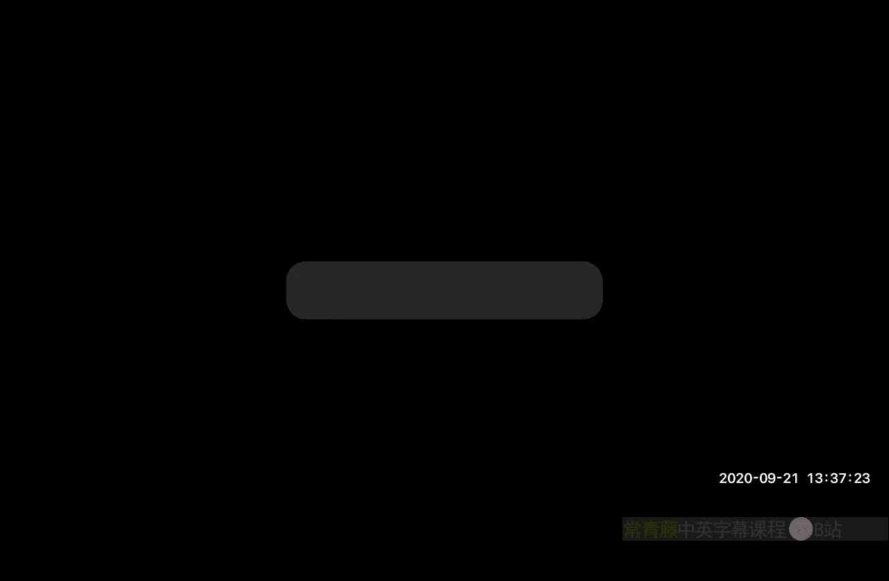
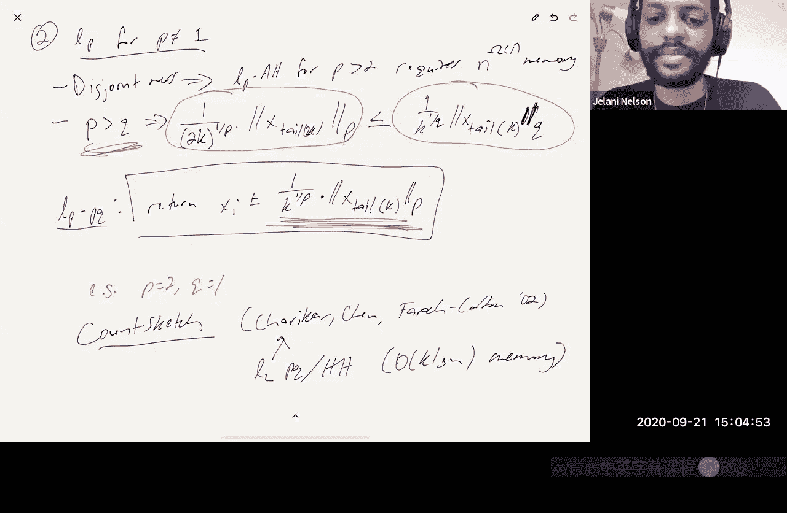

# 加州大学伯克利分校【中英⚡数据流算法｜CS294 Fall 2020, Sketching Algorithms】 p07 P7 Linear sketching, turnstile streaming, heavy hitters -BV11zi7BjEHu_p7-

Allright。So today we're going to talk about a general technique for designing streamy algorithms。

 it's called a linear discussion。Okay and this is something that is useful for designing streaming algorithms for designing sketching algorithms that operate in data streams as well as other sketching applications like distributed applications where you know each say machine wants to sketch its data and then send something over the wire。

To some central server that's going to like， you know Comp on on the aggregate of all the sketches。

 We'll see some of that later when we talked about graph sketching。

But what's the idea behind linear sketching？So。The idea is you represent data。

And is a high dimensional vector。X。And is very laish。Right and I'll give examples。

 but I'll show that some of the stuff we've been talking about already can fit in this model。呃。And。嗯。

嗯。You'll pick some matrix。Hi。Which is an M by N matrix。Where M is much less than n。

 So pi looks like a short wide matrix。And you'll store in memory is piax。

So x is this very huge object。You don't want to spend n memory during X。

 so it that you store pi X and that's only a size M object then if M is very small。

 then you've saved a lot。You have to worry that， you know， well Pi， you yes， why is small。

 the pi is not small， Pi has more than N numbers， it has MN numbers。So if I have to store pie。

 isn't my algorithm？Doing very poorly in terms of memory， but as we'll see， you know。

And a lot of linear sketching， you try to design a pi such that even though pi is a big matrix it can be represented very succinctly。

 so for example， pi might be deterministic and you never have to write pi explicitly in memory you just have to design an algorithm which given I and J can compute pi I J efficiently without actually having to ever write down the little thing or maybe pi is random but it's generated using a twoy independent hash function or something like that so that you don't you just need to remember the seed that。

That defines P， you don't need to actually have a write pie down。And。嗯。This is， you know。

 in streaming。In streaming， this is related to something called the turnstyle model。

What's the turnst model？And the turns stop model， basically， you must maintain。This is vector X。

Which starts as the zero vector。Subject to。Updates of the following form update。I call it Delta。

Makes the change XI gets implemented by D。Where Delta is some real learn。

So you know when we talked about， for example， distinct elements。

Or even quantiles on a bound universe。We always have Delta we always have Delta just being one。

Right and。X was a histogram。So for example， in distinct elements。You know。Distant elements。

 let's say。You see a stream， it looks like1，1， four，1， five，2，1。Of course， the number ofs on is here。

Is one， two， three， four， this these are interesting elements。

But you you can view this stream as being represented by a five dimensional histogram。

Where the I entry is how many times you saw I in the stream， so you saw one three times。

You saw two once， you saw three， not at all。You saw four ones， you saw five ones。

Does that make sense。So I'm just saying these is one， two。

 the number of times you saw I is excellent。And then you have a query that you want to answer and the query is some query about this histogram。

 so you know for the disendowments problem， the query you're making is how many entries of the histogram are non zero。

in quantiles， if you're working with quantiles over a bounded universe。

Then you imagine that x is a u dimensional vector where U is the size of the universe， and again。

 x is so it's a histogram。And then you're basically asking。If I'm asking for， let's say rank。

What's the rank of I， I'm saying some sum up all the entries in this histogram leading up to it including I from one to eye。

 that's the answer to it rank clear。嗯。So you know， the problems we've been studying so far。

Can be modeled by this turns style model with Delta always being one because when you see an item。

 you， you just add the one to the corresponding entry in the Instagram。Now。In the turns style model。

 you know， there are kind of three， you could say special cases or submodels。

 so there's the insertion only model。That's where delta is equal to plus1。Always。

And that's what we've been looking at so far， we've studied so far。Yes。

There's also what's called the Str turns style model。Delta can do whatever。It can even be negative。

But we're promised that no XI can ever be negative。

Okay and where does that show up you can imagine you're doing some kind of graph sketching problem or streaming problem we're going to see that in a later lecture。

 so the idea is this X this high dimensional vector。Imagagin you have a graph on V vertices。

 so I'm going to imagine my x is actually a v chooses2， let's say it's an undirected graph。

 it's a v choose two dimensional vector。Where you know， the IJ entry。

Of the vector of x is basically one， if that edges in the graph and it's zero。

 if it's not in a graph， or if it's a multigraph， XIJ is like how many copies。

 what's the edge multiplicity of IJ in the multigraph？And you know， you can imagine。

My stream is just monitoring activity on social media so you know I andJ become friends on Facebook so that's adding that's delta equals plus one and I added an edge between I andJ。

So X IJ got incorporated by one and then all of a sudden you know later they they one of them unfriends the other。

 they're not friends anymore， so I deleted an edge。

But you can't delete and edge more times than you inserted it so you know your promised that Xi will never be negative right I mean if it's a if it's a。

If it's not a multigraph， it's a simple graph， then you're always even promised that all the Xs are either zero or one。

 but even in a multigraph。You know， yes， in a multigraph， the Xs can become large positive numbers。

 but they're never going to become negative， it doesn't make sense to talk about negative edges。

Or just in general， with strict turns style， you can think of it as representing insertions and deletions so you're maintaining a set of items。

 you can insert items you can delete items， but you're never going to delete items you're never going to delete an item if that item isn't ready inter set。

And then there's the most general turns style model。Which basically says anything goes。

So things can go negative。And why might you ever want to consider a problem in that model？

Let's say you want to do something like change detection。Okay， so。

There was a stream yesterday over some universe， the items can coming from some universe。

 and theres a stream today。Where the items are coming from the same universe。

Like I'm seeing search terms on Google okay， and I'd like to answer queries about you know what changed a lot from day to day。

 like what are the words that were very popular search terms today but were not popular search terms yesterday。

Okay。So there a natural thing to do is I can treat every update yesterday as a positive plus one update。

 all the updates today as a minus one update。And then what's XI at the end of both days。

 XI is the difference。Between you know the number of searches yesterday for that word versus today and then I want to find the words that have big differences right so that's some kind of query on this difference of histograms but I can model that as a general turnile problem。

对。And where does linear sketching fit into this notice that。

Saying that I have the update Xi gets to Xi plus delta。

This is the update I dealt in the turns style model。

That's the same thing as saying x gets x plus delta times EI。

 where this is the I standard basis factor。And that means that。嗯。没。

Remember that y is equal to pi X right？So that means that y becomes y plus pi times delta Ei。

Which is just y plus delta times pi I where you imagine that。The pi eyes are the columns of pie。

So this column is pi1。This call by2， et cetera。So what this says is。

 you can in the turnst streaming model， if you're doing linear sketching。

 it's very easy to maintain your sketch effort update。

If someone makes an update to the een tree of your histogram up to X。

That just corresponds to adding some multiple of the I column of pi to your sketch。对。嗯。

And I should mention actually there's been worked so for a while， I think not I think for a while。

People were noticing that in the turnst model， all the papers that researchers were writing were always the algorithms at the end of the day were linear sketches。

And。It wasn't clear whether that was just a coincidence， but in fact。

 there was a paper in 2014 by Y Lee Weiwen。And David Woodruff。

That said that basically linear sketching。Is universal。For。Forture sex。What does that mean。

 what do I mean by that？是。I'm not going to write down the formal theorem statement because we're not really going to talk about it a lot today。

 I'll just give you the gist of it。They're basically what their theorem said is say you have a problem and say you have an algorithm that solves that problem efficiently in the turnt streaming model。

 you know， it uses S words of memory。You have no idea how that algorithm works。

 you just know that there is an algorithm。😡，Then their theorem is just the fact that that algorithm exists。

Implies that there exists a linear sketching algorithm for the same problem。Okay。

 so you can represent the algorithm as maintaining pi X for some pi。

 such that pi has something like S rows or O of S rows， which you know， the number of rows。

 remember you're maintaining pi X and memories， the number of rows。

Basically is your memory other than the memory required a store pie。You know。

 there were some caveats in their theorem like。The pie that they construct is not necessarily small to represent。

So it might not necessarily give you a low memory algorithm。Um， but you know。

 it's just like a proof of concept that that that's maybe a hit to why people haven't。

W it's a hint that T explains why your sketching has been showing up so much that basically even it just is essentially the only thing you can do。

And in the transile stream model， that being said。There were some assumptions in their paper like。

You know， you have to assume that the original algorithm works on arbitrarily long streams or at least you know。

 double the exponentially long streams in the universe size or something like that。

 And if that's true then then that implies that there's a linear sketching algorithm So you know if you're if you're trying to solve a streaming problem。

 but turnsile streaming problem and your promise that the stream isn't super duper long like you know it's only polyan length polyan in length。

Then it's then their theorem does not apply in fact there's there's another paper this is going to be in lecture notes that shows that in such cases when you have shorter streams。

 not even that short， but just shorter like polyan in length。

There aren't algorithms that probably do better than any linear your sketch could do。

So this is a very active area the most recent of these papers I think came out earlier this year。

If you're looking at final project ideas。You could take a look at some of those papers again。

 I'll put the references in the notes。Okay， so let's try to make this concrete by actually you know designing some。

Some linear sketching algorithms， and we're going to do it。Today， and we're going to， you know。

 we're going to be on the topic of what you especially for a while because it's a very。嗯。It's very。

I guess common technique that's just applied all over the place。

So a lot of the problems that we're going to study from now on turns out that the best enough way to solve is using the your discussion。

So today， we're going to apply linear you're sketching。To the frequent items problem。

Also known as heavy hitters。Glany， are you writing something？Oh， yes， I am。

 and I see that it's not coming out。 Let me actually make sure it's it's coming out now Yeah。

 but it's not a good sign it's taking so long。you know。

 sometimes my iPad just likes to connect to getting the wrong。Wifi network。So now it's。嗯。A4到7B7B。

Better。Okay， so what is this problem？This problem。Oops。So this problem here。

Its some notion of approximate top K。嗯。So you know forget about so I said there's insertion only there's strict turn style there's general turn style so what we've been talking about so far in this course the examples of。

I think all in insertion only right where is always plus one。

So let's just think about that for a second。And。😊，You're seeing a bunch of items in a stream coming from some bounded universe。

 there could be repetitions。And what I'd like to know is just what are the top K items by frequency。

 you could imagine again， I'm monitoring search engine query stream。

 what are the top1 hundred0 words that people have been searching for over the last hour。Now。

We talked about。So you can ask you know what is the。What is the complexity of this problem？

Unfortunately， if you want to do exact top K。This is hard。Even for Kaving one。

Meaning you need mega and memory。And we saw a proof of this right。

 the proof of this was we talked about the communication complexity of a problem called multiparty set destroyedness。

 right？So why is it hard？There's a reduction。From。Multipart serviceers。

So remember there Alice S some X， which is in actually there's the video sets。

Alice has some set as to some sort of one to end。Bob。As T is a subsetsid of one to N。

 they promised that either。Synect T is empty。Or it's not a D。

It's not a promise one of those definitely has to be true they just have to decide which case they're in。

Okay。And it's known that this needs。Omega and communication。May bits of communication。So。

Which is essentially， you know， I mean， there's a difference between bits and words。 But Oomega n。

 I mean， you need， you know， if you want to just store the entire histogram。

 that's only O N words of memory。 So other than the difference between bits and words。

 this is basically saying that there was nothing got much better than the trivial solution of storing the whole histogram。

And you know， if you could solve。Top K where K is one。 Show me the item is the largest frequency。

 Then you could solve this straightness， right because。嗯。Well， let's say that。

 let's say that your algorithm not only。Identifies the item that gives you some approximation to its frequency Alice can run。

The top K algorithm on her input S。Feed the memory contents to Bob。

 Bob runs it on his input now that the top frequency will either be too if they're not disjoint if they intersect then some item in the intersection。

嗯。Yeah， it has。Some item in the intersection has frequency too。Otherwise， the top frequency is one。

They don't intersect。And if you can distinguish these two。

 then and if you know if you can actually tell me which item is in the intersection。Then。

Then you solve the joinness， right？So。So this problem is hard and you might worry and say okay。

 well Joanna you're this is saying that if you can if you can not only tell me who the top item is but also tell me is a approximate frequency that's hard。

 but what if I just want to ID the item and I don't necessarily want to know a frequency。

Then remember， we talked about the multiparty set to straightness where it's not just two players。

 but it's little T players， we showed that even that version is hard。

So you can imagine that the first two players， you know， basically just try to identify。

 they just use the streaming algorithm to identify the name of the top one item。

And then the second player， Bob， once he knows the name of the item。He'll just。You know。Well。

 I guess then。Yeah， then it's。Right， no then it's over just just knowing that there's an item in theater。

 Is it right， So once Bob thinks he founds an item in the once once Bob finds out the name of the item that's the top one item。

He doesn't necessarily know whether it appeared once or twice because if everyone appeared once。

 then the top one item only appeared once right so just knowing the name doesn't tell you whether it appeared once or twice。

But if he knows the name， he can then just send the name to Charlie who's the third player and Charlie can check whether or not that item is in his set too。

And if so， then you know that。Indeed， you're in the case where that item is in all the sets。

 so these sets are not destroyedjo， so you've all destroyed this。

So if you want to solve the exact top K problem， forget it in low memory。

 it's going to take you a lot of memory。So we settled for some approximate notion of top K。

And right now what I'll talk about is something called the L1。L1 have you had this problem。

So there's given some parameter K。Which is a positive integer， it's like the top K。

 it's that stain K。And I'll say。Item I is， I'll call it K heavy。Or I'll also call it， you know。

 sometimes I'll call it K frequent。If。Xi。Is bigger than1 over k times a sum over all J。

Go from one to end。Of act of。Actually。Of course， this is just the L1 norm。

That's why it's called L1 naviators。How many items can possibly be this heavy？You know。

 at less than k， right， because you're saying that this item's contribution to the L1 norm is more than。

A one over k fraction of the total mass。 How many items can be more than a one over k fraction less than k。

 So the total number of heavy hitters。Of heavy hitters。Is less than k it's at most K minus moment。

So the goal is， let's say。And someone says query。Output L L。

 which is subset of the universe such that one。If I is K frequent。

Mean it's a heavy hitter that implies that it should be in the list。And then two， Okay。

 so let's say that let's say that the goal for item one。Is just。

Let's say that my only goal was that my only acquire is that L satisfies item one when someone says query。

Why would that be a trivial problem？This we're all on the same page here。

Do just return all of L or all of N。 Yeah， you just return， I you to say oh， the whole universe。

 So to make it a little more interesting， I'll say that。LS have bounded size。

So I want to have a list of size at most 2K or 3 k that's guaranteed to contain all k frequent elements。

And of course， I know that。The true L doesn't need to have size more than k -1 because they're at most K -1。

Frequent items。So I'm willing to allow an L that's slightly bigger just by a constant factor。

 but not damage bigger。行。Is there a reason to restrict our case or attention to when the parameter k is an integer？

嗯。No， you could， yeah， so yeah， you can。You don't have to， I mean。Yeah， I mean。

 you you can imagine case on in， but。I guess the thing say， oh yeah， you knowt what so。呃。

It's not going to really affect much because our all our complexities are going to be like you know depending on K or K squared or something like that。

 so whatever K is you could just round it up to the nearest integer right and。

And you'll solve the original version where it wasn't an integer even better of a better error parameter。

Wait， but what， why would even mount if K is not'cause like K is just looking at frequencies， right。

 which are all integers anyway。No no， but I guess I think what he was asking was suppose I just want to know find me everyone who's at least。

 you know。Two fifths。Of to at least at least 40% of the total weight of the stream right so what's k now K is basically five hals。

RightBecause you're at least a1 over k fraction。So that's not an integer isnn't that not what we' were doing there。

 I thought we were finding like oh， the top like the 10 if k is 10。

 then we're finding the 10 elements that appear the most Well that that that's yeah。

 so what you're saying is。The actual top K problem， right， that's this。Yes。

 the actual top K problem is find me the top K items。Unfortunately。

 that's not a solvable problem in low memory because there's a reduction from setusness。Okay。

 so since we can't solve that problem， we're settling for something that's。You know。

 some kind of approximation of that problem。Notice that if you are more than a1 overk fraction of the L1 norm。

😡，Then you definitely are in the top K。So if you're a heavy hitter。

 if you're an L1 heavy hitter you are in the top K， but if you're in the top K。

 you're not necessarily a heavy hitter right so for example。

 let's say that I have a million of people a million indices that appear once。😡。

And then one item that appears twice。😡，That one item that appears twice。

 it isn't the top K for k equals1。😡，But it's not a K heavy hitter for k equals one。Right。

Or it's not its not it's not a k heavy hitter for any constant K I mean it's a k heavy hitter for king a million you're only a million of the or maybe 500。

000， one 500，00th of the stream。嗯。😊，YouAnd that's unfortunately。

 that's just out of necessity that we had to kind of weaken。

The definition of what it means to be frequent just to get a problem that is solvable。And that case。

 it would work the same for non energy directions。Yeah， so I guess my comment is。

 I mean I usually think of K as being somewhat large， right so。at least let's say two。Yeah。

 so whatever your okay is just rounded up to the nearest in。I mean。

 you will find this problem described in literature as the epsilon heavy heatters problem where you Xi is bigger than epsilon time。

 just the outline part of it。嗯。And then you know people just think that epsilon being whatever it is。

 it doesn't necessarily have to be an integer for me。

 I'm just thinking of K as being whatever epsilon。And you know， I'm just thinking what if your Eon。

 if the Eon you're interested in was not an in， just round it。Round it so that K is integer。

So that one of our sal song isnt that doesn't really change our sal by much。Okay。

 so a related problem。Is what I'll call the L1 point query problem？So when someone says query。

You have to return。Xi plus or minus and you're allowed an error term of at most1 over k times the L norm。

对。So you have to return a value in the interval from X minus whatever kd is the norm to Xi plus whatever ks。

And why did I say they're related， so claim？If an algorithm A solves， let's call it the。re k。

L1 point query problem。So here I mean， it's solving OM point query。

Where the K parameter is actually a 3K。So suppose it solves this。With space S。

And failure probability。At most， let'll say delta over n or n is the universe size。

Then there exists an a prime， the algorithm a prime。Solving。The K El every here is problem。With say。

Space。S plus O of K。And failure probability。At most Delta。So what's the proof？So。

I'm supposing that I have this algorithm A， a prime is going to use a as a black box。就。You know。

 feet a prime。Hey prime we'll feed。Or updates。Into a， and then when you query a prime。What do you do？

So you say for， let's say I equals1 to n。Xi Tilda gets。A dot query。Oh， so I just get。

 I just basically query everyone in the universe。And I ask a for an approximation to Xi。And then。

I let Al be。The 3K。Values。OfI with the largest。Point query values。Didag food。

What's the point query problem？This is a micro problem。都。It's a point。Qu is it's a streaming problem。

 a turnst streaming problem。X is getting updated in the stream and then at query time。

 you know there end different queries that the query person that the person might want to query if they say query I。

 then what they want is an approximation to XI you should return XI up to some additive error and that additive error should be at most。

1 over k times the L1 norm。Inagitude。And the claim is that if you can solve quite query。

 you can solve many hitters， right， I mean it sounds kind of。Sensible， right， heavy hit says。

Return to me， everyone who's very large。 Re to me the largest people。

 Does that's what it wants to solve point query is。You know。

 I want a data structure such that given anyI， you can tell me Exon， you can tell me how large it is。

So now how am I going to use that data structure to solve heavy hitters。

 I'm just going to point query everyone， so now I know everyone's size and then I'll just return the people that look the largest。

It's x next is the vector， the frequencies of all the elements I at the end of it x so in chartr style streaming。

 there's always this underlying vector X which is getting updated， right？

People are allowed to add Dlta to XI for some and some Dlta。

So in the stream just looks like a bunch of updates update I update I went Delta1 update I to Dlta2。

 you're just adding various things to various entries and X。 Alex， do you have a question。 Yeah。

 what's special and why why， why is the why is there a three， Where does that come in， Yeah。

 so we'll see， we'll prove this Okay， we'll see why the three comes in。Any other questions？

It's right， so this claim is just saying that if you can solve point query with a slightly bigger in K。

 instead of K， it's 3k， then you can use add your failure probability SV delta overed。

You can use that in a black box way to solve every problem。Okay。

 so why does this query algorithm work， this for loop， and why am I doing 3K values？So。😊，You know。

 notice that if。I is K frequent。So first of all， let's just condition。

On you know how many times are we querying a， we're querying A n times right。

 because we have this for loop。And we're doing this query end times for each different eye。

I'm just going to condition on the event。That none of those queries fail， they all succeeded。Now。

 each one fails with probability at most delta over n。

So the probability that there exists one that failed is at most。

And times Delta over n by the Union bound。So， you know， so that's Dlta， so the failure probability。

 the probability that any of these eight doque fail is that most Dlta。

And I'm going to show you that if none of them failed。

 if all of those queries gave me answers that satisfied their required error guarantee。

Then I'm going to show you that that's enough。To argue that this for loop that this whole a prime query algorithm succeeds and L you know L definitely has size at most O of K that's guaranteed it has most it has size at most 3K but you need to make sure that you satisfy the first definition the first condition which is that if an item is frequent it needs to be guaranteed to be an L and I'm going to show you that as long as all thosequeries succeeded that will happen So why is that true。

So if I is K frequent。And we're conditioning on this event that none of the Aqueries failed。

Then what I know， I know that X Iilda。Will be at least。Well。

 that I know there's going to be at least X minus1 over 3 k times the L1 norm。

But Xi itself is bigger than 1 over k times the L1 norm， that's what it means to be k frequent。

So this is bigger than 1 over k times the L1 norm。-1 over 3 k times the norm。So that's equal to。

Two thirds， two or 3K。Okay。So the key thing to note is just this thing， right， so I'm saying that。

If it's k frequent， Xite tilde is strictly bigger than something。Meanwhile。If I is not。

Even 3K frequent。An X tilde will be at most X plus 1 over 3K。Times hour norm。

Which is going to be at most。Whatever 3K Xi if it's not even 3K frequent， that means X's at most。嗯。

Yes。AndDoes the error。Whi is the same thing as about。So。Yeah， so the key here is， look。

And I should put absolute values here。If you're actually k frequent。

You're going to you're going to look big， you're going to be over two thirds block。

Whereas if you're not even 3K frequent。Then you're going to be at most b。

 you're going to be at most two thirds b so you're going to be less strictly less。

 you're going to be strictly less than all the actual K frequent people。嗯。谁。😊。

So basically what this means is you know。You know， you have， you can imagine like if I sort them。

 this is the top K people。This is the next top K。This is the next top K。

 so these are the top 3K people。And then。There's a lot of people back here。

All these people in this red region。对。And。whatThis is what this is saying in pictures。

 it's saying that if all the ADdocqueries succeeded， if you conditional the event。

That all the people in the red region。Will appear strictly less than the people in the Y region。Okay。

So what does that mean that means that。It is impossible that you have someone from the red region。No。

 Im meant to make that red。 It is it possible that someone from the red region made it into your list L。

Whereas someone from the Y region didn't make it。how could that be L contains the largest 3K values？

So the yellow guy is definitely larger than that red guy and that's what we just targeted so it's impossible that the yellow guy would be omitted whereas the red guy would be inserted。

So， so this picture cannot happen。Which means that。

If any of the people from the red region are included。

 it's because they're replacing someone in that white region。

 either the top 2K or or let me if I give it a different color， they're oting someone in this region。

Right。Red people can replace those people， but they cannot replace the yellow people。

Does that make sense？So。So the top 3K items。Must have all the yellow people。

Because there aren't enough。There aren't enough gray people to pan them out。They're at most。

 you know， the number of people， the number of people who are 3 k frequent。Is that most 3K。

 which includes the K frequent people， right？So， that's it。That that question， yeah。

 that makes sense。O。Any other questions？Okay， so these are very related problems and I can solve point theory。

Then I can solve how。So let's see， how can I solve a point？嗯。So first of all， historically。

There's an algorithm called the frequent algorithm。That was invented by Mi and Greece in 1982。

 I think。It solved。You know， L1。Point query and also heavy hitters。Deterministically。

It was not a randomized algorithm。Using。At most2 k words of memory， in fact。

 it was at most 2 K minus1 words of memory。But this algorithm is insertion only。对。

I will almost certainly put something related to this algorithm on the homework。稍意思。

I know you all have been dying to have some homework since we haven't had any yet。嗯。

Is the O space space needed during the execution Okay。

 so just to answer a question of everyone in the chat。Again， please， if you have a question。

 just unmute yourself and ask it directly because unfortunately the Linux version of Zoom does not give me pop ups when there are questions。

 so I do not notice things in the chat。So maybe I can fix that by leaving the chat up here。But yeah。

 so the OK space is need you know， I need to keep track of as I'm doing the for loop。

What are the top 3K items by frequency， so I'll just remember the top 3K items I've seen so far。Okay。

 so for the point where you' heavy hit problem in L1。The first algorithm was actually。

The frequent algorithm， it was deteristic， but it did not work in the insertion did not work in the even strict term style model or the。

Or the general trim style model， it only worked in the insertion only model。

But it is a very useful algorithm to know it's an algorithm that is used in practice。

 so I'll make sure that you get practice with it on the homework。

But I'm going to talk to you about the first algorithm for this problem that did work in the turnsile model。

Or actually it's the second algorithm and they'll go back to the first so it does handle positive n negative deltas and it's a linear sketching algorithm and it's called Ac sketch。

And first， let me do it the strict term style one。Remember。

 strict turn style means none of the entries in X ever go negative。

So this is called the countenance sketch。It's due to For and mutualr Kris。I want to say no5。

And this is the idea。The idea is。What I'm going to store in memory is a grid of counters。

And the number of columns in this grid is going to be B。Which is， some constant times K。

And the number of rows is going to be， let's call it L。Which is some constant。Times， log， whatever。

Actually， in the structure and install model， it can basically just be。

Lg base two of one of redelta where Delta is my desired failure probability。

And I'm also going to have hash functions one per row， so I have a hash function H1。

 which maps the universe into B。As for H2， which maps the universe into view。7。

And then someone comes along and says， update。I Delta。Which remember means X I gets X plus delta。

So' what I do。I just hash I in each row， it sends it to a random column and then I add Dlta there。

 so I'll apply H1 to I， I get a random entry in the first row， I'll add Dlta there。

I'll apply H2 to I， I get another random column， I add delta there， etc。嗯。

So I basically get L counters that get updated。Now I would like to point out that， you know。

 this is a linear sketching algorithm。Why is a linear sketching algorithm？Because I could， you know。

 what I'm storing in memory right is this gray of counters， so memory。

And all these are from a two eyes independent family。Drawing independently from a two。So memory is。

Let's say LV words。Plus， the seeds。To represent the H's。

And if you remember a two wise independent hash function to represent。

 it only takes log in bits of memory。I have all of them。So this in total is OO。All times log n bits。

Which is O of L words。嗯人。Why is this a linear sketch？我。I can write the matrix pi as follows。

Let's focus on column I。I'll just say that the number of rows here is M， which is L times B。

And let's just see the following。So here I'm imagining that I have。It's the L blocks。A roseose。

And in each block。I have a one in a single location。And the rest of that block is zeros。

Does that make sense？So the claim is that this picture。And the previous picture are exactly the same。

 So maybe'll maybe a little more。Let let me make it a little more concrete， actually。

So let's say that it looks like this，0，01。1，0，0， and then 0，1，0。 So that means that B is 3。

And then L here， let's say let's be LD4， so0，01。So it looks something like this。

So what I'm saying and let's say this is I， this is I right here。

So someone someone said update I Dlta。Okay。So if you look in the first block。This block right here。

It says 0，01， which means the third entry gets updated， which means you add Dlta to the third entry。

Here the first entry got updated so you add Dlta the first entry。 Here's the third entry。

 Here's the second entry。Does again， remember that。Whenever。

 whenever what does a linear sketching mean like if someone says x gets。X plus X is X plus delta。

This is the same thing I already said as x gets。X plus delta times Ei。

 which implies that y becomes y plus delta times。The I column of the matrix pi。Right。

So that's exactly what this is I guess what you could imagine is。I'm just taking。

 I'm taking those blocks。And at each one， I'm rotating the block 90 degrees counterclockwise。

 and then I'm stacking them one on top of the other。That picture should look exactly like。

The picture of the grave counters that I drew below。Okay。So this is a linear sketch。

The matrix pi is implicitly defined by the hash functions。

 right so I don't need to store this huge matrix pi explicitly in memory。

I can just recover entries as I need it because of the hash functions right and I already said on the previous whiteboard that to store all the hash functions combined is only O of L words。

So I'm storing this giant matrix using only OLL words and L is like log1 deelta。

So this is what I mean by kind of implicit representation of these big sketching matrices。O。

So how can I use this for point query？And a strict turns style model。

So let's just look at one of these counters where I hash to， let's say this one。

What's in that counter， well， every time I got updated， the corresponding Delta got added there。

Right so all the sum of all those deltas that correspond to I is there。

 what is the sum of all those deltas， it's just X。So that character has Xi。

But it also has some noise right because there are other people who also hash there possibly and in the strict turnst model no one is negative。

 so all those people are just adding more non negative noise。ok。Already。

 this tells me that this counter is going to be a possible overestimate of Xi。

 it's not going to be an underestimate。😡，Because all the noise that's getting added is not nonlinear。

So more specifically， what's in this counter is Xi plus。The sum the sum of all J not equal to I。

Let me write this indicator random variable。Of the event。That。H so H4。

 let's let's just name these so this is。嗯。1，2，0。This is like row R， little R。

The art hash function collided on INJ。Actually。Does that make sense？

So this is what I'll call I'll call this counter C except counter C for counter。R throw。

 which column is the H of IF column。Is going to be equal to this。And you know。

 for all R is going to look something like this。So it has what I want plus it has some noise。

 so this is what I'll call the noise。Let me call theno E。Now， what's the expectation of E？

Blineity of expectation。Is the sum overall j not equal to I of xj times the expectation of that indicator variable？

And this， this is just the probability that they collide。

And this is where I use pair wise independence， two wise independence of the hash function。

Because I'm looking only at two items at a time， right？Whether or not I and Jay Colllde。

Depends only on where I and J got hash to， it doesn't depend on anyone else。

So I just need that when you look at two items at a time。Their hash images look。

Uutniformally random so that's two is independence so what's the probability that these two things collide is equal to one over B。

Okay。So to this is less than equal to the L1 norm of x。Divided by beat。行。

So that the noise is like a one orbi fraction of the yellow window。Now what's the by Markov。

 that means that the probability that the noise。Is bigger than twice that。Is less than a half。

And by the way， I'll just now set， let me just set now。V is equal to 2 k。

So this is just equal to L1 normal x。Overca。So the probability of the error exceeds。

Or one of our cave fraction of the Illinois No was less than a half。So now that I've said this。

What do you think a good estimator is if someone pointque's I。

 good what's something that makes sense to return， what should I return？Remember。

 this is just one of the counters for I， this is this one。

They're all of them right so there are these all different ones。

I want to somehow combine them or do something to these L different counters to get a good approximation to Xi yeah the min yeah so as I mean I've said in the chat the min right and that's why it's called the count min sketch I mean you know that they're all over estimates。

So what's the best overestimate to take， the one that has the least error it's the smallest one because even the smallest one is an overestimate right so you know that you're getting less error out of it。

😡，So when someone says query。I'm going to return。The men overall all are between 1 and L。

Of that counter。CR， HRI。And the probability， let's say， and this will give me some。

This will give me some X I tma。The probability that Xi tell the minus Xi， first of all。

 you know it's an overestimate。So probably the nice I tilt， let's say。Is a。Less than X， you know。

 that's zero， the probability that X killed up。Is greater than Xi plus。What K times the L1。

Is less than one half。To the elf power。Right， because that's what we said over here we said。Right。

 for a fix R， the probability that。The error in the earth counter is too big is less than a half。

So what's the probability that even the minimum counter has error that's too big that if the minimum counter is too big that means all of them are too big。

 so for all of them to be too big that you know since they're independent the H's are chosen independently from each other that happens with probability less than whatever two to the e power。

RightAnd this is u most Delta because remember we chose L to be log base two of whatever deta ceiling。

So that's it， so the total memory。Is。O of K times log。

It's that one of a K L1 Do one matched up with the。That like two E over B from before。

 Yeah like I I set B， you know， I hadn't initially， I just said B is something I didn't。

 I hadn't actually told you what B was。But right over here， I set B to be 2k。没。2后。Okay。So and this。

 this implies what， remember that reduction here？Said that if I can solve。3KL one。

 if I can solve the 3K point query problem。With failure probability， delta over n。

Then that implies that I solved heavy hitters。So if I want to solve heavy hiters。

 I need to set delta to B actually delta over n， so this implies o of k times log and over delta。

For heavy hiters。Words。Okay， so we' right， we've now seen the full details of one have other algorithm。

 any questions about that？We want it within one over k of the one times one norm of x。Like。

 plus minus。Yeah， so in fact。Or like， do we want it exactly at plus1 over K1 Norman minus1 or K1 norm。

So yeah， so the way to fundators is that you're allowed to， you know。

The way to find point query was allowed you're allowed to underestimate and you're allowed to overestimate。

 right？And you， as long as your additive error is at most1 or a K times yellow1 Norman magnitude。

 So this is do it even better because this is never underestimating。

 This is giving me something such that X I Tilde is guaranteed to always be。At least the true Xi。

But then I know that it could be overestimated by as much as this。So this this isn't。

 even though it looks like a J or something。 this is exciting。So I'm getting something like this。

Okay。Now let me ask you a question， let's say that I'm not in strict term style。

 but I'm in general term style， which means that entries of x can go negative。

Does anyone see a simple fix to all of this？To solve the generals case。

Actually I just just leave this with。I mean， what what here？you know。

I meanIn a general sort style case， let me just write a little bit。In general， turnst style。

What I care about is the magnitude of the difference， so I look at。I look at， say， Cr。HRI。minus x i。

And I look at the absolute value of that。This is equal to。Is that most？嗯。

By triangle implant most the sum of J not equal to I。Of that indicator of collision。I like J。

So I' played expectations on this。Again， by linear expectation， I get this。喂。

This is still equal to one over B。So this is still ut most。Yeah， one more。Proferably。Right。

So I'm still getting that。So， but what's the。Kd of what's the difference in general turnst。

 what do I have to change？Because you took the min。

 which gives you a good like a nice tight upper bound it doesn't give you a good lower bound and its a lot of them is like really right almost easily go really low So in strict turn style。

 I kind of had it for free that I'm not gonna I'm not going underestimate by too much because in fact I know I'm not going underestimate at all if I use the mid estimator。

But in general turns style， the Min is not such a great idea because I might wildly underestimate the。

The value of X because。Some of these excs are negative。

And they can actually bring down the value of the counter below what XI was。So instead。

 what I'll do is in general turns style。The picture will look pretty much the same。

 except instead of this two here， I'll basically just make this a three。这个是。Instead of this two。

In the the bottom right， I'll put a three here。And instead of a half here， I'll put a third。Okay。

 and then I'll set B to be 3K。行。And then now， as this say， this says that， you know。

 I have these L counters。A third of the time， I have too much error。But two thirds of the time。

 my error is bounded the way I want it to be so the strict majority， the vast majority of the time。

 I'm getting good error。Okay。So where have we seen you know。

 if we you' you seen this kind of situation before， you have many estimators。

 you know that two third of them in expectation work。Kind of what should you do？Take the median yeah。

 output put the median right and how do you analyze it use a turn off down。You say， look， you。

 two third of them work in expectation for the median to not work。

That means that more that means that less than one half succeeded， I expect two thirds to succeed。

 but only a half succeeded， which means， you know， I deviated by my expectation by something like。

2 L over three minus L over two， which has some constant times L， I guess it's like L over six。

 I deviated from my expectation by L over six。The probability of this happening is exponentially small and L over six。

So if I think L to be some large constant factor times log over delta。

I can make sure that this exponentially small thing in L。I most de。

So basically now the only thing you change is you output the median。

So this is the usual thing we saw， I think even in lecture one where you know。

 you plus and then you plus plus， right？For like the Morris counter， for example， so the plus plus。

Is the median is the same exact trick？Okay， so that's all I want to say about kind of the vanilla count sketch。

I do want to bring up two things what is。You knowIn practice。This counter。

 I mean this this reduction that I showed you if I can solve point query， I can solve heavy hitters。

 it kind of sucks right because I'm imagining that n is gyormous。

 n is all words that could possibly appear as search query terms to my search engine， right？

And if you notice a reduction from heavy hairs to point query， yes， my memory is low。

 but my running time is not low at all right my running times here's the reduction。

This is my solution to have a hit using point query， what's the running time of this query。

 it's at least n。😡，Because I'm a for loop of LiIn。对。

So naturally people who want to do these things in real life。

 they don't want to spend end time solving a heavy hiters query。

 they want to spend something like K time because the return list only has O of K elements in it。

 why am I spending n time to find these K elements Imagine K is 10 I want to find the top 10 elements I'm spending n time which is the size of the universe to find these 10 elements I'd rather spend something that's proportional to 10 time。

De。So even the original countman sketch paper realized this deficiency and had a solution。

Had an approach to get around it。And this is the so called Dyadic trick。Wech is to improve。

The heavy hit is query time。In the original paper。They showed how to apply it to strict turnst。

 It turns out that with some sophistication， you can apply a similar thing in the general turnst case。

 but I'm not going to talk about it today。 it's a little complicated。But the idea here is。

I have my universe。Restruction or。And what I'm going to do is I'm going to build in my conceptually。

 I'm going to imagine that there's a perfect binary tree built on top of this universe。Okay。

And they went to， you know， the number of levels here is like log in。

Right log in high tree and then what I'm going to imagine doing is I'm going to instantiate account sketch at every account min sketch at every level。

Or just some point query， it doesn't have to be count in just some point query days for。

So let's call this count main sketch at level log in count main sketch。At level log n minus1。

You know all the way up here， there's Kevinman sketch。

I'm never actually going to use this one at level zero。And， you know。And the bottom here。

 there's an n dimensional vector。That's being updated in a stream here there's an enter or two dimensional。

Heres an number over four dimensional vector。Here's a one dimensional vector。

So when I see an update update I on。Let's say update to Delta。At the bottom level of this tree。

 I'm just adding delta to x2。So that is getting fed， that is getting fed here。

But I'm also imagining that kind of this update is affecting every level of the tree where basically an internal node in this tree represents kind of the sum of its of all the leaves in its sub tree so for example。

 this node right here above the one and the two。Every update that happens to one or two also gets processed there。

😡，Okay， which means I'm adding Delta here， I'm similar adding Delta here， I'm also adding Delta here。

So this thing is getting an update。One delta， because from this level's point of view， the first。

 you know， this is an n over two dimensional vector。

The first dimension in this level is the thing that's getting updated and similarly here I'm updating on Delta et cetera。

There's basically the leaf to root path。And I'm in the strict term style model， right。

 remember' the strict term style model， so what does that mean？

So let's just call these things and this is vector x0， this is vector x1。

 all the way up to vector x log n。First of all， notice that kind of for all levels L。

 the L1 norm is the same。This is because it's the strict turn style model。

 there's no negative entries， there's no cancellations。And the other thing to notice is that。

If a leaf eye is heavy。That implies that all of its ancestors。Are heavy， K heavy。And their levels。

Because again， since it's turnt。The mass of this guy， you know， if two is heavy。

Then what you know that guy's value is at least the value of two and it might even be larger because one is also contributing to his value。

 same thing with all the ancestors， they're only going to be heavier。 In fact， the root。

 the value at the root is the entire L1 norm， so he's very heavy。He's are。

So this motivates the following kind of query algorithm so first of all。

 is it clear what the update algorithm is， the update algorithm is， you know you're good。

 if someone says update I Delta， you'll process that at the bottommost count sketch。

 but then you'll walk up the tree， walk the leaf to root path and you'll make an update at each level as you walk up to the corresponding internal node which is an ancestor of two at that level。

Now， what's the query algorithm？The query algorithm is going to be some kind of breath first search。

So。I'm going to start at the root level。And at every level， I'm going to like keep track of。

Which people at that level are heavy？ok。And then you know i'm going to query their children and then kind of recurse down to the children themselves that are heavy so let's just you know do run through an example of this so let's make this concrete So initially i'm just going to have my finger on this guy this is the root I know he's heavy he's everything。

He has two children。I'm going to point query each of them。😡，Okay， and I'm going to ask。You know。

 if it's the L1 norm， again， I know what the L1 norm is exactly the L1 norm is just。

The oneor of the stream is just the sum of all updates I've ever seen again。

 because it's strict to inciile。So I can just check。Point query is this person。All right。

 like this is this person greater than。Yall one number over okay。Similarly， is this person。

Greater than the L1 norm over k。It might be the case that， you know， one is zero R or both R。

 let's say that only this guy is bigger。So what does that mean that means？Right because of this item。

 because this is true。Os。Because this is true。In the bottom。If this guy on the left。

 if this left child is not heavy， no one in his subre could possibly be heavy。Right。

 because if anyone， you know once someone is heavy。

 all his ancestors are heavy So if the higher guy is not heavy。

 none of his descendants can be heavy so I can just basically。Cut out this entire sub。

 I know that this entire sub is worthless。Ignore。And then now I just keep recursing down。The tree。

 this guy has two children。I quite query and maybe both of them are big， so I continue on both。

And then they have two children。And maybe three of those children are big。

 but the other one isn't so I'll say this one is big， this one is big and this one is big。

 this one isn't。So I can take his whole s tree and ignore it from now on。

And then I just keep walking down until I get to the leaves。

 and then I return the leaves that are big according to point。Now， let's condition。On the event。That。

None of these countman data structures fail， remember， these are randomized data structures。😡。

Let's be condition on none of them failing。What's the maximum number？

Cirled guys I can have on any given level， let's look at some particular level R。Or L， no L。

How many people can be heavy on level L？Yeah， if we' not even about condition， just like question。

 how many people can be heavy on little oil？Hey takers。Okay。Yeah， okay， right， because， you know。

 if you focus on level L。At level L， there is this roughly n over two to the L dimensional vector。

 its L1 norm is the same as the L1 norm of x。So I'm asking how many people can be more than a whatever K fraction of the L1 number of x。

 which is the same as the L1 number of that vector it's less than K right we talked about this earlier。

 there can be fewer than K people who are k heavy。Which means I'm only keeping track of at most K people per level。

I'm doing this for log n levels， so the number of point queries I make。Is that most K log N？

I may get most。Hey loggan。Quake degrees。So basically。

 I need to make sure that CML has failure probability。At most， let's say Delta。Over Ka n。

Now we make a union bound and basically say that everything has succeeded。

So you can do this kind of argument to get， you know， something like your space。Will be our。Okay。

 there are log n levels。Each one。Is a count sketch with failure probability delta over K log n。

 So the space for that is K times log of。K log n over Delta。Which， you know is is certainly。嗯。

It's always at most。Let's say K log squared a anyway。四诶。The failure quality you want。

You just want to be at most part ofpoan。And then your update time。Again。

 you have login levels update。Each one takes you a log of。Pay log n over Dlta time。So again。

 this is O of log squared N。For the same kind of failure probability and the query time。

 this is where you really save。The query time is not going to be linear in n anymore。So。Again。

 you have login levels。Each one。Again， you have these K people at that level。

 but each one of those K people， you're queering two of their children。

So you're doing something like 2K pointque。So let's say like so again。

 that's k times the times to a point query is log of k log n over delta。

Which is oh of K logs for them。Great， so。You're really saving a lot in your query time instead of being Otiilda of end time。

 like n polylo end time， your query time is K polylo N time。Which is a lot better。

It turns out that this is so optimal。So， it is possible。今天。O of K log n space。

 just like the bad reduction。嗯。Oh of login， update time。And three K times。K times Polyloin。Very time。

So this is， this is something it's called the expander sketch。 This is due to。

Casper Green Larison myself。We win。And Michael Thorra。嗯。And。The idea here is it's still a reduction。

 it's showing that you can use point query to solve heavy hitters。

 but it's just that the reduction I mean even even this diadic trick is a reduction at the end of the day right it's saying all these common sketches here are solving point query。

So this is just a different reduction showing that there's a different way to use point period to solve have years。

And kind of what this work does is it gives an even more efficient way to use point query to solve heavy hitters such that you don't suffer in your space or something time at all compared to the for loop solution。

 but you do like a constant factor。But your query time is much better。

 but I'm not going to cover the details of that。I only have five minutes left。

 so what I want to tell you about is two things。就。So two more items。Regarding。Three hit is。

 what is a so called sale guarantee？You。And two is LP heavys。less thank you for P not equal to one。

 so let's do a sale guarantee first。So。The way I defined point query and heavy hitter is I said。

 look， I said for point query， you should return Xi plus or minus what or a K times the L1 norm。

The tail version。The tail point query says you should turn an X plus or minus。What over k times。

Exhale， K。Hello I Nor。What is exhale， okay？Exhale K is take the vector X。But zero out。

The top K entry is in magnitude。So the only thing that's left are the bottom n minus k of trees in magnitudes。

So the L1 norm is only going to be smaller right it's not going to be bigger because you zero it out a bunch of entries。

😡，So this is saying that your error should be even better。

 instead of your error depending on the L1 norm of all of x。

 it should only depend on the L1 norm of the tail of x。😡，And then again， for heavy hitters。

To be heavy， you we said that Xi should be bigger than a one ver case fraction of the1 norm。

But for tail heavy hitters， I'll say an item as a heavy hitter of Xi is bigger than。

I want to a fraction of the yellow or the tail。Now how many tail heavy hitters can there be。

 we already said that normal heavy hitters there can be at most k minus1。Tell heavy hitters。

 I claim that there can be at most 2 k minus1 why。Because either eye is in the head。

 okay if it's in the head， maybe it's bigger than a one K fashion in the tail， I have no idea。

 but there're only K people in the head。😡，Otherwise， if eye is in the tail。

That is basically the same argument as before， you're in the tail。

 but you're bigger than a1 over k fraction of the tail， there has to be fewer than k such people。😡。

So the number of tail heavyviators。Is。Basically at most， K， this is the head。Plus。

 K -1 this is in detail tail。This is that most two k for？So you could ask， you know。

 let me can I solve the tail version， can I of point query。

 can I solve the tail version of heavyviators？And the answer is yes。

 and basically using the count sketch， you don't have to change the algorithm。嗯。

Just a different a different but similar analysis of the same exact algorithm works and i'll just give you a flavor of it so let's look at again the count means sketch the strict term style model。

We said that。CR， HRR of I。Is equal to X I plus the sum of J not equal to I。嗯。

The indicator of collision。The x。Let me write this as。X I plus。The sum over J not equal to I。

 but J is in the head。Of that thing。Plus， the sum of j not equal to I， but j is in the tail。

But the same thing。Okay。Now。How many people are in the head， Ka？

How many buckets do we have at this level of this road， we have B buckets。

Think of B now as being like 10k。对。So they're only Khead items。

But they're getting hatchhed into 10 k buckets。How many of those 10 like other than I。

 how many of those 10 k people？Do we expect to land？In I bucket。

RightWe expect a one over B a fraction of them they're only k of them so that's like k over 10 B we expect k over 10 you sorry K over B。

 so we expect at most k over B to collide with I。😡，But if B is 10 K。

 that means that the number we expect to collide with I is a 10， it's less than one。

 so an expectation， you know less than one person is colliding with I and more specifically by Markov's inequality。

😡，The probability that we have even one collision with I。That meanwhile， to have one collision。

 when I only expect one over 10 collisions， that means I exceeded my expectation by a factor of 10。

 by Markov's inequality that happens with probability at most of10。😡，So with probably nine centss。

This part is zero。喂 my mark。And then you just do the previous argument on this part。You know。

 this part has。Expectation， equal to。Pt most。1 over B times the L1 the tail。不。

And then you you do the Markov on that and you turn the in and you know， it's just like before。

So the analysis doesn't actually have to change by much。

The second thing that I want to talk about is LP for pen equal to one。

 so again have I'll just wrap this up in the last 30 seconds。So disjointness。

 there's a reduction from disjotness， which implies that。嗯。LP heavy hitters。

For P bigger than two requires polynomial space。Another thing that you can prove is that if P is bigger than Q。

 that implies that。1 over。2K。 so I'll justify I'll say what I'm doing in a second about repeat times。

Exhale。铁皮。Is is at most？1 over K to the1 over Q。Extail， lets call us2K。Okay。Remember。

 like what is what is？Okay， and also LP bike query。Says basically return。

Xi plus or minus1 over k to the1 over p times x。So I'll probably give you some practice with this on the homework。

so remember， is this part here is your error term in point query。Right。And。😊。

What this is saying over here is。If a larger P norm， like， for example， P is two and Q is one。

 let's say， for example。P is two and Q is one。The error term from the LP version。

Is at most the error term from the LQ version。But you might need to adjust k by a factor of two to make that true。

 but if you adjust K by factor of two， then it's certainly at most most the right hand side。

 left hand side is at most the right hand side。😡，So what this is saying is the kind of error guarantees。

 and by the way， I mean， it's not just less than equal to mean there are you can construct examples where it's like very。

 very much less than， you know， the left hand side is just way less than the right hand side。Um。

 so kind of what this is saying is I basically would like to ideally solve， you know， if you tell me。

 hey， do you want to solve K point query？😡，Let's say K is 10， I fix K。

 do you want to solve K point query for L1 or L2？Which one do you prefer？And you know。

 all things equal， if they're both using the same memory。

 I would prefer to have one that solves the L2 version。

Because what this thing is telling is that the L version。

 that the L2 version's error is at most the L1 version's error， up to changing K by factor group2。

So it's better， it's less error。😡， so the first bullet says。

I can't hope to solve the problem when P is bigger than two。😡。

The second bullet says the larger the P， the better， the better meaning lower error。

 so let me try to make P as big as possible， oh I can't make P bigger than two because that would require a lot of memory。

 so the best I can hope to do in low memory is to solve the case that P equals to。😡，And in fact。

 there's something called the count sketch。This is due to Charlieri Car， Shannon and Ftz Carlton。

That solves the L2 version of point query as well as every。And use this OM like K logG memory。Okay。

 so that's all I have for you today all the time， let me end the recording， are there any questions？

