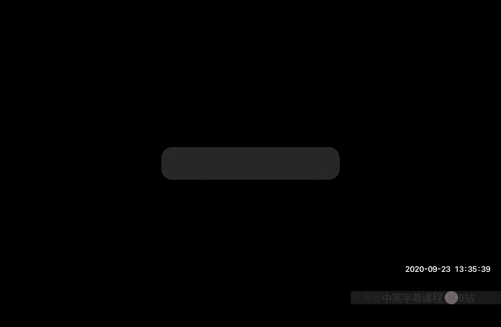
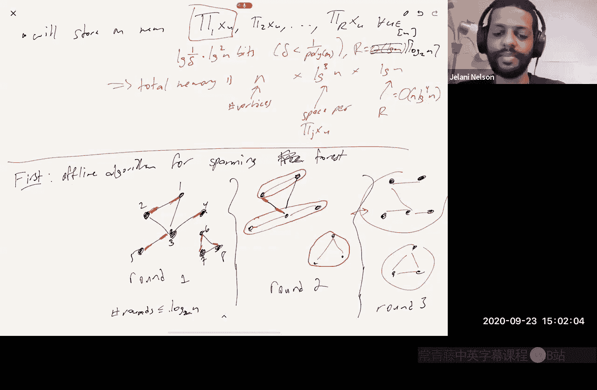

# 加州大学伯克利分校【中英⚡数据流算法｜CS294 Fall 2020, Sketching Algorithms】 p08 P8 Graph sketching -BV11zi7BjEHu_p8-

So today we're going to continue linear new sketching。And specifically， we're going to look at。

An example of graph sketching。Where is a technique that was introduced by An Guhan McGor？In 2012。

And today you're going to see an algorithm they developed using linear youre sketching for。

Finding the spanning forest of a graph being updated dynamically in a data stream。

 but since then when you're sketching for graphs has been you know used to solve numerous graph problems。

 matching and spanning tree and a ton of others as well。I think it's a really cool idea and to me。

 unexpected。So。Looks like dynamic spanning forest。So。You， edges are。Inserted。Or deleted。

From an Nvertex graph。And then， query。Output a span forest。对。Which you're can use of course。

 to say find a path from like determine connectivity， ST connectivity。

 is there a path from ST or to find a path from S to T in an undirected graph？this is all undirected。

 I shouldn say。And。And this。This can be modeled as a problem in the strict turnst model。Right。

Because you imagine they give have a vector x。Which is in0，1 to the。And choose two。Let's even say。

Let's see you can say national University and choose to。Where X， you know， UV。Is the multiplicity？

Of add Uv in the graph。Okay， so if it's a simple graph， then it's always going to be one or zero。

 but if it's a multigraph， you might have many copies of an edge。

So I think I might have mentioned this before last lecture when I was to contribute。

 when I introduced linear sketching in the turnt model， I gave this as an example。

 graph streaming is an example where the strict turnt model makes sense。

So if someone says you know add EE。That's the same thing as saying update。No， you。

Plus one and similarly delete E。This is the same thing as update in the turnst I'll update UVv minus1。

So by the end of today's lecture， you'll see how to do this in low memory。🤧In that。In a data stream。

 okay？嗯。I should say that if there are no deletions。This problem is trivial， right because？

You just remember you basically just do union find right so I mean that gives you speed。

 but if you don't even care about speed， if all you care about is memory。

Then whenever you see a new edge being inserted， then if it connects connected two vertices that are in different connected components。

 then you store the edge， if it connects to vertices that are in different connected components。

are the same connected component， then you can safely ignore the edge because since there are no deletions。

 you know that since these verses are already in the same component。

 they will always be in the same component from now on so this edge is safe to ignore。

Now a spanning tree has n minus1 edges， a spanning forest has n minus K edges where a K is the number of connected components。

 but in any case it's at most n。So for each edge， you can just remember。

You're going to store all the edges right in the spanning force itself and you're going to store at most n minus K edges。

 which is at most n each one is log of n squared bits。

 you have to remember both endpoints log of n squared is the same thing as two log n so this algorithm uses memory at most two n log n bits O of n log n。

Right so。I want to say that this is trivial。In insertion， only streams。To achieve。Oh and log inbits。

对。And maybe I'll leave it to you as an exercise， now that you've seen lower bounds via compression arguments。

You can prove also that there is no。There is no algorithm that uses fewer than analog log in bits。对。

Maybe one way to do it is to via compression argument just to say。If there were such an algorithm。

Then。I could use it to define an injection from the set of all trees on in vertices。Into， you know。

 let's say use S bit of memory into binary strings of length S。

 therefore S has to be at least the logarithm of the number of trees on n vertices and that already gives you an n log n logm。

Okay， so this is the trivial algorithm， but in turn style， in strict turn style。Can't just remember。

呃。The edges in the in the spanning forest。Why not because？There's a very simple example。

Let's say that I insert this edge first。I insert this edge second。Then I insert this edge third。

You're going to say， oh， I don't need to remember edge number three because those two vertices are already inter a connected。

Then I delete edge。And then I delete edge2。And now the graphics like this。

But since I didn't bother to remember E three， I won't realize that。

These two verses at the bottom are in the same connected component。

 you know I'll think that I have the emptygraph。So it's not clear。

knowWhat should I be storing so that when people delete edges that you know。

 when people start deleting edges that that I thought were being used to connect up different components together。

 I somehow can find replacement edges that still gap， you know， still cross that bridge。啊。

And the surprising fact though， is that it is problem。

 sometimes just just so we're clear the trivial the absolute trivial algorithm。

Is all of n squared bits of memory？Right， you know， for each。Possible edge。That could exist。Remember。

If it's there or not。Or another trivial thing is M log n。

 but it's a memory where M is the current number of edges。

So just remember every edge that you've seen， if someone deletes it。

 you can delete it from your memory， if someone inserts a new one， you insert that into your memory。

If you have M edges， that's M log in bits or O of M M log inbits。And we got to the issue there is。

 you know your're。You could have an algorithm， you could have a graph that maybe at the end is sparse。

 but an intermediate time step。It's very dense， right I could insert n square edges。

And delete all but。Five n of them。And you know I don't want my memory to。To blow up to n squared。

What we're going to see today is。The AGM sketch。Is that in fact。

 there's a randomized algorithm that uses O of log cubed endbits。

And succeeds with probability at least one minus one over polyn。

 where the exponents in the poly can be whatever you want。More specifically， it uses。

Oh have n log squared n log of N over delta bits。And succeeds probably at least one minusn time。

And interestingly， we know that this N log Q N bound is actually optimal。We know that this thing。

That bound is optimal。For dynamic spanning forest。That's something that。I proved with watching you。

Last year。And。Dynamic Spning For is you have to output potentially up to n minus1。Yes the robot yes。

One， you might say， well， if you know， one of the reasons that might be hard is because my output is so large。

 my output has size。And log in bits。So it's， you know， of course。

 I need at least linear memory getting the log cubed in is you know， not as。Obvious， but of course。

 I need at least linear memory。 But Hu Z actually even strengthened this， he showed this optimal。

For just simple connectivity。This is something that's online now。

 but he submitted to a conference move here next year so here right the answer is a single bit。

Is the graph connected or not， I just want to know1 B。 He showed that even for that，1 bit。

 even for that problem with a 1 B answer， you can't do any better than than actually being able to find。

Epanning forest， you can't do better than analog log cubed denbits。So that was a bit surprising。

Another thing I'll say about the AGM sketches。It doesn't only work in the stream model。

It also works in other models as well， so let's consider the following model。I have a graph。Right。

Okay。And each vertex。It's a distributed model。Each vertex v。Nose。Who its neighbors are。

But it doesn't know it doesn't know anything else about the graph， So this is。

 you up to something like n minus-1 bits of information about the graph。

And then there's some central server here。Who doesn't know anything？

There's some public randomness in the sky。The vertices know that random string。

 the server knows that random string。And then just knowing their own neighborhood and knowing that public random string。

Each server， each vertex is supposed to send a message to the server。So message one， message two。

 message three。This is 4， this is N。And the server then has to output。A spanic forest。

And what AGM shows is。Can can accomplish this。With the max message length。

Being O of law cube done bits。And it's randomized and it succeeds。

The probability at least one by2 to pull in。Okay。So this' some kind of distributed。

I guess there's another vertex that I forgot to draw doesn't matter。

There's some scheme for a distributed computation which minimizes bandwidth right the naive thing would be that every vertex sends its entire neighborhood to the server。

Then all the messages would be linear in length， omega n bits。

And the AGM sketch is saying actually each server only needs to send a message of length while keep it。

So。😊，Before we talk about how the AGM sketch works。I need to introduce a couple primitives。

Some subrines and these are useful subines to know about because they。

They come up in other places as well。Later in the semester when we talk about， for example。

 compressed sensing， you'll see that one of these is very related to that。Okay， so。

One summer routine， so first minutes to talk about some summer routines we need。

One is something that I'll call case spae recovery。

And the other thing is something I'll call support find。So these are both， let's say。

 I'll describe them both in the terms。Oh okay I was muted so it seems I lost connectivity for a few seconds can people hear me？

Yeah， very great。 So's continue。I'll describe both of these problems in the turnst model。

 we need it for strict turnstyle。But yeah， the solution is basically the same for both。

So what are these problems， so case force recovery？I mean。

 we know what the update model is right in turn style。

 the update model is given like update I Dta means add Delta X I。

 So the only question is what's the query So query。If。The support size of x。

 the number of non zero entries in x。Is that most okay？We must return X exactly。Else。

Can output anything。And support， find。When someone inquiries that data structure。Return。

Any eye such that。Xi is not equal to zero。Remember x is this vector being updating the turnstile model。

So。So support find maybe is maybe the easier one to talk to give you an example of how to think about it。

嗯。😊，So we have this graph。We're inserting edges we're deleting edges。

Someone says query and support find， what they're really asking is。

Tell me any edge that's still in the graph。Okay。It's not clear how to answer that， right。

 usings low memory。 I mean， if you try to sample and remember a random edge。Then you say， well。

 you know if if it's a random edge， then with high probability。

 even if Gilani delete some edges later， you probably won't delete my edge right but that's that's the wrong way of thinking because。

What if I insert a million edges？And then I proceed to delete 999，999 of them， there's only one left。

It's very unlikely that the sample that you kept is the one that survived right。

 but a support find data structure has to handle that scenario。嗯。And it should succeed。

With probability， at least1 minus delta。对。I like to usually when I introduce for support， find talks。

 I like to。Talk about in terms of what I call the fruit game， which is that。

You're holding a basket of fruit。I come in and I start just dropping fruits in your basket。

And I can also reach in the basket and take out a fruit so you know you see me put an apple in your basket。

 you see me put another apple， you see me put an orange。And then later。

 you see me take out an orange， et cetera。 And then I ask you。

Tell me any type of fruit that's still in your basket。Okay。

 and I don't allow you to look in the basket to remind yourself。

 you can just look at what I've been putting in and you can look at things as they come out。

 but you can never remind yourself by looking in the basket。And and you know。

 it's its not it's not trivial to solve this problem， but it turns out there is a。

Of solution that uses only logarithmic or poly logarithmic space in the universe size。

 So in a graph on n edges， the universe is of size n choose 2。

 the number of possible edges in a graph is n choose 2， which is about n squared。

So you're going to use polylo N。Bits of memory and you're gonna be able to solve support find and of course。

 this is a necessary requirement， you know， to be able to solve support find is a necessary to solve spanning forest because spanning forest not you're not just returning one edge in the graph。

 you're returning a bunch of edges that form of spanning forest so。😊。

Fanny Forcece is definitely much harder than， or it's definitely at least as hard as support find that turns out to be much harder。

 but it uses support find as a subine。Okay， good。😊。

I want to tell you how to actually implement data structures that solve these two problems。

And then finally， we'll see how to use these data structures to implement to come up with a new data structure。

 the AGM sketch that solves dynamicmic span for us。

This is actually going to be a deterministic data structure。And I'm going to make the assumption。

That I have bounded entries in my histogram。No， just to make it simple， let's say Paul the end。

Of course， in a dynamic simple graph， the entries of x are always either zero or one。

 so indeed the magnitudes are bounded but。In general。

 let's say I'll just assume that the entries are bounded by some polynomial N it doesn't have to be polynomial n you know if you have some upper bound。

 then you'll have a space complexity that depends logarithmically on that upper bound。O。So。

It's going to be a linear sketching approach。Okay。And what I'm going to do is I'm going to pick。嗯。

Let's say that this upper bound is， let's call it。Capital T。I'll pick a prime。That's bigger than。呃。

'sSay。2 m。And I'll do。All arithmetic。Over the finite field on P elements？so the point is。You know。

 I'm going to be。嗯。Or actually， I think that's fine， so I'm going be doing arithmetic。Over。

I'm going to be adding you know some of these numbers together I'm going to have counters and like each number is at most t therere end numbers at most end numbers are we going to add together in any counter。

 so I'm going to have numbers that are the true numbers over the integers are never going to be bigger than Nt So as long as I pick a prime that's much that's bigger than Nt even if I do things mod P I haven't changed anything。

嗯。Okay。But I want to work with。With some bounded precision here so that I guarantee I sorry I could actually do some bit counting I don't want to work with real numbers because I'm going to divide stuff et cetera。

 so I prefer you the division over FP。嗯。So remember， what I'm stor in memory is a linear sketch。

So if I remember case Sp recovery says that if x is K sparse。

 my queryery has to be able to return x exactly， so in order for that to be true。At the very least。

 I need this map。 X gets mapped to pi X。 I need that to be an injection when you consider it。

On the set of all case sparse vectors， so I need that。For all x not equal to y。

 where x and y are both k sparse。Case parking means that most canons zero entries， remember。

Pi x is not equal to pi y。Which is the same thing as saying pi x minus y。It's not equal to zero。嗯。

So in other words， I want to say that so a notice， by the way， that this vector here。

Is that most two case barss？喂。X minus y as a vector has at most 2 k non zero entries since x and y each have at most k。

So it suffices to have that no2K sparse vector。Is't the kernel of pie？Okay。嗯。So let's look at。

What does that mean so let's say we have a two case I want。I want that。

For all two case parts vector Z。Pi Z is not zero。So here's pie。Here's the。Z is sparse， say this is。

Z is sparse， so it has some non zeros。Everything else is zero。So these parts。

 the starred ones are the ones that are not zero。Or maybe I should use a different color。

These red stars are non zeros。So remember now， this is just a general fact about linear algebra。

 pi Z。Is the sun？Over I of Z times pi I or pi I is the I column of pi right this is just a fact about matrix vector multiplicationification。

So kind of the only things that are relevant in Pis Z are the columns。

That correspond to non zero entries of Z， so you know here's one。Here's another one。

Here two right here。Here's another one， these are' the only columns that are relevant。

In the multiplication pis Z， so I can look at just those five， let's say， or 2K at most 2K columns。

I'll call this。Pi， let's call it S。Where S here is the support of Z。

so it's pi where you only keep the columns in the support of Z。

 that's pi S pi S is the only keep the columns in S。So what I want is that。嗯。

For all S of size at most 2K。Pi S。Has full。Column rank。In other words。The rank。A pious should be。2。

So let me show you that， know， there is a matrix that satisfies this。

It's something called the maybe vander bond or the transpoive vander bond matrix。

So pi will be this matrix。1， x1， x1 squared x1 to the m minus1。One， x2。X2 to the m minus1， or again。

 M is the number of rows。1， x3， et cetera。对。So notice that if you any， you know。

 if you take any sub matrix of this with 2K columns。Right， it just kind of looks like。你。

It's kind of the same pattern， it's a vander bond matrix， okay？嗯。And if you choose。

So let's say you take here 2k columns。What I'll do is I'll also take 2 k rows。

 so I'll set I should say that all the X's are distinct。嗯。So you know。

 notice that this already means that I need P to be bigger than that， right？For this to be possible。

 or at at least anywhere。嗯。嗯。I'll choose。I'll choose M to be 2K。So， any。And by 2K sub matrixtri。

Is a square aron matrix。And luckily for us， there is a theorem。I might have a sign error。

 but I think it's this， which says that if you take a square of anommon matrix， it's determinant。

Of a square anomom matrix is， let's see。系 s。This is the product。E。

J less than J less than J prime and S。OfXj minus xj prime。And the point is。Since none of these。

 since these are all distinct。X J minus x J prime is always non0。

 You're multiplying together a bunch of numbers that are not zero。 So the product is non zero。

 So this is not 0。Right。So that implies by linear algebra that it's full rank。

So it doesn't have any non zero vectors in its kernel。So that's it。You we have'。

 we've constructed a matrix that has the desired property。And now at least in principle。

 we can use it to solve caseb recovery in exponential time。So let's say someone says query。

So remember we're given basically y equals pi X。Or this is Case Spce。And we want to find。

We want to find X。So how do we do it， we just do a for loop you just say， look。

For all just loop over all s， which is a subset of the columns where Ss size is exactly 2 k。And let。

Zote x prime as pi S inverse applied to y。And then just say if the support size of x prime。

We know that the support size is going to be at most。嗯。We know that the support size of。

Of x prime is going to be at most 2k， right， because pi S has 2k columns。

But we're looking for something that's k sparse， so it might be too dense it might have it might be it might not be K sparse。

 it's only two K sparse so if the support of x prime has size bigger than k。

Or let's say in most cases， I should say。Then return。

X prime let me with zeros added in the right places。So what I you you know that's a little informal。

 what do I mean by that， the point is you know I guessed that the support。

I guess that the support of X。Was， you know， we know the support has size， let's say two。

But guess I get it the set of size。Two times2 of size 2 K。

So I guess that the support was contained in these four elements。And then I solved the linear system。

 and when I solved it it gave me a vector back that was actually at most two sparse。

 so it said actually this is a five and this is a seven。And then these are zeros。

And then what I'm doing is I would just pa the rest of zeros。

And then I'm going to return that as my answer， so that's how that's what I that's how I answered this thing。

And the point is。This is guaranteed to work because。There should only be one。

 right we said that this thing is an injection。On the set of case parse vectors。

So there aren't going to be two different essays that give you bathft valid。That give you back。

Case sparse vectors， if you solve the linear system。

 because otherwise the thing wouldn't be an injection。

 those two different case sparse vectors for SNS prime would both map to the same Y。

 which means it's not an injection that's impossible。嗯。So good， so that's it the total memory here。

Is K log P bits？Which， you， if I assume that Pia mustpoli in。Is Kello input bits。In fact。

 you know k here the constant the biggo is two， right， the number of rows I have in pi is 2 k。

So it's a 2 k login bit algorithm， a 2 k log P bit algorithm。Now。Now。

 the thing that isn't so great about this algorithm is that the running time to answer query is exponentially big。

You know how many sets of size 2 k are there and choose 2K， which is roughly n to the 2K。

So this is an end to the O ofK time algorithm。Which you know。

 we're going to instantiate this later with K being something that's not constant。

 so it's not it's going to be like a quasi polynomial all time query algorithm， which isn't great。

It's possible。To have。A poly K login。Qu强 algorithm。It's known as syndrome decoding。

Which is related to something called proy's method。

We might talk about it later in the course when we talk about compressed sensing。

But I'm not going to talk about it today， so syndrome decoding it's related to decoding for air correcting codes in particular like read som codes。

 so I mean it's a little。Minutes。And I would have to pivot what we're talking about considerably to cover it today。

 so I don't want to do that。But we'll just talk about memory。

 so we know that now that there's a low memory algorithm for this model。So now we're going to use it。

To solve a support find。Remember， support find says when someone says query。Return。

Any I such that Xi is not zero。So how are we going to do this？

We're going to use a trick that you've learned before when we talked about remember we gave a few different algorithms for distinct elements toward the beginning of the semester。

We talked about flaggling Martin we talked about the KMV K minimum value algorithm and then we had a lecture on the geometric sampling approach。

 so here you're going to see the geometric sampling approach strike again。So we're going to have。

A case spa recovery structure here。And then we're going to have another log in case cross recovery structures。

And then we're going to have a hash function H。Which maps the universe。Into。Zero log n。

 actually let me call this caser1 and two。From a from a。Well。

 let's just say for now that it's totally random。This can be relaxed。张心友。Bounded independence。

 I'll talk about that later。Okay。But we want that the probability that H of I is equal to J to be。

 roughly whatever2 the J。Okay。It will be1 over2 to the J except then the sum the sums of the probabilities won't be1。

 so the very last level， the probability won't be whatever two to the log n。

 but it'll be whatever it needs to be to make the sum be1。Probably it'll be that up to a factor two。

Okay， and when someone says update。I Delta。What I'll do is。I will always， let's call this KSR0。

 I will always feed every update into KSR0。But then I'll also feed it into a random one of the other KSRs based on H in particular。

 I'll send it into KSR。嗯。I'm setting into KSR sub H ofI。and because H is biased to usually be small。

 right the probability that H of I is big is exponentially small， so usually H of I is one。

Once in a while H ofI is two， even less frequently， it's three， et cetera。

So the majority of these updates will get sent to KSR1， but some will get sent lower as well。

So that's it， that's my data structure。So and I'm going to do this with Delta， let's say。嗯。If I want。

Failure probability Delta。Oh， these are。Good， actually， I think。Yeah， I'll instantiate。

Each KSR data structure。With K being some constant。Times log went over it all time。这。

Delta will play a role in how I set K， remember this is these data structures KS are deterministic。

 they always work。But you have to tell it what K to use and if you want a bigger K。

 you spend more memory。So the total memory here。Each one of these KSRs uses K log n bits。

 which is log when it results to log N。And you have login of them。😡。

So the total memory is something like log whenever Delta。Times lock square。

And it's known that even for a support find， this is optimal。And this is。A lot of authors。

Capital of it all。2017。Any more precise？The thing is that， you know。

 you can solve the if there're binary vectors then of course。

 you can always solve the problem in end bits， you just remember like。

Which items are in the set and which aren't？So log1 over Dlta log squared n is not always optimal because you could what if delta is one over two to the two to the n？

Then log winner or Dlta is2 to the end， this algorithm would use2 to the end memory。

 but basically at some point， once delta becomes exponentially small。You might as well just。

Solve the problem by maintaining the entire histogram in memory explicitly and and' that's basically what this paper says。

 it says up to a certain point， this algorithm， this geometric sampling algorithm is optimal and beyond that point you might as well just use a histogram。

So， good。嗯。想 now。Let's think about this reason about how you answer a query。我不不不。

So maybe I'll ask you。Anyone， any of you have a suggestion on what should you do to answer a query。

 remember what I'm trying to do is I'm trying to find some I such that X is not zero。Any takers？

Maybe let me start with a hint。嗯。Check the first block that's none zero。When you say the first。

 what do you mean what is the first， what is the last？ where are you counting from。

 Where you counting from？Starting from the bottom。 Yeah， starting from the bottom， right。

 So the point， So how many how many SR log n， right， KSR log n。

 How many support elements do you expect to land in KSR log n。A one over n fraction of them， right？

 And， you know， if if the support size of x is not that big， let's say it's root end。

Probably nothing is landing there。 Probably KSR log n is empty。So and by the way， this is， of course。

 very similar。 you know a lot of these geometric sampling ideas look similar。

 very similar to what we saw in distinct elements。 So you look in KSR log n， Oh。

 it's empty right you query it， it gives you back the Uti vector， the zero vector。 you're like oh。

 nothing's there。 Then you look at KSR log n minus1。Oh。

 nothing's there either and you just work your way up。Until the very first level。From the bottom。

That returns at something that's not zero。And then once you have that。

 you just return anything in the support at that level。Now。

 why did I set K to B log1 over delta and why should this work？Well。嗯。The point is。You know。

 when does this fail？This fails if remember now KSR is a deterministic algorithm。

If the vector actually is case viruse。Then， it's very unlikely。I sorry。

 not unlikely if the vector actually is case sparse with 100% probability。

 you'll get the vector back， it's a deterministic algorithm。So the only way this can fail is if。

 you know you try to give it， remember that the behavior is undefined， the KSR algorithm。

 the behavior is undefined if it's not case bars， if it's actually a denser vector。

So the only way this could fail is if as you're working your're way from the bottom at some point。

 you know， you have this。You run into a vector that's not actually case barsrse。

 And then the the data structure at that level does the wrong thing。 Like， you know， it。

 it just adds arbitrarily and gives you back an element that isn't real。

 And then you output that and you're wrong。But for this， you basically can use the turn off bound。

 right， you can say look。嗯。Let's say， you know， at level。At level Ksr log N， I only expect。

1 over root end elements。 I mean， that's less than 1。 I don't expect anyone。

 I only expect one over root end elements。What's the probability that even though I expect one over root n elements。

 I get more than K elements， more than C log1 over delta。😡。

That's very unlikely by the turn off bound。Okay。And I could basically do that。

Working my way up from the bottom up until。Now， let's go up until。

 let's says there's some magic level。Here。There's some like kind of prefix or suffix of levels。Where。

嗯。The probability。That any。Of these levels。Has more than K items。Yeah yeah。

Is that most adults over two？Basically， it follows by the turn off bound and union bound。

 So the failure probability at the levels is geometrically changing， right。

 because let's say one of those levels and this this， by the way， is the level where。Let's say。

Actually， let me how I want to see it。This is。This is the level， say。那个。Where you expect。嗯。

Some other see prime log run rail elements。And imagine that C is some constant that's much bigger than C prime。

对。So if you look at this region of levels。You can argue just by a turn off on union bound that none of them gets more than C log one over deelta elements via the hash function。

Meanwhile。You don't just want to say that you never have， you never。

 you never get tricked by something that has too many elements。

 You also want to say that there is going to be a level that does have at least one element。

Right because I do have to return a element at the end of the day。So。

Let's look at this level right here。I want to argue that the probability。That this level。Receives。

Zero support elements。Is also small， less than delta over two。

Mch also follows from the turnoff bound， right because？How many do you expect to be there。

 You expect C prime log 1 deelta to be there， Think of C prime is a big constant。

What's the probability that you don't have C prime longerars， you have zero elements？

You devated from your expectation by a lot。And the probability that you deviate by that much is exponentially small in this log order Dlta。

 so if you pick C prime to be big enough， the turn off bound will tell you that this is at most Dlta over two。

So if none of this region of levels。Has too many elements。 That means all of them are succeeding。

 They're all giving you valid recoveries。 And you know that the top one。

Does have at least one element in its support。Then that guarantees that somewhere in that region。

 you're going to find an element and you're going to return a valid。Does that make sense。Basically。

 the reason I'm choosing K the way I chose it。I to basically apply the turn off down to get my failure probability to be exponentially small in K。

 which is going to be something like Delta failure。Okay。Okay。

 good now notice that I also had this KSR0， which received every update。

If people remember the older geometric sampling algorithm I described for distinct elements。

 why do I need KR0， I haven't talked about it yet， Why is it there。

Right and think basically it I have two components here， right， I have this geometric sampling thing。

Ging on。But then I also have this data structure Kr0， which is receiving every single update。

I've only talked about meeting this geometric sampling part， right I say， I say basically， you know。

 there is this level， this this red box level in the middle somewhere where I expect。

Log C prime log adults elements to survive。So I'm guaranteed that， you know。

I expect that and I'll actually have one survive with high probability。

 so somewhere in that suffix I'll get a return value that works。

RightSo everything works just in this big yellow blob， why do I need the top yellow bb。

 why do I need the K are zero？And they'll give me five more seconds。Okay。So。The reason is。喂。

What is this level？You know what。This is， yeah， go ahead。 Yeah， I it if there are two few elements。

 Yeah， what if two female elements in there in the support of X itself。

 What if X itself is already super duper sparse， It sparsity is less than C C prime log winner Delta。

Then this red level， this red level， this red box level doesn't exist， right。

 Because what is that red box level， It's the level where the support of X。

Over2 to the J or level J is roughly C prime log over deelta。But if the support of X。

Has size less than C prime log1 delta already， then there is no such J。Right。But that's an easy case。

 If x itself is already sparse， then I don't need the sampling。

 The sampling was to ensure that x is sparse。So that case spae recovery works。

But if x is already sparse， I don't need sampling。 I can just directly use K sparse recovery。

 So the overall query algorithm is。I first look in the geometric KSRs starting from the bottom。

 I look at KSR log n， I look at the one above it， I look at the one above it all the way up to KSR1。

The very first time one of those returns to me a non0 vector。 I return any element from its support。

If all of them。To give me a zero vector。Then I just return something from the support of K or zero。

And if KSR is0 says it's a zero vector too， then I'll just throw my hands up and say， you know what。

 probably x is just a zero vector， that's probably why this is happening。Does that make sense。

And你 know。The problem to go from a non0 case to an element of support。Oh。

 so how the element with the hash function map。How do you sorry say one more time？

So if you have the non zero KsR block， yeah， how do you get the support element？

Right so if you case Sp recovery， remember how case Sp recovery works， so I mean guess I didn't say。

 but it returns to you when you query a KSR data structure，It returns to you the， you know。

My case for inspector x is as follows K2 is7， K7 is4 and K 11 is 22。

 it tells you the support and the values。Right。So if one of the KSRrs tells me that。

 I'll just look at the first value if the first index it gaming me with a non zero value。

 and I'll just return it。If you look at the KSR data structure that we described on the previous whiteboard。

You know， there's this exponential time query algorithm which guest S solved a linear system。

And if that linear system gave you a case bar inspector back， it returned it， right。

 So the point is you like。You just look at it it's basically will tell you S and it will tell you all the values on S at most half those values are0 because SSs size is 2 k。

All right， sorry。Not at most half， but basically， you know。

 one of those values will be non zero if it's a non zero vector and then。

At least half of them will be 0， but that's fine。 Just return anyone that's non0。 Does that I don't。

 Does that make sense。Yeah。Any other questions？Okay， okay， doesn't look in someSRI KSR。

 that's not zero？You said， doesn't every support element end up in some KSR for any IN， yes， it does。

So would why would all KSRs report zero？But I don't just。呃。Actually， it's a good question。嗯。You know。

 I think you're right， maybe I probably don't even need the KSR zero。诶。

For exactly the reason that you said。So good， you've simplified this picture even a little bit more。

Yeah， I don't think you're right， I think I。Even if the vector originally is sparse。

 then I know that the union of the supports of all the KSRrs combined is at most。Is that most。

Sea log whenever Delta。I lost time。So anything that receives a non zero。

 any cancer that receives something from the support will be。Will will have support size at most。

well sos yeah， I think you're right。カ上に。O。Does that sound right to you？Yeah， I think so Okay， good。

 any other questions？Okay。Yeah， yes， we did need such a thing with distinct elements。

 but you're right for this particular problem， it seems like we don't need it。

So now in the last half an hour， let's talk about D span forest。And this is the AGM sketch。嗯。

What we're going to do is we're going to so what is at the end of the day， notice that。

Both support find and。Case by recovery， like the algorithms I've described are linear sketches。

 right， because at the end of the day。You know。What are rest storing in case Sp recovery。

 restoring a matrix vector product？对。So that's a linear sketch。

 you're maintaining some pi times some vector。And then。嗯。

What are we doing in the support find data structure？We're hashing， and then we're。嗯。Yeah， I mean。

 I think like whenever there's an update in support find。

Some some set of counters get added to in a linear fashion， right。

 we add Delta times some coefficients in some buckets。

 so all all everything we're doing here is linear。Okay。嗯。Or， you know， if you want to。

 if you want to look you know more if you if you want me to actually draw the matrix。

 so the matrix for， let's say， support find。Looks as follows。So if you look at the first column。

H of one is some level， so basically you can think of the rows as like being divided into like login blocks。

So this is like region zero， region1 up to region， oh there's no region zero。

 it's region one up to log n。And remember that there's a hash function H。

Which tells you for each column or for each entry， like where does it go？Which block does it go to？

So let's say that H of1 is2。Then everything。Outside of block two will be zero。And then in block two。

You'll have the。You'll have like。嗯。Column 1。Of the of a case force recovery。Sketch。

Sketchching matrix。Et cetera， okay。I mean， I don't think it's super informative to draw out what the matrix is。

 but this is what the matrix。So it's a linear sketch。So。For dynamic spanning forest。

 what I'll do is follows。I'll pick。嗯。R， which is going to be theta login。嗯。Support， find。

Sketching matrices。Let's call them。Pi1 up to pi R Oh。

 and I did want to say one thing about this picture。Notice that I said H is totally random。

Why did I say that H is totally random because ultimately I was applying the turn off bound to say that at a level that's too deep。

 it's very unlikely that you have too many support elements land there and also at the red box level。

You will have。You will have a non zero number of elements support elements with high probability as well。

And the turn off bound， you know， when I wrote the turn off bound like in the lecture notes。

I assume that the random variables that are being added together are independent right what are the random variables that are being added here if you focus on a particular level J。

Then kind of X I is an indicator or let me not say X Y I is an indicator random variable for the event that item I was hash to level J。

And then I'm summing up over all the YIs。 and that tells me how any how many elements got hash and level J。

 So that's my sum of independent random variables that I'm applying to turnout down to。

m one thing about the turn I won't justify it here today， but one thing about the turn off bound is。

You can show that。Basically， if the turn off bound is giving you a failure probability of deelta。

Then。It's enough if the sub Ans had only been roughly log whenever Delta Y is independent。

They don't actually need to be fully independent。So since we're shooting for failure probabilities from churnoff on the order of Delta in this argument。

 it's enough that H is drawn from a log n wise independent family。So you can actually store H。

You actually store ageging less than linear memory。log my results why sorry。

So it really is an honest low memory algorithm， I wasn't cheating with this random。Okay， and good。嗯。

Each。Each vertex。You know。Let's say you in one to N。Will， wants to keep track。Of its。

 I'll describe what this means signed。Sign neighborhood。As an N choose two dimensional vector。

So you know what is let's let's let me show what I mean by by this thing。

 so let's say that we have the vertex3。And it has edges。To one， and it has an edge to one。

 it has an edge to five。Okay。So five， choose two， I believe， is 10。

So the possible edges here are what？There's one， two， there's one， three， there's one， four。

 there's one， five。There is two， three， two， four， two， five。Three， four， three， five。And four。

 five right， these are the n choose two， the five， choose two edges that could possibly exist in a five or text graph。

And let's say there's also two and four out here。And let me offer you what x3 would look like。

So any edge that doesn't touch three。I put a zero there。So this doesn't touch three。

 this doesn't touch three， this doesn't touch three。All these don't touch three。

And now34 is not an edge， so I put a zero there as well。Oh yeah， so I think we have one， two， three。

 four， four， yeah， we have seven left， those are real ledges。One is less than three。So， I'll put。

23 is not a real e that， there's no 23。One is less than three， so I'll put a one here。

But three is less than five， so I'll put a minus one here。Okay。

So this is what I'm calling this is you know a definition by example。

 this is what I'm calling the s neighborhood vector。

 it's basically an indicator it's an entry two dimensional vector that tells you which vectors are adjacent to you to three in this case。

And I sign an edge based on whether U is the smaller vertex in edge in the edge or it's the larger vertex in the edge。

 if it's the smaller vertex in the edge， I make it a minus one。

 if it's the larger vertex in the edge I make it a plus one。

 it doesn't really matter that I did it that way as long as I'm consistent。

 I could have also defined it the sign to be the other way as long as I'm consistent across all of the Xs okay。

😡，So。If in memory I stored this is this sounds like it's not clear why I'm doing this because I just you know there's already an n squared algorithm which is I remember all the edges in the graph now it sounds like I traded in my n squared algorithm for an n cubed algorithm because you know every vector is remembering an n choose two dimensional vector。

😡，And there n vertices， so the total number of entries I'm remembering altogether is roughly n cubed。

Okay。不。What we're actually going to store is not all the exUs， but we'll store memory。嗯。Pi。

 what did I call them pi 1， it's a pi R。Pi 1 x U。Pi 2 x U。And pi Rx U。For all you。对不起。Okay。

So each one of these， remember。To store this takes a log。One over Delta。Times log squared n bits。

I'm going to set Delta。To be like some whatever polyan for some， you know。

 whatever end to the fifth or something like that。And then I already said that R is data login。

That implies that the total memory。Is right n times this is the number of vertices。Times。Log Qd in。

This is the space。Her。嗯。For Pi JxU。Times log in。This is R。So this is all together。

And log to the fourth event。喂。It's possible to actually improve this to end log cubed then without really changing the algorithm that much。

 basically the way I'll just say how you do it， but know what I'll actually show you is this log of a fourth algorithm。

 the way you get down to log cubed is you slightly redefine the support find subroutine。

So the support find subrtine， I said， with probability Delta。

 allowed you're allowed to like mess up and say something that's not actually in the support。

And with probability1 minus delta， you have to output something and that's in the support Okay。

 and I showed we've seen how to solve that problem and get log1 delta log squared and bits。

The way that you do better for dynamic spanning forest。

Is you slightly redeine the subroutine as follows， you say， look， actually。

I want to have two failure modes。Silent failures and known failures。A known failure is。

The support find data structure just outputs fail。 It says， you know what。

 something is definitely wrong， I'm going to output fail。行。

And then a silent failure is it just behaves in an arbitrary way， you know。

 it doesn't know that it fails， but it outputs something that's not actually in the support。

So that's failure mode2。 And then I give， I assigned two different failure probabilities。 I say。

 look， I want failure probability， Delta 1。failureilure mode 1。

 I want to happen with probability at most Delta 1， where it outputs fail。 It knows it failed。

 failureil mode 2， which is the silent failures。I want that to happen with probably at most Dlta too。

And then then you you can get a space bound for this variance of the problem that depends on both Delta 1 and Delta 2 in different ways。

And then what you do is you instantiate， you run this AGM sketch where Delta 1 is like a constant like one/10th or something。

And then Delta 2 is one of Apoleon。And if you do that， you can show that， in fact。

 you'll get an N log cubed done algorithm and that it's enough， you know。

 it's enough for to make the AGM sketch work。 But， you know， right now。

 I'll just assume that we only have failure modes of type 2， which is the worst kind of failure。

 It's a silent failure you don't know you failed。 And I'm basically setting。

 I'm setting don't set to be so small that it's unlikely that you that any queries you ever execute or ever。

 ever fail。So the total number of queries we're going to do here is going to be something like。

 I think n time at most n times R。Where is the capital R is a number of rounds。

I'm making at most NR queries， which is N log N。But Delta has failure probably much less than one over polyo。

 and let's say whenever over un cubed。So by a union bound， it's very unlikely that any of my。

That any of my queries fail。Anyway， so good， so now let's think about。Why， why storing these？😡。

Pi J X U is enough to be able to solve dynamic spanning forest。So before I do that， first。

 let's just talk about an offline algorithm。Is ever spanning tree？Car Fanni Forres， doesn matter。So。

Okay， so let's say this is my graph。I'm going to imagine solving this in rounds。

 I'm trying to find a spanning force I'm going to find spanning force in rounds。In each round。

 each vertex is going to pick one of its incident edges。

And then we're going to just toss that edge into the spanning forest。

All all the ones that were picked， so， for example。Let's give these vertices names。So vertex 1 says。

 I want to pick this edge。Vtex2， it might pick the same edge， it might not。

 let's say this is being done in a distributed fashion， you know there's no coordination。

 but he might just happen to pick the same edge。Vertex3 decides to pick。This edge。

 which five obviously has to because that's its only edge。

 four has to pick this because that's its only edge。Maybe six fix this as does seven。

And eight picks that edge。行。😊，嗯。This and this so then now what I do is I toss all those in。

I toss all those in my spanning forest and then I contract。So。That edge got tossed in。

 that edge got tossed in， that edge got tossed in。These two edges got tossed in。

And then I contract into components， so this gets this thing of this now this blob as one mega vertex。

😡，This blob is also on super vertex。This blob is one supertex。And now what I do is again。

 I look at edges that leave the super vertices， so for example， there is an edge， there is an edge78。

 right？But 78 to me is not an interesting edge because it does not go outside of a super vertex。

 it stays inside the same super vertex。😡，I only care about edges that leave a server text。

So for example， this edge leaf goes from one super vertex to another。As does this one。

And then I'll do the same thing， so is， this was round one。This is round two。And then round two。

 I'm going to do the same thing as round one， every super vertex。

Is going to pick an edge incident upon it if one exists。ThatThat super verix in the bottom right。

 there is no edge in upon it， so we can't do anything。But the other two， you know。

 they'll pick incident edges， so maybe they both pick this one。And then now I'm done。

 basically right。Now my bbs are the connected components。Of course， you know。

 it might it might happen that I introduce cycles， but you know， for my purposes。

 don't I don't really care as long as I have。Ca I mean， I can always remove the cycles at the end。

 right， I'm just trying to find the connect components and at least the spanning training。

If I find even more edges than a spanning tree， all the meier。

 I can just remove that in post processing。Okay。就。😊。

this does this process that I described make sense for finding， you know。

 connected components and spanning trees inside of them？In an offline setting。

 if I don't care about memory and I don't care about runtime， it's just some process。

Notice also the number of rounds。Is that most going to be log based to event？Right。

 why is that just because if you look at the set of non maximal components。From round to round。

The number of non maximal components， meaning that they're not the final connected component。

At least halves in every round。 When you go from one round to the next， it divides by two。

And in the beginning， the number of non maximal components is at most n。

 every vertex is by itself in its own kind of blob and every vertex is its own super vertex。

So the number of rounds before you have no maximal components， no non maximal components。Yeah。

 is that most live based to event？Which is related to why I chose R R basically is the number of rounds that we're going to run the randomized algorithm for in the streaming model。

For认。So， now。Let me just convince you that we can simulate this login round offline algorithm。

In a randomized way using the sketches that we've stored。To pick an incident edge。Okay。

 that's easy enough。Pi pi1 x。Can people still hear me。

 I'm getting error messages about my internet connection？I think it's fine， right？Hello， testing。

 testing。Yeah， I can hear you at least okay okay great。So right。

 so how do we how do we simulate round one， We just look at pi 1 X U for every U That's a support find data structure right what's what is XU remember it's just this signed neighborhood vector。

And we just do a query and it returns to us an element of the support。

 namely an edge that's actually incidents upon the vertex。😡，Okay， so round one is easy。

You just query all these Py1 Xs。And。Some of them might fail。 Oh， actually， we already。

 we're going to condition on the event that none of the queries ever fail。 right？ Remember。

 we set delta be less than one over poly N。 We're only doing N queries right now。

 It's unlikely that any of them fail。 Okay， good。Okay。Now what， how do we simulate round two。

 We need to merge things into we need to merge。嗯。Vertices along these edges that were chosen。

 And this is， this is， I think， where the magic happens。Basically。s look at this picture again。

Right here's x3， let's ask ourselves what does x5 look like？X five looks something like this。

It has the edge to three， five is bigger than three。So that's a plus one。

It has and that's its only edge actually， it doesn't have any other edges。

What happens when you add x3 to x5？😡，Right。The edge 3，5。 So let's say that， you know， in round one。

 one of the edges that you're trying to merge along is the edge from 3 to 5， you know。

 vertex 3 chose 5 or vertex 5 chose 3 as its neighbor in round1。So you need to merge along。This edge。

 So what I suggest you do is you just add that the corresponding vectors。 you add x3 to x 5。

What happens to the edge 35， it disappears because they opposite that edge has an opposite sign for five and three。

But notice that x3 plus x5 is not the zero vector it still has in its support13。Right。😊。

And my claim is just， in general， if you have two super vertices。ok。Basically。

 you can represent each super vertex as the sum of the x u's for you in that vertex。

And if you add those two vectors together， what you'll get back。

Is a new vector whose support is exactly the set of edges that leave the super vertex。Okay。

So the claim。Is that for a super vertex？ASup muchs is just a set of vertices I got merged。

 so let's call it a。Which is some subset of the vertices。LetIt's vector。The XA。

 which is defined to be the sum over UA of XU。Then the support。The support of XA。Is exactly。

The set of edges。You know， leaving a or crossing the cut。Crossing the cut。From a to n minus a。

So that's basically what I'll do。Right。If you know in round one。

 if if the edge 35 is chosen to merge， I'll add， I'm not storing x3 and x5。

 I'm storing pi times those， I'll add pi 2 x3 and pi 2 x5。😡，Okay， and I'll add pi3 x。

 sorry say if if I merge the edge 25， I'll add pi2 x35 pi 2 x3 pi2 x 5， pi 3 x3。

 pi 3 x5 pi 4 x3 pi 4 x5 basically in all the future rounds。

 I'll just make sure to add the sketches of those vectors together。And then in round two。

In round two， I'll query。To figure out which I just emerged using P2。And then in round3。

 I'll use pi3， et ceter。So question for you， I'm using an R factor larger memory because I have R different sketches for each vertex。

😡，Why do I do that， Why don't I just store pi X you？Just always use the same matrix pi。In round one。

I'll query all the px Us。 I'll get some edges to merge。 I'll add the corresponding px Us together。

Now， in round two， I'll query those pi X A's where A's are the super vertices。 I'll get some edges。

 I'll merge them， etc cetera。 right， I've just saved myself a factor R memory。

 Why dont I why Why don't I do that。 Why What's the problem there。Anyone see any issues？

So slightly subtle。What does it mean？To have a randomized algorithm that works。😡。

Or like a randomized data structure， let's say a data structure。

 a randomized data structure that works。嗯。What's the random sound so a randomized algorithm。

A Monte Carlo randomized algorithm。So that for all inputs X。The probability。Over the random coins。

Random coins tossed by the algorithm A。Of。This for all inputs x。The probably that A is correct。

On input X is at least1 minus delta。Right。That's usually what we mean when we say that we have a randomized algorithm that works with high probability。

WhenWhen you say this， x is fixed in advance。You're not allowed。You're not allowed to。

To have the query to have the input X depend on the random coins。

 let's say the random coins tossed by a， that's a random string R。

 You're not allowed to first look at R。 And then based on R， choose x。Okay。

And that's exactly what you would be doing if you only used one matrix pi。Because the point is。

 you queriied all the pi exus in the first round that told you which edges to merge。ok。

And then you merge。 so basically， the edges that you're choosing to merge depend on the randomness that defines pi。

 The randomness that defines pi is just the hash function H。 if you。

 if you unravel what all this means。 So based on that hash function H and the definition of your support find data structure。

😡，You chose what to merge。 and then when you do a query in your second round。

The fact that you're doing that query。Is correlated with the fact that you had that as your age。😡。

RightSo what you're choosing to query in later rounds is correlated with the randomness of the algorithm itself。

😡，And that's not allowed in， you know， in Ron Carlo randomized algorithms。

 you're not allowed to have inputs that depend on the randomness。

 kind of all correctness guarantees are off。And that's exactly why。I use a different sketching。

 different randomness for my sketching from round to round because。

Pi 2 is a random sketching matrix chosen independently of pi 1。

 and pi 3 is chosen independently of pi 1 and pi 2。 They're all independent of each other。

So the queries I'm making in my JF round of this algorithm。😡。

Are not correlated with the randomness of Pige。So I do get the correctness guarantees promised to me。

And， in fact。It turns out that that， you know， that's actually not just an artifact of the analysis that's needed。

 because I told you that。There's an end log cube， but I told you that there's a way to modify a support find。

To be this kind of two failure mode support fine to get an N log cubed N algorithm。

Other than modifying the support find subroutine， everything else is the same。

 you're still using capital R rounds， capital R is log in。In fact。

 our capital in this case could actually be。You know， exactly kind of log based to event。

In the case where there are two failure modes。You actually have to make it some larger constant times log in because。

Oh， let me not get into that right now， but anyway， the point is just。If。

If I could get away with only having one pi and not having R pies。

 I would actually get an n log squared an algorithm。And that violates a lower bound。 Remember。

 I told you that we have a lower bound saying you actually need and lockq1 bits of memory to solve this problem。

 There's a， there's a provable lower bound。 So it's。It's interesting that， I mean， you might。

 you might look at this argument and say， oh， that's just some technicality that Gelai needs to perform to make the analysis go through。

 but probably in practice。I can get away with just using a single pie all the round。 No， Okay， no。

 we know for a fact that。You do need to use different pies in every round because otherwise you would be violated。

 you would have too good of an algorithm that would violate the lower down。

And I'm going to give you some practice with this kind of reasoning and the first homework。

 which will be out soon。Okay， so that's all I have for you today， I'm basically out of time。

 any final questions？

