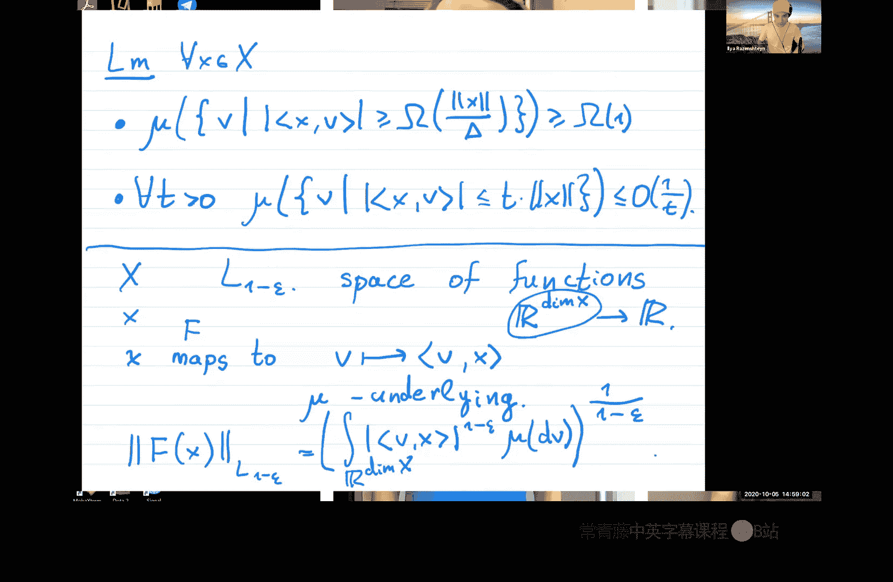

# 加州大学伯克利分校【数据流算法】课程：P10：嘉宾讲座 - Ilya Razenshteyn

## 概述
在本节课中，我们将学习Ilya Razenshteyn关于范数空间嵌入与草图之间关系的研究。核心定理表明，如果一个有限维范数空间存在一个高效的通信协议（草图）用于距离估计，那么该空间可以线性嵌入到一个更简单的空间（如L1-ε空间）中，且失真度可控。这为证明通信复杂度下界提供了一种新方法。

---

## 通信模型与草图简介

上一节我们概述了本节课的核心内容。本节中，我们来看看本讲座所基于的通信模型。

我们有一个度量空间 `(X, dist)`。通信问题涉及Alice和Bob，他们各自拥有该空间中的一个点。他们希望通过交换尽可能少的比特信息，来判断两点间的距离是“近”（≤ 1）还是“远”（≥ D）。

该模型有几个关键点：
*   协议是随机的，成功概率至少为2/3。
*   允许使用**公共随机硬币**，且数量是可数无穷的。这使得协议能够生成如高斯分布这样的连续随机变量样本。

我们将协议交换的比特数称为**草图大小**或**通信复杂度** `S`，将区分阈值 `D` 称为**近似比**。

---

## 已知的草图构造

在深入核心定理前，我们先回顾一些已知的高效草图构造。以下是两个经典例子：

### 欧几里得空间 (L2) 草图
对于d维欧几里得空间，存在一个高效的草图协议。
1.  **生成随机向量**：Alice和Bob利用公共随机性，独立采样 `g` 个标准高斯随机向量 `r_i ∈ R^d`。
2.  **计算投影**：Alice计算 `x̃_i = <x, r_i>`，Bob计算 `ỹ_i = <y, r_i>`。
3.  **离散化与通信**：双方将实数轴随机划分为大小为 `w` 的区间，并为每个区间随机分配 `+1` 或 `-1` 标签。Alice发送 `x̃_i` 所在区间的标签，Bob发送 `ỹ_i` 所在区间的标签。
4.  **判断**：如果所有 `g` 次比较中，双方标签均相同，则判定为“近”；否则判定为“远”。

通过设置 `g = O(1/ε²)` 和合适的 `w`，该协议能以高概率实现 `(1+ε)` 的近似比，草图大小为 `O(1/ε²)`。

### Lp 空间草图 (p ≤ 2)
对于 `p ≤ 2` 的Lp范数，构造是类似的。只需将高斯随机向量替换为 **p-稳定分布** 的随机向量，其余步骤和分析与L2情况完全相同。最终也能获得 `(1+ε)` 近似比和 `O(1/ε²)` 的草图大小。

---

## 核心定理陈述

现在，我们来看Ilya Razenshteyn等人证明的核心定理。

**定理**：设 `(X, ||·||)` 是一个有限维范数空间。假设存在一个公共随机硬币通信协议，能够以草图大小 `S` 和近似比 `D` 解决 `X` 上的距离估计问题。那么，对于任意 `ε > 0`，存在一个从 `X` 到 `L_{1-ε}` 空间的**线性嵌入** `F`，其失真度至多为 `O(S * D / ε)`。

**核心概念解释**：
*   **线性嵌入**：映射 `F: X -> L_{1-ε}` 是一个线性映射，即满足 `F(x+y) = F(x) + F(y)`。
*   **失真度**：存在常数 `c`，使得对于所有 `x, y ∈ X`，有 `(1/c) * ||x-y|| ≤ ||F(x)-F(y)||_{L_{1-ε}} ≤ c * ||x-y||`。定理中的 `O(S*D/ε)` 就是这个 `c` 的上界。
*   **L_{1-ε} 空间**：这不是一个范数空间（不满足三角不等式），但对于它，我们仍然有高效的草图（使用p-稳定分布，`p=1-ε`）。

**定理的意义**：该定理建立了**草图存在性**与**可嵌入到简单空间**之间的等价关系。它表明，对于范数空间，获得高效距离估计草图的**唯一通用方法**，本质上就是先将其嵌入到 `L1` 或 `L_{1-ε}`，然后使用基于稳定分布的草图。这为证明通信复杂度下界提供了强大工具：要证明某个范数空间没有小尺寸草图，只需证明它不能低失真地嵌入到 `L_{1-ε}` 即可。

---

## 定理证明概览

证明分为两大步骤，我们重点概述第二步的几何部分。

### 第一步：从协议到“弱嵌入”
首先，假设存在大小为 `S`、近似比为 `D` 的协议。目标是构造一个到希尔伯特空间（近似为 `L2`）的映射 `f`，它满足：
*   若 `||x-y|| ≤ 1`，则 `||f(x)-f(y)|| ≤ 1`。
*   若 `||x-y|| ≥ C*S*D`（C为大常数），则 `||f(x)-f(y)|| ≥ 10`。

这个映射 `f` 只在一个距离尺度上保存信息，并且不一定是线性的。这一步的证明使用了信息论和通信复杂度的工具，特别是通过构造“困难分布对”并利用反证法来完成。由于涉及较多专业背景，此处不展开。

### 第二步：从“弱嵌入”到“强线性嵌入”
第二步是证明的几何核心。它接收第一步产生的“弱嵌入” `f`，并将其转化为最终所需的、适用于所有距离尺度的线性嵌入 `F: X -> L_{1-ε}`。

这一步又分为两个子步骤：

**子步骤2.1：正则化映射**
首先，将 `f` 转化为一个性质更好的映射 `f̃: X -> H`（`H` 为某希尔伯特空间）。`f̃` 满足：
1.  **上半赫尔德条件**：`||f̃(x)-f̃(y)|| ≤ O( sqrt(||x-y||) )`。
2.  **下半界**：当 `||x-y||` 很大时，`||f̃(x)-f̃(y)||` 也有一个常数下界。

这个构造使用了两个几何工具：
*   **事实一**：欧几里得度量的平方根仍然是欧几里得度量（可等距嵌入到希尔伯特空间）。这是Schoenberg定理的结果。
*   **事实二**：定义在度量空间子集上的 `1/2`-赫尔德映射，可以延拓到整个空间上，且保持赫尔德常数。这是Kirszbraun定理在赫尔德映射上的推广。

**子步骤2.2：利用调和分析完成线性嵌入**
现在，我们有一个满足上述条件的 `f̃`。目标是构造线性嵌入 `F`。
1.  **转化为核函数**：利用另一个Schoenberg定理，可以构造一个从希尔伯特空间到其单位球面的映射 `g`，使得 `<g(u), g(v)> = exp(-||u-v||²)`。将 `f̃` 与 `g` 复合，得到映射 `h(x)`，其点积性质为：`<h(x), h(y)> ≈ exp(-||x-y||)`。
2.  **平移不变性与Bochner定理**：通过对称化，可以将上述点积核函数转化为一个**平移不变的正定函数** `φ(x-y) = <h(x), h(y)>`。根据Bochner定理，这样的函数必然是某个概率分布 `μ` 的傅里叶变换的特征函数。即存在分布 `μ`，使得 `φ(z) = E_{v~μ}[exp(i <v, z>)]`。
3.  **分析分布 `μ` 的性质**：可以证明，从这个分布 `μ` 中采样出的随机向量 `v`，与固定向量 `x` 的点积 `<v, x>` 具有良好的性质：
    *   以常数概率，`|<v, x>|` 不小于 `Ω(||x|| / D)`。
    *   具有柯西型的尾部：`P(|<v, x>| > t * ||x||) ≤ O(1/t)`。
4.  **构造最终嵌入**：定义线性映射 `F: X -> L_{1-ε}(μ)` 为 `[F(x)](v) = <v, x>`。这里，`L_{1-ε}(μ)` 范数定义为 `||F(x)||_{1-ε} = (∫ |<v, x>|^{1-ε} dμ(v))^{1/(1-ε)}`。利用上一步得到的点积性质，可以验证 `F` 确实是一个失真度为 `O(S*D/ε)` 的嵌入。其中，`1-ε` 次幂的引入正是为了处理柯西尾部，确保积分收敛且范数受控。

---

## 总结

本节课我们一起学习了Ilya Razenshteyn关于范数空间草图与嵌入的深刻定理。
*   我们首先回顾了基于随机投影和稳定分布的距离估计草图。
*   然后，我们学习了核心定理：**有限维范数空间存在高效草图，当且仅当它可以低失真地线性嵌入到 `L_{1-ε}` 空间**。失真度上界为 `O(草图大小 * 近似比 / ε)`。
*   最后，我们概览了定理的证明思路，其核心是将通信协议的信息论下界，转化为几何上的嵌入障碍，并利用Schoenberg定理、延拓定理和Bochner定理等经典分析工具，构造出所需的线性嵌入。

这一定理不仅在哲学上揭示了距离估计草图的内在结构，也为证明通信复杂度下界提供了强大而优雅的新工具。