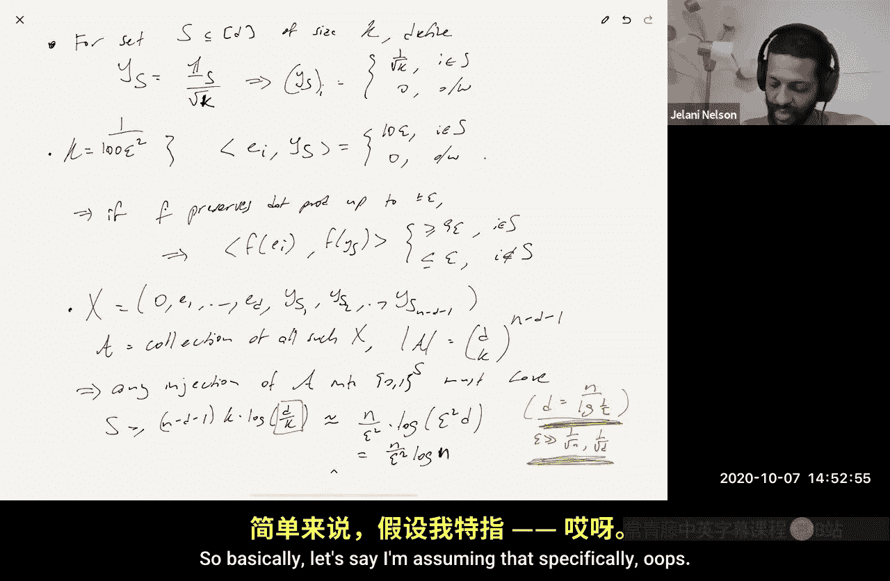
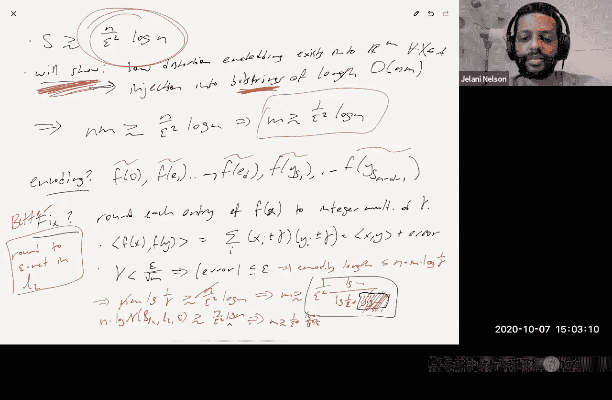

# 数据流算法：第11讲：Johnson-Lindenstrauss下界 🎯

在本节课中，我们将学习Johnson-Lindenstrauss引理的下界。我们将回顾其历史发展，理解证明下界的基本思想，并最终探讨如何证明一个与JL上界匹配的最优下界。

## 概述

Johnson-Lindenstrauss引理表明，任何n个点的集合都可以嵌入到O(ε⁻² log n)维的欧几里得空间中，同时保持任意两点间的距离在(1±ε)因子内。一个自然的问题是：这个上界是否是最优的？是否存在一个点集，使得任何低失真嵌入都必须使用至少Ω(ε⁻² log n)维的目标空间？本节课我们将证明答案是肯定的，JL引理确实是最优的。

## 历史回顾

首先，我们回顾一下关于JL下界的研究历史：

*   **1984年 (JL原始论文)**：证明了当ε小于某个常数（例如1/3）时，存在点集要求目标维度至少为Ω(log n)。这个论证对ε不敏感。
*   **2003年 (Noga Alon)**：证明了存在点集要求目标维度至少为Ω(ε⁻² log n / log(1/ε))。这几乎是最优的，但与JL上界相比，分母上多了一个log(1/ε)因子。
*   **2016年 (Kasper Green Larsen, Jelani Nelson等人)**：证明了对于**线性映射**，存在点集要求目标维度至少为Ω(ε⁻² log n)。这个下界仅针对线性嵌入。
*   **2017年 (Kasper Green Larsen, Jelani Nelson等人)**：证明了对于**任意映射**（包括非线性映射），存在点集要求目标维度至少为Ω(ε⁻² log n)。这是最终的最优下界。

我们将要学习的证明基于压缩论证，其核心思想是：假设一个大的点集族中的每一个点集都存在一个“优于JL”的低维嵌入，那么我们可以利用这些嵌入构造一个从大集合到小集合的单射，从而产生矛盾。

## 预备知识

在进入核心证明之前，我们需要了解一些凸几何和度量空间的基本概念。

### 凸体与范数

一个**凸体**是ℝᵈ中的一个紧致、凸且具有非空内部的子集。紧致在ℝᵈ中等价于闭且有界。

一个凸体K是**对称的**，如果x ∈ K意味着 -x ∈ K。对称凸体必然包含原点。

**关键事实**：对称凸体与范数一一对应。
*   给定一个范数||·||，其单位球{ x : ||x|| ≤ 1 }是一个对称凸体。
*   给定一个对称凸体K，可以定义一个范数：对于x ∈ ℝᵈ，||x||_K = inf { t > 0 : x/t ∈ K }。

### 覆盖数与熵数

设(X, d)是一个度量空间，T ⊆ X。T的一个**ε-网**是一个子集T‘ ⊆ T，使得对于T中的每一个点x，在T’中都存在一个点x‘满足d(x, x’) ≤ ε。

T的**熵数** N(T, d, ε) 是T的最小ε-网的大小。

### 填充数与体积论证

T的**填充数** P(T, d, ε) 是可以在T中放置的、半径为ε、两两不相交的球的最大数量（球心必须在T内）。

**关键关系**：对于任何度量空间，有 N(T, d, ε) ≤ P(T, d, ε/2)。证明思路是：取一个最大的半径为ε/2的填充，然后将这些球的中心作为ε-网的候选点。如果有点未被覆盖，则可以添加一个新的半径为ε/2的球，与最大性矛盾。

**体积论证**：如果我们在某个范数（例如ℓ₂范数）的单位球中进行填充，那么所有半径为ε/2的填充球都包含在一个半径为(1 + ε/2)的大球内。通过比较体积，我们可以得到填充数（从而熵数）的上界：
N(单位球, ||·||, ε) ≤ P(单位球, ||·||, ε/2) ≤ ( (1 + ε/2) / (ε/2) )^d = (1 + 2/ε)^d

## JL原始下界证明（1984）

原始JL论文中的下界证明是一个经典的体积论证。他们考虑的点集X由零向量和标准基向量组成：{0, e₁, e₂, ..., e_n}。假设存在一个嵌入f: X → ℝᵐ，失真为(1±ε)，且ε < 1/3。通过平移，可以假设f(0) = 0。

令ẽ_i = f(e_i)。根据失真条件，我们有：
*   ||ẽ_i|| ≈ 1 ± ε （因为d(e_i, 0)=1）
*   ||ẽ_i - ẽ_j|| ≥ (1 - ε)√2 （因为d(e_i, e_j)=√2）

现在考虑围绕每个ẽ_i、半径为 r = (1 - ε)√2 / 2 的球。由于任意两个ẽ_i之间的距离至少为2r，这些球是两两不相交的。同时，所有这些球都包含在一个以原点为中心、半径为 R‘ = 1 + ε + r 的大球内。

设V(r)和V(R‘)分别表示半径为r和R‘的m维球的体积。由于n个小球体积之和不能超过大球的体积，我们有：
n * V(r) ≤ V(R‘)
=> n ≤ V(R‘) / V(r) = (R‘ / r)^m
=> m ≥ log n / log(R‘/r)

由于当ε为常数时，R‘/r也是一个常数，因此我们得到 m = Ω(log n)。这个论证的局限性在于它对ε不敏感，无法得到ε⁻²的依赖关系。

## 最优下界证明思路（2017）

现在，我们转向证明最优下界Ω(ε⁻² log n)的核心思路。证明采用压缩论证法。

### 构造困难点集族

首先，我们构造一个庞大的点集族A。令d为原始维度，k = Θ(1/ε²)。对于任意一个大小为k的子集S ⊆ [d]，定义向量：
y_S = (1/√k) * 1_S （即，在S中下标处为1/√k，其余为0）

我们的点序列（允许重复）形式如下：
X = (0, e₁, e₂, ..., e_d, y_{S₁}, y_{S₂}, ..., y_{S_t})
其中 t = n - d - 1，n是总点数。

点集族A由所有这样的序列X构成，其中S₁, ..., S_t是[d]中所有可能的大小为k的子集。因此，族A的大小为：
|A| = (C(d, k))^t ≈ exp( t * k * log(d/k) )

我们假设d ≈ n / log(1/ε)，并且ε足够大（大于1/√n和1/√d），这使得 log(d/k) = Θ(log n)。因此，log|A| = Θ( t * k * log n ) = Θ( n/ε² * log n )。

### 关键观察：低失真嵌入近似保持内积

假设点集X包含0，且其他点具有单位ℓ₂范数。如果嵌入f: X → ℝᵐ具有(1±ε)失真，并且我们平移使得f(0)=0，那么f能近似保持任意两点间的内积。

**证明**：对于单位向量x, y ∈ X，有：
||x - y||² = ||x||² + ||y||² - 2⟨x, y⟩ = 2 - 2⟨x, y⟩
同时，由于失真，
||f(x) - f(y)||² = (1 ± ε) ||x - y||² = (1 ± ε)(2 - 2⟨x, y⟩)
另外，直接计算：
||f(x) - f(y)||² = ||f(x)||² + ||f(y)||² - 2⟨f(x), f(y)⟩ ≈ 2 - 2⟨f(x), f(y)⟩ （因为||f(x)|| ≈ 1 ± ε）
比较两式，可得 ⟨f(x), f(y)⟩ ≈ ⟨x, y⟩ ± O(ε)。

具体到我们的构造，对于e_i和y_S：
*   如果 i ∈ S，则 ⟨e_i, y_S⟩ = 1/√k = Θ(ε)
*   如果 i ∉ S，则 ⟨e_i, y_S⟩ = 0
因此，在嵌入后，⟨f(e_i), f(y_S)⟩ 在两种情况下会有明显的差距（例如≥ 8ε 与 ≤ 2ε），这使我们能够从嵌入向量中解码出集合S的信息。

### 压缩论证

**矛盾假设**：假设对于族A中的**每一个**点集X，都存在一个嵌入 f_X: X → ℝᵐ，失真为(1±ε)，且目标维度m远小于c ε⁻² log n（c为某个小常数）。

**目标**：利用这些嵌入{f_X}，构造一个从大族A到一个小集合的单射，从而产生矛盾。

**初步尝试（有问题）**：对于每个X ∈ A，其编码就是所有嵌入向量的列表：`Enc(X) = (f_X(0), f_X(e₁), ..., f_X(e_d), f_X(y_{S₁}), ..., f_X(y_{S_t}))`。这是一个长度为n的序列，每个元素是ℝᵐ中的一个向量。根据关键观察，我们可以从这些向量的内积中恢复出所有的S_j，从而唯一确定X。然而，这个编码的问题是：每个向量f_X(·)有m个实数坐标，需要无限精度存储，编码长度并非有限比特。

**第一次改进（量化）**：将每个嵌入向量的每个坐标四舍五入到最接近的γ的整数倍，其中γ是一个非常小的数（例如 γ = ε/√n）。可以证明，只要γ足够小，量化后的向量˜f_X(·)之间的内积仍然能保持足够差距，以区分 i ∈ S 和 i ∉ S。现在，每个坐标只有O(1/γ)种可能取值，因此整个编码可以用大约 `n * m * log(1/γ)` 比特来表示。这给出了一个有限比特的编码。

通过信息论论证，编码长度必须至少为log|A| = Θ( n/ε² * log n )。因此：
n * m * log(1/γ) ≥ Θ( n/ε² * log n )
=> m ≥ Θ( log n / (ε² log(1/γ) ) )
代入 γ = ε/√n，得到 m ≥ Θ( ε⁻² log n / (log(1/ε) + log log n) )。这接近但略弱于Noga Alon的下界。

**第二次改进（使用ℓ₂网）**：第一次改进本质上是使用了ℓ∞范数下的γ-网。更好的方法是使用ℓ₂范数下的ε-网。我们知道所有嵌入向量f_X(·)的范数大约为1，因此它们都位于某个ℓ₂球内。我们取该球的一个最小ε-网。对于每个嵌入向量，我们存储它在网中最近点的索引。

存储一个索引需要的比特数是网的大小的对数，即熵数的对数。根据之前的体积论证，对于m维ℓ₂球，熵数 N ≤ (1 + 2/ε)^m。因此，存储所有n个向量的网索引所需的总比特数约为 `n * log N ≤ n * m * log(1/ε)`。

再次应用信息论下界：
n * m * log(1/ε) ≥ Θ( n/ε² * log n )
=> m ≥ Θ( ε⁻² * (log n / log(1/ε)) )
这正是Noga Alon在2003年证明的下界。

**最终改进（达到最优）**：为了去除分母上的log(1/ε)因子，达到Ω(ε⁻² log n)的最优下界，需要更精巧的构造。核心思想是使用一个更高效的“编码簿”，它不是简单地存储整个ε-网，而是利用嵌入向量之间的相关性进行联合编码。具体细节涉及更复杂的概率方法，但其基本精神仍然源于压缩论证。

## 总结

本节课我们一起学习了Johnson-Lindenstrauss引理的下界。我们从历史发展入手，理解了证明下界的核心工具——体积论证和压缩论证。我们详细剖析了JL原始下界证明，并学习了如何通过构造一个庞大的困难点集族，并假设它们都存在“好”的嵌入，进而利用压缩论证推导出维度下界。我们看到了如何从简单的量化想法出发，逐步优化到使用覆盖网，最终触及最优下界的证明思路。这个证明过程展示了理论计算机科学中一种强大而优美的证明范式。