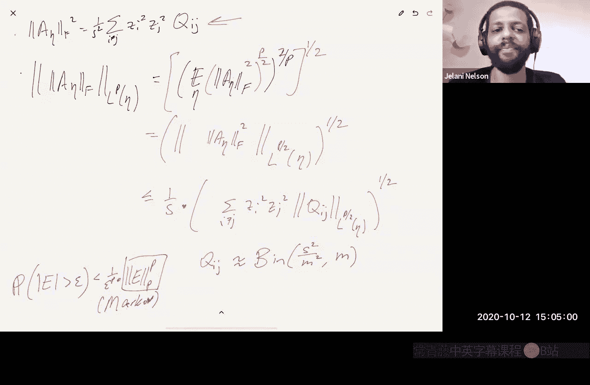

# 数据流算法：12：Johnson-Lindenstrauss下界总结与稀疏Johnson-Lindenstrauss变换 🎯

在本节课中，我们将完成Johnson-Lindenstrauss（JL）最优下界的证明，并探讨如何加速实际的JL嵌入过程，特别是介绍稀疏Johnson-Lindenstrauss变换（SJLT）。

## Johnson-Lindenstrauss下界证明总结 📊

上一节我们介绍了JL下界证明的核心思路。本节中，我们来详细完成这个证明。

证明的组织方式不是针对单个点集，而是针对一个点集集合。我们将证明，如果该集合中的**每一个**点集都能以低失真嵌入到低维空间，那么就会存在一个从该点集集合到一个小集合的**单射**，从而产生矛盾。

### 点集集合的构造

我们构造的集合包含有序的点序列。每个序列由以下向量组成：
*   零向量 `0`。
*   `d` 个标准基向量 `e_i`（第 `i` 个位置为1，其余为0）。
*   `n - d - 1` 个向量 `y_S1, y_S2, ..., y_S(n-d-1)`。

其中，`y_S` 是集合 `S` 的指示向量，经过缩放使其具有单位L2范数。集合 `S` 的大小 `k = 1/(100ε²)`。指示向量 `y_S` 在位置 `i`（若 `i ∈ S`）的值为 `1/√k`（即 `10ε`），否则为0。

可能的点序列总数是 `(C(d, k))^(n-d-1)`，其对数约为 `n log n`（假设 `d` 约为 `n / log(1/ε)`，稍后我们将说明如何移除这个假设）。

### 覆盖数与熵数

我们回顾了覆盖数（或称熵数）的概念。对于任何范数的单位球，在其自身范数下构造一个 `ε`-网，所需网点的数量最多约为 `(1/ε)^d`，其中 `d` 是维度。

### 证明的核心：构造单射

我们假设集合 `X` 中的每个点集 `X` 都存在一个低失真嵌入 `f_X`（映射到 `m` 维），使得应用 `f` 后，`X` 内所有点对的内积在加性误差 `ε` 内被保持。

如果 `f` 映射到维度 `m`，我们的目标是证明：这种 `f` 对集合中每个点集都存在的事实，意味着存在一个从该点集集合到位串（长度为 `O(nm)`）的单射。这蕴含着 `O(nm) = Ω(nk log n)`，从而推出 `m = Ω(k log n)`。代入 `k ≈ 1/ε²`，即得到下界 `m = Ω((log n)/ε²)`。

现在的问题是：这个单射是什么？

**方法一（离散化坐标）**：
嵌入后的向量 `f(0), f(e1), ..., f(ed), f(y_S1), ...` 是 `m` 维向量，其各分量值在 `[-1, 1]` 区间内。我们将区间 `[-1, 1]` 离散化为步长为 `γ`（例如0.01）的网格点，并将每个向量分量四舍五入到最近的网格点。

关键在于，即使经过四舍五入，我们仍然能从这些近似向量中恢复出原始点集的信息。因为原始内积 `e_i · y_Sj` 要么约为 `10ε`（若 `i ∈ S_j`），要么为0。经过嵌入和四舍五入后，近似内积要么至少为 `8ε`，要么至多为 `2ε`，仍然存在可区分的间隙。通过选择 `γ ≈ ε/√m`，可以控制舍入误差。

然而，这种方法最终会推导出 `m = Ω((log n)/(ε² log(1/ε)))`，分母中多了一个 `log(1/ε)` 因子，并非最优。

**方法二（使用L2网）**：
我们不进行逐坐标的舍入，而是将每个嵌入后的向量 `f(x)` 舍入到其在一个L2范数 `ε`-网中的最近点 `f̃(x)`。可以证明，即使使用舍入后的向量计算内积，其误差仍然在 `O(ε)` 内，因此仍然可以区分原始的内积模式。

一个L2球的 `ε`-网大小约为 `(1/ε)^m`。因此，指定一个网点需要 `O(m log(1/ε))` 比特。对于 `n` 个向量，总比特长度为 `O(nm log(1/ε))`。这必须至少为 `Ω(nk log n)`，从而推出 `m = Ω((log n)/(ε² log(1/ε)))`。这仍然是次优的。

**方法三（利用凸几何达到最优下界）**：
为了消除分母上的 `log(1/ε)` 因子，我们需要更精细的论证。关键思想是利用对称凸体。

1.  **定义子空间和凸体**：
    令矩阵 `A` 的行由 `f̃(e1)^T, ..., f̃(ed)^T` 构成（`d` 行，`m` 列）。定义子空间 `E` 为 `A` 的列空间（`E ⊆ R^d`，维数至多为 `m`）。然后定义对称凸体 `K = E ∩ B_∞^d(12ε)`，即子空间 `E` 与边长为 `24ε` 的 `L∞` 立方体的交集。`K` 是一个维数至多为 `m` 的对称凸体。

2.  **关键观察**：
    对于每个 `j`，向量 `v_j = A * f̃(y_Sj)` 位于 `K` 中。我们不需要精确知道 `v_j`，只需要知道一个近似值 `ṽ_j`，使得 `||v_j - ṽ_j||_∞ ≤ ε`，就能判断 `i` 是否属于 `S_j`。

3.  **在凸体范数下取网**：
    我们不在整个 `R^d` 的 `L∞` 范数下取网，而是在凸体 `K` 自身的范数下取一个 `(1/12)`-网 `K'`。根据凸几何知识，覆盖一个凸体在其自身范数下所需的网点数约为 `(1/ε)^(dim(K)) ≈ (12)^m`。

4.  **比特复杂度**：
    因此，指定 `K'` 中的一个网点只需要 `O(m)` 比特（因为 `log(12^m) = O(m)`）。对于 `n` 个 `v_j`，总比特复杂度为 `O(nm)`。为了解码，编码器还需要额外写出矩阵 `A`（用于定义子空间 `E` 和凸体 `K`）。`A` 有 `d` 行，每行是 `m` 维L2网中的一个点，需要 `O(m log(1/ε))` 比特。通过设定 `d = n / log(1/ε)`，这部分的总比特数也是 `O(nm)`。

5.  **得到最终下界**：
    因此，整个编码的总比特长度为 `O(nm)`。这必须至少为 `Ω(nk log n)`。代入 `k ≈ 1/ε²` 并消去 `n`，我们得到最终的最优下界：
    **`m = Ω((log n)/ε²)`**

**关于维度 `d` 的假设**：
我们之前假设了 `d ≈ n / log(1/ε)`。如果 `d` 更大，我们可以对困难的点集补零，不影响其难度。如果 `d` 更小（小于 `Ω(1/ε²)`），那么恒等映射本身就是无失真的JL嵌入，下界自然不成立。因此，我们的下界在参数范围内是最优的。

## 加速Johnson-Lindenstrauss嵌入 ⚡

原始的JL变换（1984年）使用随机投影，即投影到一个随机选取的 `m` 维子空间。实现方式通常是生成一个稠密的 `m × d` 随机矩阵（例如通过Gram-Schmidt正交化一组随机高斯向量）。矩阵向量乘法的时间复杂度为 `O(md)`。如果 `d` 很大，这个预处理步骤本身可能就很耗时。

因此，一个自然的问题是：能否在保持JL保证的前提下，使用更快的嵌入方法？

### 发展历程

1.  **Achlioptas (2001)**： 提出了第一个稀疏化方法。他构造的矩阵中，每个条目以 `1/3` 的概率为 `±1`，以 `2/3` 的概率为0。这样，矩阵在期望下有 `2/3` 的零元，同时保持了与稠密随机投影相同的目标维度 `m`（常数因子相同），将计算时间减少了约 `1/3`。

2.  **Ailon & Chazelle (2006) - 快速JL变换 (FJLT)**： 首次给出了渐近意义上的改进。FJLT将映射 `z → Πz` 的时间复杂度降至 `O(d log d + m³)`。其思想是，对于一般向量 `z`，先用一个随机矩阵（如傅里叶变换矩阵）将其“搅散”，使其质量均匀分布，然后再应用一个稀疏的采样矩阵。然而，如果原始向量 `z` 本身是稀疏的，FJLT的预处理步骤反而可能增加计算量。

3.  **稀疏Johnson-Lindenstrauss变换 (SJLT)**： 为了利用输入向量的稀疏性，Dasgupta, Kumar & Charikar (2010) 以及后续Kane & Nelson的工作提出了SJLT。他们证明，可以使用**CountSketch**矩阵作为JL变换矩阵。

### 稀疏JL变换 (SJLT) 与分析

**SJLT构造**：
变换矩阵 `Π` 是一个 `m × d` 的矩阵，其每一列有恰好 `s` 个非零元（`s` 是一个参数）。具体来说，可以将行分成 `s` 个块，在每个块中，每一列有且仅有一个随机位置的 `±1` 值，其余为0。这正是**CountSketch**矩阵的结构。

**性能**：
可以证明，当 `s = O(1/ε)` 且目标维度 `m = O((log(1/δ))/ε²)` 时，SJLT能以至少 `1-δ` 的概率满足JL引理要求。计算 `Πz` 的时间复杂度为 `O(nnz(z) * s) = O(nnz(z)/ε)`，其中 `nnz(z)` 是 `z` 的非零元个数。这比稠密矩阵的 `O(md)` 快得多，尤其适用于稀疏向量。

**下界**：
存在点集使得任何能成功嵌入它们的稀疏矩阵，其每列的非零元个数必须至少为 `Ω((log n)/(ε log(1/ε)))`。这表明SJLT在稀疏性上几乎是最优的（仅差一个 `log(1/ε)` 因子）。

### SJLT的分析概要（基于矩方法）

我们想证明，对于单位向量 `z`（`||z||_2 = 1`），随机变量 `E = ||Πz||_2² - 1` 以高概率很小。

1.  **误差表达式**：
    将矩阵 `Π` 的条目写为 `Π_{r,i} = (1/√s) * η_{r,i} * σ_{r,i}`，其中 `σ_{r,i}` 是随机 `±1` 符号，`η_{r,i}` 是指示该位置是否为非零的 `0/1` 随机变量（满足每列恰有 `s` 个1）。通过展开 `||Πz||_2²` 并减去1，可以发现误差 `E` 可以写为二次型：
    `E = (1/s) * Σ_{r} Σ_{i≠j} η_{r,i} η_{r,j} σ_{r,i} σ_{r,j} z_i z_j`
    这可以进一步写成 `E = σ^T A_η σ`，其中 `σ` 是所有 `σ_{r,i}` 拼接成的向量，`A_η` 是一个依赖于 `η` 和 `z` 的块对角矩阵。

2.  **应用Hanson-Wright不等式**：
    我们对随机变量 `σ` 应用Hanson-Wright不等式。该不等式指出，对于 `σ` 这样的Rademacher向量和矩阵 `A`，其二次型的 `L_p` 范数有上界：
    `||σ^T A σ||_p ≤ C ( √p * ||A||_F + p * ||A||_{op} )`
    其中 `||A||_F` 是Frobenius范数，`||A||_{op}` 是算子范数。

3.  **控制范数**：
    *   **算子范数**： 由于 `A_η` 是块对角矩阵，其算子范数是各块算子范数的最大值。可以证明每个块的算子范数 `≤ 2/s`，因此 `||A_η||_{op} ≤ 2/s`。
    *   **Frobenius范数**： `||A_η||_F² = (1/s²) Σ_{i≠j} z_i² z_j² Q_{ij}`，其中 `Q_{ij} = Σ_r η_{r,i} η_{r,j}` 是第 `i` 列和第 `j` 列的非零元共同出现的行数。`Q_{ij}` 近似服从参数为 `(M, s²/M²)` 的二项分布（虽然不是完全独立）。通过计算其矩，可以 bound 住 `||A_η||_F` 的期望。

4.  **得到尾界**：
    将算子范数和Frobenius范数的界代入Hanson-Wright不等式，得到 `E` 的 `L_p` 范数上界。最后，通过马尔可夫不等式（`Pr[|E| > ε] ≤ (||E||_p / ε)^p`），并选择合适的 `p`，即可证明 `Pr[|E| > ε] ≤ δ`，从而完成SJLT的分析。

## 总结 🎓

本节课中，我们一起学习了：
1.  **JL下界的最优证明**：通过构造一个点集家族，并利用覆盖数/熵数以及凸几何中对称凸体的性质，我们证明了任何JL嵌入的目标维度必须至少为 `Ω((log n)/ε²)`，这个下界是紧的。
2.  **稀疏Johnson-Lindenstrauss变换 (SJLT)**：为了加速嵌入计算，特别是对于稀疏数据，我们可以使用像CountSketch这样的稀疏随机矩阵。SJLT在几乎保持最优目标维度的同时，将嵌入时间复杂度从 `O(md)` 降到了 `O(nnz(z)/ε)`，并且被证明在稀疏性上几乎是最优的。其分析核心是使用矩方法和Hanson-Wright不等式来控制误差。