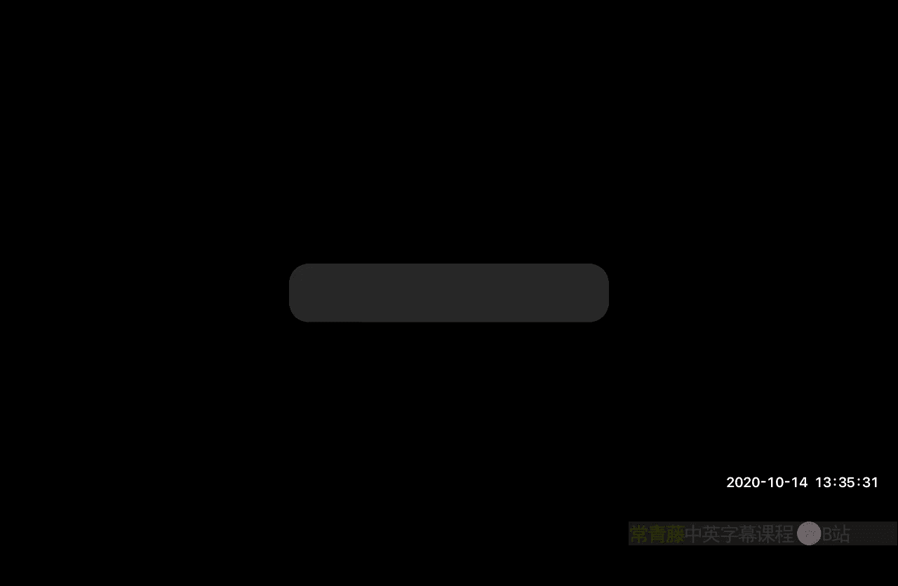
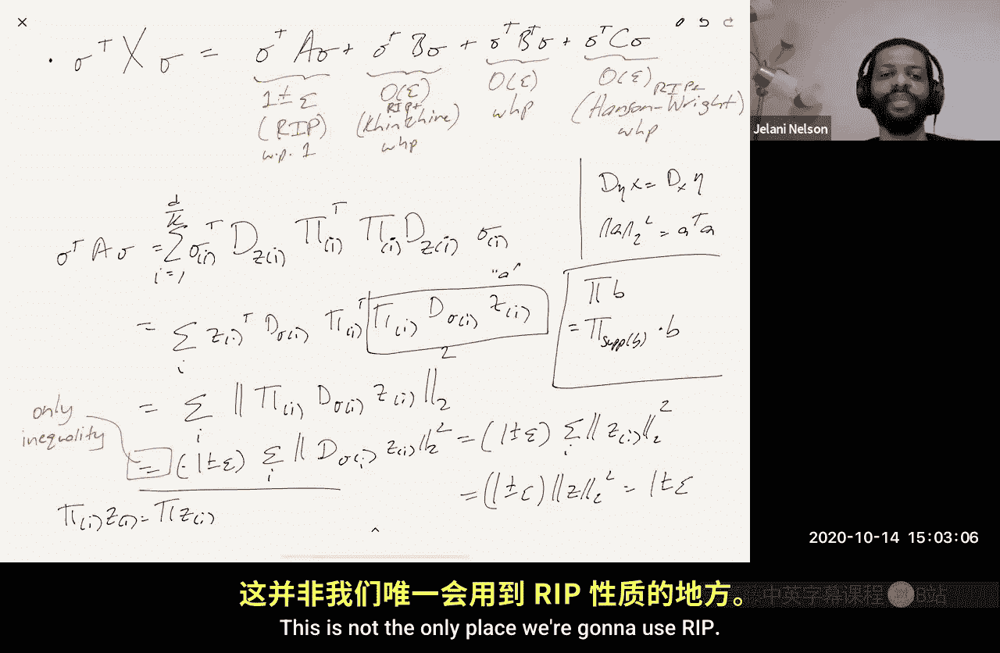

# 加州大学伯克利分校【中英⚡数据流算法｜CS294 Fall 2020, Sketching Algorithms】 p13 P13 Fast Johnson-Lindenstrauss Transform, Krahmer-Ward theorem -BV11zi7BjEHu_p13-

嗯。

So last lecture we talked about how to speed up the Johnson Lutro dilemma by making the matrix pi。

 the embedding matrix sparse。Um that's actually the second way people thought to speed up jail or the second way people got。

 you know， asymptotic improvements to embedding speed up。

The original way was actually something called the Fast Johnsonlinous Str transform。

That was originally introduced and analyzed by Ilo and Chazeelle in a paper in 2006。

So today I'm going to tell you about their FjLT， the Fast Johnson sales transformform。

 and I'm going to show you the original analysis。And many years after that。

 there was another paper by Kraman Ward， who gave just a totally different way of thinking about why constructions like the FJLT works。

And it gives different bounds， so I'm going to show you that as well。

they use ideas from an area called compressed sensing。

You've seen a little bit of compressed sensing and that it's related to the heavy hitters problem。

But we're going to talk more about compressed sensing later in the semester， okay。And again。

 just a reminder， PSet one is due Friday the day after tomorrow， and I moved my office hours。

 I hope you' all get the email， I moved it from Friday to tomorrow。

So that people have more than 12 hours to digest。what they heard in office hours and go back and work on their PSet。

And another thing to keep in mind also is the project proposal， so that is due soon。

And a couple like I don't remember the exact date is it October 28th。

s it's on the website on the syllabus。So just take a look at that actually there's a project page on the website so take a look at that for the you know what's expected of you and if you have questions before you submit your proposal come to office hours。

 talk to me about it or if you can't make office hours send me an email and we can schedule another time。

Okay， great， so let's get to it and let's start talking about the fast Johnson low stress transform。

So before， I mean on Monday we talked about making pie sparse right so remember for us you know with linear beddings。

We've been looking at embeddings where some vector Z gets mapped to PisZ。And。monday。

We made Pi sparse。And if it's very sparse， then you get faster embedding time。Today。

Today I said we're going to look at the FjLT。And the basic idea is to use sampling。

What do I mean by that， tell you matrix S。Which looks as follows。

It has D columns where D is the dimension of the original vector， and it's mapping down to MRs。

And if you look at each row。It just has a one。In a random location and the rest of the row is zero。

And every row is like that independently。Okay， so you know what is S times z。

 S times z is just taking， you know， IID uniform samples from the vector Z and putting those samples in a new vector。

 which is S。Okay。Now。嗯。You know， if you look at any。If you look at any one of the entries。

 like if you look at SZ。SZR。Look at the art entry of SC。And ask yourself like。

 what is the expectation of the square of that？That's equal to right the sum I goes from1 to D。

 the probability that we sample I。Times Z squared。And if we're doing uniform sampling。

 then the probability that we sample I。Is whatever D。系い。So this is equal to。嗯。

Now this is equal to basically。L two norm squared。Divided by D。So if we do so therefore。

 this implies that the expectation of Sz。Litude norm squared， well。

 that's just equal by linearity of expectation to the sum over R from1 to M of the expectation of Sz R squared。

 which we know now is m over d times L2 norm squared of z。谁？😊，So good， why don't we then set？

Pi to be something like the square root of d over M。Times。嗯。Times S。That implies that。

The expectation of Sz。Elson norm squared is theelsson norm squared。系。

And now like this pie is super duper sparse， right？

If you look at the construction of the sparse stoneil instr transform。

Even if you chose little S to be one in the SJLT， meaning every column is exactly one non zero。

Then the total number of nonzes in your matrix pi would be D because there are D columns each one has one nonze so d non zeros and pi This thing only has m nonzes and pi it only has one nonzero per row。

 not one nonzero per column and the number of rows is way。

 way less than the number of columns so this is even sparser than the SJLT so that's great right this is really fast I mean how long does it take me to sample and entries takes me about M time。

Okay， so， you know， this is like an O of M time algorithm to do the embedding。

And it's giving us what we want an expectation what's the problem， the problem is that。😡。

The target dimension， the dimension that you're embedding in is equal to the number of samples you take。

And if Z is a vector that's not very well spread， let's imagine， for example。

 Z has a y in its first entry and zeros everywhere else。

Then you're going to need to take a lot of samples to even see that one。😡，In expectation。

 you're going to need to take d samples to see that one。Which means that M needs to be at least D。😡。

Right if you want to get any kind of concentration， so basically the problem is that the yes。

 this is an unbiased。😡，Estimator， but the variance is way too large。😡，Not for all Z。

 but if Z happens to be sparse， then the variance is large。

So I learned Chizelle's idea was to do something to Z。

 so you're not just going to multiply oh and sorry， I shouldnt。

 this have been should not have been an asked， this should have been a pie。

So I learned Czeelle's idea was。To pre multiply Z by another matrix， let's call it matrix A。

Such that let's say A Z has the same norm as Z with probability one。

 so a is like some kind of rotation。It's an orthogonal matrix。

 but it's a randomized matrix such that with very high probability。AZ is a very well spread vector。

 it doesn't have all its mass in one coordinate or even it doesn't have most of its mass concentrated in a few coordinates。

 the mass is kind of equally spread amongst all the coordinates。And for some definition of spread。

If that were the case， then as we're going to see soon， you can prove that sampling works。

You can get away with few samples， small M， okay？So thats that's the name of their game is how do you figure out。

 how do you come up with this kind of randomized preconditioner A。That spreads the mass around。Okay。

And I'm not a physicist， so I'm not let me not say too much because I'm you I don't actually know what I'm talking about right now。

 but I do know that in quantum mechanics， there is this thing called the uncertainty principle。

And it's the thing that they claim also motivated them in their approach that I'm going to tell you right now。

What is the uncertainty principle， okay， so mathematically what it says that it's useful for us is a vector and its Fourier transform。

 let's say it's discrete Fourier transform。😊，Cannot both？

Be simultaneously concentrated in very few coordinates。You know。

 if one is very concentrated in a few coordinates， then its Fourier transform has to be well spread。

And the nice thing is you know the discrete forier transform。

 it's a matrix and it is an orthogonal matrix， so whatever your vector was。😊，First。

 apply the DFT to it。Now you have， you know。You still have the same norm that you used to have。

 and if you're originally sparse， now you're well spread and then sampling works。Okay。

 so that was their idea。Okay， but you know， any guesses as to what's what could be wrong with that approach？

If you just， let's say that I wanted my new pie is going to be basically。

Some scaling times S times the DftT matrix。So what's wrong with that？

And maybe not everybody is so familiar with the Fourier transport， let me just say one hint。

 it'll be dense。Well what will the ends the DFT will be a large matrix， right？

That's true the DftT itself is a large dense matrix， however， is there is an algorithm。

Called the fast Fourier transform， which says given any vector Z。

 I can multiply the Dft times Z in like nearly linear time。

So that's another nice thing about the DFT is that it has a fast algorithm it's not just some random big matrix it's a structured matrix and it's structured enough that there's a very fast algorithm to multiply by it so let me just tell you okay if you don't know much about the DFT I'll just say one fact about it that kind of using this fact alone you can see why there's a problem I'll just tell you that if you take the DFT of the DFT so take Z take its DFT then take the DFT of that so basically applying the square of the matrix to that。

You get back the original vector。So knowing that what's the problem so if z are like the rows of the DftT matrix then the columns of the DftT matrix then right so right so in particular it compresses other vectors yeah so it takes so it takes a sparse vector and spreads it out that's great but at the same time it takes certain dense vectors and sparsifies them。

So your original Z could have been super dense， it could have had all its mass equally spread。

 just as you say， it could have been a row of the DFT matrix itself。😊。

Now you apply the DftT to it and you you've ruined that you've ruined that spread you've all of a sudden turned it into like。

The one comma 00，0，0 vector。Isn's not true for any rotation， though。I mean。

 yes so that is true for any but yes， so if you take any fixed rotation。

 then yes something is going to have to get rotated to be 10000， however。

 this is where we introduce randomness right so instead of doing instead of doing the you know the DFT or some other fixed rotation。

 we're going to do some kind of random rotation。😊，And we're going to do a random rotation that we still want it to be fast。

But it should it should with high probability for any vector spread the mass around。

 so that's a good point because you could just say， well。

 why don't I just pick a uniformly random rotation？

You can prove that a uniformly random rotation does spread the mass around。

The problem with the uniformly random rotation is exact I mean that was the original jail map right and the problem with it is that it's slow。

 we don't want to use uniformly random rotation is too slow。

A professor yeah so why don't we care about the fact that we're like mapping into complex numbers because I mean probably doesn't matter because like a complex like it's like a just like twice as many data points I' storing but like I mean Ja Lena stated as a map into real numbers right Yeah but if so if you map into complex you can just map into real by doubling the dimension just like imagine just if you have a plus IB you just have treat it as a two dimensional vector A at K comm B so you can implement it as a you can implement everything over the realels。

I see also the next thing i'm going to say is in fact。

 you can avoid the DftT matrix entirely and use something that is real like the hadamard transform so let me first let me just say something so definition。

😊，And let's say， and I'm normalized。You know。Boed。Orth theormal system。Is a matrix？

Q such that one Q transpose Q or let's say it should be， you know， if it's complex。

Then you put a star here， I guess， which means conjugate transpose。Is equal to。

 let's say D times the identity。And you know Q is D byD。And also。

The max over all IJ of QIJ in magnitude is at most one。So examples。One would be like。You know。

 the unormalized DFT。So let's say F of。JK is equal to e to the minus。嗯。You need the minus， I guess。

2 pi I。JK or I is square to minus1 just so that there's no confusion。Right。

Normally if you want it to be orthogonal you would have to divide by root D but the unormalized version I don't divide so this this does satisfy that Q starq is d times the identity。

😡，嗯。And fact also。いや。😊，All the entries are exactly one in magnitude。😊。

Another example is the Hadamama transform， the unormalized magidrate。

malized I guess unormalized hadamama。So there you know there's a recursive definition and there's also another definition as well。

 but me give you the let me give you the recursive definition， which is。

So I can actually let me first define。So let's say here， D is equal to 2 to the R。

 so it's a 2 to the R by 2 to the R matrix。So when R is zero。

It's a one by one matrix and it's just the matrix one。And when r is greater than zero。

 it's the matrix that looks like this。You take， let's put it here HR minus1。HR minus1。

 h r minus1 and then negative hr minus1。唔。Maybe in an exercise。

 if you treat the indices as being zero based so that you run from zero up to d minus1。

 then you can show that HJK is equal to minus1 to the， I'll call it JVc。 of KV。

So what do I mean by that？What I mean is。So J is a number between0 and2 to the r minus1。

So you can view it as an Rbit number。😡，And K is a number between 0 and  two to the R minus1。

 so you can view it as an orbit number。So now treat these。

So these R bits treat them as actually being an R dimensional vector。😡，Okay。

 so it's an artificialal vector where each entry is either zero or one。

And then take the dot product of these two artal vectors。

And it's either going to be even or odd the dot product is either going to be even or odd so minus one to an even number is one minus one to an odd number is minus1 so hJK is equal to this okay you see can you can prove this just via the recursive definition okay。

True by induction。So these are two examples， the DFT and both of these examples are nice in that you can multiply by them very quickly。

This you can do multiply by。In O of D log D。This is the algorithm known as the fast Fourier transform。

And then this had already can multiply also in D by D。And this is。

 I'm not let me not go through it here， but this is a very kind of simple divide and conquer algorithm。

I'll let you think about that offline if you want。Okay。So good。

So now this is going to be the name of the game， so the FJLT。Pi is going to equal。嗯。

1 over square root M。S。诶。H。And then I'll call this D D Eta。He， shall I call it theta。Sure， why on。

Okay， so here this is H is any a normalizedized bounded orthoormal system。

Like the unnormalized Hadamard or the unnormalized discrete Fourier transform。As is sampling。

And then D Eta is a diagonal matrix。That's random， so E to 1， Eta 2 up to A to D。

And then zero is on the off diagonal where a to I is like plus minus one。So it's uniform。

 it's what plus one and probability a half minus1 and probably a half。

 it's what's called Rama random variable。Okay。😊，And the idea is that the original echelle idea was take any fixed vector Z。

With high probability， so first of all， just think about what this does。

 what does D do when you apply it to Z， it possibly changes the signs of the entries of Z。😡。

So you flip the sign of each entry with 50，50 probability。是。If is ata i is1。

 you keep the sign the same if ata I is minus 1， you change the sign。

Then after you do this random sign flipping， they call it a phase transition， I think。

 borrowing language from physics。But after you do this random sign flipping。

Then you apply your bounded orthonormal system like Haammar or discrete Fourier transform。

 as you're going to see from the proof， it doesn't really matter which one you do。

That's going to have the property that with high probability probability over the choice of Ada。😡。

H times D Eta applied to Z has very small infinity norm compared to its L2 norm。Okay。

 so like what does a， imagine that it's a unit norm vector？What is the worst case。

 the worst case is that sumit tree is one that the Elfiny norm is one， like all your mass。

 remember your L2 mass is one， all your L2 masses in one coordinate。😡。

The best case is like perfect spread， that means that all your entries are one over root D in magnitude。

😡，Or if we're doing the unormalized version， remember now， this is the unormalized H。😡。

So since it's unnormalized， it does blow up， you know it does blow up the L2 norm by a factor of root D。

So the worst case is， then you have a， when you apply H， the worst case is。

There's some entry in the vector that's root D。The best case is that all the entries in the vector after you play H are at most one in magnitude。

You said it seems sort of related to shuffling a deck of cards I mean yeah I don't know， I guess。

That's some discrete movement， this is some kind of rotation， but yeah I don't know。Yeah。

 well I was just thinking earlier potentially that a rotation could have been like a series of given rotations that just like corrects some coordinates。

 I don't know， it was just an idle thought。Givenive is that a given rotation does that mean two by two rotation Yeah。

 yeah， you take the two by two rotation rotation as some sub matrix I see yeah。

 so actually that's a good so I should say that the original the original Ion Chazelle paper actually suggested。

Exactly that as a different approach， which is。Just let pi be the like the product of some number of two by two rotations so what you like each step what you're going to do is you're going to pick two random coordinates and you're going to apply some two random two by two rotation to them then you're going to pick another two coordinates apply two by two rotation and just do this a bunch of times do it like you know D times or D polylogue D times。

😡，And then try to show that， you know， with high probability after you do this。

If you then just project onto the to the first you know m coordinates。

 it's going to preserve the norm with high probability after scaling so you know show that basically this this kind of random process。

😡，Very quickly spreads the mass around evenly， or you know。

 you don't even need that just moves the mass of the first M coordinates。Right， yeah。

 so they actually made that conjecture and it was， I believe resolved。嗯。In some form。

 I don't know if it was result I don't know exact the bounds they got were exactly the best one could hope for。

But there was a paper by。Let me see， I think。Vish， Jane， Natash Pai and。诶。And at least。Oh。

 there are some others as well。Yeah， the okay so yeah I put it chat Jane Nash Pai Ashman saw Meto Sony and Aaron Smith is that yeah I actually know all those people yeah I know them okay so so that's the paper。

And they actually analyze exactly that。Yes。Right but yeah， so that came later。

 but Ion Celle just did it this way。And。🤧。😊，So let's try to understand now what why this。

Why this works？hy don we normalize。Why don't we normalize？Yeah。

 I is the distance was still like stay the same I mean， yeah， you could， you could。

 you could make H B normalized。If it's if age is normalized。

 I mean that doesn't really change anything， all that changes instead of one of a root M。

 you should make it root D over them。So I mean the question is like are you going to push the are you going to divide H by root D or are you just going to divide by root D at the end so you know it it' it doesn't really change much so i'm just pretending that it's unnormalized and then this root D becomes a one。

I thought we would usually want over。no。Okay， so I mean maybe just I don't know if this helps the confusion if you remember before what I said was you know I said that you if you if you look at the expectation of。

Root d over MS Z L2 norm squared， this is equal to zl2 norm squared， right？Okay， okay。

 we said that we said that on the previous slide， that's basically， you know here。Yeah。So pi is this。

And then I said this。Okay。😊，So so H， you know just the vector H itself doesn't change norms right H is an orthoal yeah okay。

 it's yeah good so you know let's just say if H bar is like the normalized version。

That implies that you know， expectation of。over H bar is the Ltum squared is also the Etum squared。

But you know just I can just like cancel this。I can just cancel this D with the bar yeah。

 so that's belly I did。Okay， so let's analyze this thing。So claims from now on。Z has norm one。

 because if it works for you vectors， it works very vector。So the claim。嗯。The probability。

 I think so。So the so for us， let's do a reminder over here reminder there's something called。

Did your audio cut out？So以 Glanni， your audio could。Is this video also frozen？

I also don't think you can hear us his video is good for me。How videos work。

It's me as well his video on his iPad is working， but his actual video is not。I am in the iPad Zone。

I guess， I guess he。You it's me。Can people hear me， yes？Testing， testing。I， I can hear you。Testing。

 testing。Can people hear me？I can hear you Okay sorry I don't know what happened my computer my laptop just decided to boot me from zoom but i'm back so reminder about Kinch's inequality that was from a few lectures ago it's a tail bound for like linear forms with with plus minus1 random variables right this was saying that if you take x dot sigma it decays at least as fast as G dots x dot g where G's a Gaussian。

So what kind of decay is that？That's basically at most。So they like2 e to the minus。

Lambda squared over two times the norm squared of x。So this is called tensions inequality。

So we're going to use that。So claim。The probability。Over Ada。That。If you look at。H D。

 Eta Z L infinity arm， the that it's bigger than something。Is that most delta over two？

And we'll fill into something as we do the calculation。Let's prove it。So let's at let's look at。

H D Eta Z I for some I， so H D eta Z， the ifF entry。Is equal to。The sum J goes from1 to D of。H I J。

 Ata J， Z J。Right。Which I can view as。I mean maybe to be suggestive， I can view this as。

Some over J of。HIJ ZJ。Times a to J。Right， so this。This is basically a dot product with a random sign vector。

 so there there's one vector that has HJ ZJ as its entries。

And then the other vector has the Eta is Eta， okay？So this implies that。The probability that。HD。

Ata Z I is bigger than lambda。is less than2 e to the minus lambda squared over two times the norm squared of this vector。

Right so what is the norm squared of this， so if you just focus on this part。

It's like the sum of Hj squared to Zj squared。Right， which again。

 because all the entries of H have magnitude at most one， this is at most。Z squared？Which is one。

 right？So that's it， so there's times one here， so that doesn't matter。O。So good。

 so you if I'm aiming for failure probability， so what do I want here。

 I want my failure probability to be less than deelta over 2D。😡。

Because I'm going to union bound over all I， there are D choices of I。😡。

So that tells me now how I should set Lambda。If I want lambda squared over two to be equal to the lawn of。

 let's say。2D over Delta。That implies that the right thing to do is to set。Oh。

 and also don't forget that I have to kill， I should actually make this。40。

Because I want to kill this too also。So so anyway， yeah。

 so basically set Lambda to be the square root of two lawn 4D over Dlta。

So that's what we're going to do here。So then this becomes less than or equal to delta over 2D。

By that choice of lambmbda。So by union bound over all I， it's at most Dta number two。

So this becomes square root of2 long。For dear Raelta。Questions about that。

Perfect well spreadness would have meant。No entry is larger than one in magnitude now I'm just saying no entry no entry is larger than roughly square root log D。

Which is not bad， I mean the really bad thing would have been root D so instead of root D on log D。

 which is you know it's exponentially better， you can say。Okay， so now let's condition on the event。

 let's define the event。But this happens。I'll circle this part。You know， let's say E。

Is the event that。This doesn't happen。So it's the event that the Ellenfinity norm is bounded by that。

Right the unfining norm is at most square root2 log40 or reallta。

 so the good event E happens with large probability it happens with probability at least one。

Minus delta over two。😡，ok。So now we're going to just argue， okay， so now now that we know E is true。

 let's prove that sampling works。Okay。So let's prove that。So remember now。

 what do we know we know that let's define y to be H D eta Z。

 and we know now that because we condition on E holding， the Lenhenenor of y is at most square root。

To lawn 4D over。倒ta。是。So good， what is now the Lt2 norm squared， so pi of z L2 norm squared？

Is equal to 1 over m。Times basically Sy L2 norm squared。はい。And。This is equal to。You know。

 this is equal to。1 over M times。Or let me write it like this。Its the sum R goes from1 to M。

Of Y I sub r squared over M。Where the y I of R are。IId uniform。诶。Chosen from the set1 to D。

And let me just call this。We just call this capital Xi， it's a random variable。

 it's a random variable because I sub R is a random variable。

So we have a sum of independent random variables， right。

 we have a sum of M independent random variables。And what we'd like to prove is that they're concentrated about the expectation。

 the expectation is one， it is the norm squared of z。We just need to show concentration so theorem。

I'm not going to prove the theorem in class， you know， it's very similar to the turn off bound。

I give a proof in the notes that's very similar to the proof of Hanson W。

 so if you look at the notes in the probability review section。The proof is already there。

It's called Bernstein's inequality。It says。Suppose you have。X1 up to， you know x。A our independent。

And one。And you define also capital x to be the sum of the X's。And one， you know that， you know。

 for all I。Xi is at most k with probability one， so it's a random variable that it's guaranteed to be at most k。

And two， you also know that the variance of x。Is sigma squared。

Then the probability that x minus is expectation。Its bigger than Lambda。Is that most？Yeah。

 so those two Es of the minus。诶。Some constant times lambda squared over sigma squared plus e to the minus some constant lambda over k。

So let's just take this concentration inality as a given。I'm not going to prove it again。

 it's in the lecture notes。And let's see now that we can use it to directly analyze the thing above right the above is exactly of this form。

Okay。So first of all， let's ask ourselves， what is K？Great。

So K is an upper bound on any of the random variables， remember we're conditioning on event E here。

So we know that none of the random variables is bigger than basically why。

L infinity norm squared because we squared Y IR。Divided by M。Right。And since you know。

 let we just plug in our what we know why infinity is bounded by given that event e holds。

 so this is at most。2 La 4 d over deelta over M。哎。And then we know that variant。Of a random variable。

Is the same thing as？The expectation of x squared minus the expectation of x pole squared。Okay。

Now we already know what one of these things is。This。

Right remember this thing is an unbiased estimator of the norm z squared， so this is one。

So when you square it。This is equal to what。So that we know。Okay。😊，Now what about the other part。

 what about this？So let's calculate that。The expectation of x squared。Is the expectation of the sum。

Over R。This is should be called XR。X R squared， which is。

 you know all of these are ID So like the expectation of x1 squared is the same thing as the expectation of x2 squared so this equal to。

The sum over are。Expectation of Xr squared。Plus the sum over R not equal to R prime expectation of Xr。

 and they're independent， so times expectation of Xr prime。But again， these two things are equal。

 the expectation of XR and the expectation of XR are primarily the same thing。

So this is equal to M because R goes from1 to M。😊，M。Times the expectation of x1 squared。Plus。嗯。

M times M minus1， that's how many ways there are to choose r not equal to r prime。

Expectation of x1 whole squared。Right， people with me so far。Any questions， Actually， why。

 why did the second term equal equal one？Which oh， what expectation of x so the expectation of x itself just focus on the expectation of x yes it capital X。

 capital X。Is the sum over all R of Xr？Right， this is whoops。Just not as undo。Yeah， so X。You know。

 this is XR。X is the sum over R of Xr， which is just pi z al norm squared， right？

So like the expectation of x is just equal to the expectation of this。

 which we know is equal to z squared。Which is what？So then if you square it。You still get one。Okay。

 so that's one。So now what about the other terms that are still left？Okay。So what is the expectation？

Of x1。对。So。🤧え。嗯。Right。The expectation of x1 is so what are you doing， you're picking a random。

 you're picking a random entry。 So again， let's just look at expectation of X1 word So expectation of。

 let's say x1 now。😊，We need to understand that's this part。What is the expectation of x1？

So the expectation of x1 is。嗯。The sum J goes from one to D。Of the you know， the first of all。

 there's a one over m in the definition of Xr。 So there's a one over m probability that。

That you sample that， let's say JR or sorry。I guess I should call it what R that you sample。Jy。Times。

呃。Yj squared。Does that make sense？And the probability that you sample J is one over D。Right。

 so this is equal to。1 over Dm。Whenever MD y squared do Yl2 norm squared？

What is the l norm squared of y？😡，Well， remember why is basically first of all， you apply D to Z。

 that doesn't change the norm。😡，Now you applied H to that。😡，H is an unnormalized。Orthgonal matrix。

 which means that it blows up the norm by root D， which means it blows up the squared norm by D。😡。

So the norm squared of y is d times the norm squared of d。

 which means those d's cancel and what you're left with is1 over M。😡。

1 over m times the norm squared of z， which is1。So that's one I around。Okay。

And then I guess the last part I can I'll do in over here so what's the expectation of x1 squared？

So it's basically the same thing as before， except。嗯。Instead of Yj squared。

 it's going to be yj to the fourth。😡，Because you square it。It's x1 squared。

So this is equal to and there's also one over m squared， so this equal to one over m squared。

UmTimes again， you're going to pick up a one over D times is sum over j of yj to the fourth。

Now Yj to the fourth。Is equal to yj squared times yj squared， I'm not saying a whole lot here。

Yj squared times yj squared， well I know that yj squared is at most y infinity squared。😡，Right。So。嗯。

So this is at most。So again， and I can I can replace so I'll just do this so this is at most。嗯。

1 over m square D。Times。Again， my two lawn 4D over Delta。

Where did the de did the de the I'm there to confirm。Oh， it's the same， it's the same D as this D。

 it's the same same reason as this D。Remember， there's a D over here？It's the same D as this D。

It comes from this。hel' hear。So the only thing that's different now is because I'm doing x1 squared and not x1。

 instead of having that Yj squared there， I have a Yj to the fourth。But everything else is the same。

So I still have one over MD。But now I multiply by the sum of yj to the fourth instead of the sum of yj squared。

😡，And then Yj to the fourth I'm just saying， is that most Yj squared times yj squared。

But Yj squared is at most this because we're conditioning on E。

And then what I'm left with then is the sum of yj squared。

 but just like before the sum of yj squared is d。😡，So that D。

 so then I also have the sum of Yj squared。But that cancels with this D。Okay。

So I know there's a lot of math on here， let's go to a clean board。So basically it' summary。

K is at most2 la 4 d over delta over M。And then sigma squared we said was at most。

So there's a minus one because there's this minus one， there's this minus number right here。

There's this 1 over here， so there's a minus1。Plus。We have M。Times the expectation of x1 squared。

Plus m times M minus1 times this thing。So let's just plug all that stuff in。

So there's basically a plus one。Plus m times M minus1 times1 over m times。And actually。

 that should be whatever M squared。Times2 long for d over Dlta。Does that make sense？系啊。Questions。

Wait， on the previous slide。😔，Yeahep。Where did the extra？Some of a y squared come from。

 They cancelled with the D。Are you talking about for the right hand side of the board or the left hand side of the board？

Bottom right， bottomom right。 So we have the orange sum of of a Y I squared。

The sum over J of Yj to the fourth。No， below that until the night， like you see I just said， yeah。

 so maybe I helps to put it here， maybe I just said that I just said that the sum of Yj to the fourth。

Is that most？You know， the sum of Yj squared and it's equal to the sum of yj squared yj squared。

 right， which is at most。Y infinity squared times the sum of yj squared。

And this I have a bound on because I'm conditioning on event E。Ya。And this opposed to one of them。

 This I know is equal to D。Because I because why is just。

An unormalized orthogonal matrix multipied by Z， so it blows up the norm by root D。

 it blows the squared norm by D。And that ended up getting plug into this thing on this slide。Yeah。

So overall， this thing is at most。To long。4D over Delta。

I can't help but feel like I lost a factor of M somewhere。That's okay。嗯。

So this implies all by Bernstein。That the probability over Eda。And， the probability over pie， really。

Which includes both the randomness from S as well as the randomness from。From Ada that。Okay。

 so actually， well， let me do like this， so let me just run this over S。派。H D。

 eta Z L2 norm squared minus1， probably that's bigger than epsilon conditioned on event E。

Is at most two times e to the minus epsilon squared over。嗯。So right， so good。

 so this thing is that's why that's why I'm almost certain I lost a factor of M。

Let me just be a little careful。Just look and see if I can spot why I lost my factor of M。What did。

 did you get both of those terms。But both of which terms。

Well you have the expected value of x squared and you have the first dimensions are the same。

did you not multiply that by。I'm saying here。Right on the bottom right。

 when you compute the expected value of x1 squared， right。

 that should be multiplied by M because there's x1 x2 up to。I don't。Well。

 so x1 squared is equal to1 over m squared。Times Y I R to the fourth for some R。 Yeah。

 then once you compute that， Well I think we were computing that because we had that in the above sum with some R equals  one to M。

Of expected of Xr squared。But I already， I ready， I think I'm taking that into account because I have。

ThatI mean， that's why I have an extra factor here of m times n minus1。Right， that's because。

That's because of this that came from this。Yeah， well that's because I was already summing over R here right。

 yeah， or we about at the term to the left of that one。I'm not the at the diagonal。This。This part。

Yeah。Like you found the value of one of those terms， but then you should want by M。Yeah。

 so that was this。Right， Doug gave me one over M， but I multiplied by M。

 that's why I have a plus one here， that's why I have this plus one。That's from the diagonal terms。

And then this is from the offtagonal terms。Okay， so let's let me just write this out and then maybe' sorry i'm going to maybe I'll send an email afterward。

 I don't see it immediately， but even in the notes I think I have this so I have the same typo。

Possibly。🤧ふ。啊。Yeah， I'll fix that later。Oh。Yes， I think I know it's wrong finally。

 I think I completely forgot that there's a square here。There's a square right here。

I basically I multiply the wrong thing by the wrong thing so so this okay sorry this is this is my fault for putting trying to put cram too much into one whiteboard。

 but basically right this this one over m right here can people see what I'm circling let me use a different color this one over m that I'm circling at the bottom of the middle of the screen right here。

😊，That came from the expectation of x1。Right？Which is exactly this expectation of x1 over here all the way on the right hand side。

Okay， so I need to take that and square it。😊，And then multiply that by m times n minus1。

So that's the red thing I got circled there。So now I'm feeling a little bit more confident。

So that that part there is plus。M times M minus1 over m squared。And then this other part here。

 that's the thing that's。This is actually the diagonal。So that part in red， that is。This part。

The diagonal right here。So you take the expectation of x1 squared。

 which is what we calculated and you multiply that by M。That's this bottom right part。

So that gives you two times the lawn of 4D over delta over M。ok。So now I think we're in business。

So now this is going to be2 e to the minus。So now we apply Bernstein。

 we get e to the minus C epsilon squared over sigma squared。😡，So you divide by Sigma squared。

 which means you multiply by M over2 long 4D over delta。

And then the other team determine Bernstein is e to the minus C epsilon。

 and then now here you have K， you divide by K， what is K， K is M or if you divide by K。

 it means you multiply by M divided by2 line 4D over delta。😡，So this is less than delta over two。

For M， which is large enough， namely M， which is at least some constant times one e uppsilon squared log1 over delta times log d over delta。

And that implies that the probability over pi that you succeed。Meaning that the norm is preserved。

That's certainly at least the probability of event E。

Times the probability that you succeed given event E。And what we've shown is that's at least， well。

 the probability of e is at least one minus delta over  two。

The problem that you succeed given E is also at least one minus delta over two。

Which is more than one minus Delta。And that's what we wanted。So I think now that's it。

I'm sorry for the。For the little calculation confusion for a second there。But again。

 I know this was a lot of calculation。It is already in the notes。

 so I've already uploaded this to the notes online。

But any questions before I show you the next kind of analysis that I wanted to show you due to Kramer War？

there's actually one more thing I wanted to say too。

 which is if you remember for DJL distributional JL。

 I don't want to map to dimension1 Robs on squared I don't want to map to this dimension this has an extra factor of log D over deelta。

Right。The optimal thing is M should be one of Epsson squared times log of whatever over delta。

 that's it。This has an extra factor。Of log D over delta。

Okay but I'm going to address that right now after questions。

 so before I address how to how to improve that part， which is going to be a very simple thing。

 any questions about anything that you've seen so far。

Right so the highest level listen oh yeah noah you unmute I just say the calculation the pull of the calculation before was just you switched the diagonal and off diagonal Yeah I confusedfuse myself between what was diagonal and what was off diagonal one of them had an m squared。

 one of them had an M since I swapped that around I lost an M that I really needed to make things work out but。

😊，Once I unswpped it， then everything was saved。Okay。So。

So how do you fix the fact that M is not perfect？M is now this up to a constant whatever over epsilon squared log whatever delta times log of D over Dlta。

So here's and you know that's my matrix pi right， so that's my let's call this M prime。

So my matrix pi has M prime rows。So what I'm going to do is I'm going to just map down to slightly less rows。

So now this has M prime。Columns and emrse。This is my pipe prime。And let's call this。

 let's call this pi double prime pi double prime is what we just analyzed and M is going to be。诶。

One over Epsilon square and log1 over Dlta times some constant。

I'm just going to set pi to be pi prime times pi double prime where pi prime has， you know Iid。Plus。

 minus1 over root diamond trees。Does that make sense？So pi prime is a dense random matrix。

 the same as like the original jails that people were doing that was slow。But the point is。

 I started at dimension D。I got down to almost what I want， I got down to M prime。

But now now I can you know it's more affordable now to apply a slow matrix because I'm not applying it to a huge vector。

 I'm applying it to a tinier vector， it's only M prime dimensional。So the total time。

Is something like， well， the time it takes to apply pi prime is D like D。

Mainly dominated by the Fast Fourier transform or the Fast Haor transform。

And then now I need to apply pi prime and that takes time basically m prime times n。And you know。

 that's。Roughly， you know， that's roughly。You know。

 it's that most up to a loggged date de factor like M cubed or something。Right up to the log D。

 I mean， the point is you know if you let's ignore the epsilons for a it's a little better than that。

 but if you ignore the epsilons for a second。And ignore the D M prime is like log squared whenever delta and M is like log whenever deta。

So M prime times M is like log cubed whenever delta。Which is like m cubed。

So you're getting running time， which is D log D plus m cubed， so as roughly ignoring the log D。

So the point is。As long as you know as long as M is less than cube root of D。

 so as long as you're doing some like serious dimensionality reduction here。

Then the M cube term is dominated by the D log D term anyway， so you don't mind。

But you could imagine that if I'm just trying to map from a D dimensional vector to a root D dimensional vector。

And this could be a killer because。Rot D cubed is like to the 1。5， so my runtime is not great。

Does that make sense？So so anyway that's what I learned has all got and you know they did it slightly differently than what I'm saying in particular they said rather than do pi prime times pi double prime and this pi double prime is exactly equal to one over root times s times h times Dta。

And this is equal to some slow jail。So what the original AC paper did was they actually replaced S and they said rather than make S a sampling matrix。

Let's make S like just very ultra sparse， but it's not quite a sampling matrix so a sampling matrix has one non zero per row。

😡，Essentially what they did is they said， okay， why don't we just make each row of S have like log number of non zeros？

😡，All right， I mean， specifically what they did was they said。

We're going to pick a distribution where like each entry of s is going to be zero with very high probability。

 otherwise it's going to be a random sign。😡，But the probability that it's not zero。

 the probably that it's a random sign is like very very very small。

 so kind of an expectation you only expect like log or polylog non zeros per row。

 so it's almost as sparse as a sampling matrix a little bit denser。😡，But by doing that。

 they were able to get， they were able to， you know。

't then they didn't have to apply the pi prime at the end。

 they could just kind of analyze the whole thing in one go。😡。

And get a very slightly better bound too， but it was still something like D logg V plus M cubed。Okay。

 so that was the original AC paper， ACCO06 paper。Qu about this and then if not i'm going to I want to say something about the Crane award which I i'll be able to get through probably。

It'sA decent chunk of it， but I won't be able to finish the analysis probably today we'll do that on Monday。

So questions about anything here。O。So。The KW analysis just kind of thinks about the problem just very differently。

So we had a matrix， which looked like pi， which is one over root M。SHD。

So and actually I should say that the original AC IOL paper。

 they called their ultrapose matrix P instead of S。

 so it was PhD and it it was the I think one of the main results in IO's PhD thesis anyway。

 just a little bit of trivia。So the AC paper。嗯。Basically， the argument is that with high probability。

HDZ。Is nice。Meaning well spread， so sampling works。The KW analysis kind of looks at it differently。

 it puts the parentheses somewhere else， it says。With high probability。嗯。Ss one of a root M。

SH is nice。So putting in the D。Heive a JL。Okay， so they just kind of parentthesize things in a different way and they show that if you do that。

 you can still， you can actually get some bounds which are nicer than the AC bound， which are better。

And it was very surprising because what is the definition of nice here。

 so the definition of nice for ACO6 was that the vectors well spread， the mass is well spread。

The definition of nice for the matrix SH for KW。Is that it satisfies something called the restricted is sawmetry property。

 which has to do with compression and compressed sensing。

 which we like we knew as a community as a research community， we knew that。If you had a JL matrix。

 you could use it to come up with RIP matrices。That was kind of a standard thing。

And not that hard to prove， see you'll see that later in the course。

 but I think no one ever even expected that the opposite was true if you have an arbitrary RIP matrix restricted isography property。

 that somehow implies you you can cook up a jail matrix out of it by putting in this D。Okay。

 so what is this， what is this？RIP is restrictedismetry property， so this is RIP。So definition。嗯。

Let's like pie satisfies。嗯。L。Let's call it epsilon comma K。Restricted islittry property， restricted。

Ioometry property。If。For all K sparse vector Z。We have that pie preserves its norm。Okay。😊。

So it's like， I mean， JLs， when we talk about jailL， it's not a finite point set。

Here this is an infinite point set， right this is the set of all case force vectors。Okay。

 so meaning that the number of non zero entries in z is at most k。

So this is a completely deterministic property there's no randomness in this definition right you can talk like it's sensible to talk about a fixed matrix。

 does this fixed matrix have the RIP or does it not have the RIP？😡，Okay， so for the identity matrix。

 yes， the identity matrix has the RIP where k can be as big as you want and epsilon can be zero because it preserves the norm of every vector。

 not just sparse vectors。But it turns out that you can come up with other nontrivial matrices that also have the RP that haven't the number of rows that depends only on K。

And kind of a theorem。And this is due to originally due to Candice and Tu。Later。

 there's an improvement by Ruddleson inversion。Later， there's an improvement by。Haveve and Regav。

 or there's one by Brigin， John Burgain。There's another improvement。

 all technical improvements the same thing by Habi and Riev。

But the bottom line is that with high probability one over root M。S， H。Satisfies。Yeahep。It satisfies。

Epsilon comma K RA。As long as。M is at least something like。K times log D。Times。

 I want to say the best bounds might be something like log cubed K。So polyologgue K。

I can't remember if it's log squared K or log Q K。跟。So， so that's that。

So we know we know and you know we might get a chance and it uses some ideas from a probability called it uses this technique of chaining and Dudley's inequality I'm not sure we're going to get a chance to cover this in of course I'll see whether whether we have time。

It uses some nice ideas， but let's just take it as a given that this matrix SH satisfies RIP with good probability and the number of rows other than up to these log factors。

 the number of rows just depends linearly on K。So now let me state the Kramer War theorem。Camer Ward。

Suppose。嗯。That。派。Satisfies。Epsilon comma 2K。RIP。For k being some constant times log whatever delta。

Then then we get DJL。Then for all Z of unit norm。The probability over Ada。That if you look at。

Pi d Eta applied to zl2 norm squared。Let's call it。

 let me call it sigma now Sigma has a random sign vector。

Minus1 is bigger than epsilon is at most Delta。So that's their theorem。

So pi can be a deterministic matrix， right RIP is a completely deterministic property。😡。

So once pi satisfies this deterministic property for a large enough sparsity。

 K is the sparsity that it has to preserve norms of。Then。Once you throw a D Sigma into it。

 remember D Sigma is like you take a diagonal matrix， you put random signs in the diagonal。

 Sigma one Sigma two down in the diagonal。Then you get DJL somehow。

Randomly flipping signs of a vector， applying an RIP matrix gives you DJ， that's their theorem。

Questions about the statement of the theorem。ok。So let me try to start the proof。

 I think I'll get far enough along that can I can at least define all the relevant things that go into the proof and I can basically outline what you do。

😡，But then I might not have time to actually do the you know do it to actually do the calculations。

 so I'll basically set it up。😡，So that kind of next time in the beginning of lecture。

 we can do those calculations， they won't be too painful。😊，And then we can move on。

OkaySo let's see how do you prove this？So hey， the first observation is that like what is D sigma Z。

 it's a vector。It it's a vector that looks like this。Sigma 1， z1， Sigma 2， Z2， et cetera。

Sigma ZD and this is of course， the same thing as Dz Sigma。はい。

Meaning you put the entries of Z on the diagonal。So that implies that。Pi D Sma Z。

L2 norm squared right that What is that equal to That's equal to。Pi D Z sigma。Aloon norm squared。

Which is equal to sigma transpose Dz pi transpose pi Dz sigma。And I can write this。As。

Sigma transpose basically。Capital x Sigma。We're like x is some matrix。And。This is a quadratic form。

So as you might imagine。We could hope to use something like Hanen Wright。

To say that it's concentrated about its mean。ok。So let me try to better understand this matrix X。😡。

So what I said was we're interested in bounding so we want to bound。The probability that。

Sigma transpose。Dz pi transpose pi Dz sigma minus1 is bigger than epsilon， and I call this matrix X。

ICall this matrix capital X so let's try to understand what capital X looks like。Before I do that。

Let me permute the coordinates， so without loss of generality。😡，嗯。Assume that。Like x。

 not x z Z is the vector。Z1 is bigger than equal to z2 is bigger than equal to z3。Et ceter。

So let me just rear you know all the arguments that I'm giving are not really sensitive to the。😡。

Labelling of the coordinates so just permute the coordinates around so that when I say coordinate one。

 I actually mean the coordinate corresponding to the largest entry of z and magnitude coordinate two corresponds to the second largest entry of z etcter。

So whatever permutation that I'm doing to the entries of Z。

 I'll similarly permute the entries of sigma， I'll similarly introduce permute the columns of pi so that I haven't really changed anything。

对。And then now what I'm going to do is I'm going to define。Like Z so Z is this vector。

Which is D dimensionsional。I'm going to look at the top K entries。The next can in trees。

 the next can in trees， et ceter。And so this has size K。And I'm going to call this vector。

I should have written this a little wider， this vector I'm going to call it。Z1， I guess。Okay人。嗯。😊。

Actually， let me did it like。So I don't get confused with。Subscripts and superscripts。So this is E1。

This is Z2。This is E3， et cetera。And similarly。If I look at pie。Pious some matrix。诶。You know。

 it has D columns and some number of rows。And what I'm going to do is I'm going to look at the first K columns。

 the next K columns。So this has k columns here， this has k columns here。

And I'm going to call this pi1， and I'm going to call this pi2， etcter。Okay， so I'm just。

 I'm just peruting entries and columns to be consistent with this。Reranging of Z。

And then what I'm going to do is I'm going to look at。

This matrix capital X that I was talking about up above。It's some matrix。It's a square matrix。

And I guess this matrix is D by D。And what I'm going to do is I'm going to look at。

The diagonal entries。嗯。' sorry。I'm going to write these blocks along the diagonal。🤢。

So this goes down to diagonal and these are each K by K。And I'm going to call， you know。

 a a is basically。When I say a， what I mean is。The matrix， which only has the diagonal blocks kept。

And the rest of the matrix is gone， the rest of the matrix gone zeroed out， so that's what a means。😡。

And then B is going to be this matrix。So this matrix here is B transpose。

And then everything else that's left in the matrix， I'll just call C。Okay。😊，Does that make sense？

But what God zero it out with it。So， I mean， okay， so I guess。

What I mean is so x x kind of looks like this， x is the square matrix。

And then I kind of partitioned it into these blocks， right？I did this to A to X， I。

And then I did this， and then I did this。And then then I guess what I'm saying is like。

Let me color this now。There's the red parts。There's the yellow parts。We'll see that yellow part。

And then there is the， I guess light bluish part， oh wait， that's not what I wanted。

So what I'm trying to say is that。诶。Is basically this matrix。That's a。B is this matrix。嗯。Let's B。

Which means that this right here is be transpoposed basically。And C is what you expect now C is。

If you can draw a picture。So C has is zero heres， zero here is， zero here。

 zeros all down the diagonal， and then it only keeps these entries。Does that make sense？

I use the wrong color。佢原响里面。So I decomposed， so basically what I'm saying is like at the end of the day。

 x is equal to a plus B plus B transpose plus C。I just partitioned the entries in this way。Okay。

And then。So now what I need to do is I need to understand so now what I'm going to do is I'm basically going to say or what KL did was they said。

 well。Sigma transpose x Sigma。Is equal to sigma transpose a sigma plus sigma transpose B sigma plus sigma transpose。

B transpose Sigma plus Sigma transpose C Sigma。没。And what they said was like this。

Is one plus or minus epsilon？And this， they didn't use any randomness whatsoever， they just use RIP。

This is also like， oh， Epsilon。And for this， they're going to use Kin。

This is the same thing basically， it says O Epsilon Kinchen。And then this。

 they're also going to prove as O of Eps salon， and that's going to be via Hansson right。

So I only have four minutes left， so I think what I'm going to do is let me do one of them。

Let me show you that the first term is one plus or minus epsilon， which by the way， if you remember。

At the end of the day， we're looking at sigma transpo x sigma minus1。Right。So。

W do you subtract at one that's basically going to cancel this one。

So overall you have like plus or minus epsilon four times。

 so this whole thing is like roughly epsilon， some constant times epsilon。

 and then you get the bound。And I should say so。Okay， good。

So this is one plus minus epsilon with probability one。Given that you have RIP。

 and this is with high probability， this is with high probability， this is with high probability。

Mainly like one minus Dl basically。So let's do the first one sigma transpos a sigma because I think that's the easiest one。

And then weta， we can take a break until Monday。嗯。So Sigma transpose a sigma。Is equal to。诶。Sigma。

 basically。You know I did superscripts before， but I'm going to switch back to subscripts because otherwise it's going to get in way of the transpose。

 so this is like Sigma one meaning you just keep the top K entries of sigma。

The first K entries of sigma。Okay， well actually， if you want me to be more， let's do it like this。

And this equal the sigma transposed and then it's something like。😊，嗯。知。Z 1。

Pi 1 transpose pi D Z1 Sigma。 So this might as well be Sigma 1 transpose and Sigma 1。

And this is a one also。Okay。🤧う。So good。I don't know， sorry this is not just one yeah this is。

And we're going down the diagonal， we're going down all the diagonal blocks。

 so this is really like the sum of all blocks。😡，I goes from one to how many blocks are there D over k because there are D coordinates each one there are block there are K blocks sorry。

 each block has size K and there are D coordinates， so there are d over K blocks。

So I'm summing up over all the blocks and I'm looking at。You know。

 basically sigma transpose times that block sigma。So this is sigma the if block， ifF block。

 ifF block， so these are all sub Is。And then this is equal to the sum over I of again， remember。

 we said this earlier。Like D eta times x is the same thing as like d x times eta so I can use that to say this is Z transpose D sigma I。

High eye transpose。Pi i。The Sigma I Z。And this is equal to the sum of I of。😊，Pi I D sigma I。Z I。

Lt norm squared。Right， remember now？A alt pseudo norm squared is just like a transpose a。

Which is exactly what you're seeing here right this is basically my this is basically my A。

So this is a transpose a， so that's the L2 over squared。

Now do what do I know about this vector d sigma IZI？😡，It's case farce。喂。😊，ZI is the Ith block of Z。

 which only has K coordinates in it， each block only has K coordinates。😡，So ZI is a casemar vector。

When I apply D Sigma I to it， I'm just changing the signs， it's still a case force vector。😡。

So pi preserves its norm because pi is RIP， it preserves the norm of any case prospect vector。😡。

So this is equal to one plus or minus epsilon times the sum over I。Of D sigma I Z squared。

What'What's the norm of ZI after I applied D Sigma to it？It doesn't change at all。😡。

D Sigma just changes signs， changing signs doesn't change the norm。😡。

So this is the same thing as one plus minus epsilon times the sum over I of Z L2 norm squared。

But of course， this is the same thing as1 plus or minus epsilon times the norm of z squared。

Which is one plus minus epsilon。Because all I'm doing is I'm looking at block by block。

 what's the contribution to the L2 norm squared per block？

Summed over all the blocks that gives me everything that gives me all of the。

So pi being like capsilon RI P implies pi I is as well。Yes， I mean just。Like just observe that。

Pi times any vector B。Is like the same thing as。Pi restricted to the support。Of B times to be。

Does that make sense？Yeah。Meaning that just keep the columns of pi that correspond to the support of B。

So， I mean。So， I mean， I guess what I'm saying is that what I'm saying is that。

Pi I times Z is the same thing as pi times Z。 there's no difference。

Where ZI is still like full D dimensional， I me just zero it out the rest。 Yeah， yeah exactly。

Does that make sense？对。Yeah， so this is probably a minor point。

 but if this is only players where we use RP， why do we need it to be with 2K？

Cause it's not the only place we use RIP I sorry so I should say thanks， yeah。

 so all of these are like it's like RIP plus Kin RIP plus ssson right so。😊。

So this is the this this right here that I've circled is the only inequality or right everything else was just the equality this is the only place where I said look there's some approximation because there's some inequality because this thing is RIP。

But everything else was equality okay so that's it it was completely deterministic I didn't use any randomness of anything here on Monday we'll see how to handle the other remaining terms and for that we actually will use randomness and we will again use RP so yes so I hope that answers your question this is not the only place if we're going to use RP。

嗯。So that's all I have for today。