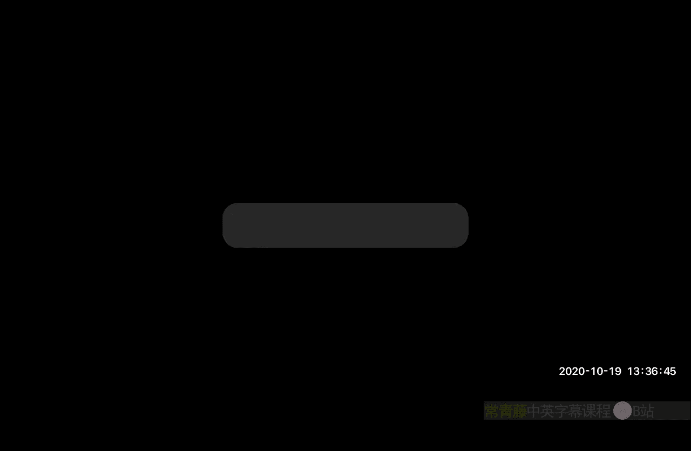
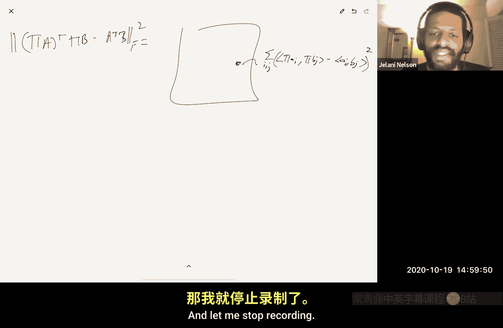

# 加州大学伯克利分校【中英⚡数据流算法｜CS294 Fall 2020, Sketching Algorithms】 P14：Krahmer-Ward 证明收尾与近似矩阵乘法

在本节课中，我们将完成 Krahmer-Ward 定理的证明，并开始介绍如何使用素描技术加速线性代数计算，特别是近似矩阵乘法。

## 概述

本节课首先将完成上周开始的 Krahmer-Ward 定理证明。该证明包含一些有趣的思想，我们将在后续讨论压缩感知时用到。之后，我们将开始探讨随机化线性代数，即使用素描技术来加速诸如近似矩阵乘法、最小二乘回归、低秩近似和 K 均值聚类等计算。

## Krahmer-Ward 证明收尾

上一节我们介绍了 Krahmer-Ward 分析的核心思想，即通过条件概率以不同顺序分析快速 Johnson-Lindenstrauss 变换矩阵 `SHD`。本节我们将完成证明中剩余部分的推导。

### 回顾与设定

回忆一下，我们试图证明对于任意单位范数向量 `z`，有：
`||ΠDΣz||² ≈ 1 ± ε`
其中 `Π = SH`，`D` 是对角符号矩阵，`Σ` 是随机符号向量。我们假设 `Π` 满足 `(ε, 2k)`-RIP 性质，这意味着 `Π` 能同时保留下所有 `2k`-稀疏向量的范数。

我们将目标表达式 `||ΠDΣz||²` 重写为二次型：
`||ΠDΣz||² = Σᵀ X Σ`
其中矩阵 `X` 被根据向量 `z` 的分块结构进行了划分。我们定义了四个子矩阵 `A`, `B`, `Bᵀ`, `C`，并希望证明：
1.  `Σᵀ A Σ = 1 ± ε` （已证明）
2.  `Σᵀ B Σ = ± O(ε)`
3.  `Σᵀ Bᵀ Σ = ± O(ε)`
4.  `Σᵀ C Σ = ± O(ε)`

通过联合界，这些项同时成立的概率很高，从而完成证明。

### 分析 Σᵀ B Σ

我们首先分析 `Σᵀ B Σ`。通过代数操作，可以将其表示为：
`Σᵀ B Σ = vᵀ Σ₋₁`
其中 `v` 是一个依赖于 `Σ₁`（`Σ` 的前 `k` 个分量）的固定向量，而 `Σ₋₁` 是 `Σ` 中剩余的分量，与 `v` 独立。

这是一个固定向量与随机符号向量的点积。根据 Khintchine 不等式，其尾部概率有界：
`P(|vᵀ Σ₋₁| > ε) ≤ 2 exp(-ε² / (2||v||²))`
因此，关键在于界定向量 `v` 的范数 `||v||`。

通过一系列推导，并利用 `Π` 的 RIP 性质以及称为 **壳层法 (shelling)** 的技术（在压缩感知中常用），我们可以证明：
`||v|| ≤ O(ε / √k)`

将其代入 Khintchine 不等式，并选择 `k = Θ(log(1/δ))`，可得失败概率最多为 `δ/3`。

### 分析 Σᵀ Bᵀ Σ

由于 `Σᵀ Bᵀ Σ` 是一个实数，它等于其转置 `(Σᵀ B Σ)ᵀ`，而后者就是 `Σᵀ B Σ`。因此，对 `Σᵀ B Σ` 的界自动适用于此项。

### 分析 Σᵀ C Σ

最后分析 `Σᵀ C Σ`。这是一个更复杂的二次型。我们使用 **Hanson-Wright 不等式** 来界定其偏离概率。

我们需要界定矩阵 `C` 的 **Frobenius 范数** 和 **算子范数**。通过利用 `Π` 的 RIP 性质、算子范数与 Frobenius 范数之间的关系，以及壳层法，可以证明：
-   `||C||_F² ≤ O(ε² / k)`
-   `||C||_{op} ≤ O(ε / √k)`

将这两个界代入 Hanson-Wright 不等式，并再次利用 `k = Θ(log(1/δ))`，可得失败概率最多为 `δ/3`。

### 证明完成

通过联合界，所有四项 (`A`, `B`, `Bᵀ`, `C`) 同时满足其误差界的概率至少为 `1 - δ`。这就完成了 Krahmer-Ward 定理的证明，表明 `ΠDΣ` 能以高概率实现分布式的 Johnson-Lindenstrauss 嵌入。

**关于 RIP 矩阵的说明**：证明中要求 `Π` 满足 RIP。虽然存在确定性的 RIP 矩阵构造，但已知的最佳结果需要大约 `k²` 行。在实践中，通常使用随机矩阵（如高斯矩阵或快速 JL 矩阵），它们能以高概率满足 RIP，且行数约为 `O(k log d)`。

## 转向线性代数的素描算法

上一节我们完成了对 Krahmer-Ward 定理的理论分析。现在，我们开始一个新的主题：使用素描技术加速线性代数计算。

### 近似矩阵乘法

第一个问题是 **近似矩阵乘法**。假设我们有矩阵 `A ∈ ℝ^(d×n)` 和 `B ∈ ℝ^(n×p)`，想要计算乘积 `AᵀB`。朴素算法需要 `O(dnp)` 时间。

是否存在更快的近似算法？已知的快速矩阵乘法算法（如 Strassen 及其后续改进）虽然能降低理论指数，但在实践中往往不实用，尤其是对于非方阵情况。

#### DKM 采样方法 (2006)

Drineas, Kannan, Mahoney 提出了一种基于采样的近似方法。核心思想是利用矩阵乘法的外积表示：
`AᵀB = Σ_{i=1}^{n} a_i b_iᵀ`
其中 `a_i` 是 `A` 的第 `i` 列，`b_iᵀ` 是 `B` 的第 `i` 行。

以下是 DKM 方法的基本步骤：

1.  **非均匀采样**：以概率 `p_i` 采样索引 `i`。`p_i` 正比于对应行/列范数的乘积：`p_i ∝ ||a_i|| * ||b_i||`。
2.  **构造估计量**：进行 `m` 次独立采样（有放回），得到索引 `i_1, ..., i_m`。估计矩阵 `C` 定义为：
    `C = (1/m) * Σ_{r=1}^{m} (1/p_{i_r}) * a_{i_r} b_{i_r}ᵀ`
3.  **性质**：`C` 是 `AᵀB` 的无偏估计。通过精心选择 `p_i` 和 `m`，可以证明以下误差界以高概率成立：
    `||AᵀB - C||_F ≤ ε * ||A||_F * ||B||_F`
    其中所需样本数 `m = O(1/(ε²δ))` 可确保失败概率为 `δ`。

#### 提升成功概率

上述方法中，失败概率 `δ` 直接出现在样本复杂度 `m` 中。若希望得到对数依赖（`log(1/δ)`），可以使用 **中位数提升 (median boosting)** 技巧。

然而，由于输出是矩阵而非标量，需要定义“矩阵中位数”。思路如下：
1.  独立运行上述算法 `T = O(log(1/δ))` 次，得到 `T` 个输出矩阵 `C_1, ..., C_T`。
2.  根据切尔诺夫界，其中至少 `2T/3` 个矩阵是“好”的（满足误差界）。
3.  这些“好”的矩阵彼此接近（根据三角不等式）。
4.  算法：遍历所有 `T` 个矩阵，找到第一个与大多数（> `T/2` 个）其他矩阵都接近的矩阵，将其作为输出。这可以在 `O(T²)` 次矩阵距离比较内完成。
5.  或者，随机选取一个矩阵，检查它是否与大多数矩阵接近；若不是，则重复。期望只需常数次尝试，期望比较次数为 `O(T)`。

#### 基于 JL 的素描方法

与 DKM 同年，Charikar 提出了基于 Johnson-Lindenstrauss 变换的另一种方法。其核心是选择一个 JL 素描矩阵 `Π ∈ ℝ^(m×n)`（例如随机符号矩阵或快速 JL 矩阵），然后计算：
`C = (ΠA)ᵀ (ΠB)`
可以证明，以高概率有：
`||AᵀB - (ΠA)ᵀ(ΠB)||_F ≤ ε * ||A||_F * ||B||_F`
其原理在于，JL 性质不仅保范数，也保内积。误差矩阵的每个元素是 `(Πa_i)ᵀ(Πb_j) - a_iᵀb_j`，由于 JL 保证内积近似，这些误差的平方和（即 Frobenius 范数平方）也就很小。

我们将在下节课详细展开这种方法的分析。

## 总结

本节课中，我们一起完成了 Krahmer-Ward 定理的证明，该定理为快速 Johnson-Lindenstrauss 变换提供了严格的分析框架。随后，我们引入了使用素描技术加速线性代数计算的主题，并重点介绍了近似矩阵乘法的两种早期方法：DKM 的基于非均匀采样的方法和 Charikar 的基于 JL 变换的方法。这些方法为后续讨论更复杂的线性代数问题（如回归、低秩近似）奠定了基础。