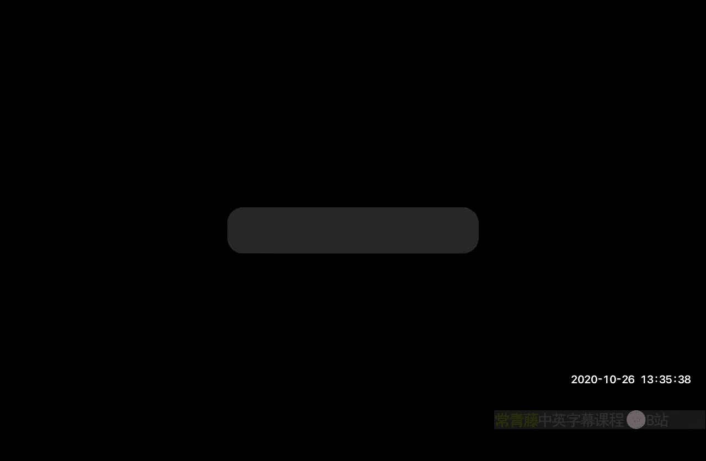
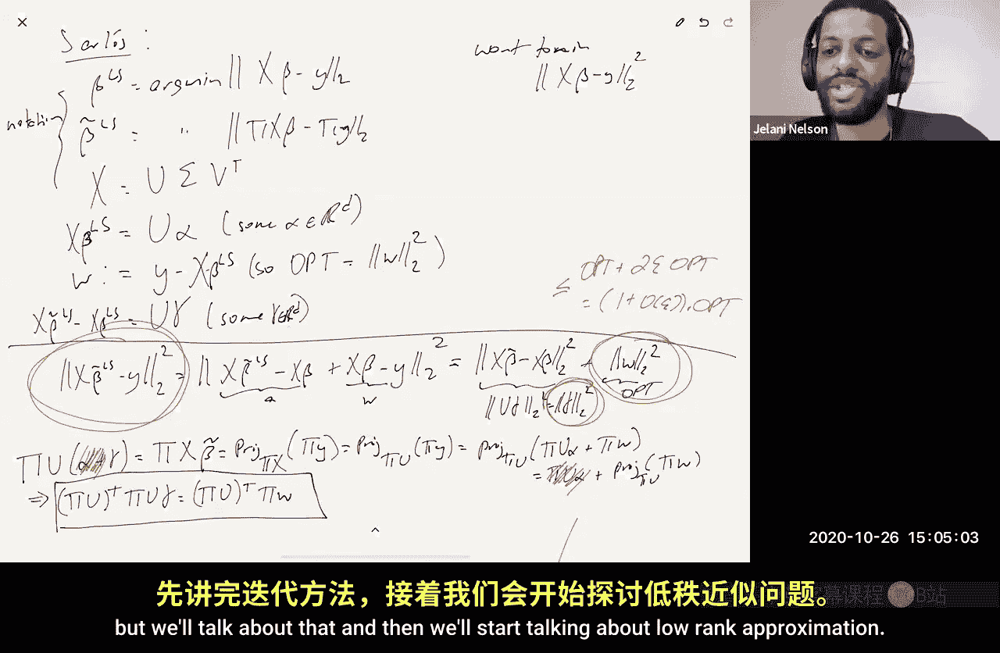

# 加州大学伯克利分校【中英⚡数据流算法｜CS294 Fall 2020, Sketching Algorithms】 p16 P16 Leverage score sampling, oblivious subspace embedding constructions, -BV11zi7BjEHu_p16-

So this week， both today and Wednesday we're going to continue talking about sketching algorithms for linear algebra problems like regression。

 lower rank approximation， etter。So last time we talked about。Actually。

 they should have said some space embeddings。Not Os subspace embe So last time we talked about you know how do you get a subspace embedding and there were three ways one is if you actually have an ortho thermalmal basis of the subspace。

 let's put those in in the as columns of a matrix U。

Then U transpose is basically the best subspace embedding you can hope to have。

 you know it has D rows， which you can't you can't even get down to D minus1 D is exactly the right。

 you know the best you could hope to do and it has no distortion whatsoever。

Just the trouble with that is it's computationally expensive。To compute you give it， you know。

 let's say you're given the basis as。A set of vectors， which are not worth normal。

You're just told like you know the subspace is the span of these vectors， like here's a matrix a。

 the subspace is the column space of this matrix， the span of the columns of a。

Then how do you get a north world basis， you know， you do something like maybe Graham Schmidt or you do some kind of matrix decomposition that's expensive。

So we like ways of getting subspace embeddings which are not computationally expensive I mentioned one is a sampling approach。

 which is leverage score sampling we're going to see that today more about that and the other was oblivious subspace embeddings where。

You pick kind of a random matrix that does not， the distribution does not depend on the input subspace on the input matrix。

 let's say that you're taking the column space of。And then after I talk a little bit about that。

 I want to say more on regression， so I gave you one analysis already of sketch and solve。

Which said if you have an epsilon subspace embedding。

 you can use it to get approximate regression up to multiple epsilon。

There are other things you can say that， you know other ways you can analyze even sketch and solve。

 you can say actually I don't even need an epsilon subspace embedding for sketch and solve I just need a。

Constant quality subspace being， like a one quarter subspaceting。

And if I get that together with another property， which is going to be approximate matrix multiplication。

That alone， those two things。Those two things alone are good enough to analyze catch and solve。

And the other thing I'm going to talk about is a non sketch solve approach an England iterative approach using preconditioners and then we're going to be done for today and we're going to continue on Wednesday with more linear your algebra stuff。

So okay， so let's start off with item one， which is how to get subspace embeddings。So just remember。

 remember a subspace embedding， an epsilon subspace embedding， what does that mean it means that。

For all X， you know， AX。I'm thinking of it， as say。The subspace embedding is like the column space。

I an input matrix A。So， let's say like。E is equal to the column space。系。

So what does it mean it means for all x， if you look at AXl2 norm squared。

It's like one plus or minus epsilon times。嗯。Hi Axl pseudo squared。

RightThen I'll say that pi is an epsilon subspace embedding for the column space of a。

 which is a subspace。 And what is this thing， This thing is x transpose a transpose A X。

 So like this is the item here that matters a lot Basically one we want to approximate a transpose a。

And the observation was that a transpose a is equal to the sub。Of AI AI transpose。

 where I goes from one to n， where A is this matrix。So it's some an N by D matrix， let's say。

So the idea of sampling is。You know， sampling。We write down a sampling matrix pi。

Let' say we take M samples。Each row has a one in a random location。

Divided by something to make it unbiased is a square root of PI。And then a zero， everywhere else。

We're like， this is the I column。And then the next。The next。

The next row has a one in non zero in a random location。And then zeros everywhere else。Et cetera。

 let's say they're amvo。So this is just row sampling， right。

 we're taking M independent samples of rowsa A。And that's pie。And the question then is， what？

What should these， you know？What should these probabilities be to get some kind of guarantees of good probability？

And also， I want to say that kind of pi a now pi a transpose。Actually。

 you know let me do let me we're not actually going to analyze this exact matrix。

We're going to analyze something similar， it turns out you can analyze this too。

 but this one just is a little bit easier to write down and deal with。We're going to look at pie。

 which is actually。It's actually a diagonal matrix。The zeros in the offtagonal。

 and it's going to be n by n。And if you look at the I entry。I can change the diagonal。

 so this is I and this is I。That's going to be equal to。I'll call it a to I。Over。Over P over PI。So。

Eta I is equal to like one。If we kept。If we kept a row eye。系。And zero otherwise。

And the probability that theta I is equal to y is going to be pi。

So it's similar to what I wrote above， it's just instead of taking exactly M samples。

We're going to take M samples like an expectation， right because really the number of rows that are getting sampled is just the number of Adas right。

 the number of rows sampled。Is equal to the sum i goes from one to n of a to I。

It's just like which of the eight eyes are one， right？Which is a random variable。

 So instead of exactly sampling M rows， we're going to sample a variable number of rows That's a random variable。

 But we hope that， you know it's like， well as expectation is going to be something that we're going to bound and it's going to be concentrated around the expectation。

 So with high probability， we don't sample too many rows。 So it's similar。😊。

And then now what I can write is I can write。Pi a transpose pi a。Right， as。

The sum I goes from one to N。This is an N， not an Ada。Of A to I over Pi， AI， AI transpose。

Which implies like the expectation of that thing。Is the sum of AI AI transmits？

Of the expectation over PI， let's say， of the expectation of A to I。But of course， this cancels。

That's why we divided by root Pi so this is equal to a transpose a So this is like this is an unbiased now this matrix is a random matrix pi a transpo pi a。

But his expectation is what we want。And now we want to say something about concentration。

 we want to say that。With high probability。For all X。

The quadratic form is preserved for this versus a transpoaine for all X。

X transpose pi a transpose pi Ax is very close to x transpose a transpose a。

So how do you get something like that， so I'm going to give a definition definition。嗯。Sensitivity。

It is a technical term。Of the eyerow。Let's call the Sen RI。The sensitivity Rri of the I throw of a。

Is defined to be as follows RI is the soup。Overall， Xs。Of AI。 x squared。

Over the L2 norm squared of ax。If you think about what that means。

 I mean that's the same thing as the soup。Overall x of Ai。 x squared。Over the sum of J from one to N。

Of Aj do x squared。Right， so Ai。X squared is one of those terms。😡。

Is one of those terms in the sum in the denominator？And the question is like， is there an X？

Where the numerator is a really dominant term in the denominator sum。

This ratio is of course always between zero and one。It can't be more than one。Because。

The numerator is part of the denominator。And of course。

 it can't be less than zero because everything here is not negative。 When is it going to be one。

 it's going to be one if。There is an x that's orthogonal to all the other rows。

 but not orthogonal to the Irow。So RI is basically some measure of like it's some measure of how important the Irow is。

Right， in the sense that。I'm going to say that the eyerow is important。If there is an X。

Where the IF matters a lot in the quadratic form。Okay， so this is the definition of sensitivity。Now。

Let's think about， let's try to build some intuition now from this definition。

 let's try to build some intuition for what the PI should be。Now。

 I think it would be kind of weird for some PIs to be zero because it's like that means that I'm just ignoring part of the matrix。

If I'm trying to preserve the， you know， the quadratic form of the matrix。

 I probably shouldn't ignore any part of it， so I probably shouldn't be sending any Ps to zero Again I'm not being formally here I'm just trying to build an intuition。

Now， if a PI is not zero。I claim。IfAgain， its just intuition， if PI is not zero。

 so it's strictly biggerer than zero。Then。We definitely need。PI to be at least。Let's say R over two。

OkaySo I'm saying like if it's not zero， there's no point to making it super small， some epsilon。

 it needs to be at least RI over two， sorry。Why is that？Remember， we want a subspace embedding。

 right？So。😊，If it's not zero， then that means that， you know。

 there are some cases where I am going to sample this row and if I am going to sample this row。

 that means that。When I throw samples。Pi Ax L2 arm squared。Is going to be at least。嗯。AI。

x L2 norm squared over P。Okay。And the point is。If， if。If PI is too small。Then I claimed that。

If I choose x to be the vector that maximizes the supreum in the definition of sensitivity。

That particular X is going to get blown up too much， remember， to be a subspace embedding。

 you need to preserve everyone's norm up to Wpoles epsilon。😡。

I claim that that particular x is not going to be preserved up to ones epsilon。

 you're going to blow up as normal lot。Unless you set PI to be large enough， Okay， so let's say that。

Let's say that x is actually the X star that achieves the supreme。ok。What do I know about AI。

 x star squared？😡，That's equal to right just by rearranging the definition of RI。

XNow x star is the x that achieves the suit AI dot x star squared is equal to。😡，AX star。

Ll2 arm squared。Now times R， and then we had a division by PI。This thing here now。Is bigger than。

It's bigger than two times。AX star。Lt two norm squared unless。Unless PI is at least R over2。Remember。

 we're trying to preserve things up to Wmpo's epsilon， here I'm blowing it up by a factor of two。

 which I'm imagining is more than Wpo's epsilon。😡，Wai does that make sense？

So I'm just trying to build intuition here to say， look， I mean。

 I don't know that setting R to be I don't know that setting PiI to be RI over two is good enough。😡。

But what I do know is。If PI is non zero。Then there's no point。To setting it less than R over two。

Because， you know， if you're setting it to be non zero。

 that means that it is going to get sampled sometimes。And when it does get samples。

 you're guaranteeing that you're screwed。Unless it's at least R over two， right。

 you're guaranteeing that you're screwed because X star in particular be will be distorted a lot。

Does that make sense？Yeah， but I mean and so we we we。

 we could get like a tier bound in terms of epsilon。 but we're just taking this。Yeah because right。

 yeah， so why might why I just why don't I care about the factor of two I mean， notice that like。

The expected number of rows samplesd。Is just the sum over i from one to n of the expectation of a to I。

Which is the sum of PI。Right。So， you know， I'm just looking at how how good is my sketch， you know。

 how many rows am I sketching down to？And I just want to know that up to big O notation right so the point is。

The expected number of rows in my sketch is the sum of the PIs。

 so ideally I would like the sum of the Ps to be as small as possible。😡，And what I'm saying is。

 you know， like up to theta up to big O notation。You're basically。

 you shouldn't really hope to beat some of the Rs， right？You shouldn't hope to be。Hope to beat。

You know， big O of like the sum of the PIs。Our as。Because PI needs to be at least R over two。

Does that make sense？Okay。I mean， it's not， it's not clear that we can achieve some of our eye。

 but I'm just saying like you shouldn't hope to beat it that's sort of like， you know。

 that should be maybe the target。Okay， so now the question is like， okay。

 so I I gave this weird definition of sensitivity， like what is the sum of the R is that is you know。

 it's like the sum over I of the supreme of something or other。It seems kind of complicated。

So let's try and give a different definition。Which is the following。佢十嘅。Okay。

 so I'm going to define something called the leverage score。And as it's going to turn out。

 so let's define lower square。The ice。Leverered score。嗯。L I is defined。As as follows。

Now lie is just equal to。AI transpose， okay？And then。A transpose a pseudo inverse， Okay。

 AI transpose or AI。Which， of course， AI is the say AI is also known as。嗯。😊，So again。

 think of it like。If I look at EI transpose A。EI is the I standard basis vector。

That's selecting the I throw of a so AI transpose is the same thing as EI transpose A。

And then I have a transpose a pseudo inverse。And then I have a transpose EI if you don't remember from the last lecture。

I said， you know what is the pseudo inverse thing I said look there's this thing there's this SVD of matrices。

A is equal to u sigma v transpose， and the pseudo inverse is equal to， by definition。

 V sigma inverse u transpose。doesn't you know， this doesn't sound you're not remembering this。

Don't worry， I'm going to keep saying， I'm going to keep talking about SvDs and pseudoinverses a lot today and on Wednesday and maybe even next week。

 so you'll get the hang of it。Again， UN V have orthonal columns and Sigma is a diagonal matrix。

That has non zero entries in the diagonal strictly strictly positive entries in the diagonal and they're sorted so the top you know Sigma 11 is the largest entry in Sigma Sigma 22 is the next largest Sigma 33 is the next largest these are called the singular values of Sigma。

对然。If a is a real symmetric matrix， then Sigma just has the absolute values of the eigenvalues。

 so it's like the magnitudes of the eigenvalues， if you think。So。😊，Anyho？Now what I want to say is。

If you don't remember， I'll remind you。This thing。Is just the orthogonal projection。Onto。

 I think the column space。Of a。You can see that by looking at the SVD。

 so you just expand this out a transpose a。Is， you know， let's do a transpose Z is equal to。V sigma。

 U transposed， U Sigma V transpoposedse。And then we're taking a pseudo inverse of that。

 and then we're taking a transpose， which is now again V sigma u transpose， and then we have an A。

 which is U sigma V transpose。If you just， you know。

 you transpose user identity because it has ortho columns。This is sigma squared。

Now you take the pseudo inverse。And then you get。V sigma minus two v transpose。

That cancels with that V transpos V is identity。 V transpos V is identity。

 You have two sigmas and a sigma to the minus2。 So that goes away。 And then altogether。

 you got to have U transmits， right You have only these two things survive。

 So it's the orthogonal projection onto the column space of a。So this is also just equal to like。

UI L2 norm squared where U is this matrix。You want transpose up to like you N transpose。

Does that make sense？Okay。嗯。And now， the claim。The claim is that。Behold， linear algebra， R equals L。

So even though this definition looks a little bit different。Than the sensitivity definition。

 it turns out they're actually the same thing。Okay。And now why is that important？Again。

 remember we were interested in understanding the sum of the RIs， right？

We said we can't hope to beat。We can't hope to beat the sum of the RIs as our number of samples。

But some of the RI is because of that claim is the same thing as some of the allies。Which is the sum。

Of the square norms of the rows of you。These are the rows。Which is the same thing as， you know。

 is this some of the squares of all entries in the matrix basically。

 so that's just equal to u for beingnius norm squared。

Which is the same thing as the sum of the squared columns of the matrix。

So let's say you sub superscript I as the column。What's that， first of all。

 there are D columns if it's a rank D matrix。🤧。What's this？Remember， in the SVD。

 UN andV have orthoormal columns。😡，Right so each fourth or normal， each column has normal one。

The columns are an orthoal basis， so they have norm one， so this is just the sum of1 d times。

 so this is D。Right。So what this is saying is。You know， we're not we're not going to hope to be。

 this is something I guess we already knew。We're not going to hope to beat de rows。

Or O ofD rows in our sketch。是。And let me skip， you know the proof that R equals L is not is again just a change of basis thing I'll just put it in the notes。

 it's not anything to。Important for this lecture， so I'll punch it for the notes。

But kind of the miracle is。Nphum。And this is due to sp in。And Svastava。

 who's here in the math department at Cal。I believe this was 09， but maybe it was 08。 It's anyway。

 I've already， I've already actually put this theem in the notes， you can see the reference。

Which says that if。PI is at least。Let's say up to a constant fact， yes not least， let's say。

The max are the men， not the max， the min。Of one。And something like some constant times LI。

 the I leverage score times。Log of D over Dlta over epsilon squared。Where D is again。

 the rank of the subspace is the rank of the column space of a or the rank of a。Then。

The probability of pie。That。Hi fails。To be an epsilon subspace embedding。For it's say it for E。

你这 was Delta。We again here， this is the sampling matrix。ok。So then the expected。You know。

 sketch size。is equal to。The sum of the PIs。Which is equal to according to this big O of。

Log d over Delta over epsilon square times the sum of the allies。

 which is o of d log d over Delta over epsilon squared。So it' I， it's not terrible。

You can't help to beat D。And this is getting within some log factor of the log the notes。可。😊。

So I think that's I'm not going to prove this， the proof uses something called the you know。

We've talked about the turnoff bound in class。And you know， Bernstein's inequality。

 this is all the the review the probability review in the lecture notes。

 it turns out there are matrix versions of that too where。Instead of summing random， you know。

 instead of summing independent。Numbers， independent scalar random variables。

What if you sum up independent matrices where the matrices are random？

What can you say about the sum of independent matrices concentrating around their expectation。

 let's say an operator norm？There are theorems that give you that kind of bound， for example。

 the matrix turnoff bound， matrix Bernstein， non commmutative kin inequality。嗯。

So those things pretty much immediately prove this theorem before you。

It's just a matter of plugging in the matrix version of the chartoffdown。Can you get the here。Yeah。

Now you might be looking at this and say， wait a second。I mean。

 the reason I want a subs spacing bedding is that I can do faster regression or faster lower approximation。

 et ceter。This theorem is saying， I need to sample rows with probabilities that depend on the leverage scores。

What are the lover scores？The leverage scores are the squared rowors of this matrix U。

Right this right here， these are the leverage scores。How do I know those？

Do I need to know capital U well， how do I get capital U？I you know。

 I either do the SvD or I do some kind of graham Schchmidt or something。But if I knew capital U。

Then why wouldn't I just pick my subspace embedding to be U transpose？

Like why am I doing all this other more complicated stuff？

We already said that U transpose was the best subspace bedding you could hope to have。Okay。

And the reason is that we're not actually going to sample with these probabilities。

As long as you sampled probabilities that are at least that large， that's good enough。So I if I know。

 let's say if I know the alls up to a factor of two， let's say or up up to a constant factor。

Then I can slightly oversample， I can pick my PIs to be maybe a factor too larger than they need to be。

And then sample with those probabilities and I can still invoke this theorem and get a good subspace embedding with high probability and it turns out that even though computing the exact leverage scores is not so easy because you know again we don't want to we don't know you exactly getting approximate leverage scores on the other hand is actually doable fast okay and you're going to see that on PSet2 which is going to be released soon。

 one of the problems there is it's a multipart problem that's going to guide you through an approach。

To quickly get approximations to all the leverage scores。

 and it's going to actually be via the Jay ama via Johnsons。

And do not have a problem with like a do the Ps need to add up to one。

 right if we just take them to be like。Bigger than when each of these is that not problem the way that I've defined itum you're not it's not that you're independently sampling rows in each step where like the probability P I is P PiI is just the probability that it survives right so it's like for each of the n rows。

I flip a Hawaii with bias PI to determine whether to keep that row or not。

 so the PIs don't sum to one。😡，In fact， the PI is sum to something like D log D or D log Drups on squared。

Does that make sense？Wait， would you not want them to sum to。

Something less because you're trying to reduce it down。Well， the original number of rows was n。

 right where n could be gyormous。So A is an n by D matrix， okay。

 it has a ton of rows and it has D columns where D is I'm imagining not as big。

Then we're shrinking down the number of rows from n to close to D， so that makes me happy。Yeah。Okay。

So that's all I wanted to say about sampling。And now let me talk about OSEs。

The Bolivvious subspace embeddings。So how do you get those？

What do we want we want that believe subspace embedding is a distribution D， recall。

It's a distribution。Zi。Over M by N matrices。It's not very visible， clear legible。

Such that for all you。Which is the an orthoal basis for a Ddisional subspace。

 so Utranspose user identity。Uual chose suppose you guys's identity means it's an orphnal basis。

 right， it means the columns are an orphnal basis。Because different columns have jobt product zero。

And each one， you know UI transpose UI is one， which means that the icon is number one。

So I want that the probability that pi drawn from D。Of pi U transpose pi U。

Minus identity bigger than epsilon is like less than delta。

So this is the definition of obligvious subspace embedding， so the question is。

 how do we come up with such a D？Okay。😊，So this is the notion of Epsilon Delta D oblivious sub being。

Okay， so how do you get them？So one。Is via a net argument？

So we can't just do jail here right I mean yet so what does this saying。

 this is equivalent to we want to preserve the norm of every vector in the subspace。

So JL says if you want to preserve Q vectors， you can map to log Q dimensions。

The problem here is Q is infinity， we're trying to preserve all vectors in the subspace。

 there's an infinite number of vectors in the subspace。

 so there's you can't really talk about log the number of vectors， that's infinite log of infinity。

So a net argument says。嗯。Basically， there exists a subset。E prime of E。Such that if。

Pi Epsilon preserves。All x' prime and E prime。And show。That implies。Pi O Epsilon preserves。

All X and E。And E prime。What be like。A one quarter net。Of E of like， let's say。

Of they'll say the unit ball of E。You it L2 ball。Okay。

 so the size of E prime will be something like0 of one。To the dimension。So this implies。

That the number of rows you need is like。Big O of like log。E prime。Of rhpsilon squared。

Which is L of D of Rpsson squared。This is now just DJL。DJL says。

If I map the dimension log whatever distributional J， I mean。

 if I map the dimension log whatever delta divided by epsilon squared。

I'll preserve any fixed vector with probability delta。Actually。

 I guess I should be a little more if you want if you want exactly this property。

There's a delta in here， right if you want exactly this property。Then I should actually say that。

This should really be log the size of E prime。呃。Lg the size of E prime。Over Delta。

And then this will be big O of。D plus log whatever delta over Epsilon squared。Okay， right。

 so the distributional JL says。If I map the dimension。

 log whatever delta over rhson squared for any fixed vector。

 I'll preserve it with probability1 minus delta。So now I'll just pretend my Delta prime。😡。

Is actually actually Delta over E prime。That way it's small enough that I can union bound over all the vectors in E prime。

And succeed with probability 1 minus Dlta after the union bill。Right。And then I get basically this。

Okay。And。The fact that this。This part， the fact that you you can show that this implies。

That pi works for all of E。That's also going to be on your next homework。

 so that's with a little hint， but that's basically problem one on the next pieceet as well。

So that's the first thing， which is a net argument。So already what do we know。

 we already know distributions that give DJL right we know that a random plus minus1 matrix gives DJL distributional JL。

And you need login Dlta rhpsson squared rows， so that translates into exactly this bound。

 you'll have a B subspace embedding with D plus logwood Delta over rhpsson squared rows and for OSCs it's known that this is optimal。

This is optimal。That's due to me and Huiguin。So yeah， if you wanted to buy some sort of beting。

 you could get rows fewer than that。诶。We also know that sparse jail give us a distributional jail as well。

RightWhere the column sparssity is a little bit better than a dense matrix。

 that would imply that the number of rows would be something like D repsson squared。

But the sparsity per column would only be D over Epsilon right so you can sparsify every column by factor Epsilon that just follows black box from applying sparse scale to the net。

You can also do it fast jail fast jail we've seen a red El。

 you know the one based on the fast Fourier transport that also gives you DjL so again that translates into。

Into a subspace embedding as well， via this， okay？So net argument is one way to get somespace embeddings。

It's not the only way。Another way that I'll say is so method number two is what I'll call the moment method。

What's the moment method， well we're looking at this， what's the probability over a pi？

That pi U transpose pi U。Minus identity is bigger than epsilon。Let me call this matrix M。

We know that by Markov， this is less than the expectation of the operator of m to the P over epsilon to the P。

I raised both sides of the inequality to the P of power。Then I didn't Mark on。以前。And then。

Now what I can do is I can say the following。This is actually less than or equal to。嗯。

The expectation of， and I'll define this。St and P norm raced the P of power over Epsilon of the P。

So what is the Cheen Por？Shan Pior says。嗯。It's the LP norm。Of the vector。Of singular values。Of。

A them。So remember again， we can write an SVD， M is equal to u sigmma V transpose。

We're signaligized this。The matrix of singular values， so has S one。Down to Sigma D。

 zero is all here， Sigma 1 is bigger than equal to Sigma 2 is greater equal to jobs。

 is bigger than equal to Sigma D。So the Shetton por。

Is equal to the sum of sigma i to the p raised to the1 over p。

the operator norm is kind of like the shaton infinity infinityfinity norm that's right， yeah。

 so the operator norm is the same thing as like the Shatton infinity norm。That's right。

Which is just Sigma one。Okay。And a nice thing to observe is when you have a reels， okay。

 so now here's a little bit of linear algebra， right so。If you have a real symmetric matrix M。

If M is real symmetric。Then I can write。M as。Q lambda Q transpose。

 where this is an orthogontal matrix。Right。So that implies that M to the P is equal to。

Q lambmbda to the P。Que transpose。Which means that。The eigenvalues of m to the p are just， you。

 lambda1 to the p up to like lambda D to the p， right？And what are the singular values。

 the singular values are just the absolute values of the eigenvalues。So the singular values。

Of m to the P are just like the absolute value of lambda1 to the P up to like the absolute value of lambda d to the P。

Which is equal to？Lambda1 to the P up to Lada d to the P actually， is that yeah， lambda d to the P。

If P is an even integer。Because if it's an even integer， then if it's negative。

 when you raise it to an even power， it it becomes positive。

And then I can then just say like basically a shatton P normally of the P。

 so this means that the shat and P normally is the P。Is equal to basically。

The trace of M to the P of power。The trace。The trace of the matrix gives you sum of the iUvalue。

The traits of a real symmetric matrix excuse to some of the Iigenvalue。

Which here is the sum of lambda lambdai to the P， which is the same as the sum of sigma i to the P because the sigma i to the P is lambda to the P。

So I can write this is equal to。The expectation of the trace。Of M to the P over epsilon to the P。

So the name of the game then is to basically bound this。Okay， how do you do that。

 well there are two ways now to bound the， the expectation of the sha norm to the P。So， you know。

 I'll say method 2 a is like the combinatorox method。And so we weren't assuming P is integer before。

 but now we're assuming P is an even integer It's， So P P is， P is an even integer。Okay。

 so if you look at。This is just the fact， again， about you know， linear algebra。

 if you look at a matrix square matrix。Take it to the P of power and look at the IJF entry。

This is equal to the sum。Overall， I1 up to I plus 1。

 where I1 equals I and I plus1 equals J of the product T goes from 1 to p of M。I comma I plus one。

 you can prove this。By induction on P。Okay， so this is just a fact about。

Intries of powers of matrices。What's the trace， the trace isn't the case that I equals J。

So this implies that the trace of m to the P is equal to the sum。Overall， I1 up to IP plus1。

Such that I1 equals I+1 of that same product。Which means if you take the expectation。

My linear expectation， you you got this。And then， you know。

 you try to just do it kind of brute force， so you know， I mean it's going to depend。

Remember what M was， M was pi U transpose pi U minus identity。So， you know， depending on what pie is。

You'll be able to write down something for for the terms in this product。

 it'll involve some random variables because pi involves random variables。😡。

You'll compute the expectation， you'll get something。

And then now you have the sum that's something over all these basically paths paths from I to from cycles basically because you start I1。

 you walk around and you have to land at I1， so it's like the sum over all cycles of something。

And it ends up being just basically a lot of combinatorics。

Maybe I'll put a reference in the notes if you want to read how such things are done。

But it just tends to be very involved calculations。

 as you might imagine because there are like exponentially many sumends here and you have to somehow reason about kind of how many there are of different types and what those types are contributing。

 etcter。2B is。Something like you know the non commutative kin inequality。So what does that mean。

 let's just remind ourselves like what is kinchin， first of all。Okay。

 then and then I'll tell you what non commutative tension is。なですね。Right， so Kin。

Says if I look at something like。The penno of the sum of Sigma I AI。

This is at most root P times the L number of a。We're likeA is a vector。

So the non commmunutative Kin tries to generalize this to matrices， it says what if you have。

ThisThe operator of the sum of Sigma I capital AI， where now capital AI is a matrix and this is the P norm sorry。

 this is the P norm， what's the p norm of a matrix， I're just going to define the P if Z is a matrix。

The P sorry M is a matrix， the por is just defined to be。😡，The expectation of。Thetin norm。

 the P is shottton norm to the P raised to the whatever P。Okay。

And then non commmunative Kinen says that this thing is at most。Basically， rootee。

Times the max of two things。It doesn't matter if the AIs are symmetric， but basically it's。

On the one hand。🤧The sum of。AI AI transpose to the one half。P and the other is。

The sum of AI transpose AI to the one half。Pi。And you might be looking at this and think and asking yourself。

Glani， what does it mean to take the one half power of a matrix？嗯。In general， just an aside。

If I have a function F。Which maps， let's say non negative， we have positive reels to positive reels。

Then when I write F of a， like a to the one half。It's by definition， what I mean is。It's you。

F of Sigma1。F of Sigma D。V transpose。So what I literally what I mean is。Take the SVDMA。

 apply F to its singular values。And keep U And V the same。 This is now a new matrix。

 and this is what I'm calling F of a。So when I say take eight to the one half。

I literally mean take the same matrix A。But change take the square root of all of its singular values。

So anyway， this noncommmunutative kitchen has been proven。And it gives you something。

You might look at this though and say， well， Gilai， this doesn't really look like our situation。

We have。We have。The sum we have we don't have a sum at all have。Pi U transpose pi U minus identity。

Let's say Shat and Porton。But non commmutative k is looking at things of the form like。The sum of。

Sig what i AI。S。And actually， we don't even have Sha Por right we oh yeah， I guess we well。

 I guess we do right we do because that's what we did that's what we did up here we basically said。嗯。

What we care about at the end of the day is the Shaang penor。So okay， so we have a Shaquior。

 but like this doesn't really look like the form that we want。

 it's not it's not the sum of a random sign times some matrix matrices AI。

So like how do you massage it so that non commmmunutative condition actually applies？猫。

Just define ZI to be。Oops， just define ZI。To be the eyerow。Of payu。That implies that like。

Piu transpose piu， I'm sorry。Is just the sum of ZI， ZI transpose。

We've already seen this before in general， A transpose day is the sum of AI AI transpose。Okay。

So then that implies that like。嗯。Actually it he's right like this。Piu transpose piu。

Minus identity por， remember how I define the penor of matrix is just equal to。They see the sun。

Of ZI， ZI transpose minus the expectation of the sum。Of Z I I transpose。Okay。Right。I mean。

Usually in all in cases that we are going to talk about in class。

 like we're always going to try to choose pie so that。You know。

 Pau transfer Pau has the right expectation， in particular its expectation is the identity。I mean。

 remember you transpose you as the identity。Right。So we're trying to pick pi so that piu transpose pi U approximates U transpose you。

 but u transpose user identity， so we're picking pis that give you unbiased estimators where piu transpose piu and expectation is the identity。

So identity is just the same thing as the expectation of the random thing itself。And via I basically。

Symmetization， this is going to be at most two times the sum。Over I of Sigma I Z I， Z transpose。

So like if you don't remember the symmetrictization。

 this is the probability review in the course notes。This is not specific to matrices。

 This is just kind of a general fact about。You know。

 bounding p norms of deviations from the expectation。So this is called sumatization。

There's a lima about it in the course notes。So is this true for any。Yeah， general， in general。

 if you have。If you have like the sum of like X minus the expectation of the sum of X pen norm。

 is always at most two times。The sum of Sigma Ixii。S was still the the singular values sorry。

 these are sorry， no， these stigma eyes are random signs。I'll call them Rs。

All these signalss are ours now。So。Our I is just plus minus1。I should said that here too。This is。

It is not true for any Rs or it's true in expectation No， it's true for our R is a random variable。

 it's plus one with probably a half and minus one with probably a half。

Do you remember the kin inequality right， this is kinchin。

My Kinjin says if you take a random sign vector。And dot it with a fixed vector A。

 you get moment balances。Or tail bounds。And what I'm saying is there's something called non commmutative kin。

 which gives you a very similar thing， but for matrices。

 and where you define p norm in terms of shatin norms。ok。And you know the thing so anyway。

 so you can do this and basically you can massage so now this this is basically now your AI。

For non Community of Kin。And then now that you have this。

 you can apply non commmut attention to this。You'll get something on the right hand side that's still random because it depends on Zs。

But you， you know， there's some more work you can do and you can get everything to work out。

 So I'm not， I don't want to go through this kind of meticulously。

 but I all I wanted to say is there is a way to use noncommunative kitchen to bound moments in terms of sha and key norms。

And another thing that I want to keep I want you to keep in mind as well is like holders inequality。

 so you know you know we know when you have a vector。If you look at， you know。The L1 norm of A。

 that's always at least the L2 norm， which is always at least the L3 norm， et cetera。

 which is always at least the Lfinity norm。And of course， the same is true for shaten norms， right？

The same is true for chat norms because chat norms are just LP norms of vectors。

 namely the vector of the singular values， so we know that if you have a matrix，The shine Por。

Is that least？You know， the shat and infinity norm， is which is just the operator arm。

And you know we're relaxing the chatt and P norm we're relaxing the infinity norm to the shat and P norm right we're upper bounding the operator norm by the shat and P norm so you might ask yourself like。

Why is this okay， like aren't we might we not be losing a lot？Via this upper bound。Right。

 upper bounding the operator norm by the Chat and P norm。

But the thing to keep in mind is for vectors。A vector's P norm is basically the same thing as the infinity norm。

When P is at least like log of the dimension。This follows from holders's inequality。I mean。

 if you want to see why， maybe I can just say this。In general， like。The sum of AI to the P。

I goes1 to N is certainly at most。You know， n times the max over I am AI to the P。

Which is just equal to。N times the infinitefin norm of A to the P。And then now if you take the P arm。

 it means you're raising this to the one over P， right？😡，Which means you' get end of the1 over P。

 that goes away， that goes away， and then you have end of the1 over P。And of course。

 n to the one over log n is also known as two。If you don't believe me。

 just take the logarithm of both sides。The logarithm of two is one。

The logarithm of end to the one over log n is one over log n times log n， which is one。

 and so that means that they both have the same logarithm。Right， so that implies that basically。

When P is log n。The P norm and then infinity norm are the same thing up to a factor of two。😡。

Does that make sense？So if you think about that in terms of shain norms。

What's the vector that you're taking the norm of you're taking the norm of the vector of singular values？

How many singular values are there， it's the rank of a。😡，Which let's say is D。

 Let's say A has full column rank， so it's D。So basically， if you're taking the Chatton log D norm。

The Shatton log D norm is the same thing as the operator norm up to a factor of two。😡，so note。Stting。

You know， log D norm where D is the rank of the matrix。I say D is the rank of M。Is equal to。

It's equal to the operating norm。Up to a factor two。So I mean。

 I just want to give you build your intuition like that's why。It's a reasonable thing to try。

Like why， you know， that inequality that I did over here。

Bounding the operator arm to the P by the chatt and P norm to the P， you might look at that and say。

 okay， like that seems very。I mean， potentially loose， how can I hope to get good bounds that way。

 the intuition is， look， I mean the Chat in log D， if I take P large enough like log D。

Then the Chat and Nor and the operating are basically the same thing anyway up to a factor of two。

 so I don't really lose much by doing that。And then I can leverage now properties of the Chatton norm。

To actually carry out the proof， like either use the fact that I can express。

The chat and norm in terms of traces and then do some linear expectation。

Or use the fact that their off the shelf bounds on the moments of chatten norms， like for example。

 the noncommutative kin inequality。So I mean， that's a little just more meta analysis of like why。

Why we went the route that we went。Question on this page。 Oh， yeah。

 so like in in in the in the middle， those like P norms are。Like。

Expectation of the shettonum to the P all to the one of a P。You mean like， for example， this one。

Yeah， yes。And that in the two before it， as well。Yeah，And so those all random variables。

 like the pie is random。Pi is random， right， that's my is some space embedding。

That'That's my random subspace embedding and you know Zs are the rows of pi the ZI is the row of is the I throw of pi U。

So since pi is random， z's random。So this is a sum of random matrices。So does this all make sense。

 does anyone have any questions？Okay。So good， and now maybe there's a third way that's related to the second way of getting analyzing the of substancespace embeddings。

 which is via approximate matrix multiplication respect to the Fenous one。Notice that。you know。嗯。

M forbeius norm is always at least M operator norm。Amphobenius norm， by the way。

 is also known as the Chatin 2 norm。ok。We already said that operate Nor Chat in infinity for being it a Chattan2。

So for Venstorm is bigger than operator norm， or it's not at least as big as operator。So if we want。

You know， it suffices。To have。Probability of。Pu transpose Pau minus the identity。

For B as an order bigger than Epsilon is less than Delta。If we had that。Well。

Then it would be great for operator arm two because we're saying that even the Frbenius norm is small with high probability。

 the operator arm is only going to be smaller， so the Frbenous norm is that most epsilon。

 the operator arm is also going to be utmost epsilon。

And now how do you get this notice again that this is just equal to u transpose U。

So this is exactly approximate matrix multiplication。With respect to Frbeius Norman。

And we already talked about that last week。Can get this。Can get this， via， for example。

 the jail moment property。Example。Oh， and by the way， normally in the jail moment property。

You would have。You would have like， you know， I mean。

 not in the joke and approximate matrix of multiplication。

 you would actually have times the norm of a times the norm of B。

 so that'll be times the norm of a which is u times the norm of B。

 which is just U again so of squared。😡，That would be AMM。The problem， though。

 is like we don't want that vermin norm squared there。喂。We just want epsilon there。

 so what I'm actually going to do is I'm going to make this epsilon prime and I'm going to make sure that epsilon prime times for being norm squared of U。

😡，Is Epsilon？Which means I need to set Epsilon prime to equal。

Epsilon over the Frbei norm squared of view。What's the Forbini norm squared of view。

 we've already actually seen this earlier in lecture。

Is it D whatever G it's D that's yeah it's the dimension of the subspace you can see that by so you have squared means you sum the squares squared entries of u。

So just imagine doing it column by column。we already said this earlier in lecture。

 each column has norm one。So when you square the norm of a column。

 it's one and you're subming that over all columns， there are D columns so it's D。

 so this is epsilon over D。😡，So basically， we need AMM。With error parameter being epsilon over D。😡。

So for example， if you take the count sketch。It needs only one non zero per column。

And M can just be big O of like one over epsilon prime squared。Delta。

Which is big O of d squared over epsilon squared deelta。没有。So the nice thing。

 the nice thing about this pie。It lets you multiply。

Pi a very fast because pi is an extremely sparse matrix。So you can multi by pi in time。

Proportal to the number of non zero entries of a。Number。Of non。Zeros。So energy。And in fact。

 kind of the first paper to observe that you can use the count sketch in this way was Clarkson and Woodruff。

In 2013。They actually didn't they actually didn't observe they didn't realize that there was such a simple analysis。

 they ended up having like this I don't know， eight page analysis that did a lot of complicated stuff。

But it really just follows from approximate matrix multiplication。As you've seen here。

NowAnother way to get it is， I mean， and if you think about how do you prove if you think about how do you prove that account sketch has the jail moment property。

 it's basically a variance bound， which means the second moment， it's like taking p equals2。

So another another way to show that this ultra sparse matrix works for subspace embeddings is just to do what we did。

Over here。The moment method。know， you're actually， I should the moment method where you move to shaten norms。

Okay， and just take the second moment。So， you know， it's all right。Or just。Do moment method。

On the second moment。Peoplequs， too。Maybe maybe I'll add that to the PSet too。

 it's real it's like a paragraph log proof is very simple。

So this is something we can do Use count schedule for doing。Subsspeciests， obivia subts， it's right。

And he had an ultra spars subspace em bedding。I should mention that you can also domission should have said that when we're talking about the moment method。

You。呃PS。You know， you can analyze。Spare JL。For subspace embes。Using the moment method also。Yes。

What I mean is you know method one。Method one was。Do a net argument？

Method two is let's bound shot and por to the P of power。If you do a net argument on Srse jail。

 remember Srse Ja， Sprse jail says Pi looks something like this， it's basically the count sketch。

It says， divide up the rows into blocks。And then in each column。

You pick entry a random entry per block to be a random sign。RightAnd you have S blocks。

So S non zeros。For column。So in that argument。And that argument would say like pick M to be。

D over Epsilon squared。S to be at least D Epsilon。But if we do the moment method。In fact。

You can get something like M to be at least D polylo D。

Over epsilon squared and s is like at least polylo D。Over Epsilon。

 so this was due to myself in thequiwi。嗯。Try 13。Or I mean。

 it was there some there were some follow up works with some improvements to see kind of the state of the art here。

Is you can get M to be at least。D log D over Epsilon squared。

 and actually let me put the deltas in here too。So D log D or Dlta。

A rhpson square where s is at least。Log D over Delta over Epsilon。And then there's a conjecture。

That this is like almost optimal that that times should be a plus。

 so it should be that M is at least something like you just need should be like D plus log word deelta。

Withたす。With the same level of sparsity。But unfortunately， that congeure is still open so I mean that。

Yeah， thatd be nice to resolve at some point， it might be a little too hard for a class project but。

Anyone who's interested in。A good problem。Yeah that's okay。

 I that is this for Bivvious somespace em buildingsddings， This specifically， yeah。

 specifically analyzing sparse jailL or the chunk sketch。You know。F OSEs。

 like what M and S do I need to how should I set M& S in the count sketch？😡。

To give me the OSE property I want。And the claim is， if I pick M to be this。

 the conjecture is if I pick M to be this， then I pick S to be the same as Cohen。

Oh I forgot to say that。The reference for this， this is due to Cohen， Michael Cohen。In 2016。

The conjecture is that this works。And so this is like。

Slightly sacrificing like the number of rows to make it more sparse。I'm not sacrificing， well。

 the conjecture says that you don't need to sacrifice anything。Because the， I mean。

 this is the same number of rows as random sign a dense random signine matrix。

So the conjecture is that。Even with even with a count sketch。

 I can get away with the same up to a constant factor， the same number of rows。As a dense matrix。

 but with like exponentially better sparsity column sparsity because instead of D， it's log D。

Does that make any sense， Well it that there's the the net argument that you can get D over Epsilon squared。

Yeah， well， if you if you factor Dlta into it， it's like d plus log whatever delta and here it's again。

 it's like a D plus log whatever delta。It's like the current ones do sacrifice for the conjectures that you don't have to sacrifice。

That's right， yes。Okay so I think that's all I wanted to say about OSEs and how you get them so basically there's the net argument and there's the moment method and you know there is also the AMM via AMM but that that's really just the moment method again because the way that you get AMM is via the moment method too right so it's not just kind of sugar or sugarcoing the same kind of approach。

嗯。So good， so now you know like where OSCs come from and you're going to actually you know carry out the net arguments on the PSet so you'll get more hands on practice with that。

And really understand why it works。But now I want to say more about regression。So last week。就。

More on regression。So last week。We did sketch and solve。

So I said that beta tilde LS is just going to be the argument。Of pi x beta minus pi y L2 R。

And then the clean was。Hi is an epsilon subspace embedding。For E， which is the span of。

Why in the columns of pie？Implies that。Pi beta till the LS minus oh sorry。Complies that。

X beta to LS minus y L2 norm。Is that most one plus epsilon over one minus epsilon times？

X beta L S minus Y。 So in other words， as long as pi。As long as Pi is an epsilon subspace embedding。

 which we know， for example， that can be like。You know， d squared over epsilon squared rows。

 we have the count sketch。Or we know it could be something like， you D Repson squared rows。

Va like a dense random matrix that's what we just saw this what we just saw from moments ago。

 right how do you actually get some face embeddings well account sketch gives it to you？So。😊，嗯。😊。

As long as pi is epsilon subspace embedding for a certain D dimensional subspace or D plus one dimensional subspace。

 then you'll get sketch and solve will give you a good result。Now it turns out that。Today。

So I'll show you， there's a different way， so Charosche。Has a different way of analyzing。

Schedule solve。He says that actually。You only need that pie is a， let's say， you know one fourth。

Some constant somespace embedding。Of。Of。Home space。OfX。Okay。And he needs that pie provides。You know。

 something like root epsilon over D。Approximate matrix publication respect the read is norm of like two specific matrices。

That arise in the analysis。So if you think about it now。

If you want the count sketch to be a one quarter subspace embedding， how many rows you do you need。

 you need d squared rows， d squared over a quarter squared which is big O of D squared because a quarter is a constant。

If you want AMM from the count sketch， let's say you want alpha error from the count sketch。😡。

How many rows do you need， you only need whatever alpha squared。😡，Right， which means you know。

 alpha here is root epsilon over D， so what alpha squared is just d over epsilon。😡。

So this only needs。O of D squared plus d over epsilon rows。In the CA Scs， for example。

Which is less than above， above was d squared over epsilon squared。

Here the epsilon doesn't even need to multiply the D squared， it only multiplies D。

 and it's only epsilon， it's not Epsilon squared。😡，So it can give you better sketch results。

And then also。Another approach is basically。Preconditioning。To speed up。Graianient descent。喂。

So let me show you these analyses。So you can see like another way to use another way to use the。

 you know。Southspace embeddings without getting a better number of rows。Okay。So solo approach。Okay。

 so let's write now。Beta LS is the argument。Right of。X beta minus y。

And I'm going to write beta Tilda LS。Is the argument of pi x beta minus pi y。Okay。

 and let me write the SVD x is equal， so this is just all notation。To set up。The proof。

X is equal to u sigma v transpose。And I'm going to write that。X beta LS。Okay， so。Remember now。

The columns of u form an orthomal basis for the column space of x。

 so I can note so x beta LS is in the column space of x， so I can express it as u times something。

 so I'm basically defining alpha here。😡，ok。For some alpha。And then I can also write。Let me define W。

As。We're just going to define W as y minus a beta Ls。Y minus a beta LS。In other words， like opt。

Is equal to the norm square of W。So let me also let me let me， yeah， let me write this as like。

 I'm trying to minimize。I want to minimize。It doesn't really matter， let me just square。

 I want to minimize the norm of x beta minus y else norm squared。

So then opt is the norm squared of W。And let me finally write。Also make another definition。

 which is that。X beta。Tilde LS minus x beta LS。Again， this is the same thing as。X times quantity。

 beta tde minus is beta。So it's in the column space of x， so I can write it as U beta for some beta。

不想别的。So okay， I apologize， that was a lot of notation。Let's now try to prove。

 let's not try to understand。You know。What I can say about。X beta tilde。L'll S minus y。Right。

This is the thing that I'm hoping is close to opt。Because this is beta Tilta Ls is what I got from Sketch and So。

I solved the sketch version of the problem， I got betatel to LS。

 I would somehow like to now relate this to optt。So what I'm going to do is I'm going to add in beta Ls and subtract it so this is equal to。

X beta tilda Ls minus x beta Ls， I'm going to I'm going to stop writing the LS because it's。

 you know，'s or actually。Oh， and you know， I just realized let me not use beta。

 let me call it because beta is already。Give me another Greek letter row。

 a row looks too much like P gamma。Okay so let me stop writing all the LSs if I don't write Ls it's there。

 so I'm just I'm subtracting x beta and I'm adding it back。So this is plus x beta。Minus y。

He's in arm squared？Now， in general， if I have like。You know， this is a plus B。

 let's think if I have a plus b L2 norm squared， I can express it as a squared plus b squared plus twice the dot product。

 right？I claim that a dot b is zero， y， because a is in the column space of x。😡。

What what can you tell me about B？Well， beta is the optimal solution of least squares。

 what's the optimal solution of least squares？😡，It should kill the part of y that's in the column space of x。

So the only thing that survives after you subtract is the part of why that's in the orthogonal space。

So x beta minus y is orthogonal to the column space of x， which means that b is orthogonal to a。

 so the dot product is 0。So this is equal to。X beta tilde。Minus x beta squared。Plus。

The norm squared of W。That's the definition of W， which is just opt。What wta A should be an X。

W dotA is  zero。I'm sorry yeah B and W are the same thing， sorry， does that make sense。

 so I guess I could have just call this WD。Oh no definitely by definition， oh right what is a。

 there's no a， there's X the sorry。And this。This is， by definition， the square norm of U gamma。Which。

 by definition is the norm of gamma。Oh now would do by definition。

 but remember you has ortho thermalmal columns。So this is the norm of gamma because U transpose U's identity。

So the name of the game is to show that Gamma has smaller word。And for this。

 we're going to use the approximate matrix multi property and we're going to use subspace embeddings。

So now how are we going to do that？Okay， so first of all， let's look at。H you。Okay， times。

Alpha plus gamma。几。😊，Now， what is the definition of alpha？You know， U alphapha is。U alpha is x beta。

U gamma is minus x beta plus x betasilda。 So just by definition， this is equal to。系。Times诶。

Pi times x beta tilde， I guess， right？嗯。Now， can I tell what do I know about X beta Tilde？

X beta tilde， remember， beta tilde is the optimal solution to the sketched version。😡。

So x beta tilde kills off the part of pi y in the column space of pi a。

So this had better be so x beta tilde。呃。Our pi X beta tells us， sorry， is equal to the projection。

Onto the call space of pi X。Of P Y。Okay。And this is the same thing as the projection。

Onto the column space of pi U of pi Y。Okay。And then now。I can again just write you know。

 what is the I can use the definition of w， W is y minus x beta。😡，And U alpha is x beta。

So I can write y as w plus U alpha， so I'm just going to rewrite y this equal to the projection of pi U。

Of。Pi U alphapha plus pi w。And projection， orthogonal projection is a linear operation。

So this is the projection of pi U alpha plus the projection of pi W。

What's the projection onto the calm space of piu of piu alphapha？Okay， it's just poly U alphapha。

So this is Pau alphapha。Plus。The projection。Of pi W onto pi U。And now magic。This Pau alphapha。

Cancels this Pau alphapha。So what I have is that。at least when you project onto the home space of pi U。

 pi w and pi U alpha behave the same。Which implies that。Piu transpose。Pu gamma is equal to。

Pi you transpose。P w。Okay， so let's take that away， so let's write that that's an important fact。

The fact here is now Pau transpose。Pi U gamma is equal to pi u transpose piel。

Now let's write the following。I know that pie is a subspace embedding， so that means that。😡。

Piu transpose pi U minus the identity。Is that most epsilon？Is that most， you know， is that most。

 let's say a quarter？let's call it Epsilon not it's some fixed constant， let's it's a quarter。

Which implies that。All the singular values。Of pi U transpose pi U。

Or like one plus or minus epsilon not。Which implies that all the singular values of pi U。Actually。

 I guess that's all I really need to say， so let's just say that。So what now what does that mean。

 that means that if I look at。The norm squared， if I look at， sorry， the norm squared。Of。怕 you。

Transpose piu gamma。And look at the norm squared。It's at least the norm squared of gamma。Times。

The smallest。呃。Basically， I guess I want to say like。Yeah， I guess what I want to say is， yeah。

 times the smallest singular value。Of this matrix。Let's call this matrix B。Right。Which is， you know。

 which is like one minus a quarter。Which this thing here is like Oomega 1。So this is。

 so this is at least， you know， some constant， like let's say。5 or something times Gam squared。

On the other hand， this is equal to。Piu transpose。P w。

RightBecause of the thing that I highlighted in red。Which is equal to。

Pi u transpose pi W minus u transpose W。Why， because again， this is zero。Remember。The optimal choice。

 what if you look at the definition of w， W is like what is x beta， W is like what is x beta minus y。

 x beta x beta Ls minus y。X beta l minus y is the part of y in the orthogonal space to the column space of x。

😡，So it's orthogonal to the column space of U。😡，So u transpose y is0。

 W is orthogonal to the column space of U。😡，ok。😊，But now again。

 this basically looks exactly like what？Approximate matrix multiplication。This is the matrix。

 this is u transpose W where U is a matrix and w is like a W is a matrix two vectors are matrices right W is like an n by one matrix。

😡，Okay， so by the approximate matrix multiplication property。😡，This is at most。Epsilon Prime times。

The norm squared of U。For being norm square of u times the norm squared of w。Okay， and again。

 this is also squared because since there's a squared here。

 I've been squaring everything on the right hand side。Epsilon prime was root Epsilon over D。

 so this is epsilon over D。😡，Times D。Times ought。D's cancel this equals to epsilon times opt。

So what have I just shown？Moving， combining everything。05 times。

Gmma squared is at most epsilon times optt。Which implies that gamma squared。

Is that most too Epsilonant？🤧你。So if you go back。We said that the quality of beta tilde。

Is equal to optt。Plus， gamma squared。Which we just said now is at most opt。Plus， two Epsilon opt。

So that's one plus0 epsilon time's dropped。Does that make sense？

So we managed to use approximate matrix multiplication in combination with sub embeddings。

To give a different analysis of sketch and solve。Okay。

And I don't we're out of time so I won't have time to talk about theer the the iterative method。

 maybe I'll talk about that at the beginning of Wednesday。

But we'll talk about that and then we'll start talking about low record approximation。

So any questions for me？And let me stop recording。