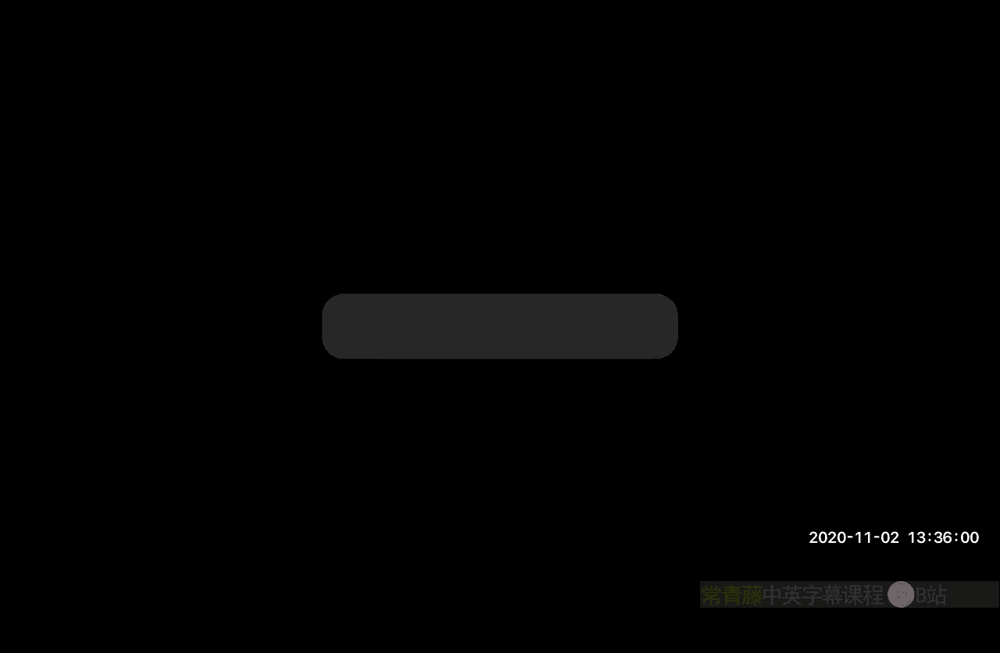
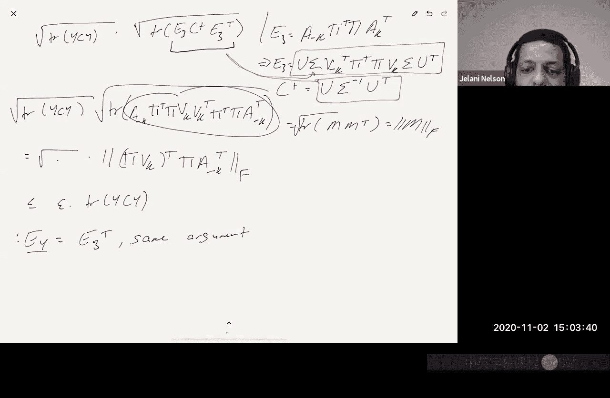

# 加州大学伯克利分校【中英⚡数据流算法｜CS294 Fall 2020, Sketching Algorithms】 p18 P18 Projection-cost preserving sketches -BV11zi7BjEHu_p18-

Okay， hi everyone， so today we're going to cover。Two related things。

One is a concept called projection cost。Preserving sketches。

Which is another way to do sketching to speed up low rank approximation。

 but it can actually do more and one of the things it can do more is it can be applied to。

 for example， can clustering。And we'll talk about that as well today。Its also sometimes called。

PCP sketches。Which may be a little bit confusing because in the theoretical computer science literature。

There is another PCP theorem， which is probabilistically checkable proofs and。As you might imagine。

 this PCP has nothing to do with。🤧With that， with that PCP。So let's get started。So PCP sketches。

This is a concept that was introduced not that long ago by。Cohen， elderder。musust go， must go。In Per。

In 2015。And actually it's a story that is somewhat connected to this course。

The first time I taught a course that covered sketching topics was fall 2013。

Before I joined Berkeley。嗯。😊，And it was not exactly in the same course as now， I mean。

 the topic selection was a bit different， but you know， it still had a lot of overlap。Anyway。

 at the time， elderder， Musco and Musco， those were three students who are in my course and Musco and Musco had a final project that was related to what you're going to see today。

 It wasn't exactly the same。 And then later they。Developed further with elder and brought in two other grad students。

 all of them were grad students at the times it was written。

 they brought in Cohen in pursue as well and then they use this。

Which was published I think in stock 2015 so just some motivation for you all as you're working on your final projects。

 there're actually quite a few examples of。you know I think pretty nice papers that that came out of final projects。

 you know， maybe at the time the final project was submitted at the end of the course at the end of the semester。

 it wasn't quite publication ready。But then students took it home after the semester was over。

 thought about a little more， refined it a bit， maybe brought in their friends and then got some。

 you know。Pushed it to be something really nice and ended up getting really nice paper。 I mean。

 now PCP sketches， I would say， are pretty foundational thing。In sketching for linear algebra。

So what is what is a projection cost preserving sketch okay。

 so it's like the name suggests sketching that preserves the costs of any projection okay。

 so the definition。嗯嗯。😊，Let's say。So for us now， A is just going to be some given matrix。

I'll say that pie。Is I'll say it's an M by D matrix。Is an epsilon K。嗯。

Projection cost preserving sketch。For a。If。For all projection matrices P and I'll call it okay。

 this is the set of all。Ranke orthogonal projections。We have that if you look at。

The Frbenian norm squared of identity minus P。A pi transpose for being storm squared。

So here what I'm saying is look at the matrix api transpose， which I usually you know。

 it's just maybe it's my what I'm used to I'm used to thinking of matrices as linear operators when you multiply by the left。

So if you take the transpose of api transpose， the transpose of api transpose is pi a transpose。

Right so you can think of pi as sketching the rows of a。

 pi is reducing the dimensionality of the rows of a。So take a。

Scatcht's rows project down the rows to a lower dimension using pi。And then， now。

Look at the error you get in formeous norm when you project down project down to P。

 so you look at a pi transpose minus P a pi transpose。😡。

And now what's the what's the error that's left when you do this projection I claim that okay not I claim the definition of an epsilon K PCP sketch is that for any P of rank K this is basically preserved as if you didn't have the pie so it's at most one plus epsilon。

Times identity minus P。A for be norm squared， and it's at least one minus epsilon times the same thing。

 identity minus Pa for benes norm squared。ok。😊，Does that make sense？So。😊，🤧。

Pi is a PCP sketch if it preserves the cost， you can think of again， what is low rank approximation。

 right， low rank approximation。Is we're trying to compute the optimal。The optimal。🤧He。🤧ふ。Which is。

You know， which is equal to， I guess。UK， UK transpose。

Where if you write the SVDA is U sigma B transpose。Right。

So right we know that we know that if know if you're actually trying to do unconstrained low rank approximation。

 find the best rank K approximation of a， we know from the Ehart Young theorem which we saw last week that the best rank K approximation is the trunc K to SVD you know。

 if a is equal to U sigma v transpose， just get rid of the last n minus k rows of u and columns of U and get rid of the last and minus K columns of V。

And you're left with a rank K matrix， that rate rank K matrix is exactly the best rank K approximation。

 that's the Ehart Young theorem。Which is equivalent to saying。Project the columns of a。

On to using the projection operator， which is UKk UK transpose。that's equivalent。嗯。😊，So。😊。

We know that this is the optimal P so what what what PCP sketches let you do is they let you do sketch and solve for low rank approximation right Skech and solve says if I have some really high dimensional problem。

 what I'm going to do is project it to lower dimension。😡，Solve the problem in the lower dimension。

 find the optimal thing in the lower dimension， and then hope and lift it and say this thing is nearly optimal for the original problem。

😡，We already saw that for for approximate regression right。

 we already saw sketch and solve for approximate regression。 we said， look， if pie。

Satisfies an epsilon subspace embedding， sketch and solve works or if pi satisfies a constant subspace embedding instead of epsilon together with an AMM a proxant matrix multiplication property that was Charlotte's analysis again Subspace embedding again sketch and solve works we also earlier in the semester saw that sketch and solve works for k means's clustering as well if you remember when we talked about and it's in the course notes when we talked about k means clustering。

We said cans can be rewritten in the following way。Right， which is like， you know。

 for every partition， the cost of the partition is。Some sum of square distances。

 weighted square distances between points in the same partition。And we said， therefore。

 if you do JL and preserve all the distances amongst all pairs of points。

The cost of any clustering is preserved。 Therefore。

 if you do sketch and solve and do came means clustering in the sketch dimension。

 the partition you find the clustering you find will be an almost optimal partition for the original came means clustering problem Now that was。

 I mean， we didn't use the phrase sketch and solved back then。

 But that's exactly a sketch and solve statement right If you preserve all partition costs。

 all clustering costs， then that means that if you optimally solve or approximately optimally solve the sketched version。

Then that solution you find is almost optimal for the original version。

 that's exactly sketch and solve。So what PCB sketches let you do is they let you do sketch and solve for lower rank approximation right so we'll just hit a with a pi transpose we find we'll find the best or approximately the best low rank approximation to the sketched version and then the projector projection matrix we find。

Is guaranteed to be nearly optimal for the original problem。就。嗯。If。If pie。I a is an epsilon？去。

PP sketch。For a。Then if Piilda star say is the optimal。Rejection for the sketch problem。

And when I say the sketch problem， what I mean is api transpose， right， that's the sketch problem。

Then。exactly the same analysis as what we did before for regression when we first talked about regression。

 you had had something like。The identity minus P till the star。

A for beingni norm squared is at most one plus epsilon over one minus epsilon times。

Identity minus P star。A for term squared。Does that make sense。

 so if you if you optimally solve the sketch version。

 you would have a near optimal solution for the original version。

 saw we saw this already when we talked about regression， right？

The argument is basically saying like the argument was something like。So recap of why。

This is something you've seen already，Just to make sure that it's drilled in your head。

What do we know we know that。One minus epsilon。Times。Identity minus P till the star。

A pervenient is norm squared。Is that most？The same version， but with the pie。Right。

 that's because it's a PCP sketch， the PCP sketch says that。

Pis any pi preserves the cost of any projection up to one false epsilon。In particular。

 look at the projection pizza the start。And then now。嗯。😊，Oh， I see。

 I guess I should have done drawn that in the in the opposite Oh no good， good good。

 So now what do I know now I know that for the for the sketched version。

P Tilda star is better than P star because P Til the star is the optimal for the sketch version。😡。

So this is ut most。Identity minus P star。A pi transpose for beor squared。And then now again。

 I use the PCP sketch property to say that pi preserves the cost of any sketch so in particular mean pi preserves the cost of any projections so in particular P star。

 so then this is at most one pulpsilon。Times identity minus P star。A for being storm squared。

And then you just move things around and you get exactly what I said。If you just take this。

And you compare it with this。You divide both sides by 1 minus epsilon and you get that sketch of solve works。

Okay。😊，So that's PCP sketches。And， you know， I want to say one more thing about them before I go forward into proofs。

嗯。I want to tell you that PCB sketches are more powerful than just。

Unconstrained low rank approximation， they also let you do constrained low rank approximation okay。

Suppose。Arcade。Is a subset of okay。Ar remember okay was like the set of all。Ran K projections。

So now' let's take。Constraint or rank approximation where I want now。He star to be the minimizer。

Over Pete， not all rank K projections， but only those that are in acade。

 which is some subset of rank K projections。😡，对。Then if you do the sketch version。

 you apply pi transpose on the right。You saw the sketch version you get some Pilda star again。

 Pilda star will be approximately optimal by the same exact analysis before because。

Pi doesn't just preserve everything in our probably preserves everything。

 preserves everything in okay。So in particular， it preserves everything in RK。

So if you saw the sketch version， whatever thing you find in RK for the sketchke version will be approximately helpful for the original version。

 okay， and you know what's one place where constrained the rank approximation shows it up Ka means clustering？

Okay。So。😊，Not。This captures。Can' clustering。Okay， why might you ask？

Let's remember what came meanss clustering in let's remember what Ca means's clustering is。

We're given。Points x1 up to xn that we're trying to cluster they' in dimensions。

And also an integer parameter K， which is the number of clusters。And we want to find。

Plusluster center is y1 up to YK。Which minimize the following expression。

The so eye goes from one to N。The min over J from 1 to K。Of X minus yj Lton norm squared。

In other words。For each point， we look at its square distance in the closest cluster center。

 and we sum up those things。Okay。And what we saw in a previous lecture。

 I'm not going to reprove it today if you want it in the lecture notes， you can see it there。😡。

Saw in a previous lecture。In particular when。When doing JL in class。When we first talked about JL。嗯。

We can。You know， like any choice？Of the YJs。Induces。I'll call it a vnoi partition。呃，P。

Which I'll call P1 up to PK。On the set of points。So what is a vnooid partition that's just a fancy way of saying。

嗯。We're going to partition the points based on which center they're closest to。

So P1 is the set of all the eyes， such that X is closest to y1。

P2 is the set of all points that are closest to y2。

 P3 is the set of all points that are closest to y3， etc。And then we can rewrite。

We can rewrite Kaying's clustering as let's try to find the best partition。Which minimizes the cost。

So what we're going to say is we're going to find the best partition。

 then for each partition separately， we can pick the best center for that partition。

And then that's our cost now what you can show is once you fix the partition。

If you ask now what's the best center for a particular partition， for a particular PJ。

 what should I choose Yj to be if I insist that PJ is this set of points？😡。

And you can show that the Yj， which minimizes the sum of square distances within the partition。😡。

Is the centroid， you can show that by taking a gradient and setting it to zero。

 the centroid is just the average point into the partition。Can show that。That the best。Choice。Of Yj。

Is I'll call it muj。Which is the centroid that's one over the size of PJ。Times the sum over I and Pj。

Of Xi， it's just the average of the points there， it's the mean。So you want。

We want basically the argument。Over partitions。Of of that， of the sum。J equals one decay one of a。

The sum I in PJ。Of Xi minus muj L2 norm squared。佢嘅。

So we saw I'm not going to go through the calculation laboriously today because this is something we've seen before。

But Cany means clustering can be rewritten in this way。Okay。

 why is that relevant to constrained low rank approximation？

So let me rewrite that I said that we want。To minimize。The sun。J goes from one to K of the sum。

I in PJ。X I minus ej al or squared。Over all K partitions。P1 up to P K。Of one to N。Okay。

So why is this related to constrained learning approximation？So we'll define a matrix。I'll call it A。

What is this matrix？It has the X's。As it rose。The I throw is Xi。即。

So we're trying to cluster the rows of A。嗯。And I claim that。Any K partition。

 if you look at a K partition and ask what its cost is， I claim that that can be expressed。

As the cost of projecting by a certain rank K orthogonal projection。Why is that。

 let me give you an example。Let's say that。These are the points we want to cluster。So the claim。

Is that the cost？Of any cake clustering。Can be expressed。As。嗯。I minus P。A for me is norm squared。

For a certain。Ranke。Orgonnal projection。okay， so why is that。Let me just give you an example。

 so let's say we have four points and we're trying to cluster into three clusters。

So here I have you have these four points。And then I have another point somewhere here。

And then have another point。And let's say that these points， let's label them， this is x1， x4。

 x2 and x3。Okay。Now。This is a particular。This is a particular。Three partition。

Of the set of points went up to four。Right and I'm just saying that if you have the same color you're in the same partition。

 I could have partitioned these in other ways， but I chose this particular three partition of the four points。

X1 and x4 are in the same partition， x2 is in its own partition by itself。

 x3 is in its own partition by itself。So I'll call this per3 partition P。I can now define a matrix。

And that matrix is defined as follows。Okay。It's going to be n by K， so n here is four。And K is three。

And it's some normalized point cluster indicator matrix。😡。

So XIj is going to be zero if point I is not in cluster J。

Otherwise i'm going to pick it to be a certain non zero and i'm going to pick it i'm going to pick it so that you know like i'm going to get a projection at the end and a finalial projection at the end so what am I going to do specifically so let's say that。

The clusters are。Let's label them red is cluster one。Black is cluster two and yellow。

Is cluster of three。Okay， so x1 is in cluster 1。So I'm going to put a non zero here。

X2 is not in cluster and not it's not in clusters two or three， so open zero zero。X2 is in cluster2。

 so I'll put a non zero here， and then it's not in the other clusters。X3 is in cluster3。

 so I'll put it on zero here， it's not in the other clusters and x4 is in cluster1。

Okay now how do I fill in the non zeros， I'll just fill them in so that the columns are orthoormal Okay。

 basically what I'll just do is。I'll make each like if I put a particular cluster。

 a particular column， I'll set each non zero entry there to be one divided by the square root of the partition size。

😡，So in other words。These two things here， there are two of them。

 so I'll make each one of them be one over square root2， one over square2。

And then in this column there's only one thing， I'll just put a one there and this column there's only one thing。

 I'll put a one there。So。😊，Notice now XP has orthonormal columns。So， XP。Has ortho andoral columns。

Which implies that。XP， XP transpose。Is a rank K。Orthgonal projection。You might ask the question。

 Glani， what if you choose to make one of the clusters empty？That's fine。

 if you make it cluster empty， just pretend it doesn't exist。

So then now you only have k minus1 clusters or something less than k clusters。

 so now XP will have fewer columns， it'll be a projection onto to an even lower dimensional space。

 it'll be a rank K minus1 or some rank K prime orthogonal projection where K prime is less than。

Here probably asking okay。And in fact， I should say a PCP sketch， let me see how I defined it。嗯。

I mean， what we're going to show today is everything is going to work even if it's rank at mostk。

So let's see here， set of all rank at most K re projections。T。

So it's going to preserve not only k clusterings， but if you choose to use less than k clusters。

 it'll preserve that too， that's fine。Okay， so now what we're saying is， Okay， so good， so so good。

 so I defined this matrix， but so what。So the observation。Is that if you look at？

XP XP transpose and apply it to A。The rows of this matrix。Are the centroids？

Of the corresponding partitions。This is just a computation， which maybe I'll let you do offline。

What I mean is if you look at A。You know， A is a matrix that looks like。X1， x2。

 all the points that you're trying to cluster， and then you look at this matrix X P X P transpose a what I claim is that。

嗯。The centroid。Of x1's partition。The centroid of x2s partition。Et cetera。

I claim that it just maps each row。Two the cent rate of the partition that that row is in。

 according to the K partition P。Okay， so that's just the this is the fact based on how we define XP that that's pretty easy to verify。

 which I'm not going to spend time on doing right now。Which means。This implies that the cost。

Of that partition is exactly。嗯。A minus Xp Xp transpose a for B from squared。

 just look at it row by row。Row by rh， this difference matrix is x1 minus it centroid。

Now for me norm squared， we'll square that rose norm。Plus， x2 minus8 centroid。

 square that added and et cetera。唔该。So this implies that K means。objectivebjective。Is， you know。

 like the min overall， I'll call it overall projection matrices P。Not I don't want to reuse PPP。

 there was a partition， let me use something else Q。In。跳车。QK is like the set。Of all。

Ran K projections。That looked like。You know， XP，xP transpose。For some。K partition。P。

So it can be written as basically identity minus Q a。3 as square。

Which means if you have a PCP sketch， you can do sketch and solve。So good。

Now that I've done a little bit of motivation， what I want to do is。Kind of write down the theorem。

The theoryor is going to say that as long as pie satisfies。A certain number of deterministic。

 I think， as long as pi satisfies four deterministic properties。

Those properties guarantee that it will be a PCP sketch for A。And what we're going to see is。

 one of the properties is going to be that it's a subspace embedding for a certain K dimensional subspace。

ok。😊，And the other properties are all going to be basically approximate matrix multiplication events。

 which， by the way， if you remember， one way to get AMM approximate matrix multiplication with Frbenous norm error。

Is to have the jail moment property。So that was something we saw when we talked the first thing we talked about when we talked about。

Sketching for numerical inner algebra was using it for approximate matrix multiplication。

We said that one thing you can do is you can sample rows where the probability that you sample a row is proportional to its L2 norm。

If you remember that， and then we said the other thing you can do is instead of sampling you can do a kind of jail kind of sketch you just pick an oblivious random matrix and we said that as long as that distribution you're drawing from satisfies the so-called you know。

 epsilon Delta jail moment property。Which， you know jail mat which Gaussian matrices do fast jail does far jail does count sketch does。

 you know， if you're drawing from a distribution that satisfies this jail moment property。

 then with good probability you will get。Approximate matrix multiplication for any fixed two matrices。

Okay， so so in other words， what we're going to see now in this analysis is。

If you have if you have a subspace embedding an oblivious subspace embedding， if you're okay。

 so let me put it like this if your distribution over matrices pi satisfies two things at the same time one。

😡，It's an oblivious subspace embedding。Two， it has the jail loan property。

If it satisfies those two things simultaneously， then by a union bound over the events that we're going to need to condition on。

 you will be a PCP sketch with good probability for any fixed matrix A。Okay。

And if as you're going to see， you know， based on kind of what errors we need， what。

 what dimension will need to be a subspace embedding for， it's going to turn out that。😡，You know。

 a random Gaussian matrix， for example， will be a PCP sketch as long as the number of rows is at least k over epsilon squared。

😡，Okay。We're also going to see that。If you take， for example， account Sc。Account sketch， you know。

 count sketches also give Os that was by Clarkson Woodruff。

 and they also have the jail moment property。 So if you use the count sketch。

 we're going to see that。You're also going to get。🤧嗯嗯。😊，You're also going to get。The PCP sketch。

 as long as the number of rows is something like K squared over epsilon squared。Okay。

Can ask a question Yeah so so the sketch and solvebound implies that we can actually solve these optimization problems right。

 but as far as I know K means like it's like clustering it's actually kind of it's actually like you can't actually solve it right So yeah。

 you can't bounce on like actual algorithms I there a way to that's a very good question and were going actually going talk a little bit about that you know right after we finish talking about PCP sketches but。

😊，In fact， it's what you can show is you can even like if you just approximately solve。

If you approximately solve the sketched version， you don't have to optimally solve it。Okay。

 if you approximately solve the sketched version， that also will imply that the solution you find is approximately solving the original version。

Maybe we can even see that right here。So if you look here， right？Kind of， I think what you're。

The thing that will change in the analysis basically is just this。This inequality right here。

So what you're saying is， look。When I have the sketched version for K means。

 let's say or even for some other constrained la rank approximation problem。

It might be very hard for me to find Pel de star Pel de star is the optimal。

Projection for the sketched version and K means is an NP hard problem， right。

 but maybe I have some approximation algorithm。That lets me find some other P Tilde where P Tilde is not a。

 it's not the optimal， but let's say it's guaranteed to be at most alpha times the optimal。

 it's an alpha approximation algorithm。😡，Now what I can say is basically here， I can say。

Identity minus P Tilde times blah， blah blah squared。Is that most n， is that most alpha？

Times identity minus Pta to star。Times blah， blah squared。

And then now I can replace that P Tda star with P star just like I did here。😡。

And then continue so what you'll end up getting is that， you know。

 if if you can alpha if you can alpha approximate the sketch version。

 the solution you find there will be within alpha times one plus epsilon of optimum for the original non sketch version。

😡，Does that make sense， Yeah yeah， I see， thank you， Yeah no problem。So yeah。

 so even it doesn't have to be it't it's not just that optimality carries over to approximate optimality。

 it's also true that approximate optimality also is lifted to approximate optimality。😡。

You don't have to optimally solve the sketch version。That's a very good question。Any other questions？

Okay， so if there are no other questions。🤧。Let's prove the theorem。嗯。State the theor and prove it。

So actually before I state the theorem。one other auxiliarylemma that I don't actually need to state and prove the theorem。

 but when I state the theorem， I think it'll help you to know that this lemma is true。Okay， so。

Recall， I meant to be hes blacking。So recap。嗯。We say pie is drawn。From a distribution with the。

Epsilon Delta PjL moment property。Yes。😊，For all vectors， you have unit norm。

We have that if you look at the LP of。Pi U L2 norm squared minus1 LP norm。 So here again， remember。

 this means expectation of that thing to the P to the whatever P。If this thing is at most。

 epsilon times delta to the 10 repeat。Yes， that's it， okay。

 so that's the definition of what it means to satisfy the Epsilon Delta PG and enrollment property。

And we've already talked about this before and we said if you have this for P at least two。

 then you know pi will also give you the approximate matrix multiplication as well。

Now I want to show you that。The the JLMP gives you something else as well。Suppose。Pie drawn。

From the distribution。With the Epsilon Delta P JL Mowe property。For some P， which is at least one。

Okay。Then for any matrix M。I have that the probability over pi。Of。

Pi m for squared minus m for squared。Is bigger than epsilon。Times what it should be。

Is that most Delta， is that most Delta？Okay。😊，So this looks a lot like distributional jail right distributional JL says for any fixed vector。

 you preserve its L2 norm with high probability。This is saying that。

IfIf your distribution pi for pi set， also if it gives you distributional jail for vectors and it gives it to you via the jail moment property。

Then not only does pi preserve the norm of vectors。

 it also preserves the norm matrices for free under forbenous norm。Okay， and this is。

 this is not a complicated lemma， but we can prove it right now。

It's basically via the triangle inequality using the fact that this norm on random variables is in fact the norm。

This thing is in fact the norm on random variables， and we're going to use that fact。

So say M looks like this。It has columns M1。M Z， let's say。有边。Then we know that。You know。

 if you look at m for ven norm squared， you can just do it column by column。And if you look at pi M。

For beingorm squared， you can also do that column by column。So that implies that if you look at。

The penor。Of pi m for be norm squared minus m forbe norm squared。Just by triangle inequality。

 this is at most the sum overall eye of the penors of these things。This is now L2 normm squared。

Minus MI L terms squared。And then you can just know divide divide MI by its norm and then carry the norm out to the outside and then just apply the jail moment property so what the jail moment property says is that this is at most the sum over I of the norm squared of MI times epsilon delta to the 1 over P。

😡，But of course， this thing here is just the forbeous norm squared of M。

 so this is equal to epsilon delta to the 10 p times m forbei norm squared。Okay。

 and then now what do you do， you do Markovs inequality。 This implies that the probability。

This is called this thing。This is called this event like Star。The probability。Of star occurring。ok。

By Markov on if you applied the P power to both sides。😡，Is that most？The penor。

Exactly what's above here or the P norm to the P。Over。Epsilon to the PE times。

For being a storm squared to the peak。Okay。And you know， that thing is at most Dta。他是的心。ちとちゃ。

So if you have the jail moment property。Then you know。Not only do you preserve the norms of vectors。

 but you also preserve the norms of matrices under Forme storm for free。

 it's just a consequence of triangle inality， it's nothing too complicated。

So now that you've seen this， now I want to。State the theorem for PCP sketches and you'll see from the conditions you'll be like oh that that follows from jail property that follows from jail loan property that's a subspace embedding that's jaillo property so you'll just be able to now that you're experts and all this stuff。

You'll be able to basically read off kind of what sketch dimension you need to make this all work。

Okay。So theorem。And this is due to， you the paper I said， cohen at all。2015。Suppose。A is given。

And it's U sigma V transpos。That's the SVD。Okay。And also， you know， we know that。Yeah。

 so like aK denotes。嗯。UK， Sigma K， Vk transpose。And a minus k denotes。

Basically a minus a minus a minus a So in other words it's。you know。

AK is like you project using UK UK transpose。A minus k is the orthogonal。

 as you projected the orthogonal space。So you project using identity minus UK UK transpose。

 for example。Then。If pi satisfies the following properties。F properties。去嘅。😊。

It is for Epsilon comma K PCP sketch。So what are the properties that I wanted to satisfy？First。

 Pi is an epsilon subspace embedding。For the row space。Of Ak。8K is a rank K matrix。

So it's row space has dimension K。So this means you have to be an epsilon subspace embedding for a particular subspace of dimension K。

So again， if it's a Gaussian impliess Gaussian， then how many rows do you need K or uppson squared？

If it's a count sketch matrix， you need K squared overs long squared， et cetera。

 I put actually added a table to the course notes。So if you look at。

 if you look at the course notes let me actually pull up the course notes myself。

 if you look at figure 6。1 in the course notes， it's in one of the subspace embedding sections。

 it just lists for a bunch of different distributions。Like。

WhatHow many rows do you need to make that distribution be an OSE in oblivious subspace embedding so you know if you ever just need a table to look at it has it for kind of spars subspace embeddings for count sketch for the fast jail transform。

 also it has it for non oblivious ones such as for example， leverage score sampling。

But if you don't have that thing memorized right now that's okay。

 but basically this requires K of reps on squared rows。

 you can get away with K of Rs on squared rows。Okay， what's the second thing you need？

The second thing you need is if you look at。A minus k。Pi transpose for beingor squared minus。

A minus k。For being norm squared。Okay， I want this thing to be at most。嗯嗯。😊，诶。

So let me not square it。Yeah， this is for venius Yeah， For venius sort。Oh， anyway， I okay。

I want this thing to be ut most。Epsilon times。A minus k for me squared。So。嗯。

Let me just write in red so this is like this is。🎼Subspace embedding。

This is Epsilon Subspace embedding。For dimension K。This is approximate this is actually the lemma。

 let me let me number that lemma， So let's call this lemma one for today。

Lema1 says if you satisfy the jail moment property。

 then it implies that not only you reserve vectors， but you also reserve matrices。

So this is basically。TheIt was basically the jail moment property。

 so this is like the epsilon Delta P。Jail Mo property。By luma one。Okay。

The other thing you want is you want approximate matrix multi so in particular， if you look at。嗯。

A minus a。A minus k transpose minus。The sketched version， which is a minus k pi transpose。

 pi a minus k transpose。The is norm。exactlyactly approximate matrix publication。

 you're approximately multiplied two matrices by first sketching them using pi then and then asking now what is your error and I want my error to be at most。

😡，Epsilon over root k times a minus k for d storm squared。So if you remember you know。

 the connection between jail moment properties and approximate matrix multiplication。

 this basically means you need。Epsilon over Root K comma， you know， Delta P Jalo property。You know。

 by previous lectures。And then the fourth one is also going to be an approximate matrix multiplication。

 So now what I'm going to do is I'm going to look at。pi vk。Transpose。Pi a minus k transpo。Okay。

 now I'm going to look at the ver drum squared of that。

And I want that this thing is at most epsilon over Ro K。Times the Forennious number of VK。

Times the norm of a minus k。Again， this is just straight up。Approximate matrix location。

 why because remember now。VK and v minus k are orthogonal to each other right V minus k is like the orthogonal subspace to Vk so if you look at you know if you were to look at。

What's the actual？Pretend it was not sketched and ask yourself just like what's the actual matrix product while it's Vk transpose times a minus k transpose。

ok。But a minus k。呃。A minus k okay。A is U sigma V transpose。

 which means a transpose is V sigma U transpose。 So this thing here is just V minus K， Sigma minus K。

You minus k transpose？But now。VK transpose v minus k。Is equal to zero。

 right becauses ofk the columns of VK are orthogonal to the columns of v minus k。喂。😊。

The columns of VK are the first K columns of V。The columns of v minus KR， the other columns of V。

All the columns except for。The first K columns And remember now V has orthoormal columns。

 so the first K columns are orthogonal to the remaining columns。

 so all those dot products there are zero。So you know， you could imagine。

 you could imagine that you actually had a minus Vk transpose a minus k transpose here。

 then it looks exactly like AMM， but the point is you don't need that because this is just zero。Okay。

So how do you get this again， you get this via the gentleman property， Epsiloner K Delta P。

Gentman property。Again， by the previous lecture when we talked about approximate matrix multiplication。

Okay， so I know that maybe it looks scary， it looks like a mouthful， there's a lot of stuff。

 a lot of symbols。But basically， again， as I said before， it just boils down to two things。

You know what are the dominant things here， the dominant things are one。

 you need to be an epsilon subspace embedding for dimension K。😡，Okay。

 you need to be epsilon gel moment property， but you also need epsilon over Ro k gel moment property。

 which is even harder because that's even smaller error， so then you also need this。😡，Okay。

So as long as your distribution for pi has both of these properties。

You will be with good probability a PCP sketch。Just by union bounding。

 imagine you set Delta to be Delta over four。Then your union bound over all these four events that you satisfy all these four events simultaneously。

And you're golden。ok。😊，so。Any questions before I dig into showing why？The theorem is true。

 why is it that if you satisfy these four conditions， you're a PCP sketch。Questions。

About the statement or about anything that I'm saying。Okay。If not， then let's begin the prove。

It' so proof。And I'm going to I know like I don't expect you to keep these four conditions in your head。

So I may occasionally have to flip back to this page just to be like， oh look， that's condition one。

 and that's condition two， et cetera。Or maybe I'll just state it。

Have you trust me that that was one of the conditions that I wrote down？So our goal。Is to show。

What that for all P and okay， okay again， is remember。

It's a set of all rank care orthogonal projections that we have。

1 minus epsilon identity minus P for being norm squared is at most。When you have the pie。

 the sketched version。你一齐。Now。I'm just going to from now on just write identity minus Ps y。

Because otherwise I'll go crazy writing lots of letters。And。You know， fact。

The Frbini norm squared of a matrix。Is just equal to the trace of M transpose M。系。

It's also equal to the trace of MMm transpose。I guess this here is like the so called。

Cclical property of trees。Namely， that trace of AB is equal to trace of B。

As long as the dimensions make sense。So as long as you know。

 a times B might make sense in terms of matrix dimensions， whereas b times a doesn't， but the claim。

 you know this is just a fact you can easily verify by。

The definition of trace or the definition of herbeemia arm or here the definition of trace as long as A and B have conforming dimensions and。

As long as I guess this means that AM andmbFv square。But basically。

 as long as this makes sense in terms of dimensions。

 then it's true that the trace of AB and the trace of BA are the same thing。Okay， so you know。

 that that means that you can move， you can move this M over here。And you get trees of home transpos。

Very good。 so now I'll define。C to be AA transpose。

That implies that if you look at kind of Y a for beingn norm squared， that's just equal to the trace。

Of why a。A transpose， Y transpose。But why is a symmetric matrix， why is a projection matrix itself。

 right it's the projection onto the orthogonal space。😡。

So any projection matrix can be written as QQ transpose for some matrix Q with orthonormal columns。

So QQ transpose， the transpose of that is QQ transpose， so any projection matrix is symmetric。So。

Why transpose and Y are the same thing， so I can get rid of this transpose。And this is just C。

So what I want。Is that for all why that come from okay， for all why what I have is that。

One minus epsilon。The trace of YCY。Okay。Is that most？The trace of why。A pi transpose， pi a transpose。

Is at most one plus epsilon times the trace of YCY。Good， what this is the equivalent。

 this is what I want to show。What I'm going to do is I'm going to decompose。A as。A K plus a minus k。

Okay， should there be an extra y at the of the second the end of the second trace you wrote？

Right there， yep， thank you， I that the one you're talking about？Yeah， okay。 yes， I put it there。

 thank you。So I'm going to decompose a as a k plus a minus k。

 and that implies that if you look at the trace。Of y a pi transpose pi a transpose y。Okay。

 I know that again it's a mouthful， so now I'm going to substitute in。A as ak plus a minus k。

And I substitute it again in this is the same as AK transpose。Plus a minus k transpose。

 and then I do some distribution， I'm going to get four terms， right？

And it's going to look something like。The trace of。

Yhy a K pi transpose pi A K transpose Y plus the trace of。A minus k pi transpose。派。

A minus k transpose y。 And then I get the cross terms plus the trace of Y a K pi transpose pi a minus K transpose y plus the trace of。

A minus b， there's a y there。A minus k， pi transpoposed pi， a KY。AK transfer is why， Okay， sorry。

 again， that's again， it looks like a mouthful， but hopefully what I'm doing is not。

Even though it looks like a lot of symbols。I think I'm not doing anything conceptually complicated right now right I'm just writing I'm decomposing a as the the projection of the columns into one subspace plus the projection of the columns into the orthogonal space。

 that's ak plus a minus k。So now。Remember now I'm I want to look at。I want。I want to understand。This。

 these four terms minus。The trace of YCY。And I would like to say that when you look at the difference。

 it's at most epsilon times the trace of YCY。So I can do the same kind of decomposition for YCY and also get four terms。

And then now let's look at those four differences separately， I'm going to define them now。

I'm going to define E1 to be the first difference， which is now ak ak transpose okay， minus ak。

Pi transpose pi ak。I'm going to define E2 to be the version of the minus case。A minus k。

 a minus k transpose， minus a minus k pi transpose。Pi a minus k。

 and then you you probably guessed it。have to do to deal with the cross terms as well。Okay。

 so this is a minus k。Pi transpose pi。Okay， okay， why didn't I write down。

 you know the version without the pies， there should be a transpose here。

I forgot some of my transpos。Why didn't I I should also write down you know minus a minus k ak transpose。

Why didn't I do that？I could have also said， you know， there's a minus here， you know， a minus k。

 I want to look at the difference between the non sketched version aK transfer。Like。

 why didn't I write that down？Let takeers？It's 0。Yes， and zero right again because this is。

What is this， this is u minus k sigma minus k v minus k transpose， and the other thing is VK。

Sigma K UK transpose。And this right here is zero。Again， because。

Those columns of V are orthogonal to the other columns of V。So I don't have to write this。The zero。

And then E4， we'll look at the similar other part， AK pi transpose pi。嗯。A minus K transpose， right。

 and why am I doing this again， if you look at the previous whiteboard。I'm trying to compare this。

With the version that doesn't have the pies， which is this。嗯。So write what I want。I want that。

The trace of。hy a。Pi transpose pi a transpose y minus the trace of Y， C， Y。 I want this thing。

To be at most epsilon times the trace of YCY。Okay。喂。This now。🎼Is exactly equal to the trace of。Y E1。

 y plus the tracea plus。Y E2 y plus Y E3 y。Plus Y E 4 y。And trace is a linear operation。

 so this is the sum I goes from one to four of the trace of y。而 iy。Okay。

So if I can show that each one of these things is small。If I show that， this thing is at most。

Epsilon times the trace of YCY。Then I'm done， I'm golden。Right。Because I'm getting four of them。

 I get four epsilon trace of Y C Y as my error， which is exactly the theorem statement。

 The theorem statement said， I'm going to be a four epsilon。PCP sketch。

That four is exactly because there are these four terms that I'm going to bound separately。

Each one is going to give me epsilon。O。😊，So that's where we are。Now it's just a matter of executing。

Namely showing that each one of these four terms is bounded the way I want it to be bounded。

So before we execute any questions about where we are or how we got here， sorry。

 and I see that there's a question in a chat。Now we pull it up。We' were just talking about the trace。

 Oh oh yeah， yeah， yeah。Yeah， okay， so any questions about where we are or shall I continue？Okay。

So good。Let's just do them one at a time。系样。So。Let's not focus on E1。So the trace。

So let's just say that。You know， why is a matrix？Let's write it down， it has certain columns。

 let's just call these columns y， y andippt to， you know， etc ce。The trace of Y E1。Why。

Whathy is that？That's just equal to。The sun。呃。就。The sum over。Over I。Of。AK transpose Yi。

El syndromeum squared minus discussed version。Okay。But then now what do I know。

 I know that pi is an epsilon subspace embedding for the row space of AK。

AK transpose Yi is a vector in the row space of AK。Right。So this thing is at most。

The sum over I of epsilon times the norm squared of AK transpose Yi。Which is exactly equal to。

Epsilon times the trace of。呃。Why。I'll call it C。喂。Where C now is remember？A呃 C。

Is equal to AA transpose。 So C K， what I mean there is basically。AK， AK transpose。冇钱。

And this thing is at most epsilon times the trace of YCY。T。So E1 was very easy。Okay。

Questions about this before we move on to E2， the other ones are the ones that are going to be a little more complicated。

 so if you have questions about this one already， then you should speak up。Okay。

So let's now do the other ones， which， you know， there are some couple clever tricks here and there。

So what is E， first of all？E2 is the version of a minus k。Right， this is E2。

So it's the version of minus。对。Okay。So。Remember now what is y， y is just equal to identity minus P。

 right where P is a rank K orthogonal projection。So we're looking at the trace。Of y， E2 y。Okay。

This is equal to this is the cyclical property of trace now， this is equal to trace of y y E2。

Why squared， what's y squared？Any takers on that？Anyone feel。Comfortable with their linear algebra。

It's just a why again， Yeah， why is a projection matrix， right It's an orthogonal projection。

So right projections are what's the linear algebra term idotent， I think。

 right if you take a projection square you get back the same projection。

I mean that makes sense right a projection matrix looks like uu transpose if you square u transpose you get uu transpose uu transpose in the middle you have a u transpose U which is just identity。

So you have you transpose again。So any projection matrix squared， you just get it back。

So this is the same thing as。The trace of YE2。Whi you remember what y is。

 this is equal to the trace of。E2 minus P E2。Okay， and now let we use triangle inequality。

 this at most the trace of E2。Plus， the trace of。P二钱。有钱。Now what's the trace of E2， what is E2？

It's the version of the minus case。 So let's just write it。 What is this thing， This equal to。

The trace of。A minus k， a minus k transpose minus。The version with pis， a minus k pi transpose。

 pi a minus k transpose。Okay。And again， just remember the other fact that trace of MMm transpose。

Is the Frbeius norm squared of M？And also traces linear。

 trace of a plus B is equal to the trace of a plus the trace of B。

So I can apply linearity to separate out that minus sign and then I get a trace minus another trace each one of those is of the form mm transpose so this is the difference of two squared forennius norms this is just。

A minus k for be norm squared。minus。A minus k pi transpose for being square squared。Right。

And this was one of the conditions， so if I go back to my conditions。Yeah， right。

 the second condition， it says that when you apply pi on the right， it preserves the Frbeius norm。

So that was one of my conditions。I'm not making stuff up here。Okay， so let's oops。

So let's use that condition， So this is at most now epsilon times the norm。Of a minus k。

Maybe this from squared。Now what do I know about a minus k for being storm squared again？🤧。嗯。so。😊。

Okay， so now let's just remember， we're trying to get。

We're trying to get bounds that look like trace of YCY， right？Remember now we want。We want。

Errors that are at most something like epsilon times the trace of YCY。

 which if you remember what does that mean， that just means epsilon times the Frbeni storm squared。

Of identity minus PA。This thing， right trace of YCY is exactly that。

Where P is some rank K orthogonal projection。O。What is a minus k？A minus k。呃。Did I forget a why？

Oh that's just answering a previous question。 So what is a minus k a minus k is the error you get left when you apply the optimal rank K approximation to a so a minus k is like I minus p star times a where p star is the best rank K orthogonal projection。

😡，Okay， so in particular， the norm of a minus k is only smaller than smaller than or equal to the norm you get by applying I minus P。

😡，So， this。Is at most。Epsilon times。I minus P A for the screens。

Which is just epsilon times the trace of YCY。So I'm happy with that。So I'm happy with this part。Okay。

 now what do I do about the other part？Okay， for the other part。What I do is the following，嗯。

Remember now， the trace of a matrix， PE PE2 is a real symmetric matrix。喂。诶。😊，What is its。

 its trace is the sum of the eigenvalues。Okay， so by Kohi Schwartz。

 the sum of the eigenvalues is at most the L2 of the eigenvalues。Times the rank of the matrix。Okay。

 what's the rank of P2？So this is the sum of the eigenvalues。

Which is at most square root of the rank。Times。The L2 of the eigenvalues。What's the rank of PE2？Well。

 it's at most the rank of P。And P has rank K， it's a rank K orthogonal projection。

So the rank is at most K。So this is at most root k times the L tuneal of the eigenvalues。

What's another way to write the L2 norm of the eigenvalues？Anyone， yes， for me sir。

So this is just the Frbenious norm of E2。嗯就。I guess what I'm using is。嗯。It's really pe too。But again。

 P is an orthogonal projection， so P cannot increase the norm of anything。

 so this is at most the norm of E2。And this is the thing that。诶。We just bounded。Which is at most。诶。

So this thing is at most， basically。Was this one of my？Conditions。Yeah， so this is condition three。

Right this is just E2。Okay， so condition3 says that the Frbeius norm of e2 is at most epsilon over k times a minus k forbenius norm squared。

So that's exactly what I have here。Multiplily by the roquet， so the rootque goes away。

And this is at most epsilon times。A minus k for the instrument squared。

hich is exactly the same thing that I already had here。It it's the same thing。

 so this is at most another epsilon times the trace of YCY。Now that I look at this。

 I think I I might need to slightly adjust my theorem， any not in any way that matters that much。

 but I think this four epsilon needs to be a five， maybe let's see if let's see if I forgot another epsilon。

 maybe I need to make it a six。Right so the point is when I handled E1， I picked up one epsilon。

When I handled E2。I actually picked up two epsilons。Right， this one and this one。

And then so that's three so far， I think E3 is going to give me another one and then E4 is going to give me another one。

 so I think I'm going to get five epsilons altogether。Okay。So let's continue our march onward。

So what is E3？E3 is。E3 is I have an a minus k and I have an ak。So it' was one of the cross terms。

Yeah。First thing to note about E3 is this。know， both E3 exps are in the calm spaces of A。

Okay so how am I going to use that fact？This thing here is what is E3， it's equal to。

Was itda minus k or K minus k？A minus k pi transpose pi a K transpose。I's in the calm space。

Of a also。E3 transpose is also the common space array。So this in particular， this implies that。

If you look at CC pseudo inverse。Right， any matrix， if you take AA pseudoinverse。

 that's just we talked about this before when we define pseudoinverse。

 AA pseudoinverse is the projection onto the column space of a。

So CC pseudo inverse is the projection onto the column space of C。But C is just AA transpose。

 so the column space of C is the same thing as the column space of A。

 so this is just the column space of A。So CC+ is just the projection on the column space of A。

 so if you apply it to E3 transpose， this is just E3 transpose。

Because E3 transpose has columns that are already in the column space of A， so if you project it。

 you're not changing anything。So now let's start doing some computations。

 so if we look at the trace of Y E3 y。Again， okay， so this is the same thing as the trace of the transpose。

RightThe trace of a and the trace of a transpose are the same thing that's all I'm using here。

 and again I can use the cyclic property of trace to move the y over。

 use the fact that y squared is equal to y so this is the same thing as the trace of y E3 transpose。

Okay。And then now I can use the property that I just said。If you project onto the column space of a。

 you get back the same matrix E3 transpose。 so let me just put that projection operator in there it doesn't change anything。

Okay。And then now this is， let me write this down， you might not be familiar with this notation。

 but I'll explain what it means。Okay， so what does it mean to take the square root of a matrix？

So whenever you， you know function matrix functions， if you take them。

 let's say M is equal to like u sigma v transpose。Um，Where sigma now。

 sigma is equal to like this matrix that has all the singular values in the diagonal。

When I say I say f of Sigma。What I mean is you'll apply the function to each of the Sigma I separately。

This is just notation。And now F of M。Is just defined to be U F of sigma B transpose。

So when I say C+ to the one half， what I mean is take C+。

 write its SVD and then just apply this square root function to each singular value separately。Okay。

Now， what do I know about C？C is a real symmetric matrix。In fact， it's PSD。Right。

I can because it's real symmetric by the spectral theorem， I can write C as， well， I mean。

 first of all， we already know what C is， I mean。Notice that。C is equal to AA transpose。

 which if you expand out what A is U sigma V transpose。So this is just u sigma squared u transpose。

In other words， C plus is equal to u sigma minus 2 u transpose。So when I say C plus to the one half。

What I really mean is you s to the minus1 you transpose。

so now you can just easily verify c plus1 half times c plus1 half is in fact。C plus。

 which is u s minus2 u transpose。Okay。And then now。

What I'm going to do is I'm going to use Koshi Schwartz。so。😊，You can define dot products on matrices。

 inner products on matrices where you say like I just define。A dot B。To be the trace of。

A transpose A， A transpose B。And， you know。If you just。So basically， what does this mean？

It means like treat A and B as it basically means treat A and B as big vectors and take their dot product as vectors。

So let's say a is an n by N matrix， treat it as an n square dimensional vector。

 treat B as an n square dimensional vector， and take their dot product。Okay。😊。

So we know by Kohi Schwartz that when you take the dot product of vectors， it's at most the norm of。

The first vector times the norm of the second vector， the L2 norm。

So here we want to take the L2 norm of a times the L2 norm of B。😡，If you treat A as a big vector。

 what's a celloon norm， that's the forbenius norm So this so this means that kshi Schwartz for this inner product。

😡，Is at most the Frbenius number of a times the Frbenius number of B？

Which if you remember what Frbeoor means， this is just the square root of the transpose of a transpose a times the square root of the transpose of B transpose B。

That's just what Ferminus's norm is。So if you apply that koshi Schchwartz here。

 you get that this is at most square root。Of the trace of Y C plus CY。Okay。

 times the square root of the trace of。E3 C plus E3 transpose。

I know this this's a lot of symbols to maybe， you know maybe you're getting lost in all the symbols。

 but all I'm using is I'm using this。That's what I'm doing 。Okay。Now I can simplify this further。

What's another name for CC+ C？If you haven't， you know， if you're not used to seeing this again。

 just remember CC+ is the orthogonal projection onto the column space of C。😡，So what is CC+ C？Yeah。

 you project C onto its own column space so you get back C。

So this is equal to the square root of the trace of yC times the square root of the trace of the other thing。

Okay。Okay， so now its okay， so let's go to the next。

 this is the part that maybe we'll so we now so far we're up to this trace of y C Y times the square root of the trace of E3 c plus E3 transpose。

Okay， so now what is E3？E3 is this thing over here。

 So we said E3 now just remember what E3 is is equal to a minus k。

Pi transpose pi ak plus ak transpose， sorry。So if you write down in terms of the SVD。

 this implies that E3 is equal to。U sigma v minus k transpose pi transpose pi。VK Sigma， U transpose。

Okay， and also remember that C plus。C plus is equal to what I say u sigma minus1 u transpose。

So this is going to look like a mouthful， but I promise you and I think I'm almost out of time。

 so let me not let me not bother even trying to do this。You know。

 in front of you because it's just a bunch of symbols， if you just now， look， what do we have here。

 we have E3 C plus E3 transpose。I've told you what E3 is。If I expand it in terms of the SVD of A。

 E3 is this。And I told you that C+ is this。If you just plug these two things into here。Okay。

 I promise you that what you're going to get is so you still have that trace of YCY。

What you're also going to have is。Something that looks like times the trace of a minus k。

Pi transpose pi。VK， VK transpose。Okay， times pi transpose pi。A minus k transpose。

I know that looks like a mouthful。And this now and there's a square root。Okay。

 and this is equal to square root of that thing times。

This you can write as the trace of MM transpose for a trace of AB transpose for a particular A and B。

Sorry sorry what I wanted to say is you can write you can express this now as like the trace of MMm transpose。

 which is just the Forbenia storm squared of m for a particular m and what is that m it turns out what you're going to get is。

And there's a square root here。It turns out the three storm you get is pi VK transpose。Times。

Pi a minus k transpose。And then this is the forgiveness of that。And lo and behold， this is again。

 approximate matrix multiplication。Vk transpose a minus k transpose is again， zero。Because。

The rows of Vk are orthogonal。To the rows of a minus k。So this is basically again。

 approximate matrix multiplication between between VK and a minus k transpose。

 and that was also our final condition here or maybe it was our third condition like I don't remember。

 yeah， it was our final condition。Which was an approximate matrix multiplication condition。

 which was this。This thing is bounded。And again， this thing is at most。

The square root of the trace of YCY。Because again， by the same thing we said before。

 a minus k is the optimal thing。It's the optimal error after you project with a rank here orthogonal projection。

 so it does better than what P would do and P gives you the de square root of the trace of YCY。

So all in all。嗯。All in all， you're going to be happy Okay， is the summary。 So all in all。

 this thing is going to be at most again， some epsilon times of trace of y trans Y you see Y and then E4 I'm out of time。

😊，E4 is just equal to E3 transpose， so it's the same。Argument。

RightBecause what we want is we want we want and that's exactly what we just bounded。

 right we actually just bounded this。This is the same thing as the trace of why。衣火 why。

So we've already actually bounded it。对。So that's it。I know that looked like a lot of symbols。

 but it will be uploaded to the course notes within today。

 so you can take a look at the calculations more slowly if you'd like。So let let me pause。

 that's it and any questions。

I have a question about E2。