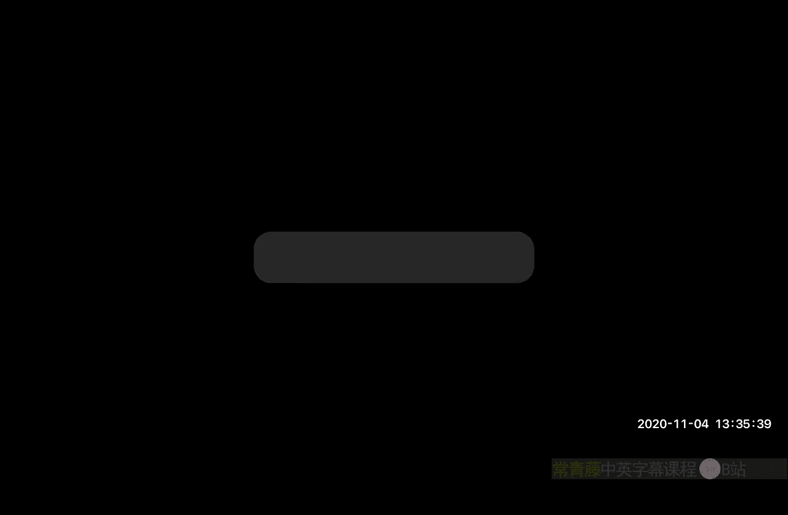
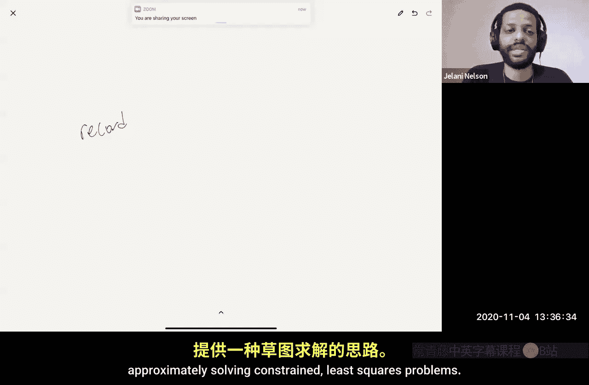
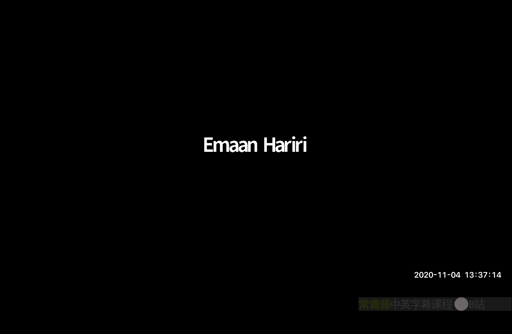
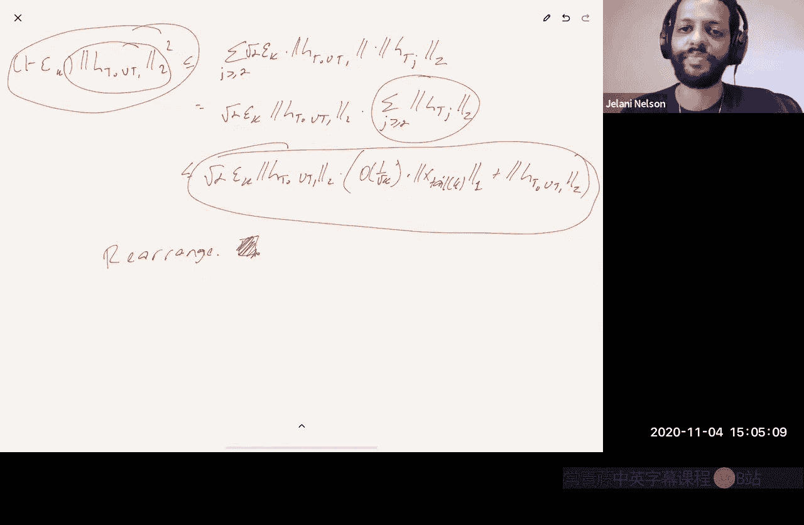

# 加州大学伯克利分校【中英⚡数据流算法｜CS294 Fall 2020, Sketching Algorithms】 p19 P19 K-means, compressed sensing, RIP, basis pursuit -BV11zi7BjEHu_p19-

Okay， so today what I want to do is I want to wrap up。嗯。We minimize sketching for linear algebra。

And I'm going to talk specifically just about K means。

And then we're going to start on compressed that same。So K means。嗯。

We saw last time that cameians can be expressed as a constrained or like approximation problem。

And then we saw this idea of PCP sketches， projection cost preserving sketches。

That say if you use one of those and really those are just themselves。

 basically subspace em beddings and JL matrices to project your problem， it'll preserve。

 it'll give you a kind of a sketch and solve approach to solving to approximately solving constrainly squared problems。

Did I just lose connection on my iPad？It seems。Oh I'm sorry。Is my laptop so working。

 can you all hear me？Yeah， I can hear you and see you。

 but we can't see your iPad screen Yeah sorry I'm not sure how that happened it seems that it just got disconnected from my wfi。

Sorry， I I have no idea of it。Have it occurred。I think I'm back now。

Okay， good。So we saw that， you know， this is a special case。Of constrained low rank approximation。

Which implies you can sketch。To dimension。O of k over Epsilon squared for s to solve。

Just using this PCP sketch。So I mean， the thing that's worth noting there is。

This bound doesn't depend at all on N， which is the number of vectors you're trying to cluster。

 It only depends on K， which is the number of clusters。 So。

 you know if the number of clusters you want is small， it's a constant。

Then you've replaced a login by a K that you might be happy with that。Um。

 I think I mentioned it's definitely already mentioned in the course notes that there's a newer theorem that shows that in fact。

 you can almost get to log K。So you can sketch down to log Care reps slide。OverOver Epsilon square。

 so the K of Epsilon is inside the log。And that also works for a discussion solve approach that analysis is very different from。

The analyses we've seen so far， it does use the jail， you know， some kind of jail property。

 but it's a pretty elaborate analysis which I'm not going to show you in class。

 but I put the reference into the course notes if you want to read the paper。嗯。But in any case。

This this bound， remember， is from the PCP sketch paper， which is this Kohen elderder Musco。

 Musco and Puru 2015。That work already showed that， in fact。

 it already hinted that log K might be the right answer instead of K。

What they showed is that if you map down to logcate dimensions with the sketching matrix。

And you'll see exactly what。What properties discussion matrix needs to satisfy？

But if you map down to log K dimensions， it already preserves the cost of any clustering up to roughly a factor of nine。

So normally with sketch and solved， we think like we want a one plus epsilon approximation。

They didn't know how to prove one plus epsilon， but they did prove nine plus epsilon。

Which is something， so at least you get a constant factor。Using only log K dimensions。

 so what I thought is I would just show you that proof and thenll end we'll end this kind of chapter and move on to compressed sensing。

So the theorem。Is that。嗯。四。A is given。As well as K。And epsilon are given。

And what we want to do is we want to K cluster that we're doing K means cluster and K cluster。

The rows of a。ok。廿识派。Is a sketching matrix。So it sketches。It sketches the rows of A。

 so it's going to be right multiplication and it's going to map the vectors from D dimensions down to M dimensions。

So say pie is an earned and satisfies。Certain conditions which， you know， we'll fill these in later。

 We'll see what we need。我 see what we need。And also define P star as the optimal clustering。

 so P star is the minimizer。Of identity minus P。嗯。A for being norm squared。Overall caos strings。

You're all K clusterings。P these are projection matrices。

 remember any K cluster you saw last time has a corresponding orthogonal projection onto a subspace dimension at most K。

So Pete star is the optimal， Pete tells us star is the argument。For the sketch problem。

And let's say P tillil the。第三。Other cake clustering。

Which is a gamma approximately optimal solution for the sketchched version。

 such that if you look at the identity minus P tilde。Applied to a pi transpose。

 so apply to the sketch problem。Then this is at most gamma times。Identity minus P tiltil a star。

A pi transpose from the eastern squared。Right so this is related to a question that someone asked last time。

 I think maybe it was Edward， the question was。Okay， but K means is an NP hard problem。

 even if you sketch to lower dimension， it's still NP hard in the lower dimension。

 so how are you going to solve it there？So what we're saying is look， okay， once you' sketched down。

 run some approximation algorithm that doesn't solve it exactly。

 but it gives you a gamma approximation that's P Tilde。And the claim is that。Pete Tilda will be。

Roughly a nine gamma approximation for the original problem。Then。We'll have that。I minus P Tilde。

AThis is， this is there's no pie now。 So this is the non sketched version is going to be at most。

9 plus oh of epsilon。Times the true optimal。this is camera。Times the trip the room。

As long as as long as you know， these conditions are satisfied， these red conditions。

 which I didn't write down yet， but we'll see as we do the proof。

We'll see what conditions we need and we'll see like what kind of sketch size can you get away with to make it happen。

 it's going to turn out that you can get away with M being something like log K over up Sal squared。

Okay， so if you think of epsilons a constant， you just want a constant factor of preservation。

 there's already a nine there anyways， you're not going to get one with epsilon。

Then you basically need log K oh of log K dimensions to preserve things up to a constant factor。

So before I show you the proof， are there any questions about this？

About the statement of anything here？Okay， so if not， let's start the proof。So I'm going to。

 so let's prove that。I'm going to decompose。And we did this kind of decomposition。When we we analyze。

 you know， what do you need to be a PCP sketch， if you remember。

 we decomposed a as ak plus a minus k。Which if you think about it is really PK plus1 minus PK where P is like UK UK transpose。

 it's like the optimum rank K or orthogonal projection， not just clustering projections。

 but like any rank K projection。So now we're going to also do a decomposition。

 but instead of using UK transpose as our projector for the decomposition。

 instead of using the optimal rank K projection， we're going to use the optimal clustering projection our in our。

In our decomposition。 So we're going to decompose a as。P star a。

Plus identity minus P star A so that's the projection onto the orthogonal subspace and I'm just going to for ease of writing so that I don't keep writing long things I'm just going to call this B B。

嗯。Barbie， not not like Cannon Barbie， but there's a bar on the be， okay， and this is B。

So I'm looking at now what I want to understand， I understand。

The identity minus P Tilde applied to a for ven norm。对。I'm going to write a， as I said， a is。

 so a is B plus B bar。Go， yeah。 I don't have to say Barbie。 I can say B bar。 Okay， good B plus B bar。

 And then now I'm just going to do triangle inequality。

 So this is at most identity minus P tilde applied to B plus identity minus P tilde applied to。李 bar。

And we already see that the second term is easy to handle， right because？A projection。

 I minusitis P Telta is itself a projection operator， it's a projection onto the orthogonal space。

 projection operators do not increase feenous norms。Yeah。

 they don't increase L2 norms and a Fren norm is just the sum of you know Frbe norm squared just the sum of L2 squares of the columns。

 so all the columns have their norms not increased if anything may potentially shrunk。

So this thing here。Is already at most the number of B bar。Which， by the way。

 is is also known as if you remember what bar D bar is， this is just like the square root of optt。

Okay， just looking at what B bar means， B bar is this thing。

It's the residual after you do the optimal canian clustering。So what is the what is the opttco。

 the optco is the squared forennius norm of that thing here we just have forbenius norm not squared forbenius norm so。

It's the square root of optt。Okay we're going the only reason I didn't square things from the beginning is because we're going to do some triangle inequalities and squared for vennous norm doesn't satisfy triangleequality。

 but we're going to you know at the end we're going to get something and then we're going to square both sides at the end so this is eventually going to become off said just be a little patient there。

Okay， so， so now here's okay， so now what's the next thing I want to say？Okay。

 the next thing I want to say is look。So okay， so let's say a is n by D， right？

What's the dimensions of P star A？Anyone。I know there aren't that many people here live。

 but don't be shy。So a yeah P star A is n by D， but notice there's something special about P star A。

 how many distinct rows， so yes， it has N rows， but how many distinct rows does P star A have？

I claim that PS store A has a lot of duplicate rows。hyhy is that？Do you remember from last lecture？

I was for how that。It came means。Right， right。we defined like remember how did we why was Kavinan a special case of constraint or rank approximation？

It was because。anyGiven any K partition of the points。

 we could define this matrix Xp where let's say P is the partition。

And Xp was this n by K matrix where if point I is in partition J， you put a non0ro there。

 otherwise if it's not in partition J you put a zero。

 and then we normalize the columns to each have unit norm and the observation was that xx transpose was a projection matrix because x has orthoormal columns。

 right？And then I said this， if you apply Xx transpose， the projection matrix2 a。

 it maps each row of a to the centroid of the partition it belongs to。😡，which means P star a。

 each row of P star A is the centroid of some partition for that cameine solution。

They're only K partitions， so they're only K centroids here， so there are only K distinct rows。A be。

B only has K distinct rows。Good， now why is that relevant？Um。

 that's relevant because I would like to say， remember now when we first ever talked about Ka meanss in this course。

 it was when we were talking about jail。And what did we say at that time。

 we said that if JL preserves the distances of all the points。

Then it preserves the cost of any can of any partition of any can clustering because we were able。

 if you don't remember this， you could review it in the course notes back in the jail section。

 it's there， you could rewrite the objective of cans。😡。

As the sum of square distances within clusters so like sum over each cluster you normalize by the size of the cluster and then you sum over all pairs of points in the cluster and look at their distance squared you can rewrite K means the K means cost in that way。

So as long as you preserve all the distances of all the points。

Then you preserve the cost of any clustering。Okay， and since there are endpoint。You just do JL。

 I can preserve all distances between endpoints using log n dimensions。

But here's the beauty of this now， B doesn't have a B yes， B has end points。

 but it only has K distinct points。If you think B， think of B as like this artificial set of multi set of points that I'm trying to cluster now。

And I'm clustering it using Ptilda。😡，Right I minus P tlta B is exactly like I'm Kaing clustering the rows of B。

But since B only has k distinct rows， I only need log K dimension。

 I only need log K or Repson square dimensions to preserve the cost of any K mean solution to B。

In particular， the cost of P tillda。Does that make sense？So what I would like to write is that。

This is at most， let's say。嗯。Route one plus epsilon。I just put root modelss up。

 usually I talk about preserving convenience room'm squared。

Since here I have forbe term and not forbester squared。

 I'll just square root the one uppsson as well， which is convenient because I'm going to have another one later and then I get rid of the squared it doesn't matter。

So this is going to be like I minus P Tilde。B pi transpose for theasor。

And then plus I had that B bar there。Right， so the point here is I'm saying that as long as pi has that so what so here's here's one of the conditions remember I said I have these conditions over here。

 these conditions。So one condition I want is that pie preserves。

Distances between all parawise distances between the rows of B。Okay。

 and since B only has k distinct rows， that this condition holds as long as M is at leaves something like log K over epsilon squared。

This is just J up。So that's one condition。Does that make sense？

So that's kind of one observation and one maybe sneaky observation that we're going to use。

And then I'm going to write that， you know， B is equal to。A minus B bar。

So this equals to root one plus epsilon。I minus Ptilde。A minus B bar。

Py transpose for being S plus B bar。And then now what I want to do is I want to collect like terms。

So this looks something like。You know， this looks something like。A minus P tilde a。唔记。Then I have a。

Minus。B bar minus Pilda B bar。Right。Okay。So now I'm going to do tri。

 I'm going to decompose things like that。This is just using the fact that。B is equal to。

A minus B more。That's the definition of Bbar。So now I can do triangle inequality again。

And this is u most。Roroot one plus epsilon。A minus P tilde a or let me write it。

 Let me just write it like this。Identity minus P tilde a。Pi transpose， of course。For beingn。Plus。

 re bundles Epsilon。嗯。Identity minus P tilde B bar。I transpose for tomorrow。Plus。

B bar of reason okay。Okay， so that's just the triangle inequality。And then now again。

 I can use the fact that projection matrices。Do not increase forenous norms。

 which means I can just ignore I can just ignore this projection matrix right here。

And then we talked about this last time on Monday。We said， look。

If you have a fixed vector and you take a random matrix pi。

 it's going to preserve its normal with high probability， that's distributional jail。

And we said not only will it preserve the norm of a fixed vector with high probability。

 it'll also preserve the norm of a fixed matrix， the ferenous norm of a fixed matrix with high probability。

 as long as it satisfies the jail moment property。Does that sound familiar。

 so I want to use that right here and I'll say that as long as Pi satisfies the jail moment property。

It's going to preserve the perednience norm of B bar with high probability。 So this thing。

 So that's going to give me another square root one plus epsilon。

 So this thing is going to be at most one plus epsilon times the norm of B bar。

Which I can combine with the other normal B bar so here what I'm using is just here this requires M to be at least basically one of rippsson squared that's it this is just the jail element property。

And thelemma we approved last time saying。Jailment property also implies preservation of herenia storms and matrices。

And then here what I'm going to say。Is that now， oh， sorry， this A should not be inside the Pm。

So here what I want to say is。Pte Tilda is， you know。It's a gamma approximation to the opt。

Right so I can say that this is ut most now。Route  one plus uppsilon。

 And remember that the cost should be from norm squared。 This is not for norm square。

 this is for Ven norm。 So it's root gamma。 So root one plus uppsilon times root gamma。Times。

 I can replace it now with the actual opt。For the projected problem。

And now here I have a two plus steps salon。Times B bar。And now again。

 this is this we've already seen this before talking about sketch and solve P tells a star is only better than P star for the projected problem because Pel the star is the optimal solution to the projected problem so this is at most。

😡，One plus epsilon gamma times I can replace that with an actual P star。唔仔。And then now what do I do。

 I will say again， the same thing that I just did for the last red box。

I minus P star A is a fixed matrix。So with good probability。

 Pi preserves it as long as it satisfies the jail moment property。So again。

 by the gel moment property， I just need M to be at least one e rhpsilon squared。

Is is the gem moment property。I yet that I can remove the pie so this is at most。

Now I have one of those epsilon。One plus epsilon。Root gamma times。Identity minus P star a without pi。

Plus，2 plus epsilon。B bar。Okay。Now嗯。What is B Bard？

B bar is identity minus P star A right this so this is B so I mean。

 these two things are the same thing this。Yeah， these are the same thing。Not to same name people。

So now this is basically and also I know that gamma is at least one because gamma is your approximation factor。

 you can't be better than a one approximation。Okay。So what I can so you know this is a little sloppy。

 you could say something a little bit better， but I'll just like artificially inject a root gamma here。

 that's definitely an upper bound because gamma is at least one。

So that means that this whole thing is equal to something like now what three plus two epsilon。

Times root gamma。Times。What exactly what I wanted， identity minus P star。Hey， for the Eaststorm。

And then now I just compare what I have， I have this。And then what did I start with。

 I started with this at the top left there。And then now I just square both sides。

And then that removes the root onmi gamma too。And I'm done， right， that's exactly what I claimed。

So that's roughly9 plus o of epsilon， right，9 plus o of epsilon times gamma times opt。Yeah。

So any questions about this， that's basically it。In in the middle。

 are you able to drop the I minus speech order and the high trans to get a root 1 plus epsilon。Oh。

 why did't I drop the identity minus Ptilda？The part that's like it's go out annoying yeah yeah。

 oh right because it's it's the same it's actually the same thing that we did up here remember here I also dropped it。

To get here right and the reason is just it's a projection matrix。

And a projection matrix can't increase the norm of any。

 it can't increase the verman norm of matrix if you apply like it's the same reason like if you apply to it if you apply a projection matrix to a vector。

You're only going to potentially decrease the norm， not increase the norm。So does answer it。Yeah。

 then the boot well， then the boot one plus episode slide comes from。Gometer。Yeah。

 because there I dropped the pie。yeah， so that's that's basically， that's the jail moment property。

Okay， great， any other questions？😊，And that's it。 So okay， so that oh yeah， yeah， no。

 yeah so we wanted。guess you squared that and you get an Epsilon squared， does it okay？

I was confused with the thought。All the people are follow squared， but that's fine， are you。

But now it's all good。I thought I was confused but oh maybe you're not okay okay， okay。

 so that's it that's all I wanted to say about this and now let's move on to other stuff。I thought。

 I mean， I thought that the。You know， the part about like。I know， I personally admired the kind of。

 especially this one step， which is right， kind of this step。

The observation that like I I minus P tellss of B can be viewed as。

A caning clustering cost of a multi set of points that only has k distinct points。 Therefore。

 I can apply JL with a smaller。Effective n where n is only k。

'I thought that was pretty cool myself when I first read it， but in any case。So。

Let's move on to compressensing， that's all I wanted to say about that。诶。

I think IM minusP star A is exactly Bar B， Saint La Resve Bar B， but， yeah， that is。True， yeah。

 so that's right so I think what Edward is saying is just that。嗯。

This condition and this condition are actually the same condition。

So you don't actually need to condition on two separate events they're the same event is that is that what you're saying？

YeahYeah yeah yeah right do the same that's right so there are only really two events here one is that your JL on the rows of B and the other is that pi preserves B bar。

 which is the same thing as identity minus P star a。Okay， great。 In fact， maybe， maybe I。

Gve that myself， and the。They actually is that really。Let me actually， you know what？I think。Yeah。

 that's right， that's right， that's right。There's something's something goofy in the notes。

 which I'll fix， the notes did not they did through the sign type of there。Okay great。

 so let's continue。I you can press sensing。So the idea here is， you know。

 let's say x is approximately sparse。In some known basis。And we want。

Was it approximately far as want to。Approximately。And let's say it it's undimensional。

We want to approximately。Recover。X using few linear measurements。So。What I mean is we want。嗯。

To recover。Some exder。Given px。Such that like x minus x tilde is small。So。

The rows of pie are the measurements。And so pie is going to be like a sketching matrix。

So linear measurement is just like the dot product of one of these rows with x。Now。

What if what if x is not just approximately sparse， but x is actually sparse。

 like let's say that I promise you that x has at most k on zero entries。Then what would you do？

This is something that you've seen already， I think， yes， you have seen it。

Does that sound familiar and I promise you that X spae？Is this the eighth Yeah， right， sorry。Yeah。

 case Sp recovery， I think someone said it right yeah this is case Sp recovery so。Remember。

 we saw this before。嗯。If K， if x。Is actually case spa。You would just set pi to be something like。

 you know。Yeah one。X1， x1 squared x1 to the M 1。1， x2， x2 squared， x2， the M1， et cetera。

 it'd be this like vanander bondt matrix。So that basically if you look at any M by M。

M by M sub matrix of this， it has full rank so as long as you choose the X size to be distinct。

 if you look at any M by M sub matrix of this， it's invertible。So as long as pi satisfied。

 as long as pi has M to be at least 2 k we saw last time。So this is what we did for case recovery。

I here， you know， we called it a data structure back then， but in fact。

 it was just a bunch of linear measurements， right？嗯。Right。

 so that would just be it and then if you want to recover， if you want to recover x given pi X。嗯。

I mean， there is the exponential time solution of。Loop over all。

M by M subm of pie solvell linear your system。Return the first one you get that gives you back something that's actually case sparse because it might give you back something that's only two case sparse and then you know you chose the wrong set of columns。

 but it get you back something that's actually case sparse then you know。You know that。

You know that it is， in fact。The right solution， right， because the property of this matrix is that。

I mean， it's designed so that。All distinct case bars vectors have distinct images。

So if you actually get a case barse vector back from inverting。

 that must have been the one you started with since they have distinct images。ok。

And so I mean that's an exponential time decoding algorithm to get back X。

 but there is in fact a polynomial time1 we talked I mentioned this last last time I didn't actually describe the algorithm if you're working over a finite field。

 the recovery algorithm is called syndrome decoding this is very closely related to in fact it's not as supposed it is it is exactly the same algorithm as decoding read Solomon codes efficiently it turns out。

Now， if you're not working for a finite field， but you're working over like the the res。

It turns out that that was actually studied even earlier。

 there's a fast recovery algorithm that's called pro'ies method。

And if you read on what prone's method is and you read what syndrome decoding is。

 you realize that they're actually the same thing just over different fields。

 so syndrome decoding was actually discovered by proie much earlier。

 this is an algorithm from the late 18th century， okay， 1790 something。嗯。I' actually not sure why。

There's a reason I'm sure， but I'm not sure exactly what Prony's motivation was for developing this。

But he did come up in this algorithm back in the late 18th century。对。

So that's it for exactly case Sp vectors。But you know。

 you might have a vector which is not exactly case bars。

 you often have a vector which is not exactly case sparse， but it's approximately case spae。

And what does approximately case force mean？So approximate sparsity。

What I mean is that there exists to Z。Such that。X minus z is small。Inor。对。

And for a lot of norms that that we've been talking about like LP norms， for example。

What should Z be Z should just be like project x onto its top K in trees and magnitude。😡，So like。

For many norms。That we've been talking about。Z is just like what I'll call x head K。

So I can write like。X X projected onto to the top K coordinates and magnitude。

 and then there's like with the tail。This is Case Marse。So the error。

Is like the norm basically of exhale。And this should also look familiar because it's actually quite。

 I mean， I think I've already defined this notation back when we were talking about the heavy hitters problem。

I mentioned that。You know， when like algorithms like the countman sketch and the count sketch。

 not only do they provide error that's proportional to the L1 norm of the vector。

 let' say divided by k， but actually the norm of X k divided by k or X k divided by root K in the L2 case。

So we've actually already seen compressed sensing。From the count men and count sketches。

 so if you think about count men。If you set the failure probability of count men。

To be much less than one over N。And then you point query every single coordinate。Of X， and you ask。

 kind of give me an estimate of X， it'll return to you some X tilde。

That is close to XI by the countman guarantee， by the error guarantee。

So you know the fact that you're close for all I， X tilde I is close toxii for all I。

 that basically means you have an L infinity norm guarantee。

 and essentially what countman tells you is that x minus x tilde L infinity norm is going to be at most something like one over k times the norm of xT k。

And here， how many rows do you need in the count Min sketch？You basically need K times log n rows。

Because countman sketch， you need to have O ofK， you know。

 if you think of the countman sketch as this grid of counters。

You have OFK columns and the number of rows you need is log of the inverse failure probability。

And the cabinet sketch。What's your failure probability。

 it's something like one over n because you have the union down to all the coordinates。

 so you're going to have log n rows in this grid of counter。

 so it's like roughly O of K by O of log n， so it's O of K log n。And we didn't talk about it。

 but it's also possible to prove that you can get， you can get like an L1 L1 guarantee for。

Comment sketch as well in particular you'll get something like。X minus x tilde。

L1 norm is at most something like one plus epsilon times X k。How one。And to do that。

 I think it's going to be something like M has to be at least。嗯。

It might be K of rhpsilon or K plus1 of rhpsilon， but to be safe， I'll say， you know。

 it's something like K of Epsilon。So what you just do is like。嗯。You do， you know， just。Project。X tda。

Onto its top。W of K hornnets。So do exactly what I said。

Zoo countman sketch point query Ive recorded it。Now you have n coordinates。

 you have estimates of n coordinates just zero out all at the top， you know k or 2K or something。

 and you can prove that that will give you this L1 L1 guarantee。Okay。And similarly。

 we saw this also with the count sketch but basically replace L1 with L2。

 so we said that x minus x tilde lfinity norm is at most one of a root k times XT K L2 norm。Again。

 with M being O of K log N。And you can also prove an L2 L2 kind of guarantee as well。

Sameme thing you just project onto to the top of K coordinates。Okay。

 the thing to observe about both of these algorithms is that they are。They satisfy the。For each。Or。

Non uniform。Guarants， so that's just some jargon from the compressed sensing literature。

 you might see these terms， They mean the same thing for each or non uniform means the same thing。

 What does it mean， What does it mean when someone says that count schedule countment are non uniform approaches to compressed sensing。

By the way， does this all make sense so notice that by the way。If x actually is k sparse。

 the norm of XT k is zero。😡，你。So count min and count sketch will actually recover the exact vector with a good probability if it actually is a case Sp vector。

Okay， but if it's not exactly case sparse， but it's approximately case spae。

 they'll give you error that depends on just how not sparse it is。

 it depends on the norm of the tail part。And so that's kind of good that' that's the kind of thing we like to see in compress sensing。

Okay。So what does this mean this for each guarantee or non uniform guarantee。

 so let me write down again some jar so this is jargon now。So when someone says non uniform。

What they mean is that for all x and Rn。The probability over。Let's say。

You have some have some sketching matrix pi， there's some measurements you're making。

 and you also maybe have some recovery algorithm， which maybe it's randomized。The probability。That。嗯。

X tilde equals。So Alg is the recovery algorithm， which takes its input pi X。

And it also takes as input pie， knows put pie is。嗯。Is a。Good。Approxiation。To x。

Is you at least one minus delta。Okay。So for any fixed vector x。

 which is this thing you're measuring the you're going to you have a fixed vector x that you want to recover。

 you look at。You know， what's the problem that my measurement scheme。

 my pi and my recovery algorithm allow me to recover a good approximation2 x。

 that's high a uniform scheme on the other hand。Or also also called。We're called a for all scheme。

This is also called a for each scheme。What does that mean。

 it could be randomized or it could be deterministic， it doesn't have to be randomized。

Now let's say that it is randomized then what it means is the probability over pi and the algorithm。

That for all us。Xtelta equals L。Pi X pi。I mean， I don' I guess I don't really need to say that L takes pi as input because you can imagine that。

Pi is part of Ag right Pi is hard coded into the source code of Ag because Ag since Ag is random。

 it might as well just have pi in its source code。The probability that is a good approximation to x。

Is at least from going Delta。Does that make sense so it says like。

Think that now pie imagine that there's no randomness， imagine that pie is actually deterministic。

What this is saying is that。There's one measurement scheme， you're going to do these M measurements。

😡，And no matter what your x is。My measurement scheme together with the recovery algorithm will work。

 it will give you， it will recover a good approximation to x。😡，Okay。

So it's a stronger statement than the non uniform scheme。😡，So， you know。

 maybe you have a bunch of different x's， you have x1 x to x3 up to x 100 that you're trying to do some sketching and recovery on。

The non uniform scheme， I mean you could get your scheme to work for all of them if you just make Delta be smaller。

 make Delta to be delta over 100 so you can un it down。

But the beauty of the uniform scheme is that kind of once you have the scheme。

 once you have pi and the recovery algorithm， it just works forever no matter how for all Xs you give it in the future。

 it's going to work。So I've already showed you I've already told you that we basically already have non uniform schemes that work countman sketch count sketch basically any heavy hits algorithm works or point query algorithm works so what I want to show you today is that in fact there's a very good non uniform scheme or sorry uniform scheme。

And we're going to talk more about this next week as well， by the way。

 just recall and I'll send a reminder we only have class next week Monday because Wednesday is a university holiday。

 it's I think Veterans Day。So we'll have cost Monday and we'll talk more about compressens than two。

 but in any case， I want to show you that there's a good uniform scheme。

So questions about these definitions about the jargon。Okay。So。In order to develop a uniform scheme。

I'm going to use a concept that we talked about before， which is the restricted isometry property。

Or RIP and if you remember we talked about this when we're talking about。😡，The Cr Ward theorem。

If you take an RA matrix， you write multiply it by a diagonal matrix of random signs。

 that will give you a jail distribution。ok。😊，So I we covered that back when we were talking about fast jail。

 but， you know， actually historically。Crame War， I mean。The reason as you're going to see。

 you can get RAP matrices from jail。Crame reward， you know。

 the surprising thing when that paper came out in 2011 was they showed the converse that if you have an RAP matrix you get JL so that was you know that was in 2011 after people had already been doing compressed sensing for a number of years。

 compressed sensing really became hot I think in like you'd say 2005， 2006。

So people had been working on compressed sensing， they had been coming up with different RIP matrices。

 proving that various distributions have RIP。And you know。

 one of the first proofs was using JL as a black box， in fact， it's very similar to。

It's very similar to， I think， problem one on PSAT two， which is due next week， Monday。嗯。

That you know you can you can show that jail implies RIP so anyway， what is what is RIP let's recap。

Pi。Satisfies。你。Epsilon K。Restricted。I saw a tree。Property。If。For all case barsse。Viectctor Z。

If you look at pi z L2 norm squared， it's at most one plus epsilon times。Z al norm squared。

And it's at least one minus epsilon times zl2 norm squared。So note。An RIP matrix is。If pi is RAP。

That implies that it's a。And Epsilon subspace embedding。For and choose K。

Different subspaces at the same time。Right。😊，Basically。

 just at look at the subspace span by any subset of K standard basis vectors。

And just look at all entries choose case somespaces。If you preserve， I mean。

 RP is equivalent to saying that you're a subspace embedding for all these entriess k different subspaces。

And as you maybe have proved ready or will prove soon as you work on PSet2。嗯。

One way to show that a matrix。One way to show one way to get a subspace embedding for a K dimensional subspace。

 oh these are K dimensional subspaces。K dimensional。

If you want a subspace embedding for a K dimensional subspace with high probability with probability 1 minus delta。

For subspace embedding， you need。M to be at least something like K plus log whenever Dlta。

Over Epsilon squared。Oh actually。I' let me be a little careful am I doing part of your pieceet for you if I am then maybe I should stop。

Yeah， so let me。I mean， I'm getting very close to you know doing one of the problems， was。

 which was an easier problem， but。We're going to show in part in part one of the problem and if you look at P of two problem one。

 you're going to end up meeting M to be at least this to be a subspacebed probably a minus delta。

And that kind of already。Is very closely related to problem 1 B on your PSet。

 which wasn' an easy problem anyway， given this， but。

I guess anyone who's watching lecture is now rewarded for basically seeing all those solution at problem 1 B。

 given 1A。Which was not supposed to be a complicated problem part anyway。Okay， so basically JL。

 all I'm saying is that you know， JL implies subspace embedding。

 subspace embedding implies RP with a low enough failure probability， therefore JL implies RIP。And。

So you get an RP。With M is at least k times log of some constant E over k e ripsson squared。Gives。

RIP。With high probability。And。😊，You know， if you think about what RIP means。

 it is it is somewhat of a natural generalization of the vandermond approach。

 like what is the vanandermond approach really saying？It's saying that。If you look at any submatri。

If you look at any sub matrix of pi。Obtained by。Really any sum matrix of pi。

Obtained by taking K columns， it has full column rank。Okay， in other words。

 what that means is if you look at any sub matrix of pi obtained by taking these K columns。嗯。

If you look at this if you look at the pi transpose pi。

 it doesn't have any eigenvalues which are zero。ok。Py trans was pi is with real symmetric matrix。

 it has real eigenvalues， none of those eigenvalues are zero， all the eigenvalues there are positive。

So I mean， that's the same thing as looking at the singular values of pi transpose pi。

 right the eigenvalues and the singular values of pi transpose pi are the same thing。

So all the singular values of pi trans pi at least non are strictly， so singular values。

 the way I define them I always define them to be， just take the positive ones and ignore the zero ones。

Eigenvalues， none of them are zero， they're all positive。

And kind of RIP is like enforcing something even more。

 it's saying that not only are all the eigenvalues of pi transpose pi when you zoom in when I say p transpose pi。

 I really mean like zooming in on some subset of columns of pi so let's say pi S pi S is the projection of pi where you only keep the columns that are in S。

So we got pi S transpose pi S， or SSI is K。It's saying that not only are the eigenvalues positive。

 but they're all very close to one。they all have all the eigenvalues are between one minus epsilon and one plus epsilon。

So it's kind of a stronger version of the vanderr mod matrix。In that way。So。A natural。喂。To recover。

A case， worse。X。Given。Hi， X。Hes as follows。Sve the following program。It's fine optimization problem。

Minimize the L0 norm of z， which is just when I say L0 norm， I just mean the support size。Subject to。

Pi z equals pi X。Okay。That will find the sparsest solution。That has the same image So in particular。

 like if pi were the van Vermont matrix， for example， and x were case sparsce or sparser。

This would be guaranteed， this would be guaranteed to find。To find x。

 right this would be guaranteed to return x。The problem is that this is intractable。In general。

 it's NP hard。Finding a solution of a linear system with minimum support size is an NPR problem and it's actually one of the first discovered NPR problems there's this compendium of NPR problems from Gary and Johnson。

Back in the I think 1979。And you know it's in that compendium。

 so it's kind of one of the one of the first， not the first。

 but one of the first problems that was known to be NP hard。So what you do is you relax。

To instead of minimizing the L0， I we minimizem the L1 norm。Subject of pi is equals pi x。

And this is a linear program。And it's known as- and this L program is known as basis pursuit。

In the literature。Just to be clear， like the reason it's a linear program is you could you could。

 you know， you could just say that for all I。嗯。Y I is at least Z and Y I is at least minus Z。

 And then now you also have pi z equals pi X， and you want to minimize the sum of the y's。

These two constraints。Force Yi to be the absolute the fact that you're minimizing Yi and those two constraints means that YI is going to be forced to be the absolute value of ZI。

So this is in fact， a linear program。So you can solve it in polynomial time because LPs can be solved in polynomial time using interior point or eips weight or whatever。

So the claim that we're going to see the proof of。Is that if？Pi is RIP。Then。If x tilde。

Is the solution？To basis pursuit。We're going to have the error guarantee x minus x tilde。L2 norm。

Okay， is that most？Oh of one of a root k。Times。Exhale K。到 one转。Okay。😊，I mean。

 I'm being now a little informal here because RIP with what parameters exactly。

 but we'll see that when I give the actual inter statement proof。

That's basically where we're going with this， okay。

The fact that so now this is this is a uniform scheme right。

 becauseP RIP is it has nothing to do with any particular X， it's a property of pi。😡。

It's not even a random property， there could be a fixed matrix which satisfies RAP for a given K&N。

So taking a fixed matrix pi which satisfies RIP。Solve this linear program。

 which there's no randomness in it at all。And you will get a good approximate。 You will get a good。

An approximately good recovery。Of x。So this is uniform。This is a uniform guarantee。

Um so I will write down the claim precisely in terms of kind of what parameters you need for the RIP and then we'll prove it。

嗯。And before I， but before I do that， I also want to give you other examples of how to get RIP matrices deterministically。

 like not just using JL， but is there a fixed deterministic RP matrix， How do you get one。

 I'll say a little bit about that， and then I'll prove this claim。 But this is where we're going。

 So any any questions about any of this。Okay。So。Before we prove this claim。

 how do I get an RFP matrix？So one， we said you can get it from jail。Two。

 you can get it from incoherent matrices。And we'll see that。This is piece at one。旁运。And three。

And we also， you know， we also saw very matrices in class when we talked about。

 or did we see in class， maybe it was just on the PSAT。And three， just other， ad hoc。

Explicit constructions。But these， unfortunately right now， are rare。And hard。对。

So this is going to give you some M to be O of k log n over k。All right you know， never came。

 let's say。This is going to give you you'll see， oh of like K squared times poly log n。And at this。

Is going to be like。Oh of like， K to the。1。999。hi again。Only for。K， very close to Ruta。嗯。🤧Oh。And。

And I'll say a little bit about this。But。That paper。嗯。I give the reference。

There's a bunch of number theorists。Or ass a bunch of people who do a lot of pure math。

Some of whom were number theorists。嗯。But that's Burgain Dulworth。Dorworth。Ford Conneagin。

As well as Keroa。2028， I love it。So。😊，I mean， Burggain and Cook Conegan are like really hardcore analytic number theorists。

I think the others might be more combinatorialists。But。This was not。

This was not an easy result was some。Very complicated number of theory。And I mean。

 the reason they were doing it is。There's this sub area of computer science。

 of theoretical computer science called pseudo randomness and essentially what you know the main one of the things that it does a lot is。

Tries to get explicit constructions of objects that are useful in computer science。

 so you got be able to prove that something exists using the probabilistic method pick a random such thing Oh this thing is what I want with high probability that's exactly what item one here is JL right Pick a random Yasian matrix。

ok。And then by applying the distributional jail Lama。

 I can show that this random Gaussian matrix satisfies JL with high probability now therefore I've shown that RIP matrices exist and in fact there's a randomized way to get one with high probability。

Although we don't know how to check it， we don't know an efficient algorithm， like given a pie。

 does this have an RAP or not， we don't have an efficient polyte algorithm to check that。So people。

 you know， pseudo randomdomness people were very curious， they were like， well。

 we know they exist because we have probabilistic arguments showing that they exist。Um。

 is there an is there an explicit construction of one right like that uses no randomness whatsoever。

 it's just like here's an algorithm， you give it K and N。😡。

And then you give it maybe I and J and you ask it， tell me the IJ entry of this of this， you know。

 of this。RIP matrix have in your head， you should give back to it should give that answer back to you very quickly or even even easier。

 given K andN， just print out an RIP matrix in time polynomial and N。😡，Like we do not to this day。

 we do not have that。We do not know such a thing。Okay， the the only thing we have is like。Item two。

I should say we do have such things。But they lose out on the parameters。

I know that an RP matrix exists with roughly k log n rows， right K log n over K rows。

 that's what JL tells me。😡，I would like an explicit construction that achieves that。

The best we know is incoherent matrices， so as you saw in PSet one problem one。

Read Solomon codes give you incoherent matrices and a read Solomon code is a very explicit thing right it's like you take all polynomials in a certain degree。

 you evaluate them on the entire field that tells you what you get it's very explicit。😡。

But the problem is that the number of rows then in your RFP matrix will be like K squared。

 I don't want K squared rows， I only want roughly K rows。😡，So that was， that was like， you know。

 when Burgane and others picked up this problem in 2011， that was what they were trying。

 the barrier they were trying to break。They were like。

 nobody in the world knows how to beat K squared row if you wants an explicit matrix。

We know how if K is very close to root N。We can be k squared by little， instead of k squared rows。

 we can get k to the 1。999 rows， our method is complicated and it uses a lot of analytic number theory to define what the matrix is and to prove that it works。

 okay？So that's kind of the state of affairs right now in explicit constructions of RP matrices。

EvenEven with using very hard math， no one knows how to do much better than case weird。就。

That's considered kind of a。I would say one of the major open problems in this area is you know。

 doing something nontrient in the space with getting an explicit RIP matrix。

So let me just show you that。Incoherent matrices give you RIP， so Lama。

There' is something called the Gersh Goin Circle Theorem。嗯。😊，嗯。喂诶。Be a square matrix。

With eigenvalues。You know， lambmbda1 up to Lada n， which are in C， complex numbers。so again。

 remember that。Any square matrix has a full set of eigenvalues。

 it just might be complex because you know， if it's real symmetric。

 they'll be real but a generalsymmetric a general real matrix A might have complex eigenvalues。

 eigenvalues， if you will just remember are the the roots of a certain the roots of a certain polynomial you look at determinants the determinants of a minus lambda identity that's a degree and polynomial。

 its roots of the eigenvalues and by the what is it， the fundamental theorem of algebra。

 it has a full set of roots， but they might be complex。 So anyway look at these eigenvalues。

The Go Marine Circle theorem says that。嗯。嗯。哦。Eigenvalues。Of a。So okay， actually let me。

 I want to make sure I phrase it the right way so that it's correct。For each。Ienvalue Lambda of a。

There exists some I such that。嗯。If you look at。AI I minus lambda。

It's at most the sum of j not equal to I。Of。AI J。对。

So what it says is every eigenvalue of a lies in a complex disk around some diagonal entry of a。

Of radius equal to the L1 norm of like the rest of the row。The rest of the row without the diagonal。

Yeah。Does that make sense？So I don't I don't I only have 20 minutes left is the proof of this is like super easy even if you even I' give you no hints if I told you to prove this you could do it yourself very quickly。

You just basically， so I'll just put in the course notes， Okay， but maybe the summary is just like。

For every eigenvalue， there is a corresponding eigenvector。

So there is an eigenvector x response to lambda， just look at what happens when you multiply a times x。

And look at， look at the ifF entry of a times x， the if entry of a times x needs to be lambda times Xi。

 right because it's an eigenvector。Um， so that could， you know， just。

 and then you write down what a times what the ient of a times x is in terms of a。

 it's the it's the dot product of the Irow of a with x。That needs to be lambda times X。

 so that constrains what lambmbda could possibly be。Right， so that's basically the proof。

Full details in the notes。 so now thelemma is that。嗯。If pie。Is alpha incoherent？

For alpha at most epsilon over k minus1。人派。Satisfies。Epsilon Kr。

Remember what it means to be alpha incoherent， it means that all the columns of pi have unit norm。😡。

And all the dot products of different columns， the dot product has magnitude at most alpha。😡。

So what I'm saying is that kind of all these。Right， what I'm saying is that yeah。

 this is exactly what I'm saying， all the column on unit norm and the paraed dot products are most alpha and what we saw in PSAT one problem one is if you use read Solomon codes。

 for example，The number of rows you need to get an alpha incoherent matrix is roughly one over alpha squared。

 it's like one over alpha squared times some log n factor factors。

So whatever over alpha squared here would be k squared over Epsilon squared。

 which is why you end up with item two saying you need k squared rows because alpha squared is one alpha squared is k squared。

And the proof of this is just using the Gerish Gore and circle theorem so the proof。We want。

To look at。The eigenvalues basically。Pi S transpose pi S。For S having size at most k。Right。

 so pias is like。Just keep the columns that are in S where S is a subset of columns。

And what we want to say is that we want these。To be all in the interval。One minus epsilon。

 one plus epsilon， that's what it means to be RP。But the go circle theorem says that all the eigenvalues lie in a complex disk of radius。

 well， in fact is a real symmetric matrix， so all the eigenvalues are real。

So it says that all the eigenvalues are close to the diagonal。How close are they to the diagonal。

 the sum of the rest of the road？What is ps transpose pi S？It's a K by K matrix。Where。

 you know in the there are these K different columns and it's the gram matrix you're looking at the dot product of these different columns So in the diagonal。

 you're taking the dot product of a column with itself and since it's a or incoherent matrix。

 all the columns have unit norm。 So the dot product of a column with itself is one。

And all the off diagonals are at most epsilon。So Ger Gordon Ccle Theorem says。

Let let's call this matrix A。All the eigenvalues are some diagonal。

 All the diagonals are  one plus or minus。The sum of the offt diagonals。But this is like at most。嗯。

Oh and I should say this is not epsilon， this is alpha because alpha incoherent。

But there are k minus-1 off theagonagonal entries。 Each one is the most alpha。

 So this is alpha times。K minus1。Which my choice of Al is at most epsilon？

So it's really kind of an immediate consequence of your scoring。ok。😊。

So that's how you get RIP matrices and now in the remaining 15 minutes what I'll is I'll try to prove that RIP implies that basis pursuit works so I'm going to try I'm going to prove this claim。

So any questions before I approve the claim？No， okay。So let's get to work。ok， so。So the theorem。

Is that？If pi satisfies。Epsilon subK 2K RA。For Epsilon less than。

 I think we need to like square root of two minus one。Which。Let me plug that into a calculator。

That's around。You know， 0。414 or something。Then。X tilde equals basis pursuit。Applied to Px。

Satisfies what I said。So let's prove that。And this particular choice of parameters is due to Emmanuel Candice。

In 2008， but the fact that RP gave you basis the fact that RP was basis pursuit let you get this kind of guarantee。

 it was already known before Candace Candace just kind of gave。

The simplest proof that also got the best constant factors。

 so you know I think the first proofs instead of two KRIP。

 they needed to make use of like4 KRIP or something。嗯。And。Instead of root 2 minus1。

 they had like an even smaller constant that was needed。

 but you know he kind of cleaned everything up and gave a sticker analysis。So for proof， let me say。

 let me make some definitions。T0 is a subset of n。Is the。三。Of K largest。Inrees。Okay。

 so I should say the set of K indices。Containing。The largest。Inreries。Of X。Mitude。Okay。

 and what do I know， I know that remember basis pursuit says men。Z， such that pi z is equal to pi X。

It will return。Z equals some x plus H， right， just H is just defined to be z minus x。Okay。😊。

So let's just say that when it returns， I'm just going to call that thing x plus H。

 where H is just defined to be z minus x。And then now what I'm going to is going to say t1。

Is the K largest？Indices。Of H projected to C0 bar。Right so。Look at H。

Ignore the injuries of H that are already in T0。Okay。

 and now just look at the K next largest in trees when you ignore the ones that are in t0 T0 might not be the largest entries of H。

 right？So t0 like t zero is the largest entries of x， but there might be some overlap with H。

 so that's why I'm I'm only looking at H projected on the things that I'm not already。

 I'm ignoring the things that I've already counted。And then T2 is equal to the next K largest。

Indices。Of you know， H sub t0 union t1 bar， T3 is the next k。Et cetera， does that make sense。

 so it's very similar to what we did when we when we analyzed the claim reward theorem。对。

And notice that。This thing here。I mean， that's just the neuro h， right？Just by definition of H。

 so really what I want to do is I want to say that the norm of H is bounded。对。

So we want to analyze the norm of H， so let's do it。So we want。To bound。N know of H。So stuck。

 what I'll do first is I'll just do triangle inequality， I'll say that the neuro H。Is that most？

The norm of H projected onto T0 union T1。pl。The norm of age。Projected onto T0 union T1 component。

And then what I'll show is that。冇 show。That if you look at projected onto C02 and complement。

 first of all， this thing H projected onto the complement。Is that most？

H projected onto the not complement。Plus0 of1 over a root k times XT k。

And then we'll also show that H projected onto the not complement。

Is at most oh of one of a roquet times that same thing？Well， okay。

 so I got I'm trying too lower on this， but。Same thing。Okay。So good。Questions about this。Okay， so。

First， let me state dilemma。I'm not 100% confident that I'll have time to prove thelemma。

 it's not that complicated lemma， but I'll write it down。

 and then I'll show you that once you have thatlemma。

 you can prove you can prove Candace's theorem So the Loma let me state it here and then we'll use it。

The onema says that if you look at the sum。Over J greater than equal to 2 of the norm of H TJ。Okay。

This is at most。嗯嗯。😊，Two over root k times the L1 norm of X k。行。Plus。H T0 union T1。So let's see。

 how can we use thelemma， so let's just now use thelemma to prove。That what we want works out。🤧う。

So remember now what we want to bound or we want to bound these two things that I told you。

What about this and what about this？So let's first start with the top one because the top one is bounded in terms of the bottom one anyway。

And then we'll deal with the bottom。So if you look at。HT0 Union T1 complement。

 and you look at its L2 norm。That's equal to the norm of the sum over j bigger equal to 2 of HOTj。

And then you just use triangle inequality， This is at most the sum of J， at least two。Of H。 TJ。对。

And then you just use the claim， the lemma on the previous slide， which I didn't prove yet。

 is at most。Two over root k times XtLK。诶 plus。H T0 Union T1。ok， so that自己。Okay。

 so now the thing that really we have to do is we have to bound the second thing。

Which is H projected onto c0 union T1， basically this thing。

So that's the thing we have to understand now。Right。Now。嗯。Let's look at pi applied to H， so okay now。

Let me just write down what we want to understand now。We want to understand。H of T0 Union T1。Okay。

 so if we apply pi to this matrix to this vector， pi applied to Ht0 union t1。I's the same thing as。

Pi of h minus the sum over J。The sj of。At least two of HJ。Okay， what's pi times H？Anyone。

Let me distribute this pi， what is pi times H？And0， right？Remember。

 this is a solution to basis pursuit。Basis pursuit says。Pi z equals pi X。So z is x plus h。

 so it's pi x plus pi h equals pi x。 so in other words， pi H is 0， so h is in the kernel of pi。

Really， so what Candace is， what this theor is really saying is that。If you look at。

 RP matrices have the property。That， okay， yes， they have some non trivial kernel。

 they have to because they have fewer rows than columns。Okay， so yes。

 Pa has some non trivialal kernel。But anything that's in the kernel is so called smooth。

You know if you look at its L2 norm。I can bound it in terms of its L1 norm divided by root k it doesn't have any that's something basically what that means is。

It's like。What does it mean to be。What's the opposite， the opposite would be。

Imagine it basically means that the the mass is kind of well spread。

 I guess is also what you can say the opposite would be like if all the。Do I want to see that。

 actually， let me not try and。Yeah。嗯。Okay， let me not okay， let me not try to。

Interpret that the way I was going to say， but it's ultimately in some statement about the kernel of an RP matrix。

If a vector is in the kernel， it satisfies a certain property。Okay， so any pi H is0。

 So this is equal to。Negative， the sum over all J。Of PH。So now if we start talking about。

Pi Ht0 union t1， really at this thing L2 norm squared。First of all。

Remember remember we're trying to understand， we're trying to understand the L2 norm of this vector。

Now T0 is k coordinates t1 is K coordinates t0 use t0 union t1 is at most 2 k coordinates。

 pi satisfies 2K RIP， so this is certainly at least。😡，One minus epsilon。

When' minus epsilon k times the Lson norm squared。And now I want to say that it's at most something。

So of course， Lgenome squared of a vector is just the dot product of it with itself。

 so this is the dot product of pi Ht0 union t1 with itself。But what is itself。

 it's also equal to this。So I can say dotted with。Minus the sum over j be equal to2 of pi Hj。

So this is equal to the sum。Minus the sum over j be equals to 2。Of。派。Ht0 Union T1 do with P HJ。Okay。

 and in fact， you know， I can， this is exactly equality。

 but I can put absolute values anywhere if I want to。嗯嗯。Okay。And again， I can write， you know。

 I can write that。H of T0 union t1 is， of course the same thing as H of t0 plus H of T1。

 which implies that pi times that thing is equal to pi H T0 plus pi H T1。

So I can do that decomposition and do a triangle inequality。

 this at most the sum over J variable equal to2。OfThe dot product of。Pi H T0 dot with P H J。Plus。

 the dot product of P HT1 do with P Hj。Someone tell me what is the dot product of Ht0 dotted with？

H TJ。What is that dot product and also if you take the dot product of HT1 do with HTJ。

What is that dot product， what are these dot products？They're zero， right？Because and0 and t1 and T2。

 all these TJs are disjoint from each other。So HT0 has a completely disjoint support from HTJ and similar HT1 has a completely disjoint support from HTJ。

 so these are both zero。😡，And remember， we talked about this with Crramer Ward。

 we talked about this with jail。嗯。😊，Like if you have a jail matrix or a matrix that preserves L2 norms。

 it also preserves dot products。Okay， so the original dot product is zero。

 so the new dot product is also zero plus or minus some error term and that error term is going to be。

At most， epsilon， Epsilon K times。Epsilon Subcase， so it's like what epsilon yourre RIP for times the norm of Ht0。

Times the norm of Hj， and then here you have plus epsilon K， the norm of H T1 times the norm of Hj。对。

So this altogether is at most。The sum J at most two， at least two of epsilon。The norm of HJ。Times。

The norm of。H T0 plus the HT1。Then these are all L2 norms。And。😊，This， I mean， again。

These are vectors of dist support。So if you squared them， you know。

 if you squared each of these vector these norms and added them together。

 you would get the norm squared of the union。And， you know， let me， maybe， let me not。

Let me write it like this。 So this is at most like。I that most twice the max？Of the two norms。嗯。

Which is at most twice the norm of the union t0 union T1。Now let's just do it like that。

 but I mean you can you can show you can show that in fact maybe I'm running out of time here。

 so you can show that this thing is at most square root two times the norm of H0 union T1。

This is squared two。So in summary， if you compare， let me just try and close this out since we don't have that much time left。

If you compare this。With with this。Kind of what you have is that。1 minus epsilon k。

 the norm of H T0 union T1 L2 norm squared is at most the sum J gradient equal to 2 of。

Epsilon K times the norm of H times is a squared2 here， the norm of H T0 union t1 times the norm of。

Of H。TJ。对。So you can factor all this out， this is equal to the sum maybe root 2 epsilon K。

 the norm of Ht0 union T1。呃，他。Two of the norm of HTJ。And this is exactly that lemma again， right。

 that lemma says。If you have the sum of the norm HJ， it's bounded。So you just apply thelemma。

This is u most route to epsilon K， the norm of Ht0 union t1 L2 norm times。

O of one of a root k times the norm norm of the tail。Plus。Plus the other thing， which is。Oops。

HT0 union Q1 L2or。Okay。So now everything looks great， you've basically bounded something。

In terms of itself。And now you just rearrange。And let me not do that on the board because it' that is just basically some algebra moving things around。

 but you can check the notes up in a minutes。So that's that modulo me having not proven dilemma。

I'll put， you know， I don't know if I'll if I want to spend time on thelemma on Monday， maybe not。

 I will just say I'll just put I'll definitely put in the course notes and maybe what I will say is。

The prove the way to prove the lemma is using shelling， so if you're shelling。

 you're going to see it in the notes， but it's the same exact idea we used when we prove the Crra reward theorem。

😡，So you basically remember we partition the coordinates in decreasing order of magnitude in blocks of k。

 we compared the norm of the Ca block with the norm of the K minus first block。

 that was the shelling idea， and it's the same exact idea that's used to prove this limit as well。

Okay。And I should just say that。You know， where does the root 2 -1 come from。

 Why is there a root 2 -1？Basically， the reason is。

When you do the algebra and move things around here。You're going to end up saying that， you know。

 this thing。Is bounded by something and you're going to have to divide by something and the thing you divide by is going to be is not going to be positive unless epsilon is sufficiently small。

And you needed to be positive since otherwise it would flip the side of the inequality。

So how small enough does Epsilon need to be to make that denominator positive， it's root 2 minus1。

 which again you'll see in the lecture notes。

So。