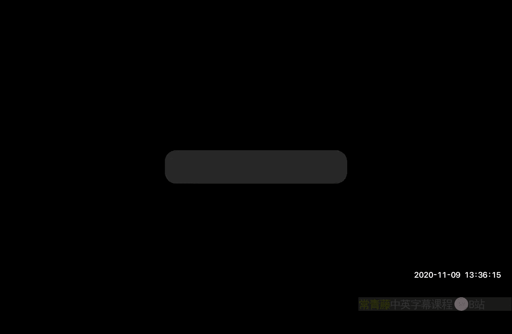
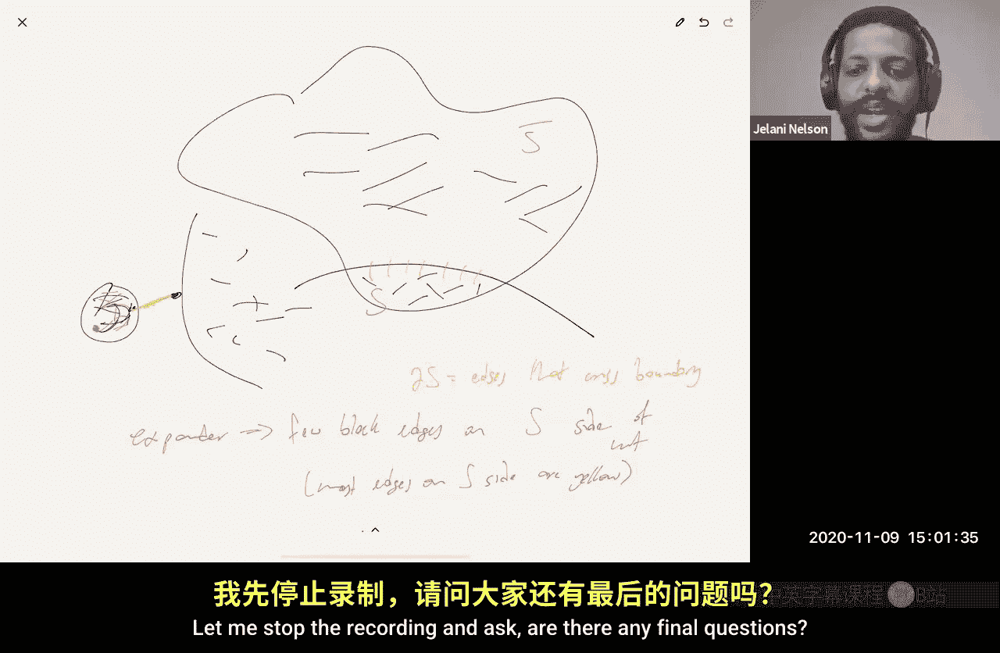

# 加州大学伯克利分校【中英⚡数据流算法｜CS294 Fall 2020, Sketching Algorithms】 p20：P20 迭代硬阈值、扩展图与RIP1




在本节课中，我们将继续讨论压缩感知，特别是使用RIP矩阵的“对所有”压缩感知。我们将介绍一种比求解线性规划更快的解码算法——迭代硬阈值法，并分析其性能保证。最后，我们还将简要介绍另一种基于扩展图的压缩感知方法。

## 回顾与引入

上一节我们讨论了如何使用RIP矩阵进行压缩感知。我们提到，如果矩阵满足RIP性质，那么通过求解基追踪（Basis Pursuit）线性规划问题，我们可以从测量值中恢复出原始稀疏向量 `x`，其误差由 `x` 的尾部 `L1` 范数控制。

然而，求解线性规划需要 `O(poly(m, n))` 的时间，对于高维数据（例如百万像素的图像）来说可能太慢。因此，我们需要寻找更快的解码算法。

本节我们将重点介绍一种迭代算法——迭代硬阈值法，它能以更快的速度实现近似恢复。

## 迭代硬阈值法

迭代硬阈值法是一种快速的压缩感知解码算法。其核心思想是通过迭代更新，逐步逼近原始稀疏信号 `x`。

以下是算法的伪代码描述：

```
输入：测量值 y = Φx + e， 测量矩阵 Φ， 稀疏度 k， 迭代次数 T
初始化：x_0 = 0
for t = 0 to T-1:
    a_{t+1} = x_t + Φ^T (y - Φ x_t)
    x_{t+1} = H_k(a_{t+1})  # H_k 是硬阈值算子，保留 a_{t+1} 中幅值最大的 k 个元素，其余置零
输出：x_T
```

**算法直观理解**：理想情况下，我们希望 `Φ^T Φ` 接近单位矩阵。那么，`a_{t+1} ≈ x_t + (x - x_t) = x`。因此，每次迭代都在向真实信号 `x` 靠近。硬阈值操作 `H_k` 是为了保证每次迭代的中间结果 `x_t` 都是 `k`-稀疏的，这样我们才能利用矩阵 `Φ` 在稀疏向量上的RIP性质进行分析。

## 定理与性能保证

以下是迭代硬阈值法的主要定理（由Blumensath, Davies 等人于2009年提出）：

**定理**：假设测量矩阵 `Φ` 满足 `(ε, 3k)`-RIP 性质，且 `ε < 1/(4√2)`。那么，对于所有 `T ≥ 1`，算法输出的 `x_T` 满足：
```
||x_T - x||_2 ≤ (1/2)^T * ||x||_2 + O( (1/√k) * ||x - x_k||_1 + ||e||_2 )
```
其中 `x_k` 是 `x` 的最佳 `k`-项近似，`e` 是测量噪声。

**定理含义**：
1.  **指数收敛**：误差项 `(1/2)^T * ||x||_2` 表明，随着迭代次数 `T` 增加，算法会指数级收敛到真实信号（在初始猜测为0的前提下）。
2.  **近似稀疏误差**：项 `O( (1/√k) * ||x - x_k||_1 )` 与基追踪的误差界类似，处理信号并非严格 `k`-稀疏的情况。
3.  **噪声鲁棒性**：项 `O( ||e||_2 )` 表明算法对测量噪声是稳健的。

上一节我们介绍了算法和定理，本节我们来看看证明的核心思路。

## 证明思路简述

证明的关键是定义残差 `r_t = x - x_t`，并推导其范数如何随着迭代衰减。

1.  **简化问题**：通过将信号的尾部 `x - x_k` 归入测量噪声 `e`，可以假设 `x` 本身是 `k`-稀疏的。这是因为RIP矩阵不会过度放大任何向量的范数。
2.  **关键步骤**：分析残差 `r_{t+1}` 的范数。通过代数展开和三角不等式，可以将其表示为前一轮残差 `r_t` 和噪声 `e` 的函数。
3.  **利用RIP性质**：由于每次迭代的 `x_t` 都是 `k`-稀疏的，且我们考虑了其支撑集与真实信号支撑集的并集（大小至多 `2k` 或 `3k`），因此可以应用矩阵 `Φ` 的RIP性质来约束某些算子范数。
4.  **得到递归不等式**：最终可以得到形如 `||r_{t+1}||_2 ≤ (1/2) * ||r_t||_2 + C * ||e||_2` 的递归关系。
5.  **求解递归式**：通过展开递归式，即可得到定理中所示的误差界，其中包含指数衰减项和常数倍的噪声项。

## 另一种方法：基于扩展图的压缩感知

除了使用满足RIP2（保持L2范数）的随机矩阵（如通过JL引理构造），还存在一种完全不同的压缩感知方法，它基于组合对象——扩展图。

**扩展图**：一个二分扩展图 `G=(U, V, E)`，其中 `|U|=n`（对应信号维度），`|V|=m`（对应测量数），每个左节点 `u∈U` 的度数为 `d`。它是 `(k, ε, d)`-扩展器，如果对于任意大小至多为 `k` 的左节点子集 `S`，其邻居集 `Γ(S)` 的大小至少为 `(1-ε) * d * |S|`。这意味着小集合的邻居几乎最大化地扩展。

**方法与结论**：如果将测量矩阵 `Φ` 设为该二分扩展图的邻接矩阵（并进行适当的归一化），那么它满足一种称为 **RIP1** 的性质（即它近似保持稀疏向量的 `L1` 范数）。可以证明，使用这样的矩阵，并通过特定的迭代算法或甚至基追踪，可以从测量值中恢复信号，并得到 `L1` 范数下的误差保证：
```
||x - x~||_1 ≤ C * ||x - x_k||_1
```
其中 `C` 是一个常数。这与之前基于RIP2的 `L2/L1` 误差保证不同。

**扩展图的直观**：扩展图可以看作是“没有稀疏割”的图。任何一个小节点集合，其连向集合外部的边（“边界”）数量都相对于集合内部的边数量很大。这保证了信息在图中能快速混合，也是其能用于压缩感知的深层原因。

## 总结

本节课我们一起学习了压缩感知中更快的解码算法。
1.  我们介绍了**迭代硬阈值法**，分析了其在RIP矩阵下的性能，并概述了其误差呈指数衰减的证明思路。
2.  我们简要了解了另一种基于**扩展图**的压缩感知框架，它使用满足RIP1性质的稀疏二值矩阵，并能提供 `L1` 范数下的恢复保证。

这两种方法提供了在测量数和解码时间之间进行权衡的不同工具，扩展了压缩感知在实际应用中的潜力。



