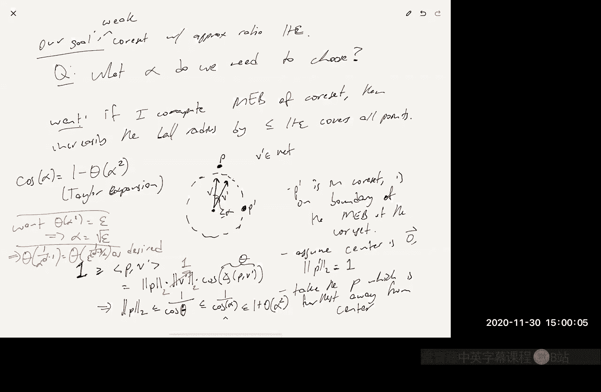

# 数据流算法：24：核心集 (Coresets)


在本节课中，我们将要学习核心集 (Coresets) 这一概念。核心集是一种数据压缩技术，它通过保留一个加权的数据子集，使得在该子集上进行优化计算的结果，能够近似等于在整个原始数据集上进行优化的结果。这为设计低内存的流式算法提供了一种通用框架。

---

## 核心集的定义

核心集分为弱核心集和强核心集，它们的共同点是：对于一个给定的优化问题，核心集是一个加权的输入数据子集。

*   **弱核心集**：在该加权子集上找到的（近似）最优解，对于原始数据集也是（近似）最优的。
*   **强核心集**：对于**任意**一个解，该解在加权子集上的目标函数值，与在原始数据集上的目标函数值近似相等。

我们可以通过一个 **K-means** 聚类的例子来直观理解。假设我们有一些数据点（黑色），最优的聚类中心是红色点。一个核心集（黄色点）是一个加权子集。弱核心集意味着，如果我们只在黄色点上运行 K-means 算法并找到聚类中心（例如蓝色点），那么这些中心对于原始的黑色点集也是近似最优的。

---

## 核心集与流式算法

核心集的构造可以系统地转化为低内存的流式算法。其基本思想是使用一种合并方法。

假设我们有一个流式数据点序列。我们可以构建一棵概念上的完美二叉树：
1.  将到达的数据点暂存为微小的核心集（例如单个点本身）。
2.  当暂存的数据达到一定数量时，我们运行核心集构造算法，将它们合并为一个新的、更小的核心集。
3.  重复此过程，像合并二叉树节点一样，逐层向上构建核心集。

在这个过程中，我们最多同时存储 `O(log n)` 个核心集。如果原始核心集的大小为 `S`，那么流式算法的总空间复杂度就是 `O(S log n)`。核心集的近似质量 `β` 在合并过程中可能会累积，但通过精心设计（例如使 `β ≈ 1 + ε/log n`），最终可以控制总体误差。

---

## 示例一：K-Median 核心集构造

本节我们来看一个针对 **K-Median** 问题的核心集构造方法。K-Median 的目标是找到 `k` 个中心点，最小化所有数据点到其最近中心点的距离之和。

**公式**：
```
给定数据集 X，最小化：Σ_{p ∈ X} d(p, C)
其中 C 是大小不超过 k 的中心点集合，d(p, C) = min_{c ∈ C} d(p, c)
```

我们假设存在一个离线的 `B` 近似算法（`B` 为常数），它可以在线性空间内运行。以下是构造方法：

1.  将 `n` 个数据点分成 `n/B` 块，每块大小为 `B`。
2.  在每个数据块上独立运行 `B` 近似算法，得到该块的 `k` 个近似中心点。
3.  将所有块的中心点收集起来，形成核心集。

核心集的大小为 `(n/B) * k`。我们需要在内存中同时存储每个块的数据（`O(B)`）和所有中心点（`O((n/B)*k)`）。通过设置 `B = √(nk)` 来平衡，我们得到总空间和核心集大小为 `O(√(nk))`。

可以证明，对此核心集使用 `B` 近似算法得到的解，对于原始数据集的近似比约为 `4B(B+1)`。虽然这个核心集大小仍依赖于 `√n`，不如已知的最佳结果（例如 `poly(k, d, 1/ε)`），但它是一个在任意度量空间中都有效的非平凡构造。

---

## 示例二：最小包围球核心集构造

本节我们看看 **最小包围球** 问题的核心集构造。该问题是在欧几里得空间中，找到能包围所有点的最小半径的球。

**公式**：
```
给定点集 X，最小化：max_{p ∈ X} || p - o ||_2
其中 o 是球的中心。
```

我们利用 **网 (Net)** 的概念来构造核心集。具体步骤如下：

1.  在单位球面上构造一个 `α`-网 `V = {v1, v2, ..., vT}`。这意味着对于球面上任何方向 `x`，网中都有一个点 `vi`，使得它们之间的夹角不超过 `α`。这样一个网的大小为 `T = O(1/α)^{d-1}`，其中 `d` 是空间维度。
2.  对于网中的每一个方向 `vi`，我们存储原始点集中在该方向上投影最大的点，即 `argmax_{p ∈ X} (p · vi)`。
3.  这些存储的点就构成了我们的核心集，其大小为 `T`。

**分析**：
设核心集的最小包围球半径为 `R_c`，其中心为 `O`（可通过平移假设为原点）。对于任何原始点 `p`，设其方向为 `w`。在 `α`-网中存在一个方向 `v'`，使得 `∠(w, v') ≤ α`。由于 `p` 不在核心集中，那么核心集中必然存在另一个点 `p'` 满足 `p' · v' ≥ p · v'`。因为 `p'` 在半径为 `R_c` 的球内，所以 `p' · v' ≤ R_c`。通过三角关系和点积计算，可以推导出 `||p|| ≤ R_c / cos(α)`。当 `α` 很小时，`cos(α) ≈ 1 - Θ(α^2)`。为了使 `||p|| ≤ R_c * (1+ε)`，我们需要 `α^2 = Θ(ε)`，即 `α = Θ(√ε)`。因此，核心集的大小为 `O(1/ε^{(d-1)/2})`。

这个构造的优点是核心集大小与原始数据点数量 `n` 无关，只与维度 `d` 和精度 `ε` 有关。

---

## 总结

本节课我们一起学习了核心集的概念及其在流式算法中的应用。我们了解到：
1.  核心集是一种数据摘要技术，能在压缩数据的同时保留解决优化问题所需的关键信息。
2.  弱核心集保证了解的质量，而强核心集进一步保证了目标函数值的近似保持。
3.  通过树形合并方法，可以将核心集构造转化为高效的流式算法。
4.  我们分析了 **K-Median** 和 **最小包围球** 两个问题的核心集构造实例，看到了不同方法在核心集大小和近似质量上的权衡。



核心集是处理大规模数据，特别是在内存受限的流式场景下，一个非常有力的工具。