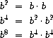

# 时间

## 测量时间效率

为了衡量程序运行的速度，我们必须设计一种合理的方法。使用秒表来测量所需时间是行不通的，因为不同程序在后台运行时，计时会发生变化，随机波动，太阳耀斑等。此外，新计算机通常更快，旧的计时不适用。

更好的方法是计算一个过程所需的步骤数。专注于过程可以避免被绑定到任何特定计算机的问题。

## 计算步骤

以下是我们将考虑为“一步”的一些过程：

以下所有过程都只需一步。

+   基本算术运算

+   定义变量

+   定义过程

+   条件语句？

+   用户定义的过程调用

### 例子：计算步骤

```
(define (square x) (* x x)) ; takes a single step
(square 4) ; would take 2 steps (one for the procedure call, and one for the multiplication)
(square (+ 2 3)) ; 3 steps 
```

然而，最有趣的问题是当我们比较一个过程和另一个过程时，问哪一个更快。为了进行这种比较，我们必须为每个过程问以下问题：

> 随着参数规模的增加，这个过程需要多少步才能运行？

换句话说，如果我们将一个过程所需的步骤数量（以输入为 x 轴）绘制成图表，那么图表的形状是什么？

### 例子：函数运行时间

+   对于`square`，我们说这是一个*常数*时间的过程--`(square 2)`所需的步骤与`(square 2000)`相同。因此，随着输入规模的增加，步骤数量保持*不变*。

+   对于`last`，这个找到句子最后一个单词的过程，我们说这是一个*线性*时间的过程--当我们在越来越大的输入上调用`last`时，步骤数量呈线性增长。

为了形式化这一点，我们必须学习一个叫做**增长阶**的数学构造。

## 增长阶

增长阶描述函数之间的关系。给定两个函数*f(n)*和*g(n)*，当我们说*f = Θ(g)*时，我们的意思是存在两个数*a*和*b*，使得对于足够大的*n*值，*ag(n) ≤ f(n) ≤ bg(n)*。

## 例子

+   当*f(n) = n*和*g(n) = 329n*时，*f = Θ(g)*。

+   当*f(n) = 4n²*和*g(n) = 2n²+n*时，*f = Θ(g)*。

+   当*f(n) = .0004n³*和*g(n) = 1000n²+30000n*时，*f*不等于*Θ(g)*。

根据这些例子，我们有以下规则

+   我们可以忽略过程中的常数因子

+   我们可以忽略较低的项，例如在*2n²+n*中，我们只关心*n²*。

回到过程，我们可以正式说`square`是*Θ(1)*，`last`是*Θ(n)*。

## 例子：指数

考虑计算`b^n`（`b`的`n`次方）的直接方法：将`b`乘以自身`n`次。以下是代码。

```
(define (expt b n)
  (if (= n 0)
      1
      (* b (expt b (- n 1))))) 
```

这在`n`变量方面以线性时间运行。我们之所以知道这一点，是因为有两个观察结果

+   如果`n`为 2，我们会进行两次递归调用，如果`n`为 10，那么我们会进行 10 次递归调用。

+   在每次递归调用中，都会进行*Θ(1)*的工作。

我们能做得更好吗？原来有一个更聪明的指数算法，利用了*连续平方*的思想。

> 假设我们想要计算 b⁸。通常，我们会做 b * b * b * b * b * b * b * b。这需要 8 次乘法。相反，我们可以用 3 次完成： 如果指数是 2 的幂，这个方法很有效。如果我们使用规则，我们也可以利用连续平方来计算一般的指数。

上述技巧给出了这个过程：

```
(define (fast-expt b n)
  (cond ((= n 0) 1)
        ((even? n) (square (fast-expt b (/ n 2))))
        (else (* b (fast-expt b (- n 1))))))

(define (even? n)
  (= (remainder n 2) 0)) 
```

对每个偶数进行平方可以减少递归调用的数量。事实上，如果你仔细想一想，每隔一个递归调用，我们就把`n`减半。这种通过减半问题规模的模式意味着所需的递归调用数量与`n`的对数成比例。因此，`fast-expt` *= Θ(log(n))*。（如果这个解释不合理，请查看 Further Reading 中的 1.2.4。）

## 练习

这里有一些简短的、不计分的练习，用于练习查找函数的运行时间。

bar 的运行时间是多少？

```
define (bar n)
  (if (zero? (remainder n 7))
      'Bzzst
      (bar (- n 1)) )) 
```

排序的运行时间是多少？

```
(define (sort s)
  (if (empty? s)
      '()
      (insert (sort (bf s)) (first s)) ))

(define (insert sorted-sofar n)
  (if (empty? sorted-sofar)
      (se n)
      (if (< n (first sorted-sofar))
          (se n sorted-sofar)
          (se (first sorted-sofar) (insert (bf sorted-sofar) n)) ))) 
```

## 进一步阅读

+   [SICP 1.2.3 增长阶](https://mitpress.mit.edu/sicp/full-text/book/book-Z-H-4.html#%_toc_%_sec_1.2.3)

+   [SICP 1.2.4 指数运算](https://mitpress.mit.edu/sicp/full-text/book/book-Z-H-4.html#%_toc_%_sec_1.2.4)
