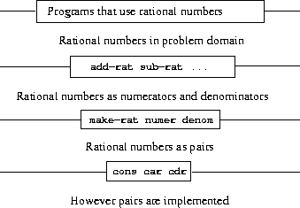

# 违反数据抽象

因此，创建抽象数据类型很方便，而且能够编写程序而不用担心实现细节很好。但是，是什么阻止我们越过抽象屏障并使用底层实现呢？

实际上什么也不会发生。如果您使用`cons`而不是`make-rational`，或者使用`car`而不是`numerator`，Racket 不会抱怨。我们在下面重新复制了有理数 ADT 的代码：

```
(define (make-rational numer denom)
  (if (= 0 denom)
      (error "Divisor cannot be 0!")
      (cons numer denom)))

(define (numerator rat)
  (car rat))

(define (denominator rat)
  (cdr rat)) 
```

从技术上讲，如果我们进行以下调用，选择器仍然会返回我们期望的内容：

```
-> (define x (make-rational 3 4))
x
-> (define num (car x))
num
-> (= num (numerator x))
#t 
```

那么，如果我们可以使用`car`而不是选择器，为什么我们要使用选择器呢？现在这样做没有问题，但是当我们以后更改构造器和选择器的实现时会出现问题。在抽象层下并假设数据结构的实现方式被称为**数据抽象违规（DAV）**。

## 例子：违反数据抽象

假设我们编写一个新函数`expt-rat`，它接受一个有理数和我们对该有理数取幂的指数，并返回另一个有理数到该指数的幂。这是我们编写的过程：

```
(define (expt-rat rat n)
  (make-rational (expt (car rat) n) 
                 (expt (cdr rat) n))) 
```

你能发现 DAV 吗？根据我们当前的有理数实现，`expt-rat`应该可以无问题地工作：

```
-> (define x (make-rational 3 4))
x
-> (expt-rat x 2)
(9 . 16) 
```

但这是危险的！如果以后决定更改实现，无法保证代码能正常工作。假设我们以这种方式重写实现：

```
(define (make-rational numer denom)
  (lambda (m) (cond ((equal? m 'numerator) numer)
                    ((equal? m 'denominator) denom)
                    (else (error "bad message to rational")))))

(define (numerator rat)
  (rat 'numerator))

(define (denominator rat)
  (rat 'denominator)) 
```

当我们现在调用`expt-rat`时会发生什么？

```
-> (define y (make-rational 5 6))
y
-> (expt-rat y 4)
; car: contract violation
;   expected: pair?
;   given: #<procedure>
; [,bt for context] 
```

我们出现了错误！我们上面的`expt-rat`代码假设我们将有理数存储为一对，并愚蠢地调用`car`来检索分子和`cdr`来检索分母。因此，当我们尝试在 lambda 函数上调用这些过程时，Racket 会抛出错误。

## 抽象屏障


我们用构造器`make-rat`和选择器`numerator`和`denominator`来定义了有理数操作。一般来说，数据抽象的基本思想是为每种类型的数据对象确定一组基本操作（例如构造器和选择器），通过这些操作表达该类型的所有数据对象的操作，然后在操作数据时只使用这些操作。

我们可以将有理数系统的结构构想成下图所示。水平线代表隔离不同“层级”的抽象障碍。在每个层级，该障碍将使用数据抽象的程序（上方）与实现数据抽象的程序（下方）分开。使用有理数的程序仅通过有理数包提供的“公共使用”程序来操纵它们：`add-rat`、`sub-rat`、`mul-rat`、`div-rat`和`equal-rat?`。而这些程序则完全通过构造函数和选择器`make-rat`、`numerator`和`denominator`来实现，它们本身是通过对成对元素的操作实现的。成对元素的具体实现细节对于有理数包的其余部分是无关紧要的，只要能通过`cons`、`car`和`cdr`来操作成对元素即可。实际上，每个层级的程序都是定义抽象障碍并连接不同层级的接口。



这个简单的想法有很多优点。其中一个优点是使程序更容易维护和修改。任何复杂的数据结构都可以用编程语言提供的原始数据结构的各种方式来表示。

要理解为什么这一点如此重要，考虑一下在没有数据抽象的世界。当然，表示的选择会影响操作它的程序；因此，如果表示在以后某个时候发生变化，所有这样的程序可能都必须相应地进行修改。在大型程序的情况下，这个任务可能是耗时且昂贵的，除非按设计将对表示的依赖性限制在非常少的程序模块中。

幸运的是，如果数据在不违反数据抽象的情况下实现，那么修改整个程序将会非常容易 -- 你只需要修改构造函数和选择器。
