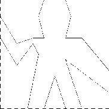

# 项目 2 - 海龟图形

## 介绍

在第 4 课中，我们探讨了`cons`如何让我们构建任意复杂的列表结构。

在这个项目中，我们将创建一种简单的**图形语言**，使我们能够构建任意复杂的*图形*，就像下面显示的那样。请注意，图像由重复的元素组成，这些元素被移动和缩放。


当我们探索这种图形语言时，我们将看到如何将数据抽象和高阶过程结合起来，将简单的元素构建成复杂的系统。

要开始，请将文件`~cs61as/lib/picture.rkt`复制到您的目录中，或者从[这里](http://inst.eecs.berkeley.edu/~cs61as/library/picture.rkt)下载。您还需要安装一个 Racket 包，使我们能够绘制图片。如果您在实验室计算机上工作，请在终端中输入以下内容：

```
install-htdp 
```

如果您想在自己的计算机上安装图片绘制包，请查看[此 Piazza 帖子](https://piazza.com/class/idnte7162cf4kk?cid=247)的第一个跟进讨论。

完成安装后，您应该能够在 Racket 中输入`(require graphics/turtles)`而不会出现错误。

## 图形语言

当我们在第 1 课开始学习编程时，我们强调了通过关注语言的基本元素、组合手段和抽象手段来描述语言的重要性。我们将在这里遵循这个框架。

这种图形语言的优雅之处在于只有一种元素，称为**画家**。画家绘制一个被移动和缩放以适应指定的平行四边形**框架**内的图像。例如，有一个我们将称之为`wave-painter`的原始画家，它制作了一个粗糙的线条图，如下所示。绘图的实际形状取决于框架——下面的四个图像都是由相同的`wave-painter`产生的，但是相对于四个不同的框架。

   

## 合并画家

要合并图像，我们使用各种操作从给定的画家中构建新的画家。例如，`beside`操作接受两个画家，并产生一个新的复合画家，在画面的左半部分绘制第一个画家的图像，在右半部分绘制第二个画家的图像。类似地，`below`接受两个画家，并产生一个复合画家，在第一个画家的图像下方绘制第二个画家的图像。

一些操作将单个画家转换为新的画家。例如，`flip-vert`接受一个画家，并产生一个将其图像倒置的画家，而`flip-horiz`产生一个从左到右翻转的原始画家图像的画家。

这是我们如何定义一个名为`wave4`的画家，它是从`wave-painter`开始分两个阶段构建的：

```
(define wave2 (beside wave-painter (flip-vert wave-painter)))
(define wave4 (below wave2 wave2)) 
```

下面显示了生成的图形：

 

## 抽象操作

一旦我们能够组合画家，我们希望能够抽象出典型的组合画家模式。我们将实现画家操作作为 Racket 过程。这意味着在图片语言中我们不需要特殊的抽象机制：由于组合方法是普通的 Racket 过程，我们自动具有可以对画家操作进行任何操作的能力。例如，我们可以将`wave4`中的模式抽象为

```
(define (flipped-pairs painter)
  (let ((painter2 (beside painter (flip-vert painter))))
    (below painter2 painter2))) 
```

并将`wave4`定义为此模式的一个实例：

```
(define wave4 (flipped-pairs wave)) 
```

## 递归操作

我们还可以定义递归操作。这里有一个称为`right-split`的操作，使画家向右分裂和分支：

```
(define (right-split painter n)
  (if (= n 0)
      painter
      (let ((smaller (right-split painter (- n 1))))
        (beside painter (below smaller smaller))))) 
```

这是`(right-split painter n)`的一般模板：


这里是`(right-split wave-painter 4)`的结果：


我们可以通过向上分支以及向右分支来产生平衡的模式：

```
(define (corner-split painter n)
  (if (= n 0)
      painter
      (let ((up (up-split painter (- n 1)))
            (right (right-split painter (- n 1))))
        (let ((top-left (beside up up))
              (bottom-right (below right right))
              (corner (corner-split painter (- n 1))))
          (beside (below painter top-left)
                  (below bottom-right corner)))))) 
```

这是`(corner-split painter n)`的一般模板：


这是`(corner-split wave-painter 4)`的结果：


通过适当放置四个`corner-split`的副本，我们获得了一个称为`square-limit`的模式：

```
(define (square-limit painter n)
  (let ((quarter (corner-split painter n)))
    (let ((half (beside (flip-horiz quarter) quarter)))
      (below (flip-vert half) half)))) 
```

此页面顶部的第一个图形，如下所示，是`(square-limit wave-painter 5)`的视觉输出：


## 在开始练习 1 之前

首先，如果您因为想直接跳到第一个练习而略读或跳过上面的所有内容，请现在花一分钟仔细阅读上面的所有内容。这很重要！

此外，请注意，直到练习 6 之后，您将*无法*测试任何代码的视觉输出。我们描述的图片语言是不完整的—在我们开始使用它之前，您必须填补这些空白！

## 练习 1：`up-split`

定义由`corner-split`使用的过程`up-split`。它类似于`right-split`，只是它交换了`below`和`beside`的角色。

为了您的方便，`right-split`再次显示如下：

```
(define (right-split painter n)
  (if (= n 0)
      painter
      (let ((smaller (right-split painter (- n 1))))
        (beside painter (below smaller smaller))))) 
```

## 高阶操作

除了抽象化组合画家的模式之外，我们还可以在更高的层次上工作，抽象化组合画家操作的模式。也就是说，我们可以将画家操作视为要操作的元素，并为这些元素编写组合方法——接受画家操作作为参数并创建新画家操作的过程。

例如，`flipped-pairs`和`square-limit`都将一个画家的图像排列成一个方形图案；它们之间的区别仅在于它们如何定位这些副本。抽象这种画家组合模式的一种方法是使用以下过程，它接受四个一元画家操作，并产生一个画家操作，用这四个操作来转换给定的画家，并将结果排列成一个方形。`tl`、`tr`、`bl` 和 `br` 分别是要应用于左上副本、右上副本、左下副本和右下副本的变换。

```
(define (square-of-four tl tr bl br)
  (lambda (painter)
    (let ((top (beside (tl painter) (tr painter)))
          (bottom (beside (bl painter) (br painter))))
      (below bottom top)))) 
```

然后`flipped-pairs`可以根据`square-of-four`定义如下：

```
(define (flipped-pairs painter)
  (let ((combine4 (square-of-four identity flip-vert
                                  identity flip-vert)))
    (combine4 painter))) 
```

类似地，`square-limit`可以表示为：

```
(define (square-limit painter n)
  (let ((combine4 (square-of-four flip-horiz identity
                                  rotate180 flip-vert)))
    (combine4 (corner-split painter n)))) 
```

## 练习 2：`split`

`right-split`和`up-split`可以表示为通用分割操���的实例。定义一个具有以下属性的过程`split`，评估

```
(define right-split (split beside below))
(define up-split (split below beside)) 
```

生成了具有与已定义的相同行为的`right-split`和`up-split`过程。

## 框架

在我们展示如何实现画家及其组合方式之前，我们必须首先考虑框架。一个框架可以由三个向量描述——一个原点向量和两个边缘向量。原点向量指定了框架原点相对于平面中某个绝对原点的偏移量，而边缘向量指定了框架角落相对于其原点的偏移量。如果边缘是垂直的，框架将是矩形的。否则，框架将是一个更一般的平行四边形。

下图显示了一个框架及其相关的向量。根据数据抽象，我们暂时不需要具体说明框架在 Racket 中是如何表示的，除了说有一个构造函数`make-frame`，它接受三个向量并生成一个框架，以及三个相应的选择器：`origin-frame`、`edge1-frame` 和 `edge2-frame`


我们将使用单位正方形中的坐标来指定向量；也就是说，我们将使用空间区域，其中[mathjaxinline]0 \leq x,y \leq 1[/mathjaxinline]。

### 框架坐标（可选）

这个可选的小节描述了如何计算框架坐标。

对于每个框架，我们关联一个**坐标映射**，用于移动和缩放图像以适应框架。坐标映射使用以下公式将单位正方形中的向量转换为框架中的向量


其中[mathjaxinline]x[/mathjaxinline]和[mathjaxinline]y[/mathjaxinline]是输入向量的分量。

例如，向量(0, 0)被映射到框架的原点，(1, 1)被映射到原点对角的顶点，(0.5, 0.5)被映射到框架的中心。

在 Racket 中，我们可以使用以下过程创建一个框架的坐标映射：

```
(define (frame-coord-map frame)
  (lambda (v)
    (add-vect
     (origin-frame frame)
     (add-vect (scale-vect (xcor-vect v)
                           (edge1-frame frame))
               (scale-vect (ycor-vect v)
                           (edge2-frame frame)))))) 
```

注意，将`frame-coord-map`应用于框架会返回一个过程，给定一个向量，它会返回一个向量。如果参数向量在单位正方形内，则结果向量将在框架内。例如，

```
((frame-coord-map a-frame) (make-vect 0 0)) 
```

返回与相同向量

```
(origin-frame a-frame) 
```

因为向量(0, 0)映射到框架的原点。

## 练习 3：表示向量

从原点到点的二维向量[mathjaxinline]v[/mathjaxinline]可以表示为由 x 坐标和 y 坐标组成的一对。通过给出构造函数`make-vect`和相应的选择器`xcor-vect`和`ycor-vect`来为向量实现数据抽象。

然后，根据您的选择器和构造函数，实现执行向量加法、向量减法和向量乘以标量的过程`add-vect`、`sub-vect`和`scale-vect`：

[mathjax] \begin{align} (x_1, y_1) + (x_2, y_2) &= (x_1 + x_2, y_1 + y_2)\\ (x_1, y_1) - (x_2, y_2) &= (x_1 - x_2, y_1 - y_2)\\ c \cdot (x, y) &= (cx, cy) \end{align} [/mathjax]

## 练习 4：表示框架

我们现在将按照上述描述实现框架。

这里有两种框架的可能构造函数：

```
(define (make-frame origin edge1 edge2)
  (list origin edge1 edge2))

(define (make-frame-2 origin edge1 edge2)
  (cons origin (cons edge1 edge2))) 
```

对于每个构造函数，提供适当的选择器。

## 表示画家

画家表示为一个过程，给定一个框架作为参数，绘制一个特定的图像，经过平移和缩放以适应框架。也就是说，如果`p`是一个画家，`f`是一个框架，我们通过调用`(p f)`来在`f`中产生`p`的图像。

原始画家的实现细节取决于图形系统的特定特性和要绘制的图像类型。例如，假设我们有一个绘制线段在屏幕上连接两个指定点的过程`draw-line`。然后我们可以从线段列表创建线条绘制的画家，例如波浪画家，如下所示：

```
(define (segments->painter segment-list)
  (lambda (frame)
    (for-each
     (lambda (segment)
       (draw-line
        ((frame-coord-map frame) (start-segment segment))
        ((frame-coord-map frame) (end-segment segment))))
     segment-list))) 
```

线段使用相对于单位正方形的坐标给出。对于列表中的每个线段，画家使用框架坐标映射（见上文）转换线段端点，并在转换点之间画一条线。

将画家表示为过程在图片语言中建立了强大的抽象屏障。我们可以创建和混合各种基于各种图形功能的原始画家。它们的实现细节并不重要。任何过程都可以作为画家，只要它以框架作为参数并绘制适合框架的内容。

## 练习 5：表示段

平面上的有向线段可以表示为一对向量——从原点到线段起点的向量，以及从原点到线段终点的向量。使用上面的向量表示来定义具有构造函数`make-segment`和选择器`start-segment`和`end-segment`的段的表示。

## 练习 6：原始画家

使用`segments->painter`来定义以下原始画家：

+   `x-painter`，通过连接框架的对角线绘制一个“X”。

+   `outline-painter`，绘制指定框架的轮廓。

+   `diamond-painter`，通过连接帧边的中点绘制一个菱形。

+   `wave-painter`，绘制了这里所示的熟悉的"波浪"图案。你的绘图不必完全复制；只需确保它清晰地类似于原始的波浪图案。

为了确保你走在正确的轨道上，你应该在定义`x-painter`之后立即测试你的代码。在"测试"部分中有说明。

### 重要提示

请记住，`segments->painter`接受一个由相对于**单位正方形**定义的向量组成的线段列表。例如，你的代码可能看起来像这样：

```
(define diag-painter
  (segments->painter
   (list (make-segment (make-vect 1 0) (make-vect 0 1))))) 
```

这会从左上角到右下角绘制一条对角线（类似于这里）。

## 测试

现在我们可以开始测试我们的代码了。请注意，以下命令在 SSH 上不起作用。

首先通过在终端中输入以下内容加载`picture.rkt`：

```
racket -it picture.rkt 
```

现在使用`cs`（"清屏"）过程打开绘图窗口：

```
(cs) 
```

你应该看到一个窗口出现，里面有一个小三角形。

现在，你可以通过将`full-frame`作为帧参数来告诉画家在绘图窗口中绘制。例如，尝试这样做：

```
(x-painter full-frame) 
```

你应该在绘图窗口中看到一个 X 出现。如果没有任何东西出现，或者出现错误，不要担心。使用你迄今为止学到的调试技巧来定位错误并解决它。如果需要帮助，请在 Piazza 上发布或联系助教。

请注意，上面提到的画家转换（如`beside`和`square-of-four`）在这一点上*不会*起作用。在测试它们之前，你必须完成练习 8。目前，如果你的四个原始画家工作正常，请继续下一节。

## 转换和组合画家

对画家的操作（如`flip-vert`或`beside`）通过创建一个画家，根据参数帧派生的帧来调用原始画家。因此，例如，`flip-vert`不必知道画家如何工作才能翻转它——它只需要知道如何将一个帧颠倒过来：翻转后的画家只是使用原始画家，但在倒置的帧中。

画家操作基于`transform-painter`过程，它接受一个画家和关于如何转换帧的信息作为参数，并产生一个新的画家。转换后的画家在帧上调用时，会转换帧并在转换后的帧上调用原始画家。`transform-painter`的参数是点（表示为向量），指定新帧的角落：当映射到帧中时，第一个点指定新帧的原点，另外两个点指定其边缘向量的端点。因此，在单位正方形内的参数指定了一个包含在原始帧内的帧。

```
(define (transform-painter painter origin corner1 corner2)
  (lambda (frame)
    (let ((m (frame-coord-map frame)))
      (let ((new-origin (m origin)))
        (painter
         (make-frame new-origin
                     (sub-vect (m corner1) new-origin)
                     (sub-vect (m corner2) new-origin))))))) 
```

这是如何垂直翻转画家图像的方法：

```
(define (flip-vert painter)
  (transform-painter painter
                     (make-vect 0.0 1.0)   ; new origin
                     (make-vect 1.0 1.0)   ; new end of edge1
                     (make-vect 0.0 0.0))) ; new end of edge2 
```

使用`transform-painter`，我们可以轻松定义新的转换。例如，我们可以定义一个将其图像缩小到给定帧的右上角的画家：

```
(define (shrink-to-upper-right painter)
  (transform-painter painter
                     (make-vect 0.5 0.5)
                     (make-vect 1.0 0.5)
                     (make-vect 0.5 1.0))) 
```

其他变换将图像逆时针旋转 90 度...

```
(define (rotate90 painter)
  (transform-painter painter
                     (make-vect 1.0 0.0)
                     (make-vect 1.0 1.0)
                     (make-vect 0.0 0.0))) 
```

...或将图像压缩至框架中心：

```
(define (squash-inwards painter)
  (transform-painter painter
                     (make-vect 0.0 0.0)
                     (make-vect 0.65 0.35)
                     (make-vect 0.35 0.65))) 
```

框架变换也是定义合并两个或多个画家手段的关键。例如，`beside`过程接受两个画家，将它们转换为分别在参数框架的左半部分和右半部分绘制，并产生一个新的复合画家。当复合画家得到一个框架时，它调用第一个转换后的画家在框架的左半部分绘制，并调用第二个转换后的画家在框架的右半部分绘制：

```
(define (beside painter1 painter2)
  (let ((split-point (make-vect 0.5 0.0)))
    (let ((paint-left
           (transform-painter painter1
                              (make-vect 0.0 0.0)
                              split-point
                              (make-vect 0.0 1.0)))
          (paint-right
           (transform-painter painter2
                              split-point
                              (make-vect 1.0 0.0)
                              (make-vect 0.5 1.0))))
      (lambda (frame)
        (paint-left frame)
        (paint-right frame))))) 
```

观察画家数据抽象，特别是将画家表示为过程的表示，使得实现`beside`变得容易。`beside`过程不需要了解组件画家的任何细节，只需知道每个画家将在其指定的框架中绘制一些东西。

## 练习 7：`flip-horiz`和旋转

定义变换`flip-horiz`，将画家水平翻转。

然后定义`rotate180`和`rotate270`，分别将画家逆时针旋转 180 度和 270 度。

## 练习 8：`below`

为画家定义`below`操作。`below`接受两个画家作为参数。得到的画家在给定框架下，用第一个画家在框架底部绘制，用第二个画家在框架顶部绘制。以两种不同方式定义`below`—首先编写一个类似于上面给出的`beside`过程的过程，然后根据`beside`和适当的旋转操作（来自上面的练习）定义`below`。

## 用于稳健设计的语言层次

我们的图形语言现在已经完成。让我们退后一步，评估一下。

图形语言练习了我们介绍的关于过程和数据抽象的一些关键思想。基本数据抽象，画家，是使用过程表示实现的，这使得语言能够以统一的方式处理不同的基本绘图能力。组合手段也是过程，这使我们能够轻松构建复杂的设计。最后，所有用于抽象过程的工具都可以用于抽象画家的组合手段。

我们还了解了关于语言和程序设计的另一个关键思想。这就是*分层设计*的方法，即复杂系统应该被构造为使用一系列语言描述的一系列级别。每个级别通过组合在该级别被视为原始的部分来构建，而在每个级别构建的部分在下一个级别被用作原语。分层设计的每个级别使用适合该详细级别的原语、组合手段和抽象手段。

分层设计渗透到复杂系统的工程中。例如，在计算机工程中，电阻器和晶体管被组合在一起（并使用模拟电路语言描述）以产生诸如与门和或门之类的部件，这些部件构成了数字电路设计语言的基本元素。这些部件被组合起来构建处理器、总线结构和存储系统，然后再使用适合计算机体系结构的语言将它们组合起来形成计算机。计算机被组合起来形成分布式系统，使用适合描述网络互连的语言，依此类推。

分层设计有助于使程序更加健壮——也就是说，这样做可以使规范中的微小变化很可能需要相应地对程序进行小的更改。例如，假设我们想要根据`wave-painter`修改图像。我们可以在最低级别上改变`wave-painter`元素的详细外观；我们可以在中间级别上改变`corner-split`复制波浪的方式；或者我们可以在最高级别上改变`square-limit`如何排列四个角的副本。一般来说，分层设计的每个级别都提供了一个不同的词汇表来表达系统的特征，并提供了不同类型的改变能力。

## 练习 9：正方形限制

通过在上述每个级别上进行工作来改变波浪绘图器的正方形限制。特别是：

+   向练习 6 中的原始`wave-painter`添加一些段（例如添加一个微笑）。

+   改变由`corner-split`构建的模式（例如，只使用`up-split`和`right-split`图像的一个副本而不是两个）。

+   修改使用`square-of-four`的`square-limit`版本，以便以不同的模式组装角落。（例如，您可以使波浪图案从正方形的每个角落向外看。）

## 最后步骤

遵循上面“测试”部分的说明，测试其余的绘图器。确保还测试所有的绘图器转换过程。

要提交您的项目，请在终端中导航到您的项目目录，然后键入

```
submit proj2 
```

## 只是为了好玩：导出绘图

不想丢失您的杰作？渴望在 Facebook 或 Instagram 上分享您的作品？您现在可以使用以下命令将您的绘图保存为 PNG 文件：

```
(export "filename.png") 
```
