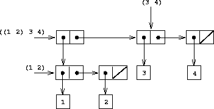

# 建立层次结构

## 组合对和列表

之前我们看到如何使用`cons`来“组合”一对值，例如`(cons 1 2)`，它返回一对`(1 . 2)`。我们也可以使用`list`来组合任意数量的数据。例如，如果您在解释器中键入`(list 1 2 'bagel 4)`，Racket 将打印列表`(1 2 bagel 4)`。请注意，我们可以在其中放置*任何*类型的数据，甚至其他对和列表！

现在让我们创建一对列表：

```
(cons (list 1 2) (list 3 4)) 
```

这对中的第一个项目是列表`(1 2)`，第二个是列表`(3 4)`。我们可以用以下的盒子和指针图展示这个结构：



（如果您不熟悉绘制和解释盒子和指针图，请返回并查看第 4 课中的[部分](http://berkeley-cs61as.github.io/textbook/representing-sequences.html)。）

您还可以使用**小 t 树**来表示结构`((1 2) 3 4)`：


在小 t 树中，序列中的每个元素都是一个节点。在上面的例子中，`(1 2)`是`((1 2) 3 4)`的一个元素，因此它是一个节点。但它也是一个有两个子节点的树——每个元素一个。

为什么我们称之为“小 t 树”？在本课的后面，我们将讨论“大 T 树”数据类型，这与小 t 树数据类型*完全不同*。我们使用这种表示法是为了保持一致性和清晰度。

我们也可以将小 t 树称为**深度列表**（因为它们是列表中的列表中的列表中的列表...），这样不太含糊，但也不太描述列表的树状结构。

**测试您的理解**

假设我们评估表达式`(list 1 (list 2 (list 3 4)))`。当我们输入这个表达式到解释器时会返回什么？为自己绘制相应的盒子和指针结构以及相应的小 t 树。

## 要点

在本节中，我们讨论了嵌套的`cons`结构。我们还介绍了小 t 树。

### 在我们继续之前...

回顾一下[shorthand notation](http://berkeley-cs61as.github.io/textbook/representing-sequences.html#sub2)中`car`和`cdr`的用法。这会很有用！
