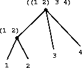

# 层次结构 - 小 t 树

## 小 t 树概述

让我们讨论一些小 t 树的一般特性。我们已经看到像`(cons (list 1 2) (list 3 4))`这样的结构可以用树状结构表示：



小 t 树由*分支*和*叶子*组成。上面的树有五个**分支**；它们对应上图中的线条。请注意，一个分支可以导致一个**子树** - 一个包含在更大树中的树。在这种情况下，分支`((1 2) 3 4)`包含子树`(1 2)`。一个**叶子**没有从它连接的分支。上面的树有 4 个叶子：`1`、`2`、`3`和`4`。叶子位于树的“底部”，也称为**边缘**。

与现实世界中的树相比，计算机科学中的树往往是颠倒的！

## 使用小 t 树进行递归

在处理树时，通常有助于进行递归思考。例如，让我们编写一个函数`count-leaves`来计算树中叶子的数量。

我们将从用普通英语非正式概述我们的函数将要做的事情开始。这称为编写**伪代码**。在我们理解`count-leaves`函数应该如何行为之后，我们将为其编写实际的 Racket 代码。这是解决问题的一个很好的一般技术。

### 伪代码

回想一下我们如何定义`length`，它找到列表中的元素数量：

+   空列表的`length`为 0。

+   非空列表`x`的`length`是`x`的`cdr`的`length`加 1。

基本情况对于`count-leaves`是相同的：

+   空列表的`count-leaves`为 0。

我们的递归情况略有不同。在`length`中，我们保证列表的`car`是一个单个元素，因此我们将其长度计为 1。但是对于`count-leaves`，它的`car`可能包含一个或多个树，因此其长度不总是 1。因此，我们需要递归地找到树的`car`的`count-leaves`！因此，我们的递归调用是：

+   树的`count-leaves`是树的`car`的`count-leaves`加上树的`cdr`的`count-leaves`。

最终我们将`car`自己到树的叶子，因此我们的第二个基本情况将是：

+   叶子的`count-leaves`是`1`。

### `pair?`谓词

当我们在树上调用`car`时，我们必须确定它是否返回另一个树（一个对），还是一个叶子（一个单个元素，技术上称为*原子*）。我们如何检查呢？Racket 有一个内置的谓词`pair?`，用于测试其参数是否是`cons`的结果。例如：

+   `(pair? (cons 1 2))` 返回 `#t`。

+   `(pair? (cons 1 (cons 2 3)))` 返回 `#t`。

+   `(pair? 2)` 返回 `#f`。

+   `(pair? 'pear)` 返回 `#f`。

+   `(pair? '())` 返回 `#f`。

### 真实代码

使用`pair?`和上面的伪代码，我们可以编写`count-leaves`的完整代码：

```
(define (count-leaves x)
    (cond ((null? x) 0) ;; is the tree is empty?
          ((not (pair? x)) 1) ;;is the tree a single element?
          (else (+ (count-leaves (car x)) ;; else, call count-leaves on the car
                   (count-leaves (cdr x))))) ;; and cdr of x and add them up. 
```

## 示例：`scale-tree`

在第 4 课中，我们看到了函数`scale-list`，它将列表中的每个项目乘以给定的数字因子。我们将编写一个类似的函数`scale-tree`，它接受一个深层列表和一个数字因子，并将深层列表中的所有元素乘以该因子。

这里是一个示例调用：

```
> (scale-tree (list 1 (list 2 (list 3 4) 5) (list 6 7)) 10)
(10 (20 (30 40) 50) (60 70)) 
```

**检验你的理解**

下面是`scale-tree`的未完成定义。我们需要哪些基本情况才能正确定义`scale-tree`？

```
(define (scale-tree tree factor)
  (cond ;;Your answer here.
        (else 
          (cons (scale-tree (car tree) factor) 
                (scale-tree (cdr tree) factor))))) 
```

现在，用一些你自己的例子在解释器中尝试`scale-tree`！

## 例子：`deep-reverse`

让我们解决一个结构类似的问题。这一次，我们想要编写一个名为`deep-reverse`的函数，它将深层列表中所有元素的顺序颠倒。例如：

```
> (define x (list (list 1 2) (list 3 4)))
((1 2) (3 4))

> (deep-reverse x)
((4 3) (2 1)) 
```

注意，不仅`(1 2)`和`(3 4)`交换位置，它们的元素也是如此。`deep-reverse`也应该适用于不包含其他列表的列表。

**检验你的理解**

下面是`deep-reverse`的未完成定义。我们需要哪些递归调用才能正确定义`deep-reverse`？

```
(define (deep-reverse d-l)
  (cond ((null? d-l) null)
        ;;Your answer here.
  )) 
```

在你的 Racket 解释器中尝试一下！

## 总结

树可以包含子树，因此在解决涉及树的问题时，递归可能非常有帮助。
