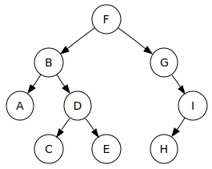

# 层次结构 - 大写 T 树

## 大写 T 树简介（抽象数据类型）

在继续阅读之前，请注意，我们在本节讨论的大写 T 树与 SICP 中的树不同。在 SICP（以及之前的章节）中，树只是深列表的花哨说法。在本节中，我们介绍了一个新概念，树，它是一种抽象数据类型（ADT）。这些树必须遵守某些抽象屏障。当你听到大多数计算机科学家在现实世界中谈论树时，他们通常是在谈论这个 ADT。

与列表和句子一样，我们也可以在树数据结构中存储数据。它们通常用于提供层次结构、排序和组合。


名称来源于向下分支结构，类似于真实树木但是倒置的。**节点**是树上的一个点。每个节点包含一个**数据**（"美国"，"加利福尼亚"是一些数据）。请注意，一个节点可以包含另一个树。具有"加利福尼亚"的节点可以被视为顶部为"加利福尼亚"的树。因此，节点和树是相同的东西！我们通常使用'Tree'来指代整个结构���节点的另一个同义词是子树。

+   树的**根节点**是最顶部的节点。所有树只有一个根。在这种情况下，它是"美国"

+   一个节点的**父节点**是直接在其上方的节点。所有节点都只有一个父节点，除了根节点没有父节点。

+   一个节点的**子节点**是直接在其下方的节点。"加利福尼亚"的子节点是"伯克利"和"圣何塞"。

+   **分支**节点是至少有一个子节点的节点（如"美国"，"加利福尼亚"和"马萨诸塞州"）。

+   叶子节点是没有子节点的节点（如"伯克利"，"圣何塞"和"波士顿"）

## 树 ADT

我们有自己的 ADT 来表示树，我们将在本课程的其余部分中使用它，但没有官方的表示树的方式。为什么？这是因为在创建树 ADT 时有几种不同的设计选择：

+   分支节点可能有数据，也可能没有

+   二叉树（2 个分支）与 N 路树（N 个分支）

+   子节点的顺序

+   树可以为空吗？

+   ... 还有许多

不同的树表示将给您不同的限制、特性和功能。

这里是树的内置构造函数和选择器：

+   **构造函数:** `make-tree`接受两个参数，一个数据和其子节点的列表，并创建一个树 ADT。

+   **选择器:** `datum`接受一个节点并返回节点存储的数据。

+   **选择器:** `children`接受一个节点并返回其子节点的列表。

## 底层结构

实现上述树的一种方法是使用以下定义：

```
(define (make-tree datum children)
  (cons datum children))
(define (datum node)
  (car node))
(define (children node)
  (cdr node)) 
```

选择器`children`接受一个节点作为其唯一参数，并返回其子节点，**一组树的列表**。一组树的列表称为**森林**。记住，树和森林是两种不同的数据结构！此外，你**应该**将森林视为树的列表，但你**不应该**将树视为一堆`cons`、`car`和`cdr`。

重申一下，森林的构造函数和选择器是`list`、`car`和`cdr`，而树的（此 ADT 的）构造函数和选择器是`make-tree`、`datum`和`children`。

另外，由于叶子是没有子节点的节点，我们可以使用类似这样的谓词来检查一个节点是否是叶子：

```
(define (leaf? node)
  (null? (children node))) 
```

记住，使用列表只是表示树的*一种方式*。我们不能假设设计 ADT 的人会使用列表。例如，如果`maple`是一棵树，我们不能假设`(cdr maple)`会给我们子节点。相反，我们必须尊重数据抽象，并使用他们为我们提供的构造函数和选择器。

## 抽象屏障


我们再次强调，你不能对树的 ADT 实现做出**任何**假设。在处理树时，你只能使用提供的构造函数/选择器。由于森林被实现为树的列表，你可以使用森林的`car`找到第一个树，或者使用`cdr`找到其余树的列表。

**测试你的理解**

假设`pine`指的是一棵树，以下哪一项是数据抽象违规（DAV）？

## 对树进行映射

我们经常对树执行的有用操作之一是将某种操作映射到它，类似于在列表上进行映射。我们可以通过以下方式实现这一点：

```
(define (treemap fn tree)
   (make-tree (fn (datum tree))
              (map (lambda (t) (treemap fn t))
                   (children tree) ))) 
```

我们将该函数应用于我们的数据，并递归地将该函数映射到子节点上。

确保你盯着上面的代码直到它有意义。

## 互递归

这是定义`treemap`的另一种方法，它在整个树上应用函数`fn`。请注意整个过程是递归的，但`treemap`并不直接调用自身。`treemap`将负责将`fn`应用于单个树的数据。谁处理森林？嗯，`treemap`将调用一个辅助过程`forest-map`，它将`fn`应用于森林中的所有元素。

```
(define (treemap fn tree)
    (make-tree (fn (datum tree))
               (forest-map fn (children tree)))) 
```

`forest-map`如何将`fn`应用于森林？嗯，森林只是树的列表，我们知道有`treemap`处理单个树。所以，我们只需要在森林中的所有树上递归调用`treemap`即可！

```
(define (forest-map fn forest)
    (if (null? forest)
        '()
        (cons  (treemap fn (car forest))
               (forest-map fn (cdr forest))))) 
```

注意`treemap`调用`forest-map`，而`forest-map`调用`treemap`。**A**调用**B**，**B**调用**A**的模式称为**互递归**。


## `count-leaves`

让我们使用相互递归来编写过程 `count-leaves`，它返回树中叶子节点的数量。让我们一步一步来。由于我们使用相互递归，这意味着我们需要一个管理树的过程 `count-leaves`，以及一个管理森林的过程 `count-leaves-in-forest`。

`count-leaves`：

+   **基本情况：** 如果节点是叶子节点，则只需返回 1。

+   **递归调用：** 否则，它调用 `count-leaves-in-forest`。

这是 `count-leaves` 的代码：

```
(define (count-leaves tree)
  (if (leaf? tree)
      1
      (count-leaves-in-forest (children tree)))) 
```

`count-leaves-in-forest`：

+   **基本情况：** 如果森林是 `null?`，则返回 0。

+   **递归调用：** 否则，我们需要找到森林中所有树的叶子总数。

    1.  我们在森林的 `car` 上调用 `count-leaves`，以找出森林中第一个树中有多少叶子。

    1.  我们在森林的 `cdr` 上递归调用 `count-leaves-in-forest`，以找到森林中其余部分的叶子数量。

    1.  最后，我们将这两个值相加以找到叶子节点的总数。

这是 `count-leaves-in-forest` 的代码：

```
(define (count-leaves-in-forest forest)
  (if (null? forest)
      0
      (+ (count-leaves (car forest))
         (count-leaves-in-forest (cdr forest))))) 
```

## 树遍历

我们已经看到了如何在树中存储和查找元素。现在，许多使用树数据结构的情况涉及访问所有节点并对所有元素执行某些操作。显而易见的方法是从上到下、从左到右，但我们还有许多其他遍历树的方法。

## 深度优先搜索

深度优先搜索（DFS）是指在查看兄弟节点之前探索节点的子节点。该名称源于您在查看其他分支之前尽可能深入一个分支的事实。下面的 gif 演示了这一点。数字表示访问节点的顺序。


请注意，在探索其他分支之前，它会完成对一个分支的探索。

我们可以在 Racket 中演示这一点。假设我们想打印每个节点。我们的树 ADT 实际上遵循相同的结构，因此我们的 dfs 实现相当简单：

```
(define (depth-first-search tree)
    (print (datum tree))
    (for-each depth-first-search (children tree))) 
```

## 广度优先搜索

广度优先搜索（BFS）在探索子节点之前探索兄弟节点。更容易想象这是在'层次'中查看图。首先我们看树的根，然后是它的子节点，接着是它的孙子节点，依此类推。下面的 gif 演示了这一点：


在 Racket 中实现 BFS 稍微困难，因为我们的 ADT 以与 BFS 遍历顺序不同的顺序存储信息。解决这个问题的一种方法是使用另一种称为[队列](https://mitpress.mit.edu/sicp/full-text/sicp/book/node62.html)的数据结构，它按顺序存储将要检查的节点。

```
(define (breadth-first-search tree)
    (bfs-iter (list tree)))

(define (bfs-iter queue)
    (if (null? queue)
        'done
        (let ((task (car queue)))
            (print (datum task))
            (bfs-iter (append (cdr queue) (children task)))))) 
```

## BFS 示例

让我们通过以下示例树来逐步了解上面的代码如何工作。图中的箭头表示父节点 --> 子节点的关系。



当首次调用`bfs-iter`时，整个树被放入`queue`中。为了简化问题，让我们用树的根来表示一棵树。

`queue`: F

它出队节点 F，打印节点 F 的值，并递归调用`bfs-iter`与队列的其余部分和节点 F 的子节点。队列的其余部分为空，但节点 F 的子节点是 B G。

`queue`: B G

`bfs-iter`将打印队列中第一棵树的节点 B，并递归调用`bfs-iter`与队列的其余部分 G 和节点 B 的子节点 A D。

`queue`: G A D

依此类推，直到队列为空。一旦队列为空，我们将精确打印出每个节点的数据一次。

注意兄弟节点总是先进入队列，而子节点是从后面进入的。这确保了在检查子节点之前首先检查兄弟节点。

## 深度优先搜索 vs 广度优先搜索


一个比另一个更好吗？这取决于你尝试对树做什么以及你如何在树中存储元素。

下面的树代表房子里的东西。在一个“房子”里你可以找到“厨房”和“猫粮”。在一个“厨房”里你可以找到“抽屉”、“垃圾桶”等。叶子包含食物，越深入，食物越丰富。


**测试你的理解**

考虑一个结构类似上面的树。想象一下你是一只饥饿的猫，正在寻找**任何**食物以尽快填饱肚子。哪种树遍历对于以下情况更合适？

你仍然是一只猫，但现在你正在寻找房子里最美味的食物。哪种树遍历将帮助你最快地找到它？

## 要点

以下是本小节的要点：

+   记住你的构造函数和选择器（`make-tree`、`datum`和`children`）。

+   要对树进行映射，我们使用相互递归，其中两个过程相互调用。通常，其中一个过程接受一棵树，另一个接受一片森林。

+   广度优先搜索首先查看同一层级的节点，而深度优先搜索会一直遍历每个分支直到达到叶子节点。
