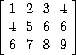
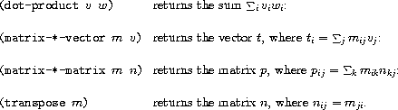

# 作业 5

## 模板

在终端中键入以下内容，将模板文件复制到当前目录（注意末尾的句点）：

```
cp ~cs61as/autograder/templates/hw5.rkt . 
```

或者你可以在这里下载模板[here](http://inst.eecs.berkeley.edu/~cs61as/templates/hw5.rkt)。

## 自动评分程序

如果你在实验室的计算机上工作，`grader`命令将运行自动评分程序。如果你在自己的个人机器上工作，你应该下载[grader.rkt](http://inst.eecs.berkeley.edu/~cs61as/autograder/grader.rkt)和[HW 5 tests](http://inst.eecs.berkeley.edu/~cs61as/autograder/tests/hw5-tests.rkt)。

## 练习 1：SICP 2.26

假设我们定义了`x`和`y`是两个列表：

```
(define x (list 1 2 3))
(define y (list 4 5 6)) 
```

评估以下表达式时，解释器打印的结果是什么？

```
(append x y)
(cons x y)
(list x y) 
```

## 练习 2：SICP 2.29

二叉手机由两个支架组成，左支架和右支架。每个支架都是一根长度不同的杆，悬挂在杆上的是一个重量或另一个二叉手机。我们可以用复合数据来表示一个二叉手机，通过从两个支架构造它（例如，使用列表）：

```
(define (make-mobile left right)
    (list left right)) 
```

一个支架由一个长度（必须是一个数字）和一个结构构成，该结构可以是一个数字（代表一个简单的重量）或另一个手机：

```
(define (make-branch len structure)
    (list len structure)) 
```

**a.** 编写相应的选择器`left-branch`和`right-branch`，它们返回手机的支架，以及`branch-length`和`branch-structure`，它们返回支架的组件。

**b.** 使用你的选择器，定义一个过程`total-weight`，它返回手机的总重量。

**c.** 如果一个手机是*平衡的*，那么它的左上支的扭矩等于右上支的扭矩（也就是说，如果左侧杆的长度乘以悬挂在该杆上的重量等于右侧对应的乘积），并且每个悬挂在其支架上的子手机都是平衡的。设计一个谓词，测试一个二叉手机是否平衡。

**d.** 假设我们改变手机的表示形式，使得构造函数为

```
(define (make-mobile left right) (cons left right))
(define (make-branch len structure)
  (cons len structure)) 
```

你需要对你的程序进行多少改变才能转换成新的表示形式？

## 练习 3：SICP 2.30, 2.31

**a.** 定义一个类似于`square-list`过程的过程`square-tree`。也就是说，`square-tree`应该有以下行为：

```
> (square-tree (list 1 (list 2 (list 3 4) 5) (list 6 7)))
(1 (4 (9 16) 25) (36 49)) 
```

**b.** 将你的答案抽象化，产生一个过程`tree-map`，具有`square-tree`可以被定义为：

`(define (square-tree tree) (tree-map square tree))`

## 练习 4：SICP 2.36

过程`accumulate-n`类似于`accumulate`，只是它将作为第三个参数的序列序列，假定它们都有相同数量的元素。它应用指定的累积过程来组合所有序列的第一个元素，所有序列的第二个元素，依此类推，并返回结果的序列。例如，如果 s 是包含四个序列的序列，`((1 2 3) (4 5 6) (7 8 9) (10 11 12))`，那么`(accumulate-n + 0 s)`的值应该是序列`(22 26 30)`。填写以下`accumulate-n`定义中缺失的表达式：

```
(define (accumulate-n op init seqs)
  (if (null? (car seqs))
      '()
      (cons (accumulate op init <??>)
            (accumulate-n op init <??>)))) 
```

## 练习 5

假设我们将向量*v* = (*v*[*i*])表示为数字序列，将矩阵*m* = (*m*[*i*,*j*])表示为向量序列（矩阵的行）。例如，矩阵



被表示为序列`((1 2 3 4) (4 5 6 6) (6 7 8 9))`。通过这种表示，我们可以使用序列操作简洁地表达基本的矩阵和向量操作。这些操作（在任何关于矩阵代数的书中都有描述）如下：



我们可以将点积定义为

```
(define (dot-product v w)
    (accumulate + 0 (map * v w))) 
```

填写以下用于计算其他矩阵操作的过程中缺失的表达式。（`accumulate-n`过程在前一个练习中定义）

```
(define (matrix-*-vector m v)
  (map <??> m))

(define (transpose mat)
  (accumulate-n <??> <??> mat))

(define (matrix-*-matrix m n)
  (let ((cols (transpose n)))
    (map <??> m))) 
```

## 练习 6：SICP 2.38

`accumulate`过程也被称为`fold-right`，因为它将序列的第一个元素与组合所有右侧元素的结果结合起来。还有一个`fold-left`，类似于`fold-right`，只是它以相反方向组合元素：

```
(define (fold-left op initial sequence)
    (define (iter result rest)
        (if (null? rest)
            result
            (iter (op result (car rest))
                  (cdr rest))))
    (iter initial sequence)) 
```

以下是以下值：

```
(fold-right / 1 (list 1 2 3))
(fold-left / 1 (list 1 2 3))
(fold-right list nil (list 1 2 3))
(fold-left list nil (list 1 2 3)) 
```

描述`op`应该满足的一个属性，以确保`fold-right`和`fold-left`对于任何序列都会产生相同的值。

## 练习 7：SICP 2.54

如果两个列表包含相同顺序排列的相等元素，则它们被认为是相等的。例如，

```
(equal? '(this is a list) '(this is a list)) 
```

是真的，但

```
(equal? '(this is a list) '(this (is a) list)) 
```

是错误的。更准确地说，我们可以通过基本的`eq?`符号相等性来递归地定义`equal?`，即如果 a 和 b 都是符号并且符号是`eq?`，或者如果它们都是列表，`(car a)`等于`(car b)`且`(cdr a)`等于`(cdr b)`，那么它们就是`equal?`。利用这个想法，实现`equal?`作为一个过程。

注意：你现在应该知道`equal?`也是一个内置过程。这意味着你的定义将覆盖内置定义。

## 练习 8

我们可以将集合表示为不同元素的列表，并且我们可以将集合的所有子集表示为列表的列表。例如，如果集合是`(1 2 3)`，那么所有子集的集合是`(() (3) (2) (2 3) (1) (1 3) (1 2) (1 2 3))`。完成以下生成集合子集的过程定义，并清楚解释为什么它有效：

```
(define (subsets s)
  (if (null? s)
      (list nil)
      (let ((rest (subsets (cdr s))))
        (append rest (map <??> rest))))) 
```

## 练习 9

扩展`calc.rkt`以包含单词作为数据，提供操作`first, butfirst, last, butlast, and word`。与 Racket 不同，你的计算器应将单词视为自评估表达式，除非它们作为复合表达式的运算符出现。也就是说，它应该像以下示例一样工作：

```
calc: foo
foo
calc: (first foo)
f
calc: (first (butfirst hello))
e 
```

记住，你可以通过输入以下命令获取程序

`cp ~cs61as/lib/calc.rkt .`

或者从[这里](http://inst.eecs.berkeley.edu/~cs61as/library/calc.rkt)下载。

## 练习 10：专家级别的额外练习

**如果你愿意，可以这样做。这不计入学分。**

阅读[第 2.3.4 节](http://mitpress.mit.edu/sicp/full- text/book/book-Z-H-16.html#%25_sec_2.3.4)并完成练习 2.67 - 2.72。

## 练习 11：专家级别的额外练习

**如果你愿意，可以这样做。这不计入学分。**

编程示例：在某些编程系统中，你不需要编写算法，只需提供程序行为示例，语言会自动推导算法：

```
> (define pairup (regroup '((1 2) (3 4) ...)))
> (pairup '(the rain in spain stays mainly on the plain))
((the rain) (in spain) (stays mainly) (on the)) 
```

写下`regroup`。阅读`~cs61as/lib/regroup.problem`获取详细信息。

## 提交你的作业！

有关说明，请参阅此指南。它涵盖了基本的终端命令和作业提交。

如果在提交作业时遇到任何问题，请不要犹豫向助教求助！
