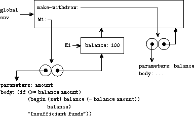

# 评估的环境模型

## 评估的环境模型


在前一小节中，我们了解到一旦使用赋值，就不能再使用替换评估模型。从现在开始将使用的新模型称为**评估的环境模型**。

让我们通过示例看看这个新模型是如何工作的。我们定义一个简单的`square`过程，并在`7`上调用它：

```
> (define (square x) (* x x))
square
> (square 7)
49 
```

发生了什么？替换模型陈述：

1.  在函数体中用实际参数值替换形式参数值。

1.  评估结果表达式。

在这个例子中，在`(* x x)`中将`7`替换为`x`得到`(* 7 7)`。在第 2 步中，我们评估该表达式以获得结果`49`。

现在，让我们将替换模型放在一边，看看更完整和全面的**环境模型**：

1.  创建一个带有形式参数绑定到实际参数值的框架。

1.  使用此框架来扩展词法环境。

1.  在结果环境中评估函数体。

**框架**是名称-值关联或**绑定**的集合。在我们的示例中，框架有一个将`x`绑定到`7`的绑定。

让我们暂时跳过第 2 步，思考第 3 步。这个想法是，我们将评估表达式`(* x x)`，但我们正在细化我们对“评估”表达式的理解。表达式不再在真空中评估，而是每次评估都必须与某个环境相关。

**环境**可以描述为名称和值之间的一些绑定集合。当我们评估`(* x x)`并看到符号`x`时，我们希望能够在我们的绑定集合中查找`x`并找到值`7`。查找绑定到符号的值是我们以前使用全局变量做过的事情。新的是，我们现在有可能有**局部环境**。符号`x`并不总是`7`。这只在这次调用`square`期间才是这样。因此，第 3 步意味着以我们一直理解的方式评估表达式，但在特定位置查找名称。

第 2 步是什么？关键是我们不能在只有`x`到`7`绑定的环境中评估`(* x x)`，因为我们还必须查找符号`*`的值（即乘法函数）。因此，在第 1 步中创建一个新框架，但该框架本身不是一个环境。相反，我们使用新框架来扩展已经存在的环境。

我们扩展哪个旧环境？在`square`示例中，只有一个候选者，**全局环境**。但在更复杂的情况下，可能有几个可用的环境。

## 环境模型的规则

现在，我们将讨论不同情况下环境模型的规则。在继续之前，请记住：

1.  每个表达式要么是**原子**，要么是**列表**。

1.  任何时候都有一个当前框架，最初是全局框架。

## 表达原子

让我们对如何表达原子值有一些看法：

1.  数字，字符串，`#t`和`#f`是自评估的。

1.  如果表达式是一个符号，找到**第一个可用**绑定。（也就是说，在当前框架中查找；如果在那里找不到，就在当前框架“后面”的框架中查找；直到达到全局框架为止。）


## 过程调用

那么过程怎么办？评估如何处理调用过程的表达式？

1.  评估所有子表达式（使用相同的规则）。

1.  将过程（第一个子表达式的值）应用于参数（其他子表达式的值）。

    +   如果过程是复合的（用户定义的）：

        1.  创建一个帧，其中过程的形式参数绑定到实际参数值。

        1.  用这个新框架扩展过程的定义环境。

        1.  评估过程体，使用新框架作为当前框架。

    +   如果过程是原始的：

        1.  通过魔法应用它。**只有复合过程调用创建新框架。**

## 一个例子

```
(define (square x)
  (* x x))
(define (sum-of-squares x y)
  (+ (square x) (square y)))
(define (f a)
  (sum-of-squares (+ a 1) (* a 2))) 
```


全局框架中的过程对象。


通过评估`(f 5)`创建的环境。

## 特殊形式

1.  `lambda`创建一个双泡泡形式的过程。左圆圈指向`lambda`表达式的文本；右圆圈指向定义环境（即，在看到`lambda`时的当前环境）。**只有 lambda 创建过程。**

1.  `define`向当前框架添加一个新绑定。

1.  `set!`更改第一个可用绑定。

1.  `let`是带有调用的`lambda`。

1.  `(define (...) …)` = `lambda` + `define`

1.  其他特殊形式遵循自己的规则（`cond`，`if`）。

## 一个例子

```
(define (make-withdraw balance)
  (lambda (amount)
    (if (>= balance amount)
        (begin (set! balance (- balance amount))
               balance)
"Insufficient funds"))) 
```


在全局环境中定义`make-withdraw`的结果。



评估`(define W1 (make-withdraw 100))`的结果。

## 要点

在这一小节中，我们学习了如何用环境模型评估过程。

## 接下来呢？

转到下一小节，学习如何绘制环境图！
