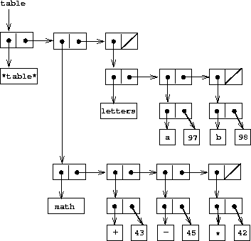

# 表示表

## 简介

我们在第 2 单元中提到，我们可以使用二维表存储数据，并且，给定 2 个键，可以获取所需数据。我们可以使用可变列表来表示这种数据结构，首先构建一个一维表，然后扩展这个想法。

## 在我们开始之前：`assoc`

在我们深入讨论表之前，我们必须探索另一个 Scheme 复合过程，`assoc`，它将发挥重要作用。`assoc`接受一个`key`和一组对，并返回第一个将`key`作为其`car`的对。如果不存在这样的对，则返回`#f`。查看下面的一系列示例，以了解`assoc`的作用。

```
> (assoc 1 '((1 2) (3 4)))
  (1 2)     ;returns the pair with car 1

> (assoc 'cupcake '((1 2) (3 4) (cupcake donut) (galaxy star)))
  (cupcake donut)    ;anything can be a key.

> (assoc 2 '((1 2) (3 4)))
  #f      ;No pair has 2 as its car, hence returns #f

> (assoc 'froyo '((cupcake donut eclair)
                  (froyo gingerbread honeycomb) 
                  (sandwich jellybean kitkat)))
  (froyo gingerbread honeycomb)    ;Pairs can be of any length 
```

这是`assoc`的正式定义：

```
(define (assoc key records)
  (cond ((null? records) false)
        ((equal? key (caar records)) (car records))
        (else (assoc key (cdr records))))) 
```

## 一维表

在一个**一维表**中，值存储在单个键下。表将设计为一对对的列表。每对的`car`保存每个值的键。


在上表中，键和值之间的关系如下所示。

| 键 | 值 |
| --- | --- |
| `a` | `1` |
| `b` | `2` |
| `c` | `3` |

为什么我们的表指向一个不包含任何键值对的对？我们设计我们的表，使第一个对包含符号`*table*`，这表示我们正在查看的当前列表结构是一个表。

### `make-table`

这是我们表的简单构造函数：

```
(define (make-table)
  (list '*table*)) 
```

### `lookup`

要从表中提取信息，我们使用`lookup`选择器，它接受一个键作为参数，并返回关联的值（如果该键下没有存储值，则返回`#f`）。以下是我们对`lookup`的定义

```
(define (lookup key table)
  (let ((record (assoc key (cdr table))))
    (if record
        (cdr record)
        false)))  

> (lookup 'b table)  ;table refers to the table made above
2 
```

### `insert!`

要在表中插入一个键值对，我们遵循这个简单的算法：

1.  如果键已经在列表中，只需更新值

1.  否则，创建一个新的键值对并将其附加到表中

    (define (insert! key value table) (let ((record (assoc key (cdr table)))) (if record (set-cdr! record value) (set-cdr! table (cons (cons key value) (cdr table))))) 'ok)

## 二维表

在一个**二维表**中，每个值由*两个*键指定。我们可以构建这样一个表，作为一个一维表，其中每个键标识一个子表。假设我们有 2 个表："math"和"letters"，具有以下键值对。

```
math:
    + : 43
    - : 45
    * : 42

letters:
    a : 97
    b : 98 
```

我们可以将它们放入一个大表中：



### `lookup`

要在二维表中查找一个值，你需要 2 个键。第一个键用于找到正确的子表。第二个键用于在该子表中找到正确的值。

```
(define (lookup key-1 key-2 table)
  (let ((subtable (assoc key-1 (cdr table))))
    (if subtable
        (let ((record (assoc key-2 (cdr subtable))))
          (if record
              (cdr record)
              #f))
        #f))) 
```

### `insert`

要插入到二维表中，你还需要 2 个键。第一个键用于尝试找到正确的子表。如果第一个键对应的子表不存在，则创建一个新的子表。如果表存在，则使用我们为一维`insert!`所使用的完全相同的算法。

```
(define (insert! key-1 key-2 value table)
  (let ((subtable (assoc key-1 (cdr table))))
    (if subtable
        (let ((record (assoc key-2 (cdr subtable))))
          (if record
              (set-cdr! record value)
              (set-cdr! subtable
                        (cons (cons key-2 value)
                              (cdr subtable)))))
        (set-cdr! table
                  (cons (list key-1
                              (cons key-2 value))
                        (cdr table)))))
  'ok) 
```

## 本地表

上述定义的`lookup`和`insert!`操作将表作为参数传递。这使我们能够使用访问多个表的程序。处理多个表的另一种方法是为每个表单独拥有`lookup`和`insert!`过程。我们可以通过过程化地表示表格，将其视为维护内部表格作为其本地状态一部分的对象来实现这一点。当发送适当的消息时，“表对象”将提供用于在内部表格上操作的过程。以下是以这种方式表示的二维表格的生成器：

```
(define (make-table)
  (let ((local-table (list '*table*)))
    (define (lookup key-1 key-2)
      (let ((subtable (assoc key-1 (cdr local-table))))
        (if subtable
            (let ((record (assoc key-2 (cdr subtable))))
              (if record
                  (cdr record)
                  false))
            false)))
    (define (insert! key-1 key-2 value)
      (let ((subtable (assoc key-1 (cdr local-table))))
        (if subtable
            (let ((record (assoc key-2 (cdr subtable))))
              (if record
                  (set-cdr! record value)
                  (set-cdr! subtable
                            (cons (cons key-2 value)
                                  (cdr subtable)))))
            (set-cdr! local-table
                      (cons (list key-1
                                  (cons key-2 value))
                            (cdr local-table)))))
      'ok)    
    (define (dispatch m)
      (cond ((eq? m 'lookup-proc) lookup)
            ((eq? m 'insert-proc!) insert!)
            (else (error "Unknown operation -- TABLE" m))))
    dispatch)) 
```

### `get`和`put`

在第二单元的“数据导向”子节中，我们使用一个二维表格来存储两个键下的一个值，使用了`get`和`put`过程。

```
(put <key-1> <key-2> <value>)
(get <key-1> <key-2>) 
```

现在我们可以使用我们的表来定义这些过程！

```
(define operation-table (make-table))
(define get (operation-table 'lookup-proc))
(define put (operation-table 'insert-proc!)) 
```

`get`以两个键作为参数，`put`以两个键和一个值作为参数。这两个操作都访问相同的本地表，该表封装在调用`make-table`的对象中。
