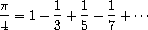

# 示例 - 使用流进行迭代

在第一单元中，我们编写了一个用于近似给定数字的平方根的过程——让我们称之为`x`。这个想法是通过反复应用改进猜测的过程来生成越来越好的`x`的平方根的猜测序列：

```
(define (sqrt-improve guess x)
  (average guess (/ x guess))) 
```

我们可以创建一个以 1 为初始猜测的无限流的猜测序列：

```
(define (sqrt-stream x)
  (define guesses 
    (cons-stream 1.0 (stream-map (lambda (guess) 
                                   (sqrt-improve guess x)) 
                                 guesses)))
  guesses) 
```

`(sqrt-stream 2)`的前几个元素将是：

```
1
1.5
1.4166666666666665
1.4142156862745097
1.4142135623746899 
```

流的每个后续元素都会越来越接近 2 的平方根。

同样地，我们使用以下公式来近似π：



现在，让我们用一个无限流来计算π：

```
(define (pi-summands n)
  (cons-stream (/ 1.0 n)
               (stream-map - (pi-summands (+ n 2)))))

(define pi-stream
  (scale-stream (partial-sums (pi-summands 1)) 4)) 
```

前几个元素如下所示：

```
4.
2.666666666666667
3.466666666666667
2.8952380952380956
3.3396825396825403
2.9760461760461765
3.2837384837384844
3.017071817071818 
```

正如你所看到的，这些数字正在逼近π——在查看前八个元素后，我们知道π大约在 3.28 和 3.02 之间。
