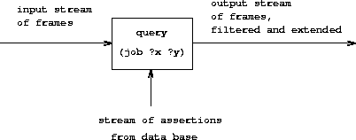
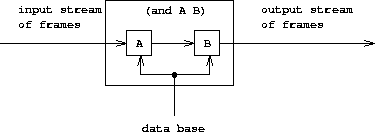
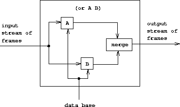

# 查询系统的工作原理

## 介绍

在本节中，我们将给出一个概述，解释了系统的一般结构，而不涉及底层实现细节。在描述解释器的实现之后，我们将能够理解一些其限制以及查询语言的逻辑操作与数学逻辑操作不同的微妙方式。

显然，查询评估器必须执行某种搜索才能将查询与数据库中的事实和规则进行匹配。实现这一点的一种方式是将查询系统实现为非确定性程序（您不必担心这种方式）。另一种可能性是借助流来管理搜索。我们的实现遵循了第二种方法。

查询系统围绕两个称为**模式匹配**和**统一**的核心操作组织。我们首先描述模式匹配，并解释了如何通过此操作以及以帧流的形式组织信息，实现简单和复合查询。

接下来我们讨论统一，这是模式匹配的一种泛化，需要实现规则。最后，我们通过一个类似于`eval`为元圈求值器分类表达式的过程，展示了整个查询解释器是如何组合在一起的。

## 模式匹配

模式匹配器是一个测试某个数据是否符合指定模式的程序。例如，数据列表`((a b) c (a b))`与模式`(?x c ?x)`匹配，其中模式变量`?x`绑定到`(a b)`。相同的数据列表与模式`(?x ?y ?z)`匹配，其中`?x`和`?z`都绑定到`(a b)`，而`?y`绑定到`c`。它还与模式`((?x ?y) c (?x ?y))`匹配，其中`?x`绑定到`a`，`?y`绑定到`b`。但是，它与模式`(?x a ?y)`不匹配，因为该模式指定了第二个元素为符号`a`的列表。

查询系统使用的模式匹配器接受模式（例如，`(?x c ?x))`）、数据（例如，`((a b) c (a b))`）以及指定各种模式变量绑定的框架作为输入。它检查数据是否与模式匹配，且与框架中已有的绑定一致。如果匹配成功，则返回给定的框架，其中可能还包含由匹配确定的任何绑定。否则，表示匹配失败。

例如，使用模式`(?x ?y ?x)`来匹配数据`(a b a)`，给定一个空框架将返回一个指定`?x`绑定到`a`和`?y`绑定到`b`的框架。尝试使用相同的模式、相同的数据以及一个指定`?y`绑定到`a`的框架将失败。尝试使用相同的模式、相同的数据以及一个框架，其中`?y`绑定到`b`而`?x`未绑定将返回给定框架，并增加`?x`绑定到`a`的绑定。

模式匹配器是处理不涉及规则的简单查询所需的全部机制。例如，处理查询

```
(job ?x (computer programmer)) 
```

我们扫描数据库中的所有断言，并选择与初始空帧相匹配的那些。对于每个匹配，我们使用匹配返回的帧来为`?x`实例化模式。

## 帧流

通过使用流来组织模式与帧的匹配测试。给定一个单个帧，匹配过程逐个遍历数据库条目。对于每个数据库条目，匹配器生成一个指示匹配失败的特殊符号或帧的扩展。所有数据库条目的结果被收集到一个流中，通过过滤器传递以筛选掉失败。结果是一个通过与数据库中某个断言匹配扩展给定帧的所有帧的流。

在我们的系统中，一个查询接受一个帧流输入，并为流中的每个帧执行上述匹配操作，如下图所示。也就是说，对于输入流中的每个帧，查询通过与数据库中断言的匹配生成一个新的流，其中包含该帧的所有扩展。然后将所有这些流组合在一起形成一个巨大的流，其中包含输入流中每个帧的所有可能扩展。这个流就是查询的输出。



要回答一个简单的查询，我们使用一个由单个空帧组成的输入流进行查询。生成的输出流包含所有对空帧的扩展（即，对我们查询的所有答案）。然后使用这些帧的流来生成原始查询模式的副本流，其中变量由每个帧中的值实例化，这最终被打印出来。

## 复合查询

当我们处理复合查询时，流式帧实现的真正优雅之处显而易见。处理复合查询利用了我们的匹配器要求匹配与指定帧一致的能力。例如，处理两个查询的“and”，如

```
(and (can-do-job ?x (computer programmer trainee))
     (job ?person ?x)) 
```

（非正式地说，“找出所有能胜任计算机程序员实习生工作的人”），我们首先找出所有与该模式匹配的条目

```
(can-do-job ?x (computer programmer trainee)) 
```

这会产生一个帧流，每个帧都包含`?x`的绑定。然后对流中的每个帧，我们找出所有与之匹配的条目

```
(job ?person ?x) 
```

以与`?x`的给定绑定一致的方式。每个这样的匹配将产生一个包含`?x`和`?person`绑定的帧。两个查询的“and”可以被视为两个组件查询的串联组合，如下图所示。通过第一个查询过滤器的帧被第二个查询进一步过滤和扩展。



两个查询的和组合是通过连续操作帧流产生的。

下图显示了计算两个查询的或的类似方法，作为两个组成查询的并行组合。帧流的输入分别由每个查询扩展。然后，将两个结果流合并以产生最终的输出流。



两个查询的或组合是通过并行操作和合并结果来产生的帧流。

即使从高层描述中，复合查询的处理可能会很慢也是显而易见的。例如，由于查询可能为每个输入框架产生多个输出框架，并且每个“和”中的查询都从上一个查询获取其输入框架，因此一个“和”查询在最坏的情况下可能必须执行指数数量的匹配查询。虽然处理仅简单查询的系统非常实用，但处理复杂查询极其困难。

从框架流的观点来看，某些查询的否定充当一个过滤器，以移除可以满足查询的所有框架。例如，给定模式

```
(not (job ?x (computer programmer))) 
```

我们尝试为输入流中的每个框架生成满足`(job ?x (computer programmer))`的扩展框架。我们从输入流中移除存在这种扩展的所有框架。结果是一个由仅那些绑定`?x`不满足`(job ?x (computer programmer))`的框架组成的流。例如，在处理查询时

```
(and (supervisor ?x ?y)
     (not (job ?x (computer programmer)))) 
```

第一个子句将生成绑定了`?x`和`?y`的框架。然后，否定子句将通过删除所有`?x`绑定满足`?x`是计算机程序员的限制的框架来过滤这些框架。

`lisp-value`特殊形式被实现为框架流上的类似过滤器。我们使用流中的每个框架来实例化模式中的任何变量，然后应用 Lisp 谓词。我们从输入流中移除谓词失败的所有框架。

## 统一

为了处理查询语言中的规则，我们必须能够找到结论与给定查询模式相匹配的规则。规则的结论类似于断言，但它们可以包含变量，因此我们将需要模式匹配的一般化 -- 称为**统一** -- 在其中，“模式”和“数据”都可以包含变量。

统一器接受两个模式，每个模式包含常量和变量，并确定是否可以为变量分配值使得两个模式相等。如果可以，则返回包含这些绑定的帧。例如，统一`(?x a ?y)`和`(?y ?z a)`将指定一个帧，其中`?x, ?y`和`?z`必须都绑定到`a`。另一方面，统一`(?x ?y a)`和`(?x b ?y)`将失败，因为没有值可以使这两个模式相等（对于模式的第二个元素相等，`?y`必须为`b`；然而，对于第三个元素相等，`?y`必须为`a`）。查询系统中使用的统一器，就像模式匹配器一样，接受一个帧作为输入，并执行与该帧一致的统一。

统一算法是查询系统中技术难度最大的部分。对于复杂的模式，执行统一可能看起来需要推理。例如，要统一`(?x ?x)`和`((a ?y c) (a b ?z))`，算法必须推断出`?x`应该是`(a b c)`，`?y`应该是`b`，`?z`应该是`c`。我们可以将这个过程视为在模式组件之间解方程组。一般来说，这些是同时方程，可能需要大量的操作才能解决。例如，将`(?x ?x)`和`((a ?y c) (a b ?z))`统一可以看作是指定同时方程

```
?x  =  (a ?y c)
?x  =  (a b ?z) 
```

这些方程意味着

```
(a ?y c)  =  (a b ?z) 
```

这反过来意味着

```
a  =  a, ?y  =  b, c  =  ?z, 
```

因此

```
?x  =  (a b c) 
```

在成功的模式匹配中，所有模式变量都变为绑定，并且它们绑定到的值只包含常量。迄今为止我们看到的所有统一的例子也是如此。然而，一般来说，成功的统一可能不会完全确定变量的值；有些变量可能仍然未绑定，而其他变量可能绑定到包含变量的值。

考虑对`(?x a)`和`((b ?y) ?z)`进行统一。我们可以推断出`?x = (b ?y)`和`a = ?z`，但我们无法进一步解出`?x`或`?y`。统一并不失败，因为可以通过给`?x`和`?y`赋值来使这两个模式相等。由于这种匹配并不限制`?y`可以取的值，因此不会将`?y`的绑定放入结果帧中。但是，这种匹配确实限制了`?x`的值。无论`?y`有什么值，`?x`都必须是`(b ?y)`。因此，将`?x`绑定到模式`(b ?y)`中。如果以后确定了`?y`的值并将其添加到帧中（通过需要与此帧一致的模式匹配或统一），则先前绑定的`?x`将引用此值。

## 应用规则

统一是从规则中推断出推理的查询系统组成部分的关键。为了看到这是如何完成的，请考虑处理涉及应用规则的查询，例如

```
(lives-near ?x (Hacker Alyssa P)) 
```

要处理此查询，我们首先使用上面描述的普通模式匹配过程来查看数据库中是否有与此模式匹配的断言。（在这种情况下不会有任何匹配，因为我们的数据库中没有关于谁住在谁附近的直接断言。）下一步是尝试将查询模式与每个规则的结论统一。我们发现模式与规则的结论统一。

```
(rule (lives-near ?person-1 ?person-2)
      (and (address ?person-1 (?town . ?rest-1))
           (address ?person-2 (?town . ?rest-2))
           (not (same ?person-1 ?person-2)))) 
```

导致一个指定`?person-2`绑定为`(Hacker Alyssa P)`并且`?x`应该绑定为（具有与）`?person-1`相同值的帧。现在，相对于这个帧，我们评估规则体给出的复合查询。成功匹配将通过为`?person-1`提供绑定来扩展此帧，因此为`?x`提供一个值，我们可以用它来实例化原始查询模式。

一般来说，查询评估器在尝试在指定了一些模式变量绑定的帧中建立查询模式时使用以下方法应用规则：

+   将查询与规则的结论统一，如果成功，形成原始帧的扩展。

+   相对于扩展帧，评估由规则体形成的查询。

注意这与 Lisp 的 eval/apply 评估器中应用过程的方法有多么相似：

+   将过程的参数绑定到其参数以形成扩展原始过程环境的帧。

+   相对于扩展环境，评估由过程体形成的表达式。

两个评估器之间的相似性应该不足为奇。正如过程定义是 Lisp 中的抽象手段一样，规则定义是查询语言中的抽象手段。在每种情况下，我们通过创建适当的绑定并相对于这些绑定评估规则或过程体来展开抽象。

## 简单查询

我们在本节前面看到了如何在没有规则的情况下评估简单查询。现在我们已经看到了如何应用规则，我们可以描述如何通过同时使用规则和断言来评估简单查询。

给定查询模式和一系列帧，我们为输入流中的每个帧生成两个流：

+   通过将模式与数据库中的所有断言（使用模式匹配器）进行匹配获得的一系列扩展帧。

+   通过应用所有可能的规则（使用统一器）获得的一系列扩展帧。

追加这两个流产生一个流，其中包含给定模式可以满足的所有方式，与原始帧一致。这些流（每个输入流中的一个帧）现在都被组合成一个大流，因此包含了原始输入流中任何帧可以扩展以与给定模式匹配的所有方式。

## 查询评估器和驱动循环

尽管底层匹配操作复杂，但系统的组织方式类似于任何语言的评估器。协调匹配操作的过程称为`qeval`，它的作用类似于 Lisp 的 eval 过程。`qeval`的输入是一个查询和一组帧的流。其输出是一组帧的流，对应于成功匹配查询模式的帧，这些帧扩展了输入流中的某个帧。像`eval`一样，`qeval`对不同类型的表达式（查询）进行分类，并为每种类型调度到适当的过程。每个特殊形式（`and`、`or`、`not`和`lisp-value`）都有一个过程，还有一个用于简单查询的过程。

驱动循环类似于本章其他评估器的`driver-loop`过程，它从终端读取查询。对于每个查询，它使用查询和由单个空帧组成的流调用`qeval`。这将产生所有可能匹配（所有空帧的所有可能扩展）的流。对于结果流中的每个帧，它使用在帧中找到的变量的值实例化原始查询。然后打印这些实例化查询的流。

驱动程序还检查特殊命令`assert!`，该命令表示输入不是查询，而是要添加到数据库的断言或规则。例如，

```
(assert! (job (Bitdiddle Ben) (computer wizard)))
(assert! (rule (wheel ?person)
               (and (supervisor ?middle-manager ?person)
                    (supervisor ?x ?middle-manager)))) 
```

## 一个例子

这里有一个部分追踪的示例：

```
;;; Query input:
(assert! (rule (append () ?y ?y)))

;;; Query input:
(assert! (rule (append (?u . ?v) ?y (?u . ?z))
               (append ?v ?y ?z)))

;;; Query input:
(append ?a ?b (aa bb))

(unify-match (append ?a ?b (aa bb))   ; MATCH ORIGINAL QUERY
             (append () ?1y ?1y)      ; AGAINST BASE CASE RULE
             ())                      ; WITH NO CONSTRAINTS

RETURNS: ((?1y . (aa bb)) (?b . ?1y) (?a . ()))
PRINTS: (append () (aa bb) (aa bb)) 
```

由于基本情况规则没有主体，一旦我们匹配成功，就可以打印成功的结果。（在打印之前，我们必须在环境中查找变量，以便打印的内容不包含变量。）

现在我们将原始查询与另一条规则的结论统一起来：

```
(unify-match (append ?a ?b (aa bb))               ; MATCH ORIGINAL QUERY
             (append (?2u . ?2v) ?2y (?2u . ?2z)) ; AGAINST RECURSIVE RULE
             ())                                  ; WITH NO CONSTRAINTS

RETURNS: ((?2z . (bb)) (?2u . aa) (?b . ?2y) (?a . (?2u . ?2v)))
         [call it F1] 
```

这一步成功了，但我们还没有准备好打印任何东西，因为现在我们必须将该规则的主体作为一个新的查询。请注意缩进，以指示这次调用 unify-match 是在待处理规则内部进行的。

```
 (unify-match (append ?2v ?2y ?2z)   ; MATCH BODY OF RECURSIVE RULE
                 (append () ?3y ?3y)    ; AGAINST BASE CASE RULE
                 F1)                    ; WITH CONSTRAINTS FROM F1

    RETURNS: ((?3y . (bb)) (?2y . ?3y) (?2v . ()) [plus F1])
    PRINTS: (append (aa) (bb) (aa bb))

    (unify-match (append ?2v ?2y ?2z)                 ; MATCH SAME BODY
                 (append (?4u . ?4v) ?4y (?4u . ?4z)) ; AGAINST RECURSIVE RULE
                 F1)                                  ; WITH F1 CONSTRAINTS

    RETURNS: ((?4z . ()) (?4u . bb) (?2y . ?4y) (?2v . (?4u . ?4v))
             [plus F1]) [call it F2]

        (unify-match (append ?4v ?4y ?4z) ; MATCH BODY FROM NEWFOUND MATCH
                     (append () ?5y ?5y)  ; AGAINST BASE CASE RULE
                     F2)                  ; WITH NEWFOUND CONSTRAINTS

        RETURNS: ((?5y . ()) (?4y . ?5y) (?4v . ()) [plus F2])
        PRINTS: (append (aa bb) () (aa bb))

        (unify-match (append ?4v ?4y ?4z)                 ; MATCH SAME BODY
                     (append (?6u . ?6v) ?6y (?6u . ?6z)) ; AGAINST RECURSIVE RULE
                     F2)                                  ; SAME CONSTRAINTS

        RETURNS: ()                                       ; BUT THIS FAILS 
```

## 要点

以下是本小节的几个要点：

+   简单查询使用模式匹配器处理。

+   要处理复合查询，模式匹配器需要检查匹配是否与指定的帧一致。

+   规则使用统一处理。

## 接下来是什么？

在下一小节中，我们将讨论逻辑编程与数理逻辑之间的关系。
