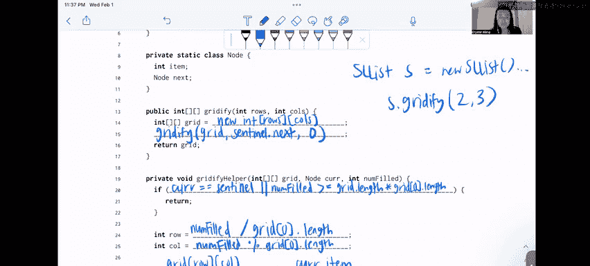

# 数据结构讨论与实验：P10：5 - 将单链表元素填充到二维数组


## 概述
在本节课中，我们将学习如何将一个循环哨兵单链表中的元素，按行主序填充到一个二维整数数组中。我们将理解“行主序”的概念，并编写递归函数来完成这一转换。

---

## 问题描述与核心概念

我们被要求考虑一个使用循环哨兵实现的单链表。对于前 `rows * columns` 个节点，我们需要将每个节点的 `item` 按行主序放入一个 `rows` 行 `columns` 列的二维数组中。

**行主序**意味着元素按顺序添加，先填满一整行，再移动到下一行。

例如，如果单链表包含元素 `5 -> 3 -> 7 -> 2 -> 8`，并且我们有一个 2 行 3 列的网格，调用 `gridtify` 应返回以下网格：
```
[ [5, 3, 7],
  [2, 8, 0] ]
```
注意，单链表包含的元素数量可能多于或少于二维数组的容量。未填充的位置将由 Java 数组的默认值填充（对于 `int` 数组是 `0`）。

---

## 数据结构与初始设置

我们有一个 `SLList` 类和一个 `Node` 内部类。每个 `Node` 包含一个 `int item` 和一个指向下一个节点的 `next` 指针。这是一个**循环哨兵**实现，意味着最后一个节点的 `next` 指向哨兵节点，而不是 `null`。

我们的目标是实现 `gridtify` 方法，它接收 `rows` 和 `columns` 两个参数，并返回填充好的二维数组。为了简化实现，我们还将使用一个辅助方法 `gridtifyHelper`。

---

## 实现 gridtify 方法

`gridtify` 方法的主要任务是初始化二维数组，并启动递归填充过程。

上一节我们介绍了问题背景和数据结构，本节中我们来看看如何开始实现 `gridtify` 方法。

```java
public int[][] gridtify(int rows, int columns) {
    int[][] grid = new int[rows][columns]; // 步骤1：初始化二维数组
    gridtifyHelper(grid, sentinel.next, 0); // 步骤2：调用辅助函数，从第一个有效节点开始
    return grid; // 步骤3：返回填充好的数组
}
```
以下是关键步骤的说明：
1.  **初始化数组**：使用 `new int[rows][columns]` 创建一个指定行数和列数的二维 `int` 数组。所有元素默认初始化为 `0`。
2.  **启动递归**：调用辅助函数 `gridtifyHelper`，传入刚创建的 `grid`、链表的第一个有效节点（`sentinel.next`），以及已填充元素计数 `0`。
3.  **返回结果**：递归填充完成后，返回 `grid` 数组。

---

## 实现递归辅助函数 gridtifyHelper

`gridtifyHelper` 是完成实际填充工作的递归函数。它接收当前网格、当前节点和已填充数量作为参数。

上一节我们设置了递归的起点，本节中我们深入探讨递归函数的核心逻辑。

```java
private void gridtifyHelper(int[][] grid, Node cur, int numFilled) {
    // 递归终止条件：如果已处理完所有节点或网格已满，则停止
    if (cur == sentinel || numFilled >= grid.length * grid[0].length) {
        return;
    }

    // 计算当前元素应放入的行和列
    int row = numFilled / grid[0].length;
    int col = numFilled % grid[0].length;

    // 将当前节点的值放入网格
    grid[row][col] = cur.item;

    // 递归处理下一个节点，已填充数量加1
    gridtifyHelper(grid, cur.next, numFilled + 1);
}
```
以下是该函数各部分的作用：
*   **终止条件**：当 `cur` 指针回到哨兵节点（意味着链表已遍历完），或者 `numFilled`（已填充数量）达到网格总容量（`行数 * 列数`）时，递归结束。
*   **计算位置**：这是关键步骤。我们利用 `numFilled`（从0开始）来计算当前元素在二维数组中的位置。
    *   **行索引公式**：`row = numFilled / 列数`
    *   **列索引公式**：`col = numFilled % 列数`
    这两个公式确保了元素按行主序填充。
*   **赋值**：将当前节点 `cur.item` 的值放入计算出的 `grid[row][col]` 位置。
*   **递归调用**：使用下一个节点 (`cur.next`) 和递增的 `numFilled` 调用自身，继续处理链表中的后续元素。

---

## 为什么需要辅助函数？

在实现中，我们使用了一个公有的 `gridtify` 方法和一个私有的 `gridtifyHelper` 方法。你可能会问，为什么不把所有逻辑都放在一个方法里？

上一节我们完成了核心算法的编写，本节我们来探讨这种设计模式的好处。

以下是使用辅助函数的主要原因：
1.  **接口简洁**：对于使用 `SLList` 类的用户（客户端）来说，他们只需要关心 `gridtify(rows, columns)` 这个简单的接口。他们不需要了解链表内部节点、哨兵或递归计数器等实现细节。这提供了良好的抽象。
2.  **代码模块化与可维护性**：将复杂的递归逻辑分离到辅助函数中，使主方法 `gridtify` 保持清晰简洁。这使代码更易于阅读、调试和修改。
3.  **隐藏实现细节**：辅助函数通常是 `private` 的，这强制实施了封装原则。用户无法（也不应该）直接调用 `gridtifyHelper` 并传递诸如当前节点、已填充数量等内部状态参数，这防止了误用并保证了数据一致性。

---

## 总结

本节课中我们一起学习了如何将一个循环哨兵单链表的元素填充到二维数组中。我们掌握了以下核心内容：
*   **行主序**填充的概念。
*   利用 **递归** 遍历链表，这是处理链式结构的自然方式。
*   使用公式 **`row = index / columns`** 和 **`col = index % columns`** 将一维索引映射到二维网格坐标。
*   理解了通过 **公有方法包装私有辅助函数** 来提供清晰接口和良好封装性的重要设计模式。



这是一个综合性的问题，结合了链表操作、递归思维和数组索引计算，是理解递归和数据结构转换的绝佳练习。