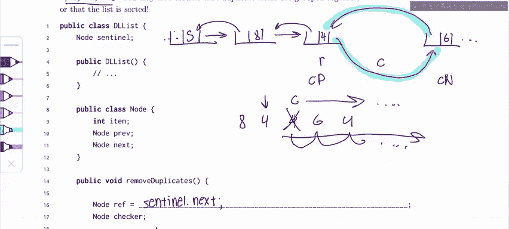

# UCB《数据结构discussion和lab｜CS 61B data structure sp 2024》中英字幕（豆包翻译 - P11：1 - Spring 2023 Exam Level 03 Problem 3.zh_en - GPT中英字幕课程资源 - BV1i1421x7wC

Everyone， this is Sherry and this is the spring 2023 exam level 3 walkthrough in this video I'll be going over problem three remove duplicates。

In this problem， it basically asks us to take a DL list。

 which hopefully you remember from lecture and just get rid of all the duplicate elements in it。

And one important thing about this problem is that we can't assume that the duplicates are grouped together so we can't assume that we have something like eight。

 four， four， four and all the fours are going to be here and we can see that here where we have two fourths here and then another four here。

So。Let's start off by just thinking about how to even find duplicates in a list in general。

One thing I might do is， let's say I have a list that's like this。

And we don't really care about what type of list is， let's just discuss this conceptually。

So if we look at this， one thing I might do is I might just start at the beginning of the list。

So let's say I started eight and then I'll check the rest of the list and see if there's any8s in this case there's no other eights so I know that eight doesn't have any duplicates。

Then I'm going to go to four and I'm going to check the reststle list and see if there's any four。

 There is a four here and a four here， so I know that these are both duplicates and should be removed。

So with that idea， you can see what I kind of did is I had two for loops。

 the first for loop goes through all the elements in the list and the second for loop。

 the inner for loop。Is going to compare all the items to this loop and see if there's any duplicates。

So let's just write that out for now， we don't really know how we're going to remove the duplicates because we have to do some pointer manipulation。

 but let's write out our idea of the two nested loops。So。

We notice that we're given two node variables ref and checker and if we think about this this ref probably corresponds to what we're comparing to and checker is probably going to go through the rest of the list so we want to start ref at the beginning of the list and for a DL list this is going to be Sinel。

Dot next。If you remember， we from lecture， Dists have a sententinel which gives it some nice properties and allows us to avoid like special conditions。

 but the Sentinel is not actually a node in the list and so the first node is going to be sententinel do next。

And now let's do our loop。 So how do we loop to the end of a deal list， the check is very simple。

We just check while ref does not equal Sentinel。And again， remember。

 this is because we have like a circular array structure。

 so the very last item in the list is going to point back at the sententinel so we know we've reached the sententinel we've gone through the entire list。

And then what is checker going to be Well where do we want to start checking for duplicates。

 we want to start right after our current element right so if my ref is at four。

 then I want to check everything else in the rest of the list to make sure there's no duplicates。

I don't want to start at four because obviously it's going to be equal to itself。

 so that's going to give me problems so I'll say checker equals rough。Dot next。And again。

 we also want to loop the checker to the end of the list， so we're just going to say well checker。

Does not equal Sentinel。And then sentinel。And then what is this if statement going to be， Well。

 we can probably guess that it's going to be if ref do item。If we find a duplicate。

 we need to do something， we need to do some removals。

Checker do item so now we just have to figure out the code for the actual removal。

And so again there's going to be some pointer manipulations now so I think it's always really smart to when there are pointer manipulations draw out a box and pointer diagram so here we're going to use the list from the example I haven't drawn out all the elements because it' a pretty long list but let's just say for the sake of argument that my Ref is currently here and my checker is here and if my Ref is here and my checker is here I'll notice that this is a duplicate element so I'm going to want to remove it。

And so。How do I remove it， I need to change the pointers so that in a way that this node is no longer in the list。

And so you notice that we're given these checker pre and checker next variables。

 so let's actually just mark them and see if they become useful later in the problem this is going to be checker pre and this is going to be checker next。

And so you'll notice that what I want to do first is I want to make sure that。This note。

 checker prev dot next。Points no longer to4， but it should point to the node after4。

 So instead of pointing here， our new pointer should be like this。

Because we're removing the four from the list。But we're actually not done yet because we still have this link right here that's pointing to this for。

 So it still thinks that this four is in the list if we go from。If we go backwards。So again。

 we need to change another pointer， which is we need to change this。

To kind of skip the four and point to the previous four。And so if we do this。

 we notice that there's nothing pointing to this node anymore。

 there's nothing like there's no pointers to it， so something called garbage collection is going to happen in Java and this node is going to be garbage collected is going to disappear。

And so now if you look at this list， we can see that it's valid。

 we have our Sentinel and then we have eight， and then with four and then we have six and we got rid of x for four right there。

😊，And if you go backwards， we can see that it goes six four， eight Sentinel。

 and again there's nothing pointing to this old four right here。

 which has disappeared from the blis completely。And so let's actually think about what we did in terms of code。

So we noticed that we have these checker preb and checker next variables。And what did we do， Well。

 first， we did checkerprev dot next。Equals check。Her。Thought next right。

 that's this point of manipulation right here where we changed it to 0 to six instead of four。

And the other point of manipulation we did is this backwards arrow。 And how did we do that。

 We did checker next dot previous equals checker。pre right so we're skipping checker completely and we're just basically changing the pointers to go one beyond or one previous。

And now that accounts for both of our changes， so let's put this into code。

Let's put this into a code。Paste and I'm just abbreathating Checker privacy CP and checker and XN just for the sake of writing was。

And then the last thing we need to do is sure we removed one duplicate。

 but there's lots of other duplicates in this list， so we need to keep。

 remember when we had this list earlier。Once checker is here and we done removing this。

 we still need to move Checker through the rest of the list。So how do we advance Checker well。

 we need to reassign it to something and what should we reassign it to。

 we should probably reassign it to Checker next because。That's the next node in the list。嗯。

And then we see that we have an else case， so if we don't find a duplicate。

 then we can just still assign it to checker dot next。Because we want to move on to the next element。

 like I said， like we saw earlier in this example， checker needs to go through the entire list。

 so it's going to go from four， six， four， dot dot dot， all the way to the end of the list。

And then finally we also need to change ref right so after we've gone through the entire list and we saw if there's duplicates or not we need to change our ref so let's say our ref is currently at8 we want to move it on to four and then we want to check the rest of the list to see if there's anything equal to four so similar to the checker we're going to move ref to the next element which is going to be ref dot next。

That's it for this problem and here's my weekly exam tip。

If you're ever stuck on a problem involving w linked lists， single linked list， inlist。

 any kind of list， it's very helpful to draw a conceptual example。

 you can see up here that sometimes we don't even want to think about it as a double linked list we just want to think about it as a list itself and kind of just understand how to do it as a person before jumping into the code。

诶。Good luck in the rest of 61 B and in this week and feel free to leave any comments or questions below。

