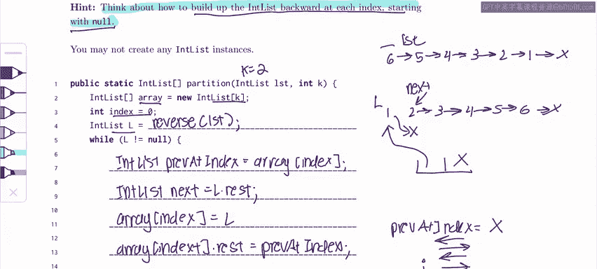

# UCB《数据结构discussion和lab｜CS 61B data structure sp 2024》中英字幕（豆包翻译 - P12：2 - Spring 2023 Exam Level 03 Problem 2.zh_en - GPT中英字幕课程资源 - BV1i1421x7wC

Everyone， this is Sherry and this is the spring 2023 exam level3 walkthrough in this problem I'll be going over problem two partition so this problem has a lot of complex looks kind of complex but if we actually break it down it's asking us to do something relatively simple。

 which is that we're going to get an inlist and we're going to split it into an array of in lists as evenly as possible and we can assume that the in is always divisible so we're not going to have like any weird leftover elements or anything。

And another really important thing to notice is that we're given this method reverse and we're given the hint that we should build up the in list backwards at each index。

 so if we look at what's in the skeleton we can see that we have the array variable we have the index and we have L and immediately we know we should probably just reverse our argument list because we're given this reverse function and there's nothing really else to reverse so we can probably make an educated guess that we're supposed to just reverse it in this one。

And given that， let's look at an example of how we might do this problem before we start writing any code。

 so if we look at this， we have done one thing so far which is reverse the list so if we take the example in list that's given in the problem 65。

4，321 and' reverse it we're going to end up with 1，2，3，4。

56 and right now L is going to be at one it's going to be pointing at the beginning of the list and our array we're using the example of k equals 2 is going to have two elements and right now everything in that array is null because we haven't put anything in the array yet。

So I'm just going to kind of show you guys an example of how you might build up this in list and then we can try to translate this into code so right now let's say。

I， I'm going to abbrevi the index as I and I is at zero， so it's right here。

So what I'm going to do is I'm going to take I'm going to look at L。

 I'm going to say what is where is L L is currently at this node one。 So first I'm going to。

I'm going to take whatever L is right now and then。

I'm going to put it here and I'm going to remember what was originally at index I and put it after。

 so now I have a one element list at this index and then I'm going to advance O。So now L is here。

And I'm going to advance my index， so I'm going to move index here。

And now what I'm going to do is I'm going to do the exact same thing I did before。

 I'm going to look at what L is， I'm going to look at what's at my current index and I'm going to combine them。

 so I'm going to take two。And。Put the k null after it。

 So now I have I have partitioned the first two elements of the in list。And let's keep going。

 I think the more we go， the more you'll kind of see what the pattern is。

 so now let's advance L to the next element， which is going to be three。So I don't want to。

I don't want to keep adding at this index because if I just keep adding to index1。

 I'm not going to end up with an even partition， So I kind of want to move back to this index。

And we'll think about how to do that later， but let's for now just say that I move I back to the zeroth index。

And so now it's back at the zeroth index， I'm going to look at what L is it's three。

 and I'm going to look at what's at my current index。

 which is this in list of one x and so I'm going to。

I'm going to take three and I'm going to put all the rest of it。

 whatever is at my current index after the three so if I do that now i'm going to have three。

 one and then the null。And again， I advance L。 now it's at 4， I look at4。

 I take whatever is at my current index。So I'm going to move my index here and then4，2 x。

 and then again， I'm going to move L to 5。And I'm going to basically take all this stuff。

Put five there and put everything else after it。And then I'm going to do the same thing。

 I'm going to advance L one more time， it's going to be six and。

I'm going to put six here and I'm going to put everything else after it。

And you can see that this ends up giving me a valid partition。

 right because I have three elements at each index and the order from the original list。

 which is list is preserved because we have 531 and then 642。

So now that we've seen how to do that kind of in a box and pointer like drawn out kind of way。

 let's try to translate this into code。Especially this loop right here。

 so we've already filled out the reverse part， which was this part where we changed list into L。

And we just have to figure out how to do the rest of the stuff we're doing。

 which is where we look at what L currently is and we take everything and we put it after that element。

So let's start by figuring out what's currently at our index I so if I is here I need to figure out that oh there's like this whole in list here already and I don't want to lose it so i'm going to do this I'm going to do in list。

Preve at index。Equals array。Of index， right， So this ensures that I like actually save what's at the current index because I've been building up this list。

 I don't want to lose it。And then。I'm going to say int list。Next。😊，Equals L dot rest。And again。

 this is really important to do because remember we're not allowed to actually create any new pointers。

 so all theers point of manipulation we're doing is in this list。

 so when I change one to point at X I'm literally changing this pointer to point at X and you notice that if I do this and I don't save that to this variable that two is next then I'm not going to be able to access the rest of this list it's just going be lost because theres no pointers to it anymore so I need to artificially create another variable next to point at this before I start changing all the pointers within the list itself。

Okay， so now I've done that。And now the next thing I'm going to do is remember what we did is we take whatever is at the current。

 we take the current index and we kind of like prepend L on top of it。

 So what does that look like I'm going to say array of index。

Eals L and let's actually draw what we're currently at just to kind of allow you to visualize how this code translates into a box and pointer diagram so L is at one right now because we haven't done anything to it and next is pointing to this too pre that index is null because we haven't put anything there yet and now we're saying array of index equals L so。

Pv at index。Eals x and i'm just using x for null as a representation and so now we're saying a index equals L so this is going to point to L and then the final thing is we don't want one to point at this list anymore we want one to point at x right。

So what we're going to do is we're going to do this and what that looks like in code is going to be array。

Of index。Dot rest。Eals prev at index and in this case it's just null。

 but this would be like the int list that we've built up so far at this index and we're just preending the new element to the front of it。

And then the next thing we want to do it is we want to advance L like we did earlier because we want to keep moving on so next element。

 next element， next element until we reach the end of the list。

 and so we can just really easily do that by saying L equals next。And finally。

 what we need to do is we need to update our index。

 So if you remember earlier when we had this two element list we said that index starts at zero。

 then it goes to one， then it kind of bounces back to zero， then it goes to one。

 then it goes back to zero again so it's kind of like wrapping around instead of。

Instead of just like adding to index each time so it starts at zero then one then two。

 this is bad because that would be out of bounds， so what we actually want to do is we want to go01 and then when we reach2 instead of actually going to2。

 we want to wrap back around to zero。And we can see that in this problem。

 we're given the modular operator， which is really useful because how this is going to work is if I have zero。

Then I add one， I'm going to be at one， then I'm going to be at two， but if I do two mod2。

 that's actually  zero， so it's going to wrap back around to zero。And so I can do index。Plus one。

 mod array。Dot length and since I'm modeldding by array dot length。

 it's never going to actually exceed array dot length。

 and so I won't ever get an out of bounds error。And then at the end， of course。

 I just returned the array that I made。Hopefully this problem was a good practice on using arrays and in together。

And again， my weekly exam tip for coding problems， even though it doesn't explicitly ask you to draw out a diagram。

 it can be very helpful because it would be really hard to come up with this stuff just from scratch。

 but if you're doing it based on a box and pointer diagram and you already know what you want to do。

 it's just a matter of translating into code which is much easier。

Good luck this week and in the rest of 61b and feel free to leave any comments or questions below。

