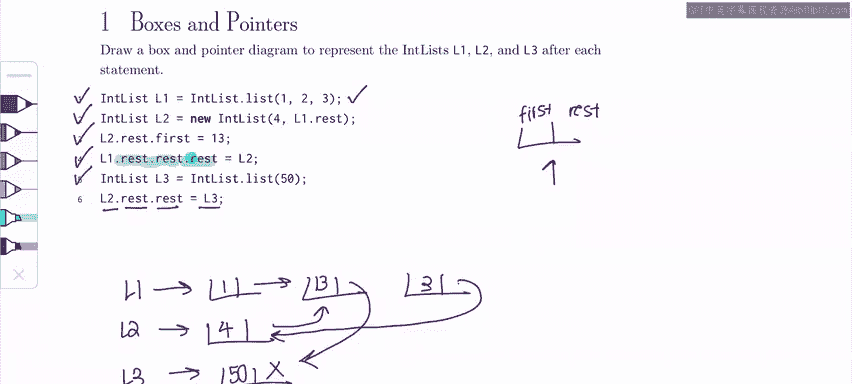

# 数据结构与算法：P13：3 - 盒状图与指针问题解析 🧩


在本节课中，我们将学习如何绘制和分析盒状图与指针图。这是一种用于可视化链表等数据结构内部连接关系的重要技能。掌握这项技能不仅有助于直接解答考试中的相关问题，更能帮助你理解和调试代码。

## 问题概述

我们将解析一个来自2023年春季CS61B考试第三级的问题。这个问题涉及一个名为 `IntList` 的链表结构，它包含两个属性：`first`（存储整数值）和 `rest`（指向下一个 `IntList` 节点的指针）。我们将通过逐步执行代码来绘制最终的指针图。

## 逐步解析

上一节我们介绍了问题的背景，本节中我们来看看具体的代码执行步骤。

### 步骤一：初始化链表 L1

首先，我们创建链表 `L1`，其值为 `[1, 2, 3]`。在盒状图中，每个节点被表示为一个包含 `first` 和 `rest` 两个框的盒子。`rest` 指针指向下一个节点，最后一个节点的 `rest` 指向 `null`。

```java
IntList L1 = IntList.list(1, 2, 3);
```

绘制结果如下：
*   `L1` 指向第一个节点，其 `first` 为 1，`rest` 指向下一个节点。
*   第二个节点的 `first` 为 2，`rest` 指向第三个节点。
*   第三个节点的 `first` 为 3，`rest` 为 `null`。

### 步骤二：创建链表 L2 并建立连接

接下来，我们创建链表 `L2`，其 `first` 值为 4，并将其 `rest` 设置为 `L1.rest`。这意味着 `L2` 的 `rest` 指针将指向 `L1` 链表的第二个节点（值为2的节点）。

```java
IntList L2 = new IntList(4, L1.rest);
```

### 步骤三：修改 L2 所指向链表的值

然后，我们执行 `L2.rest.first = 13;`。这行代码的意思是：沿着 `L2` 的 `rest` 指针找到下一个节点，并将该节点的 `first` 值从 2 改为 13。

### 步骤四：修改 L1 链表的尾部连接

这一步是关键操作。我们执行 `L1.rest.rest.rest = L2;`。这需要我们从 `L1` 开始，连续跟随三次 `rest` 指针：
1.  `L1.rest` 指向第二个节点（值已变为13）。
2.  `L1.rest.rest` 指向第三个节点（值为3）。
3.  `L1.rest.rest.rest` 原本是第三个节点的 `rest` 指针（指向 `null`），现在被修改为指向 `L2` 节点本身。

### 步骤五：创建链表 L3

我们创建一个新的单节点链表 `L3`，其 `first` 值为 50，`rest` 为 `null`。

```java
IntList L3 = new IntList(50, null);
```

### 步骤六：将 L3 接入链表

最后，我们执行 `L2.rest.rest = L3;`。这需要我们从 `L2` 开始跟随指针：
1.  `L2.rest` 指向第二个节点（值为13）。
2.  `L2.rest.rest` 原本指向第三个节点（值为3），现在被修改为指向 `L3` 节点。

## 核心技巧与总结

以下是解答此类问题时的一些实用技巧：

*   **耐心跟踪指针**：对于每一行代码，都要清晰地画出指针的指向变化。使用箭头明确表示 `rest` 指针的指向。
*   **区分节点与值**：记住，`rest` 指针指向的是整个节点（盒子），而不仅仅是 `first` 值。
*   **逐步绘制**：严格按照代码执行顺序更新你的图表，避免跳跃步骤导致混淆。



本节课中我们一起学习了如何通过盒状图与指针图来逐步分析和可视化链表的操作。我们跟踪了指针的创建、重定向和值的修改，最终得到了反映代码执行后内存状态的完整图示。掌握这一方法将极大地提升你理解和设计链表相关代码的能力。