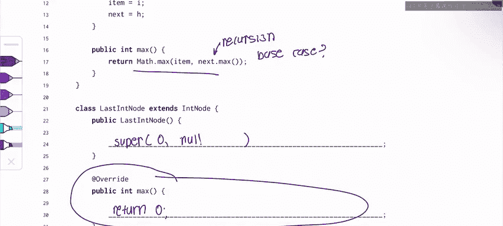

# UCB《数据结构discussion和lab｜CS 61B data structure sp 2024》中英字幕（豆包翻译 - P17：1 - Spring 2023 Exam Level 04 Problem 2.zh_en - GPT中英字幕课程资源 - BV1i1421x7wC

🎼哈比哈比。🎼我比。

🎼And。Everyone， this is Sherry， and this is the spring 2023 its exam level4 walked through for CSs 61 B in this video。

 I'll be going over problem 2 list inheritance。😊，Okay。

 so this problem is actually quite a complex problem because it kind of combines two ideas that we've been working on so far in this class。

 which are the idea of a linked list and the idea of inheritance。

So just for a quick overview of this problem， we have this DMS list class which is a structure that you might be familiar with it's a singlely linked list with the Sentinel node we notice that we have the Sinel node here and then we have this in node class which has an item and a next pointer。

So our list will probably look something like this that I've drawn right here。And。😊。

We are told in the problem that we have to make the max method work。

The max method should return 0 if the list is empty， otherwise it returns the max element。

Two other important things to remember are that all numbers inserted into the DMS list are positive and we only insert using insert F。

 so we're never going to put anything at the end of the list。

 we're only going to add stuff at the beginning of the list。

And this will come into play later in the problem。There's a couple lines that we have to fill out in this problem。

 the first is this constructor up here and the last two are these methods and constructors of the last End node class。

So before we start writing code， let's just try to parse what's actually going on in this problem。

If we look at the max method of the inn class， we notice that it's recursive。

 it calls math dot max on item so the current item in the int list and。The rest of the list。

WeWe call next。m， which is just saying recur on the rest of the list。

So something that you might remember from previous CS classes is that when we have recursion we need a base case and in this case we don't have a base case。

 so what's going to happen is we're going to keep going。

We're just going to keep calling next do max next max next max。

 next max until we reach the last note in the list。

 which is going to be null and as you might have seen before， if I try to do something like null。

 max，It's going to give me a null pointer exception so we can see that this code will not work unless we do something to add a base case。

 but we actually can't modify the max function so what are we going to do to add a base case this is where the last inn class kind of comes into play if we think about this。

 the base case is always when we reach the end of our list which is null but what if instead of null at the end of our list。

 we put a last we put a last inn。And this last innote is not really a part of our list。

 it's kind of like the Sentinel in that it just makes our code nicer and allows us to handle special cases gracefully。

Um so our list， instead of having just a null at the end of the list。

 it's going to have a last in node and that's going to represent kind of the null at the end of the list。

And we noticed that。We can't actually change the behavior of the max method。

 but if we allow last inn to extend intnote as we've done in this problem。

 we can override the original max method and stop it from like infinitely recursing until it hits null and then causes an null pointer exception。

So instead， maybe we can do something to this max method that allows it to reach the base case。

So now we just have to think about how to construct this last node and how to write this max method so that it overrides the original max method and allows us to reach a base case。

Let's just start at the top so first we're saying Sentinel equals new int no negative 1000 and what's the second argument well we don't really know yet。

 but just something in a note is that the value of the Sentinel doesn't really matter so if we give it negative 1000 it doesn't affect it that much。

So to figure out what goes in this blank， let's go back to our list structure as an example appear。

 we know that we have the sententinel at the beginning of the list。

 a bunch of nodes in the middle and we have the last at the end。But inside the constructor。

 our list is empty， we're creating a new empty list and again， like we said earlier。

 this list is going to have a sentinel in it and a last bit node in it and both of those are not real nodes in the list。

So when we have no real nodes in the list， everything in the middle here is not going to exist。

 but we're still going to have our sentinel and our last in node。So in a new list。

 we always construct a new int node and its value is going to be negative 1000。

 and the next is going to be a new last int node。Okay。

Now let's fill in the last intnote class so it has the correct behavior。First。

 we're going to use the last innote constructor to give it the correct properties。

And so one thing we probably want to do is we can just call this constructor because the inote class already has a constructor and the way we call that constructor is by doing super。

And we just pass in the arguments I and H。 So if we look at this。

 we notice that it returns0 if the list is empty， otherwise it returns a max element。

So this should kind of hint to you that。The last innode like we said is very similar to the Sentinel。

 so the value of the last in node shouldn't matter too much。

 so let's just say that it's zero and this will help us out if in fact like some we mess up some code and we accidentally try to access the value of the last in nodeode is going to be zero which will be correct if the list is empty。

Okay， and。If we look at the second argument， what is the next of the last int node。

 well the last in node is the last node in our list， it represents the last node。

 so there's not going to be anything after it， so the next is going to be null。Okay。

 now let's move on to maybe the most tricky part of this problem。

 which is the max method of the less in node。And this is where we have， like we said earlier。

 we have to handle the base case。And what should the base case be， well again。

 we note that it says it returns zero if the list is empty， otherwise it returns the max element。

If we reach the last int node。What is our base case。

 Our base case is if the list is empty if we're at the very last node in our list and in what that case。

 what should Max return， Well， it shouldn't keep recursing and it should do what it's supposed to do。

 which is return。Z， because that's our base case， when we have an empty list。

 when we have no more nodes in our list， we should return zero just like the problem specifies。

And that's it for this problem， so again to summarize we kind of created a second Sinel node and the second Sentinel node is not a real node in our list。

 but it allows us to have a base case。For recursion。

Okay and again this is it for this problem and now for my weekly exam tip for problems like this where you're recursing on some kind of linked list it's always very helpful to think about having your recursive case and your base case and that's kind of how we started this problem right we looked at this max method and we noticed that it was handling the recursive case and not the base case and because of that we were able to figure out that we needed to override and have a base case here。

Good luck in the rest of this week and in 61B and feel free to leave any comments or questions below。

