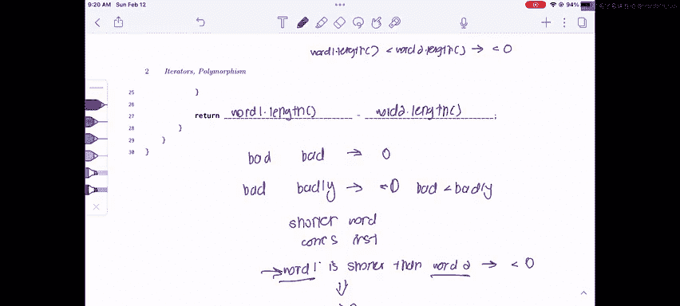

# UCB《数据结构discussion和lab｜CS 61B data structure sp 2024》中英字幕（豆包翻译 - P21：1 - Spring 2023 Exam-Level 05 Problem 1.zh_en - GPT中英字幕课程资源 - BV1i1421x7wC

This is Sherry and this is the CS61B spring 2023 exam level 5 walkthrough in this video we'll be going over problem one take us to your so in this problem we're looking at an alien alphabet class that has a nested alien Comparator class inside of it and our goal is to parse the strings lexical graphically but the kind of catch in this problem is that the order is different from the normal English alphabet so we can't just use built incomp method for strings。

And。😊，If we look at the alien comparator， for example， if you have this order DBA。

 which means that our alphabet is like instead of ABC， it's DBA and then some other stuff。

If we compare dab and bad， we're going to say that dab is before bad。

And just as a reminder for what comparators actually do， they have a compare method。

That compares two objects。And if a is less than B， it returns something less than zero。

 if a is equal to B， it returns zero， and if a is greater than B。

 it returns something greater than zero。And so our job will be to actually figure out how to compare these two strings based on this weirded alpha that they were given。

And just as a final note， there's kind of like a weird edge case here where if the words are not the same length。

 if one word is an exact prefix of the other， then the shorter word comes earlier in the alphabet and that's kind of how it works in English too so if we have bad that comes before badly because bad is shorter。

Okay， so with that information we can kind of start just jump into writing the whole comparator The first thing that we want to do whenever we have a comparator is that we want to implement the comparator class sorry the comparator interface and the compar interface is a generic type so we have to specify the type that we want in the brackets here in this case we're comparing to strings word one and word2 so we would implement comparator of string。

And then the rest is just filling in the skeleton， so let's kind of try to parse what the skeleton wants us to do we have this int mid length and to think about what min length is going to do。

 we want to think about we kind of want to think about it in conjunction with the for loop。

If you noticed， we're comparing two strings and so that kind of suggests that we want to probably compare the strings letter by letter because if we don't compare it by if we don't compare it letter by letter。

 how are we supposed to know which one comes first？So we' comparing letter by letter。😊。

Are probably going to have to iterate through each of the strings。

But if we are iterating through each of the strings。

 we're going to have to index into the strings and we have to be careful to avoid going out of bounds。

 And remember the problem says that we can't assume that word one and word two have the same length。

 So what if word one is like。Some really short word like a and word two。Is some really long word。

 like super ca super， super long word。If we try to index， like index。Three into this word。

 it's going to be out of bounds and we're going to get error。So。

That probably suggests that min length should be the minimum of the length of word1 and word two because we only want to keep iterating until we reach the end of one word we never want to go out of bounds for either word so let's fill that in word1。

 length。N or two。Dot length。And like I said， we want to think about min length in conjunction with our for loop and we want to stop when we reach the end of either word because again we don't want to go out of bounds for either word。

 so we're going to make our for loop start from zero like usual and it's going to go up until min length so it's going to go up until we reach the end of one word and we're going to I++。

We're going to increment I like usual。AndNow we have rank one and rank two and these are probably something that we want to use。

We have rank one and rank two and we want to think about okay what are rank one and rank two well we probably want to think about comparing the individual letters like I said earlier if we compare the individual letters。

We want to check if each individual letter comes earlier than the other letter。 But again。

 we can't just do that by saying like， oh， compare。

A and B because in this case the ordering is different from the English alphabet。

 so the native Java compare method for characters won't work in this case。

So probably what we want to do is we want to check which letter comes earlier in the alphabet because if one of the letters comes earlier in the alphabet。

 then we know that that word also comes early in the alphabet right so if we have DAB and DBA we want to compare A and B to see which one comes earlier so we know whether DAB or DBA is actually the lesser word。

So。There's kind of two steps in these in what I just did here first I have to extract the correct letter from each word and then I have to find out where it is in the alphabebet。

So let's first just extract the correct letter， which is going to be word1。car at。

I and word2 the car at。はい。And now that we have that， we can kind of think about okay。

 now how do I figure out which one comes earlier and to figure out which one comes earlier。

 for example， if I have D and A and my alphabet is DBA。

I just have to figure out where it is in the alphabet， so in this case D is at index0。

 a is at index 2， so I know D comes before a。So if we look at the problem。

 we actually have a very useful hint which tells us we might want to use the index of method。

And if you kind of think about the index of method and you think about what I did here。

 I'm literally just finding the indices of each letter and once I found the indices of each letter the one with a smaller index comes earlier that's super helpful to us because that's exactly what we want to do we want to find out which one comes earlier so let's just do order。

The index。Of and we're going to find the index of the word one character。

And we're going to do the same for the War I character。And now we have the ranks of each。

Letter so we know where they come in the alphabet and we can just compare them。 So if car one rank。

I's less than cartoonrink。We return negative one because that means the first word has a ladder that comes earlier than the second word。

Otherwise， if we have the reverse case of car1 rank。Is greater than cartoonrink。

We return one because that means the first word comes later in the alphabet and the second word。

And if the two letters are equal， so if we have DA B and DBA and we're comparing the two Ds， well。

 that doesn't give us enough information to say if one word is earlier than the other。

 so we have to move on to the next word。And that just means we continue in the for loop and we don't jump and return immediately。

Finally， we have this last line that has a return statement and it has a minus so we want to think about what is this for well we would only get to this return statement if we finished the entire for loop and we didn't return anything。

So if we finish the entire for loop， that either means the two words are completely equal。

 so maybe we have bad and bad or we have that special case that I talked about earlier where we have two words where one word is a prefix of the other because remember we're only going up until we reach the end of one word so if we compare the first three letters of this word and the first three letters of this word we don't have enough information to say which one is equal。

So。What should we do in this case， well， if we look at these two examples in this case we would want to return zero because bad is equal to bad。

 but if we have the second case， we want to return negative one because technically bad is less than badly。

And。A very important thing to remember is the shorter word。Comes first。So if word one。Is shorter。

Then War two。We should return a negative number。And if the reverse case is true。

 we should return a positive number。So a trick for doing this is we notice that what we're doing here is we're comparing the lengths of word1 and War two。

So if word 1 dot length。Is less than were two doling。Then we won't return something less than 0。

 Well， we have this handy subtraction hint right here。

 And what happens if we subtract word1 dot length minus word 2 dot length？ Well。

 if it's shorter then it's going to return a number less than 0， if it's equal。

 it's going to return 0。 and if it's greater， it's going to return a positive number。

 which is exactly what we want our comparator to do。So for our final line here。

 we can just return word 1 dot length， minus word2 dot length。

And that will give us exactly the behavior that we want our comparator to have。

That's it for this problem and for any problem where you're implementing a comparator。

Just remember this idea right here， comparators always have a compare method and it compares two objects A and B。

 if A is less than B， it returns something less than zero， if they're equal， it returns zero。

 and if it's a is greater than B then it returns something greater than zero。

Good luck this weekend and the rest of 6 UMV and if you have any questions or comments。

 please leave them below。😊。