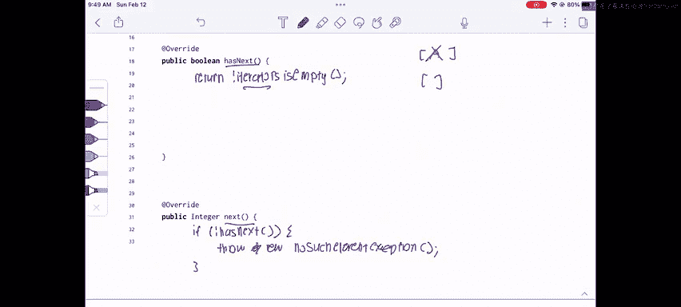

# UCB《数据结构discussion和lab｜CS 61B data structure sp 2024》中英字幕（豆包翻译 - P22：2 - Spring 2023 Exam-Level 05 Problem 2.zh_en - GPT中英字幕课程资源 - BV1i1421x7wC

Everyone， this is Sherry and this is the CS6 UMB Spring 2023 exam Mo 5 walkthrough and this video we'll be going over for Proble two iterator of iterators。

To start off， I wanted to give everyone a reminder on how iterators work， so if we have an iterator。

 it has to implement two methods has next and next。

 and has next returns a boolean that indicates if there's any items left in our iterator and next returns the item that is actually the next item in our iterator。

And so if we kind of apply this idea to our problem。

 we're given that we're implementing an iterator of iterators that is itself an iterator and it's going to accept a list of iterator integer objects so these are going to be a bunch of iterators who return integers and what we're going to do is we're going to kind of cycle over these iterators in around Robin fashion where we get one item from each iterator and then move on to the next and then get one item from each iterator and then loop around to the front and then get one item from each iterator and loop around to the front。

That might sound a little bit abstract， so let's just go over the concrete example that's provided in the problem to kind of understand how this would work。

So what we're doing here is we have three iterators and one has one，3， four。

5 one is empty and the last one has two so what should we do in this case well we're first going to look at the first iterator a and we're going to get one item from there so we're going to get one the next iter is empty so we're just going to ignore that then we're going to get two then we're going to loop back around to the front of the list and we're going to get three then we're going to go to the next one and none of these have anything left in them so we're just going to get four and five。

So our final return values would be one， two， three， four， five from our iterator of iterators。啊。

So given that， let's do this example again， but let's think about how we might implement this in code。

And。There's a couple different steps to doing this first let's think about well we're passed in we're given this list integer list iterator of integers so we probably need an instance variable that has that stores this list of iterators。

 so let's just do that。Let's for no particular reason， let's just make it a linked list。

So now we have a linked list of iterators of integers。And let's just call this iterators。And in here。

 we're going to say iterators。Equals a new linkeding list。

And now that we've kind of set up our iterators list。

 the first thing we probably want to do when we're given this entire list A is we just want to filter out anything that's empty right because if it's like this。

 if we go back to this example of A B and C， we're never going to get anything from B because it's already empty so there's no point in like keeping it around。

So what we probably want to do is let's just iterate over our list and look at each of the iterators and if any of them are already empty then we don't need to do anything with them and we don't even bother putting them in iterators so let's do that for each iterator。

Intager。Iterator。Ay。If only if the iterator。Has next。

Which means that there are still items left in this iterator， then we do iterators。

t add iterator so that way in our after our constructor we know that everything in iterators has at least one element。

 so there's no empty iterators in our list in our instance variable here。

So now that we've set our our constructor we have to do this part where we actually implement the iterator class so we implement iterator and what values are we returning well this is a little bit tricky but if we look here even though we're taking in a list of iterators our iterator of iterators actually still returns integers right because in the end we return each value from each iterator one by one so this is actually also an iterator of integer。

And should implements。And now for the more tricky parts。

 let's think about has next and next and let's go back to our example and think about how we might do this。

 so if we have this list A and C， how are we going to kind of like cycle over them instead of just like getting everything from one iterator and then getting everything from the next iterator because we have to kind of bounce back and forth between them。

诶。So for an example of this， let's just kind of think about what we might do so let's just remove the first item。

And this is going to be a list， so we're going to have A and C in our list of iterators。So first。

 let's remove a and get one item from it， and that's going to be one。And then let's put it back。

 but instead of putting it at the front of our list， let's put it at the end of our list。

 so we're going to put a back here and that's perfect because now we can just repeat what we did。

 we're going to remove C from the list， we're going to get one item from C and then instead of putting it back at the front of the list。

 we're going to put it at the end of our list but you notice that we already got everything from C so we don't need C anymore so instead of putting it back at the end of our list。

 we can just not put it back at all。And now we only have a left。

 so we're just going to keep grabbing items from a， we're going to get four， we're going to get five。

And that's exactly way we want I want to return one， two， three， four five。

 So just to recap what I did there， I had all my iterators in a list。

And then what I do is I take the first item， I remove it from the list， I get an item from it。

 and then I put it back at the end of my list。😡，So it's going to go here。

 but then I remove the first item from my list。I get an item from it and I put it back at the end of my list only if it has more items left。

 but in this case C didn't have anything left so I didn't put it back in my list。😡。

And that's how we're going to do this， that's how we're going to cycle over all the elements。

 and that's also how we're going to keep track of if the iterator has any items left in it。

So let's do the next method first and then jump back to the HaS next method。

The first thing that we usually just do in the next method is we check if not has next。

Because you shouldn't be calling next without。Checking has next first。

 so if the iterator doesn't have any items left， we usually just throw a new。

Throw a new no such element exception。And this just means you can't call next if there's nothing left in the iterator。

Okay， and now let's move on to the next part， which is a little bit more difficult where we're going to implement this kind of like take one iterator。

 get an item from it and put it back at the end of the list。

So let's first declare an iterator of integer， and this is going to be the first。

Iterator in our list and we're going to call this iterator and then let's just get the first iterator from our iterators list do remove first。

And we're going to get an item from this iterator and we know that we can safely get an item from this iterator because if the iterator doesn't have anything in it we're going to filter out we're not going to put it back in the list。

 so we're going to do int ands。And this is the next item in our iterator。

And we're just going to call iterator。t next because remember， these are iterators。

 so they have the next and has next methods。And then the next thing we're going to check is if the iterator actually has any items left after we got one item from it。

 so if the iterator has items left， then we put it back in our list。

And we're going to put it at the end of our list because we want to cycle across all the iterators。

So we're going to add it back to our iterators list。

 and then we're going to return the value that we just got， which is ants。

So that kind of implements the cycling overth and also the filtering thing that we saw earlier。

And then finally， let's work on the has next method and this one is relatively simple we just check。

😊，Return。If our iterators is empty because remember our iterator of iterators is empty when every single iterator inside the list is empty and how do we calculate all of if this entire list has nothing left。

 well if we've used up all the items in all our iterators we don't put them back in the list so at the point where there's no more iterators left in our iterators list then we know that we've finally gone through all the iterators used up all elements and there's nothing left。

That's it for this problem。And here's my weekly exam tip for iterators it's really important to remember that they implement two methods has next and next and if you're ever stuck just write down has next to the next and try to figure out what the correct return value should be。

 what the correct return types should be， and what you might want to do is just draw an example like I did here so you can figure out how to implement those methods。

Good luck this week and in the rest of 61b and if you have any comments or questions。

 please feel free to leave them below。