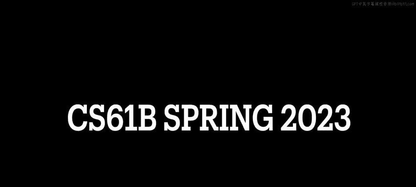
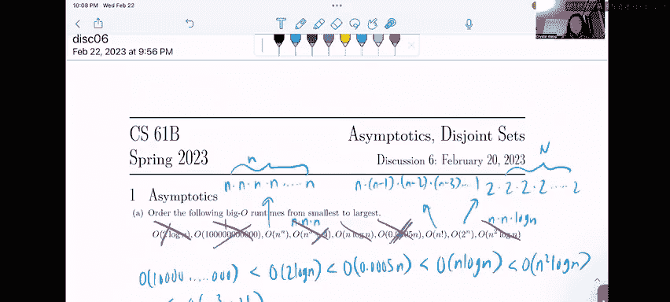
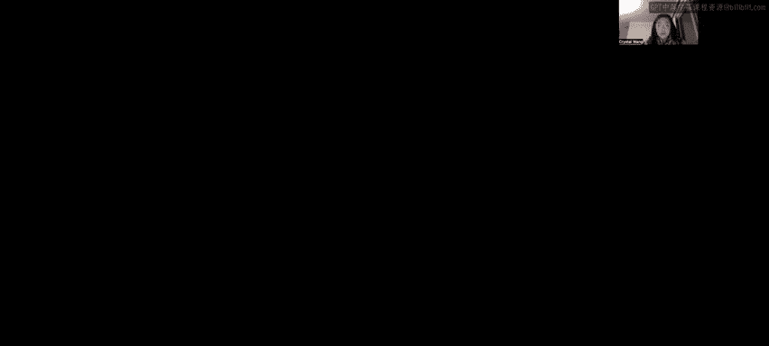
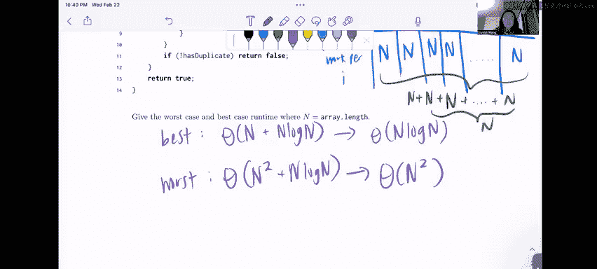

# UCB《数据结构discussion和lab｜CS 61B data structure sp 2024》中英字幕（豆包翻译 - P24：2 - Spring 2023 Discussion 06 Question 1.zh_en - GPT中英字幕课程资源 - BV1i1421x7wC

🎼发 me发 me。🎼Oh你。

All right， let's get to the worksheet with question one this is just about asymptotics and there's a bunch of like small little subparts that ask some questions about asymptotics generally so in part A as a warm up let's order the following big O runtime from smallest to largest so before we begin。

I just want you to look at all these like very random runtime， like two to the N or like。Po0，0。

05 n or like n cubed plus 4。 And think about what matters to us when we are analyzing asymptotic runtime。

 So there are two things that we don't care about when we are trying to compare asymptically。

 And the first thing is constants。 We want we're going want to rule out all constants。

 And the thing is we want to eliminate lower order terms。 So let's run through。

All these all of these possible runtime and get rid as of as many constants or lower order terms as we possibly can。

So first up in this two log n， we're going to knock out this two， we don't care about that for this。

I don't even like a quadrillion or something like that。

 This is a constant right It's just a number that's a constant so we can knock this out to be effectively one right so this is constant time this end to the end there isn't anything we can reduce about that this n cubed to the four。

 however， we have N cubed plus four which means that n cubed is going to dominate this runtime right like in the long run。

 this plus four really does not matter。 It's a lower order term right if we think about our terms in。

And the order of growth hierarchy， we know that constant is the slowest and then like somewhere along the way later it's n cubed right a cubic function。

 so we basically ignore this constant this plus four because we know that as n gets very。

 very large that plus four is going to be pretty much inconsequential， right。And log n。

 we can't really reduce anything from that for this point0005 and even though that's a very small or like it's not that small。

 but it's like kind of a small decimal that will。😊。

S the the scale the value of n down quite a bit again in the long run constants don't matter because as n gets very。

 very large 0。0005 times n is itself going to be very large so we're going to ignore。

This constant right here， you know what， maybe actually maybe ad better if I like highlighted in white。

Oh。I'll like color it in white so we don't have to look at that。Actually， no。

 I'm going to stick with this so we can actually order them properly at the end。

Then we move on to o of n factorial and we can't really reduce anything from that o of2 to the n we can't really reduce anything from that either like the two technically it's a constant but it's like the base right and then finally we have n squared login once again we can't really get rid of any constants or lower order terms on this so we'll just have to stick with it okay so now now we know that。

Let's try to get our runtime in sorted order based on the hierarchical orders of growth that we covered in the content review right because here we've kind of just like boiled down all these like weird looking runtime into the most basic like normal like normal looking ones that we can find so first up。

Is we have this constant one over here right even though that's like a massive massive number at the end of the day it's still a constant and it can just be scaled down so what we're going to do。

Is say that this constant one。I'm not even going to write all of the zeros because I don't even know how many there are is the smallest one。

 it grows the slowest， right？Then next up， let's see if we have a log n term。

 we do have a log n term its says two log n1 here。 we know that log n grows the next slowest after constant right and then after that after log n the next slowest is linear we have a linear term Yes。

 we do we have this 0。0005 n so we know that's going to oops。

That's going to grow a little bit faster。Then the two log n。

And now let's look for a quadratic function because we know a quadratic function is next up oh sorry。

 not a quadratic function。 log n is next up in the hierarchy of how fast things run right then it would be like a quadratic function do we see n log n cool we do so we can order that up next so we can say that O of n log n is the next fastest and then we would look for something like n squared do we see n squared No we do not and then now we have to figure out what comes next in terms of the hierarchy of how fast things grow right our possibilities might be n cubed or n squared log n Okay so let's break this down n cubed is basically n times n times n and n squared log n is basically n times n times log n So when you do the math at the end of the day you'll see。

😊，That this log n。Instead of being an N as it was for N cubed， I'm actually going to write this out。

N times n times log n。This the fact that this is a log n term and not n means that it's going to make this overall runtime grow a little bit slower than the n cube right because we know that log n grows a little bit slower than linear。

 so that's why the next one in our hierarchy is going to be n squared log n。

And then you've probably kind of guessed what the next one is， it's going to be that cubic term。

 right， because it's n times n times n。Its four。And then。Sure， I'm going to cross these out as I go。

 I don't realize why I didn't do that earlier， I'm sorry。We're done with these。

 we're done with these。 Okay， and then now we kind of have to narrow down n factorial2 to the N and n to the N。

 Okay， so these are all pretty ugly numbers。So。First up， let's kind of break down what we see here。

We'll see that。2 to the n is going be。Two times 2 times2 times two all the way up to the last two。

 but this is n times。Right， and then n factorial is n times n minus1 times n minus2 times n minus3 right all the way down to1 and then n to the n is n times n times n times n times n and this itself happens like n times okay。

So intuitively， I think it makes sense for us to compare n to the N and the n factorial first because we can clearly see here that n to the n is going to run faster than n factorial because they are both multiplying together n terms。

 but this one for n to the n is it's consistently n versus the one for n factorial。

 the value of n decreases every single time with like the number that you're multiplying so we can see here that n to the n is going to run faster than n factorial。

😊，And then。Now， we have to make a comparison with two to the n。 So the issue is that， okay， well。

 what if n is like2 right， then we would do like two times 1 times 0。

 That's for you're going to grow slower than two to the n， right。But you have to remember that。

We only care about asymptotics as n gets very， very large right which means that n here is going to be like 100 million or whatever。

 And then this next number is going to be 100 million minus1 and we're going to multiply that down all the way down to one which means that in the long run as n gets very large this number is going to grow or this like runtime n factoria it's going to grow much。

 much faster than two to the n because here we have two as a constant base right it doesn't change。

 we just multiply to n times whether that's like 100 million times。

 but that's going to give us a lower number than if we were to do n factorial So the orders of growth in this part is after the cubic it's going to be the exponential。

And the next exponential runs a little bit slower than n factorial。And finally。

 O of n to the N caps it all off as the fastest growing one and Id just like to wait to make a note that n to the N is not really something that we see in the real world because it just grows like ridiculously。

 ridiculously fast， right， but it's just for the purposes of this problem and building intuition about like the relative ordering of runtime。

Alright。😊。

Okay， so moving on to part B， say that we have a function fine max that iterates through an unsorted int array。

 that's important one time through and returns the maximum element found in that array。

 Give the titest lower and upper bound。 So big omega and big o bounds of fine max in terms of n。

 the length of the array， Okay the number of elements in the array I it possible to define a theta bound for fine max。

 Okay， let's focus on this one one part at a time。 So we're looking for a lower bound and we're also looking for an upper bound。

😊，And。Basically， the notation will look something like this willll say that fine max is in the lower bound or the big omega of。

Something， and fine Max is also in the。Big O of some function。 Okay， cool。

So when we're looking at the lower bound we're thinking what is like the least amount of time that find max could possibly take right so here we're told that find max iterates through an unsorted into one time and returns the maximum element found in that array so intuitively to me when I think about this function I think that okay we're going to start our index0 of R array and no matter where the max is because this is an unsorted array right we have no idea where the max is so that means we have to basically go through every element in our array compare what we have so far as like the max in the array leading up to that point and then compare it with every element in the remaining parts of the array to see if we've actually found a true max right so what that sounds like to me is that。

Regardless of the number of elements in the array， we have to go through every single element in that array to determine the maximum and that sounds like to me that it's going to take end time。

 it's going to take linear time with respect to the number of elements that are in that array because we have to go through every element in that array。

 right？On the other hand， when we're looking for the upper bound， we're asking ourselves， what like。

What function will Finbacks never run。Fast， oh God。

 will never grow faster but run slower than I I hate this terminology。

 I need to figure something out better。😡，But it's basically this idea of like is there something that would cause us to do like extra work in fineine max such that it might run in in like a great amount of time so going back to this idea of fine max iterating through an unsorted array into array one time in returning the maximum element found in that array。

 well intuitively to me there is no like if we make a linear pass of the array。

 that should be it right there's no need for us to have to like go back through the array because technically speaking。

 if we compare every element to like the maximum found so far that's one linear pass and we're done so there's no need for us to do like extra work here right which is why the upper bound of fine max is also going to be linear。

So the final part of this question is is it possible to define a big theta bound for find max so as a reminder a big theta bound is considered the tight bound and we can define a big theta bound for a function when the tightest possible lower bound and the tightest possible upper bound are the same。

😊，A arere the same so effectively here。Were asking ourselves。

 is fine max lower bounded and upper bounded by the same function。And here we see that they are。

 So we can say that fine max。Is theta bounded by linear time by n。

 And what that means like semantically when we're running a program is that。On average。

 find Max runs in linear time because it's both upper and lower boundage by n。

If we did have a case where Fmax was lower bounded by n and it was upper bounded by like n squared to something like that。

 we can't determine a tight bound because that range is too large for us right between n and n squared that's too large for us to determine like a proper average runtime for a function。

 but because Fmax is both upper and lower bounded by n。

 we can say that it's tight bound is in n all right。Moving on to part C。

 whereas're asked to give the worst case and best case runtime in terms of M and N。

 we can assume that ping is in constant time and returns an n aka when this gets called we don't need to worry about it adding too much work overall。

 so I'm going to draw a very quick diagram I'm going to say like we're going to call this like values of I like a little table it starts at n minus1。

Nice to。All the way down to I is1。And then， we'll say。Work。Per。I， okay， oh。

 I actually I want to make this。Best case。Work per。I， and down here， we' to make this。

I realized it didn't draw these long enough down here we're going to make this。Worst。Case work。Per I。

 Okay， so let's start this in the best case。 So in the best case。

 we're looking for what is like the shortest amount of time it'll take or like。

What like how do we get it so that this will take the least amount of time possible， right？

So thinking back to the principles we looked at when we were in content review。

 when we were like thinking about best versus worst case and defining those terms。

 usually the best way to look for whether or not a function is going to have different best and worst case run times Its to look for things like loops conditionals for the loop sorry break statements so on and so forth orre like early return statements right and here we have a break statement okay very cool So if we break out of here that's effectively less work for us to do right so that means that this break statement when this break statement runs aka this statement this if ping I comma J greater than 64 is true then we're gonna break immediately right we don't have to run this loop of gazillion times right so that's what we mean in the best case so let's take a look at this when I is N。

😊，In the best case scenario， when we enter this for loop and j starts at zero。

 we want to trigger this break statement immediately because this means that we'll break out of this inner for loop and then default back to the outer for loop right So effectively what we're looking for here is let's say that ping I comma J where j is0 is greater than 64。

 every single time we run this function。 Okay， awesome for us。

 like no matter what the value of I is great for us， that means in the best case。

 we only do one unit of work when I is n right， because that means that we're going run ping which takes constant time and then we're going to break immediately out of this inner four loop。

 and then we're going to decrement n down to n minus-1 and we're going to do the same thing right when n is when I is n 1 we're going to come down here into this for loop。

If ping I comma J is greater than 64 is going to trigger again in the best case， right。

 and then it's going to break out of that so we only do one unit of work。

And so if we follow this pattern in the best case， we're going to see that it's going to be like one。

 one unit of work when I is n， one unit of work when I is n minus1 and minusq so on and so forth。

 all the way down to when we get that I is1。Ping is still going to trigger on the very first iteration of this inner for loop。

 and it's going to break。So。When we are concerned with total amount of work。

 I mean when we're concerned with one time we're referring to the total amount of work done across all iterations of all loops right so we'll see here that this outer this lineup here where I goes from n to n minus-1 and minus-2 all the way down to one this accounts for all of the work done for done in all of the loops right like this is keeping track of how much work is done in each iteration of the loop and if we sum up the total amount of work done across all iterations of the loop which is like noted here in this row of best case work per I we'll see that it's like one plus one plus one plus one bla blah blah blah n times so this is basically。

1 times N， which is equal to n， right， And that's going to give us a best case。

Runtime of big theta event remember that in best and worst case。

 we always use big theta to write our runtimes because the best and worst case should run consistently right it shouldn't be like random chance they should always run specifically on a specific set of inputs right。

Now， when we come down here to worst casework per I。

 so we're looking for the amount of time it'll take when it takes us like the longest to get through all iterations of the loop。

That means that we never break out of this loop yeah。

 we never break out of this loop until we've completed it fully right like let's say in the worst case。

 ping I comma J greater than 64 never returns true it's always false so we never trigger this break statement that means we would have to run this whole inner four loop where J counts up from  zero all the way up to M every single time I decrements right So when we come down here。

When I is N and in the worst case this statement never triggers so we never break early out of the inner loop。

 we're going to look at this loop and see that it runs m plus one times right because it's less than or equal to m so when I is n in the worst case the inner loop is going to run m plus one times and the total work done for this for this inner loop with j is going to be m plus1 because you know that one call to ping is constant time right？

So then let's say we finish this inner loop and then we come back here to the outer loop。

 we decrement n or we decrement I right so now I takes on the value of n -1。

 and then same thing happens down here in the worst case we never break early so we have to run this loop M plus1 times。

 which gives us m plus one work。And then similarly we're going to follow that pattern as we did when we did best case work right in the worst case here。

 we never ever break early regardless of whatever i is right so it's going to be in when I is n minus2 we're going to do m plus one worklah bh blah blah bla all the way down to when I is one we're still going to be doing m plus one work right so that means that the total amount of work done in the worst case the worst case scenario is going to tell us what the worst case run time is right so this is effectively。

😊，M plus 1。And when we add it up n times， that's basically m plus1 n plus1 times n。

 So that's going to give us M N plus N。However， because we don't care about lower order terms。

 we see here we have that we have M N plus N。 We know that M N because M and N are both like going to be presumably like large numbers right We know that this term is going to dominate so that in the long run n gets like overtaken right it doesn't really matter to us。

 So we're going to say that the worst case runtime。

Is going to be theta of just MN and not MN plus n because the n gets overtaken as M andN both get very。

 very large， okay？So that's it for question and part C。All right。

 finally let's move on to part D of this question so below we have a function that returns true if every int has a duplicate in the array and falls if there is any unique int in the array assume that sort array is in big theta of n log n and returns array sorted and we're asked here to give the worst case in the best case runtime where n is equal to the array length so I just drew a little table kind of vly but it's pretty much the same setup as we had before where we see in this big outer four loop that does a crux of the work you see that I counts up from0 to one to2 to3 all the way up to n minus1 right and then we also have an inner four loop that starts with J being0 which counts up to n but not including n。

And the idea here is that。There is a distinction or I'm as a spoiler。

 there is going to be a distinction between the best case work and the worst case work because we see here that in line 11 there's a possibility for us to return early from the function as opposed to waiting until all the way until the end to line 13 to return true so like remember when we were going over content review and I gave some tips as to how to spot when a function might have a different best case runtime from its worst case runtime and early return break statements they're all part of signs that you might want to look for when you're determining what might give you best case versus worst case runtime okay。

So let's break this function down line by line， so in line two we have array equals sort array and we are told to assume that S is in n log n。

So that means that no matter what we calculate over here in the best case in the worst case。

 we have to remember to tack on n log n because sort does that amount of work for us right And then we set n to be equal to the arraying。

 And then we have this four loop that starts at I being 0 runs up to n and basically it sets this Boolean has duplicate equal to false and inside of this four loop。

 if at any point we find that。The numbers have a duplicate。 Then we set has duplicate equal to true。

 And by the end of it， if there isn't a duplicate for that number， we want to return false。 Okay。

 so this is the early return statement that we're talking about， right。

 because we want to return whether or not there are no uniques in this array。

 I feel like the wording of this question is a little bit odd， but。

The point is like the the semantics are not important here。

 What's important is like that we're able to analyze this runtime and figure out when we might return false。

 right？So in the best case possible， when we come up here to this four loop。

 I equals zero for the very first time， we have to like regardless of whether it's the best case or the worst case。

 in the very first iteration of the outer loop， we have to run this inner loop right we have to run this loop that counts from J being zero all the way up to end because that's what sets this this has duplicate variable。

Right， so we know for sure that when I is zero， we are going to be doing J work how did I sorry not J work and work and how did I get to that well we know that this inner four loop it has to run regardless of whether we' the best or the worst case when I is zero for the very first time for that iteration of the outer loop。

 right？When we come down here into this for loop， there's no way for us to early exit this for loop we just have to run it to completion and we know that j is going to count up from zero all the way up to n so this inner for loop is going to run n times right and then as for this if statement you can assume that variable comparisons and like Boolean and logical operators run in constant time So this like condition isn't dependent on like a function call like we saw in part 1 c with ping so here we can assume that this does constant work for each iteration of the loop so it's like constant plus constant plus constant n times so that's effectively going to make us do n work for this inner inner j loop okay。

So in the best case scenario we want to return early right so let's say we finish this loop。

 this does end work and then we come down here and we see that has duplicate is indeed false so here we would return false and we are done with the execution of the no unique function so let's write that down when I was zero we had to do end work right there is no avoiding it but then。

😊，We return after the very first iteration of the outer loop。

Right so that means that this loop never actually gets to count up from I being zero to1 to2 to3 all the way up to n minus1。

 we only got to see this four loop when I was zero。

 so that effectively means that when I is one or two or three and stuff like we're not actually doing on their work because we already returned right。

 there's no work to be done。So that means in the best case scenario。I'm going to write it down here。

😊，Best key scenario。We did end work just based solely on that first iteration of the outer loop。

 right？This is going to be n work， but we also can't forget the fact that we did n log n work with the sorting of the array earlier right so this is effectively going to be big theta of n plus n log n。

And now we have to simplify this runtime right because we know that there is a lower order term in this runtime。

 we know that n log n is going to overtake it's going to dominate this n term right so that in the long run as n gets very large。

 this n term is going to be dwarfed in comparison to n log n so we're going to simplify this to be theta of n log n。

Okay。😊，Now moving on to the worst case work per eye so similar to what we did in 1C in the worst case scenario we are never going to return false right or we're never going to return false early in a sense that in the best case scenario we return false immediately because we discovered that the array does not in fact have a duplicate for the first element in the array right versus now in the worst case scenario we have to run through the entire array because we found out that oh actually every number in the array has a duplicate so we can't exit early so in that case let's run through this loop when I is zero。

We do the same amount of work as we did in the best case A when I was 0， right。

 we have to run this loop， this inner loop， which does n work for us。

 And then when we come down to line 11， in the worst case scenario。

 we're not going to be returning early。 So we'll know that we did N work when I was 0。

 So when we come back out here for the outer iteration of the loop， when we increment I to be 1。

And we come down here into this for loop again we have to run this for loop to completion。

 so we know this is going to do n work for us and then when we come down here because it's the worst case we're assuming that every every single number in the array does indeed have a duplicate so this will never return false so we're going to do n work。

😊，Then when we come back out to this for loop again， the outer for loop with I again。

 and we increment I to be2 once again we run through this inner for loop that does end work and then we are not going to return early because we do indeed have a duplicate so that's going to do end work。

And then when we increment I to three， it's still going to do n work， right。

 so on and so forth until we get to n minus1 and when I is n minus1， once again。

 we do not return early。😊，So we have to run through this whole inner for loop that does end work right so we know that at the end of the day。

Every iteration of this loop in the very worst case is going to do and work。

So when we tally up the total amount of work done across all iterations， this is effectively。

N plus N plus N plus。And and this is like n times right， So that's basically n times n work。 oops。

 something I want to do。So in the worst case scenario， we're basically saying。

That we are going to be doing。N squared work， right。

 it's basically n times n because we're just adding a bunch of ns together n times we're doing n squared work plus the work that it took for us to sort the array。

 which was n log n。Then finally， once again， like we did with the best case， we need to simplify。

This term over here， right， Because there is going to be a dominating term because n squared grows faster than n log n。

 right？ So when we simplify this， we know that n squared is going to dominate。

 So we are simplify this to big theta of n squared。And that's it for question one。

