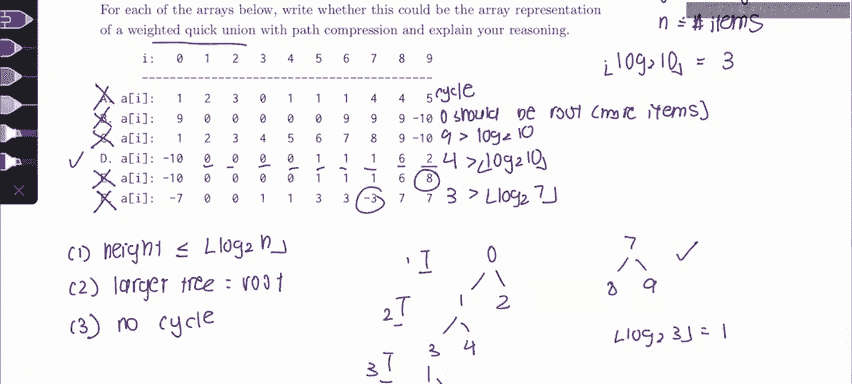

# UCB《数据结构discussion和lab｜CS 61B data structure sp 2024》中英字幕（豆包翻译 - P27：2 - Spring 2023 Exam Level 06 Problem 2.zh_en - GPT中英字幕课程资源 - BV1i1421x7wC

可南家。If one Russia。

Everyone， this is Sherry and this is a CS61 B spring 2023 exam level 6 walkthrough in this video I'll be going over a problem two disjoint sets。

So just as an overview of this problem， we're given a bunch of arrays that represent disjoint sets and have to say if they're valid or not。

As a reminder the way we represent disjoin sets as a arrays is each index represents the parent。

 so for example the node4 has parent 1， the node0 has parent 1。

 the node 9 has parent5 and one special thing that we have to pay attention to is the negative numbers so one way we can represent the root of a tree because it has no parents is we just put a negative number and then we put the size of the tree that's rooted there so here the negative 10 means that9 is the root of the tree and somewhere below it there's the total size of the tree is going to be 10 items。

Okay， so that's it for the array representation， so what we need to do now is we need to convert these array representations into a diagram so we can more easily visualize it and then say if they're actually possible for a weighted quick union or not。

Let's start with a something you might have already noticed about a is that there's no negative numbers in it and in a moment we're going to see why so let's just start drawing out the parents of everything zero has parent1 one has parent2 two has parent three and then three has parent zero so immediately we know that this is not possible because there's a cycle and one thing about a disjoint set is that it's always represented by tree and trees have no cycles so this is bad because there's a cycle so we're going to cross this out or we're going to say。

Cycle。Okay， now let's move on to part B and let's again let's draw it out using the rules that we know。

 So if we look here we're going to see that we have zero and zeros parent is 9 and then all of these nodes have parent zero so one through5。

1，2，3，4，5 and then6，7 and8 all have parent9 so it's going to look like this。

And then line is the root so it doesn't have a parent。And is this actually possible。

 the answer is no if we're using a weighted quickun and like the problem says we are using a weighted quickun。

 the reason is because you might notice that we kind of have two subtrees here where we have the zero subre and then we have the nine subre up here。

And so that means at some point we must have done something to connect this subtree1 and the subte 2 and if we're actually using a weighted quick union。

 this will be against the rules because zero the tree at zero here is much larger than the tree at nine it has six items instead of four。

 so by the rules of the weighted quickun zero should be the root。

And so this is also not possible because zero should be the root。Because it is larger。

Because there's more items and that's just a property of the weighted quick union because we always make the tree with the more items be the roots of the tree。

Okay， now moving on to part C again we're going to draw this out so we see that this tree is like a very long linear tree where zero has parent1 and one has parent2 and two has parent3 and I'm not going to draw the rest of the tree but the root of our tree is nine and its child is eight so immediately we can see that this is not possible because again one property of a weighted quick union is that it has height。

Less than equal to log2 of n， where n is the number of items。

So obviously we would never have a tree that's like a linear tree like this。

 this has height nine which is much greater than log2 of not and we have 10 items in our tree so the maximum height that our tree could be is log2 10 which is we're going to take the floor of this and this is going to be three so the maximum height of our tree is going to be three and obviously9 is greater than three so we're just going to say nine is greater than log210。

So this is also not possible。Okay， now let's move on to D and let's draw out this。

 so we see here that zero is the root so it doesn't have a parent and then one， two， three。

 and4 I'll have parent zero。And then 67，8 are all connected to one。And then eight is connected to。呃。

Sorry， five， six and seven are all connected to1，567 and then six is connected to eight and then two has child nine so if we look here our tree has height1。

2 and three so this is fine because it's not too tall and there are also no cycles and as you notice here。

 all of the our root has size four and this has size four so everything is okay none of the rules are violated。

So this is actually a this is actually a valid tree。

 so we're going to write a check next to this one。Okay。

Now moving on to part E again zero is the root and then again we have one，2， three。

 four as its children and then six，7， sorry， five， six， seven as a children of one。

 and then we have eight as the child。Of six， but in this one，9 is the child of eight。

 and now this tree has high four because we have one，2，3，4， and again， four is greater than log 2。

10 where we take the floor of this is greater than3， so this is not a valid tree。Okay。

 finally for part F， again， zero is the root and then it has triple one and two。

 and then three and four are here and then five over here。

And then we actually have another root which is seven and both eight and9 are connected to it so this tree is fine because is three items floor of log 23 is one and this tree has height1 so this is valid but this tree has one。

2，3，4，5，6，7 so let's take the floor of the log2 of 7 and this is actually two but if we count the height of our tree is going to be1。

23 and three is greater than two so this is not valid and so we're going to write this is not valid and this is because this tree over here is too tall even though the other tree is actually fine and so we're going to write three is greater than the floor of log 2。

7。Okay， that is it for this problem and here's my weekly exam tip for these disjoint set problems。

 there is basically only three rules to remember when we have disjot sets and we want to consider if it's a valid weighted quick union the first rule is that the height。

Is less than or equal to the floor of log to n， where n is the number of items。

The next rule is that we always connect the smaller。We always make the larger one the root。

 so larger tree。Is the root？And then the last rule is always that there are no cycles since it's a trees and trees have no cycles。

That's it for this problem， please leave any comments or questions below and good luck in the rest of 61b。

