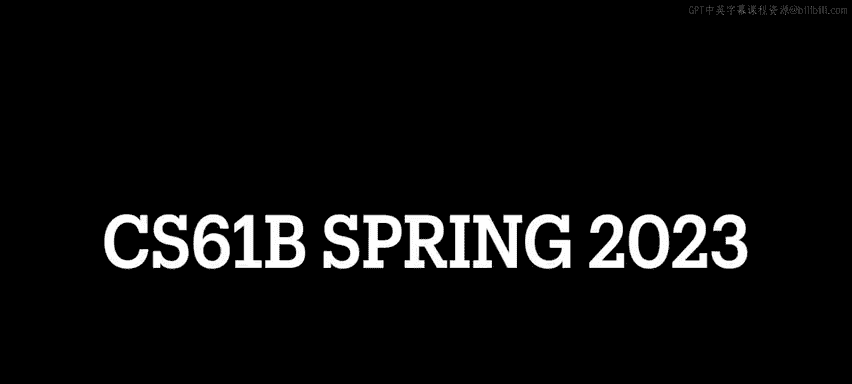
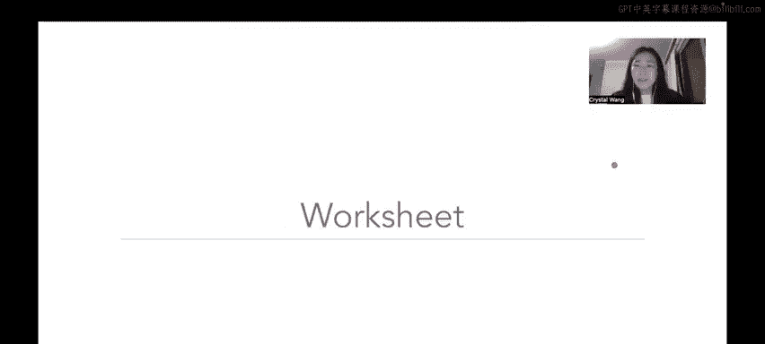

# UCB《数据结构discussion和lab｜CS 61B data structure sp 2024》中英字幕（豆包翻译 - P29：1 - Spring 2023 Discussion 07 Content Review.zh_en - GPT中英字幕课程资源 - BV1i1421x7wC

🎼发明发明。🎼Ba比。

🎼And。🎼Yeah。Hello everyone and welcome to CS6 UNB's Spring 2023's Walkthrough of discussion number7。

 which is about AD0Ts， asymptotics 2 and VSTs。First up， once again。

 some announcements that may or may not be relevant by the time that you're watching this video weekly Survey6 is due on Monday。

 February 27 Lab7， which is about BST map is due on Friday。

 March 3rd Project 2A nordNe is due on Wednesday， March 8 and please please start project2 as soon as you possibly can because its not an easy it's not an easy project so you'll probably want to unlockot yourself as much time as you can get to do it so please start on it early。

So first up for content review we have ADTs and this week we have a very special set of slides from this other TA on staff in Austin。

 you made these really funny super smash pros inspired。😊，🎼Inspired slides about ADTs。

 which are abstract data types。First up a list joins the battle。

 so lists are data structures that are ordered and allow duplicates so what we mean by ordered is that hopefully you're familiar by now like you've seen like an array list or a linked list you can do something like get zero or like get5 where you'd get like the zero element of the list or like the fifth element of the list depending on the order in which you put that element into the list right that's what we mean by the list being ordered a list also allows duplicates So in an example over here let's say we have Apple and index0 and let's say we want to add Apple to our list again。

At index 5， so if we call add to our list and we insert an apple。

 then Apple can appear in both index zero and index 5。So that stands in opposition to a set。

 so a set is a lot like a list， but it's unordered and there's no duplicates So what we mean by unordered is that there isn't like a natural ordering to the set so we can't do something like we did with lists like we can't do like get three where we get the third index three element of the list right a set I like to think of it as like a grab bag of items it's just like a giant sack of items and you can reach in and pull things out but you can't pull them out in like a particular order necessarily Another thing about sets that sets it apart from a list is that sets do not allow duplicates so going back to the example where we had apple in position zero right if we try to add apple and an apple to our set like one times two times five times 10 times after that are set still only contains one instance of Apple like we're not。

Adding more instances of Apple doesn't change the fact that it's in the set like an element is either in the set or it's not right that's what we mean by no duplicates there isn't like a number of there isn't like a number of the same element that can be in a set okay。

Then we have maps which are similar to sets but instead they associate a key with a value so like a set they do not allow duplicate keys you can have duplicate values right because like key value pairs are unrelated to each other but we can't have duplicate keys what I mean by this is like you can kind of think about this like a Python dictionary right in a Python dictionary we associate a key with a value but if we try to associate a key with a different value then we're like wait actually we already have this key in here like what do you actually want me to map to over here that's why we can't have duplicate keys in our hash mapap but we can't have values because the values are not like related to how the keys get looked up in our dictionary right？

😊，Next。We have a Q and a Q is like a list It's ordered。

 but typically it's I would consider a queue like a more specific kind of list in the sense that it's it follows the fi FiO ordering of processing and FiO stands for first in first out So that means that an element that got added earlier to the Q should come out earlier than an element that got added later to the Q So intuitively we can think about this in terms of Q as like the English word right like let's say we are going to。

We are going to a restaurant and we have to wait in a line so we would say we would queue up right so and the person in the restaurant will service us in the order in which we lined up right like so if Jety lined up in front of me then jettty will get serviced at the restaurant before I do right because I'm behind Jetty in the queue that's kind of the idea of first in first out okay。

On the other hand， we have stacks which are a lot like cues but because they're ordered。

 but instead of being first and first out， they're last in first vow and how I remember this in contrast to a queue is like a stack of papers right so when we put a stack of papers usually we pile it on。

😊，Such that the last element that we put on the topmost part of the stack is usually the element we're gonna to take off the stack first right like time speaking。

 if you really wanted to that if you have a stack of paper you could reach in like fish into the very bottom of the stack and pull the paper out like that like you could do that but that's not very intuitive right like our gut instinct when we see a stack of papers is when we want to take the first one off we take the one that was put onto the pile last right so we call that operation a pop we pop it off the stack and then when we put something on top of the stack we call it a push so stack is not like a queue but a queue is fifo it's first and first out and a stack is Lefo it's last in first out that's the main difference and then over here is just like a summary side of like the various abstract data types that we just covered I just like like to use those cute slides that Austin made because they're like a really funny introduction to some ADts。

And in case you wanted to like have that redefined ADTs or abstract data types or data structures that tell us what they do。

 but not how they you are usually represented as interfaces or abstract classes in Java you don't need to know what an abstract class is but you should be familiar with interfaces at this point right like you see that interfaces they tell us what the functionality of something is but not exactly how to do it so an example of this would be like a list。

 a map， a set right or in the context of like project1 a you had to write like a linkless deck and array deck that implemented the deck interface right so it had to have these specific methods like removed first or size or two list that you had to specify inside of your linkless deck or your array deck all right。

And then over here we just have some examples of like the various ADTs you might have already seen in Java。

 so like for example， in like for like the map interface。

 you've probably seen like the hashmap implementation of it and the treemap implementation of it。

 right okay。😊，So shifting gears a little bit to asymptotics so ADTs are interesting when we talk about them in terms of asymptotics because like the kind of ADT or the kind of data structures you use will affect how quickly your programs run right which is why we're talking about them together so we talked a little bit about asymptotics last week in discussion six and that was like some like some like the most surface like asymptotics not too challenging so here we're just going to be giving some advice as opposed to like reviewing asymptotics in depth and then we'll like jump into the worksheet and like you can see all of that in action but if you'd like if you'd like like a very basic overview of asymptotics from like basically square one you might want to check out discussion six content review video for that okay。

😊，So if you're still here and you haven't gone over to discussion6 yet。

 we can jump right into some advice so remember that asymptotic analysis is only valid on very large inputs and comparisons between runtime is only useful when we compare inputs of different orders of magnitude and what we mean by this is like for example if we have some recursive function and the base case says if x is less than1 return5 or something like that like so our base case if x is less than one students sometimes mistakenly think oh。

 if x is like zero or something like that then we're done right this function runs in constant time however we are concerned with asymptotic analysis as x gets really large right like when we start when we first call。

😊，Some function， we want that input to be like 2 billion for quadrillion like a really really absurdly large number right we are not concerned with how the program runs when the when the input is a small value okay。

The next piece of advice we give is that you want to use big theta the tight bound where you can。

 but you won't always have a tight bound so we usually default to the upper bound which we use with big O and remember that we can't define a tight bound if a functions tightest upper and tighttus lower bound do not converge the same value so if the tighttus upper bound and the titus lower bound for a particular function are different are different that means we cannot form a tight bound in which case you would default to big O okay。

Then as a reminder， the total work done， aka， what the function converges to when we're。

Concerned with aymptotic analysis is the sum of all work done per iteration or recursive call if that doesn't make a whole lot of sense right now that's totally fine we'll see this in questions two and three pretty soon and。

😊，A really important thing to know is that while complement themes are helpful。

 rules like nested for loops are always and squared can easily lead you astray because you really need to pay close attention to stopping conditions and how variables update so a really good example of this would actually be in question two where the setup for these loops is almost all the same or they're like very similar and you need to find these like strange little caveats that make it so that when you run these loops you get the desired runtime I will leave you to watch the discussion to video or attempt on your own so you can see what I mean。

😊，And then don't forget to also drop lower order terms when you're simplifying your runtime so let's say we analyze some function F F of n and we figured out that the runtime was n cubed plus 10。

000 n squared minus5 million here we want to drop lower order terms and constant so we' ignore this minus5 million because that's a constant right and we also want to drop this lower order term here because we know that n cubed is going to dominate over n squared because we know that as n gets very very large this n squared term isn't going to contribute very much to the overall runtime because it's going to be primarily determined by this cube is pubbic function sorry okay。

Yeah嗯。And then one more thing about asymptotics advice specifically for recursive problems is that it's usually really helpful to draw out the tree or the structure of method calls in order to help you like find work done per method method call and this is in opposition to like when we do like an iterative asymptotics problem it's usually easier to draw like a table and you can see examples of that back in discussion six and some important things that you might want to consider in your drawing of the recursive tree and your calculations of total work are the height of the tree so this is how many levels will it take for you to reach the base case the branching factors so how many times does the function call itself in the body of the function and work per node how much actual work is done per function call and here we refer to node to mean function call aK it's just like a node in that recursive tree okay。

😊，嗯。And， finally。Bund here we have a life hack pattern matching rule when we want to calculate the total work done where f of n is some function of n so in discussion six we talked about the sums of like one plus two plus3 plus4 plus5 plus all the way up to n would would asymptotically run to n squared and then one plus2 plus4 plus8 plus 16 all the way up to n would asymptotically。

Converge to n it's the same idea here except we're general instead of making instead of looking specifically at n。

 which is the linear function we're generalizing it to be f of n which is just some function F of n right so if we see an arithmetic sum and an arithmetic sum if you don't remember is just a sum in which the terms differ by one or by some constant。

By some constant so this could be like one plus two plus three or like one plus three plus five plus seven where each of the terms differs by two。

 they just need to differ by like a constant。ILike a constant additional factor， basically。

When you see a sum like this， which is arithmetic。This means that the last term squared is going to be how quickly your function runs right so if we think of f of n if we think about like F of n say f of n is like log n。

 this means that if if we saw a sum that went from one plus2 plus3 plus4 plus5 all the way up to plus log n that would be bounded theta bounded by log n squared okay。

Down here we see that one plus two plus4 plus8 this is called a geometric sum in which each of the terms differs by a constant multiplicative factor I can't say that so in an arithmetic sum it differs by a constant additive factor right so it's like plus one in between each term here it's a constant multiplicative factor which is it's like time sum number between each term so like one times two equals 2 two times two equals4 or four times  two equals 8 so on and so forth right？

😊，If we see a geometric sum like this， we will see that it's going to ultimately get theta bounded by F of n。

 which is the last term in this geometric sum okay we say that a geometric sum gets dominated by its largest term which is F of n a function of n right and this rule applies with any geometric factor between terms so you could have the geometric factor B2。

3，5， 10， whatever like we have three over here where it's like one times three is3。

 three times three is9 so on and so forth and generally we can generalize this behavior to mean that when we have a geometric sum it'll get dominated by its final its largest term okay。

Cool。No。Doing problems graphically can be helpful if you're a visual learner。

 so here you might want to plot variable values and calculate the area formula。😊。

This is kind of like an old slide that I just keep in here in the offch that students do actually like to do something like this but personally I'm not like I personally don't really use this kind of graphical representation unless I'm like poking around on Desmos to see approximate runtimes but you could definitely do something like this where like let's say you have a nested for loop like I equals zero running up to n J equals zero running up to I you could plot these against each other and calculate the area formula of like the line against y equals zero of that axis and then get like an approximation I mean you can use it this is just like another tactic if like you are a visual learner but I personally haven't used it very much。

Okay。Now shifting gears one last time the content review let's talk a little bit about binary search trees aka BSTs so binary search trees are data structures that allow us to quickly access elements in sorted order so they have several important properties so very quickly we haven't formally defined what a tree is yet we will do that in next discussion but you kind of can think about it like a node。

😊，That has like children and that was not a very good description like the point is you don't really need to think too hard about what a tree formally means right now。

 but you can kind of think about it like like seeing over here you see a node that has pointers to its children and a binary search tree the binary part of this means that each node has at most two children which means it can have zero1 or two children okay anyways so there are a couple of important properties are invari that all binary search trees need to have so first one is that each node in a BST is a root of a smaller BST。

😊，What we mean by that is let's take a look at this BST over here and this BST is rooted at five right Well if we look down here at this node33 itself is the root of a smaller BST right we can kind of think about this like little subtree down here as itself a BST which is part of this larger BST rooted at five okay so every node to the left of a root has a value lesser than that of the root and likewise every root to the right sorry every node to the right of a root has a value greater than that of the root and the reason why less than in greater than or in quotes is because once again like many other data structures in Java we don't need to have a binary search tree contain only integers or doubles or something that's inherently numerical right we could have like a binary search tree of strings or dogs or cats like they can be the most like random of objects that aren't inherently numerically comparable right so how those comparisons are determined。

😊，M are left up to you as like the programmer and like actually。

Lab 7 this week BST map covers exactly this， which I think is like really， really cool anyway。

 so revisiting this invariant number one， if it didn't make a whole lot of sense。

 let's define that by rules2 and3 Every node to the left of a root has a value lesser than that of the root and every node to the right of root has a value greater than that of the root So if we come down here and we look at the example I was talking about earlier with this node3 I'm saying that three itself is a BST it's the root of a or sorry it's the root of a smaller BST right a smaller BST inside this overall large。

😊，Larger BST that's rooted at five， so I'm arguing that this left sub over here is also still a BST let's follow the invaris。

Every node to the left of the root， which is three has a value lesser than that of the root well the only value less than three。

 I mean to the left of three is one great every node to the right of the root has a value greater than that of the root。

 the value to the right of three is4 it is greater so we can say that this little sub tree over here is itself a BST and you'll find that if you do this for any node in a BST that node itself will indeed be the root of a smaller BST。

😊，Quick caveat about leaf nodes and leaf nodes are just nodes in a tree that don't have children themselves。

 leaf nodes also count as BSTs because we can say that six is the root of a smaller BST right6 is its own root and there is no left or right child So we like these points two and three are trivially true right like there is nothing less than to compare to so basically a single node is considered a binary search tree。

 which is like kind of like silly to think about， but it helps us keep with like our recursive invariance of a BST okay so you'll notice down here that there is two diagrams that look very different So BSTs can be bushy or spinle and the distinction here is that bushy Bss or bushy trees generally we consider it to have approximately at worst log n runtime of operations and the operations in question here are like find aka like given a BST can I。

Find this particular element in my BST or like insert so given this BST。

 like how long does it take for me to like insert this element into my BST？So in a bushy tree。

 this takes approximately o of log n time well its specifically it's going to be specifically。

I don't know why I said specifically twice， but the point is in a bush BST because the branching factor is too right every node is going to have at most two children。

 this is basically log based two of n time which simplifies to log of n time right and you can see this because that's the height of sorry that's the height of a BST that has its nodes like well balanced or well distributed right so let's say we are trying to find one we would start at the root here and say one is less than five so I know that if one is in my BST it would have to be in my left subte so I'm going to come down here I'm going to see this three root and say okay if one is in this subte it has to be in the subte left of the three root here because I know that one is less than three so I'm going to come down here and I'm going to see the one and be like yeahy。

 we found it。So in the worst case that took us log N time log base two of end time where there's seven elements here and the base was two and you can kind of logic this out because we made like three comparisons right we had to compare with the root then we had to compare with the left subchild then we had to compare with that left subchilds left subchild right which was like three comparisons and that's approximately two to the three which is two to the three gives us eight right so log base two of eight would give us three if this is not making a whole lot of sense right now this is like completely fine I just got a little bit maty here in case you had a little bit of trouble like conceptualizing why the height of the tree or these operations is going take like log end time generally speaking you can just kind of think of trees like well- balancedanced trees I mean or bushy trees as having log N operations and the reason for that is because the height of the tree is log N and in the worst case we'd have to go through every level of the tree。

A start at the root of the tree and get all the way down to a leaf and that implies going through every single level of our tree aka traversing the full height of our tree which is login okay that was such a mouthable and I'm very sorry that made no sense。

 but I promise you will pick it up very soon especially as we start doing。😊。

Discussion problems for this week so besides bushy trees we also might get spinle trees so you might look over here and be like wait isn't this like a linked list but this is actually a perfectly valid binary search tree because it obeys all of the invariance that we have every node to the left of a root has a value lesser than that of the root and every node to the right of a root has a value greater than that of the root we see over here we don't have left children so there's nothing compare with we see that it's right child is two which is greater than one two is right child is three which is greater than two so yeah this follows all of the BST invariance but like it looks basically like a linked list right so this is what we would call a spinley binary search tree in which the operations would take at worst linear time so you can imagine that if we just got like horrendously unlucky and we had our binary search tree look like this if we were trying to find something find an element per for example。

😊，And imagine that element was like a leaf then we would have to start at the root and go all the way down basically through this like kind of link list type binary search tree all the way down to the leaf and then we'd find it but then that implies that we would have gone through like every other element which takes like linear time right which is definitely not ideal so you'll notice here on this slide and later in discussion not discussion well yes in discussion but specifically in question4 of this week's discussion you'll notice that BSTs can be very variable in terms of what they look like and their runtime based on how elements get inserted into the binary search tree I'm going to take a look at that in a little bit okay。

So。First up a little bit about BST insertion， items in a BST are always inserted as leaves so let's say given this binary search tree if I wanted to insert a two I'd look at the root first because this should be really the only like part of the BST we have access to right and then I'd say okay two is less than five so I know I need to insert two somewhere to the left of five。

 then I come down here to the subree and I look at the subtre rooted at three and I say okay two is less than three so I know that if I insert two it has to be in the left side of three。

So once again， I'm going to go down to the left side of three and I'm going to look at this one and say。

 okay， I know that。If I insert this two， it's greater than one。

 so it's going to be in the right side of one Oh， but actually one is a leaf node so I can just put two directly as the right child of。

Of that node one， okay？And then here's like a very quick meme that is an inude hopefully a little break for you because this content review has been pretty long and if you don't get this it's a reference to a marvel。

😊，It's it's a reference to like the Marvel franchise like with like thanno snapping his fingers and like half of all life goes away or something like that I don't know don't at me I'm like not a huge marvell fan so I don't know for sure and then also people gave me grief because。

😊，I know that these diagrams themselves are not binary search trees， but like。They're binary trees。

 but they're not binary search trees anyways， just a little mean for you Okay back to the matter I hand let's talk a little bit about deletion。

😊，So we just talked about insertion and how it's always inserted at a leaf right as a leaf sorry deletion can happen in a number of ways and there are a couple of cases to consider and when we delete we delete it via method called Hi deletion so let's say given this BST and we want to delete two。

😊，In this case， the node that we're trying to delete doesn't have any children so it's a pretty easy process so when a node has no children that it implies that it's a leaf right so if it's a leaf then we effectively just cut it out from the tree right we basically come down to this one we started the five we traverse all the way down to the one until we find the two and then we kind of cut off this pointer right so that's like the simplest case。

The next case is what if we want to delete a node that has one child， where does that child go。

 right， so back to the example BST over here if we try to delete one。The child。

 the one child replaces the deleted node， then we act as if the child was deleted in a recursive pattern until we hit a leaf okay。

 so in this case over you here we see that two gets swapped with one and then we already hit a leaf so we're good we don't need to worry about moving anything else。

And then the final case this is like a bit more tricky is what if we tried to delete what if we tried to delete a node that has two children so in this case what if we tried to delete five what should we replace there right so in this case you'll want to pick either the leftmost node on the right subte or the rightmost node in the left subt so either we pick four which is the rightmost node in the left subte or six which is the leftmost node in the right subtree now that sounds kind of like arbitrary and that's such a mouthful but if we break it down and build a little bit of intuition as to why these are our two options。

😊，We know that everything on the left subt of the node that we're trying to delete is going to be less than the node value。

 right？And。What's important is that because everything on the left is smaller than everything on the left of the node we're trying to delete is smaller than the node itself。

 we want to basically get as close as we possibly can to mimicking like the same behavior that that original node had right and so we know that the rightmost node in the left subte is going to be the largest element that was smaller than the node that we're trying to delete so it makes sense for us to bump it up to the node that we're trying to delete okay likewise on the other hand。

 we know that everything to the right of the node that we're trying to delete is greater than the node right so if we pick the leftmost element in the right subte the leftmost element in the right subree represents the smallest value in our BST that is still larger then the node that we're trying to delete which again makes sense because it mimics the behavior of the node we're trying to delete the most all right。

And I think that's at the end of this content review。

 but really quickly I want to note that deletion is actually not on this worksheet。😊。

And we want you all to learn it because it's just like a very cool and elegant algorithm and you might poke around。

 you might consider poking around with it in BSTA， but it's not going to be like super heavily emphasized。

 okay， insertion is really more important here。And yep， that's it for content review。😊。

