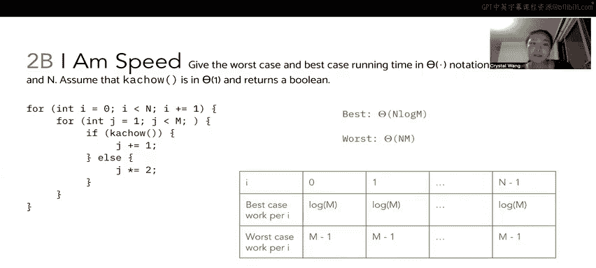

# 数据结构讨论与实验：P31：3 - 算法运行时间分析

在本节课中，我们将学习如何分析给定代码片段的运行时间，并理解如何通过调整循环条件来达到特定的时间复杂度目标。我们将通过一系列示例，从常数时间到指数时间，逐步深入探讨。

## 第一部分：实现对数时间（Θ(log n)）

上一部分我们讨论了如何实现线性时间。本节中，我们来看看如何实现对数时间。

我们有一个与之前几乎相同的代码结构，但这次希望运行时间为 Θ(log n)。回顾之前，我们需要循环进行 n 次迭代，每次执行常数工作，才能达到线性时间。这里，我们需要 log n 次迭代，每次执行常数工作，因为代码只是打印内容。

我们知道循环变量 `i` 从 1 开始，在达到 `n` 之前停止。我们需要在 log n 个时间步内从 1 增长到 n。实现这一点的最简单方法是让 `i` 每次乘以一个常数因子，而不是递增。

例如，我们可以执行 `i *= 2`。这样，`i` 将依次取值为 1, 2, 4, 8, 16, ...，直到大约 n/2。从 1 增长到 n 所需的项数将是 log₂(n)。由于我们忽略常数因子，可以将其概括为 Θ(log n)。你可以将其类比为树的高度，思考如何从树顶到树底。无论是乘以 2、3 还是 4，都需要 log n 的时间，因为这是一个从 1 到 2 再到 4 的跳跃过程。

## 第二部分：实现常数时间（Θ(1)）

接下来，我们看看如何实现常数运行时间。这有些不同。

我们再次遇到一个 `for` 循环，`i` 从 1 开始，每次递增 1，并且每次迭代执行常数工作。在我们的分析表中，`i` 将取值 1, 2, 3, ...，直到一个由停止条件决定的未知值。每次循环迭代执行 1 单位工作。

如何确保它在常数时间内运行？

解决方案是让停止条件基于一个常数，而不是输入 `n`。只要停止条件不依赖于 `n`，无论 `i` 递增多少次，循环都只会运行常数次。例如，无论传入的 `n` 是 0、-5 还是 100 亿，这个循环最多只运行 999 次，因此我们将其视为常数时间。

所以，解决方案就是设置 `i < C`，其中 `C` 是独立于输入 `n` 的某个常数。核心在于停止条件不能基于 `n`。

## 第三部分：实现指数时间（Θ(2ⁿ)）

最后，我们来看一个非常棘手的问题，目标是实现 Θ(2ⁿ) 的运行时间。

我们有一个函数 `f4`，它接受一个数字 `n`，并包含一个嵌套的 `for` 循环。正如在内容回顾中提到的，嵌套循环并不总是给出 n² 的时间复杂度，这取决于停止条件和索引更新条件。

这里确实很巧妙。提示是：思考级数 1 + 2 + 4 + 8 + 16 + ... + f(n) 中的主导项，其中 f 是 n 的某个函数。

我们知道外循环的 `i` 从 1 开始，每次迭代翻倍。所以它将计数为 1, 2, 4, 8, ...，直到某个未知数。

内层 `for` 循环的运行次数取决于 `i` 的值。当 `i` 为 1 时，它运行 1 次；`i` 为 2 时，运行 2 次；`i` 为 4 时，运行 4 次，依此类推。

这意味着 `f4(n)` 所做的总工作量将是 1 + 2 + 4 + 8 + 16 + ... 一直加到某个值。要确定这个值是什么，需要回想一下这个每次翻倍的级数 1 + 2 + 4 + ...，其主导项实际上就是该级数的最后一项 f(n)。这个和的主导项最终收敛于 f(n)。

因此，如果我们希望收敛到 2ⁿ，我们可以简单地将外循环迭代的最后一个值设置为 2ⁿ。因为外循环每次迭代所做的工作取决于外循环的索引值。

如果我们设置 `i < Math.pow(2, n)`（这是在 Java 中写 2ⁿ 的方式），我们将得到一个形如 1 + 2 + 4 + 8 + 16 + ... + 2ⁿ⁻¹ 的和。这个和被 2ⁿ⁻¹ 所主导。忽略常数因子后（例如，2ⁿ⁻¹ 约等于 0.5 * 2ⁿ），这就能给我们期望的 Θ(2ⁿ) 运行时间。

## 第四部分：最佳与最坏情况分析（附加练习）

现在，我们来看一个额外的练习题，它非常适合练习最坏情况和最佳情况下的运行时间分析。

我们想要给出最坏情况和最佳情况下的运行时间，用大 Θ 记号表示，涉及变量 `n` 和 `m`。我们假设 `kachow()` 函数耗时常数，并返回一个布尔值。

这里有两个嵌套的 `for` 循环。外循环从 0 计数到 `n`，每次递增。内层 `for` 循环有点意思：`j` 从 1 开始，只要 `j < m` 就运行循环体，但这里没有为 `j` 设定固定的递增或变化条件。相反，我们看到 `j` 的变化条件取决于 `kachow()` 的结果。

我将像之前的问题一样画一个分析表。首先列出外循环变量 `i` 可能取的值：0, 1, 2, 3, 4, ..., n-1（不包括 n）。然后，我们需要将每次迭代的工作量分为最佳情况和最坏情况。

通常，在寻找最佳和最坏情况时，我会关注分支条件或 `if` 语句。在这里，根据这个 `if` 语句的结果，`j` 会以不同的方式更新。我将重点关注这些更新条件：
*   如果 `kachow()` 为真，则 `j += 1`。
*   否则，`j *= 2`。

在最佳情况下，我们希望找到能使函数最快执行完毕的路径。那么，是 `j` 每次递增 1 直到 `m` 更快，还是 `j` 每次翻倍直到 `m` 更快？

答案是：`j` 翻倍到达 `m` 只需要 log m 个时间步。而如果 `j` 必须每次递增，则需要线性时间。这意味着，在最佳情况下，我们希望 `kachow()` 总是返回 `false`，这样我们就会进入 `j *= 2` 的分支。`j` 会翻倍大约 log₂(m) 次（概括为 log m）直到达到 `m`。

因此，在最佳情况下，外循环 `i` 的每次迭代，我们都会进入 `j` 翻倍的情况，每次迭代产生 log m 的工作量。

现在来看最坏情况，这基本上与我们刚才做的相反。我们试图找出什么会导致函数执行最慢。

在这里，最慢的情况就是 `j += 1` 这一行。如果 `kachow()` 每次都为真，那么我们将执行 `j += 1` 直到 `m`，这需要相对于 `m` 的线性时间。这意味着，对于外循环 `i` 的每一次迭代，都需要线性时间（具体是 m-1 次，但概括为相对于 m 的线性时间）。

现在我们来思考总的运行时间：
*   **最佳情况**：每次 `i` 迭代做 log m 的工作，共有 n 次迭代。总工作量是 **n * log m**。
*   **最坏情况**：每次 `i` 迭代做 m 的工作，共有 n 次迭代。总工作量是 **n * m**。

这是一个有趣的练习题，运行时间取决于两个不同大小的变量。

## 总结

本节课中，我们一起学习了如何通过分析循环结构和更新条件来确定代码的时间复杂度。我们从实现特定时间复杂度（对数、常数、指数）的循环条件设计入手，然后探讨了在存在条件分支时，如何分析算法的最佳和最坏情况运行时间。理解这些概念对于设计和评估高效算法至关重要。