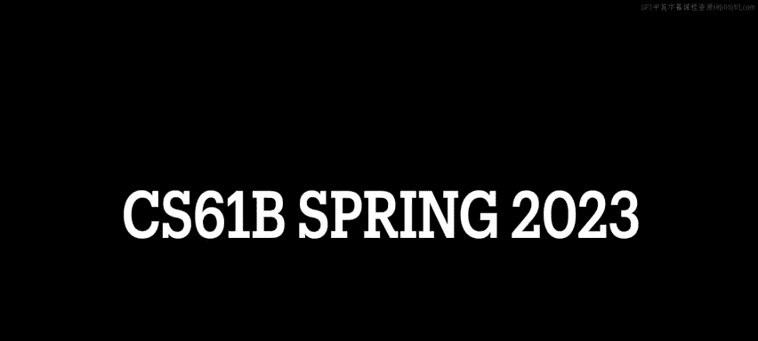
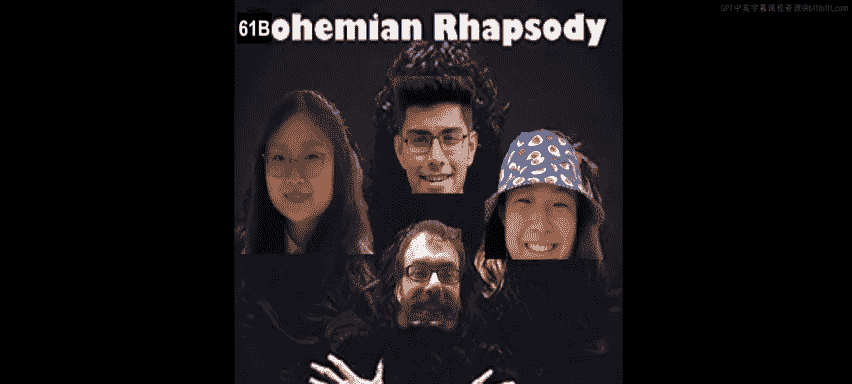
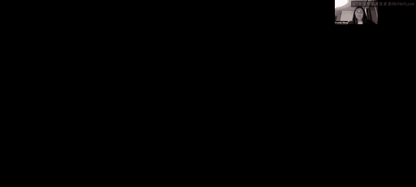
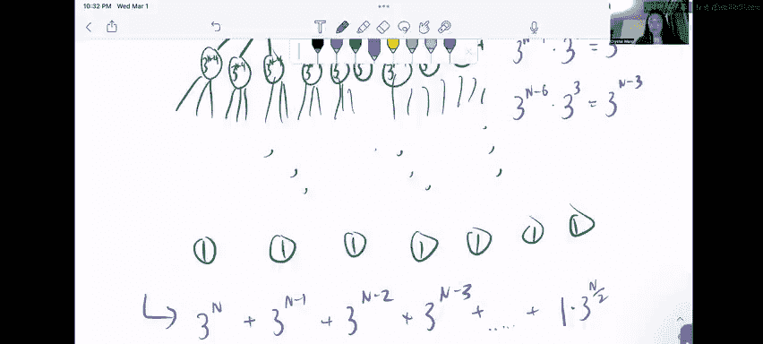

# UCB《数据结构discussion和lab｜CS 61B data structure sp 2024》中英字幕（豆包翻译 - P32：4 - Spring 2023 Discussion 07 Question 3.zh_en - GPT中英字幕课程资源 - BV1i1421x7wC

🎼发 me发 me。🎼Oh你。

Allright， let's now work on question three of this discussion recursive with asymptotics。

 This is basically just some more asymptotics practice， but specifically for recursive functions。

 so we're gonna have a bit of practice drawing out our recursive trees to figure out the asymptotics there and before we begin I just want to say that I'm really happy that you're watching this video because asymptotics as a whole tends to be really confusing like for students and even staff as well so asymptotics generally even when it's iterative seems pretty intimidating and then by the time you get like a recursive function you're like oh gosh。

 this is so difficult and it's like really scary and I totally agree with you like recursion is scary right and now you're being asked to analyze recursive function asymptotically even scarier and I fully admit that when I was a student and I was taking 601 B and I saw asymptotics on my midterm2 I just skip the question I didn't even bother doing it because I was just like too intimidated I was like I don't even understand this but you are。

than me because youre watching this video and you will do so well in that midterm。

 You are going to kick asymptotic butt on the midterm because you are here practicing with me， Okay。

 so。😊，Anyways， let's start with part A curse。 So I've just separated out for the space purposes。

 I've separated out a into its own page。So if we take a look at this function curse here it takes in an int n and then it does a couple of checks so if n is less than or equal to0 we return0 so that's our base case right otherwise we return n plus curse of n minus1 okay so now that we've established that let's break down thinking about our problem into three parts so the first one is branching factor。

😊，So branching factor if we think about our function calls like a tree right is basically asking us how many children does each node have and in simpler terms you can think about it as given that we have this function curse。

 how many times do we see curse get called in the body of curse itself right how many times does the function call itself recursively well if we go in here we'll see that we only see curse one time in the body so we know that the branching factor is going to be one there's only going to be one child per node okay？

Then let's ask ourselves what is the height of the tree Well that depends on the inputs to the function as well as how we're updating the input to the function right so we start at n and we know that the base case is when n is less than or equal to zero。

Otherwise， we return n plus cursive n minus1， so this means that we're decmenting n every time with every recursive call right so the values of the input are going to take on n to n minus1 to n minus2 to n minus3。

 so on and so forth until we hit zero at which case we terminate execution of the recursive function right because we've hit the base case there's nothing else to do so that tells me that the height of the tree is going to be。

N， right， because it takes us N time steps or end calls to get to the bottom of our tree。Lastly。

 work per method call well that's we're basically asking ourselves how much work do we do every time we call curse Well I see here that we make a variable comparison and we make an addition and that seems constant to me we're not doing anything we're not doing like a for loop that counts up to end right like we're not doing like any amount of work that is dependent on n necessarily it's just a variable check as well as an addition and that seems like constant time to me so I'm going to put constant。

And then in parentheses， I'm going to write one to represent that like when we're actually talling up the work that we do。

 we consider constants in multiples of one， okay？So now that we've figured out these three core tenets of this asymptotic function。

 let's now draw our tree okay so we draw our tree by starting or you can draw your tree however youd like。

 but this is how I personally draw my trees when I'm asymptically analyzing a recursive function I start out and I write。

Basically like the function call in the corner and inside of this node。

 I write how much work I do for this particular function call。Basically。

I come down here and I know that we already established that when we just have n。

 we have an addition and we have a variable check and that takes constant time so when we call Cur of n that's going to take us one unit of work。

Right and we also established earlier that the branching factor is one so that means that curse is going to recursively call itself once each time we call curse right curse calls itself once in the body of curse which sounds so recursive anyway ways。

 so we know that this node is going to have one child。😊，And this child。

It's going to represent a call to curse of n minus1 right it's this call right here all right。Well。

 when we have cur of n minus1， once again， we do a variable check。And we also have an addition。

And that is still constant work。RightThose are not dependent on the value of n that gets passed in。

 so we know that when we recurse。We're going to have one child。

That is cur of n minus2 and once again， when we walk through a function。

 we'll see that when the input is n minus2， we'll make a check here and an addition。

 which is still constant work。And so hopefully not by now， you're starting to see a trend going on。

So we only have one child per node and at each node we only do one work right so if I were to draw out the rest of this tree。

And we got to the bottom， and it would be like curse of zero。

Each level of our tree would do constant work， right， So the total。Work done。Is equal to the sum。Of。

All work。Her。Method call。Right so we see here that we have like Cur of n gives us one work。

 Cur of n minus1 takes one work， curse of n minus2 takes one work。

And we've established that it's going to be one work for everything up until and including cursor zero right。

 so we're adding all of our work together。And well like we didn't draw the full tree out。

 but we know that the height of the tree was going to be n right so they were going to be n levels here and at each level we do one unit of work right because we only have one node each so this is effectively being like one plus one plus one plus one n times And if we add that all up。

 it's basically。Going to be an。Work。So our overall runtime。Is equal to big theta of n。Okay。

 so before we move on I'd like to talk a little bit about this notation because I got a really good question about it in discussion so I got asked like why don't we use biggo and why don't we use big omega or like what is like best and worst case right best and worst case we go more into detail in that last week in discussion six but the idea here is that the big theta bound kind of represents like the consistent or like the average case time and so you'll see here that in curse we don't have any like conditional statement that's。

😊，That'll give us like a best or worst case runtime。

In the sense that like there's no if we pass an n equals 1 million every single time we run this curse function it's going to do the same amount of work like there's no possibility of us exiting early or doing less work basically which is why we see that it consistently runs in big theta of end time okay a brief interlude for you if you want to look more about like best case and worst case like definitely revisit discussion six and like exam level discussion six as well it has some really great questions on there okay so。

Part A curse was a bit of like a warm up because it only had one branching factor。

 but we're about to do part B， which has more than one branching factor。

And it's going to get a little more challenging， so stick with me here。 So once again。

 I'm going to write about。Branching factor。Height of tree。😔，And work。Her。Method。Calm， okay。

So we're asked to find a runtime bound for the code below this function silly。

 we can assume that the assist array copy method takes linear time where n is the number of elements being copied over and then here's SRC pause and dust pause are the starting points in the source and destination arrays to start copy and pasting in respectively and length is the number of elements copied so。

This is the official signature for a system array copy which you may or may not be familiar with basically it just takes into two arrays and then it copies over the elements of one array over to the other and length tells us how many elements we're copying over okay so let's break down this silly function so silly takes in an integer array if the array link is less than or equal to one we like print something and then we return。

Very important to know， I mentioned this in Con review， but remember， remember， remember。

 it is so important。That when you're doing a recursive asymptotic analysis question。

 you cannot necessarily look at the base case and be like oh。

 if the array length is less than or equal to one， we return immediately so this best case scenario it's going to run in constant time that's not necessarily true right because the array。

We're concerned with asymptotics as the input size gets very。

 very large right so when we are considering this function asymptotically we are expecting the array length to be like 5 billion right it's never going to start out at one so we can't say that it runs in constant time all right。

Just a quick aside pre。Okay， anyway， so this is our base case。😊，Now， in line 7，8 and 9， we see that。

Seven， we do say newlen is equal to the array length divided by two。And then in eight and9。

 we make a first half array and a second half array， both of length， new length。

 So basically we made the first half array and second half array。And they are both of length。

 half of the original length of the array。Now when we come down to lines 11 and 12 we see two system array copy calls and what's important here is that they're copying over new L elements so we're copying over new align elements to the first half and we're copying newL elements to the second half basically we're taking we're copying over the first newL elements of the original array into the first half and likewise we're copying the second half right the second newL elements of our original array into the second half array okay that we recursse down here we call silly on first half and silly on second half。

Okay。Let's break down。This function into the three core tenets of our recursive function。

 so the branching factor， how many times does silly call itself in the body of silly？

We see down here we have silly called once and silly called twiceys。

 so our branching factor is going to be two right each node is going to have two children。

 What is the height of the tree， Okay， this one is a little bit tricky， so。We know that。

When we call silly， recursively。Let's say our array length is N。When we call silly recursively。

This input array， its size has strength to n minus2 sorry undivided by2 right because that's what new L is right we specified that first half is an array of length newling。

 which is half of the original array。So when we get inside this silly first half call。

 when we recursively call silly on first half。In that method called when we come down here。

 we're having the array length again right so we really see a pattern that goes from like n to n divided by 2 to n divided by4 to n divided by8。

All the way down until we hit one， right， we hit this base case over here。

And I hope that this looks familiar to you because this looks a lot like a geometric sequence right this looks a lot like each element differs by a constant geometric sorry a constant factor a constant multiplicative factor so if you remember the rules regarding that of what it looks like when you're like in a geometric sum where everything is differing by a constant multiplicative factor。

 you remember that the number of elements that are in here。😊，Is log N。 Okay。

 so that means it takes us log N steps， Aka A log n levels of recursive calls to get to the bottom of our tree to get to our base case from the original call to silly。

 So the height of our tree is going to be。Log and。And once again we're not specifying a base here like I could say log based two event。

 but asymptotically the base of the log does not matter and this is because of change of base change of logarithmic base like arithmetic that you can do I'm not going get into like the nitty gritty there。

 but if you don't believe me you can look it up I promise it works anyways yeah so that's the height of our tree okay。

What about the work per method call， Okay， so over here we do a very。Okay， yeah。

 over here we do a variable assignment， right？We check if array length is less than or equal to one sorry not a variable assignment a variable check so that seems constant to me。

 but then and then over here we have like some new variable creations right these are all constant right if it's built into Java it's basically constant right least these like simple primitive operations where you're like。

😊，Adding or creating a variable or setting something equal to each other。

The work really seems to be done， the crux of the works really seems to be done。

And these system array copy calls okay， so we were told to assume that system array copy takes linear time where our theta of n time where n is the number of elements being copied over so。

I'm going to erase。This。A little bit so we can see this a little bit more clearly。

 So let's say that array， the length is n。And so new length is n divided by 2。

So when we run this system array copy call we're basically copying over new line elements so that's going to do n divided by two work right likewise over here when we make the second system array copy call we are still copying over new line elements and we're told to assume that system data array copy takes。

Linear time proportional to the number of elements that are being copied over right so we know that this is also going to do undivided by two work。

Right。😊，So。When we get the total amount of work done in one function called a silly。

This is basically n divided by2 plus n divided by 2， and that's just and work。Okay。

 so that means that the work per method call is going to be。And。Where n is equal to the array length。

All right， so now that we have all of these。We're ready to start drawing our tree， okay？

So like I started before， we're going to start off with a node， oops。

And this is going to be silly on NRA。And we've established that at the very top level。

 when we have the input original input array， the work permit method call is going to be the array length。

 right so it's just going to be n。So we have that now we have to draw out the rest of the tree。

 so we've established that the branching factor is two right silly calls itself twice in its own body。

 so we know we're going to have。A first called to sillyly， and a second called to silly。

And this is going to be。When to say silly？First half。And silly。Second half。Okay。So now。

 when I recurse onto sillyI on first half， we know that the amount of work that we do per method call is directly dependent on the array length that we pass in。

Well， the array length that we passed in to silly on first half is n divided by two， right？

So we know that this is going to do n divided by two work right because first half is half the length of the original R was and we know that system these two callss system array copy are effectively going to do a amount of work directly proportional to the length of the array that we pass in。

Likewise。Silly on second half， because second half is the length of this array is half of the original length of the original array that we pass in at the top level of our recursion。

 that's also going to do and divide by two。😊，Work and if you are having trouble like visualizing this。

 let's pretend like we are inside a call of silly to second half I'm going to use this in I'm going to draw this in this like light blue color。

So let's say the array is second half。So。When we get over here。

To the system array copy calls new length is half of the length of second half right and we know that the length of second half is n divided by two where n is the length of the original array that we passed in。

 So when we come down here the system array copy call， we're going to do。

N divided by four work in this first call to system array copy and also n divided by four work in this second call to system array copy。

 and when we add those two together n divided by four plus n divided by4， we get n over two。

 which is the length of the array that we passed in to silly for second half。Okay。

 so if that didn't make a whole lot of sense or you're having a bit of trouble chewing on that。

 I would suggest that you pause a video here and then draw it out yourself and like。Basically like。

Tell yourself that this is true。 Convince yourself this is true， okay。So moving on。Once again。

 we know that each node is going to have two children， right， The branching factor is two。

 So inside silly a first half， we are going to make two more recursive calls right。

 So I'm going to call this like silly on。First quarter。

To represent like the first quarter of the array。Second。Quarter。

And then the silly second half call is also going to have two recursive calls right。

 so those recursive call oops those recursive calls I'm going to call them silly on。Third。

Quarter and silly on fourth。Quarter。And so here I'm representing that we're calling silly on the first quarter of the original array that got past in right because we're copying over like the elements。

 and then this is like silly on the second quarter of the array， silly on the third quarter。

 silly on the fourth quarter of the original array。So following the pattern that we had above。

We know that when we call silly on the first quarter of the array。

 the array length is one fourth of the original length and array that we have right。

 so the amount of work that we're going to be doing in Clia first quarter is n divided by four。

And it's actually going to be n divided by four for all of these because all of these the work done is going to be directly proportional to the length of the array that got passed in which at this level was a quarter of the original length of the array right so once again hopefully you're starting to see like a pattern like you you'll imagine that in these next ones it'll be like n dividedivid by a。

😊，Right。I'm not going to draw them all out， but eventually you're going to get to the bottom。

And there's going to be a bunch of nodes。And this is going to be like our base case。

 right we've hit the base case for all of these recursive calls。

 so these are just going to do constant work。So when we want to calculate how much total work we do。

Let's go level by level。So。Per level。So when we do this first level up here。

 the topal level of recursive call， we did end work。

Then when we went down one level recursively right to these two calls to sillyI。

 the first and the second half of silly， in this level。

 the total work we do is n divided by2 plus n divided by two work， which is just n。Right。😊。

Let me move this down a little bit。Yeah， and then next。😊。

Each of these nodes has a re two recursive calls right so in this next level of the tree。

 we see four nodes and each of them do n divided by four work。

 so that's going to be n divided by4 plus n divided by4 plus n divided by4。Let's end divided by four。

 that's still end work。So hopefully you started to see a trend here where at every level we are going to be doing end work because cumulatively the total amount of work done across all nodes in that level add up to end that's so cool right？

😊，Anyways， so we're going to get to the bottom and we're going to see the same trend right at the very bottom of our tree。

Let me finish showing this up。At the very bottom of our tree。

We're basically just going to have like this last level do end work as well， right。

 so that means that the total work。Is going to be。The total work per level。

 so summed across all the levels right so that's going to be like n plus n plus n。t dot dot plus n。

And well how many times do we have to add n together right and this is why we talked about the height of the tree in the beginning because we know that at each level of the tree。

 we do end work and if we know the height of the tree， the number of levels in our tree。

You can say that this n plus n+ n thing happens log n times。

Which is basically going to give us a runtime of N log n。All right。Okay。

 so that's it for 2B lastly we're going move on to not 2B a 3B and lastly we're going to move on to 3C which is I think like the hardest question on this worksheet it's really tough and challenging and originally Part C was actually a question that I wrote for like to be like midterm review so don't worry if you don't fully understand right now it's meant to be challenging so once again i'm going to start this off with。

😊，Writing out my branching factor。The height of the tree。And the work。Oops， work per。Method。Call。

Okay。So given that exponential work runs in theta of three to the end time with respect to input and what is the runtime of the Lucy function。

 so the Lucy function takes in an integer N， if n is nothing or equal to one， then we just return。

Otherwise， we make these three recursive calls to Lucy and we also do exponential work。

 which runs in three to the end time。Okay， let's break this down what's our branching factor so？

How many times do we see Lucy call itself in the body of Lucy， we see Lucy one， two， three times。

 so the branching factor is going to be three and each node in our tree is going to have three children。

Now what is the height of the tree This one I think trips students up a little bit。

 but basically the height of the tree is dependent on the size of the step that you take each time you update the input to the recursive function right so over here you'll see that every call to Lucy decrements n by two So the inputs to Lucy are going to take on the values of n and minus2 and minus4 and minus6 n minus a all the way until we hit and being less than or equal to1 right so that's basically the same thing as the case in which we did like let's pretend like this is like n minus1 this is basically the same case as this where we're taking n steps to get to。

One， except we're taking a step size of two now right which means that it takes us half the amount of time to get to the bottom of the tree it takes us half the amount of time to reach our base case right so instead of the height being n the height of our tree is going to be。

And divided by two。Okay， once again convince yourself that that's true。

 you can like write out an example if you really want to， but it's it's true。

 I promise you can convince yourself that it's true like pause the video or something， okay。

Now lastly， you want to look at work per method call。So the Lucy function。

 it doesn't seem to be doing very much right now， but it does have this big call to exponential work。

 which tells us it's going to run in three to the end time so we can just say that the worker method call is going to be three to the n where n is the input size。

To Lucy。Okay， and with that， we're ready to get started on drawing or tree so once again。

Let's start with this node。And I'm going to say this is Lucy of N。

We know that in the initial call to Lucy of N， we do three to the N work。

 right because we establish that the work per method call is3 to the n where n is the input size to Lucy。

And next， we know that Lucy's branching factor is three。

 each node in this tree is going to have three children because Lucy calls itself three times， right？

Actually going to。Oo， actually maybe I won't move that we're going to branch this out three times to three different notes。

😊，And each of these is going to be。On Lucy of n minus2 right because these all make like the same call right to Lucy of n minus2 so this is like I'm writing this to represent the function calls for this whole row。

 okay。So。Once again， we come into these nodes and we say， how much work do we do？In this method call。

 when the input is n minus2。Well， we establish that the work per method call is going to be3 to the n where n is the input size to Lucy。

 so in this case when the input size is n minus2， we'll do three to the n minus2 work。

And then once again， because our branching factor is three。

 we're going to have three children per node。So。At this level the function is represented by Lucy2 sorry not Lucy2 it's Lucy of n minus4 right so Lucy of n minus4 is representative of all of these nine nodes down here so when the input is n minus4。

😊，The work done per method column is going to 3， be3 to the n minus-4。Per node3 to the n minus4。

R to the n minus4，3 to the n minus4，3 to the n minus4。Like writing this again and again。Oops。

And then each of these three nodes is going to have three children right and I'm not going to draw this all out because it's going to get messy like very quickly。

 but eventually。😊，We're going to hit the bottom and we're going to have like a ton of nodes down here that all do constant work because this is the base case。

Right。So let's see if we can find a pattern done in the work here， okay？U。

I'm going to do this in purple over here， so I'm going to say work。Her level。This is like very crap。

 very sorry did not think this through， but at the very top level。

 right when we initially make this call to Lucy we see that this does three to the end work。😊，Right。

😊，Then in the next level down， when Lucy first branches out into the three nodes。

 we see that it does。Three to the n minus two work three times right so there's three nodes that each do three to the n minus2 work so we can just multiply this out actually let me make this purple。

You can multiply this out three to the n minus2 times 3。And if you remember your rules of exponent。

 this is basically。3 to the one times3 to the n minus2。

 and when you're multiplying two numbers that have the same the two exponential numbers that have the same base。

You'll want to just combine the expon with addition。

 So this is basically saying three to the n minus2 plus1， which is going to give us。Three。

 two the and minus one。Okay。😊，Now， when we come down to this level over here， we have。😊。

3 to the n-4 times。3 squared and the reason why I wrote it like that is so we can see the exponence easily。

 but basically。We do three to the n-4 work in9 of these nodes， right， and three squared is 9。

 So I just rewrote 9 like that。 And once again， we're going to simplify this with our exponent rules into。

3 to the n minus2。系い。And then I didn't draw it out。

 but at the next level you can imagine it would look something like this three to the n minus6 times and then each of these nine nodes has three children so that's nine times three nodes in the next level。

 so that's 27 nodes in the next level， so we're going to have three to the three AK27 nodes in the next level doing three to the n minus6 work each which is going to give us three to the n minus three work at the next level down。

Okay， so hopefully you're looking at these and you're starting to see a pattern form。Okay。

Let's come down here and write it out so we see a three to the n。

Plus a3 to the n minus1 plus3 to the n minus2 plus3 to the n minus3。

I hope this seems familiar to you because it looks awfully a lot I mean it looks an awful lot like a geometric sum right remember that a geometric sum is a sequence in which each of the elements differs by some constant multiplicative factor and in that in this case the constant multiplicative factor is three。

RightSo3 to the n minus3 times 3 is going to be 3 to the n minus23 to the n minus2 times3 is3 to the n minus13 to the n minus1 times3 is3 to the n right so this is the constant multiplicative factor we're seeing in this geometric sequence and if you remember。

And this geometric sum。嗯。Or right like if you remember about geometric sums。

It's that when we're trying to analyze a function that has a geometric sum asymptotically。

 its largest term dominates the sum overall， so basically we can see that because this is just a big geometric sum。

 we can say that this function is theta bounded by three to the n。Okay。

 so I hacked this a little bit。Admittedly， because unlike the other questions。

 I didn't do anything with the height of the tree。But we can draw that out if we want to be particularly rigorous about this。

Let's say。We want to find out what our last term is going to be well the height of the tree that we established up here is n divided by two and if we follow this pattern over here。

With。With the work done per level and everything， we'll see that by the time we get to this bottom row where everything is just constant work。

 that'll basically be。One work times times the number of nodes that are at the bottom of the tree right and we'll see that based on this pattern that we have the number of nodes that we have at each level of the tree is directly relevant to the level of the tree that we're at so at level zero of the tree we have one node at level one of the tree we have three nodes which is three to the one at level two of the tree we have three to the two nodes which is nine right so when we get to the bottom of our tree which is level n divided by two right because that's the height of our tree。

That's just going to tell us how many nodes that we have so we're going to have。

One work done by three to the end divided by two nodes。ok。

